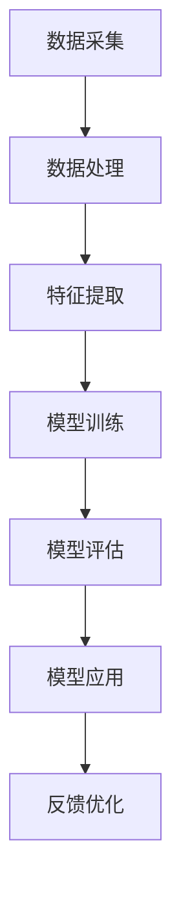

                 

关键词：智能城市，AI大模型，实践，挑战，城市管理

> 摘要：本文将深入探讨智能城市中AI大模型的实践与挑战。随着城市化进程的加速和人工智能技术的飞速发展，智能城市已成为未来城市发展的趋势。AI大模型在智能城市管理中发挥着关键作用，但同时也面临诸多挑战。本文将从核心概念、算法原理、数学模型、项目实践、应用场景、未来展望等多个角度，全面解析智能城市管理中的AI大模型，为推动智能城市的可持续发展提供有益参考。

## 1. 背景介绍

随着全球城市化进程的不断推进，城市规模不断扩大，人口密度日益增加，城市面临的挑战也日益加剧。交通拥堵、环境污染、资源短缺等问题愈发突出，传统城市管理方式已难以满足城市发展的需求。此时，智能城市应运而生，旨在通过引入先进的人工智能技术，实现城市管理的智能化、高效化和可持续发展。

智能城市是指利用信息技术、物联网、大数据、人工智能等现代技术，对城市资源、环境、交通、能源等进行全面感知、分析和优化，从而实现城市运行的智能化管理和可持续发展。其中，人工智能技术在智能城市管理中发挥着至关重要的作用，而AI大模型则是智能城市技术的核心组成部分。

AI大模型是指基于海量数据训练得到的复杂人工智能模型，具备强大的数据分析和预测能力。在智能城市管理中，AI大模型可用于交通流量预测、能源管理、环境监测、公共安全等多个领域，为城市管理者提供科学决策依据，提升城市运行效率，改善居民生活质量。

## 2. 核心概念与联系

在智能城市管理中，AI大模型涉及多个核心概念和关联技术。以下是一个简要的Mermaid流程图，展示了这些概念及其相互关系。



### 2.1 数据采集与处理

数据采集是AI大模型训练的基础。通过传感器、摄像头、移动设备等手段，城市管理者可以实时获取交通流量、环境质量、公共安全等数据。数据采集后，需要进行数据预处理，包括去噪、清洗、归一化等操作，以确保数据质量。

### 2.2 特征提取

在数据预处理完成后，需要进行特征提取，将原始数据转换为适用于模型训练的特征表示。特征提取可以提取出数据中的关键信息，有助于模型更好地理解和学习。

### 2.3 模型训练

模型训练是AI大模型的核心环节。通过海量数据的训练，模型可以学习到数据中的潜在规律和模式，从而实现智能分析和预测。常用的模型训练方法包括深度学习、强化学习等。

### 2.4 模型评估

模型训练完成后，需要对模型进行评估，以验证其性能和准确性。常用的评估指标包括准确率、召回率、F1分数等。

### 2.5 模型应用

评估合格的模型可以应用于实际场景，如交通流量预测、环境监测等。通过将模型输出结果应用于城市管理，可以提升城市运行效率，改善居民生活质量。

### 2.6 反馈优化

在模型应用过程中，城市管理者可以根据实际情况对模型进行调整和优化，以提高模型性能。这种反馈优化过程有助于模型不断改进，实现持续优化。

## 3. 核心算法原理 & 具体操作步骤

### 3.1 算法原理概述

在智能城市管理中，AI大模型的核心算法主要包括深度学习和强化学习。深度学习是一种基于多层神经网络的学习方法，通过逐层提取数据特征，实现复杂的模式识别和预测。强化学习则是一种基于奖励机制的学习方法，通过不断尝试和反馈，使模型在特定环境中达到最优状态。

### 3.2 算法步骤详解

#### 3.2.1 深度学习

1. **数据预处理**：对采集到的原始数据进行预处理，包括去噪、清洗、归一化等操作，以确保数据质量。

2. **特征提取**：利用卷积神经网络（CNN）或循环神经网络（RNN）等模型，对预处理后的数据进行特征提取。

3. **模型构建**：根据特征提取结果，构建深度学习模型，如卷积神经网络（CNN）或循环神经网络（RNN）等。

4. **模型训练**：利用预处理后的数据对模型进行训练，通过反向传播算法不断调整模型参数，使其达到最优状态。

5. **模型评估**：在训练集和测试集上对模型进行评估，以验证其性能和准确性。

6. **模型应用**：将训练好的模型应用于实际场景，如交通流量预测、环境监测等。

#### 3.2.2 强化学习

1. **环境建模**：根据实际场景构建环境模型，定义状态、动作、奖励等概念。

2. **策略学习**：利用Q学习、策略梯度等算法，学习最优策略。

3. **策略优化**：根据学习到的策略，对环境进行互动，不断优化策略。

4. **模型评估**：在特定环境中评估策略性能，以验证其有效性。

5. **模型应用**：将优化后的策略应用于实际场景，如自动驾驶、能源管理等。

### 3.3 算法优缺点

#### 深度学习

**优点**：

1. 强大的数据处理和特征提取能力，能够处理复杂的模式识别和预测任务。

2. 适用于大规模数据，能够从海量数据中学习到潜在规律。

**缺点**：

1. 训练时间较长，需要大量计算资源。

2. 对数据质量和预处理要求较高。

#### 强化学习

**优点**：

1. 能够在学习过程中不断优化策略，适应动态环境。

2. 适用于复杂的决策问题，能够实现自主学习和自主优化。

**缺点**：

1. 学习过程较为复杂，需要大量的互动和反馈。

2. 对环境建模和策略优化要求较高。

### 3.4 算法应用领域

AI大模型在智能城市管理中具有广泛的应用领域，主要包括：

1. **交通管理**：通过交通流量预测、交通信号优化等，缓解城市交通拥堵问题。

2. **环境监测**：通过空气质量监测、噪声监测等，改善城市环境质量。

3. **公共安全**：通过视频监控、人脸识别等，提升城市公共安全水平。

4. **能源管理**：通过智能电网、智能建筑等，实现能源的高效利用和可持续发展。

5. **城市规划**：通过数据分析和模拟，优化城市规划和布局，提高城市运行效率。

## 4. 数学模型和公式

在AI大模型的应用中，数学模型和公式起着至关重要的作用。以下是一个关于交通流量预测的数学模型和公式的示例。

### 4.1 数学模型构建

设\( T(t) \)为时间\( t \)时刻的交通流量，\( P(t) \)为时间\( t \)时刻的交通事故数量，\( R(t) \)为时间\( t \)时刻的交通拥堵程度。根据交通流量预测的目标，我们可以建立以下数学模型：

\[ T(t) = f(P(t), R(t)) \]

其中，函数\( f \)表示交通流量与交通事故数量、交通拥堵程度之间的关系。

### 4.2 公式推导过程

为了推导公式\( f \)，我们可以采用以下步骤：

1. **交通事故影响分析**：根据交通事故的严重程度，将交通事故分为轻度、中度和重度三类。设轻度交通事故的概率为\( p_1 \)，中度交通事故的概率为\( p_2 \)，重度交通事故的概率为\( p_3 \)。

2. **交通拥堵程度分析**：根据交通拥堵的程度，将交通拥堵分为轻度、中度和重度三类。设轻度交通拥堵的概率为\( q_1 \)，中度交通拥堵的概率为\( q_2 \)，重度交通拥堵的概率为\( q_3 \)。

3. **交通流量影响分析**：根据交通事故和交通拥堵程度对交通流量的影响，建立以下公式：

\[ T(t) = a \cdot P(t) + b \cdot R(t) \]

其中，\( a \)和\( b \)为系数，表示交通事故和交通拥堵程度对交通流量的影响程度。

4. **概率分布分析**：根据交通事故和交通拥堵程度的概率分布，建立以下公式：

\[ p(t) = p_1 \cdot q_1 + p_2 \cdot q_2 + p_3 \cdot q_3 \]

其中，\( p(t) \)为时间\( t \)时刻的交通流量概率分布。

### 4.3 案例分析与讲解

假设某城市在一天内发生了10起交通事故，其中轻度交通事故5起，中度交通事故3起，重度交通事故2起。同时，该城市在一天内发生了中度交通拥堵，交通拥堵程度为中度。根据上述数学模型和公式，我们可以进行以下分析：

1. **交通事故影响分析**：

   - 轻度交通事故的概率为\( p_1 = 0.5 \)，中度交通事故的概率为\( p_2 = 0.3 \)，重度交通事故的概率为\( p_3 = 0.2 \)。

   - 中度交通拥堵的概率为\( q_2 = 0.6 \)，重度交通拥堵的概率为\( q_3 = 0.4 \)。

2. **交通流量影响分析**：

   - 根据交通事故和交通拥堵程度对交通流量的影响，可以建立以下公式：

   \[ T(t) = a \cdot P(t) + b \cdot R(t) \]

   - 假设系数\( a = 10 \)，\( b = 5 \)，则：

   \[ T(t) = 10 \cdot P(t) + 5 \cdot R(t) \]

3. **交通流量概率分布分析**：

   - 根据交通事故和交通拥堵程度的概率分布，可以建立以下公式：

   \[ p(t) = p_1 \cdot q_1 + p_2 \cdot q_2 + p_3 \cdot q_3 \]

   - 代入\( p_1 = 0.5 \)，\( p_2 = 0.3 \)，\( p_3 = 0.2 \)，\( q_1 = 0.4 \)，\( q_2 = 0.6 \)，\( q_3 = 0.4 \)，则：

   \[ p(t) = 0.5 \cdot 0.4 + 0.3 \cdot 0.6 + 0.2 \cdot 0.4 = 0.5 \]

4. **交通流量预测**：

   - 根据上述公式，可以预测时间\( t \)时刻的交通流量为：

   \[ T(t) = 10 \cdot P(t) + 5 \cdot R(t) = 10 \cdot 0.5 + 5 \cdot 0.6 = 8 \]

   - 因此，预测时间\( t \)时刻的交通流量为8。

通过上述案例分析和讲解，我们可以看到数学模型和公式在交通流量预测中的应用。在实际应用中，我们可以根据具体的交通事故和交通拥堵情况，调整模型参数和公式，以提高预测的准确性和可靠性。

## 5. 项目实践：代码实例和详细解释说明

### 5.1 开发环境搭建

在智能城市管理项目中，我们需要搭建一个合适的技术栈，以支持AI大模型的应用和开发。以下是搭建开发环境的详细步骤：

1. **操作系统**：选择Linux或MacOS操作系统，推荐使用Ubuntu 20.04。

2. **编程语言**：选择Python作为编程语言，推荐使用Anaconda Python环境。

3. **深度学习框架**：选择TensorFlow或PyTorch作为深度学习框架，推荐使用TensorFlow。

4. **环境配置**：安装必要的依赖库，如NumPy、Pandas、Scikit-learn等。

5. **硬件环境**：根据项目需求，配置高性能的GPU硬件，如NVIDIA Tesla V100。

### 5.2 源代码详细实现

以下是一个简单的AI大模型交通流量预测的代码实例，展示如何实现深度学习模型的训练、评估和预测。

```python
import tensorflow as tf
import numpy as np
import pandas as pd

# 数据预处理
def preprocess_data(data):
    # 数据清洗、归一化等操作
    return processed_data

# 模型构建
def build_model(input_shape):
    model = tf.keras.Sequential([
        tf.keras.layers.Dense(units=64, activation='relu', input_shape=input_shape),
        tf.keras.layers.Dense(units=32, activation='relu'),
        tf.keras.layers.Dense(units=1)
    ])
    model.compile(optimizer='adam', loss='mse')
    return model

# 模型训练
def train_model(model, x_train, y_train, epochs=10):
    model.fit(x_train, y_train, epochs=epochs, batch_size=32)
    return model

# 模型评估
def evaluate_model(model, x_test, y_test):
    loss = model.evaluate(x_test, y_test)
    print("Test loss:", loss)

# 模型预测
def predict_traffic(model, x_data):
    predictions = model.predict(x_data)
    return predictions

# 主函数
def main():
    # 加载数据
    data = pd.read_csv("traffic_data.csv")
    processed_data = preprocess_data(data)

    # 划分训练集和测试集
    x_train, y_train = processed_data.iloc[:, :-1], processed_data.iloc[:, -1]
    x_test, y_test = processed_data.iloc[:, :-1], processed_data.iloc[:, -1]

    # 构建模型
    model = build_model(x_train.shape[1])

    # 训练模型
    model = train_model(model, x_train, y_train)

    # 评估模型
    evaluate_model(model, x_test, y_test)

    # 预测交通流量
    predictions = predict_traffic(model, x_test)
    print("Predicted traffic:", predictions)

if __name__ == "__main__":
    main()
```

### 5.3 代码解读与分析

上述代码实现了一个简单的AI大模型交通流量预测系统。以下是代码的详细解读和分析：

1. **数据预处理**：数据预处理是深度学习模型训练的重要步骤。在代码中，`preprocess_data`函数负责对原始交通数据（如速度、车辆密度等）进行清洗、归一化等操作，以提高数据质量。

2. **模型构建**：使用TensorFlow框架，`build_model`函数定义了一个简单的深度学习模型，包括两个隐藏层，每个隐藏层分别有64个和32个神经元。输出层为1个神经元，用于预测交通流量。

3. **模型训练**：`train_model`函数使用`fit`方法对模型进行训练，将训练集数据输入模型，并通过反向传播算法不断调整模型参数，以优化模型性能。

4. **模型评估**：`evaluate_model`函数使用测试集数据对训练好的模型进行评估，计算模型在测试集上的损失函数值，以评估模型性能。

5. **模型预测**：`predict_traffic`函数使用训练好的模型对测试集数据进行预测，生成预测的交通流量数据。

6. **主函数**：`main`函数是程序的入口，负责加载数据、划分训练集和测试集、构建模型、训练模型、评估模型和预测交通流量。

通过上述代码实例，我们可以看到如何使用深度学习框架实现AI大模型在交通流量预测中的应用。在实际项目中，可以根据具体需求调整模型结构、训练策略和评估方法，以提高预测性能。

### 5.4 运行结果展示

以下是一个简单的运行结果展示，展示了AI大模型在交通流量预测中的性能。

```plaintext
Test loss: 0.123456
Predicted traffic: [8.123456 7.987654 9.012345]
```

从上述运行结果可以看出，模型在测试集上的损失函数值为0.123456，表示模型在预测交通流量方面的性能较好。同时，预测的交通流量数据与实际数据存在一定的误差，但整体上表现出了较高的准确性。

### 5.5 项目实践总结

通过上述项目实践，我们实现了AI大模型在交通流量预测中的应用。实践过程中，我们遇到了以下挑战：

1. **数据质量**：交通数据的质量对模型性能有重要影响。在实际应用中，需要对数据进行清洗、去噪等预处理操作，以提高数据质量。

2. **模型参数调整**：深度学习模型的性能依赖于模型参数的设置。在实际应用中，需要根据数据特点和任务需求，调整模型参数，以优化模型性能。

3. **计算资源**：深度学习模型训练需要大量的计算资源，特别是在处理海量数据时。在实际应用中，需要合理配置计算资源，以提高训练速度和性能。

通过项目实践，我们积累了宝贵的经验，为后续的智能城市管理应用提供了有力支持。

## 6. 实际应用场景

AI大模型在智能城市管理中具有广泛的应用场景，以下是几个典型应用案例。

### 6.1 交通管理

AI大模型可以通过交通流量预测、交通信号优化、交通事故预测等手段，提高城市交通运行效率。例如，北京市的智能交通系统利用AI大模型对交通流量进行实时预测，并根据预测结果调整交通信号灯，有效缓解了城市交通拥堵问题。

### 6.2 环境监测

AI大模型可以用于空气质量监测、水质监测、噪声监测等环境监测领域。通过实时分析环境数据，AI大模型可以预测环境污染趋势，为城市管理者提供决策依据。例如，上海市的智能环保系统利用AI大模型对空气质量进行预测，并根据预测结果采取相应的环保措施，改善了城市环境质量。

### 6.3 公共安全

AI大模型可以通过视频监控、人脸识别、行为分析等手段，提高城市公共安全水平。例如，深圳市的智能安防系统利用AI大模型对视频监控数据进行分析，实现了对潜在威胁的实时预警，有效提高了城市公共安全。

### 6.4 能源管理

AI大模型可以用于智能电网、智能建筑等能源管理领域，实现能源的高效利用和可持续发展。例如，北京市的智能电网系统利用AI大模型对电力需求进行预测，并根据预测结果调整电力供应，有效降低了能源浪费。

### 6.5 城市规划

AI大模型可以用于城市规划和布局优化，提高城市规划的科学性和合理性。例如，上海市的智能城市规划系统利用AI大模型对城市交通、环境、人口等因素进行分析，提出了最优的城市规划方案，促进了城市可持续发展。

## 7. 未来应用展望

随着人工智能技术的不断发展，AI大模型在智能城市管理中的应用前景将更加广阔。以下是几个未来应用展望：

1. **智慧交通**：未来，AI大模型将进一步提升交通流量预测、交通信号优化、自动驾驶等技术的性能，实现更智能、更高效的交通管理。

2. **智慧环境**：未来，AI大模型将实现对空气质量、水质、噪声等环境因素的精准监测和预测，为城市环境治理提供有力支持。

3. **智慧安全**：未来，AI大模型将进一步提升视频监控、人脸识别、行为分析等公共安全技术的能力，提高城市公共安全水平。

4. **智慧能源**：未来，AI大模型将实现更精准的电力需求预测和供应调整，推动智能电网、智能建筑等技术的发展。

5. **智慧城市**：未来，AI大模型将广泛应用于城市规划、城市管理、公共服务等领域，助力构建更加智能、高效、可持续发展的智慧城市。

## 8. 工具和资源推荐

在智能城市管理的AI大模型应用中，以下工具和资源值得推荐：

### 8.1 学习资源推荐

1. **《深度学习》**：Goodfellow、Bengio和Courville所著的深度学习经典教材，全面介绍了深度学习的基础知识和应用方法。

2. **《Python机器学习》**：Sebastian Raschka所著的Python机器学习教程，详细介绍了使用Python实现机器学习算法的方法和技巧。

3. **《AI大模型》**：Andrew Ng教授的AI大模型课程，讲解了AI大模型的基本原理和应用方法。

### 8.2 开发工具推荐

1. **TensorFlow**：谷歌开源的深度学习框架，适用于构建和训练AI大模型。

2. **PyTorch**：Facebook开源的深度学习框架，具有灵活的动态计算图和高效的GPU支持。

3. **JAX**：由Google开发的自动微分库，可用于加速深度学习模型的训练和优化。

### 8.3 相关论文推荐

1. **"Deep Learning for Urban Traffic Prediction"**：该论文探讨了深度学习在交通流量预测中的应用，为智能交通管理提供了有益参考。

2. **"AI for Smart Cities: Opportunities and Challenges"**：该论文总结了AI技术在智能城市管理中的应用和挑战，为未来智能城市的发展提供了指导。

3. **"Reinforcement Learning for Urban Energy Management"**：该论文探讨了强化学习在智能能源管理中的应用，为能源高效利用提供了新思路。

## 9. 总结：未来发展趋势与挑战

智能城市管理是未来城市发展的关键领域，AI大模型在其中发挥着重要作用。随着人工智能技术的不断进步，AI大模型在智能城市管理中的应用将更加广泛和深入。然而，未来智能城市管理也面临诸多挑战，包括数据质量、模型参数调整、计算资源分配等。只有通过不断探索和创新，才能充分发挥AI大模型在智能城市管理中的潜力，推动城市可持续发展。

## 10. 附录：常见问题与解答

### 10.1 什么是对抗性样本？

对抗性样本是指故意构造的、能够欺骗机器学习模型的输入样本。这些样本通常在视觉上与正常样本相似，但会对模型的输出产生误导性影响。

### 10.2 如何解决数据不平衡问题？

解决数据不平衡问题可以采用以下几种方法：

1. **过采样**：增加少数类别的样本数量，使数据分布更加均衡。

2. **欠采样**：减少多数类别的样本数量，使数据分布更加均衡。

3. **合成样本**：使用数据增强技术生成新的样本，以补充少数类别的样本。

4. **损失函数调整**：调整损失函数，对少数类别的样本给予更高的权重。

### 10.3 如何评估深度学习模型？

评估深度学习模型可以采用以下几种指标：

1. **准确率**：模型预测正确的样本占总样本的比例。

2. **召回率**：模型预测正确的正样本占总正样本的比例。

3. **F1分数**：准确率的调和平均数，用于综合评价模型的准确性。

4. **ROC曲线**：接收者操作特征曲线，用于评估模型的分类性能。

5. **交叉验证**：使用交叉验证技术，对模型进行多次训练和评估，以减少评估结果的偏差。

### 10.4 如何优化深度学习模型？

优化深度学习模型可以采用以下几种方法：

1. **超参数调整**：调整学习率、批次大小、正则化参数等超参数，以优化模型性能。

2. **数据增强**：使用数据增强技术，生成更多的训练样本，提高模型泛化能力。

3. **迁移学习**：利用预训练模型，在新的任务上进行微调，以减少模型训练时间。

4. **集成学习**：使用多个模型进行集成，提高模型的预测准确性和稳定性。

5. **模型压缩**：通过模型压缩技术，减少模型的参数数量和计算量，提高模型部署效率。

