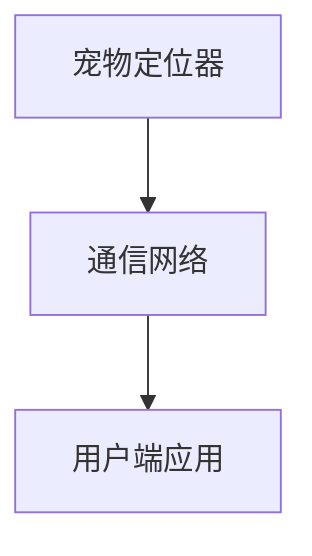
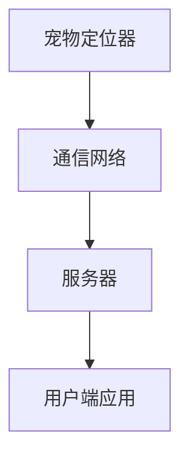

                 

关键词：智能宠物定位、GPS、物联网、AI、宠物安全

> 摘要：随着人们生活水平的提高，宠物已经成为家庭的重要成员。然而，宠物走失问题频发，给宠物主人和宠物本身带来了巨大的困扰。本文将探讨智能宠物定位技术的原理和应用，介绍如何通过科技手段为宠物安全提供强有力的守护。

## 1. 背景介绍

### 宠物市场现状

近年来，随着社会经济的发展，宠物行业迅速崛起，宠物已经成为很多家庭的“家庭成员”。根据相关数据显示，全球宠物市场规模逐年增长，预计未来几年仍将保持稳定上升态势。特别是在我国，随着人们生活水平的提高和宠物饲养观念的转变，宠物市场的规模也在不断扩大。

### 宠物走失问题

尽管宠物市场的繁荣带来了巨大的经济效益，但宠物走失问题也日益严重。每年都有大量宠物走失，尤其是猫和狗，因为它们有较强的独立行动能力。宠物走失不仅给宠物主人带来了巨大的心理负担，还可能对宠物本身造成无法挽回的损失。因此，如何有效解决宠物走失问题成为了社会关注的焦点。

### 智能宠物定位的需求

为了应对宠物走失问题，智能宠物定位技术的需求日益凸显。智能宠物定位技术可以实时追踪宠物位置，为宠物主人提供有效的宠物管理工具。通过这项技术，宠物主人可以在宠物走失的第一时间内找到宠物，降低宠物走失带来的损失。此外，智能宠物定位技术还可以为宠物提供安全监控、行为分析等功能，进一步提升宠物生活的质量。

## 2. 核心概念与联系

### 智能宠物定位技术原理

智能宠物定位技术主要基于GPS（全球定位系统）和物联网（IoT）技术。GPS技术可以实时获取宠物位置信息，而物联网技术则可以实现宠物定位器的远程监控和管理。

### 智能宠物定位架构

智能宠物定位系统主要包括三个部分：宠物定位器、通信网络和用户端应用。宠物定位器内置GPS模块，可以实时获取宠物位置信息。通信网络负责将宠物定位器的位置信息传输到服务器。用户端应用则通过通信网络获取宠物位置信息，并为宠物主人提供定位、监控等功能。



### 智能宠物定位流程

1. 宠物定位器通过GPS获取宠物位置信息。
2. 宠物定位器将位置信息发送到通信网络。
3. 通信网络将位置信息传输到服务器。
4. 服务器处理位置信息，并存储在数据库中。
5. 用户端应用从服务器获取宠物位置信息，并展示给用户。



## 3. 核心算法原理 & 具体操作步骤

### 3.1 算法原理概述

智能宠物定位的核心算法主要基于GPS定位技术和轨迹预测技术。GPS定位技术可以实时获取宠物位置，而轨迹预测技术则可以根据宠物的历史行为预测未来的位置。

### 3.2 算法步骤详解

1. GPS定位：宠物定位器通过GPS模块获取宠物实时位置。
2. 数据存储：将实时位置信息存储在数据库中。
3. 轨迹分析：分析宠物历史位置数据，预测宠物未来的可能位置。
4. 轨迹显示：将预测的宠物轨迹显示在用户端应用中。

### 3.3 算法优缺点

#### 优点

1. 实时性：GPS定位技术可以实现实时位置追踪，为宠物主人提供及时的信息。
2. 准确性：轨迹预测技术可以根据历史数据预测宠物未来的位置，提高定位准确性。
3. 灵活性：宠物定位系统可以根据用户需求自定义功能，如轨迹记录、行为分析等。

#### 缺点

1. 能耗问题：GPS定位和轨迹预测技术需要消耗大量电能，需要为宠物定位器设计高效的电源管理方案。
2. 环境影响：GPS信号容易受到地形、天气等因素的影响，可能导致定位误差。

### 3.4 算法应用领域

智能宠物定位技术可以广泛应用于宠物安全、宠物行为分析、宠物健康管理等领域。例如，宠物主人可以通过宠物定位系统实时了解宠物的位置，预防宠物走失。同时，通过分析宠物轨迹，可以为宠物主人提供行为建议，帮助宠物更好地适应生活环境。

## 4. 数学模型和公式 & 详细讲解 & 举例说明

### 4.1 数学模型构建

智能宠物定位的数学模型主要包括GPS定位模型和轨迹预测模型。

#### GPS定位模型

GPS定位模型可以表示为：

$$
x(t) = x_0 + v \cdot t
$$

$$
y(t) = y_0 + v \cdot t
$$

其中，$x(t)$ 和 $y(t)$ 分别表示宠物在时间 $t$ 的位置，$x_0$ 和 $y_0$ 分别表示宠物初始位置，$v$ 表示宠物移动速度。

#### 轨迹预测模型

轨迹预测模型可以表示为：

$$
x(t+h) = x(t) + v \cdot h
$$

$$
y(t+h) = y(t) + v \cdot h
$$

其中，$x(t+h)$ 和 $y(t+h)$ 分别表示在时间 $t+h$ 的预测位置，$h$ 表示预测时间间隔。

### 4.2 公式推导过程

#### GPS定位模型推导

假设宠物在时间 $t$ 的位置为 $(x(t), y(t))$，则宠物在时间 $t$ 的速度为 $v$。根据直线运动的基本原理，可以得到：

$$
x(t) = x_0 + v \cdot t
$$

$$
y(t) = y_0 + v \cdot t
$$

其中，$x_0$ 和 $y_0$ 分别表示宠物初始位置。

#### 轨迹预测模型推导

假设宠物在时间 $t$ 的位置为 $(x(t), y(t))$，速度为 $v$，预测时间间隔为 $h$。则宠物在时间 $t+h$ 的位置可以表示为：

$$
x(t+h) = x(t) + v \cdot h
$$

$$
y(t+h) = y(t) + v \cdot h
$$

### 4.3 案例分析与讲解

#### 案例一：宠物走失定位

假设宠物主人发现宠物走失，通过智能宠物定位系统实时追踪宠物位置。根据GPS定位模型，可以计算出宠物在时间 $t$ 的位置，从而帮助宠物主人找到宠物。

#### 案例二：宠物行为分析

通过对宠物轨迹的长期记录和分析，可以了解宠物的行为习惯。例如，通过轨迹预测模型，可以预测宠物在未来的行为轨迹，为宠物主人提供行为建议。

## 5. 项目实践：代码实例和详细解释说明

### 5.1 开发环境搭建

#### 环境要求

1. 操作系统：Windows/Linux/MacOS
2. 编程语言：Python
3. 开发工具：PyCharm/VSCode

#### 安装依赖

```bash
pip install matplotlib numpy pandas
```

### 5.2 源代码详细实现

以下是一个简单的宠物定位和轨迹预测的Python代码实例：

```python
import numpy as np
import matplotlib.pyplot as plt

def gps_location(x0, y0, v, t):
    x = x0 + v * t
    y = y0 + v * t
    return x, y

def predict_trajectory(x0, y0, v, h):
    x = x0 + v * h
    y = y0 + v * h
    return x, y

# 初始位置和速度
x0, y0 = 0, 0
v = 1

# 实时位置
t = 5
x, y = gps_location(x0, y0, v, t)
print(f"实时位置：({x}, {y})")

# 预测位置
h = 2
x_pred, y_pred = predict_trajectory(x, y, v, h)
print(f"预测位置：({x_pred}, {y_pred})")

# 绘制轨迹
plt.plot([x0, x], [y0, y], label='实时位置')
plt.plot([x, x_pred], [y, y_pred], label='预测位置')
plt.legend()
plt.show()
```

### 5.3 代码解读与分析

1. `gps_location` 函数用于计算宠物在时间 $t$ 的位置。
2. `predict_trajectory` 函数用于预测宠物在时间 $t+h$ 的位置。
3. 代码首先定义了宠物的初始位置和速度，然后计算实时位置和预测位置，并绘制轨迹。

### 5.4 运行结果展示

运行代码后，将显示一个包含实时位置和预测位置的轨迹图。

## 6. 实际应用场景

### 6.1 宠物走失定位

宠物主人可以通过智能宠物定位系统实时追踪宠物位置，一旦发现宠物走失，可以立即定位并找回宠物。

### 6.2 宠物行为分析

通过对宠物轨迹的长期记录和分析，可以为宠物主人提供行为建议，帮助宠物更好地适应生活环境。

### 6.3 宠物健康管理

智能宠物定位系统还可以为宠物主人提供宠物健康状况监控，及时发现并处理宠物健康问题。

## 7. 工具和资源推荐

### 7.1 学习资源推荐

1. 《GPS定位原理与应用》
2. 《物联网技术应用》
3. 《Python编程：从入门到实践》

### 7.2 开发工具推荐

1. PyCharm
2. VSCode
3. Git

### 7.3 相关论文推荐

1. "An Overview of GPS Technology for Real-time Animal Tracking"
2. "IoT-Based Smart Pet Tracker System Design and Implementation"

## 8. 总结：未来发展趋势与挑战

### 8.1 研究成果总结

智能宠物定位技术已经取得了显著的研究成果，为宠物安全提供了有力的技术支持。然而，随着技术的不断发展，智能宠物定位技术仍有许多改进空间。

### 8.2 未来发展趋势

1. 定位精度提升：通过引入更多传感器和算法优化，提高宠物定位精度。
2. 节能设计：为宠物定位器设计更高效的电源管理方案，延长续航时间。
3. 智能化升级：结合AI技术，实现更智能的宠物行为分析和健康管理。

### 8.3 面临的挑战

1. 能耗问题：如何为宠物定位器设计更高效的电源管理方案，延长续航时间。
2. 环境影响：如何提高GPS信号的穿透能力和抗干扰能力，降低定位误差。

### 8.4 研究展望

未来，智能宠物定位技术将朝着更智能、更精准、更节能的方向发展。通过技术创新，将为宠物安全提供更全面、更高效的科技守护。

## 9. 附录：常见问题与解答

### 9.1 智能宠物定位技术的原理是什么？

智能宠物定位技术主要基于GPS定位技术和物联网技术。通过GPS模块获取宠物实时位置，通过物联网技术实现位置信息的远程传输和管理。

### 9.2 智能宠物定位系统有哪些应用场景？

智能宠物定位系统可以应用于宠物走失定位、宠物行为分析、宠物健康管理等多个场景。

### 9.3 智能宠物定位技术有哪些优缺点？

优点：实时性、准确性、灵活性；缺点：能耗问题、环境影响。

### 9.4 如何延长宠物定位器的续航时间？

可以通过优化算法、降低功耗、设计高效的电源管理方案等方式来延长宠物定位器的续航时间。

---

本文由禅与计算机程序设计艺术撰写，旨在为智能宠物定位技术提供全面的技术解析和应用探讨。希望通过本文，能为宠物安全和智能宠物定位技术的发展提供有益的启示。

## 作者署名

作者：禅与计算机程序设计艺术 / Zen and the Art of Computer Programming

本文内容仅供参考，如需引用，请注明出处。谢谢！

