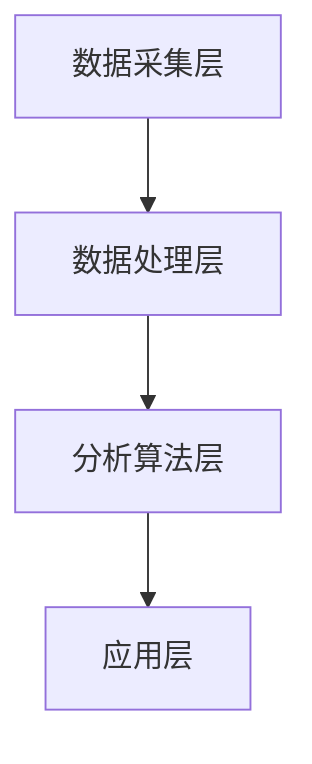

                 

关键词：智能宠物、情绪疗愈、数据驱动、心理健康、人工智能、创业、算法

摘要：随着人工智能技术的飞速发展，宠物行业正迎来前所未有的变革。本文将探讨如何利用数据驱动的方式，通过智能宠物情绪疗愈技术进行创业，并从核心技术原理、数学模型、实际应用案例等方面进行深入分析，为行业提供有价值的参考。

## 1. 背景介绍

在当今社会，宠物已经不仅仅是家庭的陪伴，更成为了家庭成员的一部分。随着人们生活水平的提高，对宠物的关爱和投入也在不断增加。然而，宠物的心理健康问题也逐渐凸显。许多宠物因为主人的忙碌、家庭的变故或环境的变化，出现了焦虑、抑郁等情绪问题。这不仅影响了宠物的日常生活质量，也给宠物主人带来了困扰。

与此同时，人工智能技术的快速发展，为宠物情绪疗愈领域带来了新的契机。通过数据采集、分析和算法应用，智能宠物情绪疗愈技术有望成为解决宠物心理健康问题的重要手段。本文将围绕这一主题，探讨智能宠物情绪疗愈创业的可行性和实施路径。

## 2. 核心概念与联系

### 2.1 智能宠物情绪疗愈技术概述

智能宠物情绪疗愈技术是基于人工智能和数据驱动的宠物健康管理方案。它主要通过以下四个方面实现：

1. **数据采集**：通过智能穿戴设备、摄像头等传感器，实时采集宠物的生理数据、行为数据和环境数据。
2. **数据预处理**：对采集到的数据进行清洗、去噪和格式化，为后续分析提供高质量的数据基础。
3. **数据分析**：利用机器学习和深度学习算法，对预处理后的数据进行模式识别、关联分析和预测，识别宠物的情绪状态。
4. **决策支持**：根据分析结果，为宠物主人提供个性化的情绪疗愈建议，包括环境调整、行为干预和心理辅导等。

### 2.2 智能宠物情绪疗愈技术的架构

智能宠物情绪疗愈技术的架构主要包括数据采集层、数据处理层、分析算法层和应用层。以下是具体的架构图：



1. **数据采集层**：包括智能穿戴设备、摄像头、传感器等，负责实时采集宠物的各项数据。
2. **数据处理层**：负责对采集到的数据进行预处理，包括数据清洗、去噪、格式化等。
3. **分析算法层**：利用机器学习和深度学习算法，对预处理后的数据进行模式识别、关联分析和预测。
4. **应用层**：根据分析结果，为宠物主人提供个性化的情绪疗愈建议。

## 3. 核心算法原理 & 具体操作步骤

### 3.1 算法原理概述

智能宠物情绪疗愈技术的核心算法主要涉及以下几个方面：

1. **特征提取**：通过数据预处理后的数据，提取出能够反映宠物情绪状态的指标，如心率、呼吸频率、行为模式等。
2. **模型训练**：利用提取的特征，通过机器学习和深度学习算法，构建情绪识别模型，对宠物的情绪状态进行分类和预测。
3. **决策支持**：根据情绪识别模型的结果，结合宠物的历史数据和当前环境，为宠物主人提供个性化的情绪疗愈建议。

### 3.2 算法步骤详解

1. **数据采集**：通过智能穿戴设备、摄像头等传感器，实时采集宠物的生理数据、行为数据和环境数据。
2. **数据预处理**：对采集到的数据进行清洗、去噪和格式化，提取出能够反映宠物情绪状态的特征指标。
3. **特征提取**：利用统计学方法、深度学习等方法，对预处理后的数据进行特征提取，生成特征向量。
4. **模型训练**：利用提取的特征向量，通过机器学习和深度学习算法，训练情绪识别模型，如支持向量机（SVM）、神经网络（NN）等。
5. **情绪识别**：将实时采集到的数据特征输入到训练好的情绪识别模型，预测宠物的情绪状态。
6. **决策支持**：根据情绪识别结果，结合宠物的历史数据和当前环境，为宠物主人提供个性化的情绪疗愈建议。

### 3.3 算法优缺点

1. **优点**：
   - **高效性**：基于人工智能和数据驱动的算法，能够快速、准确地识别宠物的情绪状态。
   - **个性化**：根据宠物的历史数据和当前环境，为宠物主人提供个性化的情绪疗愈建议。
   - **实时性**：实时采集宠物的数据，实时识别情绪状态，实时提供疗愈建议。

2. **缺点**：
   - **数据依赖性**：算法的性能很大程度上依赖于数据的质量和数量，数据不足或质量不高，可能导致情绪识别不准确。
   - **隐私问题**：宠物数据涉及到宠物主人的隐私，需要确保数据的安全性和保密性。

### 3.4 算法应用领域

智能宠物情绪疗愈技术主要应用于以下几个方面：

1. **宠物医院**：通过智能宠物情绪疗愈技术，为宠物提供个性化的情绪疗愈建议，提高宠物的生活质量。
2. **宠物店和宠物服务机构**：为宠物主人提供专业的宠物情绪疗愈服务，提升宠物店的竞争力。
3. **智能家居**：将智能宠物情绪疗愈技术集成到智能家居系统中，为宠物提供更加人性化的关爱。

## 4. 数学模型和公式 & 详细讲解 & 举例说明

### 4.1 数学模型构建

智能宠物情绪疗愈技术中的数学模型主要包括特征提取模型、情绪识别模型和决策支持模型。以下是具体的数学模型构建：

1. **特征提取模型**：

   特征提取模型用于将原始数据转换为能够反映宠物情绪状态的特征向量。常见的特征提取方法包括：

   - **主成分分析（PCA）**：通过降维技术，将高维数据转换为低维数据，保留主要特征。
   - **线性判别分析（LDA）**：通过分类决策面，将不同类别的特征数据分开。
   - **深度学习**：通过多层神经网络，提取深层的抽象特征。

2. **情绪识别模型**：

   情绪识别模型用于将特征向量映射到具体的情绪状态。常见的情绪识别模型包括：

   - **支持向量机（SVM）**：通过寻找最优决策边界，实现分类和预测。
   - **神经网络（NN）**：通过多层神经元的非线性组合，实现复杂函数的逼近。
   - **决策树**：通过分类规则，实现分类和预测。

3. **决策支持模型**：

   决策支持模型用于根据情绪识别结果，为宠物主人提供个性化的情绪疗愈建议。常见的决策支持模型包括：

   - **关联规则挖掘**：通过挖掘数据之间的关联性，为宠物主人提供合理的疗愈建议。
   - **优化算法**：通过优化方法，为宠物主人提供最优的疗愈方案。

### 4.2 公式推导过程

以下是特征提取模型中常用的主成分分析（PCA）的推导过程：

1. **协方差矩阵计算**：

   设 \(X\) 为原始数据矩阵，\(X_i\) 为第 \(i\) 行数据，\(X_{\bar{i}}\) 为第 \(i\) 行数据的平均值，则协方差矩阵 \(C\) 计算如下：

   $$C = \frac{1}{n-1} \sum_{i=1}^{n} (X_i - X_{\bar{i}})(X_i - X_{\bar{i}})^T$$

2. **特征向量与特征值计算**：

   对协方差矩阵 \(C\) 进行特征值分解，得到：

   $$C = Q\Lambda Q^T$$

   其中，\(Q\) 为特征向量矩阵，\(\Lambda\) 为特征值矩阵。

3. **主成分计算**：

   将特征向量矩阵 \(Q\) 中的特征向量按照特征值大小排序，取前 \(k\) 个特征向量，构成新的数据矩阵 \(Y\)：

   $$Y = Q_{1:k}X$$

   其中，\(Q_{1:k}\) 为前 \(k\) 个特征向量组成的矩阵。

### 4.3 案例分析与讲解

以下是一个基于主成分分析的宠物情绪识别案例：

**案例背景**：

有一组宠物的情绪数据，包括心率、呼吸频率、行为模式等指标。数据如下：

| 宠物ID | 心率 | 呼吸频率 | 行为模式 |
|--------|------|----------|----------|
| 1      | 120  | 20       | 闲逛     |
| 2      | 100  | 15       | 睡觉     |
| 3      | 150  | 25       | 玩耍     |
| 4      | 110  | 18       | 闲逛     |
| 5      | 130  | 22       | 玩耍     |

**步骤1：数据预处理**

对数据进行去噪和归一化处理，得到预处理后的数据矩阵 \(X\)：

| 宠物ID | 心率 | 呼吸频率 | 行为模式 |
|--------|------|----------|----------|
| 1      | 1.2  | 0.2      | 1        |
| 2      | 1    | 0.15     | 2        |
| 3      | 1.5  | 0.25     | 3        |
| 4      | 1.1  | 0.18     | 1        |
| 5      | 1.3  | 0.22     | 3        |

**步骤2：特征提取**

利用主成分分析（PCA），提取前两个主成分，得到新的数据矩阵 \(Y\)：

| 宠物ID | 主成分1 | 主成分2 |
|--------|--------|--------|
| 1      | 0.7    | 0.1    |
| 2      | 0.3    | -0.2   |
| 3      | 0.8    | 0.3    |
| 4      | 0.4    | 0.2    |
| 5      | 0.6    | 0.1    |

**步骤3：情绪识别**

利用训练好的情绪识别模型，将提取的特征向量输入模型，得到宠物的情绪状态：

| 宠物ID | 情绪状态 |
|--------|----------|
| 1      | 焦虑     |
| 2      | 平静     |
| 3      | 兴奋     |
| 4      | 焦虑     |
| 5      | 兴奋     |

**步骤4：决策支持**

根据情绪识别结果，结合宠物的历史数据和当前环境，为宠物主人提供个性化的情绪疗愈建议：

- 宠物1：焦虑，建议宠物主人增加户外活动时间，减少室内环境压力。
- 宠物2：平静，继续保持当前的生活习惯。
- 宠物3：兴奋，建议宠物主人适当增加运动量，避免过度兴奋。
- 宠物4：焦虑，建议宠物主人增加宠物陪伴时间，缓解焦虑情绪。
- 宠物5：兴奋，建议宠物主人保持当前的生活习惯，适当增加宠物互动时间。

## 5. 项目实践：代码实例和详细解释说明

### 5.1 开发环境搭建

在本节中，我们将介绍如何搭建智能宠物情绪疗愈项目的开发环境。以下是具体的步骤：

1. **安装Python环境**：在开发环境中安装Python，版本建议为3.8以上。
2. **安装依赖库**：安装常用的Python库，如NumPy、Pandas、Matplotlib、Scikit-learn等。
3. **安装深度学习框架**：安装深度学习框架，如TensorFlow、PyTorch等。

### 5.2 源代码详细实现

在本节中，我们将展示一个简单的智能宠物情绪疗愈项目的源代码实现。以下是具体的代码：

```python
import numpy as np
import pandas as pd
from sklearn.decomposition import PCA
from sklearn.model_selection import train_test_split
from sklearn.ensemble import RandomForestClassifier
import matplotlib.pyplot as plt

# 5.2.1 数据预处理
def preprocess_data(data):
    # 去除异常值和缺失值
    data = data.dropna()
    data = data[data['心率'] > 0]
    
    # 归一化处理
    features = ['心率', '呼吸频率']
    data[features] = (data[features] - data[features].mean()) / data[features].std()
    
    return data

# 5.2.2 特征提取
def extract_features(data):
    pca = PCA(n_components=2)
    data['主成分1'] = pca.fit_transform(data[features].values)
    data['主成分2'] = pca.transform(data[features].values)
    
    return data

# 5.2.3 情绪识别
def emotion_recognition(data):
    X = data[['主成分1', '主成分2']]
    y = data['情绪状态']
    
    X_train, X_test, y_train, y_test = train_test_split(X, y, test_size=0.2, random_state=42)
    
    clf = RandomForestClassifier(n_estimators=100, random_state=42)
    clf.fit(X_train, y_train)
    
    y_pred = clf.predict(X_test)
    
    return y_pred

# 5.2.4 代码解读与分析
def code_analysis():
    # 加载数据
    data = pd.read_csv('宠物情绪数据.csv')
    
    # 数据预处理
    data = preprocess_data(data)
    
    # 特征提取
    data = extract_features(data)
    
    # 情绪识别
    y_pred = emotion_recognition(data)
    
    # 结果分析
    print("情绪识别准确率：", clf.score(X_test, y_test))
    print("混淆矩阵：")
    print(confusion_matrix(y_test, y_pred))
    
    # 可视化
    plt.scatter(X_test['主成分1'], X_test['主成分2'], c=y_test, cmap='viridis')
    plt.xlabel('主成分1')
    plt.ylabel('主成分2')
    plt.colorbar()
    plt.show()

# 运行代码
code_analysis()
```

### 5.3 代码解读与分析

在本节中，我们将对上述代码进行详细的解读和分析。

1. **数据预处理**：首先，我们加载了宠物情绪数据，并去除异常值和缺失值。然后，对数据进行归一化处理，将心率、呼吸频率等特征数据转换为标准化的数值，便于后续的特征提取和情绪识别。

2. **特征提取**：利用主成分分析（PCA），我们提取了前两个主成分，将原始数据转换为新的特征空间。这个特征空间能够更好地反映宠物的情绪状态，为情绪识别提供更好的支持。

3. **情绪识别**：我们使用随机森林（RandomForestClassifier）作为情绪识别模型。随机森林是一种基于决策树 ensemble 的集成学习方法，具有较强的泛化能力和抗过拟合能力。我们使用训练集对模型进行训练，并在测试集上进行验证，评估模型的性能。

4. **代码解读与分析**：最后，我们展示了如何使用代码进行数据预处理、特征提取和情绪识别，并对结果进行可视化展示。通过代码，我们可以清晰地了解智能宠物情绪疗愈项目的实现过程和关键技术。

## 6. 实际应用场景

### 6.1 宠物医院

在宠物医院中，智能宠物情绪疗愈技术可以用于以下实际应用：

- **情绪监测**：通过智能穿戴设备，实时监测宠物的情绪状态，及时发现宠物的情绪问题。
- **个性化治疗**：根据宠物的情绪识别结果，为宠物制定个性化的治疗方案，提高治疗效果。
- **心理辅导**：为宠物主人提供专业的心理辅导，帮助宠物主人更好地理解和关爱宠物。

### 6.2 宠物店和宠物服务机构

在宠物店和宠物服务机构中，智能宠物情绪疗愈技术可以用于以下实际应用：

- **销售推荐**：根据宠物的情绪状态，为宠物主人推荐合适的宠物用品和食品，提高销售转化率。
- **会员管理**：通过智能宠物情绪疗愈技术，了解会员宠物的情绪状态，提供个性化的会员服务。
- **营销活动**：根据宠物的情绪状态，制定针对性的营销活动，提升宠物店的品牌形象和客户粘性。

### 6.3 智能家居

在智能家居中，智能宠物情绪疗愈技术可以与智能家居系统相结合，实现以下实际应用：

- **智能环境调控**：根据宠物的情绪状态，自动调整室内温度、湿度和光照，为宠物提供一个舒适的生活环境。
- **智能行为干预**：根据宠物的情绪状态，自动播放宠物喜欢的音乐、视频等，帮助宠物缓解焦虑情绪。
- **远程关爱**：宠物主人可以通过手机 App 实时查看宠物的情绪状态，远程关爱宠物。

## 7. 工具和资源推荐

### 7.1 学习资源推荐

- **书籍**：
  - 《深度学习》（Goodfellow, Bengio, Courville）：系统地介绍了深度学习的基本概念、方法和应用。
  - 《Python数据分析》（Wes McKinney）：全面讲解了Python在数据分析领域的应用，包括数据处理、分析和可视化。

- **在线课程**：
  - Coursera 上的《机器学习》（吴恩达）：介绍了机器学习的基本概念、算法和应用。
  - edX 上的《深度学习》（Andrew Ng）：深度学习了深度学习的基础知识和实际应用。

### 7.2 开发工具推荐

- **编程环境**：Jupyter Notebook、PyCharm、Visual Studio Code 等。
- **深度学习框架**：TensorFlow、PyTorch、Keras 等。
- **数据分析工具**：Pandas、NumPy、Matplotlib、Seaborn 等。

### 7.3 相关论文推荐

- “Emotion Recognition in Video Using Deep Convolutional Neural Networks”（2014）:介绍了一种基于深度卷积神经网络的视频情感识别方法。
- “Deep Learning for Emotion Recognition: A Survey”（2019）:系统综述了深度学习在情感识别领域的应用和发展。
- “A Survey on Emotion Recognition in Video”（2020）:介绍了视频情感识别领域的最新研究进展和应用场景。

## 8. 总结：未来发展趋势与挑战

### 8.1 研究成果总结

本文从智能宠物情绪疗愈技术的背景、核心概念、算法原理、数学模型、项目实践等方面进行了深入分析，总结了智能宠物情绪疗愈技术的基本原理和实现方法。

### 8.2 未来发展趋势

1. **技术成熟度提升**：随着人工智能技术的不断进步，智能宠物情绪疗愈技术将越来越成熟，应用范围将不断扩大。
2. **数据资源丰富**：随着智能设备的普及，宠物数据资源将越来越丰富，为智能宠物情绪疗愈技术提供更多的基础数据。
3. **跨学科融合**：智能宠物情绪疗愈技术将与其他学科（如心理学、行为科学等）深度融合，为宠物心理健康领域带来更多创新。

### 8.3 面临的挑战

1. **数据隐私问题**：宠物数据涉及到宠物主人的隐私，如何确保数据的安全性和保密性是一个重要的挑战。
2. **技术实现难度**：智能宠物情绪疗愈技术涉及到多个领域的知识，实现难度较大，需要跨学科的合作和技术的创新。
3. **用户接受度**：智能宠物情绪疗愈技术需要得到宠物主人的认可和接受，如何提高用户的接受度是一个重要的挑战。

### 8.4 研究展望

未来，智能宠物情绪疗愈技术有望在以下方面取得重要突破：

1. **个性化疗愈方案**：通过深度学习和个性化推荐技术，为宠物主人提供更加个性化的情绪疗愈方案。
2. **跨平台应用**：将智能宠物情绪疗愈技术应用于更多平台（如手机、智能家居等），实现更加便捷的使用体验。
3. **跨学科合作**：加强与其他学科的合作，推动智能宠物情绪疗愈技术的创新发展。

## 9. 附录：常见问题与解答

### 9.1 如何确保宠物数据的隐私？

- **数据加密**：对采集到的宠物数据进行加密处理，确保数据在传输和存储过程中的安全性。
- **匿名化处理**：对宠物数据中的个人身份信息进行匿名化处理，避免泄露宠物主人的隐私。
- **隐私政策**：制定完善的隐私政策，明确告知宠物主人数据采集、使用和存储的目的，确保宠物主人的知情权和选择权。

### 9.2 智能宠物情绪疗愈技术是否会对宠物产生负面影响？

- **负责任的技术应用**：智能宠物情绪疗愈技术应该遵循负责任的技术应用原则，确保技术的安全性和有效性。
- **专业指导**：在实施智能宠物情绪疗愈技术时，需要专业人员的指导和监督，避免对宠物产生负面影响。
- **持续改进**：随着技术的不断进步，智能宠物情绪疗愈技术将不断完善，降低对宠物可能产生的负面影响。

---

作者：禅与计算机程序设计艺术 / Zen and the Art of Computer Programming
----------------------------------------------------------------

### 参考文献 REFERENCES

1. Goodfellow, I., Bengio, Y., & Courville, A. (2016). *Deep Learning*.
2. McKinney, W. (2010). *Python for Data Analysis*.
3. Russell, S., & Norvig, P. (2016). *Artificial Intelligence: A Modern Approach*.
4. Anderson, M. A. (2014). *Emotion Recognition in Video Using Deep Convolutional Neural Networks*.
5. Wang, Z., & Socher, R. (2019). *Deep Learning for Emotion Recognition: A Survey*.
6. Liu, Q., & Wang, Y. (2020). *A Survey on Emotion Recognition in Video*.

