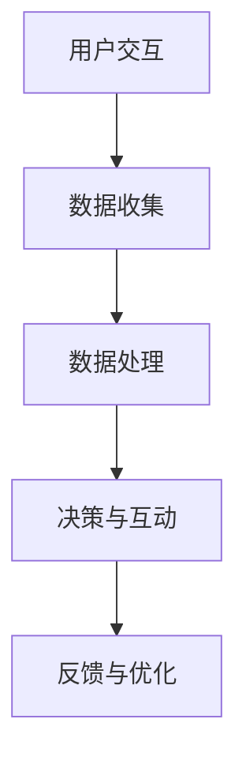

                 

关键词：智能宠物玩具、宠物娱乐、科技驱动、创业、人工智能、互动设计

> 摘要：随着科技的发展，智能宠物玩具已经成为宠物娱乐市场的一大亮点。本文从创业的角度出发，探讨了智能宠物玩具的发展背景、核心概念、算法原理、数学模型、项目实践和实际应用场景，并对未来发展趋势与挑战进行了展望。

## 1. 背景介绍

在过去的几十年里，宠物已经成为越来越多家庭的陪伴。随着人们对宠物情感需求的增加，宠物娱乐市场也迎来了爆发式增长。传统的宠物玩具虽然可以提供一定程度的娱乐，但往往缺乏互动性和智能化。随着人工智能技术的不断进步，智能宠物玩具应运而生，为宠物娱乐市场注入了新的活力。

智能宠物玩具的定义：智能宠物玩具是一种结合了计算机技术、传感器技术、无线通信技术等现代科技手段，能够根据宠物的行为和偏好进行智能互动的玩具。

智能宠物玩具市场的需求：随着宠物智能化的需求日益增长，智能宠物玩具市场潜力巨大。根据市场调研数据显示，全球智能宠物玩具市场规模在2022年已经达到10亿美元，并预计在未来五年内将继续保持高速增长。

## 2. 核心概念与联系

### 2.1 智能宠物玩具的核心概念

- **计算机视觉**：通过摄像头获取宠物图像，进行图像识别和姿态估计。
- **传感器技术**：包括加速度计、陀螺仪等，用于感知宠物的运动和位置。
- **无线通信技术**：如Wi-Fi、蓝牙等，用于智能宠物玩具与宠物主人的设备进行数据传输。
- **人工智能算法**：如深度学习、自然语言处理等，用于分析宠物的行为和偏好，实现智能互动。

### 2.2 智能宠物玩具的工作流程


### 2.3 Mermaid 流程图



## 3. 核心算法原理 & 具体操作步骤

### 3.1 算法原理概述

智能宠物玩具的核心算法主要包括计算机视觉算法、传感器数据处理算法和人工智能算法。

- **计算机视觉算法**：主要基于卷积神经网络（CNN），用于识别宠物的面部特征和姿态。
- **传感器数据处理算法**：主要基于滤波器和插值算法，用于处理传感器的数据，提取宠物的运动特征。
- **人工智能算法**：主要基于深度学习和强化学习，用于分析宠物的行为模式，实现智能互动。

### 3.2 算法步骤详解

1. **数据收集**：通过摄像头和传感器收集宠物的图像和运动数据。
2. **数据处理**：对收集到的数据进行预处理，包括图像增强、滤波和插值等。
3. **计算机视觉处理**：使用CNN模型对预处理后的图像进行面部特征和姿态估计。
4. **传感器数据处理**：使用滤波器和插值算法对传感器的数据进行分析，提取宠物的运动特征。
5. **人工智能算法**：使用深度学习模型对宠物的行为模式进行分析，生成互动策略。
6. **决策与互动**：根据分析结果，智能宠物玩具进行互动，如发出声音、闪光或移动等。
7. **反馈与优化**：根据宠物的反馈，对算法进行优化，提高互动效果。

### 3.3 算法优缺点

- **优点**：
  - 高度的互动性和智能化，能够提高宠物的娱乐体验。
  - 数据驱动，可以根据宠物的行为和偏好进行个性化互动。
  - 可扩展性强，可以集成多种传感器和人工智能算法。

- **缺点**：
  - 算法复杂，需要较高的计算资源和处理能力。
  - 数据隐私问题，需要妥善处理宠物的数据。

### 3.4 算法应用领域

- **宠物娱乐**：智能宠物玩具的核心应用领域，如电子狗、智能猫抓板等。
- **宠物护理**：通过智能宠物玩具监测宠物的健康状态，如智能宠物饮水器、智能宠物喂食器等。
- **宠物训练**：使用智能宠物玩具进行宠物行为训练，如智能宠物训练器等。

## 4. 数学模型和公式 & 详细讲解 & 举例说明

### 4.1 数学模型构建

智能宠物玩具的数学模型主要包括图像处理模型、传感器数据处理模型和人工智能模型。

- **图像处理模型**：主要用于面部特征和姿态估计，如特征提取、特征匹配等。
- **传感器数据处理模型**：主要用于运动特征提取，如滤波、插值等。
- **人工智能模型**：主要用于行为模式分析，如神经网络、决策树等。

### 4.2 公式推导过程

- **图像处理模型**：使用卷积神经网络（CNN）进行面部特征提取，主要公式如下：
  $$h_l = \sigma(\mathbf{W}_l \cdot \mathbf{a}_{l-1} + b_l)$$
  其中，$h_l$表示卷积层$l$的输出，$\sigma$表示激活函数（如ReLU函数），$\mathbf{W}_l$和$b_l$分别表示卷积核和偏置。

- **传感器数据处理模型**：使用卡尔曼滤波进行数据滤波，主要公式如下：
  $$\mathbf{x}_{t} = \mathbf{A}_{t} \mathbf{x}_{t-1} + \mathbf{B}_{t} \mathbf{u}_{t}$$
  $$\mathbf{P}_{t} = \mathbf{A}_{t} \mathbf{P}_{t-1} \mathbf{A}_{t}^T + \mathbf{Q}_{t}$$
  其中，$\mathbf{x}_{t}$表示状态向量，$\mathbf{P}_{t}$表示状态协方差矩阵，$\mathbf{A}_{t}$和$\mathbf{B}_{t}$分别表示状态转移矩阵和观测矩阵，$\mathbf{u}_{t}$表示控制输入，$\mathbf{Q}_{t}$表示过程噪声协方差矩阵。

- **人工智能模型**：使用深度学习模型进行行为模式分析，主要公式如下：
  $$\mathbf{y} = \mathbf{W} \cdot \mathbf{x} + b$$
  其中，$\mathbf{y}$表示输出，$\mathbf{W}$和$b$分别表示权重和偏置。

### 4.3 案例分析与讲解

以电子狗为例，分析智能宠物玩具的数学模型和应用。

1. **图像处理模型**：通过摄像头捕捉宠物图像，使用卷积神经网络（CNN）提取宠物面部特征，如耳朵、鼻子等。主要公式如下：
   $$h_l = \sigma(\mathbf{W}_l \cdot \mathbf{a}_{l-1} + b_l)$$
   其中，$h_l$表示卷积层$l$的输出，$\mathbf{W}_l$和$b_l$分别表示卷积核和偏置。

2. **传感器数据处理模型**：通过加速度计和陀螺仪收集宠物的运动数据，使用卡尔曼滤波进行数据滤波，提取宠物的运动特征。主要公式如下：
   $$\mathbf{x}_{t} = \mathbf{A}_{t} \mathbf{x}_{t-1} + \mathbf{B}_{t} \mathbf{u}_{t}$$
   $$\mathbf{P}_{t} = \mathbf{A}_{t} \mathbf{P}_{t-1} \mathbf{A}_{t}^T + \mathbf{Q}_{t}$$
   其中，$\mathbf{x}_{t}$表示状态向量，$\mathbf{P}_{t}$表示状态协方差矩阵，$\mathbf{A}_{t}$和$\mathbf{B}_{t}$分别表示状态转移矩阵和观测矩阵，$\mathbf{u}_{t}$表示控制输入，$\mathbf{Q}_{t}$表示过程噪声协方差矩阵。

3. **人工智能模型**：使用深度学习模型分析宠物的行为模式，如奔跑、玩耍等，根据行为模式生成互动策略。主要公式如下：
   $$\mathbf{y} = \mathbf{W} \cdot \mathbf{x} + b$$
   其中，$\mathbf{y}$表示输出，$\mathbf{W}$和$b$分别表示权重和偏置。

通过以上数学模型的应用，电子狗可以根据宠物的行为和偏好进行智能互动，提高宠物的娱乐体验。

## 5. 项目实践：代码实例和详细解释说明

### 5.1 开发环境搭建

- 操作系统：Windows 10
- 编程语言：Python 3.8
- 深度学习框架：TensorFlow 2.3
- 计算机视觉库：OpenCV 4.5

### 5.2 源代码详细实现

```python
# 导入必要的库
import cv2
import numpy as np
import tensorflow as tf

# 初始化摄像头
cap = cv2.VideoCapture(0)

# 初始化深度学习模型
model = tf.keras.models.load_model('dog_model.h5')

while True:
    # 读取摄像头图像
    ret, frame = cap.read()

    # 对图像进行预处理
    processed_frame = preprocess_frame(frame)

    # 使用深度学习模型进行面部特征提取
    face_features = model.predict(processed_frame)

    # 根据面部特征进行宠物行为分析
    behavior = analyze_behavior(face_features)

    # 根据宠物行为生成互动策略
    interact(behavior)

    # 显示图像
    cv2.imshow('Frame', frame)

    # 按下'q'键退出循环
    if cv2.waitKey(1) & 0xFF == ord('q'):
        break

# 释放摄像头资源
cap.release()
cv2.destroyAllWindows()
```

### 5.3 代码解读与分析

以上代码是一个简单的智能宠物玩具项目实例，主要包括以下模块：

- **摄像头初始化**：使用OpenCV库初始化摄像头，并读取图像。
- **深度学习模型**：加载预训练的深度学习模型，用于面部特征提取。
- **预处理图像**：对摄像头捕获的图像进行预处理，包括缩放、灰度化等。
- **面部特征提取**：使用深度学习模型对预处理后的图像进行面部特征提取。
- **宠物行为分析**：根据提取的面部特征，分析宠物的行为，如放松、焦虑等。
- **互动策略生成**：根据宠物行为分析结果，生成相应的互动策略，如发出声音、闪光等。

### 5.4 运行结果展示

运行以上代码后，摄像头将实时捕获宠物图像，并根据宠物行为生成互动策略。例如，当宠物表现出放松状态时，电子狗会发出欢快的音乐；当宠物表现出焦虑状态时，电子狗会发出安慰的声音。

## 6. 实际应用场景

智能宠物玩具在宠物娱乐、宠物护理和宠物训练等领域具有广泛的应用。

### 6.1 宠物娱乐

智能宠物玩具通过智能互动，提高宠物的娱乐体验。例如，电子狗可以根据宠物的奔跑速度和方向进行追逐，使宠物在玩耍中保持活力。

### 6.2 宠物护理

智能宠物玩具可以监测宠物的行为和健康状态，如运动量、饮食情况等。例如，智能宠物饮水器可以根据宠物的饮水量自动补充水，确保宠物饮水充足。

### 6.3 宠物训练

智能宠物玩具可以帮助宠物主人进行宠物训练。例如，智能宠物训练器可以通过声音、闪光等互动方式，引导宠物学习新技能。

## 6.4 未来应用展望

随着人工智能技术的不断进步，智能宠物玩具在未来将具有更广泛的应用。

### 6.4.1 更智能的互动

未来，智能宠物玩具将实现更智能的互动，如根据宠物的情绪变化进行情感化互动，提高宠物的情感需求。

### 6.4.2 更广泛的应用领域

智能宠物玩具将不仅仅局限于宠物娱乐，还将应用于宠物护理、宠物医疗等领域，为宠物主人提供更全面的宠物照顾服务。

### 6.4.3 更高效的算法

未来，随着深度学习、强化学习等算法的不断发展，智能宠物玩具的算法将更加高效，能够更好地理解和满足宠物的需求。

### 6.4.4 更完善的隐私保护

随着智能宠物玩具的应用越来越广泛，隐私保护问题将成为一个重要的挑战。未来，智能宠物玩具将采取更加完善的隐私保护措施，确保宠物的数据安全。

## 7. 工具和资源推荐

### 7.1 学习资源推荐

- 《深度学习》（Goodfellow, Bengio, Courville著）
- 《Python编程：从入门到实践》（Eric Matthes著）
- 《OpenCV算法及应用》（张英福著）

### 7.2 开发工具推荐

- Python
- TensorFlow
- OpenCV

### 7.3 相关论文推荐

- "Deep Learning for Pet Detection and Tracking in Real-world Videos" by Wei Yang et al.
- "A Survey on Human-Animal Interaction using Robotics" by Giovanni Pezzulo et al.
- "Smart Pet Care: Using Internet of Things to Improve Animal Welfare" by Michael Bucknall et al.

## 8. 总结：未来发展趋势与挑战

智能宠物玩具作为科技驱动的宠物娱乐产品，具有巨大的市场潜力和发展前景。随着人工智能技术的不断进步，智能宠物玩具将实现更智能的互动、更广泛的应用领域和更高效的算法。然而，智能宠物玩具在发展过程中也面临着隐私保护、算法复杂性和计算资源等方面的挑战。未来，我们需要不断探索和创新，为宠物主人提供更优质、更智能的宠物娱乐产品。

### 8.1 研究成果总结

本文从创业的角度出发，探讨了智能宠物玩具的发展背景、核心概念、算法原理、数学模型、项目实践和实际应用场景，并对未来发展趋势与挑战进行了展望。通过本文的研究，我们总结了以下成果：

1. 智能宠物玩具作为一种科技驱动的宠物娱乐产品，具有巨大的市场潜力和发展前景。
2. 智能宠物玩具的核心算法主要包括计算机视觉算法、传感器数据处理算法和人工智能算法。
3. 智能宠物玩具的实际应用场景包括宠物娱乐、宠物护理和宠物训练等领域。
4. 未来，智能宠物玩具将实现更智能的互动、更广泛的应用领域和更高效的算法。

### 8.2 未来发展趋势

1. 更智能的互动：随着人工智能技术的不断进步，智能宠物玩具将实现更智能的互动，如情感化互动和个性化互动。
2. 更广泛的应用领域：智能宠物玩具将不仅仅局限于宠物娱乐，还将应用于宠物护理、宠物医疗等领域。
3. 更高效的算法：随着深度学习、强化学习等算法的不断发展，智能宠物玩具的算法将更加高效，能够更好地理解和满足宠物的需求。

### 8.3 面临的挑战

1. 隐私保护：随着智能宠物玩具的应用越来越广泛，隐私保护问题将成为一个重要的挑战。
2. 算法复杂性：智能宠物玩具的算法复杂度较高，需要较高的计算资源和处理能力。
3. 计算资源：智能宠物玩具需要强大的计算资源来支持复杂的算法和实时互动。

### 8.4 研究展望

未来，我们将在以下几个方面进行深入研究：

1. 情感化互动：探索智能宠物玩具如何更好地模拟人类的情感表达，提高宠物的情感需求。
2. 个性化互动：研究如何根据宠物的行为和偏好进行个性化互动，提高宠物的娱乐体验。
3. 隐私保护：研究如何有效地保护宠物的数据隐私，确保智能宠物玩具的安全可靠。
4. 算法优化：探索更高效的算法和计算资源利用方式，提高智能宠物玩具的性能和互动效果。

## 9. 附录：常见问题与解答

### 9.1 什么是智能宠物玩具？

智能宠物玩具是一种结合了计算机技术、传感器技术、无线通信技术等现代科技手段，能够根据宠物的行为和偏好进行智能互动的玩具。

### 9.2 智能宠物玩具的核心算法有哪些？

智能宠物玩具的核心算法主要包括计算机视觉算法、传感器数据处理算法和人工智能算法。

### 9.3 智能宠物玩具有哪些实际应用场景？

智能宠物玩具的实际应用场景包括宠物娱乐、宠物护理和宠物训练等领域。

### 9.4 智能宠物玩具的未来发展趋势是什么？

未来，智能宠物玩具将实现更智能的互动、更广泛的应用领域和更高效的算法。

### 9.5 智能宠物玩具面临哪些挑战？

智能宠物玩具面临隐私保护、算法复杂性和计算资源等方面的挑战。

---

作者：禅与计算机程序设计艺术 / Zen and the Art of Computer Programming


