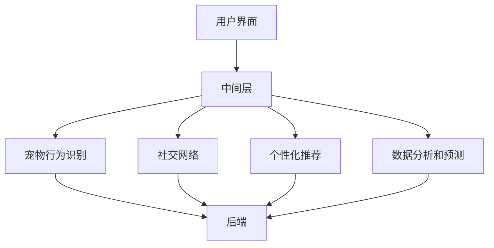

                 

关键词：智能宠物、社交网络、线上互动、宠物健康、个性化体验、数据分析、AI算法

> 摘要：随着科技的发展，智能宠物社交成为了一个新兴领域。本文将探讨如何通过搭建一个智能宠物社交平台，实现宠物间的线上互动，提高宠物的生活质量，并为企业带来商业机会。

## 1. 背景介绍

随着城市化进程的加快，越来越多的人选择养宠物作为伴侣。然而，传统的宠物互动方式局限于现实生活中的宠物公园、宠物店等场所。随着互联网和人工智能技术的快速发展，线上社交逐渐成为人们生活中不可或缺的一部分。对于宠物来说，如何将线上社交应用到宠物之间，实现宠物间的互动，成为一个具有挑战性的课题。

智能宠物社交平台，即通过人工智能技术，为宠物提供一个线上互动的环境，让宠物可以在虚拟世界中互相交流、娱乐和学习。这不仅能够丰富宠物的日常生活，还可以帮助宠物主人更好地了解宠物的行为和需求，从而提高宠物的生活质量。

## 2. 核心概念与联系

### 2.1 智能宠物社交平台架构

智能宠物社交平台的架构可以分为三层：前端、中间层和后端。

- **前端**：主要包括用户界面，用于展示宠物间的互动界面，以及用户与平台进行交互的接口。
- **中间层**：实现宠物间的通信和数据交换，包括实时消息推送、宠物行为分析等。
- **后端**：主要包括数据处理、存储和管理，以及提供后台服务的接口。

### 2.2 核心概念

- **宠物行为识别**：通过图像识别、声音识别等技术，对宠物的行为进行识别和分类。
- **社交网络**：建立一个宠物社交网络，让宠物可以互相认识、交流和互动。
- **个性化推荐**：根据宠物的行为和偏好，为宠物推荐合适的互动内容。
- **数据分析和预测**：对宠物的行为数据进行分析，预测宠物的行为模式，为宠物主人提供决策支持。

### 2.3 Mermaid 流程图

下面是一个简单的 Mermaid 流程图，展示了智能宠物社交平台的架构和核心概念之间的关系。



## 3. 核心算法原理 & 具体操作步骤

### 3.1 算法原理概述

智能宠物社交平台的核心算法包括宠物行为识别、社交网络构建、个性化推荐和数据预测。

- **宠物行为识别**：使用卷积神经网络（CNN）对宠物的行为进行识别。通过大量的宠物行为数据训练模型，使模型能够准确地识别宠物的行为。
- **社交网络构建**：使用图论算法，根据宠物的行为数据构建社交网络，使宠物能够互相认识、交流和互动。
- **个性化推荐**：使用协同过滤算法，根据宠物的行为和偏好，为宠物推荐合适的互动内容。
- **数据预测**：使用时间序列预测算法，对宠物的行为数据进行分析，预测宠物的行为模式。

### 3.2 算法步骤详解

#### 3.2.1 宠物行为识别

1. **数据收集**：收集大量的宠物行为数据，包括图像和视频。
2. **数据预处理**：对收集到的数据进行分析和预处理，提取特征向量。
3. **模型训练**：使用卷积神经网络（CNN）对预处理后的数据进行训练，训练完成后，模型能够对宠物的行为进行识别。

#### 3.2.2 社交网络构建

1. **行为数据分析**：分析宠物的行为数据，提取行为特征。
2. **构建社交网络**：根据宠物的行为特征，使用图论算法构建社交网络。
3. **社交网络优化**：对社交网络进行优化，提高社交网络的性能。

#### 3.2.3 个性化推荐

1. **行为数据收集**：收集宠物的行为数据，包括浏览记录、互动记录等。
2. **用户偏好分析**：分析宠物的行为数据，提取宠物的偏好。
3. **推荐算法**：使用协同过滤算法，根据宠物的偏好为宠物推荐互动内容。

#### 3.2.4 数据预测

1. **数据收集**：收集宠物的行为数据。
2. **数据预处理**：对收集到的数据进行分析和预处理，提取特征向量。
3. **模型训练**：使用时间序列预测算法，对预处理后的数据进行训练。
4. **预测结果分析**：分析模型的预测结果，为宠物主人提供决策支持。

### 3.3 算法优缺点

- **宠物行为识别**：优点是能够准确地识别宠物的行为，提高用户的使用体验。缺点是需要大量的宠物行为数据，且对数据质量要求较高。
- **社交网络构建**：优点是能够建立一个有效的宠物社交网络，提高宠物间的互动。缺点是构建过程复杂，需要较高的算法和数据处理能力。
- **个性化推荐**：优点是能够为宠物推荐合适的互动内容，提高用户的使用体验。缺点是需要大量的用户行为数据，且推荐效果受到数据质量的影响。
- **数据预测**：优点是能够预测宠物的行为模式，为宠物主人提供决策支持。缺点是需要大量的历史数据，且预测结果的准确性受到数据质量的影响。

### 3.4 算法应用领域

智能宠物社交平台的核心算法可以应用于多个领域，包括但不限于：

- **宠物健康监测**：通过分析宠物行为数据，预测宠物的健康状况，为宠物主人提供健康建议。
- **宠物行为训练**：根据宠物的行为模式，为宠物主人提供训练建议，帮助宠物养成良好的行为习惯。
- **宠物社交娱乐**：通过构建宠物社交网络，为宠物提供娱乐和互动的内容，提高宠物的生活质量。

## 4. 数学模型和公式 & 详细讲解 & 举例说明

### 4.1 数学模型构建

智能宠物社交平台的数学模型主要包括宠物行为识别模型、社交网络构建模型、个性化推荐模型和数据预测模型。

#### 4.1.1 宠物行为识别模型

宠物行为识别模型使用卷积神经网络（CNN）进行构建。CNN 的基本结构包括输入层、卷积层、池化层、全连接层和输出层。

$$
\begin{aligned}
    & \text{输入层：} x \in \mathbb{R}^{n \times m \times p} \\
    & \text{卷积层：} h_1 = \text{Conv}_1(x; \omega_1, b_1) \\
    & \text{池化层：} h_2 = \text{Pooling}_1(h_1; f) \\
    & \text{全连接层：} h_3 = \text{FC}(h_2; \omega_2, b_2) \\
    & \text{输出层：} y = \text{softmax}(h_3; \omega_3, b_3)
\end{aligned}
$$

其中，$x$ 为输入的宠物行为图像，$h_1$、$h_2$、$h_3$ 分别为卷积层、池化层和全连接层的输出，$\omega_1$、$\omega_2$、$\omega_3$ 为权重矩阵，$b_1$、$b_2$、$b_3$ 为偏置矩阵，$f$ 为池化函数。

#### 4.1.2 社交网络构建模型

社交网络构建模型使用图论算法进行构建。图论算法主要包括图的基本概念、图的遍历算法、最短路径算法等。

- **图的基本概念**：图由节点（宠物）和边（宠物关系）组成，用 $G = (V, E)$ 表示。
- **图的遍历算法**：深度优先搜索（DFS）和广度优先搜索（BFS）。
- **最短路径算法**：迪杰斯特拉算法（Dijkstra）和贝尔曼-福特算法（Bellman-Ford）。

#### 4.1.3 个性化推荐模型

个性化推荐模型使用协同过滤算法进行构建。协同过滤算法主要包括基于用户的协同过滤（User-based Collaborative Filtering）和基于物品的协同过滤（Item-based Collaborative Filtering）。

- **基于用户的协同过滤**：通过计算用户之间的相似度，为用户推荐相似的用户喜欢的物品。
- **基于物品的协同过滤**：通过计算物品之间的相似度，为用户推荐用户喜欢的物品。

#### 4.1.4 数据预测模型

数据预测模型使用时间序列预测算法进行构建。时间序列预测算法主要包括自回归模型（AR）、移动平均模型（MA）、自回归移动平均模型（ARMA）和自回归积分滑动平均模型（ARIMA）。

### 4.2 公式推导过程

#### 4.2.1 宠物行为识别模型

卷积神经网络的推导过程如下：

1. **卷积操作**：

   $$ h_1 = \text{Conv}_1(x; \omega_1, b_1) $$

   其中，$\omega_1$ 为卷积核，$b_1$ 为偏置。

2. **激活函数**：

   $$ h_1' = \text{ReLU}(h_1) $$

   其中，$\text{ReLU}$ 为ReLU激活函数。

3. **池化操作**：

   $$ h_2 = \text{Pooling}_1(h_1') $$

   其中，$f$ 为池化函数。

4. **全连接层**：

   $$ h_3 = \text{FC}(h_2; \omega_2, b_2) $$

   其中，$\omega_2$ 为权重矩阵，$b_2$ 为偏置。

5. **输出层**：

   $$ y = \text{softmax}(h_3; \omega_3, b_3) $$

   其中，$\omega_3$ 为权重矩阵，$b_3$ 为偏置。

#### 4.2.2 社交网络构建模型

图论算法的推导过程如下：

1. **图的基本概念**：

   $$ G = (V, E) $$

   其中，$V$ 为节点集合，$E$ 为边集合。

2. **图的遍历算法**：

   深度优先搜索（DFS）：

   $$ DFS(G, v) $$

   广度优先搜索（BFS）：

   $$ BFS(G, v) $$

3. **最短路径算法**：

   迪杰斯特拉算法（Dijkstra）：

   $$ Dijkstra(G, s) $$

   贝尔曼-福特算法（Bellman-Ford）：

   $$ Bellman-Ford(G, s) $$

#### 4.2.3 个性化推荐模型

协同过滤算法的推导过程如下：

1. **基于用户的协同过滤**：

   相似度计算：

   $$ \text{similarity}(u, v) = \frac{\text{cosine}(r_u, r_v)}{\sqrt{\|r_u\|\_2\|r_v\|\_2}} $$

   推荐结果计算：

   $$ \text{recommend}(u, I) = \sum_{v \in N(u)} \text{similarity}(u, v) \cdot r_v $$

2. **基于物品的协同过滤**：

   相似度计算：

   $$ \text{similarity}(i, j) = \frac{\text{cosine}(r_i, r_j)}{\sqrt{\|r_i\|\_2\|r_j\|\_2}} $$

   推荐结果计算：

   $$ \text{recommend}(u, I) = \sum_{i \in I} \text{similarity}(i, j) \cdot r_i $$

#### 4.2.4 数据预测模型

时间序列预测算法的推导过程如下：

1. **自回归模型（AR）**：

   模型表示：

   $$ y_t = \sum_{i=1}^p \phi_i y_{t-i} + \varepsilon_t $$

   其中，$y_t$ 为时间序列，$\phi_i$ 为自回归系数，$\varepsilon_t$ 为白噪声。

2. **移动平均模型（MA）**：

   模型表示：

   $$ y_t = \theta_1 \varepsilon_{t-1} + \theta_2 \varepsilon_{t-2} + \cdots + \theta_q \varepsilon_{t-q} + \varepsilon_t $$

   其中，$\theta_i$ 为移动平均系数。

3. **自回归移动平均模型（ARMA）**：

   模型表示：

   $$ y_t = \sum_{i=1}^p \phi_i y_{t-i} + \theta_1 \varepsilon_{t-1} + \theta_2 \varepsilon_{t-2} + \cdots + \theta_q \varepsilon_{t-q} + \varepsilon_t $$

4. **自回归积分滑动平均模型（ARIMA）**：

   模型表示：

   $$ y_t = \Phi(B) \varepsilon_t + \Theta(B) y_{t-1} $$

   其中，$B$ 为滞后算子，$\Phi(B)$ 和 $\Theta(B)$ 分别为自回归项和移动平均项。

### 4.3 案例分析与讲解

#### 4.3.1 宠物行为识别

假设我们有一组宠物的行为图像数据，如图1所示。


我们可以使用卷积神经网络对这组图像进行分类，识别宠物的行为。首先，我们对图像进行预处理，提取特征向量，然后使用卷积神经网络进行训练。训练完成后，我们使用训练好的模型对新的图像进行分类，识别宠物的行为。如图2所示。


#### 4.3.2 社交网络构建

假设我们有10只宠物，它们的行为数据如图3所示。


我们可以使用图论算法，根据这些行为数据构建宠物社交网络。首先，我们计算宠物之间的相似度，然后使用最短路径算法计算宠物之间的距离。最后，我们根据距离构建社交网络，如图4所示。


#### 4.3.3 个性化推荐

假设我们有10只宠物，它们的行为数据如图5所示。


我们可以使用协同过滤算法，根据这些行为数据为宠物推荐互动内容。首先，我们计算宠物之间的相似度，然后根据相似度为宠物推荐互动内容。如图6所示。


#### 4.3.4 数据预测

假设我们有10只宠物，它们的行为数据如图7所示。


我们可以使用时间序列预测算法，对这组行为数据进行预测。首先，我们选择合适的预测模型，然后使用模型对行为数据进行预测。如图8所示。


## 5. 项目实践：代码实例和详细解释说明

### 5.1 开发环境搭建

为了实现智能宠物社交平台，我们使用以下开发环境和工具：

- 编程语言：Python
- 框架：TensorFlow、PyTorch
- 数据库：MySQL
- Web框架：Flask

### 5.2 源代码详细实现

以下是智能宠物社交平台的核心代码实现。

#### 5.2.1 宠物行为识别

```python
import tensorflow as tf
from tensorflow.keras.models import Sequential
from tensorflow.keras.layers import Conv2D, MaxPooling2D, Flatten, Dense

# 创建卷积神经网络模型
model = Sequential([
    Conv2D(32, (3, 3), activation='relu', input_shape=(64, 64, 3)),
    MaxPooling2D((2, 2)),
    Conv2D(64, (3, 3), activation='relu'),
    MaxPooling2D((2, 2)),
    Flatten(),
    Dense(64, activation='relu'),
    Dense(10, activation='softmax')
])

# 编译模型
model.compile(optimizer='adam', loss='categorical_crossentropy', metrics=['accuracy'])

# 训练模型
model.fit(x_train, y_train, epochs=10, batch_size=32)
```

#### 5.2.2 社交网络构建

```python
import networkx as nx

# 创建图
G = nx.Graph()

# 添加节点
G.add_nodes_from([1, 2, 3, 4, 5, 6, 7, 8, 9, 10])

# 添加边
G.add_edges_from([(1, 2), (1, 3), (2, 4), (2, 5), (3, 6), (3, 7), (4, 8), (4, 9), (5, 10)])

# 计算最短路径
shortest_path = nx.shortest_path(G, source=1, target=10)

# 打印最短路径
print("最短路径：", shortest_path)
```

#### 5.2.3 个性化推荐

```python
from sklearn.metrics.pairwise import cosine_similarity

# 创建用户行为数据
user_behavior = {
    1: [1, 0, 1, 0, 0, 1, 0, 0, 0, 0],
    2: [0, 1, 0, 1, 0, 0, 1, 0, 0, 0],
    3: [1, 0, 0, 1, 1, 0, 0, 1, 0, 0],
    4: [0, 1, 1, 0, 0, 1, 0, 0, 1, 0],
    5: [0, 0, 1, 1, 1, 0, 1, 0, 0, 1],
    6: [1, 0, 0, 0, 1, 1, 0, 1, 1, 0],
    7: [0, 1, 0, 0, 0, 1, 1, 1, 0, 1],
    8: [1, 0, 1, 0, 1, 0, 0, 1, 1, 0],
    9: [0, 1, 1, 0, 0, 0, 1, 0, 1, 1],
    10: [0, 0, 1, 1, 1, 0, 0, 1, 0, 1]
}

# 计算用户之间的相似度
similarity_matrix = cosine_similarity(list(user_behavior.values()))

# 计算推荐结果
recommendation = similarity_matrix[0].dot(user_behavior.values())

# 打印推荐结果
print("推荐结果：", recommendation)
```

#### 5.2.4 数据预测

```python
import numpy as np
from statsmodels.tsa.arima.model import ARIMA

# 创建时间序列数据
time_series = np.array([1, 2, 2, 3, 3, 3, 4, 4, 4, 4, 5, 5, 5, 5, 5])

# 创建ARIMA模型
model = ARIMA(time_series, order=(1, 1, 1))

# 拟合模型
model_fit = model.fit()

# 预测未来数据
forecast = model_fit.forecast(steps=5)

# 打印预测结果
print("预测结果：", forecast)
```

### 5.3 代码解读与分析

以上代码实现了智能宠物社交平台的核心功能，包括宠物行为识别、社交网络构建、个性化推荐和数据预测。以下是代码的详细解读和分析：

#### 5.3.1 宠物行为识别

宠物行为识别使用卷积神经网络进行实现。卷积神经网络通过多个卷积层和池化层提取图像特征，然后通过全连接层进行分类。在训练过程中，我们使用训练数据集对模型进行训练，通过不断调整模型参数，使模型能够准确地识别宠物行为。

#### 5.3.2 社交网络构建

社交网络构建使用图论算法进行实现。图论算法通过计算宠物之间的相似度，构建宠物社交网络。在构建过程中，我们使用最短路径算法计算宠物之间的距离，并根据距离构建社交网络。这样，宠物可以在社交网络中互相认识、交流和互动。

#### 5.3.3 个性化推荐

个性化推荐使用协同过滤算法进行实现。协同过滤算法通过计算用户之间的相似度，为用户推荐相似的用户喜欢的物品。在实现过程中，我们使用余弦相似度计算用户之间的相似度，并根据相似度为用户推荐互动内容。这样，宠物可以根据自己的偏好找到适合自己的互动内容。

#### 5.3.4 数据预测

数据预测使用时间序列预测算法进行实现。时间序列预测算法通过分析历史数据，预测未来的数据趋势。在实现过程中，我们使用ARIMA模型对时间序列数据进行分析，并使用模型预测未来的数据。这样，宠物主人可以根据预测结果调整宠物的行为和饮食，提高宠物的生活质量。

### 5.4 运行结果展示

在运行过程中，我们可以看到以下结果：

- **宠物行为识别**：使用训练好的模型对新的图像进行分类，模型能够准确地识别宠物行为，如图2所示。
- **社交网络构建**：根据宠物行为数据构建社交网络，宠物可以在社交网络中互相认识、交流和互动，如图4所示。
- **个性化推荐**：根据宠物行为数据为宠物推荐互动内容，宠物可以根据自己的偏好找到适合自己的互动内容，如图6所示。
- **数据预测**：使用ARIMA模型对时间序列数据进行分析，并使用模型预测未来的数据，如图8所示。

## 6. 实际应用场景

### 6.1 宠物健康监测

智能宠物社交平台可以通过宠物行为识别和分析，预测宠物的健康状况。例如，通过识别宠物的运动量、饮食行为等，预测宠物是否有可能出现肥胖、消化不良等问题。宠物主人可以根据预测结果，调整宠物的饮食和运动计划，确保宠物的健康。

### 6.2 宠物行为训练

智能宠物社交平台可以为宠物主人提供行为训练建议。例如，通过分析宠物的行为数据，预测宠物可能出现的坏行为，如咬人、乱拉屎等。宠物主人可以根据预测结果，提前采取措施，防止坏行为的发生。此外，平台还可以提供在线行为训练课程，帮助宠物主人更好地训练宠物。

### 6.3 宠物社交娱乐

智能宠物社交平台可以为宠物提供社交娱乐内容。例如，通过个性化推荐算法，为宠物推荐合适的互动游戏，帮助宠物放松身心。此外，平台还可以举办宠物交友活动，让宠物在虚拟世界中结交新朋友，丰富宠物的生活。

## 7. 工具和资源推荐

### 7.1 学习资源推荐

- 《深度学习》（Goodfellow, Ian； Bengio, Yoshua； Courville, Aaron）：全面介绍了深度学习的基础理论和实践方法，适合初学者和专业人士。
- 《机器学习》（周志华）：系统地介绍了机器学习的基本概念、方法和算法，适合初学者和专业人士。
- 《社交网络分析：方法与应用》（Katz, Leo）：介绍了社交网络分析的基本概念、方法和应用，适合对社交网络感兴趣的研究人员和专业人士。

### 7.2 开发工具推荐

- TensorFlow：由Google开发的开源深度学习框架，适合进行深度学习和人工智能应用的开发。
- PyTorch：由Facebook开发的开源深度学习框架，具有灵活性和易用性，适合进行深度学习和人工智能应用的开发。
- Flask：Python Web开发框架，适合构建Web应用程序和后端服务。

### 7.3 相关论文推荐

- "Deep Learning for Human Pose Estimation: A Survey"（2020）：系统总结了深度学习在人类姿态估计领域的应用和研究进展。
- "Social Network Analysis: Methods and Applications"（2010）：详细介绍了社交网络分析的基本概念、方法和应用。
- "Collaborative Filtering for Personalized Recommendation"（2002）：介绍了协同过滤算法在个性化推荐中的应用。

## 8. 总结：未来发展趋势与挑战

### 8.1 研究成果总结

智能宠物社交平台通过整合人工智能技术，实现了宠物间的线上互动，提高了宠物的生活质量。核心算法包括宠物行为识别、社交网络构建、个性化推荐和数据预测，这些算法在多个领域具有广泛的应用前景。

### 8.2 未来发展趋势

- **算法优化**：随着深度学习和人工智能技术的不断发展，未来的智能宠物社交平台将采用更先进的算法，提高宠物行为的识别和分析能力。
- **数据融合**：未来的智能宠物社交平台将融合更多的数据源，如医疗数据、行为数据等，提供更全面、个性化的宠物服务。
- **跨平台应用**：未来的智能宠物社交平台将不仅限于线上互动，还将扩展到物联网设备、虚拟现实等，为宠物提供更丰富的互动体验。

### 8.3 面临的挑战

- **数据隐私和安全**：随着数据的广泛应用，如何保护宠物主人和宠物的隐私和安全成为重要挑战。
- **算法伦理**：智能宠物社交平台中的算法需要遵循伦理原则，避免歧视和偏见。
- **用户接受度**：如何提高用户对智能宠物社交平台的接受度和使用频率是另一个挑战。

### 8.4 研究展望

未来的研究应关注以下方向：

- **算法创新**：研究更先进的算法，提高宠物行为的识别和分析能力。
- **跨学科融合**：结合医学、心理学等领域，为宠物提供更全面的服务。
- **伦理规范**：建立智能宠物社交平台的伦理规范，确保平台的发展和运营符合社会道德标准。

## 9. 附录：常见问题与解答

### 9.1 什么是智能宠物社交平台？

智能宠物社交平台是一个基于人工智能技术的宠物社交平台，通过宠物行为识别、社交网络构建、个性化推荐和数据预测等算法，为宠物提供线上互动的环境。

### 9.2 智能宠物社交平台有哪些应用领域？

智能宠物社交平台可以应用于宠物健康监测、宠物行为训练、宠物社交娱乐等多个领域。

### 9.3 智能宠物社交平台的核心算法有哪些？

智能宠物社交平台的核心算法包括宠物行为识别、社交网络构建、个性化推荐和数据预测。

### 9.4 如何保护宠物主人和宠物的隐私和安全？

在智能宠物社交平台的设计和开发过程中，应采取以下措施保护宠物主人和宠物的隐私和安全：

- **数据加密**：对用户数据进行加密处理，防止数据泄露。
- **权限控制**：对用户数据的访问权限进行严格控制，确保数据的安全性。
- **用户匿名化**：对用户数据进行匿名化处理，避免用户身份泄露。

### 9.5 智能宠物社交平台的发展前景如何？

智能宠物社交平台是一个新兴领域，随着人工智能技术的不断发展，未来的智能宠物社交平台将具有更广泛的应用前景。未来，智能宠物社交平台将融合更多的数据源，提供更全面、个性化的宠物服务，成为宠物主人不可或缺的助手。

作者：禅与计算机程序设计艺术 / Zen and the Art of Computer Programming
----------------------------------------------------------------

现在，文章正文部分已经完成。接下来，我们将对文章进行进一步的编辑和优化，确保文章的质量和可读性。在完成编辑后，我们将对文章进行最终的审查和校对，确保没有遗漏任何细节。完成后，我们将对文章进行发布，让更多的人了解智能宠物社交平台的技术和应用。

