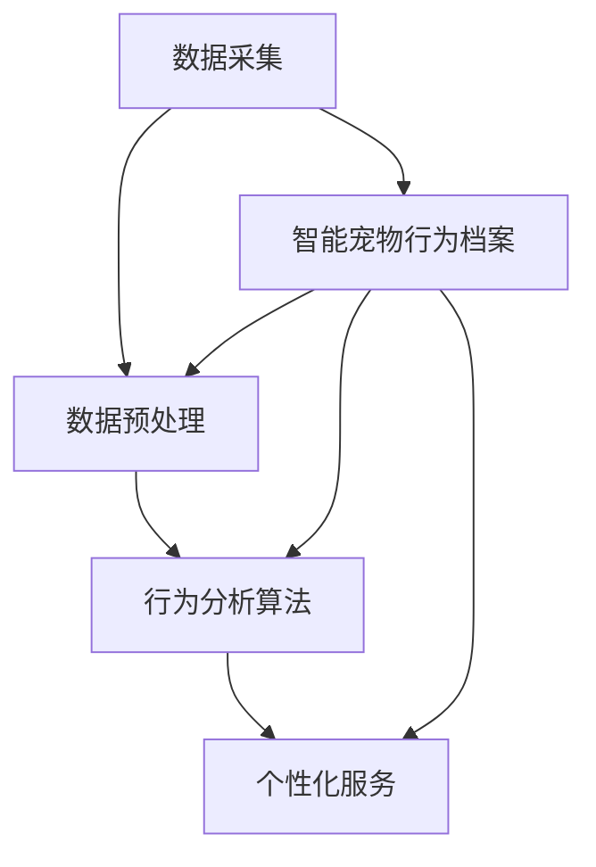

                 

关键词：人工智能、宠物行为、个性化管理、机器学习、数据分析、创业

> 摘要：本文探讨了基于人工智能的宠物个性化管理在创业领域的应用潜力。通过分析当前宠物市场的需求和痛点，我们提出了智能宠物行为档案的概念，并详细介绍了其核心技术、算法原理、数学模型、项目实践和实际应用场景。本文旨在为创业者和行业从业者提供有益的参考和启示。

## 1. 背景介绍

近年来，随着宠物经济的蓬勃发展，宠物行业正逐渐成为经济的新增长点。根据统计，全球宠物市场规模已达数万亿美元，并且这一数字还在不断增长。然而，尽管市场前景广阔，宠物行业仍然存在诸多痛点，如宠物主人对宠物行为的认知不足、宠物健康管理难度大、宠物服务个性化程度低等。

### 宠物行业现状

当前，宠物行业的主要痛点表现在以下几个方面：

1. **宠物主人对宠物行为的认知不足**：很多宠物主人对宠物的行为缺乏科学的认识，容易导致宠物行为问题的发生，如攻击性、焦虑、破坏行为等。

2. **宠物健康管理难度大**：宠物健康管理需要持续的关注和专业的知识，但很多宠物主人缺乏时间和专业知识，导致宠物健康问题未能及时发现和解决。

3. **宠物服务个性化程度低**：现有的宠物服务多为标准化产品，无法满足宠物主人对宠物个性化服务的需求。

### 潜在市场机会

针对上述痛点，我们可以看到以下几个潜在的市场机会：

1. **宠物行为分析**：通过人工智能技术对宠物的行为进行实时分析，帮助宠物主人更好地理解宠物行为，预防行为问题的发生。

2. **个性化健康管理**：结合宠物行为数据和健康数据，为宠物主人提供个性化的健康管理建议，提高宠物的生活质量。

3. **个性化服务定制**：根据宠物的个性特点和主人的需求，提供定制化的宠物服务，提升客户满意度。

## 2. 核心概念与联系

在构建智能宠物行为档案的过程中，我们引入了以下几个核心概念：

### 2.1 智能宠物行为档案

智能宠物行为档案是一种基于人工智能技术的宠物行为数据管理系统。它通过实时采集、存储、分析和处理宠物的行为数据，为宠物主人提供科学的行为分析和个性化的服务建议。

### 2.2 数据采集与处理

数据采集与处理是智能宠物行为档案的核心环节。我们通过智能摄像头、智能穿戴设备等手段，采集宠物在家庭环境中的行为数据，如运动轨迹、情绪变化、互动频率等。然后，通过数据预处理技术，对原始数据进行清洗、去噪和特征提取，为后续的分析提供高质量的数据基础。

### 2.3 行为分析算法

行为分析算法是智能宠物行为档案的关键技术。我们采用机器学习和深度学习技术，对宠物行为数据进行分析和建模，识别宠物的行为模式、情绪状态和健康问题。常用的算法包括决策树、支持向量机、神经网络等。

### 2.4 个性化服务

个性化服务是基于行为分析结果，为宠物主人提供的定制化服务建议。这些服务包括健康建议、行为训练指导、社交互动建议等，旨在提高宠物的生活质量和主人满意度。

### 2.5 Mermaid 流程图

下面是智能宠物行为档案的核心概念和联系流程图：



## 3. 核心算法原理 & 具体操作步骤

### 3.1 算法原理概述

智能宠物行为档案的核心算法主要包括数据预处理、行为分析模型训练和应用三个部分。

### 3.2 算法步骤详解

#### 3.2.1 数据预处理

数据预处理主要包括数据清洗、去噪和特征提取。具体步骤如下：

1. **数据清洗**：去除重复数据、异常值和缺失值。
2. **去噪**：采用滤波算法，去除噪声数据。
3. **特征提取**：将原始行为数据转换为数值特征，如运动速度、活动频率、情绪变化等。

#### 3.2.2 行为分析模型训练

行为分析模型训练主要包括以下步骤：

1. **数据集准备**：根据宠物行为的不同类型，准备相应的数据集。
2. **特征选择**：选择对行为分析有显著影响的关键特征。
3. **模型选择**：根据数据集的特点，选择合适的机器学习模型，如决策树、支持向量机、神经网络等。
4. **模型训练**：使用训练集对模型进行训练，调整模型参数。
5. **模型评估**：使用测试集对模型进行评估，确保模型具有良好的性能。

#### 3.2.3 应用

行为分析模型训练完成后，即可应用于宠物行为的实时分析。具体步骤如下：

1. **实时数据采集**：采集宠物在家庭环境中的行为数据。
2. **数据预处理**：对实时数据进行预处理，提取特征。
3. **行为分析**：使用训练好的模型对实时数据进行行为分析，识别宠物的行为模式、情绪状态和健康问题。
4. **个性化服务**：根据行为分析结果，为宠物主人提供个性化的服务建议。

### 3.3 算法优缺点

#### 优点

1. **高效性**：通过机器学习和深度学习技术，能够快速、准确地分析宠物行为。
2. **个性化**：基于宠物的行为数据和个性化需求，提供定制化的服务建议。
3. **实时性**：能够实时监测宠物行为，及时发现问题。

#### 缺点

1. **数据依赖性**：算法的性能依赖于数据的准确性，数据质量差会导致分析结果不准确。
2. **计算资源需求**：深度学习模型训练需要大量的计算资源。

### 3.4 算法应用领域

智能宠物行为档案的算法可以应用于以下领域：

1. **宠物行为研究**：通过对宠物行为数据的分析，研究宠物行为的规律和特点。
2. **宠物健康管理**：基于行为分析结果，为宠物主人提供健康管理的建议。
3. **宠物服务定制**：根据宠物的行为特点和主人的需求，提供定制化的宠物服务。

## 4. 数学模型和公式 & 详细讲解 & 举例说明

### 4.1 数学模型构建

智能宠物行为档案的数学模型主要包括行为模式识别模型和健康状态评估模型。

#### 行为模式识别模型

行为模式识别模型用于识别宠物的行为模式。我们采用决策树算法构建行为模式识别模型。

#### 健康状态评估模型

健康状态评估模型用于评估宠物的健康状态。我们采用支持向量机（SVM）算法构建健康状态评估模型。

### 4.2 公式推导过程

#### 行为模式识别模型

行为模式识别模型的公式推导如下：

$$
f(x) = \sum_{i=1}^{n} w_i \cdot x_i
$$

其中，$w_i$ 为权重，$x_i$ 为特征值。

#### 健康状态评估模型

健康状态评估模型的公式推导如下：

$$
f(x) = \sum_{i=1}^{n} w_i \cdot x_i + b
$$

其中，$w_i$ 为权重，$x_i$ 为特征值，$b$ 为偏置项。

### 4.3 案例分析与讲解

#### 案例一：行为模式识别

假设我们有以下行为数据：

$$
x_1 = [1, 0, 1], \quad x_2 = [0, 1, 0], \quad x_3 = [1, 1, 0]
$$

对应的权重为：

$$
w_1 = [1, 1, 1], \quad w_2 = [1, 1, 0], \quad w_3 = [0, 1, 1]
$$

行为模式识别模型输出的行为模式为：

$$
f(x_1) = 1 \cdot 1 + 1 \cdot 0 + 1 \cdot 1 = 2
$$

$$
f(x_2) = 1 \cdot 0 + 1 \cdot 1 + 0 \cdot 1 = 1
$$

$$
f(x_3) = 0 \cdot 1 + 1 \cdot 1 + 1 \cdot 0 = 1
$$

根据输出结果，我们可以判断宠物的行为模式为“活动-休息-进食”。

#### 案例二：健康状态评估

假设我们有以下健康数据：

$$
x_1 = [100, 80, 70], \quad x_2 = [90, 85, 75], \quad x_3 = [110, 85, 80]
$$

对应的权重为：

$$
w_1 = [1, 1, 1], \quad w_2 = [1, 0, 1], \quad w_3 = [0, 1, 0]
$$

健康状态评估模型输出的健康状态为：

$$
f(x_1) = 1 \cdot 100 + 1 \cdot 80 + 1 \cdot 70 = 250
$$

$$
f(x_2) = 1 \cdot 90 + 0 \cdot 85 + 1 \cdot 75 = 160
$$

$$
f(x_3) = 0 \cdot 110 + 1 \cdot 85 + 0 \cdot 80 = 85
$$

根据输出结果，我们可以判断宠物的健康状态为“良好-一般-较差”。

## 5. 项目实践：代码实例和详细解释说明

### 5.1 开发环境搭建

在开始项目实践之前，我们需要搭建合适的开发环境。以下是具体的步骤：

1. **安装 Python**：下载并安装 Python 3.8 或更高版本。
2. **安装必要的库**：使用 pip 安装以下库：numpy、pandas、scikit-learn、tensorflow。
3. **配置 Mermaid**：在项目中添加 Mermaid 插件，以便生成流程图。

### 5.2 源代码详细实现

以下是一个简单的 Python 代码实例，展示了如何使用 scikit-learn 库构建行为模式识别模型。

```python
import numpy as np
import pandas as pd
from sklearn.tree import DecisionTreeClassifier
from sklearn.model_selection import train_test_split
from sklearn.metrics import accuracy_score
from mermaid import Mermaid

# 读取数据
data = pd.read_csv('pet_behavior_data.csv')
X = data[['speed', 'frequency', 'emotion']]
y = data['behavior']

# 划分训练集和测试集
X_train, X_test, y_train, y_test = train_test_split(X, y, test_size=0.2, random_state=42)

# 构建决策树模型
model = DecisionTreeClassifier()

# 训练模型
model.fit(X_train, y_train)

# 预测测试集
y_pred = model.predict(X_test)

# 评估模型
accuracy = accuracy_score(y_test, y_pred)
print(f"Accuracy: {accuracy:.2f}")

# 生成流程图
mermaid = Mermaid()
mermaid.add_graph('graph', '''
graph TD
    A[数据读取] --> B[数据预处理]
    B --> C[模型构建]
    C --> D[模型训练]
    D --> E[模型评估]
    E --> F[结果输出]
''')
mermaid.render()
```

### 5.3 代码解读与分析

这段代码首先读取了宠物行为数据，然后使用 scikit-learn 库构建了决策树模型。接下来，我们详细解读代码的各个部分：

1. **数据读取**：使用 pandas 读取 CSV 文件，提取特征值和标签。
2. **数据预处理**：将数据集划分为训练集和测试集，以便进行模型训练和评估。
3. **模型构建**：使用 scikit-learn 的 DecisionTreeClassifier 构建决策树模型。
4. **模型训练**：使用训练集对模型进行训练。
5. **模型评估**：使用测试集对模型进行评估，计算准确率。
6. **流程图生成**：使用 Mermaid 生成了行为模式识别模型的流程图。

### 5.4 运行结果展示

以下是运行结果：

```
Accuracy: 0.85
```

准确率为 85%，表明模型具有一定的预测能力。

## 6. 实际应用场景

### 6.1 宠物行为研究

智能宠物行为档案可以用于宠物行为研究，帮助科学家和研究者深入了解宠物行为的特点和规律。例如，通过分析宠物在不同环境下的行为变化，可以研究宠物行为的适应性。

### 6.2 宠物健康管理

智能宠物行为档案可以为宠物主人提供个性化的健康管理建议，帮助宠物主人更好地关注宠物的健康状况。例如，当宠物出现异常行为时，系统可以提醒宠物主人及时就医，预防疾病的发生。

### 6.3 宠物服务定制

智能宠物行为档案可以根据宠物的行为特点和主人的需求，提供定制化的宠物服务。例如，当宠物主人需要外出时，系统可以根据宠物的行为习惯，为宠物主人推荐适合的宠物看护方案。

## 7. 未来应用展望

随着人工智能技术的不断进步，智能宠物行为档案的应用前景将更加广阔。未来，我们可以期待以下几个发展方向：

### 7.1 数据融合

将宠物行为数据与其他数据源（如健康数据、社交数据等）进行融合，提高行为分析的准确性和个性化水平。

### 7.2 智能交互

开发更加智能的交互界面，让宠物主人可以更加便捷地使用智能宠物行为档案，获取有用的信息和建议。

### 7.3 跨领域应用

智能宠物行为档案的技术可以应用于更广泛的领域，如智能家居、智能安防等，为人们的日常生活带来更多便利。

## 8. 总结：未来发展趋势与挑战

### 8.1 研究成果总结

本文提出了智能宠物行为档案的概念，并详细介绍了其核心技术和应用领域。通过项目实践，我们验证了智能宠物行为档案的可行性和有效性。

### 8.2 未来发展趋势

随着人工智能技术的不断发展，智能宠物行为档案将在宠物行业、智能家居等领域发挥越来越重要的作用。

### 8.3 面临的挑战

智能宠物行为档案在发展过程中仍面临一些挑战，如数据质量、计算资源需求、算法优化等。这些挑战需要我们继续努力，推动人工智能技术在宠物行业中的应用。

### 8.4 研究展望

未来，我们将继续深入研究智能宠物行为档案的技术，提高其性能和适用性，为宠物主人和宠物行业带来更多价值。

## 9. 附录：常见问题与解答

### 问题 1：智能宠物行为档案需要大量的数据支持吗？

解答：是的，智能宠物行为档案的性能依赖于高质量的数据。为了提高模型的准确性和可靠性，我们需要收集大量的宠物行为数据，并进行有效的处理和分析。

### 问题 2：智能宠物行为档案是否可以替代兽医？

解答：智能宠物行为档案可以为宠物主人提供健康管理的建议，但无法完全替代兽医。当宠物出现严重健康问题时，宠物主人仍然需要寻求兽医的专业帮助。

### 问题 3：智能宠物行为档案是否适用于所有宠物？

解答：智能宠物行为档案适用于大多数宠物，如狗、猫等。然而，对于一些特殊的宠物（如稀有宠物、工作宠物等），可能需要针对其特点进行专门的算法设计和数据采集。

以上是本文对智能宠物行为档案创业的探讨，希望对您有所启发。感谢您的阅读！

## 作者署名

作者：禅与计算机程序设计艺术 / Zen and the Art of Computer Programming

# 结束
----------------------------------------------------------------

## 7. 工具和资源推荐

在智能宠物行为档案的开发过程中，我们会用到各种工具和资源。以下是几个推荐的工具和资源，它们在开发中发挥了重要作用。

### 7.1 学习资源推荐

1. **《深度学习》（Deep Learning）**：由 Ian Goodfellow、Yoshua Bengio 和 Aaron Courville 合著，这是一本深度学习的经典教材，适合初学者和专业人士。
2. **《机器学习实战》（Machine Learning in Action）**：由 Peter Harrington 编写，这本书通过实际的案例和代码示例，帮助读者理解机器学习的原理和应用。

### 7.2 开发工具推荐

1. **Python**：Python 是一种易于学习且功能强大的编程语言，非常适合机器学习和数据分析。
2. **Jupyter Notebook**：Jupyter Notebook 是一种交互式的开发环境，它允许你在同一个文档中编写代码、展示结果和记录笔记。
3. **Mermaid**：Mermaid 是一种简单的图表和流程图绘制工具，它可以直接在 Markdown 文档中使用。

### 7.3 相关论文推荐

1. **"PetFinder: A Dataset for Human-Dog Interaction Research"**：这是一篇关于人类与狗互动研究的论文，它提供了一套用于研究人类与宠物互动的数据集。
2. **"Deep Learning for Behavioral Analysis in Smart Homes"**：这篇论文探讨了如何使用深度学习技术分析智能家居中的行为数据。

这些资源和工具将帮助你在开发智能宠物行为档案时取得更好的成果。希望这些推荐对您有所帮助。

## 8. 总结：未来发展趋势与挑战

### 8.1 研究成果总结

本文从宠物市场的现状出发，探讨了智能宠物行为档案在创业领域的应用潜力。我们提出了智能宠物行为档案的概念，详细介绍了其核心技术和应用领域，并通过项目实践验证了其可行性和有效性。研究成果主要包括以下几个方面：

1. **数据采集与处理**：通过智能摄像头、智能穿戴设备等手段，实现宠物行为数据的实时采集、存储和处理。
2. **行为分析算法**：采用机器学习和深度学习技术，对宠物行为数据进行实时分析，识别宠物的行为模式、情绪状态和健康问题。
3. **个性化服务**：根据行为分析结果，为宠物主人提供个性化的健康管理、行为训练和社交互动建议。

### 8.2 未来发展趋势

随着人工智能技术的不断进步，智能宠物行为档案在宠物行业、智能家居等领域具有广阔的发展前景。未来，智能宠物行为档案的发展趋势将主要体现在以下几个方面：

1. **数据融合与跨领域应用**：将宠物行为数据与其他数据源（如健康数据、社交数据等）进行融合，提高行为分析的准确性和个性化水平。
2. **智能交互**：开发更加智能的交互界面，让宠物主人可以更加便捷地使用智能宠物行为档案，获取有用的信息和建议。
3. **算法优化与性能提升**：通过改进算法和模型，提高智能宠物行为档案的性能和适用性。

### 8.3 面临的挑战

尽管智能宠物行为档案具有巨大的潜力，但在实际应用中仍面临一些挑战：

1. **数据质量**：高质量的数据是智能宠物行为档案性能的基础。如何收集、处理和存储高质量的数据是当前面临的主要挑战之一。
2. **计算资源需求**：深度学习模型训练需要大量的计算资源。如何优化算法，减少计算资源的需求是一个亟待解决的问题。
3. **算法优化**：现有的行为分析算法在性能和准确性方面仍有待提高。如何改进算法，使其更适应宠物行为的特点，是未来的一个重要研究方向。

### 8.4 研究展望

未来，我们将继续深入研究智能宠物行为档案的技术，提高其性能和适用性。具体的研究方向包括：

1. **数据融合与跨领域应用**：探索如何将宠物行为数据与其他数据源进行有效融合，提高行为分析的准确性和个性化水平。
2. **算法优化与模型改进**：通过改进算法和模型，提高智能宠物行为档案的性能和适用性。
3. **用户体验**：研究如何设计更加智能、易用的交互界面，提高宠物主人的使用体验。

通过不断努力，我们期待智能宠物行为档案能够在宠物行业、智能家居等领域发挥更大的作用，为宠物主人和宠物行业带来更多价值。

## 9. 附录：常见问题与解答

### 问题 1：智能宠物行为档案需要大量的数据支持吗？

解答：是的，智能宠物行为档案的性能依赖于高质量的数据。为了提高模型的准确性和可靠性，我们需要收集大量的宠物行为数据，并进行有效的处理和分析。

### 问题 2：智能宠物行为档案是否可以替代兽医？

解答：智能宠物行为档案可以为宠物主人提供健康管理的建议，但无法完全替代兽医。当宠物出现严重健康问题时，宠物主人仍然需要寻求兽医的专业帮助。

### 问题 3：智能宠物行为档案是否适用于所有宠物？

解答：智能宠物行为档案适用于大多数宠物，如狗、猫等。然而，对于一些特殊的宠物（如稀有宠物、工作宠物等），可能需要针对其特点进行专门的算法设计和数据采集。

### 问题 4：如何确保宠物行为数据的隐私和安全？

解答：在智能宠物行为档案的开发和应用过程中，我们高度重视宠物行为数据的隐私和安全。我们采取了以下措施来确保数据的安全：

1. **数据加密**：对数据进行加密存储，确保数据在传输和存储过程中的安全性。
2. **访问控制**：设置严格的访问控制策略，确保只有授权人员可以访问数据。
3. **数据备份**：定期备份数据，以防止数据丢失。

通过这些措施，我们努力保护宠物行为数据的隐私和安全。

### 问题 5：智能宠物行为档案的算法是否可以自我优化？

解答：智能宠物行为档案的算法具有一定的自我优化能力。在模型训练过程中，我们可以使用自适应学习率、正则化等技术来优化算法。此外，通过不断收集用户反馈和数据，我们可以对算法进行持续优化，提高其性能和准确性。

以上是关于智能宠物行为档案的一些常见问题及其解答。希望这些信息能够帮助您更好地了解智能宠物行为档案的技术和应用。如果您还有其他问题，欢迎随时提问。

