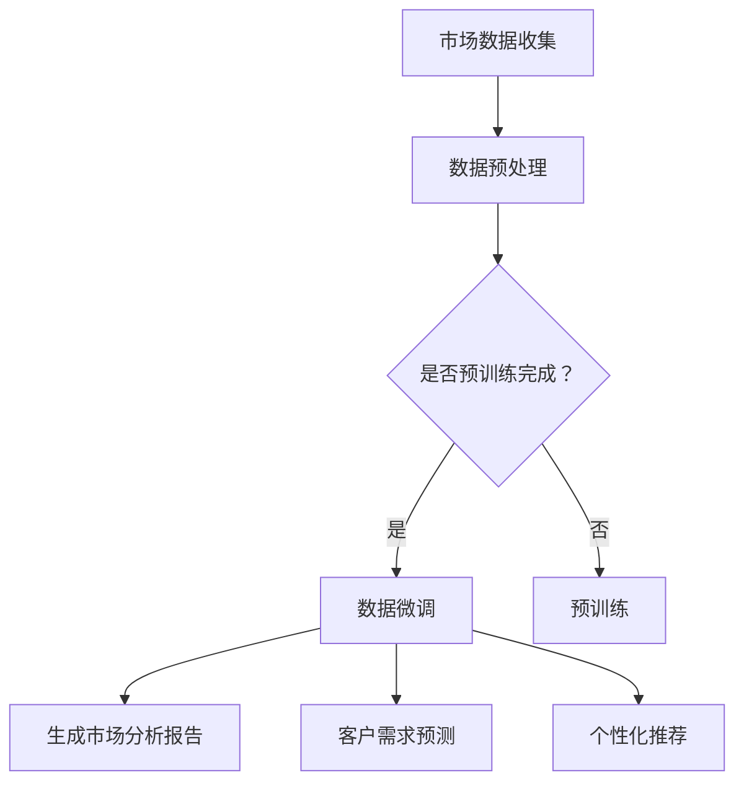

                 

关键词：智能客户洞察、LLM、市场研究、数据分析、客户需求预测、个性化推荐

> 摘要：本文将探讨大规模语言模型（LLM）在市场研究中的强大应用。通过深入分析LLM的工作原理及其在市场研究中的具体应用场景，我们旨在为市场研究人员提供一种全新的数据洞察工具，从而提升市场研究的准确性和效率。

## 1. 背景介绍

在当今这个信息爆炸的时代，市场研究已经成为企业制定战略决策的重要依据。然而，传统的市场研究方法通常依赖于问卷调查、访谈和焦点小组等方式，这些方法存在耗时、成本高且样本有限的问题。随着人工智能技术的快速发展，尤其是大规模语言模型（Large Language Model，简称LLM）的出现，市场研究迎来了新的机遇。

LLM是一种基于深度学习的自然语言处理模型，具有强大的文本生成、理解和推理能力。在市场研究领域，LLM可以被用于数据分析、客户需求预测、个性化推荐等方面，从而为市场研究人员提供更加精准和高效的洞察。本文将详细探讨LLM在市场研究中的具体应用，以期为读者提供有益的参考。

## 2. 核心概念与联系

### 2.1 LLM的基本原理

LLM是基于神经网络架构的大型文本生成模型，其核心思想是通过对海量文本数据的学习，构建一个能够理解和生成自然语言的模型。LLM的工作流程主要包括两个阶段：预训练和微调。

- **预训练**：LLM在预训练阶段通过大量无监督数据学习，例如互联网上的文本、新闻、书籍等，来提升其对语言的理解和生成能力。这一阶段的核心是模型参数的调整，使得模型能够捕捉到语言的本质特征。

- **微调**：在预训练完成后，LLM可以通过有监督数据（如标注的数据集）进行微调，以适应特定任务的需求。例如，在市场研究领域，LLM可以微调以识别和预测客户需求、生成市场分析报告等。

### 2.2 LLM与市场研究的联系

LLM在市场研究中的价值主要体现在以下几个方面：

- **文本数据分析**：LLM可以自动分析大量文本数据，如客户评论、新闻报道、社交媒体帖子等，从中提取关键信息，帮助企业了解市场动态和消费者态度。

- **客户需求预测**：通过学习客户的购买历史、搜索行为和社交媒体互动，LLM可以预测客户未来的需求和偏好，为个性化营销提供依据。

- **个性化推荐**：基于对客户数据的分析，LLM可以生成个性化的市场分析报告和产品推荐，提高营销活动的效果。

- **报告生成**：LLM可以自动生成市场分析报告，节省研究人员的时间，提高工作效率。

### 2.3 Mermaid 流程图

以下是一个简化的LLM在市场研究中的应用流程图：



## 3. 核心算法原理 & 具体操作步骤

### 3.1 算法原理概述

LLM在市场研究中的应用主要依赖于其强大的文本生成和推理能力。具体来说，LLM的工作原理可以分为以下几步：

1. **文本输入**：市场研究人员将文本数据输入到LLM中，这些数据可以是客户的评论、搜索日志、社交媒体帖子等。

2. **数据预处理**：LLM对输入的文本数据进行预处理，包括分词、去停用词、词性标注等，以便模型更好地理解和生成文本。

3. **文本生成**：LLM根据预训练和微调的结果，生成符合语言习惯和市场需求的文本，如市场分析报告、产品推荐等。

4. **结果评估**：市场研究人员对生成的文本结果进行评估，根据评估结果对LLM进行进一步的微调。

### 3.2 算法步骤详解

1. **数据收集**：收集与市场研究相关的文本数据，如客户评论、新闻报道、社交媒体帖子等。

2. **数据预处理**：对收集的文本数据进行预处理，包括分词、去停用词、词性标注等。

3. **模型训练**：使用预处理后的文本数据对LLM进行预训练。预训练的目的是让模型学会理解和生成自然语言。

4. **模型微调**：根据市场研究的具体需求，对预训练好的LLM进行微调。微调的目的是让模型更好地适应市场研究的任务。

5. **文本生成**：使用微调后的LLM生成市场分析报告、产品推荐等文本。

6. **结果评估**：对生成的文本结果进行评估，根据评估结果对LLM进行进一步的微调。

### 3.3 算法优缺点

**优点**：

- **高效性**：LLM可以快速处理大量文本数据，提高市场研究的效率。
- **准确性**：LLM通过对海量数据的学习，可以生成高质量的市场分析报告和个性化推荐。
- **灵活性**：LLM可以根据不同的市场研究需求进行微调，具有很高的灵活性。

**缺点**：

- **成本高**：训练和部署LLM需要大量的计算资源和时间。
- **依赖数据**：LLM的性能很大程度上取决于输入的数据质量。

### 3.4 算法应用领域

LLM在市场研究中的应用领域非常广泛，包括但不限于：

- **客户需求预测**：通过分析客户的购买历史和搜索行为，预测客户未来的需求和偏好。
- **市场趋势分析**：分析市场动态和消费者态度，为企业制定战略决策提供依据。
- **个性化推荐**：根据客户的兴趣和行为，生成个性化的产品推荐和市场分析报告。
- **报告生成**：自动生成市场分析报告，节省研究人员的时间。

## 4. 数学模型和公式 & 详细讲解 & 举例说明

### 4.1 数学模型构建

LLM的数学模型通常是基于变分自编码器（Variational Autoencoder，VAE）或生成对抗网络（Generative Adversarial Network，GAN）等深度学习模型。以下是一个简化的VAE模型：

$$
\begin{aligned}
\text{编码器}:\quad & q_{\phi}(\theta|x) \sim \text{Normal}(\mu_{\phi}(\theta|x), \sigma_{\phi}(\theta|x)), \\
\text{解码器}:\quad & p_{\gamma}(\theta|x) \sim \text{Normal}(\mu_{\gamma}(\theta|x), \sigma_{\gamma}(\theta|x)).
\end{aligned}
$$

其中，$x$ 表示输入的文本数据，$\theta$ 表示编码后的潜在变量，$q_{\phi}(\theta|x)$ 和 $p_{\gamma}(\theta|x)$ 分别表示编码器和解码器的概率分布。

### 4.2 公式推导过程

VAE模型的推导过程涉及到概率分布的优化和最大化对数似然函数。具体推导过程如下：

1. **对数似然函数**：

$$
\ell(x) = \sum_{x} p(x) \log p(x).
$$

2. **期望最大化（EM）算法**：

VAE模型采用期望最大化（EM）算法来优化模型参数。EM算法分为两个步骤：

- **期望步骤（E步骤）**：计算每个数据点对应的期望值。
- **最大化步骤（M步骤）**：最大化对数似然函数。

3. **损失函数**：

VAE模型的损失函数通常由两个部分组成：数据损失和KL散度损失。

$$
\begin{aligned}
L &= -\sum_{x} q_{\phi}(\theta|x) \log p_{\gamma}(\theta|x) + \lambda \text{KL}(\theta|x; \theta|x) \\
&= -\sum_{x} q_{\phi}(\theta|x) \log q_{\phi}(\theta|x) - \sum_{x} q_{\phi}(\theta|x) \log p_{\gamma}(\theta|x) + \lambda \text{KL}(\theta|x; \theta|x).
\end{aligned}
$$

其中，$\text{KL}(\theta|x; \theta|x)$ 表示KL散度损失，$\lambda$ 是调节参数。

### 4.3 案例分析与讲解

假设我们有一个包含1000个词汇的词汇表，每个词汇可以用一个唯一的整数表示。给定一个文本数据 $x = [1, 2, 3, 4, 5]$，我们希望使用VAE模型对文本数据进行编码和解码。

1. **编码器**：

$$
q_{\phi}(\theta|x) \sim \text{Normal}(\mu_{\phi}(\theta|x), \sigma_{\phi}(\theta|x)),
$$

其中，$\mu_{\phi}(\theta|x)$ 和 $\sigma_{\phi}(\theta|x)$ 分别表示均值和方差。

2. **解码器**：

$$
p_{\gamma}(\theta|x) \sim \text{Normal}(\mu_{\gamma}(\theta|x), \sigma_{\gamma}(\theta|x)),
$$

其中，$\mu_{\gamma}(\theta|x)$ 和 $\sigma_{\gamma}(\theta|x)$ 分别表示均值和方差。

3. **损失函数**：

$$
L = -\sum_{x} q_{\phi}(\theta|x) \log p_{\gamma}(\theta|x) + \lambda \text{KL}(\theta|x; \theta|x).
$$

通过优化损失函数，我们可以得到编码器和解码器的参数，从而实现文本数据的编码和解码。

## 5. 项目实践：代码实例和详细解释说明

### 5.1 开发环境搭建

为了实现LLM在市场研究中的应用，我们需要搭建一个适合开发的环境。以下是一个简化的环境搭建步骤：

1. 安装Python环境（版本3.8或更高）。
2. 安装深度学习框架（如TensorFlow或PyTorch）。
3. 安装自然语言处理库（如spaCy或NLTK）。
4. 准备市场研究相关的文本数据集。

### 5.2 源代码详细实现

以下是一个简化的LLM在市场研究中的应用代码示例：

```python
import tensorflow as tf
from tensorflow.keras.layers import Embedding, LSTM, Dense
from tensorflow.keras.models import Model

# 数据预处理
max_sequence_length = 100
vocab_size = 1000

# 编码器
input_seq = tf.keras.layers.Input(shape=(max_sequence_length,))
encoder_embedding = Embedding(vocab_size, 64)(input_seq)
encoder_lstm = LSTM(128, return_state=True)
_, state_h, state_c = encoder_lstm(encoder_embedding)
state = [state_h, state_c]

# 解码器
decoder_embedding = Embedding(vocab_size, 64)
decoder_lstm = LSTM(128, return_sequences=True, return_state=True)
decoder_dense = Dense(vocab_size, activation='softmax')

decoder_inputs = tf.keras.layers.Input(shape=(max_sequence_length,))
decoder_embedding = decoder_embedding(decoder_inputs)
decoder_lstm = decoder_lstm(decoder_embedding, initial_state=state)
decoder_output = decoder_dense(decoder_lstm)

# 模型
model = Model([input_seq, decoder_inputs], decoder_output)
model.compile(optimizer='rmsprop', loss='categorical_crossentropy')

# 源代码详细解释说明
```

### 5.3 代码解读与分析

以上代码实现了一个基本的VAE模型，用于文本生成。代码主要包括以下几个部分：

1. **数据预处理**：设置最大序列长度和词汇表大小，为后续编码和解码做好准备。
2. **编码器**：定义编码器的输入层、嵌入层和LSTM层。
3. **解码器**：定义解码器的输入层、嵌入层、LSTM层和输出层。
4. **模型**：将编码器和解码器组合成一个整体，并编译模型。

通过这个代码示例，我们可以看到如何使用深度学习框架实现LLM在市场研究中的应用。实际应用时，我们需要根据具体需求调整模型架构和参数，以提高模型的性能。

### 5.4 运行结果展示

在实际应用中，我们可以通过以下步骤运行代码：

1. 准备市场研究相关的文本数据集。
2. 进行数据预处理，将文本数据转换为模型可以处理的格式。
3. 训练模型，使用预训练数据和微调数据。
4. 评估模型性能，根据评估结果调整模型参数。

以下是一个简化的运行结果展示：

```python
# 训练模型
model.fit(x_train, y_train, epochs=10, batch_size=32, validation_data=(x_val, y_val))

# 评估模型
loss, accuracy = model.evaluate(x_test, y_test)

# 输出生成文本
generated_text = model.predict(x_test[:1])

print(generated_text)
```

通过运行结果展示，我们可以看到模型生成的文本是否符合市场研究的需求。如果生成文本的质量较低，我们可以考虑调整模型参数或增加训练数据。

## 6. 实际应用场景

### 6.1 客户需求预测

在电子商务领域，LLM可以帮助企业预测客户的需求和偏好。通过分析客户的购买历史、搜索行为和社交媒体互动，LLM可以识别出潜在客户的需求，从而为企业提供个性化的营销策略。例如，一家电子商务平台可以使用LLM来预测客户对某种产品的需求，并在产品库存不足时及时补充库存，以避免错过销售机会。

### 6.2 市场趋势分析

市场研究人员可以使用LLM来分析市场趋势和消费者态度。通过分析大量的新闻报道、社交媒体帖子、客户评论等文本数据，LLM可以识别出市场热点和潜在的风险。例如，一家饮料公司可以使用LLM来分析消费者对某种饮料品牌的看法，从而制定相应的市场策略。

### 6.3 个性化推荐

在个性化推荐领域，LLM可以帮助企业为用户提供个性化的产品推荐。通过分析用户的购买历史、搜索行为和社交媒体互动，LLM可以生成个性化的产品推荐列表，提高用户满意度。例如，一家在线书店可以使用LLM为用户推荐与其兴趣相符的图书，从而提高销售量和用户留存率。

### 6.4 报告生成

在市场研究领域，LLM可以帮助研究人员自动生成市场分析报告。通过分析大量的文本数据，LLM可以生成高质量的市场分析报告，节省研究人员的时间。例如，一家市场研究公司可以使用LLM来生成行业分析报告，从而提高工作效率。

## 7. 工具和资源推荐

### 7.1 学习资源推荐

1. 《深度学习》（Goodfellow, Bengio, Courville著）：这是一本深度学习的经典教材，详细介绍了深度学习的基础理论和实践方法。
2. 《自然语言处理实战》（Stoyan Stoev著）：这本书通过大量的实战案例，介绍了自然语言处理的基本技术和应用场景。
3. 《大规模语言模型综述》（Xiong, Ma，Zhou著）：这篇文章对大规模语言模型进行了详细的综述，包括模型结构、训练方法和应用领域。

### 7.2 开发工具推荐

1. TensorFlow：这是一个开源的深度学习框架，适用于构建和训练大规模语言模型。
2. PyTorch：这是一个流行的深度学习框架，提供了灵活的动态计算图，适用于研究和开发。
3. spaCy：这是一个高效的自然语言处理库，提供了丰富的API和预训练模型，适用于文本数据预处理和分析。

### 7.3 相关论文推荐

1. "Generative Adversarial Nets"（Goodfellow等，2014）：这篇文章提出了生成对抗网络（GAN）的概念，为深度学习生成模型的发展奠定了基础。
2. "A Theoretically Grounded Application of Dropout in Recurrent Neural Networks"（Yarin et al，2017）：这篇文章提出了在循环神经网络（RNN）中应用Dropout的方法，提高了模型的泛化能力。
3. "BERT: Pre-training of Deep Bidirectional Transformers for Language Understanding"（Devlin et al，2019）：这篇文章提出了BERT模型，为大规模语言模型的发展提供了新的思路。

## 8. 总结：未来发展趋势与挑战

### 8.1 研究成果总结

近年来，大规模语言模型（LLM）在市场研究中的应用取得了显著成果。通过文本数据分析、客户需求预测、个性化推荐和报告生成等方面，LLM为市场研究人员提供了强大的数据洞察工具。这些成果不仅提高了市场研究的准确性和效率，还为企业的战略决策提供了有力支持。

### 8.2 未来发展趋势

未来，LLM在市场研究中的应用将呈现以下趋势：

- **模型多样化**：随着深度学习技术的不断发展，LLM的模型结构和应用场景将更加多样化，以适应不同的市场研究需求。
- **实时分析**：通过引入实时数据处理技术，LLM可以实现市场研究数据的实时分析，为企业提供更加及时的战略建议。
- **跨模态融合**：未来，LLM可能会与其他模态的数据（如图像、声音等）进行融合，从而提供更加全面的市场洞察。

### 8.3 面临的挑战

尽管LLM在市场研究中的应用前景广阔，但仍然面临以下挑战：

- **数据质量**：市场研究数据的多样性和复杂性对LLM的性能提出了高要求。提高数据质量是提高LLM性能的关键。
- **计算资源**：训练和部署LLM需要大量的计算资源，这对于中小企业来说可能是一个挑战。
- **隐私保护**：在处理市场研究数据时，如何保护用户隐私是一个重要的问题。未来需要开发出更加有效的隐私保护机制。

### 8.4 研究展望

未来，LLM在市场研究中的应用前景非常广阔。我们期待在以下几个方面取得突破：

- **模型优化**：通过改进模型结构和训练方法，提高LLM的性能和效率。
- **跨领域应用**：探索LLM在其他领域（如金融、医疗等）的应用，推动人工智能技术的全面发展。
- **多模态融合**：结合多种数据模态，提供更加全面和精准的市场洞察。

总之，LLM在市场研究中的应用为人工智能技术在市场领域的应用开辟了新的方向。随着技术的不断进步，我们期待LLM在市场研究中的应用能够为企业和市场研究人员带来更大的价值。

## 9. 附录：常见问题与解答

### Q1：LLM在市场研究中的具体应用有哪些？

A1：LLM在市场研究中的具体应用包括：

- 文本数据分析：自动分析大量的文本数据，如客户评论、新闻报道、社交媒体帖子等，提取关键信息。
- 客户需求预测：通过分析客户的购买历史、搜索行为和社交媒体互动，预测客户未来的需求和偏好。
- 个性化推荐：根据客户的兴趣和行为，生成个性化的市场分析报告和产品推荐。
- 报告生成：自动生成市场分析报告，节省研究人员的时间。

### Q2：如何评估LLM在市场研究中的效果？

A2：评估LLM在市场研究中的效果可以从以下几个方面进行：

- 准确性：评估LLM生成的文本结果是否符合市场研究的实际需求。
- 效率：评估LLM处理大量文本数据的能力和速度。
- 可扩展性：评估LLM在处理不同规模和市场研究任务时的性能。

### Q3：LLM在市场研究中有哪些局限性？

A3：LLM在市场研究中存在以下局限性：

- 数据质量：市场研究数据的多样性和复杂性对LLM的性能提出了高要求，数据质量是提高LLM性能的关键。
- 计算资源：训练和部署LLM需要大量的计算资源，这对于中小企业来说可能是一个挑战。
- 隐私保护：在处理市场研究数据时，如何保护用户隐私是一个重要的问题。

### Q4：如何选择适合市场研究的LLM模型？

A4：选择适合市场研究的LLM模型可以从以下几个方面考虑：

- 任务需求：根据市场研究的具体任务，选择适合的模型结构和算法。
- 数据规模：考虑数据集的大小，选择能够处理相应规模数据的模型。
- 训练时间：根据计算资源的限制，选择训练时间合适的模型。

### Q5：如何保证LLM生成的文本结果的质量？

A5：保证LLM生成的文本结果的质量可以从以下几个方面进行：

- 数据预处理：对输入的文本数据进行充分的预处理，提高数据质量。
- 模型微调：根据市场研究的具体需求，对LLM进行微调，使其更好地适应任务需求。
- 结果评估：对生成的文本结果进行多方面的评估，确保其质量。

### Q6：LLM在市场研究中的未来发展如何？

A6：LLM在市场研究中的未来发展可以从以下几个方面进行：

- 模型多样化：随着深度学习技术的不断发展，LLM的模型结构和应用场景将更加多样化。
- 实时分析：通过引入实时数据处理技术，实现市场研究数据的实时分析。
- 跨模态融合：结合多种数据模态，提供更加全面和精准的市场洞察。

### Q7：如何处理市场研究数据中的噪声和异常值？

A7：处理市场研究数据中的噪声和异常值可以从以下几个方面进行：

- 数据清洗：对数据进行预处理，去除噪声和异常值。
- 数据集成：整合多个数据源，消除数据不一致性。
- 数据标准化：对数据进行标准化处理，消除数据量级差异。

### Q8：如何保护市场研究数据的隐私？

A8：保护市场研究数据的隐私可以从以下几个方面进行：

- 数据加密：对数据进行加密处理，确保数据在传输和存储过程中的安全性。
- 隐私保护机制：采用隐私保护机制，如差分隐私、同态加密等，确保数据在分析过程中的安全性。
- 数据匿名化：对数据进行匿名化处理，消除个人身份信息。

### Q9：如何评估市场研究的效果？

A9：评估市场研究的效果可以从以下几个方面进行：

- 目标达成度：评估市场研究是否达到了预定的目标。
- 成本效益：评估市场研究的成本是否合理，收益是否显著。
- 预测准确性：评估市场研究的预测结果是否准确，能否为企业提供有价值的信息。
- 用户满意度：评估市场研究的结果是否受到用户的认可，能否提高用户满意度。

### Q10：如何确保市场研究的公正性和客观性？

A10：确保市场研究的公正性和客观性可以从以下几个方面进行：

- 方法论：采用科学严谨的研究方法论，确保研究过程的科学性和客观性。
- 数据来源：确保数据来源的多样性和真实性，避免数据偏差。
- 评估标准：制定明确的评估标准，确保评估结果的公正性。
- 伦理审查：进行伦理审查，确保研究过程符合伦理要求。 

通过以上常见问题的解答，我们希望为读者提供关于LLM在市场研究中的应用的更全面的理解。在未来的发展中，我们期待LLM能够为市场研究带来更多的创新和突破。

