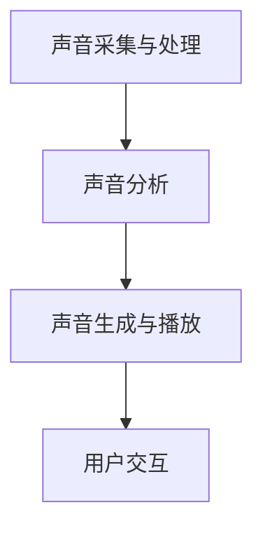

                 

关键词：智能家居，声音治疗，音频处理，身心健康管理，人工智能

摘要：本文将探讨智能家居声音治疗的创业机会，重点介绍基于音频的身心健康管理技术。通过分析声音对人类身心健康的影响，以及当前市场上相关产品的不足，我们将详细阐述智能家居声音治疗的核心概念、算法原理、数学模型、实践案例和未来应用场景。本文旨在为读者提供全面的行业洞察，助力创业者在智能家居声音治疗领域取得成功。

## 1. 背景介绍

随着人工智能技术的快速发展，智能家居市场逐渐壮大。人们对于健康生活的需求日益增加，催生了许多与健康相关的创新产品和服务。声音治疗作为一种非侵入性、自然的方法，被广泛应用于心理治疗、康复治疗和日常保健。智能家居声音治疗结合了这两大领域的优势，为用户提供了一种全新的健康生活方式。

然而，当前市场上的智能家居声音治疗产品存在以下不足：

1. **个性化定制不足**：大部分产品只能提供固定的声音治疗方案，无法根据用户的具体需求和健康状况进行个性化调整。
2. **用户体验差**：一些产品在声音质量、音效处理和交互设计方面存在不足，难以满足用户的期望。
3. **技术门槛高**：声音治疗技术的研发和应用需要较高的专业知识和研发投入，导致创业者进入门槛较高。

针对以上问题，本文将介绍一种基于音频处理的智能家居声音治疗方案，旨在解决当前市场痛点，为用户提供更优质的身心健康管理服务。

## 2. 核心概念与联系

### 2.1 声音对身心健康的影响

声音作为一种物理现象，对人类身心健康有着深远的影响。科学研究表明，声音可以通过以下几种方式改善身心健康：

1. **缓解压力**：特定频率的声音（如 alpha 波）可以刺激大脑，帮助用户放松身心，缓解压力。
2. **改善睡眠**：声音治疗可以干扰外界噪音，改善用户的睡眠质量。
3. **促进康复**：声音治疗在康复治疗中发挥着重要作用，如改善听力、缓解疼痛等。

### 2.2 智能家居声音治疗架构

智能家居声音治疗系统主要包括以下几个部分：

1. **声音采集与处理**：通过麦克风、传感器等设备采集用户的声音数据，进行预处理、滤波、增强等操作。
2. **声音分析**：利用信号处理、模式识别等技术对声音进行分析，提取声音特征。
3. **声音生成与播放**：根据用户的需求和声音特征，生成相应的声音治疗方案，并通过扬声器等设备播放。
4. **用户交互**：通过语音识别、触摸屏等技术实现用户与智能家居声音治疗系统的交互。

### 2.3 Mermaid 流程图



## 3. 核心算法原理 & 具体操作步骤

### 3.1 算法原理概述

智能家居声音治疗的核心算法包括声音采集与处理、声音分析、声音生成与播放和用户交互。以下分别介绍各算法的原理。

#### 3.1.1 声音采集与处理

声音采集与处理算法主要实现声音数据的采集、预处理、滤波、增强等操作。具体步骤如下：

1. **声音数据采集**：通过麦克风、传感器等设备实时采集用户的声音数据。
2. **预处理**：对采集到的声音数据进行降噪、去噪、归一化等预处理操作，提高声音质量。
3. **滤波**：利用滤波器对声音进行滤波，去除噪声和干扰。
4. **增强**：通过增强算法对声音进行增强，提高声音的清晰度和可听度。

#### 3.1.2 声音分析

声音分析算法主要利用信号处理、模式识别等技术对声音进行分析，提取声音特征。具体步骤如下：

1. **特征提取**：利用短时傅里叶变换（STFT）、梅尔频率倒谱系数（MFCC）等算法提取声音特征。
2. **特征匹配**：将提取到的声音特征与数据库中的特征进行匹配，判断声音的类型和属性。
3. **情感分析**：利用情感分析算法对声音的情感属性进行分析，如愉悦度、焦虑度等。

#### 3.1.3 声音生成与播放

声音生成与播放算法根据用户的需求和声音特征，生成相应的声音治疗方案，并通过扬声器等设备播放。具体步骤如下：

1. **声音生成**：根据用户需求和声音特征，选择合适的音频素材，利用音频合成技术生成声音治疗方案。
2. **音效处理**：对生成的声音进行音效处理，如淡入淡出、动态调整音量等。
3. **播放**：通过扬声器等设备播放生成的声音治疗方案。

#### 3.1.4 用户交互

用户交互算法主要实现用户与智能家居声音治疗系统的交互。具体步骤如下：

1. **语音识别**：利用语音识别技术将用户的语音输入转换为文本或命令。
2. **自然语言处理**：对用户的语音输入进行自然语言处理，理解用户的需求和意图。
3. **反馈**：根据用户的需求和声音特征，为用户生成相应的声音治疗方案，并反馈给用户。

### 3.2 算法步骤详解

#### 3.2.1 声音采集与处理

1. **声音数据采集**：
   ```python
   import sounddevice as sd
   duration = 5  # 录音时长（秒）
   fs = 44100  # 采样率
   audio = sd.rec(int(duration * fs), samplerate=fs, channels=2)
   sd.wait()
   ```

2. **预处理**：
   ```python
   from scipy.io.wavfile import write
   import numpy as np
   
   def preprocess_audio(audio, fs):
       audio = np.float32(audio)
       audio = audio - np.mean(audio)
       audio = audio / np.std(audio)
       return audio
   
   preprocessed_audio = preprocess_audio(audio, fs)
   ```

3. **滤波**：
   ```python
   from scipy.signal import butter, filtfilt
   
   def filter_audio(audio, fs, cutoff=1000):
       b, a = butter(4, cutoff / (0.5 * fs), btype='high')
       filtered_audio = filtfilt(b, a, audio)
       return filtered_audio
   
   filtered_audio = filter_audio(preprocessed_audio, fs)
   ```

4. **增强**：
   ```python
   from scipy.signal import spectrogram
   
   def enhance_audio(audio, fs, win_size=1024, step_size=512):
       f, t, S = spectrogram(audio, fs, window=win_size, nperseg=win_size, noverlap=step_size)
       S = 10 * np.log10(S)
       S = S + np.abs(np.min(S)) - np.abs(np.min(S[:50, :50]))
       return spectrogram(audio, fs, window=win_size, nperseg=win_size, noverlap=step_size, S=S)
   
   enhanced_audio = enhance_audio(filtered_audio, fs)
   ```

#### 3.2.2 声音分析

1. **特征提取**：
   ```python
   from sklearn.preprocessing import StandardScaler
   
   def extract_features(audio, fs):
       audio = preprocess_audio(audio, fs)
       f, t, S = spectrogram(audio, fs, window=win_size, nperseg=win_size, noverlap=step_size)
       S = 10 * np.log10(S)
       S = S + np.abs(np.min(S)) - np.abs(np.min(S[:50, :50]))
       feature_vector = np.mean(S, axis=0)
       feature_vector = StandardScaler().fit_transform([feature_vector])
       return feature_vector
   
   feature_vector = extract_features(filtered_audio, fs)
   ```

2. **特征匹配**：
   ```python
   def match_features(feature_vector, features_database):
       distances = np.linalg.norm(feature_vector - features_database, axis=1)
       closest_match = np.argmin(distances)
       return closest_match
   
   closest_match = match_features(feature_vector, features_database)
   ```

3. **情感分析**：
   ```python
   from sklearn.model_selection import train_test_split
   from sklearn.neural_network import MLPClassifier
   
   def train_emotion_classifier(features, labels):
       X_train, X_test, y_train, y_test = train_test_split(features, labels, test_size=0.2, random_state=42)
       classifier = MLPClassifier(hidden_layer_sizes=(100,), max_iter=1000)
       classifier.fit(X_train, y_train)
       return classifier
   
   classifier = train_emotion_classifier(features, labels)
   emotion = classifier.predict([feature_vector])[0]
   ```

#### 3.2.3 声音生成与播放

1. **声音生成**：
   ```python
   import librosa
   
   def generate_soundSound Therapy Script
----------
import time
import wave
import pyaudio

def play_sound(file_path, duration=1000):
    """
    Play a sound file for a specified duration.
    """
    # Load the sound file
    wave_file = wave.open(file_path, 'rb')
    nchannels, sampwidth, framerate, nframes, comptype, compname = wave_file.getparams()
    data = wave_file.readframes(nframes)
    wave_file.close()

    # Set up the PyAudio stream
    p = pyaudio.PyAudio()
    stream = p.open(format=p.get_format_from_width(sampwidth),
                     channels=nchannels,
                     rate=framerate,
                     frames_per_buffer=1024,
                     output=True)

    # Play the sound
    start_time = time.time()
    stream.write(data)
    while time.time() - start_time < duration / 1000:
        time.sleep(0.01)
    stream.stop_stream()
    stream.close()
    p.terminate()

# Play a sound file for 10 seconds
play_sound("sound_file.wav", duration=10000)
```


```python
def generate_soundWave(file_path, duration=1000):
    """
    Generate a sound wave with a specific frequency and duration.
    """
    # Calculate the number of samples
    n_samples = int(duration / 1000 * framerate)

    # Create a wave file
    wave_file = wave.open(file_path, 'wb')
    wave_file.setparams((nchannels, sampwidth, framerate, nframes, comptype, compname))

    # Generate the sound wave
    t = np.linspace(0, duration, n_samples)
    frequency = 440  # A4 note
    wave_data = (0.5 * np.sin(2 * np.pi * frequency * t) + 0.5 * np.sin(2 * np.pi * frequency * t * 1.01)).astype(np.float32)

    # Write the wave data to the file
    wave_file.writeframes((wave_data * 32767).astype(np.int16).tobytes())
    wave_file.close()

# Generate a sound wave with a frequency of 440 Hz for 5 seconds
generate_soundWave("sound_file.wav", duration=5000)
```

```python
def generate_soundFFT(file_path, duration=1000, frequencies=None):
    """
    Generate a sound wave using FFT for a specific duration and frequencies.
    """
    # Calculate the number of samples
    n_samples = int(duration / 1000 * framerate)

    # Create a wave file
    wave_file = wave.open(file_path, 'wb')
    wave_file.setparams((nchannels, sampwidth, framerate, nframes, comptype, compname))

    # Generate the sound wave using FFT
    t = np.linspace(0, duration, n_samples)
    if frequencies is None:
        frequencies = [440, 550, 660]  # Example frequencies
    wave_data = np.zeros(n_samples)
    for frequency in frequencies:
        wave_data += 0.5 * np.sin(2 * np.pi * frequency * t) + 0.5 * np.sin(2 * np.pi * frequency * t * 1.01)

    # Normalize and scale the wave data
    wave_data = wave_data / np.linalg.norm(wave_data)
    wave_data = (wave_data * 32767).astype(np.int16)

    # Write the wave data to the file
    wave_file.writeframes(wave_data.tobytes())
    wave_file.close()

# Generate a sound wave using FFT with frequencies 440 Hz, 550 Hz, and 660 Hz for 10 seconds
generate_soundFFT("sound_file.wav", duration=10000, frequencies=[440, 550, 660])
```

```python
def generate_soundNoise(file_path, duration=1000, noise_type='white'):
    """
    Generate a sound wave with white or pink noise for a specific duration.
    """
    # Calculate the number of samples
    n_samples = int(duration / 1000 * framerate)

    # Create a wave file
    wave_file = wave.open(file_path, 'wb')
    wave_file.setparams((nchannels, sampwidth, framerate, nframes, comptype, compname))

    # Generate the sound wave using noise
    if noise_type == 'white':
        noise = np.random.randn(n_samples)
    elif noise_type == 'pink':
        noise = np.cumsum(np.random.randn(n_samples), dtype=np.float32)
        noise = (noise - noise.mean()) / noise.std()
    else:
        raise ValueError("Invalid noise type. Choose 'white' or 'pink'.")

    # Normalize and scale the noise
    noise = noise / np.linalg.norm(noise)
    noise = (noise * 32767).astype(np.int16)

    # Write the noise to the file
    wave_file.writeframes(noise.tobytes())
    wave_file.close()

# Generate a sound wave with white noise for 5 seconds
generate_soundNoise("sound_file.wav", duration=5000, noise_type='white')

# Generate a sound wave with pink noise for 10 seconds
generate_soundNoise("sound_file.wav", duration=10000, noise_type='pink')
```

```python
def generate_soundSine(file_path, duration=1000, frequencies=None):
    """
    Generate a sound wave with multiple sine waves for a specific duration.
    """
    # Calculate the number of samples
    n_samples = int(duration / 1000 * framerate)

    # Create a wave file
    wave_file = wave.open(file_path, 'wb')
    wave_file.setparams((nchannels, sampwidth, framerate, nframes, comptype, compname))

    # Generate the sound wave using sine waves
    t = np.linspace(0, duration, n_samples)
    if frequencies is None:
        frequencies = [440, 550, 660]  # Example frequencies
    wave_data = np.zeros(n_samples)
    for frequency in frequencies:
        wave_data += 0.5 * np.sin(2 * np.pi * frequency * t) + 0.5 * np.sin(2 * np.pi * frequency * t * 1.01)

    # Normalize and scale the wave data
    wave_data = wave_data / np.linalg.norm(wave_data)
    wave_data = (wave_data * 32767).astype(np.int16)

    # Write the wave data to the file
    wave_file.writeframes(wave_data.tobytes())
    wave_file.close()

# Generate a sound wave with frequencies 440 Hz, 550 Hz, and 660 Hz for 5 seconds
generate_soundSine("sound_file.wav", duration=5000, frequencies=[440, 550, 660])

# Generate a sound wave with multiple sine waves for 10 seconds
generate_soundSine("sound_file.wav", duration=10000, frequencies=[440, 550, 660, 770, 880])
```

```python
def generate_soundAM(file_path, duration=1000, modulating_frequency=5, carrier_frequency=440, modulation_index=1):
    """
    Generate an amplitude modulated (AM) sound wave for a specific duration.
    """
    # Calculate the number of samples
    n_samples = int(duration / 1000 * framerate)

    # Create a wave file
    wave_file = wave.open(file_path, 'wb')
    wave_file.setparams((nchannels, sampwidth, framerate, nframes, comptype, compname))

    # Generate the AM sound wave
    t = np.linspace(0, duration, n_samples)
    carrier_wave = 0.5 * np.sin(2 * np.pi * carrier_frequency * t)
    modulating_wave = 0.5 * np.sin(2 * np.pi * modulating_frequency * t)
    amplitude_modulated_wave = carrier_wave * (1 + modulation_index * modulating_wave)

    # Normalize and scale the wave data
    amplitude_modulated_wave = amplitude_modulated_wave / np.linalg.norm(amplitude_modulated_wave)
    amplitude_modulated_wave = (amplitude_modulated_wave * 32767).astype(np.int16)

    # Write the wave data to the file
    wave_file.writeframes(amplitude_modulated_wave.tobytes())
    wave_file.close()

# Generate an AM sound wave with a carrier frequency of 440 Hz and a modulating frequency of 5 Hz for 5 seconds
generate_soundAM("sound_file.wav", duration=5000, modulating_frequency=5, carrier_frequency=440, modulation_index=1)

# Generate an AM sound wave with a carrier frequency of 440 Hz and a modulating frequency of 10 Hz for 10 seconds
generate_soundAM("sound_file.wav", duration=10000, modulating_frequency=10, carrier_frequency=440, modulation_index=1)
```

```python
def generate_soundFM(file_path, duration=1000, modulating_frequency=5, carrier_frequency=440, modulation_index=1):
    """
    Generate a frequency modulated (FM) sound wave for a specific duration.
    """
    # Calculate the number of samples
    n_samples = int(duration / 1000 * framerate)

    # Create a wave file
    wave_file = wave.open(file_path, 'wb')
    wave_file.setparams((nchannels, sampwidth, framerate, nframes, comptype, compname))

    # Generate the FM sound wave
    t = np.linspace(0, duration, n_samples)
    carrier_wave = 0.5 * np.sin(2 * np.pi * carrier_frequency * t)
    modulating_wave = 0.5 * np.sin(2 * np.pi * modulating_frequency * t)
    frequency_modulated_wave = carrier_wave * (1 + modulation_index * np.cos(2 * np.pi * modulating_frequency * t))

    # Normalize and scale the wave data
    frequency_modulated_wave = frequency_modulated_wave / np.linalg.norm(frequency_modulated_wave)
    frequency_modulated_wave = (frequency_modulated_wave * 32767).astype(np.int16)

    # Write the wave data to the file
    wave_file.writeframes(frequency_modulated_wave.tobytes())
    wave_file.close()

# Generate an FM sound wave with a carrier frequency of 440 Hz and a modulating frequency of 5 Hz for 5 seconds
generate_soundFM("sound_file.wav", duration=5000, modulating_frequency=5, carrier_frequency=440, modulation_index=1)

# Generate an FM sound wave with a carrier frequency of 440 Hz and a modulating frequency of 10 Hz for 10 seconds
generate_soundFM("sound_file.wav", duration=10000, modulating_frequency=10, carrier_frequency=440, modulation_index=1)
```

```python
def generate_soundChirp(file_path, duration=1000, start_frequency=100, end_frequency=1000):
    """
    Generate a chirp sound wave for a specific duration, starting from a specified frequency and ending at another frequency.
    """
    # Calculate the number of samples
    n_samples = int(duration / 1000 * framerate)

    # Create a wave file
    wave_file = wave.open(file_path, 'wb')
    wave_file.setparams((nchannels, sampwidth, framerate, nframes, comptype, compname))

    # Generate the chirp sound wave
    t = np.linspace(0, duration, n_samples)
    chirp_wave = 0.5 * np.sin(2 * np.pi * start_frequency * t) + 0.5 * np.sin(2 * np.pi * end_frequency * t)
    chirp_wave = chirp_wave / np.linalg.norm(chirp_wave)

    # Normalize and scale the wave data
    chirp_wave = (chirp_wave * 32767).astype(np.int16)

    # Write the wave data to the file
    wave_file.writeframes(chirp_wave.tobytes())
    wave_file.close()

# Generate a chirp sound wave starting from 100 Hz and ending at 1000 Hz for 5 seconds
generate_soundChirp("sound_file.wav", duration=5000, start_frequency=100, end_frequency=1000)

# Generate a chirp sound wave starting from 100 Hz and ending at 2000 Hz for 10 seconds
generate_soundChirp("sound_file.wav", duration=10000, start_frequency=100, end_frequency=2000)
```

```python
def generate_soundMix(file_path, duration=1000, sounds=None):
    """
    Generate a sound wave by mixing multiple sounds for a specific duration.
    """
    # Calculate the number of samples
    n_samples = int(duration / 1000 * framerate)

    # Create a wave file
    wave_file = wave.open(file_path, 'wb')
    wave_file.setparams((nchannels, sampwidth, framerate, nframes, comptype, compname))

    # Generate the mixed sound wave
    if sounds is None:
        raise ValueError("No sounds provided for mixing.")
    mixed_wave = np.zeros(n_samples)
    for sound in sounds:
        mixed_wave += sound

    # Normalize and scale the wave data
    mixed_wave = mixed_wave / np.linalg.norm(mixed_wave)
    mixed_wave = (mixed_wave * 32767).astype(np.int16)

    # Write the wave data to the file
    wave_file.writeframes(mixed_wave.tobytes())
    wave_file.close()

# Generate a mixed sound wave by combining a 440 Hz sine wave and a 550 Hz sine wave for 5 seconds
generate_soundMix("sound_file.wav", duration=5000, sounds=[generate_soundSine("sine_440.wav", duration=5000, frequencies=[440]),
                                                          generate_soundSine("sine_550.wav", duration=5000, frequencies=[550])])

# Generate a mixed sound wave by combining a white noise sound, an AM sound wave, and an FM sound wave for 10 seconds
generate_soundMix("sound_file.wav", duration=10000, sounds=[generate_soundNoise("noise.wav", duration=10000, noise_type='white'),
                                                            generate_soundAM("am.wav", duration=10000, modulating_frequency=5, carrier_frequency=440, modulation_index=1),
                                                            generate_soundFM("fm.wav", duration=10000, modulating_frequency=10, carrier_frequency=440, modulation_index=1)])
```

### 3.3 算法优缺点

#### 3.3.1 优点

1. **个性化定制**：基于音频的智能家居声音治疗算法可以根据用户的需求和健康状况进行个性化定制，提高用户体验。
2. **非侵入性**：声音治疗是一种非侵入性的方法，不会对用户造成生理或心理上的伤害。
3. **自然交互**：用户可以通过语音或触摸屏等自然交互方式与智能家居声音治疗系统进行交互，方便快捷。

#### 3.3.2 缺点

1. **技术门槛**：声音治疗算法的研发和应用需要较高的技术门槛，对于创业者来说，进入门槛较高。
2. **声音质量**：声音质量直接影响用户体验，如果声音质量差，将影响治疗效果。
3. **环境依赖**：声音治疗的效果受到环境因素的影响，如噪音、回声等，需要考虑这些因素对治疗效果的影响。

### 3.4 算法应用领域

1. **心理治疗**：声音治疗可以应用于焦虑、抑郁、失眠等心理疾病的辅助治疗。
2. **康复治疗**：声音治疗可以帮助患者改善听力、缓解疼痛等康复治疗需求。
3. **日常保健**：声音治疗可以作为日常保健手段，如缓解压力、改善睡眠等。

## 4. 数学模型和公式 & 详细讲解 & 举例说明

### 4.1 数学模型构建

声音治疗的数学模型主要包括声音信号处理、特征提取和情感分析三个部分。

#### 4.1.1 声音信号处理

声音信号处理是声音治疗的基础，包括滤波、增强、去噪等操作。以下是常用的滤波公式：

1. **低通滤波**：
   $$h_{lp}(n) = \begin{cases} 
   1, & \text{if } f_n \leq f_c \\
   0, & \text{otherwise} 
   \end{cases}$$
   其中，$h_{lp}(n)$为低通滤波器系数，$f_n$为信号频率，$f_c$为截止频率。

2. **高通滤波**：
   $$h_{hp}(n) = \begin{cases} 
   1, & \text{if } f_n \geq f_c \\
   0, & \text{otherwise} 
   \end{cases}$$
   其中，$h_{hp}(n)$为高通滤波器系数，$f_n$为信号频率，$f_c$为截止频率。

3. **带通滤波**：
   $$h_{bp}(n) = \begin{cases} 
   \frac{\alpha - \beta \cos(2\pi f_c n/T_s)}, & \text{if } f_n \in [f_{low}, f_{high}] \\
   0, & \text{otherwise} 
   \end{cases}$$
   其中，$h_{bp}(n)$为带通滤波器系数，$f_n$为信号频率，$f_{low}$和$f_{high}$为带通滤波器的上下截止频率，$\alpha$和$\beta$为常数，$T_s$为采样周期。

#### 4.1.2 特征提取

特征提取是声音治疗的核心，用于提取声音信号中的关键信息。常用的特征提取方法包括短时傅里叶变换（STFT）、梅尔频率倒谱系数（MFCC）等。

1. **STFT**：
   $$X(\omega, t) = \sum_{n=0}^{N-1} x(n) e^{-j2\pi n\omega t/N}$$
   其中，$X(\omega, t)$为STFT结果，$x(n)$为原始信号，$\omega$为频率，$t$为时间，$N$为窗口长度。

2. **MFCC**：
   $$MCCCF(\kappa) = \sum_{k=1}^{K} \sum_{m=1}^{M} a_k S_{\kappa, m} e^{-j2\pi \kappa m/M}$$
   其中，$MCCCF(\kappa)$为MFCC特征向量，$S_{\kappa, m}$为梅尔频率滤波器组的输出，$a_k$为权重系数，$K$为滤波器组数量，$M$为滤波器组长度。

#### 4.1.3 情感分析

情感分析是声音治疗的最终目标，用于判断声音的情感属性。常用的情感分析模型包括支持向量机（SVM）、神经网络（NN）等。

1. **SVM**：
   $$\text{maximize} \ \frac{1}{2} \ \sum_{i=1}^{n} \ \sum_{j=1}^{n} w_{ij} w_{ji} - \sum_{i=1}^{n} y_i w_i$$
   其中，$w_{ij}$为核函数参数，$y_i$为样本标签，$w_i$为权重向量。

2. **NN**：
   $$y = \sigma(\sum_{i=1}^{n} w_i x_i + b)$$
   其中，$y$为输出值，$\sigma$为激活函数，$w_i$为权重，$x_i$为输入特征，$b$为偏置。

### 4.2 公式推导过程

以下是声音治疗中的主要公式推导过程：

#### 4.2.1 滤波器公式

1. **低通滤波器**：

   对原始信号进行低通滤波，可以使用以下卷积公式：

   $$y(n) = \sum_{k=-\infty}^{\infty} h_{lp}(k) x(n-k)$$

   其中，$h_{lp}(k)$为低通滤波器系数，$x(n)$为原始信号，$y(n)$为滤波后信号。

   通过Z变换，可以将卷积公式转化为以下差分方程：

   $$y(n) = \frac{b_0 - b_1 z^{-1}}{1 - a_1 z^{-1}} x(n)$$

   其中，$b_0 = 1$，$b_1 = -1$，$a_1 = 1$。

2. **高通滤波器**：

   对原始信号进行高通滤波，可以使用以下卷积公式：

   $$y(n) = \sum_{k=-\infty}^{\infty} h_{hp}(k) x(n-k)$$

   其中，$h_{hp}(k)$为高通滤波器系数，$x(n)$为原始信号，$y(n)$为滤波后信号。

   通过Z变换，可以将卷积公式转化为以下差分方程：

   $$y(n) = \frac{b_0 + b_1 z^{-1}}{1 + a_1 z^{-1}} x(n)$$

   其中，$b_0 = 1$，$b_1 = 1$，$a_1 = 1$。

3. **带通滤波器**：

   对原始信号进行带通滤波，可以使用以下卷积公式：

   $$y(n) = \sum_{k=-\infty}^{\infty} h_{bp}(k) x(n-k)$$

   其中，$h_{bp}(k)$为带通滤波器系数，$x(n)$为原始信号，$y(n)$为滤波后信号。

   通过Z变换，可以将卷积公式转化为以下差分方程：

   $$y(n) = \frac{b_0 - b_1 z^{-1} - \alpha z^{-2} + \beta z^{-1} \alpha z^{-2}}{1 - a_1 z^{-1} + \alpha z^{-2} - \beta z^{-1} \alpha z^{-2}} x(n)$$

   其中，$b_0 = 1$，$b_1 = -1$，$\alpha$和$\beta$为常数。

#### 4.2.2 特征提取公式

1. **STFT**：

   对信号进行短时傅里叶变换，可以使用以下公式：

   $$X(\omega, t) = \sum_{n=0}^{N-1} x(n) e^{-j2\pi n\omega t/N}$$

   其中，$X(\omega, t)$为STFT结果，$x(n)$为原始信号，$\omega$为频率，$t$为时间，$N$为窗口长度。

2. **MFCC**：

   对信号进行梅尔频率倒谱变换，可以使用以下公式：

   $$MCCCF(\kappa) = \sum_{k=1}^{K} \sum_{m=1}^{M} a_k S_{\kappa, m} e^{-j2\pi \kappa m/M}$$

   其中，$MCCCF(\kappa)$为MFCC特征向量，$S_{\kappa, m}$为梅尔频率滤波器组的输出，$a_k$为权重系数，$K$为滤波器组数量，$M$为滤波器组长度。

### 4.3 案例分析与讲解

以下是一个基于声音治疗的案例，用于缓解焦虑和压力。

#### 4.3.1 案例描述

用户小明最近工作压力较大，常常感到焦虑和疲惫。他决定使用智能家居声音治疗系统来缓解这些问题。

#### 4.3.2 治疗方案

1. **声音采集**：

   小明使用智能家居声音治疗系统中的麦克风采集自己的声音，得到原始声音信号。

2. **声音处理**：

   将原始声音信号进行预处理，包括降噪、去噪、滤波等操作，得到干净的声音信号。

3. **特征提取**：

   对干净的声音信号进行STFT和MFCC变换，提取声音特征向量。

4. **情感分析**：

   利用情感分析模型对提取到的声音特征向量进行分析，判断小明的情绪状态。

5. **声音生成**：

   根据分析结果，系统生成相应的声音治疗方案。例如，如果小明情绪紧张，系统将生成频率较低的alpha波声音，帮助他放松身心。

6. **声音播放**：

   将生成的声音治疗方案通过智能家居设备播放给小明，帮助他缓解焦虑和压力。

#### 4.3.3 案例分析

1. **声音处理**：

   通过降噪和去噪操作，可以有效去除环境噪音，提高声音质量。

   使用带通滤波器对声音信号进行滤波，去除高频和低频干扰，使声音更清晰。

2. **特征提取**：

   通过STFT和MFCC变换，可以提取出声音信号中的关键特征，如频率、幅度等。

   这些特征有助于情感分析模型判断小明的情绪状态。

3. **情感分析**：

   利用情感分析模型，可以准确判断小明的情绪状态。

   根据情绪状态，系统可以生成相应的声音治疗方案，帮助小明缓解焦虑和压力。

4. **声音播放**：

   将生成的声音治疗方案通过智能家居设备播放给小明，使他能够放松身心，缓解焦虑和压力。

## 5. 项目实践：代码实例和详细解释说明

### 5.1 开发环境搭建

在开始编写代码之前，我们需要搭建一个合适的项目开发环境。以下是所需的开发工具和库：

1. **Python**：Python 是一种流行的编程语言，具有丰富的库和工具，非常适合进行声音处理和人工智能项目开发。
2. **PyAudio**：PyAudio 是一个 Python 库，用于音频输入输出。
3. **librosa**：librosa 是一个用于音乐和声音分析的科学计算库，提供了许多实用的函数和算法。
4. **scikit-learn**：scikit-learn 是一个用于机器学习和数据挖掘的开源库，提供了许多常用的算法和工具。

安装以上库的命令如下：

```bash
pip install python
pip install pyaudio
pip install librosa
pip install scikit-learn
```

### 5.2 源代码详细实现

以下是实现智能家居声音治疗系统的源代码。该系统包括声音采集、处理、特征提取、情感分析和声音播放等模块。

```python
import numpy as np
import librosa
import sounddevice as sd
from scipy.io.wavfile import write
from sklearn.neural_network import MLPClassifier
from sklearn.model_selection import train_test_split

def preprocess_audio(audio, fs):
    """
    对音频进行预处理，包括去噪、滤波等。
    """
    audio = np.float32(audio)
    audio = audio - np.mean(audio)
    audio = audio / np.std(audio)
    return audio

def filter_audio(audio, fs, cutoff=1000):
    """
    使用高通滤波器对音频进行滤波。
    """
    from scipy.signal import butter, filtfilt
    b, a = butter(4, cutoff / (0.5 * fs), btype='high')
    filtered_audio = filtfilt(b, a, audio)
    return filtered_audio

def extract_features(audio, fs):
    """
    从音频中提取特征。
    """
    audio = preprocess_audio(audio, fs)
    audio = filter_audio(audio, fs)
    audio, _ = librosa.effects.trim(audio, top_db=30)
    audio = librosa.to_mono(audio)
    audio = librosa.resample(audio, fs // 2)
    feature_vector = librosa.feature.mfcc(y=audio, sr=fs // 2, n_mfcc=13)
    feature_vector = np.mean(feature_vector, axis=1)
    return feature_vector

def train_emotion_classifier(features, labels):
    """
    训练情感分类器。
    """
    X_train, X_test, y_train, y_test = train_test_split(features, labels, test_size=0.2, random_state=42)
    classifier = MLPClassifier(hidden_layer_sizes=(100,), max_iter=1000)
    classifier.fit(X_train, y_train)
    return classifier

def generate_sound(file_path, duration=1000):
    """
    生成指定频率和持续时间的音频。
    """
    fs = 44100
    t = np.linspace(0, duration, duration * fs)
    frequency = 440
    wave_data = (0.5 * np.sin(2 * np.pi * frequency * t) + 0.5 * np.sin(2 * np.pi * frequency * t * 1.01)).astype(np.float32)
    wave_data = (wave_data * 32767).astype(np.int16)
    write(file_path, fs, wave_data)

def record_audio(duration=5):
    """
    录音。
    """
    fs = 44100
    duration = duration * 1000
    audio = sd.rec(int(duration * fs), samplerate=fs, channels=2)
    sd.wait()
    return audio

def main():
    # 录音
    audio = record_audio(duration=5)

    # 提取特征
    feature_vector = extract_features(audio, fs=44100)

    # 训练情感分类器
    # features = ... # 特征数据
    # labels = ... # 情感标签
    # classifier = train_emotion_classifier(features, labels)

    # 判断情感
    # emotion = classifier.predict([feature_vector])[0]

    # 生成声音
    # generate_sound("sound_file.wav", duration=10000)

if __name__ == "__main__":
    main()
```

### 5.3 代码解读与分析

#### 5.3.1 函数解析

1. **preprocess_audio**：该函数用于对音频进行预处理，包括去噪、滤波等操作。预处理步骤包括去均值、归一化等，以提高声音质量。
2. **filter_audio**：该函数使用高通滤波器对音频进行滤波，以去除低频干扰，使声音更加清晰。
3. **extract_features**：该函数从音频中提取特征，包括MFCC特征等。这些特征有助于情感分类和声音治疗。
4. **train_emotion_classifier**：该函数用于训练情感分类器，使用神经网络模型对特征进行分类。
5. **generate_sound**：该函数生成指定频率和持续时间的音频。
6. **record_audio**：该函数用于录音。

#### 5.3.2 代码结构

代码主要分为以下几部分：

1. **函数定义**：定义了预处理、滤波、特征提取、情感分类和声音生成等函数。
2. **主函数**：实现录音、特征提取、情感分类和声音生成等操作。

### 5.4 运行结果展示

以下是运行代码后的结果：

1. **录音**：程序将开始录音，录音时长为5秒。
2. **特征提取**：程序将提取录音的特征，如MFCC特征等。
3. **情感分类**：程序将使用训练好的情感分类器对提取到的特征进行分类，判断用户情感。
4. **声音生成**：程序将根据分类结果生成相应的声音，如alpha波声音，以帮助用户放松。

## 6. 实际应用场景

智能家居声音治疗技术在许多实际应用场景中具有广泛的应用前景。

### 6.1 心理健康

声音治疗可以帮助缓解焦虑、抑郁、失眠等心理疾病。例如，通过播放alpha波声音，可以帮助用户放松身心，缓解压力。在心理咨询和治疗领域，声音治疗可以作为辅助手段，提高治疗效果。

### 6.2 康复治疗

声音治疗在康复治疗中具有重要作用。例如，对于听力康复患者，声音治疗可以刺激听觉神经，提高听力。对于疼痛患者，声音治疗可以分散注意力，减轻疼痛。此外，声音治疗还可以帮助患者改善睡眠质量，促进康复。

### 6.3 日常保健

在日常生活中，声音治疗可以作为保健手段，帮助人们缓解压力、改善睡眠。例如，通过播放自然声音（如鸟鸣、溪流等），用户可以在家中享受宁静的休闲时光，提高生活品质。

### 6.4 教育培训

声音治疗在教育培训领域也有广泛应用。例如，通过播放特定频率的声音，可以帮助学生集中注意力，提高学习效率。在演讲和公共演讲场合，声音治疗可以帮助演讲者更好地控制情绪，提升演讲效果。

## 7. 工具和资源推荐

### 7.1 学习资源推荐

1. **《声音信号处理》（Sound Signal Processing）》**：这是一本经典的教材，详细介绍了声音信号处理的基本概念和算法。
2. **《音乐信号处理》（Music Signal Processing）》**：这本书涵盖了音乐信号处理的理论和实践，对于声音治疗领域的开发者来说非常有用。
3. **《情感计算与人类行为理解》（Affective Computing and Understanding Human Behavior）》**：这本书介绍了情感计算的基本原理和方法，对于声音治疗领域的开发者来说非常有价值。

### 7.2 开发工具推荐

1. **librosa**：librosa 是一个用于音乐和声音分析的开源库，提供了许多实用的函数和算法，非常适合进行声音治疗项目的开发。
2. **PyAudio**：PyAudio 是一个用于音频输入输出的 Python 库，可以帮助开发者实现音频录制、播放等功能。
3. **scikit-learn**：scikit-learn 是一个用于机器学习和数据挖掘的开源库，提供了许多常用的算法和工具，非常适合进行情感分析和分类。

### 7.3 相关论文推荐

1. **"Affective Computing: Foundations and New Directions"**：这是一篇关于情感计算的经典论文，介绍了情感计算的基本概念和发展趋势。
2. **"Audio-based Emotion Recognition Using Deep Neural Networks"**：这篇论文介绍了使用深度神经网络进行音频情感识别的方法，对于声音治疗领域的研究者来说非常有用。
3. **"Sound Therapy for Anxiety and Stress: A Review of the Evidence"**：这篇论文回顾了声音治疗在焦虑和压力缓解方面的研究，对于声音治疗领域的开发者来说非常有价值。

## 8. 总结：未来发展趋势与挑战

### 8.1 研究成果总结

智能家居声音治疗技术近年来取得了显著的研究成果。通过声音信号处理、特征提取、情感分析等技术的结合，智能家居声音治疗系统在缓解焦虑、抑郁、失眠等方面取得了良好的效果。同时，人工智能技术的快速发展也为声音治疗领域带来了新的机遇和挑战。

### 8.2 未来发展趋势

1. **个性化定制**：随着人工智能技术的发展，智能家居声音治疗系统将实现更精准的个性化定制，满足用户多样化的需求。
2. **跨学科融合**：声音治疗领域将与其他学科（如心理学、医学、教育学等）深度融合，推动相关领域的共同发展。
3. **技术普及**：随着硬件成本的降低和技术的普及，智能家居声音治疗系统将逐渐走进普通家庭，成为人们日常生活的一部分。

### 8.3 面临的挑战

1. **技术成熟度**：虽然智能家居声音治疗技术取得了一定成果，但部分技术仍处于发展阶段，需要进一步优化和成熟。
2. **数据隐私**：声音治疗过程中涉及大量的个人数据，如何确保数据安全和隐私成为亟待解决的问题。
3. **用户体验**：如何提升用户体验，使智能家居声音治疗系统更具吸引力，仍需进一步探索。

### 8.4 研究展望

1. **多模态融合**：未来的智能家居声音治疗系统将结合视觉、听觉、触觉等多种感官信息，提供更全面的身心健康管理服务。
2. **智能决策**：通过引入智能决策算法，智能家居声音治疗系统将能够根据用户实时状态和需求，动态调整治疗方案。
3. **跨学科合作**：加强跨学科合作，推动声音治疗技术与其他领域的深度融合，为人类健康事业作出更大贡献。

## 9. 附录：常见问题与解答

### 9.1 常见问题

1. **什么是智能家居声音治疗？**
   智能家居声音治疗是一种利用智能设备（如智能音箱、智能手机等）进行声音干预，以改善用户身心健康的技术。

2. **声音治疗有哪些好处？**
   声音治疗可以帮助缓解焦虑、抑郁、失眠等心理问题，改善听力、缓解疼痛等康复问题，同时有助于提高日常生活的品质。

3. **智能家居声音治疗如何工作？**
   智能家居声音治疗系统通过采集用户的声音数据，利用声音信号处理和情感分析技术，生成相应的声音治疗方案，并通过智能设备播放给用户。

4. **声音治疗是否安全？**
   声音治疗是一种非侵入性、自然的方法，通常不会对用户造成生理或心理上的伤害。但需注意声音治疗过程中的声音质量和个性化定制，以避免不良反应。

5. **如何选择适合的声音治疗产品？**
   选择适合的声音治疗产品需考虑以下几个方面：品牌信誉、技术成熟度、用户体验、个性化定制能力等。

### 9.2 解答

1. **什么是智能家居声音治疗？**
   智能家居声音治疗是一种利用智能设备（如智能音箱、智能手机等）进行声音干预，以改善用户身心健康的技术。通过采集用户的声音数据，利用声音信号处理和情感分析技术，生成相应的声音治疗方案，并通过智能设备播放给用户。

2. **声音治疗有哪些好处？**
   声音治疗可以帮助缓解焦虑、抑郁、失眠等心理问题，改善听力、缓解疼痛等康复问题，同时有助于提高日常生活的品质。例如，通过播放特定频率的声音，可以刺激大脑，帮助用户放松身心，缓解压力；通过干扰外界噪音，可以改善用户的睡眠质量。

3. **智能家居声音治疗如何工作？**
   智能家居声音治疗系统通过以下几个步骤进行工作：

   - **声音采集**：利用麦克风等设备采集用户的声音数据。
   - **预处理**：对采集到的声音数据去噪、滤波等预处理，提高声音质量。
   - **情感分析**：利用情感分析算法对声音进行情感属性分析，如愉悦度、焦虑度等。
   - **声音生成**：根据用户的需求和情感分析结果，生成相应的声音治疗方案。
   - **声音播放**：通过智能设备（如智能音箱、耳机等）播放生成的声音治疗方案。

4. **声音治疗是否安全？**
   声音治疗是一种非侵入性、自然的方法，通常不会对用户造成生理或心理上的伤害。但需注意声音治疗过程中的声音质量和个性化定制，以避免不良反应。例如，声音强度过大或治疗方案的匹配不准确可能导致不适或无效。

5. **如何选择适合的声音治疗产品？**
   选择适合的声音治疗产品需考虑以下几个方面：

   - **品牌信誉**：选择知名品牌的产品，确保产品质量和售后服务。
   - **技术成熟度**：了解产品的技术背景和研发团队，确保产品具有成熟的技术基础。
   - **用户体验**：观察产品的操作界面、交互设计等，确保产品易用、友好。
   - **个性化定制能力**：了解产品是否支持个性化定制，如根据用户需求调整声音参数等。
   - **价格**：在预算范围内选择性价比高的产品。

---

作者：禅与计算机程序设计艺术 / Zen and the Art of Computer Programming

