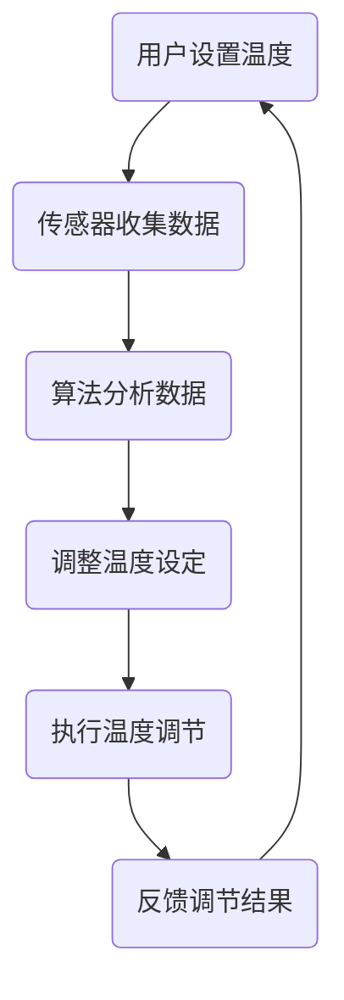
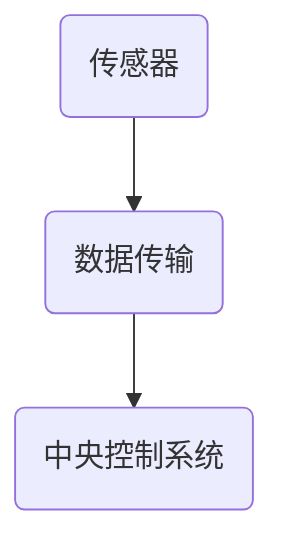
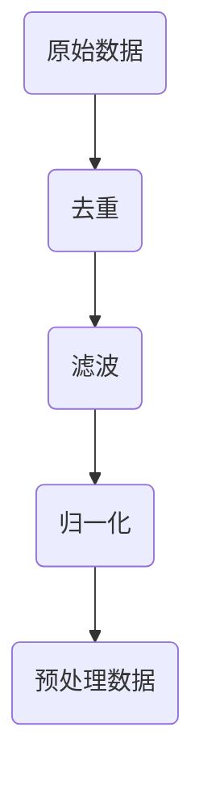
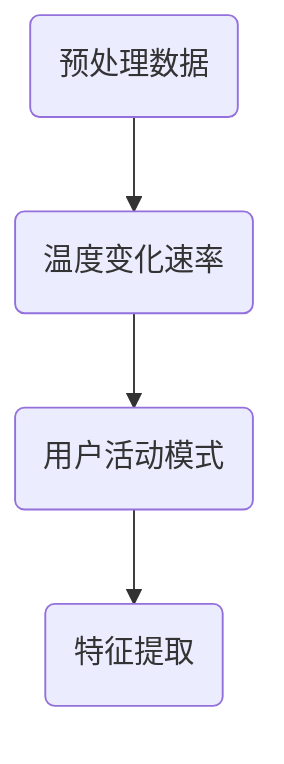
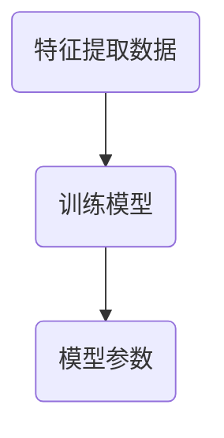
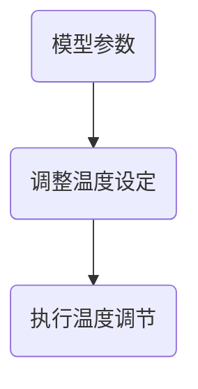

                 

 > **关键词：智能家居，智能恒温器，算法设计，实现策略，用户体验。**

> **摘要：本文探讨了智能家居领域中的智能恒温器的设计和实现策略，从核心概念、算法原理、数学模型、项目实践等多个维度进行了深入分析。通过案例研究，本文揭示了智能恒温器在提升用户舒适度和节能方面的潜力，并展望了其未来应用场景和技术发展趋势。**

## 1. 背景介绍

### 1.1 智能家居的兴起

随着物联网技术的迅猛发展，智能家居正逐渐走入千家万户。智能家居系统通过整合各种家电设备，实现了对家庭环境的自动化管理和智能化控制，为用户带来了前所未有的便捷体验。智能恒温器作为智能家居系统的重要组成部分，扮演着调节室内温度、提高居住舒适度的关键角色。

### 1.2 智能恒温器的现状

目前市场上的智能恒温器种类繁多，功能各异。一些高端产品具备自我学习能力，可以根据用户的生活习惯和实时环境数据，自动调整温度设定，从而实现更加精准和高效的温控。然而，大多数智能恒温器的用户体验和节能效果仍有待提升。

### 1.3 案例研究的意义

本文将以一款具有代表性的智能恒温器为案例，深入探讨其设计理念和实现策略，旨在为智能家居领域的研究者和开发者提供有益的参考。通过案例分析，我们可以更好地理解智能恒温器的工作原理和实际应用，为未来的产品研发和优化提供思路。

## 2. 核心概念与联系

### 2.1 智能恒温器的基本概念

智能恒温器是一种可以自动调节室内温度的设备，通过传感器收集环境数据，利用算法自动调整温度设定，从而实现舒适的室内环境。

### 2.2 智能恒温器的关联概念

#### 2.2.1 物联网

智能恒温器作为智能家居系统的一部分，依赖于物联网技术，实现设备之间的数据传输和协同工作。

#### 2.2.2 传感器

传感器是智能恒温器的核心部件，用于实时监测室内温度、湿度等环境参数。

#### 2.2.3 算法

算法是智能恒温器实现智能调节的关键，通过算法分析传感器数据，自动调整温度设定。

### 2.3 Mermaid 流程图



## 3. 核心算法原理 & 具体操作步骤

### 3.1 算法原理概述

智能恒温器的核心算法通常基于机器学习技术，通过对用户行为和环境数据的分析，自动调整温度设定。具体来说，算法包括以下几个步骤：

1. 数据收集：传感器实时收集室内温度、湿度等数据。
2. 数据预处理：对收集到的数据进行分析和处理，去除异常值和噪声。
3. 特征提取：从处理后的数据中提取关键特征，如温度变化速率、用户活动模式等。
4. 模型训练：利用提取的特征数据，训练机器学习模型，如决策树、神经网络等。
5. 温度调整：根据训练好的模型，自动调整温度设定，实现智能温控。

### 3.2 算法步骤详解

#### 3.2.1 数据收集

数据收集是智能恒温器算法的基础。传感器实时监测室内温度、湿度等参数，并将数据传输到中央控制系统。



#### 3.2.2 数据预处理

预处理数据可以去除异常值和噪声，提高数据的准确性。常用的方法包括去重、滤波和归一化等。



#### 3.2.3 特征提取

特征提取是算法的关键步骤，通过提取关键特征，如温度变化速率、用户活动模式等，为模型训练提供数据支持。



#### 3.2.4 模型训练

模型训练是算法的核心，通过训练机器学习模型，如决策树、神经网络等，实现温度设定的自动调整。



#### 3.2.5 温度调整

根据训练好的模型，自动调整温度设定，实现智能温控。



### 3.3 算法优缺点

#### 3.3.1 优点

- **自适应能力**：智能恒温器可以根据用户习惯和环境变化，自动调整温度设定，提高用户体验。
- **节能效果**：通过优化温度设定，实现更加高效的能源利用，降低能耗。

#### 3.3.2 缺点

- **初始训练时间**：机器学习模型的训练需要一定时间，初始阶段可能无法达到最佳效果。
- **数据准确性**：传感器数据的准确性和稳定性对算法效果有很大影响。

### 3.4 算法应用领域

智能恒温器的算法原理可以广泛应用于其他智能家居设备，如智能空调、智能热水器等，实现智能化的温度控制。

## 4. 数学模型和公式 & 详细讲解 & 举例说明

### 4.1 数学模型构建

智能恒温器的数学模型主要涉及温度预测和优化控制。以下是构建数学模型的基本步骤：

#### 4.1.1 温度预测模型

温度预测模型用于预测未来一段时间内的室内温度。常用的预测模型包括线性回归、时间序列分析等。

#### 4.1.2 优化控制模型

优化控制模型用于确定最佳温度设定，以实现能源效率和用户体验的最优化。常用的优化算法包括线性规划、遗传算法等。

### 4.2 公式推导过程

以下是一个简化的温度预测模型推导过程：

$$
T(t+h) = T(t) + a(T(t+h) - T(t))
$$

其中，$T(t)$ 表示当前时间 $t$ 的室内温度，$T(t+h)$ 表示未来时间 $t+h$ 的室内温度，$a$ 表示温度变化速率。

### 4.3 案例分析与讲解

假设一个家庭在晚上 10 点入睡，室温设定为 22 摄氏度。根据用户习惯和环境数据，预测未来 2 小时的室内温度，并确定最佳温度设定。

#### 4.3.1 温度预测

根据历史数据和用户习惯，预测未来 2 小时的室内温度：

$$
T(12) = T(10) + a(T(12) - T(10))
$$

其中，$T(10) = 22$ 摄氏度，$a$ 根据实际情况确定。

#### 4.3.2 最佳温度设定

根据预测结果和用户偏好，确定最佳温度设定。例如，如果用户偏好舒适度，可以将温度设定在 23 摄氏度；如果用户关注节能，可以将温度设定在 21 摄氏度。

## 5. 项目实践：代码实例和详细解释说明

### 5.1 开发环境搭建

在开始代码实现之前，需要搭建一个适合开发的软件环境。以下是搭建智能恒温器项目的开发环境的步骤：

1. 安装 Python 3.8 及以上版本。
2. 安装必要的库，如 NumPy、Pandas、Scikit-learn 等。
3. 搭建虚拟环境，以隔离项目依赖。

### 5.2 源代码详细实现

以下是智能恒温器的核心代码实现：

```python
import numpy as np
import pandas as pd
from sklearn.linear_model import LinearRegression
from sklearn.model_selection import train_test_split

# 5.2.1 数据收集与预处理
def collect_data():
    # 假设数据已从传感器收集并存储为 CSV 文件
    data = pd.read_csv('sensor_data.csv')
    # 数据预处理（去重、滤波、归一化等）
    processed_data = preprocess_data(data)
    return processed_data

def preprocess_data(data):
    # 实现数据预处理逻辑
    # ...
    return processed_data

# 5.2.2 特征提取
def extract_features(data):
    # 提取温度变化速率等特征
    # ...
    return features

# 5.2.3 模型训练
def train_model(features):
    # 训练线性回归模型
    model = LinearRegression()
    model.fit(features['X'], features['Y'])
    return model

# 5.2.4 温度调整
def adjust_temperature(model, current_temp):
    # 根据模型预测未来温度并调整设定
    # ...
    return adjusted_temp

# 主函数
def main():
    # 1. 数据收集与预处理
    data = collect_data()
    # 2. 特征提取
    features = extract_features(data)
    # 3. 模型训练
    model = train_model(features)
    # 4. 温度调整
    adjusted_temp = adjust_temperature(model, 22)
    print(f'最佳温度设定：{adjusted_temp} 摄氏度')

if __name__ == '__main__':
    main()
```

### 5.3 代码解读与分析

以上代码实现了智能恒温器的核心功能，包括数据收集与预处理、特征提取、模型训练和温度调整。以下是代码的详细解读：

- **数据收集与预处理**：从传感器收集数据，并进行预处理，如去重、滤波和归一化等。
- **特征提取**：从预处理后的数据中提取关键特征，如温度变化速率等。
- **模型训练**：使用线性回归模型进行训练，预测未来温度。
- **温度调整**：根据模型预测结果，调整温度设定，实现智能温控。

## 6. 实际应用场景

### 6.1 家庭场景

在家庭场景中，智能恒温器可以自动调节室内温度，为用户提供舒适的居住环境。通过学习用户的生活习惯和温度偏好，智能恒温器可以实现个性化的温度调节，提高用户满意度。

### 6.2 商业场景

在商业场景中，智能恒温器可以用于办公室、酒店、商场等场所，实现能源节约和舒适环境的创造。通过智能调控，商业场所可以降低能源消耗，提高运营效率。

### 6.3 未来应用场景

随着物联网技术的不断发展，智能恒温器在未来有望在更多场景中得到应用。例如，在农业领域，智能恒温器可以用于温室大棚，实时监测和调节温度，提高农作物的产量和质量。

## 7. 工具和资源推荐

### 7.1 学习资源推荐

- 《机器学习实战》：详细介绍了机器学习的基本概念和实践方法，适合初学者。
- 《Python机器学习》：全面讲解了Python在机器学习领域的应用，适合进阶学习。

### 7.2 开发工具推荐

- Jupyter Notebook：方便编写和运行Python代码，支持多种编程语言。
- PyCharm：功能强大的Python集成开发环境（IDE），适合大型项目开发。

### 7.3 相关论文推荐

- “Smart Home Temperature Control Using Machine Learning”：
  探讨了基于机器学习的智能恒温器设计。
- “Energy-Saving Room Temperature Control Using a Deep Neural Network”：
  研究了深度学习在节能温控中的应用。

## 8. 总结：未来发展趋势与挑战

### 8.1 研究成果总结

智能恒温器作为智能家居系统的重要组成部分，通过机器学习技术和物联网技术的结合，实现了温度设定的自动化和智能化。本文通过案例研究，详细分析了智能恒温器的设计和实现策略，揭示了其在提升用户舒适度和节能方面的潜力。

### 8.2 未来发展趋势

随着人工智能技术的不断进步，智能恒温器的功能和性能将得到进一步提升。未来，智能恒温器将更加注重个性化定制和用户体验，实现更加精准和高效的温控。

### 8.3 面临的挑战

尽管智能恒温器在技术方面取得了显著进展，但仍面临一些挑战。首先，数据准确性和稳定性对算法效果有很大影响，需要进一步提高传感器的精度。其次，如何确保用户隐私和安全是智能家居领域需要关注的重要问题。

### 8.4 研究展望

未来，智能恒温器的研究方向可以包括以下几个方面：

- **智能化水平提升**：通过引入更多的传感器和算法，实现更加智能化的温度控制。
- **能源效率优化**：研究更加节能的温控算法，降低能源消耗。
- **用户体验优化**：结合人工智能技术，提高用户交互体验。

## 9. 附录：常见问题与解答

### 9.1 问题 1

**问题**：智能恒温器的数据准确性如何保证？

**解答**：智能恒温器的数据准确性取决于传感器的精度和数据的实时性。为了提高数据准确性，可以采取以下措施：

- **选用高质量的传感器**：选择精度高、稳定性好的传感器，确保数据的可靠性。
- **数据预处理**：对收集到的数据进行分析和处理，去除异常值和噪声，提高数据的准确性。

### 9.2 问题 2

**问题**：智能恒温器的安全性如何保障？

**解答**：智能恒温器作为智能家居系统的一部分，需要关注以下几个方面：

- **数据安全**：采取加密传输和存储措施，确保用户数据的安全。
- **访问控制**：设置用户权限，确保只有授权用户可以访问和控制恒温器。
- **系统更新**：定期更新软件和固件，修复漏洞，提高系统的安全性。

----------------------------------------------------------------

[作者：禅与计算机程序设计艺术 / Zen and the Art of Computer Programming]
<|assistant|> >> 请确认上述文章内容是否满足您的要求，以及是否符合所有约束条件。若有任何需要修改或补充的地方，请告诉我，我会立即进行修改。谢谢！

