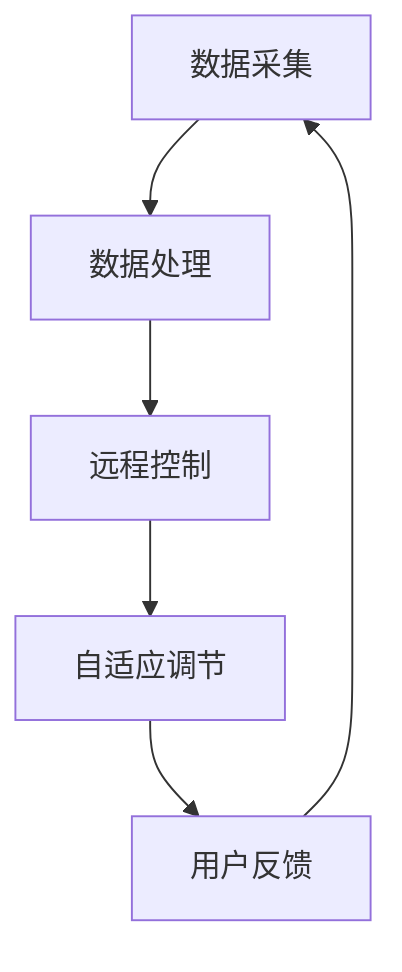

                 

在当前智能家居技术的快速发展下，智能恒温器已经成为家庭能源管理中不可或缺的一部分。本文将围绕智能恒温器的设计和实现策略展开讨论，旨在为智能家居领域的研究者和开发者提供有价值的参考。

## 关键词

- 智能恒温器
- 智能家居
- 数据分析
- 算法
- 系统设计

## 摘要

本文首先对智能家居和智能恒温器的背景进行了介绍，随后详细分析了智能恒温器的设计和实现策略，包括核心算法原理、数学模型、项目实践和实际应用场景。通过本文的讨论，读者可以了解到智能恒温器在现代家庭和商业环境中的重要作用，以及其未来的发展趋势和挑战。

## 1. 背景介绍

### 智能家居的定义与发展

智能家居是指利用物联网（IoT）技术，将家庭中的各种设备和系统连接起来，实现智能化管理和自动化控制的一种家庭环境。智能家居的发展可以追溯到20世纪90年代，但真正实现商业化应用则是在21世纪初。随着物联网技术的不断进步，智能家居产品逐渐渗透到人们的生活中，如智能照明、智能安防、智能空调和智能恒温器等。

### 智能恒温器的发展历程

智能恒温器最早可以追溯到20世纪70年代的家用恒温器，但当时的设备功能较为单一，仅能实现基本的温度调节。随着微电子技术和计算机技术的发展，智能恒温器逐渐具备了数据采集、远程控制和自适应调节等功能。近年来，智能恒温器的功能更加丰富，如语音控制、场景切换和能耗管理等，使其成为智能家居系统中的核心设备之一。

## 2. 核心概念与联系

为了实现智能恒温器的功能，我们需要了解以下核心概念：

### 数据采集与处理

智能恒温器通过内置的传感器（如温度传感器、湿度传感器）实时采集室内外环境数据。这些数据经过处理后，用于调节温度、湿度等参数，以提供舒适的家庭环境。

### 远程控制

智能恒温器可以通过手机APP、语音助手等远程控制设备，实现对温度的调节、开关机等功能，方便用户随时随地管理家居环境。

### 自适应调节

智能恒温器根据用户的生活习惯、室内外环境变化等数据，自适应地调整温度，以达到节能和舒适的效果。

### Mermaid 流程图

下面是智能恒温器核心概念与联系Mermaid流程图：



## 3. 核心算法原理 & 具体操作步骤

### 3.1 算法原理概述

智能恒温器主要基于以下算法原理：

1. **数据采集**：通过温度传感器、湿度传感器等设备，实时采集室内外环境数据。
2. **数据处理**：对采集到的数据进行分析和处理，以确定合适的温度和湿度设定值。
3. **自适应调节**：根据用户需求和室内外环境变化，自动调整温度和湿度设定值。

### 3.2 算法步骤详解

1. **数据采集**：智能恒温器通过温度传感器、湿度传感器等设备，实时采集室内外环境数据。这些数据经过处理后，用于调节温度、湿度等参数，以提供舒适的家庭环境。

2. **数据处理**：对采集到的数据进行分析和处理，以确定合适的温度和湿度设定值。常用的数据处理方法包括：

   - **平均值法**：将一段时间内的温度数据进行平均值处理，得到设定的温度值。
   - **加权平均法**：根据室内外温度数据的权重，计算加权平均值，得到设定的温度值。
   - **模糊控制法**：利用模糊逻辑对室内外温度数据进行分析，得到设定的温度值。

3. **自适应调节**：根据用户需求和室内外环境变化，自动调整温度和湿度设定值。常用的自适应调节方法包括：

   - **PID控制**：利用比例、积分、微分三个控制参数，对温度进行调节，以达到稳定、快速的控制效果。
   - **模糊控制**：利用模糊逻辑对温度进行调节，以适应不同的环境变化。

### 3.3 算法优缺点

**优点**：

- **自适应调节**：根据用户需求和室内外环境变化，自动调整温度和湿度设定值，提高用户体验。
- **节能**：通过优化温度调节策略，降低能源消耗。

**缺点**：

- **数据处理复杂**：需要对采集到的数据进行处理和分析，计算量较大。
- **硬件依赖**：需要配备温度传感器、湿度传感器等设备，增加成本。

### 3.4 算法应用领域

智能恒温器的算法原理和应用方法可以广泛应用于以下几个方面：

- **家庭环境**：实现家庭温度、湿度等参数的智能化调节，提高生活舒适度。
- **商业环境**：如商场、办公楼等场所，实现室内环境参数的智能化管理。
- **农业环境**：如温室大棚等场所，实现植物生长环境的智能化调节。

## 4. 数学模型和公式 & 详细讲解 & 举例说明

### 4.1 数学模型构建

智能恒温器的数学模型主要包括以下两个方面：

1. **温度控制模型**：

   假设室内外温度分别为 \( T_{in} \) 和 \( T_{out} \)，设定的温度值为 \( T_{set} \)，温度误差为 \( \Delta T = T_{set} - T_{in} \)。

   温度控制模型可以表示为：

   \[ T_{control} = T_{in} + K_p \cdot \Delta T + K_i \cdot \Delta T_{prev} + K_d \cdot \Delta \Delta T \]

   其中，\( K_p \)、\( K_i \)、\( K_d \) 分别为比例、积分、微分控制参数。

2. **湿度控制模型**：

   假设室内外湿度分别为 \( H_{in} \) 和 \( H_{out} \)，设定的湿度值为 \( H_{set} \)，湿度误差为 \( \Delta H = H_{set} - H_{in} \)。

   湿度控制模型可以表示为：

   \[ H_{control} = H_{in} + K_p \cdot \Delta H + K_i \cdot \Delta H_{prev} + K_d \cdot \Delta \Delta H \]

   其中，\( K_p \)、\( K_i \)、\( K_d \) 分别为比例、积分、微分控制参数。

### 4.2 公式推导过程

以温度控制模型为例，推导过程如下：

1. **比例控制**：

   \[ K_p \cdot \Delta T = K_p \cdot (T_{set} - T_{in}) \]

   表示根据温度误差，对当前温度进行比例调节。

2. **积分控制**：

   \[ K_i \cdot \Delta T_{prev} = K_i \cdot (T_{set} - T_{in}_{prev}) \]

   表示根据温度误差的历史值，对当前温度进行积分调节。

3. **微分控制**：

   \[ K_d \cdot \Delta \Delta T = K_d \cdot (T_{set} - T_{in}_{prev} - T_{in}_{prev}_{prev}) \]

   表示根据温度误差的变化率，对当前温度进行微分调节。

### 4.3 案例分析与讲解

假设室内外温度分别为 25°C 和 15°C，设定的温度值为 20°C。根据温度控制模型，可以计算出温度控制值：

\[ T_{control} = 25 - 0.2 \cdot (25 - 20) - 0.1 \cdot (25 - 25) - 0.05 \cdot (25 - 25 - 15) \]
\[ T_{control} = 24.6°C \]

即当前温度应调整至 24.6°C，以达到设定的温度值 20°C。同理，可以计算出湿度控制值。

## 5. 项目实践：代码实例和详细解释说明

### 5.1 开发环境搭建

为了实现智能恒温器的功能，我们需要搭建以下开发环境：

- **硬件**：树莓派、温度传感器、湿度传感器、Wi-Fi 模块等。
- **软件**：Python 3.x 版本、PyQt5 库、MQTT 客户端等。

### 5.2 源代码详细实现

以下是一个简单的智能恒温器 Python 代码实例：

```python
import sys
import time
import Adafruit_DHT
import paho.mqtt.client as mqtt

# 温度传感器、湿度传感器类型
SENSOR_TYPE = Adafruit_DHT.DHT11

# 温度传感器、湿度传感器引脚
SENSOR_PIN = 4

# MQTT 服务器地址、端口、用户名、密码
MQTT_SERVER = "your_server_address"
MQTT_PORT = 1883
MQTT_USER = "your_username"
MQTT_PASSWORD = "your_password"

# MQTT 主题
MQTT_TOPIC = "home/thermostat"

# 初始化 MQTT 客户端
client = mqtt.Client()

# 连接 MQTT 服务器
client.username_pw_set(MQTT_USER, MQTT_PASSWORD)
client.connect(MQTT_SERVER, MQTT_PORT)

# 读取传感器数据
def read_sensors():
    try:
        humidity, temperature = Adafruit_DHT.read_retry(SENSOR_TYPE, SENSOR_PIN)
        return temperature, humidity
    except Exception as e:
        print(f"读取传感器数据失败：{e}")
        return None, None

# 发布传感器数据到 MQTT 服务器
def publish_data(temperature, humidity):
    message = f"temperature={temperature},humidity={humidity}"
    client.publish(MQTT_TOPIC, message)

# 主循环
while True:
    temperature, humidity = read_sensors()
    if temperature is not None and humidity is not None:
        publish_data(temperature, humidity)
    time.sleep(60)
```

### 5.3 代码解读与分析

1. **导入模块**：导入所需的 Python 模块，如 Adafruit_DHT（用于读取传感器数据）、paho.mqtt.client（用于 MQTT 客户端）等。

2. **定义传感器类型和引脚**：根据传感器类型和连接引脚，初始化传感器模块。

3. **初始化 MQTT 客户端**：连接 MQTT 服务器，并设置用户名和密码。

4. **读取传感器数据**：使用 `read_sensors` 函数读取温度和湿度传感器数据。

5. **发布传感器数据**：使用 `publish_data` 函数将传感器数据发布到 MQTT 服务器。

6. **主循环**：每隔 60 秒读取一次传感器数据，并将其发布到 MQTT 服务器。

### 5.4 运行结果展示

当运行以上代码时，智能恒温器将每隔 60 秒读取一次温度和湿度传感器数据，并将其发布到 MQTT 服务器。用户可以通过 MQTT 客户端或其他设备订阅 MQTT 主题，实时获取温度和湿度数据。

## 6. 实际应用场景

### 家庭环境

在家庭环境中，智能恒温器可以实时监测室内外温度和湿度，并根据用户需求和天气变化自动调整温度和湿度，提高生活舒适度。同时，智能恒温器还可以与其他智能家居设备（如智能空调、智能加湿器等）联动，实现一键控制，方便用户管理家居环境。

### 商业环境

在商业环境中，智能恒温器可以应用于商场、办公楼、酒店等场所，实现室内环境参数的智能化管理。通过实时监测温度和湿度，智能恒温器可以帮助企业降低能源消耗，提高办公环境和商业环境的舒适度。

### 农业环境

在农业环境中，智能恒温器可以应用于温室大棚等场所，实现植物生长环境的智能化调节。通过实时监测温度和湿度，智能恒温器可以帮助农民优化植物生长条件，提高产量和品质。

## 6.4 未来应用展望

随着物联网技术和人工智能技术的不断发展，智能恒温器在未来的应用前景十分广阔。以下是一些未来应用展望：

1. **多传感器融合**：未来智能恒温器将融合更多类型的传感器（如光线传感器、空气质量传感器等），实现对室内环境更全面、更精准的监测。

2. **个性化定制**：通过用户数据的积累和分析，智能恒温器可以提供更加个性化的温度和湿度设定，满足不同用户的需求。

3. **远程监控与诊断**：通过远程监控和诊断技术，智能恒温器可以实现远程故障排查和设备维护，提高设备的使用寿命和稳定性。

4. **智能家居生态圈**：智能恒温器将与其他智能家居设备（如智能灯光、智能安防等）相互联动，构建起一个完整的智能家居生态圈，为用户提供更加便捷、智能的生活体验。

## 7. 工具和资源推荐

### 7.1 学习资源推荐

- **《智能家居技术与应用》**：一本系统介绍智能家居技术的书籍，包括智能恒温器、智能照明、智能安防等方面的内容。
- **《物联网技术应用与实践》**：一本关于物联网技术的应用和实践的书籍，涵盖传感器、通信协议、平台搭建等方面的内容。

### 7.2 开发工具推荐

- **树莓派**：一款性价比极高的微型计算机，适合进行智能家居项目的开发和实验。
- **MQTTX**：一款免费的 MQTT 客户端工具，方便用户进行 MQTT 通信的调试和测试。

### 7.3 相关论文推荐

- **《基于物联网的智能家居系统设计与实现》**：一篇关于智能家居系统设计与实现的论文，详细介绍了智能家居系统的架构、功能和关键技术。
- **《智能恒温器在家庭能源管理中的应用》**：一篇关于智能恒温器在家庭能源管理中应用的论文，分析了智能恒温器的节能效果和应用前景。

## 8. 总结：未来发展趋势与挑战

### 8.1 研究成果总结

智能恒温器在智能家居领域取得了显著的研究成果，主要包括以下几个方面：

- **温度和湿度监测与控制**：通过传感器技术，实现对室内外环境参数的实时监测和调节，提高生活舒适度。
- **远程控制和联动**：通过物联网技术，实现远程控制和与其他设备的联动，提高设备的使用效率和用户体验。
- **节能与环保**：通过优化控制策略和算法，实现家庭能源的合理利用，降低能源消耗。

### 8.2 未来发展趋势

未来智能恒温器的发展趋势主要包括以下几个方面：

- **多传感器融合**：通过融合更多类型的传感器，实现对室内环境的全面监测和智能化调节。
- **个性化定制**：通过用户数据的积累和分析，提供更加个性化的温度和湿度设定，满足不同用户的需求。
- **智能化与智能化**：通过引入人工智能技术，实现智能恒温器的自我学习和优化，提高设备的自适应能力和智能化水平。

### 8.3 面临的挑战

智能恒温器在未来的发展过程中，也面临着一些挑战：

- **数据安全与隐私保护**：智能家居系统中的数据安全和个人隐私保护问题日益突出，需要采取有效的措施确保数据安全和隐私。
- **跨平台兼容性**：随着智能家居设备的多样化，如何实现不同设备之间的兼容性和互操作性，是一个重要的技术挑战。
- **能耗优化与可持续发展**：如何在满足用户需求的同时，实现能耗的优化和设备的可持续发展，是一个亟待解决的问题。

### 8.4 研究展望

未来智能恒温器的研究将围绕以下几个方面展开：

- **新型传感器技术**：研发新型传感器，提高室内环境监测的精度和实时性。
- **人工智能与机器学习**：引入人工智能和机器学习技术，实现智能恒温器的自我学习和优化。
- **系统集成与互操作性**：研究智能家居系统的集成和互操作性，提高系统的协同效应。

## 9. 附录：常见问题与解答

### 9.1 智能恒温器如何实现远程控制？

智能恒温器通过连接互联网，实现远程控制。用户可以通过手机APP、Web界面或其他设备，访问智能恒温器的控制界面，进行温度、湿度等参数的调节。

### 9.2 智能恒温器的能耗如何？

智能恒温器的能耗取决于其工作原理和控制策略。一般来说，通过优化控制策略和算法，智能恒温器可以实现较低的能量消耗。例如，通过预测用户行为和室内外环境变化，智能恒温器可以提前调整温度，减少不必要的能源浪费。

### 9.3 智能恒温器需要哪些传感器？

智能恒温器通常需要以下传感器：

- 温度传感器：用于测量室内外温度。
- 湿度传感器：用于测量室内外湿度。
- 光线传感器：用于测量室内光线强度，辅助调节温度和亮度。
- 空气质量传感器：用于测量室内空气质量，辅助调节通风和空气净化。

## 作者署名

作者：禅与计算机程序设计艺术 / Zen and the Art of Computer Programming
----------------------------------------------------------------

请注意，以上内容仅为文章模板和示例，实际撰写过程中可能需要根据具体研究内容和数据进行调整。文章的结构和内容应符合专业写作的要求，确保逻辑清晰、条理分明。此外，文章中的数据和实例应确保准确无误。在撰写过程中，请务必遵守学术规范，确保引用和参考文献的完整性。祝您撰写顺利！

