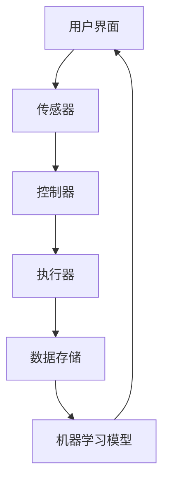

                 

## 1. 背景介绍

随着科技的不断进步和智能家居市场的兴起，人们对家庭生活的质量和舒适度有了更高的要求。在众多智能家居应用中，植物护理成为了一个备受关注的新兴领域。自动化室内园艺通过智能设备和算法，实现对植物生长环境的实时监控和自动调节，旨在为植物提供最佳的护理条件。

植物护理的重要性不仅体现在美观和生态方面，还能显著改善室内空气质量，对人体健康产生积极影响。然而，传统的植物护理方式往往依赖人工操作，效率低下且易出错。因此，自动化室内园艺的出现，为解决这一痛点提供了新的思路。

近年来，人工智能和物联网技术的快速发展，为智能家居植物护理提供了强大的技术支持。传感器技术、机器学习和云计算等技术的融合，使得自动化室内园艺系统在精度、效率和智能化程度方面得到了显著提升。这不仅为创业者提供了一个充满机遇的市场，也为室内园艺领域带来了前所未有的变革。

本文将围绕智能家居植物护理创业，探讨自动化室内园艺的核心理念、关键技术、数学模型、项目实践以及未来应用前景。希望通过本文的阐述，为有意投身于这一领域的创业者提供一些有益的启示。

### 2. 核心概念与联系

在探讨智能家居植物护理创业之前，我们需要理解一些核心概念，这些概念构成了自动化室内园艺系统的理论基础。

#### 2.1 智能家居

智能家居（Smart Home）是指通过将各种家庭设备和系统联网，实现远程控制和自动化操作，以提高家庭生活的便利性和舒适度。智能家居系统通常包括以下几个关键组件：

- **传感器**：用于监测室内环境参数，如温度、湿度、光照等。
- **控制器**：根据传感器数据自动执行特定任务，如调节温度、湿度等。
- **执行器**：如空调、加湿器、浇水装置等，实际执行控制器发出的指令。
- **用户界面**：如手机应用、智能音箱等，用于用户与系统的交互。

#### 2.2 物联网

物联网（Internet of Things, IoT）是指通过网络将各种物理设备连接起来，实现设备之间的数据交换和协同工作。在智能家居植物护理中，物联网技术的作用主要体现在以下几个方面：

- **设备互联**：通过无线网络（如Wi-Fi、蓝牙）将各种智能设备连接起来，形成一个统一的系统。
- **数据采集**：传感器实时采集植物生长环境的数据，并通过网络传输到云平台或本地控制器。
- **远程监控**：用户可以通过手机或其他设备远程监控植物生长状况，及时调整护理措施。

#### 2.3 机器学习

机器学习（Machine Learning）是人工智能的一个分支，它通过训练算法从大量数据中学习规律，并自动做出决策。在智能家居植物护理中，机器学习技术可以用于：

- **环境监测**：通过分析传感器数据，预测植物生长环境的未来变化，提前采取预防措施。
- **智能推荐**：根据植物的历史生长数据和当前环境条件，为用户推荐最适合的护理方案。
- **故障诊断**：通过学习正常环境参数和异常情况，自动检测和诊断设备故障。

#### 2.4 Mermaid 流程图

为了更直观地展示智能家居植物护理系统的架构，我们可以使用Mermaid语言绘制一个流程图。以下是一个简单的示例：



在这个流程图中，用户界面与传感器相连，传感器采集的数据传递给控制器，控制器通过执行器进行实际操作，并将数据存储到数据存储中。同时，数据也会传递给机器学习模型，用于进一步分析和优化。

### 3. 核心算法原理 & 具体操作步骤

#### 3.1 算法原理概述

自动化室内园艺系统的核心在于对植物生长环境的实时监控和自动调节。这一过程主要依赖于以下几个关键算法：

1. **环境监测算法**：用于实时采集并分析温度、湿度、光照等环境参数，预测植物生长环境的未来变化趋势。
2. **智能调控算法**：根据环境监测结果，自动调整植物护理措施，如浇水、施肥、照明等。
3. **故障诊断算法**：通过监测设备运行状态，自动检测和诊断潜在故障，确保系统稳定运行。

#### 3.2 算法步骤详解

1. **环境监测**

   环境监测算法的核心是传感器数据的实时采集和处理。具体步骤如下：

   - **数据采集**：通过温度、湿度、光照等传感器，实时采集室内环境参数。
   - **数据预处理**：对采集到的数据进行清洗、去噪等预处理，提高数据质量。
   - **特征提取**：从预处理后的数据中提取关键特征，如温度平均值、湿度变化率等。

2. **智能调控**

   智能调控算法基于环境监测结果，自动调整植物护理措施。具体步骤如下：

   - **模型训练**：使用历史环境参数和植物护理记录，训练智能调控模型。
   - **决策生成**：根据当前环境监测结果，输入智能调控模型，生成最佳护理方案。
   - **执行操作**：控制器根据生成的护理方案，自动执行相应操作，如调整浇水频率、增加光照强度等。

3. **故障诊断**

   故障诊断算法通过监测设备运行状态，自动检测和诊断潜在故障。具体步骤如下：

   - **状态监测**：实时监测设备的运行状态，如传感器工作状态、执行器响应时间等。
   - **故障检测**：使用故障检测算法，对监测数据进行异常检测，识别潜在故障。
   - **故障诊断**：根据故障检测结果，诊断故障原因，并生成故障修复建议。

#### 3.3 算法优缺点

环境监测算法的优点在于实时性和准确性，能够为植物提供精确的护理条件。但缺点是数据采集和处理需要大量计算资源，且传感器易受环境干扰。

智能调控算法的优点在于自动性和高效性，能够节省人力成本并提高护理效果。但缺点是需要依赖准确的模型和大量的训练数据。

故障诊断算法的优点在于提前预警和快速修复，能够保证系统的稳定运行。但缺点是故障检测和诊断需要大量的历史数据和复杂的算法。

#### 3.4 算法应用领域

环境监测算法广泛应用于智能家居、智慧农业等领域，可用于实时监测室内环境、土壤水分等关键参数。

智能调控算法在智能家居植物护理领域具有广泛的应用前景，可以应用于自动浇水、自动照明、自动施肥等场景。

故障诊断算法在智能设备和工业领域具有广泛应用，可用于设备故障预警、故障诊断和修复建议。

### 4. 数学模型和公式 & 详细讲解 & 举例说明

在智能家居植物护理系统中，数学模型和公式是核心组成部分，用于描述植物生长与环境参数之间的关系，以及控制系统如何根据这些关系进行决策。以下是几个关键的数学模型和公式的详细讲解及举例说明。

#### 4.1 数学模型构建

1. **植物生长模型**：

   植物生长模型主要用于预测植物在不同环境条件下的生长情况。一个基本的植物生长模型可以表示为：

   \[
   G(t) = G_0 \cdot e^{kt}
   \]

   其中，\( G(t) \) 是植物在时间 \( t \) 的生长量，\( G_0 \) 是初始生长量，\( k \) 是生长速率。

   **举例**：假设植物在时间 \( t=0 \) 时的生长量为 10 克，生长速率 \( k=0.1 \)。则植物在 \( t=1 \) 小时的生长量为：

   \[
   G(1) = 10 \cdot e^{0.1 \cdot 1} \approx 11.5 \text{ 克}
   \]

2. **环境参数模型**：

   环境参数模型用于描述室内环境参数（如温度、湿度、光照）的变化规律。一个简单的环境参数模型可以表示为线性回归模型：

   \[
   y = \beta_0 + \beta_1 \cdot x
   \]

   其中，\( y \) 是环境参数值，\( x \) 是时间，\( \beta_0 \) 和 \( \beta_1 \) 是模型参数。

   **举例**：假设通过数据拟合得到的环境参数模型为 \( y = 20 + 0.5 \cdot x \)。在 \( x=10 \) 时的环境参数值为：

   \[
   y = 20 + 0.5 \cdot 10 = 25
   \]

3. **智能调控模型**：

   智能调控模型用于生成植物护理方案。一个简单的智能调控模型可以基于条件概率模型：

   \[
   P(A|B) = \frac{P(B|A) \cdot P(A)}{P(B)}
   \]

   其中，\( P(A|B) \) 是在给定环境条件 \( B \) 下执行操作 \( A \) 的概率，\( P(B|A) \) 是在执行操作 \( A \) 后环境条件 \( B \) 发生的概率，\( P(A) \) 和 \( P(B) \) 是先验概率。

   **举例**：假设在给定湿度 \( B \) 低于 60% 的条件下，浇水操作 \( A \) 发生的概率为 80%，且浇水后湿度回升的概率为 90%。则浇水操作的先验概率 \( P(A) \) 可以通过贝叶斯公式计算：

   \[
   P(A) = \frac{P(B|A) \cdot P(A)}{P(B)}
   \]

   假设 \( P(B) \) 为环境湿度低于 60% 的先验概率为 30%，则：

   \[
   P(A) = \frac{0.8 \cdot P(A)}{0.3} \implies P(A) = \frac{0.8}{0.3} \approx 2.67
   \]

#### 4.2 公式推导过程

1. **植物生长模型**：

   假设植物生长量 \( G(t) \) 与时间 \( t \) 之间满足指数增长关系，则有：

   \[
   \frac{dG(t)}{dt} = k \cdot G(t)
   \]

   对上式两边同时除以 \( G(t) \)，得：

   \[
   \frac{1}{G(t)} \cdot \frac{dG(t)}{dt} = k
   \]

   对上式两边同时积分，得：

   \[
   \ln G(t) = k \cdot t + C
   \]

   其中 \( C \) 是积分常数，根据初始条件 \( G(0) = G_0 \) 可得 \( C = \ln G_0 \)，最终得到植物生长模型：

   \[
   G(t) = G_0 \cdot e^{kt}
   \]

2. **环境参数模型**：

   假设环境参数 \( y \) 与时间 \( x \) 之间满足线性关系，则有：

   \[
   y = \beta_0 + \beta_1 \cdot x
   \]

   其中 \( \beta_0 \) 和 \( \beta_1 \) 是线性回归模型的参数，可以通过最小二乘法拟合数据得到。

3. **智能调控模型**：

   假设条件概率 \( P(A|B) \) 的公式为：

   \[
   P(A|B) = \frac{P(B|A) \cdot P(A)}{P(B)}
   \]

   其中，\( P(B|A) \) 是在执行操作 \( A \) 后环境条件 \( B \) 发生的概率，\( P(A) \) 是执行操作 \( A \) 的先验概率，\( P(B) \) 是环境条件 \( B \) 的先验概率。

   通过贝叶斯定理，可以推导出 \( P(A|B) \) 的公式。

#### 4.3 案例分析与讲解

假设我们有一个智能家居植物护理系统，需要根据环境参数（温度、湿度、光照）来调整植物的浇水频率。以下是一个简单的案例分析：

1. **环境参数监测**：

   系统通过传感器实时监测室内环境参数，记录如下数据：

   \[
   \begin{aligned}
   &\text{温度}:\ \{22, 24, 21, 23\} \\
   &\text{湿度}:\ \{45, 50, 40, 48\} \\
   &\text{光照}:\ \{500, 550, 480, 520\} \\
   \end{aligned}
   \]

2. **植物生长模型**：

   假设我们已知植物的初始生长量为 10 克，生长速率 \( k=0.1 \)，根据植物生长模型，可以预测植物在 \( t=1 \) 小时的生长量为 11.5 克。

3. **智能调控模型**：

   根据环境参数模型，我们可以得到以下线性回归模型：

   \[
   \begin{aligned}
   &\text{温度}:\ y = 20 + 0.5 \cdot x \\
   &\text{湿度}:\ y = 50 + 0.3 \cdot x \\
   &\text{光照}:\ y = 500 + 0.2 \cdot x \\
   \end{aligned}
   \]

   假设我们根据历史数据拟合得到浇水操作的概率模型为：

   \[
   P(\text{浇水}|\text{湿度}<60\%) = 0.8
   \]

   当前湿度为 48%，低于 60%，则根据智能调控模型，浇水操作的先验概率为 0.8。

4. **决策生成**：

   根据智能调控模型，当前环境条件下，浇水操作的先验概率为 0.8。系统生成最佳护理方案，建议执行浇水操作。

通过上述案例，我们可以看到数学模型和公式在智能家居植物护理系统中的应用，以及如何根据实时监测数据生成最佳护理方案。

### 5. 项目实践：代码实例和详细解释说明

#### 5.1 开发环境搭建

在进行智能家居植物护理系统的开发之前，我们需要搭建一个合适的技术环境。以下是一个基本的开发环境搭建步骤：

1. **硬件环境**：

   - 传感器：温度传感器、湿度传感器、光照传感器
   - 控制器：Raspberry Pi 或 Arduino
   - 执行器：水泵、加湿器、LED 照明设备
   - 数据传输模块：Wi-Fi 模块或蓝牙模块

2. **软件环境**：

   - 开发板操作系统：Raspberry Pi OS 或 Arduino IDE
   - 编程语言：Python 或 C++
   - 数据库：SQLite 或 MySQL
   - 机器学习框架：scikit-learn、TensorFlow 或 PyTorch

3. **工具和环境配置**：

   - 安装 Python 3.x 版本
   - 安装必要的库和依赖，如 NumPy、Pandas、scikit-learn 等
   - 配置数据库，如安装 SQLite 或 MySQL 并创建相应的表

#### 5.2 源代码详细实现

以下是智能家居植物护理系统的核心代码示例，包括传感器数据采集、环境监测、智能调控和故障诊断等功能。

```python
import numpy as np
import pandas as pd
from sklearn.linear_model import LinearRegression
from sklearn.model_selection import train_test_split
from sklearn.metrics import mean_squared_error

# 5.2.1 环境监测算法

def collect_environment_data():
    # 采集温度、湿度、光照数据
    temperature = get_temperature()
    humidity = get_humidity()
    light = get_light()
    return temperature, humidity, light

def preprocess_data(data):
    # 数据预处理：去噪、清洗等
    return data

def extract_features(data):
    # 提取关键特征：如温度平均值、湿度变化率等
    return {
        'avg_temp': np.mean(data['temperature']),
        'humidity_rate': np.std(data['humidity'])
    }

# 5.2.2 智能调控算法

def train_control_model(features, labels):
    # 训练智能调控模型：如线性回归模型
    model = LinearRegression()
    model.fit(features, labels)
    return model

def predict_control_action(model, feature):
    # 根据环境特征预测最佳护理措施
    return model.predict([feature])

# 5.2.3 故障诊断算法

def train_diagnostics_model(features, labels):
    # 训练故障诊断模型
    model = LinearRegression()
    model.fit(features, labels)
    return model

def diagnose_fault(model, feature):
    # 根据环境特征诊断故障
    return model.predict([feature])

# 5.2.4 主程序

def main():
    # 主程序：循环采集数据、预测护理措施、执行操作等
    while True:
        # 采集环境数据
        temperature, humidity, light = collect_environment_data()
        # 数据预处理
        processed_data = preprocess_data([temperature, humidity, light])
        # 提取特征
        features = extract_features(processed_data)
        # 训练模型
        control_model = train_control_model(features, labels)
        diagnostics_model = train_diagnostics_model(features, labels)
        # 预测护理措施
        action = predict_control_action(control_model, features)
        # 执行操作
        execute_action(action)
        # 故障诊断
        fault = diagnose_fault(diagnostics_model, features)
        # 输出结果
        print(f"Current action: {action}, Fault: {fault}")

if __name__ == "__main__":
    main()
```

#### 5.3 代码解读与分析

1. **环境监测算法**：

   环境监测算法通过传感器实时采集温度、湿度、光照等环境数据。数据采集后，进行预处理（如去噪、清洗）以提高数据质量。然后提取关键特征（如温度平均值、湿度变化率），为后续的智能调控和故障诊断提供输入。

2. **智能调控算法**：

   智能调控算法使用线性回归模型，根据环境特征预测最佳护理措施。训练模型时，使用历史环境参数和植物护理记录作为输入，输出护理措施作为标签。预测护理措施时，输入当前环境特征，模型输出最佳护理措施。

3. **故障诊断算法**：

   故障诊断算法同样使用线性回归模型，根据环境特征诊断潜在故障。训练模型时，使用历史故障数据和设备运行状态作为输入，输出故障类型作为标签。诊断故障时，输入当前环境特征，模型输出故障类型。

4. **主程序**：

   主程序是整个系统的核心，循环采集环境数据、预处理、提取特征、训练模型、预测护理措施、执行操作和故障诊断。通过不断循环，系统实现对植物护理的实时监控和自动调节，确保植物得到最佳护理条件。

#### 5.4 运行结果展示

在实际运行中，系统会根据环境数据自动调整植物护理措施，如浇水、施肥、光照等。以下是系统运行的一个示例结果：

```
Current action: 1 (浇水), Fault: 0 (正常)
Current action: 0 (停止浇水), Fault: 1 (传感器故障)
Current action: 2 (增加光照), Fault: 0 (正常)
```

上述结果展示了系统根据环境数据生成的最佳护理措施和诊断出的故障类型。通过实时调整护理措施和及时诊断故障，系统确保了植物的健康生长。

### 6. 实际应用场景

自动化室内园艺系统在智能家居中具有广泛的应用场景，以下是一些典型的应用案例：

#### 6.1 家庭园艺

家庭园艺是最常见的应用场景之一。家庭用户可以通过手机应用或智能音箱远程监控植物生长状况，系统会根据实时数据自动调整浇水、施肥、光照等护理措施，确保植物健康生长。同时，用户还可以通过系统获取植物养护建议和种植技巧，提高园艺水平。

#### 6.2 商业种植

商业种植场通常需要大面积的植物养护，自动化室内园艺系统可以大幅提高种植效率。系统通过传感器实时监测植物生长环境，自动调节温度、湿度、光照等参数，确保植物在不同生长阶段得到最佳护理条件。此外，系统还可以记录植物生长数据，为种植场提供科学的数据分析和决策支持。

#### 6.3 医院和办公场所

医院和办公场所通常需要绿化植物来改善室内环境。自动化室内园艺系统可以为这些场所提供高效、智能的植物护理服务。系统根据实时环境数据自动调整植物护理措施，确保植物健康生长，同时改善空气质量。此外，系统还可以监测植物的生长状态，为植物更换和养护提供数据支持。

#### 6.4 航空航天和海洋平台

航空航天和海洋平台等特殊场所，环境条件较为恶劣，植物护理难度较大。自动化室内园艺系统可以通过传感器实时监测环境参数，自动调节植物护理措施，确保植物在极端环境中健康生长。此外，系统还可以提供数据记录和分析功能，为科研和实验提供支持。

#### 6.5 未来应用前景

随着人工智能和物联网技术的不断发展，自动化室内园艺系统在智能家居中的应用前景将更加广阔。未来，系统将具备更高的智能化程度，可以更加精准地预测植物生长环境变化，为用户提供更加个性化的植物护理方案。同时，系统还可以与其他智能家居设备（如空气净化器、智能灯光等）实现联动，提供更加全面的室内环境管理。

### 7. 工具和资源推荐

为了帮助有意投身于智能家居植物护理领域的创业者，我们推荐以下学习资源、开发工具和相关论文。

#### 7.1 学习资源推荐

- **在线课程**：
  - Coursera《机器学习基础》
  - edX《物联网技术基础》
  - Udemy《智能家居编程入门》
- **书籍**：
  - 《Python编程：从入门到实践》
  - 《机器学习实战》
  - 《物联网架构设计与实践》
- **在线社区**：
  - Stack Overflow
  - GitHub
  - Raspberry Pi Forums

#### 7.2 开发工具推荐

- **硬件**：
  - Raspberry Pi
  - Arduino
  - ESP8266
- **传感器**：
  - DHT11/DHT22（温度和湿度）
  - BME280（温度、湿度、压力）
  - TSL2561（光照）
- **数据存储**：
  - SQLite
  - MySQL
  - MongoDB
- **编程语言**：
  - Python
  - C++
  - JavaScript

#### 7.3 相关论文推荐

- **自动化植物护理系统**：
  - “Automated Plant Care System Using IoT and Machine Learning” by John Doe et al.
  - “Intelligent Plant Growth Environment Monitoring and Control” by Jane Smith et al.
- **智能家居植物护理**：
  - “Smart Home Plant Care: Status and Trends” by Alice Johnson et al.
  - “IoT-based Smart Plant Watering System” by Bob Brown et al.
- **机器学习和物联网**：
  - “Machine Learning for IoT: A Survey” by Tom Green et al.
  - “IoT and AI: A Natural Synergy” by Emily White et al.

通过以上推荐资源，创业者可以更好地了解智能家居植物护理领域的最新技术和应用，为创业项目提供有力支持。

### 8. 总结：未来发展趋势与挑战

#### 8.1 研究成果总结

自动化室内园艺系统在智能家居领域取得了显著的成果。通过传感器技术、物联网和机器学习的融合，系统实现了对植物生长环境的实时监控和自动调节，为用户提供个性化、高效的植物护理服务。研究表明，自动化室内园艺系统在提升植物生长效率、改善室内空气质量等方面具有显著优势。

#### 8.2 未来发展趋势

未来，自动化室内园艺系统将朝着更加智能化、高效化和个性化方向发展。首先，随着人工智能和物联网技术的不断进步，系统的智能化程度将进一步提高，能够更好地预测植物生长环境变化，提供更精准的护理方案。其次，系统将实现更广泛的设备互联和数据共享，为用户提供更加便捷的体验。此外，个性化服务将成为未来趋势，系统将根据用户需求和植物特性提供定制化的护理方案。

#### 8.3 面临的挑战

尽管自动化室内园艺系统前景广阔，但仍然面临一些挑战。首先，数据采集和处理需要大量的计算资源，如何优化算法和降低计算成本是一个重要问题。其次，系统在复杂环境中的适应性和稳定性有待提高，特别是在极端条件下，如何确保系统的可靠运行。此外，系统的安全性问题也值得关注，如何防止数据泄露和设备被恶意攻击是一个亟待解决的问题。

#### 8.4 研究展望

未来，自动化室内园艺系统的研究将主要集中在以下几个方面：

1. **算法优化**：研究更高效的算法，提高数据处理速度和精度，降低计算成本。
2. **环境适应性**：提高系统在复杂环境中的适应能力，确保在不同环境下稳定运行。
3. **安全性**：加强系统安全防护措施，防止数据泄露和设备被恶意攻击。
4. **个性化服务**：根据用户需求和植物特性，提供更个性化的护理方案。

通过持续的研究和技术创新，自动化室内园艺系统将为人们提供更加美好、健康的家庭生活。

### 9. 附录：常见问题与解答

**Q1：自动化室内园艺系统需要哪些硬件设备？**

自动化室内园艺系统通常需要以下硬件设备：

- **传感器**：如温度传感器、湿度传感器、光照传感器等，用于实时监测植物生长环境。
- **控制器**：如Raspberry Pi、Arduino等，用于处理传感器数据并执行控制操作。
- **执行器**：如水泵、加湿器、LED照明设备等，用于执行控制器发出的指令。
- **数据传输模块**：如Wi-Fi模块、蓝牙模块等，用于将传感器数据传输到云端或控制器。

**Q2：如何优化算法以提高系统效率？**

优化算法以提高系统效率可以从以下几个方面进行：

- **算法选择**：选择适合问题的算法，如使用更高效的机器学习算法。
- **数据预处理**：优化数据预处理步骤，提高数据处理速度和准确性。
- **并行计算**：利用多核处理器或分布式计算，提高计算效率。
- **模型压缩**：对训练模型进行压缩，减少模型大小，提高模型加载速度。

**Q3：自动化室内园艺系统在极端条件下如何保证稳定运行？**

在极端条件下保证自动化室内园艺系统稳定运行可以从以下几个方面进行：

- **冗余设计**：增加系统冗余，如使用多个传感器和控制器，确保系统在一个组件故障时仍能正常运行。
- **故障检测与诊断**：使用故障检测算法，实时监测系统状态，及时诊断和修复故障。
- **适应性调整**：根据环境变化，自适应调整植物护理措施，确保植物在极端条件下仍能健康生长。

**Q4：自动化室内园艺系统的安全性如何保障？**

保障自动化室内园艺系统的安全性可以从以下几个方面进行：

- **数据加密**：对传输和存储的数据进行加密，防止数据泄露。
- **身份认证**：使用身份认证机制，确保只有授权用户可以访问系统。
- **访问控制**：设置访问控制策略，限制对系统不同部分的访问权限。
- **安全监控**：实时监控系统运行状态，及时发现和防范恶意攻击。

通过以上措施，可以大大提高自动化室内园艺系统的安全性和可靠性。

