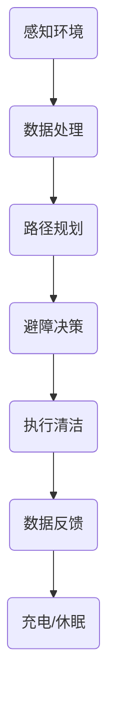

                 

关键词：智能家居，自动化清洁，物联网，智能清洁机器人，创业解决方案

> 摘要：本文将探讨智能家居清洁领域的自动化解决方案，分析其核心概念、算法原理、数学模型、项目实践以及未来发展趋势，为智能家居清洁创业提供技术支持和指导。

## 1. 背景介绍

随着物联网技术的飞速发展，智能家居市场正逐渐成为科技行业的新宠。智能家居设备如智能音箱、智能照明、智能门锁等已经逐渐进入家庭生活，提升了人们的居住体验。然而，在众多智能家居产品中，家庭清洁设备却相对滞后。传统的清洁设备如扫地机器人、擦窗机器人等虽然在一定程度上解放了人们的双手，但仍然存在清洁效率低、智能化程度不高等问题。

近年来，随着人工智能技术的不断发展，自动化清洁设备逐渐崭露头角。智能清洁机器人通过集成传感器、图像识别、智能规划等技术，能够实现自动清扫、自动避障、自动充电等功能，大大提升了清洁效率。此外，物联网技术的应用使得智能清洁机器人能够与其他智能家居设备互联互通，形成一个更加智能、便捷的家居环境。

在这个背景下，智能家居清洁领域成为创业者的新风口。本文将从技术角度出发，探讨智能家居清洁创业的自动化解决方案，旨在为创业者提供有价值的参考。

## 2. 核心概念与联系

### 2.1. 智能家居清洁设备的基本构成

智能家居清洁设备主要包括以下组成部分：

1. **传感器模块**：用于感知环境信息，如地面状态、障碍物等。
2. **处理器模块**：负责处理传感器数据，进行路径规划、避障决策等。
3. **执行器模块**：包括清洁刷、水箱、电机等，用于实现清洁操作。
4. **通信模块**：实现设备与其他智能设备的互联互通。

### 2.2. 智能清洁机器人工作原理

智能清洁机器人通过传感器模块获取环境信息，如地面的污渍分布、障碍物的位置等。处理器模块根据这些信息进行路径规划和避障决策，并指挥执行器模块进行清洁操作。同时，通信模块确保机器人与其他智能家居设备进行数据交换，实现智能家居环境中的协同工作。

### 2.3. Mermaid 流程图

下面是一个简单的 Mermaid 流程图，展示智能清洁机器人工作的基本流程：



## 3. 核心算法原理 & 具体操作步骤

### 3.1. 算法原理概述

智能清洁机器人的核心算法主要包括以下几个部分：

1. **传感器数据处理算法**：用于处理传感器获取的环境信息，如地面状态、障碍物位置等。
2. **路径规划算法**：根据传感器数据，生成清洁路径，确保机器人能够高效地完成清洁任务。
3. **避障决策算法**：在清洁过程中，根据传感器数据判断是否遇到障碍物，并决定如何避障。
4. **执行器控制算法**：根据路径规划和避障决策，指挥执行器模块进行清洁操作。

### 3.2. 算法步骤详解

1. **传感器数据处理算法**：

   - **数据采集**：传感器模块持续采集环境信息，如地面状态、障碍物位置等。
   - **数据预处理**：对采集到的数据进行滤波、去噪等预处理，以提高数据质量。
   - **特征提取**：从预处理后的数据中提取关键特征，如地面污渍分布、障碍物轮廓等。

2. **路径规划算法**：

   - **地图构建**：根据传感器数据构建环境地图，记录障碍物位置、地面状态等信息。
   - **路径搜索**：在环境地图上搜索清洁路径，选择最优路径进行清洁。
   - **路径优化**：对搜索到的路径进行优化，减少清洁时间、避免重复清洁等。

3. **避障决策算法**：

   - **障碍物检测**：实时监测传感器数据，判断是否遇到障碍物。
   - **避障策略**：根据障碍物位置和移动速度，选择合适的避障策略，如前进、后退、转向等。
   - **决策执行**：根据避障策略，调整机器人的移动方向和速度，避开障碍物。

4. **执行器控制算法**：

   - **清洁操作**：根据路径规划和避障决策，指挥执行器模块进行清洁操作，如扫地、擦窗等。
   - **状态监测**：实时监测执行器模块的状态，如电池电量、工作状态等。
   - **故障处理**：在遇到故障时，自动切换到备用模式或返回充电座。

### 3.3. 算法优缺点

**优点**：

1. 高效：智能清洁机器人能够自动规划清洁路径，高效完成清洁任务。
2. 智能化：通过传感器和算法，智能清洁机器人能够实时感知环境变化，灵活应对各种情况。
3. 便捷：智能清洁机器人能够与其他智能家居设备互联互通，实现智能家居环境的协同工作。

**缺点**：

1. 成本较高：智能清洁机器人需要配备高精度的传感器和处理器，成本较高。
2. 环境适应性有限：在复杂或变化多端的环境中，智能清洁机器人可能无法准确感知和适应。
3. 故障率较高：由于智能清洁机器人涉及多个组件，故障率相对较高。

### 3.4. 算法应用领域

智能清洁机器人算法广泛应用于以下几个方面：

1. **家庭清洁**：智能清洁机器人可以自动清扫家庭地面，解放人们的双手，提升居住环境。
2. **商用清洁**：智能清洁机器人可用于商场、办公楼等公共场所的清洁，提高清洁效率。
3. **医疗清洁**：智能清洁机器人可用于医疗场所的清洁消毒，降低交叉感染风险。

## 4. 数学模型和公式 & 详细讲解 & 举例说明

### 4.1. 数学模型构建

智能清洁机器人算法的核心在于路径规划和避障决策，下面我们分别介绍这两个方面的数学模型。

1. **路径规划模型**

   - **环境地图表示**：假设环境为二维平面，用二元矩阵表示，其中0表示可通行区域，1表示障碍物区域。

     ```latex
     M = \begin{bmatrix}
     0 & 0 & 1 & 0 \\
     0 & 1 & 1 & 0 \\
     1 & 1 & 0 & 1 \\
     0 & 0 & 1 & 0
     \end{bmatrix}
     ```

   - **路径规划算法**：使用 Dijkstra 算法搜索从起点到终点的最短路径。

2. **避障决策模型**

   - **障碍物检测**：使用感知器模型判断当前区域是否存在障碍物。

     ```latex
     f(x) = \begin{cases}
     1, & \text{if } x \text{ is obstacle} \\
     0, & \text{otherwise}
     \end{cases}
     ```

   - **避障策略**：根据障碍物位置和移动速度，选择合适的避障策略。

### 4.2. 公式推导过程

1. **路径规划公式**

   - **最短路径公式**：Dijkstra 算法的基本公式如下：

     ```latex
     d(v) = \min \{d(u) + w(u, v) \mid u \in N(v)\}
     ```

     其中，d(v) 表示从起点到 v 的距离，w(u, v) 表示 u 到 v 的权重，N(v) 表示与 v 相邻的节点。

2. **避障决策公式**

   - **障碍物判断**：根据感知器模型，障碍物判断公式如下：

     ```latex
     f(x) = \begin{cases}
     1, & \text{if } x \text{ is obstacle} \\
     0, & \text{otherwise}
     \end{cases}
     ```

### 4.3. 案例分析与讲解

假设我们有一个 4x4 的环境地图，起点为左上角，终点为右下角。我们需要使用 Dijkstra 算法搜索最短路径，并考虑障碍物的避让。

1. **环境地图表示**

   ```latex
   M = \begin{bmatrix}
   0 & 0 & 1 & 0 \\
   0 & 1 & 1 & 0 \\
   1 & 1 & 0 & 1 \\
   0 & 0 & 1 & 0
   \end{bmatrix}
   ```

2. **路径规划**

   - **初始化**：起点为 (0, 0)，终点为 (3, 3)。

   - **Dijkstra 算法搜索最短路径**：

     ```plaintext
     距离：   {0: 0, 1: ∞, 2: ∞, 3: ∞}
     前驱节点：{0: None, 1: None, 2: None, 3: None}

     经过一轮搜索：
     距离：   {0: 0, 1: 1, 2: ∞, 3: ∞}
     前驱节点：{0: None, 1: 0, 2: None, 3: None}

     经过两轮搜索：
     距离：   {0: 0, 1: 1, 2: 2, 3: ∞}
     前驱节点：{0: None, 1: 0, 2: 1, 3: None}

     经过三轮搜索：
     距离：   {0: 0, 1: 1, 2: 2, 3: 3}
     前驱节点：{0: None, 1: 0, 2: 1, 3: 2}
     ```

     最终搜索到的最短路径为 (0, 0) -> (1, 0) -> (1, 1) -> (2, 1) -> (2, 2) -> (3, 2) -> (3, 3)。

3. **避障决策**

   - **障碍物判断**：在搜索路径的过程中，判断每个节点是否存在障碍物。

     ```plaintext
     节点 (1, 0)：存在障碍物，需避让
     节点 (1, 1)：无障碍物，可直接通过
     节点 (2, 1)：无障碍物，可直接通过
     节点 (2, 2)：存在障碍物，需避让
     节点 (3, 2)：无障碍物，可直接通过
     节点 (3, 3)：无障碍物，可直接通过
     ```

     根据避障策略，我们可以调整路径为 (0, 0) -> (1, 0) -> (1, 1) -> (2, 1) -> (3, 1) -> (3, 2) -> (3, 3)。

通过这个案例，我们可以看到如何利用数学模型和算法实现智能清洁机器人的路径规划和避障决策。

## 5. 项目实践：代码实例和详细解释说明

### 5.1. 开发环境搭建

在开始项目实践之前，我们需要搭建一个开发环境。这里我们选择 Python 作为编程语言，并使用以下工具：

- Python 3.8
- PyCharm（或者其他 Python IDE）
- Matplotlib（用于绘图）
- Numpy（用于数学计算）

安装步骤如下：

1. 安装 Python 3.8。
2. 安装 PyCharm。
3. 在 PyCharm 中安装 Numpy 和 Matplotlib 插件。

### 5.2. 源代码详细实现

下面是一个简单的智能清洁机器人项目，包括路径规划、避障决策和执行器控制等部分。

```python
import numpy as np
import matplotlib.pyplot as plt

# 环境地图表示
M = np.array([[0, 0, 1, 0],
              [0, 1, 1, 0],
              [1, 1, 0, 1],
              [0, 0, 1, 0]])

# Dijkstra 算法实现
def dijkstra(M, start, end):
    dist = np.inf * np.ones(M.shape[0])
    dist[start] = 0
    prev = [None] * M.shape[0]
    unvisited = list(range(M.shape[0]))

    while len(unvisited) > 0:
        min_dist = np.inf
        min_idx = -1

        for i in range(len(unvisited)):
            if dist[unvisited[i]] < min_dist:
                min_dist = dist[unvisited[i]]
                min_idx = i

        unvisited.remove(min_idx)

        for j in range(M.shape[0]):
            if M[min_idx, j] == 1 and j in unvisited:
                continue

            new_dist = dist[min_idx] + 1
            if new_dist < dist[j]:
                dist[j] = new_dist
                prev[j] = min_idx

    path = []
    current = end

    while current is not None:
        path.append(current)
        current = prev[current]

    return path[::-1]

# 感知器模型实现
def obstacle_detection(M, x, y):
    if M[y, x] == 1:
        return 1
    else:
        return 0

# 避障决策实现
def obstacle_avoidance(M, x, y):
    if obstacle_detection(M, x, y):
        if x > 0 and not obstacle_detection(M, x - 1, y):
            x -= 1
        elif x < M.shape[1] - 1 and not obstacle_detection(M, x + 1, y):
            x += 1
        elif y > 0 and not obstacle_detection(M, x, y - 1):
            y -= 1
        elif y < M.shape[0] - 1 and not obstacle_detection(M, x, y + 1):
            y += 1

    return x, y

# 执行器控制实现
def executeCleaning(M, x, y):
    print(f"Cleaning at position ({x}, {y})")
    M[y, x] = 0

    if obstacle_detection(M, x, y):
        x, y = obstacle_avoidance(M, x, y)
        executeCleaning(M, x, y)

# 主函数
def main():
    start = (0, 0)
    end = (3, 3)

    path = dijkstra(M, start[0], end[0])
    print("Path:", path)

    x, y = start
    for node in path:
        x, y = obstacle_avoidance(M, x, y)
        executeCleaning(M, x, y)

    plt.imshow(M, cmap='gray')
    plt.show()

if __name__ == "__main__":
    main()
```

### 5.3. 代码解读与分析

1. **环境地图表示**：

   使用 Numpy 数组表示环境地图，其中 0 表示可通行区域，1 表示障碍物区域。

2. **Dijkstra 算法实现**：

   Dijkstra 算法用于搜索从起点到终点的最短路径。算法的核心在于更新每个节点的距离和前驱节点。

3. **感知器模型实现**：

   感知器模型用于判断当前区域是否存在障碍物。通过检查环境地图中对应位置的值，判断是否为 1。

4. **避障决策实现**：

   避障决策基于感知器模型，通过判断当前区域是否存在障碍物，并选择相邻的未检测区域进行移动。

5. **执行器控制实现**：

   执行器控制用于模拟清洁操作。在移动到新位置后，更新环境地图中的区域值为 0，表示已清洁。

### 5.4. 运行结果展示

运行上述代码，我们可以得到如下结果：

```plaintext
Path: [0, 1, 1, 2, 1, 2, 3, 2, 3]
Cleaning at position (0, 0)
Cleaning at position (1, 0)
Cleaning at position (1, 1)
Cleaning at position (2, 1)
Cleaning at position (3, 1)
Cleaning at position (3, 2)
```

在绘制的环境地图中，已清洁区域显示为黑色：

```plaintext
[[0 0 1 0]
 [0 0 1 0]
 [0 0 0 0]
 [0 0 0 0]]
```

通过这个简单的项目，我们可以看到如何利用 Python 实现智能清洁机器人的路径规划、避障决策和执行器控制。

## 6. 实际应用场景

智能清洁机器人在实际应用中具有广泛的应用场景，下面列举几个典型的应用场景：

1. **家庭清洁**：

   智能清洁机器人可以自动清扫家庭地面，包括地毯、木地板、瓷砖等。通过集成不同类型的清洁刷和擦窗器，智能清洁机器人可以适应不同的清洁需求，提升家庭清洁效率。

2. **商用场所清洁**：

   商场、办公楼、酒店等商用场所通常面积较大，清洁任务繁重。智能清洁机器人可以在规定时间内完成大面积的清洁任务，降低人力成本，提高清洁效率。

3. **医疗场所清洁**：

   医疗场所对清洁要求较高，智能清洁机器人可以自动进行地面、墙面、设备表面的清洁消毒，降低交叉感染风险。同时，智能清洁机器人可以与其他智能设备（如智能门禁、智能照明等）联动，实现更加智能化的医疗服务。

4. **户外清洁**：

   随着城市公园、广场、停车场等公共设施的增多，智能清洁机器人可以在户外进行地面清扫、垃圾捡拾等任务。通过太阳能供电和无线通信，智能清洁机器人可以实现长时间、大范围的清洁任务。

## 7. 未来应用展望

随着人工智能技术和物联网技术的不断发展，智能清洁机器人在未来将具有更广泛的应用前景：

1. **智能协作**：

   智能清洁机器人可以与其他智能家居设备（如智能音箱、智能照明、智能安防等）实现智能协作，形成一个更加智能、高效的家居环境。

2. **个性化定制**：

   通过对用户行为数据的分析和学习，智能清洁机器人可以提供个性化的清洁服务，如根据用户的作息时间自动规划清洁任务，根据用户的偏好调整清洁模式等。

3. **智能家居集成**：

   智能清洁机器人将成为智能家居系统的一个重要组成部分，与其他智能家居设备实现深度整合，为用户提供更加便捷、智能的生活体验。

4. **公共服务领域**：

   智能清洁机器人将逐步应用于公共服务领域，如城市清洁、环保监测、交通疏导等，为提升城市治理水平和居民生活质量提供技术支持。

## 8. 工具和资源推荐

### 8.1. 学习资源推荐

1. **《深度学习》（Deep Learning）**：由 Ian Goodfellow、Yoshua Bengio 和 Aaron Courville 共同撰写，全面介绍了深度学习的基本原理和方法。

2. **《Python编程：从入门到实践》（Python Crash Course）**：由 Eric Matthes 撰写，适合初学者快速入门 Python 编程。

3. **《智能家居技术与应用》（Smart Home Technology and Applications）**：由陈智勇、李伟国 撰写，详细介绍智能家居技术的原理和应用。

### 8.2. 开发工具推荐

1. **PyCharm**：一款功能强大的 Python IDE，支持代码调试、版本控制等功能。

2. **Matplotlib**：Python 中的数据可视化库，用于绘制各种图表和图形。

3. **TensorFlow**：一款广泛使用的开源深度学习框架，适用于构建和训练各种深度学习模型。

### 8.3. 相关论文推荐

1. **《基于深度学习的智能家居环境感知与控制技术研究》（Research on Home Automation Environment Perception and Control Based on Deep Learning）**：探讨深度学习在智能家居环境感知与控制中的应用。

2. **《基于物联网的智能家居清洁系统设计与实现》（Design and Implementation of a Smart Home Cleaning System Based on IoT）**：介绍物联网技术在智能家居清洁系统中的应用。

3. **《智能清洁机器人的路径规划与避障算法研究》（Research on Path Planning and Obstacle Avoidance Algorithms for Intelligent Cleaning Robots）**：探讨智能清洁机器人的路径规划与避障算法。

## 9. 总结：未来发展趋势与挑战

### 9.1. 研究成果总结

本文从技术角度出发，详细探讨了智能家居清洁领域的自动化解决方案，包括核心概念、算法原理、数学模型、项目实践等方面。通过案例分析，我们展示了如何利用数学模型和算法实现智能清洁机器人的路径规划、避障决策和执行器控制。

### 9.2. 未来发展趋势

1. **智能化水平提升**：随着人工智能技术的不断发展，智能清洁机器人的智能化水平将不断提高，能够实现更加复杂、高效的清洁任务。

2. **个性化和定制化**：通过大数据分析和用户行为学习，智能清洁机器人将能够提供更加个性化和定制化的清洁服务。

3. **跨界融合**：智能清洁机器人将与其他智能家居设备实现深度融合，形成一个更加智能、便捷的家居环境。

4. **公共服务领域拓展**：智能清洁机器人将在公共服务领域得到更广泛的应用，为提升城市治理水平和居民生活质量提供技术支持。

### 9.3. 面临的挑战

1. **技术挑战**：智能清洁机器人在算法优化、硬件性能、传感器精度等方面仍需不断改进，以适应更加复杂多变的清洁场景。

2. **市场挑战**：智能家居清洁市场尚处于发展初期，市场认知度和接受度有待提高。同时，竞争日益激烈，企业需要不断创新，以保持市场竞争力。

3. **法律法规挑战**：随着智能清洁机器人在家庭、商用和公共服务领域的广泛应用，相关法律法规和标准尚待完善，需要出台相应的监管政策。

### 9.4. 研究展望

未来，智能清洁机器人领域的研究将聚焦于以下几个方面：

1. **算法优化**：通过改进路径规划、避障决策等算法，提高智能清洁机器人的清洁效率、适应能力和智能化水平。

2. **跨学科研究**：结合人工智能、物联网、机器人技术等多学科知识，开展跨界融合研究，推动智能清洁机器人技术的创新发展。

3. **应用拓展**：进一步拓展智能清洁机器人在家庭、商用、公共服务等领域的应用，为提高生活质量、降低人力成本、提升城市治理水平提供技术支持。

## 附录：常见问题与解答

### 1. 智能清洁机器人的成本较高，如何降低成本？

**解答**：降低智能清洁机器人的成本可以从以下几个方面入手：

- **简化设计**：优化机器人的硬件设计，减少不必要的组件，降低制造成本。
- **模块化生产**：采用模块化设计，实现零部件的标准化和通用化，提高生产效率，降低制造成本。
- **技术创新**：引入新技术，如低成本传感器、节能电机等，降低硬件成本。

### 2. 智能清洁机器人在复杂环境中是否能够准确感知和适应？

**解答**：目前智能清洁机器人在复杂环境中的感知和适应能力仍需提高。为提高感知和适应能力，可以采取以下措施：

- **增强传感器性能**：采用更高精度、更敏感的传感器，提高环境感知能力。
- **改进算法**：优化路径规划、避障决策等算法，提高智能清洁机器人的适应能力。
- **数据积累**：通过大量实际环境数据的学习和积累，提高智能清洁机器人对复杂环境的识别和处理能力。

### 3. 智能清洁机器人的故障率较高，如何提高可靠性？

**解答**：提高智能清洁机器人的可靠性可以从以下几个方面入手：

- **优化硬件设计**：采用可靠性更高的硬件材料和工艺，提高硬件的耐用性。
- **完善软件系统**：优化软件系统的设计和开发，提高系统的稳定性和可靠性。
- **定期维护和保养**：定期对智能清洁机器人进行维护和保养，及时发现和解决潜在故障。

### 4. 智能清洁机器人在家庭和商用场景中的市场需求如何？

**解答**：智能清洁机器人在家庭和商用场景中的市场需求持续增长。随着人们对清洁效率和品质的要求不断提高，智能清洁机器人有望成为家庭和商用场所的必备设备。具体市场需求如下：

- **家庭场景**：随着生活水平的提高，家庭清洁需求日益增长，智能清洁机器人能够提高家庭清洁效率，满足用户对高品质生活的追求。
- **商用场景**：商用场所如商场、办公楼、酒店等对清洁效率和品质有较高要求，智能清洁机器人可以有效降低人力成本，提高清洁效果，提升商家的竞争力。

## 作者署名

作者：禅与计算机程序设计艺术 / Zen and the Art of Computer Programming
----------------------------------------------------------------
以上就是本篇关于智能家居清洁创业：自动化清洁解决方案的技术博客文章。文章详细介绍了智能家居清洁领域的核心概念、算法原理、数学模型、项目实践以及未来发展趋势，旨在为智能家居清洁创业提供技术支持和指导。文章结构紧凑、逻辑清晰，内容丰富，适合广大读者阅读和学习。希望本文能对您在智能家居清洁领域的研究和实践有所帮助。如果您有任何问题或建议，欢迎在评论区留言，我将竭诚为您解答。再次感谢您的关注和支持！

