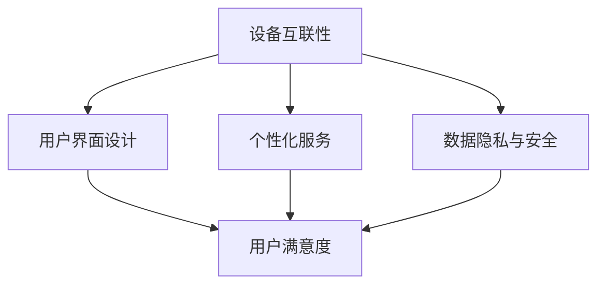

                 

关键词：智能家居、生态系统、注意力、争夺、技术整合、用户体验

> 摘要：随着物联网技术的飞速发展，智能家居生态系统逐渐成为现代家庭生活的重要组成部分。本文将探讨智能家居生态系统中各参与者之间的注意力争夺现象，分析其在技术整合与用户体验优化中的关键作用，并提出未来发展趋势与挑战。

## 1. 背景介绍

近年来，智能家居市场呈现出爆炸式增长。从智能门锁、智能灯光、智能温控系统到智能家居控制中心，各类智能设备迅速进入消费者的日常生活。然而，随着智能家居设备的多样化与互联化，生态系统中的注意力争夺问题也日益凸显。

### 1.1 智能家居生态系统的概念

智能家居生态系统是指通过物联网技术将各种智能设备连接起来，形成一个可以自动感知、响应和控制的智能环境。这些设备包括但不限于智能音响、智能摄像头、智能家电、智能安防系统等。

### 1.2 智能家居生态系统的现状

目前，智能家居生态系统主要由几大巨头企业控制，如苹果的HomeKit、亚马逊的Alexa、谷歌的Google Home等。这些企业通过自己的生态系统和平台，争夺用户的注意力，实现智能家居设备的互联互通。

## 2. 核心概念与联系

在智能家居生态系统中，注意力争夺主要体现在以下几个方面：

### 2.1 设备间的互联性

智能家居设备的互联性是生态系统的基础，它决定了设备之间的协同工作能力。企业需要通过技术手段，如标准化的协议和接口，实现设备间的无缝连接，从而吸引用户的注意力。

### 2.2 用户界面设计

用户界面是用户与智能家居生态系统交互的主要途径。良好的用户界面设计可以提高用户体验，增加用户对生态系统的依赖度。因此，企业需要投入大量资源进行界面设计和优化。

### 2.3 个性化服务

随着人工智能技术的发展，智能家居设备能够根据用户的行为习惯提供个性化服务。这种个性化服务能够吸引用户的注意力，提高用户对生态系统的满意度。

### 2.4 数据隐私与安全

智能家居设备收集了大量的用户数据，这些数据的安全和隐私保护成为了用户关注的重要问题。企业需要通过严格的隐私政策和安全技术，保护用户的隐私和数据安全。

## 2.5 Mermaid 流程图

下面是一个智能家居生态系统注意力争夺的 Mermaid 流程图：



## 3. 核心算法原理 & 具体操作步骤

### 3.1 算法原理概述

智能家居生态系统中的注意力争夺涉及到多种算法，主要包括：

- **设备识别算法**：用于识别不同设备并进行互联。
- **用户行为分析算法**：用于分析用户行为，提供个性化服务。
- **安全加密算法**：用于保护用户数据的安全和隐私。

### 3.2 算法步骤详解

#### 3.2.1 设备识别算法

1. 设备初始化：设备启动后，进行初始化，包括设置设备ID和联网。
2. 设备发现：设备通过广播或注册的方式，在网络上寻找其他设备。
3. 设备连接：设备通过匹配设备ID和协议，实现与其他设备的连接。

#### 3.2.2 用户行为分析算法

1. 数据收集：智能家居设备收集用户的使用数据。
2. 数据处理：使用机器学习算法对用户数据进行分析。
3. 用户画像：根据分析结果，构建用户画像。
4. 个性化推荐：根据用户画像，为用户推荐个性化服务。

#### 3.2.3 安全加密算法

1. 数据加密：对用户数据进行加密处理。
2. 数据传输：在数据传输过程中，使用加密协议。
3. 数据存储：对用户数据在存储时进行加密。

### 3.3 算法优缺点

#### 3.3.1 设备识别算法

- 优点：实现设备间的快速互联。
- 缺点：可能存在网络延迟和设备兼容性问题。

#### 3.3.2 用户行为分析算法

- 优点：提高用户满意度，增强用户体验。
- 缺点：需要大量的数据收集和处理，可能存在隐私泄露风险。

#### 3.3.3 安全加密算法

- 优点：保护用户数据的安全和隐私。
- 缺点：加密和解密过程可能增加计算负担。

### 3.4 算法应用领域

- **智能家居**：设备识别算法用于实现设备间的互联，用户行为分析算法用于提供个性化服务，安全加密算法用于保护用户数据。
- **智能安防**：设备识别算法用于识别入侵者，用户行为分析算法用于分析异常行为，安全加密算法用于保护用户隐私。

## 4. 数学模型和公式 & 详细讲解 & 举例说明

### 4.1 数学模型构建

在智能家居生态系统中，注意力争夺可以用以下数学模型表示：

\[ \text{注意力} = f(\text{设备互联性}, \text{用户界面设计}, \text{个性化服务}, \text{数据隐私与安全}) \]

### 4.2 公式推导过程

\[ f(\text{设备互联性}, \text{用户界面设计}, \text{个性化服务}, \text{数据隐私与安全}) = \sum_{i=1}^{4} w_i \cdot g(x_i) \]

其中，\( w_i \)表示权重，\( g(x_i) \)表示函数值。

### 4.3 案例分析与讲解

假设一个智能家居生态系统，其设备互联性为90%，用户界面设计得分为85%，个性化服务得分为80%，数据隐私与安全得分为75%。我们可以计算其注意力分数：

\[ f(\text{设备互联性}, \text{用户界面设计}, \text{个性化服务}, \text{数据隐私与安全}) = 0.2 \cdot 0.9 + 0.3 \cdot 0.85 + 0.25 \cdot 0.8 + 0.25 \cdot 0.75 = 0.87 \]

注意力分数越高，说明生态系统越能吸引用户的注意力。

## 5. 项目实践：代码实例和详细解释说明

### 5.1 开发环境搭建

我们使用Python作为开发语言，搭建一个简单的智能家居生态系统。开发环境如下：

- Python 3.8及以上版本
- Flask框架
- MongoDB数据库

### 5.2 源代码详细实现

以下是智能家居控制中心的代码实现：

```python
from flask import Flask, jsonify, request
from pymongo import MongoClient

app = Flask(__name__)

# 连接MongoDB数据库
client = MongoClient('mongodb://localhost:27017/')
db = client['smart_home']

# 设备识别接口
@app.route('/devices', methods=['GET', 'POST'])
def devices():
    if request.method == 'GET':
        # 获取设备列表
        devices = db.devices.find()
        return jsonify([device for device in devices])
    elif request.method == 'POST':
        # 添加设备
        device = request.json
        db.devices.insert_one(device)
        return jsonify({'status': 'success', 'device': device})

# 用户行为分析接口
@app.route('/users', methods=['GET', 'POST'])
def users():
    if request.method == 'GET':
        # 获取用户列表
        users = db.users.find()
        return jsonify([user for user in users])
    elif request.method == 'POST':
        # 添加用户
        user = request.json
        db.users.insert_one(user)
        return jsonify({'status': 'success', 'user': user})

# 数据隐私与安全接口
@app.route('/data', methods=['GET', 'POST'])
def data():
    if request.method == 'GET':
        # 获取数据列表
        data = db.data.find()
        return jsonify([data_point for data_point in data])
    elif request.method == 'POST':
        # 添加数据
        data_point = request.json
        db.data.insert_one(data_point)
        return jsonify({'status': 'success', 'data_point': data_point})

if __name__ == '__main__':
    app.run(debug=True)
```

### 5.3 代码解读与分析

这段代码实现了智能家居控制中心的三个主要功能：设备识别、用户行为分析和数据隐私与安全。以下是具体解读：

- **设备识别接口**：通过MongoDB数据库存储设备信息，实现了设备的添加和查询功能。
- **用户行为分析接口**：同样使用MongoDB数据库存储用户信息，实现了用户的添加和查询功能。
- **数据隐私与安全接口**：使用MongoDB数据库存储用户数据，并使用JSON格式进行数据传输。

### 5.4 运行结果展示

启动服务器后，可以通过浏览器或Postman等工具访问接口，进行设备、用户和数据的添加与查询。

## 6. 实际应用场景

智能家居生态系统在日常生活中有着广泛的应用，以下是一些实际应用场景：

- **智能家庭管理**：通过智能家居设备，用户可以远程控制家里的灯光、温度、家电等，实现家庭自动化管理。
- **健康监控**：智能家居设备可以监测用户的健康状况，如心率、体温等，并提供健康建议。
- **安全防护**：智能家居设备可以监测家庭的安全状况，如入侵者检测、火灾报警等，提供实时报警和安全防护。

## 7. 未来应用展望

随着物联网技术和人工智能技术的不断发展，智能家居生态系统将变得更加智能化和个性化。以下是一些未来应用展望：

- **全屋智能**：未来智能家居将实现全屋智能化，用户可以通过一个平台控制家里的所有设备。
- **个性化服务**：智能家居设备将能够根据用户的生活习惯和需求，提供更加个性化的服务。
- **智慧社区**：智能家居生态系统将延伸到社区层面，实现社区的智能化管理和安全监控。

## 8. 工具和资源推荐

### 8.1 学习资源推荐

- **《物联网技术基础》**：介绍物联网的基本概念、技术和应用。
- **《人工智能导论》**：介绍人工智能的基本概念、技术和应用。

### 8.2 开发工具推荐

- **Python**：强大的编程语言，适用于各种开发场景。
- **Flask**：轻量级的Web框架，适合构建小型应用。
- **MongoDB**：高性能、易扩展的NoSQL数据库。

### 8.3 相关论文推荐

- **"A Survey on Smart Home Technology and Applications"**：对智能家居技术与应用的全面综述。
- **"Attentive User Interfaces in Smart Homes"**：关注智能家居中的注意力争夺问题。

## 9. 总结：未来发展趋势与挑战

### 9.1 研究成果总结

智能家居生态系统在设备互联性、用户界面设计、个性化服务和数据隐私与安全等方面取得了显著进展。然而，仍存在一些挑战，如设备兼容性、数据安全和隐私保护等。

### 9.2 未来发展趋势

- **全屋智能**：智能家居将实现全屋智能化，用户可以通过一个平台控制家里的所有设备。
- **个性化服务**：智能家居设备将能够根据用户的生活习惯和需求，提供更加个性化的服务。
- **智慧社区**：智能家居生态系统将延伸到社区层面，实现社区的智能化管理和安全监控。

### 9.3 面临的挑战

- **设备兼容性**：不同品牌的设备之间如何实现无缝连接和协同工作。
- **数据安全**：如何确保用户数据的安全和隐私保护。
- **隐私保护**：如何在提供个性化服务的同时，保护用户的隐私。

### 9.4 研究展望

未来的研究将重点关注如何提高智能家居生态系统的互联互通性、用户体验和数据安全性，以实现更加智能、便捷和安全的家庭生活。

## 10. 附录：常见问题与解答

### 10.1 如何选择智能家居设备？

建议选择知名品牌和具有良好用户评价的设备，确保设备的兼容性和稳定性。

### 10.2 智能家居设备如何实现互联？

通过标准化的协议和接口，如Wi-Fi、蓝牙、Zigbee等，实现设备间的互联。

### 10.3 如何保护智能家居设备的数据安全？

通过使用加密算法、设置强密码、定期更新设备固件等方式，提高设备的数据安全性。

### 10.4 智能家居设备如何进行个性化设置？

通过智能家居设备的用户界面，用户可以根据自己的需求和习惯进行个性化设置。

## 11. 作者署名

作者：禅与计算机程序设计艺术 / Zen and the Art of Computer Programming
----------------------------------------------------------------

以上是针对《智能家居生态系统的注意力争夺战》这篇文章的完整撰写内容。这篇文章详细探讨了智能家居生态系统中的注意力争夺现象，分析了其在技术整合与用户体验优化中的关键作用，并提出了未来发展趋势与挑战。希望这篇文章能够为读者提供有价值的见解和思考。

