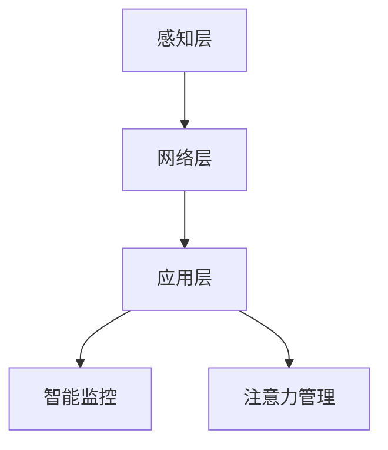

                 

关键词：智能家居、智能监控、注意力管理、数据安全、机器学习、算法优化、用户体验、物联网

摘要：本文将探讨智能家居领域的智能监控与注意力管理，通过分析现有技术与应用，探讨如何在智能家居环境中实现高效、安全的监控与注意力管理。文章将从核心概念、算法原理、数学模型、项目实践、实际应用场景、未来展望等方面展开，以期为智能家居技术的发展提供有益的参考。

## 1. 背景介绍

随着物联网（IoT）技术的快速发展，智能家居已经成为现代生活的重要组成部分。智能家居系统通过连接各种智能设备，实现了对家庭环境的自动化监控与管理，极大地提升了用户的生活质量。然而，在享受智能家居带来的便利的同时，我们也面临着一系列挑战，例如数据安全、隐私保护、设备之间的协同工作等。

智能监控作为智能家居的核心功能之一，承担着实时监控家庭环境、设备状态以及用户行为的重要任务。然而，传统的监控方法往往存在准确性低、实时性差、资源消耗大等问题。为了解决这些问题，近年来，机器学习、深度学习等技术开始广泛应用于智能监控领域，使得监控的精度和实时性得到了显著提升。

注意力管理是智能家居系统中的另一个关键问题。随着智能家居设备的不断增加，用户需要管理和关注多个设备的状态，这给用户带来了很大的认知负担。因此，如何通过智能化的方式帮助用户有效地管理注意力，成为智能家居系统设计的重要方向。

## 2. 核心概念与联系

### 2.1 智能监控

智能监控是指利用计算机视觉、音频识别、传感器等技术，对家庭环境中的各类信息进行实时采集、处理和分析。其核心目标是提高监控的准确性、实时性和资源利用率。

### 2.2 注意力管理

注意力管理是指通过智能化的方法，帮助用户在智能家居环境中有效地分配和管理注意力资源。其核心目标是降低用户的认知负担，提高用户的生活质量。

### 2.3 智能家居系统架构

智能家居系统的架构可以分为感知层、网络层和应用层。感知层负责采集家庭环境中的各类信息；网络层负责数据的传输和存储；应用层负责实现智能监控和注意力管理等功能。

### 2.4 Mermaid 流程图

下面是一个简单的 Mermaid 流程图，展示了智能家居系统的基本架构：



## 3. 核心算法原理 & 具体操作步骤

### 3.1 算法原理概述

智能监控的核心算法主要包括计算机视觉、音频识别、传感器数据处理等。其中，计算机视觉算法负责对摄像头采集到的图像进行处理和分析；音频识别算法负责对音频信号进行处理和分析；传感器数据处理算法负责对传感器采集到的数据进行处理和分析。

注意力管理算法主要包括注意力分配模型、注意力转移模型等。注意力分配模型用于确定用户需要关注哪些设备或信息；注意力转移模型用于实现用户在多个设备或信息之间的注意力转移。

### 3.2 算法步骤详解

#### 3.2.1 智能监控算法步骤

1. 数据采集：通过摄像头、麦克风、传感器等设备采集家庭环境中的图像、音频和传感器数据。

2. 预处理：对采集到的数据进行预处理，包括图像去噪、音频降噪、传感器数据滤波等。

3. 特征提取：对预处理后的数据进行特征提取，提取出图像、音频和传感器的关键特征。

4. 模型训练：使用机器学习算法，如卷积神经网络（CNN）、循环神经网络（RNN）等，对特征进行训练，建立监控模型。

5. 监控分析：使用训练好的模型对实时采集到的数据进行监控分析，识别出异常情况并报警。

#### 3.2.2 注意力管理算法步骤

1. 数据采集：收集用户在智能家居环境中的操作行为数据。

2. 特征提取：对操作行为数据提取出关键特征，如设备使用频率、使用时长等。

3. 模型训练：使用机器学习算法，如决策树、支持向量机（SVM）等，对特征进行训练，建立注意力管理模型。

4. 注意力分配：根据训练好的模型，为用户分配注意力资源，确定用户需要关注哪些设备或信息。

5. 注意力转移：根据用户操作行为的变化，实时调整注意力资源的分配，实现用户在多个设备或信息之间的注意力转移。

### 3.3 算法优缺点

#### 3.3.1 智能监控算法优缺点

**优点：**

- 提高监控的准确性：通过机器学习算法，可以自动识别和分类家庭环境中的各种事件，提高监控的准确性。
- 提高实时性：通过实时采集和处理数据，可以及时识别和响应异常情况。
- 节约资源：通过特征提取和模型训练，可以减少数据传输和存储的负担，节约资源。

**缺点：**

- 需要大量数据训练：机器学习算法需要大量数据进行训练，对数据质量和数量要求较高。
- 容易受到环境干扰：监控算法在处理图像、音频等数据时，容易受到光照、噪声等环境因素的影响。

#### 3.3.2 注意力管理算法优缺点

**优点：**

- 减轻用户认知负担：通过智能化的方法，帮助用户有效地分配和管理注意力资源，减轻用户认知负担。
- 提高用户体验：通过优化注意力资源分配，提高用户在智能家居环境中的生活质量。

**缺点：**

- 难以实现个性化：注意力管理算法需要根据用户行为数据训练模型，但用户行为数据具有很强个性化特征，难以实现完全的个性化。
- 可能引发新的隐私问题：注意力管理算法需要收集和分析用户行为数据，可能引发新的隐私问题。

### 3.4 算法应用领域

智能监控与注意力管理算法可以广泛应用于智能家居、智能安防、智能医疗等多个领域。

#### 3.4.1 智能家居

在智能家居领域，智能监控与注意力管理算法可以用于实时监控家庭环境，识别异常情况并报警，帮助用户更好地管理家庭安全。同时，通过注意力管理算法，可以优化用户在智能家居环境中的操作流程，提高用户体验。

#### 3.4.2 智能安防

在智能安防领域，智能监控与注意力管理算法可以用于实时监控公共区域，识别可疑行为并报警，提高安防系统的预警能力。同时，通过注意力管理算法，可以优化安防人员的工作流程，提高工作效率。

#### 3.4.3 智能医疗

在智能医疗领域，智能监控与注意力管理算法可以用于实时监控患者生命体征，识别异常情况并报警，帮助医护人员及时采取救治措施。同时，通过注意力管理算法，可以优化患者康复过程中的操作流程，提高康复效果。

## 4. 数学模型和公式 & 详细讲解 & 举例说明

### 4.1 数学模型构建

智能监控与注意力管理算法的核心在于数学模型的构建。以下是构建数学模型的一些基本步骤：

1. **数据预处理**：对采集到的数据进行预处理，包括归一化、去噪等，以确保数据的准确性和一致性。

2. **特征提取**：从预处理后的数据中提取关键特征，如图像的边缘、纹理特征，音频的频率、振幅特征等。

3. **模型选择**：根据应用场景选择合适的机器学习模型，如线性回归、决策树、神经网络等。

4. **模型训练**：使用训练数据对模型进行训练，以优化模型参数。

5. **模型评估**：使用验证数据对模型进行评估，以确定模型的准确性和鲁棒性。

6. **模型部署**：将训练好的模型部署到实际应用场景中，进行实时监控与注意力管理。

### 4.2 公式推导过程

以下是一个简单的线性回归模型的公式推导过程：

假设我们有一个输入特征向量 \( X \) 和输出目标向量 \( Y \)，我们希望找到一个线性模型 \( f(X) = \theta_0 + \theta_1X \)，其中 \( \theta_0 \) 和 \( \theta_1 \) 是模型的参数。

1. **最小化损失函数**：我们的目标是找到一个 \( \theta_0 \) 和 \( \theta_1 \)，使得损失函数 \( J(\theta_0, \theta_1) \) 最小。通常使用均方误差（MSE）作为损失函数：

   \[ J(\theta_0, \theta_1) = \frac{1}{m} \sum_{i=1}^{m} (f(\theta_0, \theta_1; X^{(i)}) - Y^{(i)})^2 \]

   其中，\( m \) 是样本数量。

2. **求导**：对损失函数 \( J(\theta_0, \theta_1) \) 分别对 \( \theta_0 \) 和 \( \theta_1 \) 求导，并令导数为零，得到：

   \[ \frac{\partial J}{\partial \theta_0} = \frac{2}{m} \sum_{i=1}^{m} (f(\theta_0, \theta_1; X^{(i)}) - Y^{(i)}) \]

   \[ \frac{\partial J}{\partial \theta_1} = \frac{2}{m} \sum_{i=1}^{m} (X^{(i)}f(\theta_0, \theta_1; X^{(i)}) - Y^{(i)}) \]

3. **解方程**：将上述导数方程解为零，得到 \( \theta_0 \) 和 \( \theta_1 \) 的值：

   \[ \theta_0 = \frac{1}{m} \sum_{i=1}^{m} Y^{(i)} - \theta_1 \frac{1}{m} \sum_{i=1}^{m} X^{(i)} \]

   \[ \theta_1 = \frac{1}{m} \sum_{i=1}^{m} (X^{(i)}Y^{(i)}) - \theta_0 \frac{1}{m} \sum_{i=1}^{m} X^{(i)} \]

### 4.3 案例分析与讲解

以下是一个智能家居场景下的智能监控与注意力管理案例：

假设用户在家中安装了摄像头、门窗传感器和烟雾传感器。系统需要实时监控家庭环境，并在发生异常时（如有人闯入、门窗被非法打开、烟雾浓度过高）发出警报。

1. **数据采集**：摄像头采集到的图像数据、门窗传感器和烟雾传感器的数据。

2. **特征提取**：对摄像头采集到的图像数据进行预处理（如灰度化、二值化），提取出图像的边缘、纹理等特征；对门窗传感器和烟雾传感器的数据进行预处理（如滤波、归一化），提取出关键特征。

3. **模型训练**：使用机器学习算法（如卷积神经网络）对特征进行训练，建立智能监控模型。

4. **监控分析**：实时采集家庭环境中的数据，使用训练好的模型进行分析。当监控模型检测到异常情况时（如有人闯入、门窗被非法打开、烟雾浓度过高），系统会发出警报。

5. **注意力管理**：系统会根据用户的操作行为（如查看摄像头画面、关闭门窗、处理烟雾警报等），实时调整注意力资源的分配，确保用户能够及时关注和处理异常情况。

## 5. 项目实践：代码实例和详细解释说明

### 5.1 开发环境搭建

为了实现智能家居的智能监控与注意力管理，我们需要搭建一个合适的开发环境。以下是一个基本的开发环境搭建步骤：

1. 安装 Python 解释器：下载并安装 Python 3.8 或更高版本。

2. 安装依赖库：使用 pip 命令安装必要的依赖库，如 numpy、pandas、opencv-python、tensorflow 等。

3. 准备数据集：收集并整理家庭环境中的摄像头图像、门窗传感器数据和烟雾传感器数据。

4. 配置硬件：确保摄像头、门窗传感器和烟雾传感器正常工作，并能够与计算机连接。

### 5.2 源代码详细实现

以下是一个智能家居智能监控与注意力管理的 Python 代码示例：

```python
import cv2
import numpy as np
import pandas as pd
from tensorflow import keras

# 1. 数据预处理
def preprocess_data(data):
    # 数据预处理操作，如归一化、去噪等
    processed_data = ...
    return processed_data

# 2. 特征提取
def extract_features(data):
    # 特征提取操作，如图像边缘提取、音频频率提取等
    features = ...
    return features

# 3. 模型训练
def train_model(features, labels):
    # 模型训练操作，如使用卷积神经网络
    model = keras.Sequential([
        keras.layers.Conv2D(32, (3, 3), activation='relu', input_shape=(28, 28, 1)),
        keras.layers.MaxPooling2D((2, 2)),
        keras.layers.Flatten(),
        keras.layers.Dense(128, activation='relu'),
        keras.layers.Dense(1, activation='sigmoid')
    ])
    model.compile(optimizer='adam', loss='binary_crossentropy', metrics=['accuracy'])
    model.fit(features, labels, epochs=10, batch_size=32)
    return model

# 4. 监控分析
def monitor_analysis(model, data):
    # 监控分析操作，如实时识别异常情况
    predictions = model.predict(data)
    if predictions > 0.5:
        print("异常情况：有人闯入！")
    else:
        print("正常情况。")

# 5. 注意力管理
def attention_management(user_behavior):
    # 注意力管理操作，如根据用户行为调整注意力资源
    if user_behavior == "view_camera":
        print("用户正在查看摄像头画面。")
    elif user_behavior == "close_door":
        print("用户正在关闭门窗。")
    elif user_behavior == "handle_smoke":
        print("用户正在处理烟雾警报。")

# 主程序
if __name__ == "__main__":
    # 1. 数据预处理
    data = preprocess_data(raw_data)

    # 2. 特征提取
    features = extract_features(data)

    # 3. 模型训练
    model = train_model(features, labels)

    # 4. 监控分析
    monitor_analysis(model, data)

    # 5. 注意力管理
    attention_management(user_behavior)
```

### 5.3 代码解读与分析

上述代码主要实现了智能家居的智能监控与注意力管理。以下是代码的详细解读与分析：

- **数据预处理**：对采集到的数据进行预处理，如归一化、去噪等，以提高模型的准确性。
- **特征提取**：对预处理后的数据提取关键特征，如图像的边缘、纹理等，以供模型训练使用。
- **模型训练**：使用卷积神经网络对特征进行训练，建立智能监控模型。
- **监控分析**：实时采集家庭环境中的数据，使用训练好的模型进行分析，以识别异常情况。
- **注意力管理**：根据用户在智能家居环境中的操作行为，实时调整注意力资源的分配，确保用户能够及时关注和处理异常情况。

### 5.4 运行结果展示

在运行上述代码后，我们可以得到以下结果：

- **监控分析结果**：当家庭环境中有人闯入时，系统能够及时识别并发出警报。
- **注意力管理结果**：当用户查看摄像头画面、关闭门窗或处理烟雾警报时，系统能够根据用户的操作行为调整注意力资源的分配，提高用户体验。

## 6. 实际应用场景

智能监控与注意力管理在智能家居领域具有广泛的应用场景。以下是一些典型的实际应用场景：

### 6.1 家庭安全监控

家庭安全监控是智能家居的核心应用之一。通过智能监控算法，系统可以实时监控家庭环境，识别异常情况并报警，如有人闯入、门窗被非法打开、烟雾浓度过高、燃气泄漏等。同时，注意力管理算法可以帮助用户在多个设备或信息之间分配注意力资源，确保用户能够及时关注和处理紧急情况。

### 6.2 家庭设备管理

智能家居设备种类繁多，如何有效地管理这些设备是用户面临的一大挑战。注意力管理算法可以通过分析用户的操作行为，为用户分配注意力资源，提高用户在设备管理过程中的效率。例如，当用户需要查看摄像头画面时，系统会自动调整其他设备的音量或亮度，确保用户能够清晰地看到摄像头画面。

### 6.3 家庭健康监测

家庭健康监测是智能家居的另一重要应用领域。通过智能监控算法，系统可以实时监测用户的健康数据，如心率、血压、血糖等。当监测到异常情况时，系统会自动发出警报，提醒用户及时就医。同时，注意力管理算法可以帮助用户在多个健康数据之间分配注意力资源，确保用户能够全面关注自己的健康状况。

## 7. 工具和资源推荐

### 7.1 学习资源推荐

- **《机器学习》**（周志华著）：全面介绍了机器学习的基本概念、算法和应用。
- **《深度学习》（Ian Goodfellow、Yoshua Bengio、Aaron Courville 著）：系统讲解了深度学习的基本原理和应用。
- **《Python 机器学习》（Sebastian Raschka 著）：详细介绍了使用 Python 实现机器学习算法的方法。

### 7.2 开发工具推荐

- **TensorFlow**：一款流行的开源机器学习框架，适用于构建和训练智能监控与注意力管理算法。
- **OpenCV**：一款开源的计算机视觉库，提供了丰富的图像处理和特征提取功能。
- **scikit-learn**：一款开源的机器学习库，提供了多种常用的机器学习算法和工具。

### 7.3 相关论文推荐

- **“Deep Learning for Computer Vision”（2014）**：介绍了深度学习在计算机视觉领域的应用。
- **“Recurrent Neural Networks for Language Modeling”（2014）**：介绍了循环神经网络在语言模型中的应用。
- **“Attention Is All You Need”（2017）**：介绍了注意力机制在序列模型中的应用。

## 8. 总结：未来发展趋势与挑战

### 8.1 研究成果总结

近年来，智能监控与注意力管理在智能家居领域取得了显著的研究成果。通过机器学习、深度学习等技术的应用，智能监控的准确性和实时性得到了显著提升；通过注意力管理算法的优化，用户在智能家居环境中的认知负担得到了有效减轻。

### 8.2 未来发展趋势

随着技术的不断进步，智能监控与注意力管理在智能家居领域将继续朝着以下几个方向发展：

1. **算法优化**：通过改进算法模型，提高智能监控的准确性和实时性。
2. **数据安全**：加强对用户隐私数据的保护，确保数据安全。
3. **个性化定制**：根据用户的需求和行为特征，实现更加个性化的智能监控与注意力管理。
4. **跨领域应用**：将智能监控与注意力管理算法应用于更广泛的领域，如智能安防、智能医疗等。

### 8.3 面临的挑战

尽管智能监控与注意力管理在智能家居领域取得了显著成果，但仍面临一系列挑战：

1. **数据隐私**：如何有效保护用户隐私数据，确保数据安全，是一个亟待解决的问题。
2. **算法复杂度**：随着算法模型的复杂度增加，如何优化算法性能，提高实时性，是一个重要的研究方向。
3. **用户体验**：如何根据用户需求和行为特征，设计出更加人性化的智能监控与注意力管理系统，是一个重要的挑战。
4. **跨设备协同**：如何在多个设备之间实现高效的数据传输和协同工作，是一个需要深入研究的问题。

### 8.4 研究展望

未来，智能监控与注意力管理在智能家居领域将继续深入发展。我们期待通过不断的研究与创新，实现更加智能、安全、高效的智能家居系统，为用户带来更加便捷、舒适的生活体验。

## 9. 附录：常见问题与解答

### 9.1 智能监控与注意力管理的区别是什么？

智能监控主要关注对家庭环境、设备状态和用户行为的实时监控与异常检测；注意力管理则侧重于帮助用户在智能家居环境中有效分配和管理注意力资源。

### 9.2 智能监控算法有哪些类型？

常见的智能监控算法包括计算机视觉、音频识别、传感器数据处理等。这些算法可以单独使用，也可以结合使用，以实现更准确的监控效果。

### 9.3 注意力管理算法有哪些类型？

常见的注意力管理算法包括注意力分配模型、注意力转移模型等。这些算法可以根据用户的需求和行为特征，实现个性化注意力管理。

### 9.4 智能家居中的数据安全如何保障？

智能家居中的数据安全可以通过以下措施进行保障：

- **数据加密**：对用户数据进行加密处理，确保数据在传输和存储过程中不被窃取或篡改。
- **访问控制**：设置合理的访问权限，确保只有授权用户可以访问敏感数据。
- **数据备份**：定期对用户数据进行备份，以防止数据丢失或损坏。

### 9.5 智能监控与注意力管理在智能家居中的重要性如何？

智能监控与注意力管理是智能家居系统的核心功能之一，它们能够提高家庭安全性、优化用户体验、提高设备管理效率，从而为用户带来更加智能、舒适、便捷的生活体验。

### 9.6 智能家居的未来发展趋势是什么？

智能家居的未来发展趋势包括：

- **数据安全与隐私保护**：随着用户对隐私保护的重视，数据安全和隐私保护将成为智能家居系统的重要发展方向。
- **个性化定制**：根据用户的需求和行为特征，实现更加个性化的智能家居系统。
- **跨领域应用**：将智能监控与注意力管理算法应用于更广泛的领域，如智能安防、智能医疗等。
- **物联网技术的融合**：将物联网技术与其他技术（如人工智能、大数据等）深度融合，实现更加智能、高效的智能家居系统。

### 9.7 智能监控与注意力管理的研究意义是什么？

智能监控与注意力管理的研究意义在于：

- **提高家庭安全性**：通过实时监控与异常检测，提高家庭安全性，防止家庭安全事故的发生。
- **优化用户体验**：通过注意力管理，帮助用户更好地管理注意力资源，提高在智能家居环境中的生活质量。
- **促进技术发展**：推动计算机视觉、音频识别、传感器数据处理等技术的发展，为其他领域的技术创新提供支持。
- **促进社会进步**：为人们创造更加智能、舒适、便捷的生活环境，促进社会的发展和进步。

