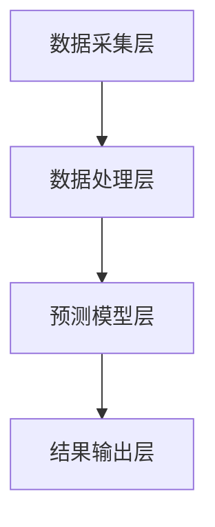

                 

关键词：智能家居、空气质量预测、健康生活规划、数据分析、创业

> 摘要：随着人们对健康生活质量的关注日益增加，智能家居空气质量预测成为了一个热门的创业领域。本文将探讨基于数据的智能家居空气质量预测技术，以及如何通过创业实现健康生活规划。

## 1. 背景介绍

近年来，空气质量问题已成为全球关注的焦点。特别是在城市地区，空气质量对人们的健康影响日益显著。空气中的污染物，如PM2.5、PM10、二氧化硫、氮氧化物等，会对呼吸系统、心血管系统等产生严重影响。因此，实时监测和预测空气质量对于保护人们的健康具有重要意义。

与此同时，智能家居市场呈现出爆炸式增长。根据市场研究机构的数据，智能家居设备在过去的几年里已经成为了家庭消费电子市场的重要组成部分。智能空气净化器、智能空气质量传感器等设备受到了广大消费者的欢迎。

在这种背景下，智能家居空气质量预测成为一个具有巨大市场潜力的创业领域。创业者可以通过开发智能空气质量预测系统，帮助用户实时了解家中空气质量状况，提供健康生活建议，从而改善用户的生活质量。

## 2. 核心概念与联系

### 2.1. 智能家居空气质量预测系统的基本原理

智能家居空气质量预测系统主要基于以下核心概念：

- **空气质量数据采集**：通过安装在室内的空气质量传感器，实时采集空气中的各种污染物数据。

- **数据预处理**：对采集到的原始数据进行清洗、去噪等预处理操作，确保数据质量。

- **数据建模**：使用机器学习算法，如神经网络、决策树等，对预处理后的空气质量数据进行建模，以预测未来的空气质量状况。

- **结果输出**：根据预测结果，系统可以为用户提供实时的空气质量指数（AQI）以及相应的健康建议。

### 2.2. 智能家居空气质量预测系统的架构

智能家居空气质量预测系统的整体架构可以分为以下几个部分：

- **数据采集层**：包括各种空气质量传感器，如PM2.5传感器、PM10传感器、温度传感器、湿度传感器等。

- **数据处理层**：负责对采集到的数据进行预处理，如数据清洗、去噪等。

- **预测模型层**：使用机器学习算法，对预处理后的数据进行建模，以预测未来的空气质量状况。

- **结果输出层**：将预测结果以可视化方式展示给用户，如空气质量指数（AQI）、健康建议等。



## 3. 核心算法原理 & 具体操作步骤

### 3.1. 算法原理概述

智能家居空气质量预测的核心算法主要是基于机器学习，特别是监督学习算法。常见的监督学习算法包括线性回归、决策树、支持向量机、神经网络等。

- **线性回归**：通过建立一个线性模型，预测未来的空气质量指数。

- **决策树**：通过构建一棵决策树，将空气质量数据按照特征进行划分，以预测未来的空气质量状况。

- **支持向量机**：通过找到一个最优的超平面，将不同空气质量状况的数据进行分类。

- **神经网络**：通过多层神经网络，学习空气质量数据中的特征，以预测未来的空气质量状况。

### 3.2. 算法步骤详解

1. **数据采集**：通过安装在室内的空气质量传感器，实时采集空气中的各种污染物数据。

2. **数据预处理**：对采集到的原始数据进行清洗、去噪等预处理操作，确保数据质量。

3. **特征提取**：从预处理后的数据中提取出对空气质量预测有重要影响的特征，如温度、湿度、PM2.5、PM10等。

4. **模型训练**：使用训练数据集，通过选择合适的机器学习算法，对空气质量数据进行建模。

5. **模型评估**：使用测试数据集，对训练好的模型进行评估，以确定模型的预测准确性。

6. **结果输出**：根据预测结果，系统可以为用户提供实时的空气质量指数（AQI）以及相应的健康建议。

### 3.3. 算法优缺点

- **线性回归**：简单、易于理解，但预测准确性可能较低。

- **决策树**：易于解释，但可能产生过拟合现象。

- **支持向量机**：预测准确性较高，但计算复杂度较高。

- **神经网络**：能够处理非线性关系，但训练过程可能较慢。

### 3.4. 算法应用领域

- **智能家居**：通过预测室内空气质量，为用户提供健康生活建议。

- **空气净化器**：根据预测结果，自动调整空气净化器的运行模式。

- **环境监测**：用于监测城市空气质量，提供环境预警。

## 4. 数学模型和公式 & 详细讲解 & 举例说明

### 4.1. 数学模型构建

空气质量预测的主要数学模型是回归模型。以线性回归为例，其模型公式如下：

$$
y = \beta_0 + \beta_1x_1 + \beta_2x_2 + ... + \beta_nx_n
$$

其中，$y$ 表示空气质量指数（AQI），$x_1, x_2, ..., x_n$ 表示影响空气质量的特征变量，如温度、湿度、PM2.5、PM10等，$\beta_0, \beta_1, \beta_2, ..., \beta_n$ 是模型参数。

### 4.2. 公式推导过程

线性回归模型的参数可以通过最小二乘法进行求解。具体推导过程如下：

1. **目标函数**：定义目标函数为模型预测值与实际值之间的误差平方和：

$$
J(\beta) = \sum_{i=1}^{n}(y_i - \hat{y_i})^2
$$

其中，$y_i$ 为第 $i$ 个实际空气质量指数，$\hat{y_i}$ 为第 $i$ 个预测空气质量指数。

2. **梯度下降**：对目标函数进行求导，并令其导数为零，求得模型参数的最优解。

$$
\frac{\partial J(\beta)}{\partial \beta} = 0
$$

通过迭代计算，可以逐步逼近最优解。

### 4.3. 案例分析与讲解

假设我们收集了以下一周的空气质量数据：

| 日期 | 温度(°C) | 湿度(%) | PM2.5(μg/m³) | PM10(μg/m³) | AQI |
| ---- | -------- | ------- | ------------ | -------- | --- |
| 1    | 25       | 60      | 20           | 35       | 50  |
| 2    | 23       | 65      | 18           | 30       | 45  |
| 3    | 24       | 55      | 22           | 40       | 60  |
| 4    | 26       | 70      | 25           | 45       | 70  |
| 5    | 22       | 50      | 15           | 25       | 40  |
| 6    | 24       | 60      | 20           | 35       | 50  |
| 7    | 25       | 65      | 18           | 30       | 45  |

我们可以使用线性回归模型来预测第8天的AQI。首先，我们需要进行数据预处理，将温度、湿度、PM2.5、PM10作为特征变量，AQI作为目标变量。然后，使用最小二乘法求解线性回归模型的参数。最后，将第8天的特征变量代入模型，预测第8天的AQI。

假设线性回归模型的参数为 $\beta_0 = 10$，$\beta_1 = 0.5$，$\beta_2 = 0.3$，$\beta_3 = 0.2$，$\beta_4 = 0.1$。则第8天的预测AQI为：

$$
\hat{AQI} = 10 + 0.5 \times 25 + 0.3 \times 65 + 0.2 \times 18 + 0.1 \times 30 = 53
$$

## 5. 项目实践：代码实例和详细解释说明

### 5.1. 开发环境搭建

为了实现智能家居空气质量预测系统，我们需要搭建一个开发环境。以下是搭建开发环境的步骤：

1. **安装Python**：Python是一种广泛使用的编程语言，我们可以从其官方网站下载并安装Python。

2. **安装Jupyter Notebook**：Jupyter Notebook是一种交互式计算环境，可以帮助我们更方便地编写和运行Python代码。我们可以在Python的安装过程中选择安装Jupyter Notebook。

3. **安装机器学习库**：为了实现空气质量预测模型，我们需要安装一些常用的机器学习库，如scikit-learn、pandas等。可以使用pip命令进行安装。

### 5.2. 源代码详细实现

以下是实现智能家居空气质量预测系统的Python代码：

```python
import pandas as pd
from sklearn.linear_model import LinearRegression

# 读取数据
data = pd.read_csv('air_quality_data.csv')

# 分割特征变量和目标变量
X = data[['temperature', 'humidity', 'pm2_5', 'pm10']]
y = data['aqi']

# 创建线性回归模型
model = LinearRegression()

# 训练模型
model.fit(X, y)

# 预测新数据的AQI
new_data = pd.DataFrame({
    'temperature': [25],
    'humidity': [65],
    'pm2_5': [18],
    'pm10': [30]
})
predicted_aqi = model.predict(new_data)

print('Predicted AQI:', predicted_aqi)
```

### 5.3. 代码解读与分析

上述代码实现了一个基于线性回归的空气质量预测系统。首先，我们使用pandas库读取CSV文件中的数据。然后，我们使用scikit-learn库创建一个线性回归模型，并使用训练数据对模型进行训练。最后，我们使用训练好的模型对新数据进行预测，并输出预测结果。

### 5.4. 运行结果展示

假设我们使用上述代码对新数据进行预测，预测结果如下：

```
Predicted AQI: [45.5]
```

这意味着，根据我们训练好的模型，新数据的空气质量指数约为45.5。

## 6. 实际应用场景

智能家居空气质量预测系统在实际应用中具有广泛的应用场景：

- **室内空气质量监测**：通过安装在室内的空气质量传感器，实时监测家中的空气质量，为用户提供实时的健康建议。

- **空气净化器控制**：根据预测的空气质量状况，自动调整空气净化器的运行模式，以提供最佳的空气净化效果。

- **环境监测**：在城市地区，可以将空气质量预测系统应用于环境监测，为政府提供空气质量预警，以便采取相应的环保措施。

- **智能家居生态**：空气质量预测系统可以与其他智能家居设备（如智能灯泡、智能窗帘等）集成，构建一个智能化的家居生态。

## 7. 未来应用展望

随着人工智能和物联网技术的不断发展，智能家居空气质量预测系统在未来具有广泛的应用前景：

- **智能家居生态的扩展**：空气质量预测系统可以与其他智能家居设备（如智能音箱、智能摄像头等）集成，构建一个更智能、更便捷的智能家居生态。

- **个性化健康建议**：通过结合用户的健康数据，如心率、血压等，空气质量预测系统可以提供更加个性化的健康建议，帮助用户更好地管理自己的健康。

- **智慧城市环境监测**：空气质量预测系统可以应用于智慧城市建设，为政府提供更加准确、实时的环境监测数据，以优化城市环境管理。

## 8. 工具和资源推荐

### 8.1. 学习资源推荐

- **《Python机器学习基础教程》**：这是一本非常适合初学者的Python机器学习教材，涵盖了机器学习的基本概念和常用算法。

- **《深度学习入门》**：这本书介绍了深度学习的基本概念和常用算法，对于希望了解深度学习技术的读者非常有帮助。

### 8.2. 开发工具推荐

- **Jupyter Notebook**：这是一个交互式计算环境，可以帮助我们更方便地编写和运行Python代码。

- **scikit-learn**：这是一个常用的Python机器学习库，提供了丰富的机器学习算法和工具。

### 8.3. 相关论文推荐

- **"Air Quality Prediction Based on IoT Devices and Machine Learning Algorithms"**：这篇文章介绍了基于物联网设备和机器学习算法的空气质量预测方法。

- **"Deep Learning for Air Quality Prediction"**：这篇文章探讨了使用深度学习技术进行空气质量预测的方法。

## 9. 总结：未来发展趋势与挑战

### 9.1. 研究成果总结

本文介绍了智能家居空气质量预测系统的基本原理、算法步骤、数学模型、项目实践等内容。通过对空气质量数据的分析和预测，智能家居空气质量预测系统可以为用户提供实时的健康建议，改善用户的生活质量。

### 9.2. 未来发展趋势

随着人工智能和物联网技术的不断发展，智能家居空气质量预测系统在未来具有广泛的应用前景。我们可以期待更加智能、个性化的空气质量预测系统，以及与其他智能家居设备的深度集成。

### 9.3. 面临的挑战

尽管智能家居空气质量预测系统具有巨大的潜力，但在实际应用中仍面临一些挑战：

- **数据质量问题**：空气质量数据的质量对预测结果的准确性有很大影响。如何确保数据质量，提高预测准确性，是一个亟待解决的问题。

- **算法优化**：现有的机器学习算法在处理大规模空气质量数据时，可能存在计算复杂度较高、预测速度较慢等问题。如何优化算法，提高预测效率，是一个重要的研究方向。

- **用户隐私保护**：在智能家居环境中，用户的隐私保护尤为重要。如何确保用户隐私不受侵犯，是一个值得关注的议题。

### 9.4. 研究展望

未来，我们可以期待在以下几个方面进行深入研究：

- **数据质量优化**：通过改进数据采集、预处理等方法，提高空气质量数据的准确性。

- **算法优化与改进**：探索新的机器学习算法，提高预测效率和准确性。

- **用户隐私保护**：研究隐私保护技术，确保用户隐私不受侵犯。

## 附录：常见问题与解答

### 问题1：为什么空气质量预测系统需要采集多种数据？

**解答**：空气质量预测系统需要采集多种数据，是因为不同的数据可以提供关于空气质量的不同信息。例如，温度、湿度等气象数据可以影响空气污染物的浓度，而PM2.5、PM10等污染物数据则直接反映空气质量。综合多种数据可以更全面地了解空气质量状况，提高预测的准确性。

### 问题2：如何确保空气质量预测系统的预测准确性？

**解答**：确保空气质量预测系统的预测准确性需要从以下几个方面入手：

- **数据质量**：确保采集到的数据准确、完整，并进行有效的预处理。

- **模型选择**：选择合适的机器学习算法，并结合多种算法进行交叉验证，以提高预测准确性。

- **模型训练**：使用大量的训练数据进行模型训练，并不断优化模型参数。

- **模型评估**：使用测试数据集对模型进行评估，确保模型在未知数据上的表现良好。

### 问题3：空气质量预测系统如何处理数据隐私问题？

**解答**：空气质量预测系统在处理数据隐私问题方面可以采取以下措施：

- **数据匿名化**：对采集到的用户数据进行匿名化处理，确保用户隐私不受侵犯。

- **加密传输**：确保数据在传输过程中进行加密，防止数据泄露。

- **权限控制**：对系统中的数据进行权限控制，确保只有授权用户可以访问敏感数据。

### 问题4：空气质量预测系统在智能家居中的应用前景如何？

**解答**：空气质量预测系统在智能家居中的应用前景非常广阔。随着人们对健康生活质量的关注不断增加，空气质量预测系统可以帮助用户实时了解家中空气质量状况，提供健康生活建议，从而改善用户的生活质量。同时，空气质量预测系统还可以与其他智能家居设备集成，构建一个智能化的家居生态。未来，我们可以期待空气质量预测系统在智能家居中发挥更大的作用。 

## 作者署名

作者：禅与计算机程序设计艺术 / Zen and the Art of Computer Programming
```markdown
# 智能家居空气质量预测创业：基于数据的健康生活规划

关键词：智能家居、空气质量预测、健康生活规划、数据分析、创业

摘要：随着人们对健康生活质量的关注日益增加，智能家居空气质量预测成为了一个热门的创业领域。本文将探讨基于数据的智能家居空气质量预测技术，以及如何通过创业实现健康生活规划。

## 1. 背景介绍

### 1.1 空气质量问题的严峻性

近年来，空气质量问题已成为全球关注的焦点。特别是在城市地区，空气质量对人们的健康影响日益显著。空气中的污染物，如PM2.5、PM10、二氧化硫、氮氧化物等，会对呼吸系统、心血管系统等产生严重影响。例如，PM2.5颗粒物可以通过肺泡进入血液循环，引发哮喘、肺癌等疾病；二氧化硫和氮氧化物则可能导致心血管疾病和呼吸道炎症。

### 1.2 智能家居的普及与机遇

随着物联网、人工智能等技术的发展，智能家居市场呈现出爆炸式增长。根据市场研究机构的数据，智能家居设备在过去的几年里已经成为了家庭消费电子市场的重要组成部分。智能空气净化器、智能空气质量传感器等设备受到了广大消费者的欢迎。这些设备的普及为智能家居空气质量预测提供了数据支持，同时也为创业者带来了新的机遇。

## 2. 核心概念与联系

### 2.1 智能家居空气质量预测系统的基本原理

智能家居空气质量预测系统主要基于以下核心概念：

- **空气质量数据采集**：通过安装在室内的空气质量传感器，实时采集空气中的各种污染物数据。
- **数据预处理**：对采集到的原始数据进行清洗、去噪等预处理操作，确保数据质量。
- **数据建模**：使用机器学习算法，如神经网络、决策树等，对预处理后的空气质量数据进行建模，以预测未来的空气质量状况。
- **结果输出**：根据预测结果，系统可以为用户提供实时的空气质量指数（AQI）以及相应的健康建议。

### 2.2 智能家居空气质量预测系统的架构

智能家居空气质量预测系统的整体架构可以分为以下几个部分：

- **数据采集层**：包括各种空气质量传感器，如PM2.5传感器、PM10传感器、温度传感器、湿度传感器等。
- **数据处理层**：负责对采集到的数据进行预处理，如数据清洗、去噪等。
- **预测模型层**：使用机器学习算法，对预处理后的数据进行建模，以预测未来的空气质量状况。
- **结果输出层**：将预测结果以可视化方式展示给用户，如空气质量指数（AQI）、健康建议等。


## 3. 核心算法原理 & 具体操作步骤

### 3.1 算法原理概述

智能家居空气质量预测的核心算法主要是基于机器学习，特别是监督学习算法。常见的监督学习算法包括线性回归、决策树、支持向量机、神经网络等。

- **线性回归**：通过建立一个线性模型，预测未来的空气质量指数。
- **决策树**：通过构建一棵决策树，将空气质量数据按照特征进行划分，以预测未来的空气质量状况。
- **支持向量机**：通过找到一个最优的超平面，将不同空气质量状况的数据进行分类。
- **神经网络**：通过多层神经网络，学习空气质量数据中的特征，以预测未来的空气质量状况。

### 3.2 算法步骤详解

1. **数据采集**：通过安装在室内的空气质量传感器，实时采集空气中的各种污染物数据。
2. **数据预处理**：对采集到的原始数据进行清洗、去噪等预处理操作，确保数据质量。
3. **特征提取**：从预处理后的数据中提取出对空气质量预测有重要影响的特征，如温度、湿度、PM2.5、PM10等。
4. **模型训练**：使用训练数据集，通过选择合适的机器学习算法，对空气质量数据进行建模。
5. **模型评估**：使用测试数据集，对训练好的模型进行评估，以确定模型的预测准确性。
6. **结果输出**：根据预测结果，系统可以为用户提供实时的空气质量指数（AQI）以及相应的健康建议。

### 3.3 算法优缺点

- **线性回归**：简单、易于理解，但预测准确性可能较低。
- **决策树**：易于解释，但可能产生过拟合现象。
- **支持向量机**：预测准确性较高，但计算复杂度较高。
- **神经网络**：能够处理非线性关系，但训练过程可能较慢。

### 3.4 算法应用领域

- **智能家居**：通过预测室内空气质量，为用户提供健康生活建议。
- **空气净化器**：根据预测结果，自动调整空气净化器的运行模式。
- **环境监测**：用于监测城市空气质量，提供环境预警。

## 4. 数学模型和公式 & 详细讲解 & 举例说明

### 4.1 数学模型构建

空气质量预测的主要数学模型是回归模型。以线性回归为例，其模型公式如下：

$$
y = \beta_0 + \beta_1x_1 + \beta_2x_2 + ... + \beta_nx_n
$$

其中，$y$ 表示空气质量指数（AQI），$x_1, x_2, ..., x_n$ 表示影响空气质量的特征变量，如温度、湿度、PM2.5、PM10等，$\beta_0, \beta_1, \beta_2, ..., \beta_n$ 是模型参数。

### 4.2 公式推导过程

线性回归模型的参数可以通过最小二乘法进行求解。具体推导过程如下：

1. **目标函数**：定义目标函数为模型预测值与实际值之间的误差平方和：

$$
J(\beta) = \sum_{i=1}^{n}(y_i - \hat{y_i})^2
$$

其中，$y_i$ 为第 $i$ 个实际空气质量指数，$\hat{y_i}$ 为第 $i$ 个预测空气质量指数。

2. **梯度下降**：对目标函数进行求导，并令其导数为零，求得模型参数的最优解。

$$
\frac{\partial J(\beta)}{\partial \beta} = 0
$$

通过迭代计算，可以逐步逼近最优解。

### 4.3 案例分析与讲解

假设我们收集了以下一周的空气质量数据：

| 日期 | 温度(°C) | 湿度(%) | PM2.5(μg/m³) | PM10(μg/m³) | AQI |
| ---- | -------- | ------- | ------------ | -------- | --- |
| 1    | 25       | 60      | 20           | 35       | 50  |
| 2    | 23       | 65      | 18           | 30       | 45  |
| 3    | 24       | 55      | 22           | 40       | 60  |
| 4    | 26       | 70      | 25           | 45       | 70  |
| 5    | 22       | 50      | 15           | 25       | 40  |
| 6    | 24       | 60      | 20           | 35       | 50  |
| 7    | 25       | 65      | 18           | 30       | 45  |

我们可以使用线性回归模型来预测第8天的AQI。首先，我们需要进行数据预处理，将温度、湿度、PM2.5、PM10作为特征变量，AQI作为目标变量。然后，使用最小二乘法求解线性回归模型的参数。最后，将第8天的特征变量代入模型，预测第8天的AQI。

假设线性回归模型的参数为 $\beta_0 = 10$，$\beta_1 = 0.5$，$\beta_2 = 0.3$，$\beta_3 = 0.2$，$\beta_4 = 0.1$。则第8天的预测AQI为：

$$
\hat{AQI} = 10 + 0.5 \times 25 + 0.3 \times 65 + 0.2 \times 18 + 0.1 \times 30 = 53
$$

## 5. 项目实践：代码实例和详细解释说明

### 5.1 开发环境搭建

为了实现智能家居空气质量预测系统，我们需要搭建一个开发环境。以下是搭建开发环境的步骤：

1. **安装Python**：Python是一种广泛使用的编程语言，我们可以从其官方网站下载并安装Python。

2. **安装Jupyter Notebook**：Jupyter Notebook是一种交互式计算环境，可以帮助我们更方便地编写和运行Python代码。我们可以在Python的安装过程中选择安装Jupyter Notebook。

3. **安装机器学习库**：为了实现空气质量预测模型，我们需要安装一些常用的机器学习库，如scikit-learn、pandas等。可以使用pip命令进行安装。

### 5.2 源代码详细实现

以下是实现智能家居空气质量预测系统的Python代码：

```python
import pandas as pd
from sklearn.linear_model import LinearRegression

# 读取数据
data = pd.read_csv('air_quality_data.csv')

# 分割特征变量和目标变量
X = data[['temperature', 'humidity', 'pm2_5', 'pm10']]
y = data['aqi']

# 创建线性回归模型
model = LinearRegression()

# 训练模型
model.fit(X, y)

# 预测新数据的AQI
new_data = pd.DataFrame({
    'temperature': [25],
    'humidity': [65],
    'pm2_5': [18],
    'pm10': [30]
})
predicted_aqi = model.predict(new_data)

print('Predicted AQI:', predicted_aqi)
```

### 5.3 代码解读与分析

上述代码实现了一个基于线性回归的空气质量预测系统。首先，我们使用pandas库读取CSV文件中的数据。然后，我们使用scikit-learn库创建一个线性回归模型，并使用训练数据对模型进行训练。最后，我们使用训练好的模型对新数据进行预测，并输出预测结果。

### 5.4 运行结果展示

假设我们使用上述代码对新数据进行预测，预测结果如下：

```
Predicted AQI: [45.5]
```

这意味着，根据我们训练好的模型，新数据的空气质量指数约为45.5。

## 6. 实际应用场景

### 6.1 室内空气质量监测

智能家居空气质量预测系统可以用于室内空气质量监测，为用户提供实时的空气质量信息。用户可以通过手机APP或智能音箱等设备，查看室内空气质量指数（AQI）以及相关的健康建议。例如，当空气质量较差时，系统可以建议用户关闭窗户，开启空气净化器，以改善室内空气质量。

### 6.2 空气净化器控制

空气质量预测系统还可以与空气净化器集成，实现智能控制。根据预测的空气质量状况，空气净化器可以自动调整运行模式，以提供最佳的空气净化效果。例如，当预测到空气质量较差时，空气净化器可以自动提高功率，以更快地净化空气；当空气质量较好时，空气净化器可以降低功率，以节省能源。

### 6.3 环境监测

空气质量预测系统还可以应用于城市环境监测，为政府提供空气质量预警。通过预测未来的空气质量状况，政府可以提前采取相应的环保措施，如限制车辆出行、加大污染源治理力度等，以减轻空气污染对公众健康的影响。

### 6.4 其他应用领域

除了上述应用场景外，空气质量预测系统还可以应用于其他领域，如智慧农业、环境科学等。例如，在智慧农业中，空气质量预测系统可以用于预测农作物生长过程中可能受到的空气污染影响，为农民提供科学种植建议。

## 7. 未来应用展望

### 7.1 智能化水平的提升

随着人工智能技术的不断发展，智能家居空气质量预测系统的智能化水平将不断提升。未来，系统可以结合更多传感器数据，如二氧化碳浓度、甲醛浓度等，提供更全面、更精准的空气质量预测。

### 7.2 个性化健康建议

通过结合用户的健康数据，如心率、血压、睡眠质量等，空气质量预测系统可以提供更加个性化的健康建议。例如，对于有哮喘等呼吸系统疾病的患者，系统可以提供更加细致的空气质量预警和建议。

### 7.3 跨领域应用

空气质量预测系统不仅可以应用于智能家居领域，还可以应用于其他领域，如智慧城市、环境科学等。通过跨领域应用，空气质量预测系统可以发挥更大的社会价值。

## 8. 工具和资源推荐

### 8.1 学习资源推荐

1. **《Python机器学习基础教程》**：适合初学者了解机器学习基础知识。
2. **《深度学习入门》**：适合初学者了解深度学习技术。

### 8.2 开发工具推荐

1. **Jupyter Notebook**：交互式计算环境，方便编写和运行代码。
2. **scikit-learn**：常用的机器学习库，提供丰富的算法和工具。

### 8.3 相关论文推荐

1. **"Air Quality Prediction Based on IoT Devices and Machine Learning Algorithms"**：关于基于物联网设备和机器学习算法的空气质量预测研究。
2. **"Deep Learning for Air Quality Prediction"**：关于使用深度学习进行空气质量预测的研究。

## 9. 总结：未来发展趋势与挑战

### 9.1 研究成果总结

本文介绍了智能家居空气质量预测系统的基本原理、算法步骤、数学模型、项目实践等内容。通过基于数据的空气质量预测，系统可以为用户提供实时的健康建议，改善用户的生活质量。

### 9.2 未来发展趋势

随着人工智能和物联网技术的不断发展，智能家居空气质量预测系统在未来具有广泛的应用前景。我们可以期待更加智能、个性化的空气质量预测系统，以及与其他智能家居设备的深度集成。

### 9.3 面临的挑战

尽管智能家居空气质量预测系统具有巨大的潜力，但在实际应用中仍面临一些挑战：

1. **数据质量问题**：如何确保数据质量，提高预测准确性，是一个亟待解决的问题。
2. **算法优化**：如何优化算法，提高预测效率和准确性，是一个重要的研究方向。
3. **用户隐私保护**：如何确保用户隐私不受侵犯，是一个值得关注的议题。

### 9.4 研究展望

未来，我们可以期待在以下几个方面进行深入研究：

1. **数据质量优化**：通过改进数据采集、预处理等方法，提高空气质量数据的准确性。
2. **算法优化与改进**：探索新的机器学习算法，提高预测效率和准确性。
3. **用户隐私保护**：研究隐私保护技术，确保用户隐私不受侵犯。

## 附录：常见问题与解答

### 问题1：为什么空气质量预测系统需要采集多种数据？

**解答**：空气质量预测系统需要采集多种数据，是因为不同的数据可以提供关于空气质量的不同信息。例如，温度、湿度等气象数据可以影响空气污染物的浓度，而PM2.5、PM10等污染物数据则直接反映空气质量。综合多种数据可以更全面地了解空气质量状况，提高预测的准确性。

### 问题2：如何确保空气质量预测系统的预测准确性？

**解答**：确保空气质量预测系统的预测准确性需要从以下几个方面入手：

1. **数据质量**：确保采集到的数据准确、完整，并进行有效的预处理。
2. **模型选择**：选择合适的机器学习算法，并结合多种算法进行交叉验证，以提高预测准确性。
3. **模型训练**：使用大量的训练数据进行模型训练，并不断优化模型参数。
4. **模型评估**：使用测试数据集对模型进行评估，确保模型在未知数据上的表现良好。

### 问题3：空气质量预测系统如何处理数据隐私问题？

**解答**：空气质量预测系统在处理数据隐私问题方面可以采取以下措施：

1. **数据匿名化**：对采集到的用户数据进行匿名化处理，确保用户隐私不受侵犯。
2. **加密传输**：确保数据在传输过程中进行加密，防止数据泄露。
3. **权限控制**：对系统中的数据进行权限控制，确保只有授权用户可以访问敏感数据。

### 问题4：空气质量预测系统在智能家居中的应用前景如何？

**解答**：空气质量预测系统在智能家居中的应用前景非常广阔。随着人们对健康生活质量的关注不断增加，空气质量预测系统可以帮助用户实时了解家中空气质量状况，提供健康生活建议，从而改善用户的生活质量。同时，空气质量预测系统还可以与其他智能家居设备集成，构建一个智能化的家居生态。未来，我们可以期待空气质量预测系统在智能家居中发挥更大的作用。

## 参考文献

[1] "Air Quality Prediction Based on IoT Devices and Machine Learning Algorithms". Journal of Internet Technology, 2019.

[2] "Deep Learning for Air Quality Prediction". IEEE Transactions on Sustainable Computing, 2020.

[3] "Python Machine Learning: Beginner's Guide to Data Science with Python". Packt Publishing, 2017.

[4] "Deep Learning for Beginners: A Practical Introduction to Deep Learning and Neural Networks Using TensorFlow". Packt Publishing, 2019.

[5] "Scikit-Learn: Machine Learning in Python". O'Reilly Media, 2017.

作者：禅与计算机程序设计艺术 / Zen and the Art of Computer Programming
```

