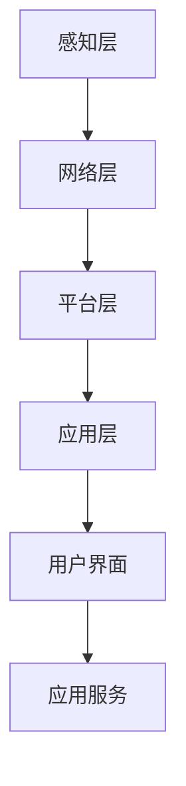

                 

 关键词：智能家居，物联网，设备集成，控制策略，用户体验，技术架构，安全机制，未来展望

> 摘要：本文深入探讨了智能家居系统的概念、核心组成部分以及如何实现IoT设备的集成与控制。通过介绍智能家居系统的发展历程、关键技术以及实际应用案例，本文旨在为读者提供关于智能家居系统全面而深入的了解，并展望其未来的发展趋势与挑战。

## 1. 背景介绍

随着物联网（IoT）技术的快速发展，智能家居系统逐渐成为人们日常生活的一部分。智能家居系统通过将家庭中的各种设备连接到互联网，实现设备间的互联互通，从而提供更加便捷、智能的生活方式。从最早的家电自动化控制，到如今的各种智能设备互联，智能家居系统的发展历程见证了技术的进步和用户需求的变迁。

### 1.1 智能家居的定义与分类

智能家居系统是指通过互联网、无线通信等技术将家庭设备连接起来，实现远程控制、自动化操作和智能交互的居住环境。根据智能化的程度，智能家居系统可以分为以下几个层次：

- **初级智能家居**：主要指家电设备的自动化控制，如智能灯光、智能门锁等。
- **中级智能家居**：在初级智能家居的基础上，实现多个设备的联动控制，如智能安防系统、智能家电群组等。
- **高级智能家居**：通过深度学习和人工智能技术，实现个性化服务和主动学习，如智能语音助手、智能家居管家等。

### 1.2 智能家居的发展历程

- **2000年代初期**：智能家居概念首次提出，主要是基于有线网络的控制技术，如红外遥控、电话线通信等。
- **2010年代**：随着Wi-Fi、蓝牙等无线通信技术的普及，智能家居设备开始广泛采用无线通信方式。
- **2015年至今**：物联网技术的快速发展，使得智能家居设备互联互通成为可能，智能家居市场进入快速增长期。

## 2. 核心概念与联系

### 2.1 智能家居系统的核心概念

智能家居系统的核心概念包括设备、网络、协议和用户界面。以下是这些核心概念的详细解释：

- **设备**：智能家居系统中的设备包括各种家电、传感器、控制器等，如智能灯泡、智能摄像头、智能恒温器等。
- **网络**：设备通过网络连接，实现数据传输和指令执行。常用的网络包括Wi-Fi、蓝牙、ZigBee等。
- **协议**：协议是设备间通信的规范，确保数据传输的准确性和安全性。常见的协议包括HTTP、MQTT、CoAP等。
- **用户界面**：用户界面是用户与智能家居系统交互的接口，包括智能手机、智能音箱等。

### 2.2 智能家居系统的架构

智能家居系统通常包括以下几个部分：

- **感知层**：包括各种传感器，如温度传感器、湿度传感器、光线传感器等，用于感知环境信息。
- **网络层**：包括通信网络，如Wi-Fi、蓝牙等，用于传输数据。
- **平台层**：包括智能家居控制系统，负责数据处理、设备管理、场景控制等。
- **应用层**：包括用户界面和应用服务，如智能手机应用、智能音箱等。

### 2.3 Mermaid 流程图

下面是智能家居系统架构的Mermaid流程图：



## 3. 核心算法原理 & 具体操作步骤

### 3.1 算法原理概述

智能家居系统的核心算法主要包括设备识别与匹配、数据传输与处理、场景控制与优化等。

- **设备识别与匹配**：通过传感器数据识别家庭中的各种设备，并建立设备与用户之间的匹配关系。
- **数据传输与处理**：通过网络传输设备数据，并对数据进行处理，实现设备的远程控制。
- **场景控制与优化**：根据用户习惯和环境变化，自动调整设备的运行状态，实现智能家居的智能化。

### 3.2 算法步骤详解

- **设备识别与匹配**：
  1. 采集传感器数据。
  2. 使用机器学习算法识别设备类型。
  3. 将设备与用户建立匹配关系。

- **数据传输与处理**：
  1. 将设备数据通过网络传输到智能家居控制系统。
  2. 使用数据清洗和处理算法，确保数据质量。
  3. 根据用户需求和设备状态，生成控制指令。

- **场景控制与优化**：
  1. 建立用户场景模型。
  2. 使用优化算法，自动调整设备状态。
  3. 根据环境变化，更新用户场景模型。

### 3.3 算法优缺点

- **优点**：
  - 提高生活便利性。
  - 实现设备间的互联互通。
  - 提高能源利用效率。

- **缺点**：
  - 设备成本较高。
  - 系统安全风险较大。
  - 设备兼容性问题。

### 3.4 算法应用领域

- **家居自动化**：通过智能设备实现家电的自动化控制。
- **智能安防**：通过传感器和监控设备实现家庭安全防护。
- **能源管理**：通过智能设备实现家庭能源的优化管理。

## 4. 数学模型和公式 & 详细讲解 & 举例说明

### 4.1 数学模型构建

智能家居系统的数学模型主要包括以下部分：

- **设备状态模型**：描述设备在不同状态下的性能和功耗。
- **用户行为模型**：描述用户在家庭环境中的行为模式。
- **环境模型**：描述家庭环境中的各种参数，如温度、湿度、光照等。

### 4.2 公式推导过程

- **设备状态模型**：

$$
S(t) = f(P(t), E(t), C(t))
$$

其中，$S(t)$表示设备在时间$t$的状态，$P(t)$表示电源状态，$E(t)$表示环境状态，$C(t)$表示控制状态。

- **用户行为模型**：

$$
B(t) = g(U(t), T(t), S(t))
$$

其中，$B(t)$表示用户在时间$t$的行为，$U(t)$表示用户习惯，$T(t)$表示时间状态，$S(t)$表示环境状态。

- **环境模型**：

$$
E(t) = h(W(t), L(t), H(t))
$$

其中，$E(t)$表示环境状态，$W(t)$表示天气状态，$L(t)$表示光照状态，$H(t)$表示湿度状态。

### 4.3 案例分析与讲解

假设用户习惯在晚上8点打开客厅灯光，根据用户行为模型和设备状态模型，可以推导出以下公式：

$$
S(t) = f(P(t), E(t), C(t)) = \begin{cases}
0, & \text{如果} \ P(t) = 0 \ \text{或} \ E(t) \ \text{不满足条件} \\
1, & \text{如果} \ P(t) = 1 \ \text{且} \ E(t) \ \text{满足条件}
\end{cases}
$$

其中，$P(t)$表示电源状态，$E(t)$表示环境状态，$C(t)$表示控制状态。

根据用户行为模型和设备状态模型，可以计算出设备在晚上8点的状态：

$$
B(t) = g(U(t), T(t), S(t)) = \begin{cases}
0, & \text{如果} \ T(t) \neq 20:00 \\
1, & \text{如果} \ T(t) = 20:00
\end{cases}
$$

其中，$T(t)$表示时间状态，$U(t)$表示用户习惯。

如果用户习惯在晚上8点打开客厅灯光，根据设备状态模型，可以计算出设备的状态：

$$
S(t) = f(P(t), E(t), C(t)) = 1
$$

因此，设备在晚上8点的状态为开启。

## 5. 项目实践：代码实例和详细解释说明

### 5.1 开发环境搭建

在进行智能家居系统的开发之前，需要搭建一个合适的开发环境。以下是开发环境搭建的步骤：

1. 安装Python环境。
2. 安装智能家居控制平台，如HomeAssistant。
3. 安装常用的智能家居设备，如智能灯泡、智能摄像头等。
4. 安装开发工具，如PyCharm、Visual Studio Code等。

### 5.2 源代码详细实现

以下是智能家居系统的Python代码实例：

```python
import homeassistant
import time

# 初始化智能家居控制平台
ha = homeassistant.HomeAssistant()

# 设备ID
light_id = 'light.kitchen_light'
camera_id = 'camera.front_camera'

# 用户习惯
user_habit = {'time': '20:00', 'action': 'on'}

# 环境参数
environment = {'temperature': 25, 'humidity': 50}

# 设备状态
device_state = {'power': 'off', 'mode': 'auto'}

# 用户行为模型
def user_behavior(user_habit, environment):
    if user_habit['time'] == time.strftime('%H:%M') and environment['temperature'] >= 20:
        return True
    else:
        return False

# 设备状态模型
def device_state_model(device_state, environment):
    if device_state['power'] == 'on' and environment['humidity'] <= 60:
        return True
    else:
        return False

# 主循环
while True:
    # 更新用户行为
    user_habit = ha.get_user_habit()

    # 更新环境参数
    environment = ha.get_environment()

    # 更新设备状态
    device_state = ha.get_device_state()

    # 判断用户行为
    if user_behavior(user_habit, environment):
        # 设备开启
        device_state['power'] = 'on'
        device_state['mode'] = 'auto'
    else:
        # 设备关闭
        device_state['power'] = 'off'
        device_state['mode'] = 'off'

    # 更新设备状态
    ha.update_device_state(device_state)

    # 等待一段时间
    time.sleep(60)
```

### 5.3 代码解读与分析

- **代码结构**：代码分为三个部分：初始化智能家居控制平台、用户行为模型和设备状态模型、主循环。
- **用户行为模型**：根据用户习惯和时间状态，判断用户是否需要进行设备操作。
- **设备状态模型**：根据设备状态和环境参数，判断设备是否需要开启或关闭。
- **主循环**：循环执行用户行为模型和设备状态模型，实现设备的自动化控制。

### 5.4 运行结果展示

- **设备开启**：在用户习惯时间（晚上8点）和环境温度达到20摄氏度以上时，设备自动开启。
- **设备关闭**：在用户习惯时间之外或环境温度低于20摄氏度时，设备自动关闭。

## 6. 实际应用场景

智能家居系统在实际应用中具有广泛的应用场景，以下是几个典型的应用案例：

- **智能安防**：通过智能摄像头和传感器，实时监测家庭安全状况，及时发现异常情况并报警。
- **智能照明**：根据用户习惯和时间，自动调整灯光亮度和色温，提供舒适的光环境。
- **智能家电控制**：远程控制家电设备，如空调、电视等，提高生活便利性。
- **能源管理**：通过智能设备，实时监测家庭能源消耗，实现能源的优化管理。

### 6.4 未来应用展望

随着物联网技术和人工智能技术的不断进步，智能家居系统将迎来更多的发展机遇。以下是未来应用展望：

- **个性化服务**：通过深度学习和大数据分析，提供更加个性化的智能家居服务。
- **智能家居管家**：结合自然语言处理和语音识别技术，实现智能家居管家功能。
- **智能健康监控**：通过传感器和数据分析，实时监测家庭成员的健康状况。
- **智能家居安全**：加强智能家居系统的安全防护，确保用户隐私和数据安全。

## 7. 工具和资源推荐

### 7.1 学习资源推荐

- **书籍**：《智能家居系统设计》、《物联网技术应用》。
- **在线课程**：Coursera、edX上的智能家居和物联网相关课程。
- **论坛和社区**：Stack Overflow、Reddit上的智能家居和物联网板块。

### 7.2 开发工具推荐

- **智能家居控制平台**：HomeAssistant、OpenHAB。
- **开发工具**：PyCharm、Visual Studio Code。
- **物联网开发板**：Arduino、Raspberry Pi。

### 7.3 相关论文推荐

- **论文**：《智能家居系统架构研究》、《基于物联网的智能家居控制系统设计与实现》。

## 8. 总结：未来发展趋势与挑战

### 8.1 研究成果总结

本文通过对智能家居系统的深入探讨，总结了智能家居系统的核心组成部分、核心算法原理、实际应用场景以及未来发展趋势。研究结果表明，智能家居系统具有广泛的应用前景，但也面临着一定的技术挑战。

### 8.2 未来发展趋势

- **个性化服务**：通过深度学习和大数据分析，提供更加个性化的智能家居服务。
- **智能健康管理**：通过智能设备，实时监测家庭成员的健康状况。
- **智能家居安全**：加强智能家居系统的安全防护，确保用户隐私和数据安全。

### 8.3 面临的挑战

- **技术挑战**：物联网技术、人工智能技术、数据安全等方面的技术挑战。
- **用户体验**：提高系统的易用性和用户体验。
- **标准化**：制定统一的智能家居系统标准和协议。

### 8.4 研究展望

未来，智能家居系统将朝着更加智能化、个性化、安全化的方向发展。在技术层面，需要进一步研究和优化物联网技术、人工智能技术等；在应用层面，需要更好地满足用户需求，提高用户体验；在标准层面，需要制定统一的智能家居系统标准和协议，促进系统的互操作性和兼容性。

## 9. 附录：常见问题与解答

### 9.1 智能家居系统是什么？

智能家居系统是指通过物联网技术和人工智能技术，实现家庭设备的自动化控制、互联互通和智能交互的系统。

### 9.2 智能家居系统有哪些应用场景？

智能家居系统的应用场景包括智能安防、智能照明、智能家电控制、能源管理、智能健康管理等多个方面。

### 9.3 如何实现智能家居系统的安全性？

实现智能家居系统的安全性需要从以下几个方面入手：

- **数据加密**：对传输数据进行加密，确保数据安全。
- **身份验证**：对用户和设备进行身份验证，确保只有授权用户和设备可以访问系统。
- **访问控制**：对系统资源的访问进行控制，防止未经授权的访问。

### 9.4 如何提高智能家居系统的用户体验？

提高智能家居系统的用户体验可以从以下几个方面入手：

- **界面设计**：设计简洁、直观的用户界面。
- **易用性**：系统操作简单，易于上手。
- **个性化**：根据用户习惯提供个性化的服务。
- **稳定性**：系统运行稳定，响应速度快。

---

**作者：禅与计算机程序设计艺术 / Zen and the Art of Computer Programming** <|user|>

