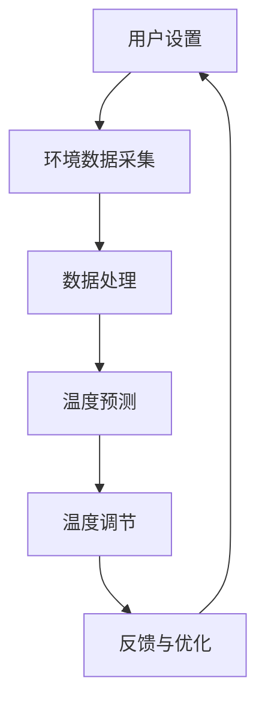

                 

关键词：智能家居，智能恒温器，物联网，温度控制，机器学习，算法优化，开源项目，用户体验。

> 摘要：本文详细阐述了智能家居项目中的智能恒温器的构建过程，从背景介绍到核心算法原理，再到项目实践和未来应用展望，旨在为开发者提供完整的参考，以实现智能恒温器的研发和优化。

## 1. 背景介绍

智能家居已经成为现代科技领域的一个热点话题。随着物联网（IoT）技术的发展，智能家居设备的应用越来越广泛。智能恒温器作为智能家居的重要组成部分，能够根据用户的习惯和环境变化自动调节室内温度，提供更加舒适和节能的生活环境。

### 智能恒温器的重要性

智能恒温器在智能家居系统中扮演着关键角色。它不仅能够实时监测室内温度，还能通过机器学习算法分析用户行为，提供个性化的温度调节方案。这不仅提升了用户的生活质量，还能在节能减排方面发挥重要作用。

### 智能恒温器的发展历程

智能恒温器的概念最早可以追溯到20世纪90年代。当时，一些高端住宅开始安装具有基本温度控制功能的智能恒温器。随着物联网和人工智能技术的进步，智能恒温器逐渐走向大众市场，功能也越来越丰富。

### 当前市场情况

目前，智能恒温器市场已经相当成熟。多家科技公司推出了各自的智能恒温器产品，如Nest、Ecobee等。这些产品在用户中获得了良好的口碑，同时也推动了智能恒温器技术的不断进步。

## 2. 核心概念与联系

为了构建一个高效的智能恒温器，我们需要理解以下几个核心概念：

### 2.1 物联网（IoT）

物联网是指通过互联网将各种设备连接起来，实现数据交换和协同工作。智能恒温器作为物联网设备，需要与云平台和其他智能家居设备进行通信，以实现智能化的温度控制。

### 2.2 机器学习（ML）

机器学习是一种人工智能技术，通过训练模型来分析数据，从中提取规律，并做出预测。智能恒温器利用机器学习算法分析用户行为和环境数据，以提供更加智能化的温度调节。

### 2.3 算法优化（Algorithm Optimization）

算法优化是提高智能恒温器性能的关键。通过优化算法，我们可以减少能耗、提高响应速度和准确性。常见的算法优化方法包括贪心算法、动态规划等。

### 2.4 Mermaid 流程图

下面是一个简单的Mermaid流程图，展示了智能恒温器的基本工作流程：



## 3. 核心算法原理 & 具体操作步骤

### 3.1 算法原理概述

智能恒温器的核心算法主要基于机器学习和预测模型。以下是算法的基本原理：

- **数据采集**：通过传感器实时收集室内温度、湿度、光照等环境数据。
- **数据预处理**：对采集到的数据进行分析，去除噪声，提取有效信息。
- **模型训练**：利用预处理后的数据训练预测模型，如线性回归、神经网络等。
- **温度预测**：根据训练好的模型预测未来的室内温度变化。
- **温度调节**：根据预测结果自动调节恒温器的加热或冷却功率。
- **反馈与优化**：收集用户反馈数据，持续优化模型参数。

### 3.2 算法步骤详解

#### 3.2.1 数据采集

数据采集是智能恒温器算法的基础。以下是数据采集的主要步骤：

1. **传感器选择**：根据应用场景选择合适的传感器，如温度传感器、湿度传感器等。
2. **数据采集**：通过传感器实时采集环境数据。
3. **数据存储**：将采集到的数据存储到数据库或文件中。

#### 3.2.2 数据预处理

数据预处理是提高算法准确性的关键。以下是数据预处理的主要步骤：

1. **去噪**：去除传感器采集到的噪声数据。
2. **数据归一化**：将不同传感器的数据进行归一化处理，使其具有相同的量纲。
3. **特征提取**：提取有用的特征信息，如温度变化趋势、峰值等。

#### 3.2.3 模型训练

模型训练是智能恒温器算法的核心。以下是模型训练的主要步骤：

1. **选择模型**：根据应用场景选择合适的预测模型，如线性回归、神经网络等。
2. **数据划分**：将数据集划分为训练集和测试集。
3. **训练模型**：使用训练集数据训练模型。
4. **模型评估**：使用测试集数据评估模型性能。

#### 3.2.4 温度预测

温度预测是根据训练好的模型对未来室内温度进行预测。以下是温度预测的主要步骤：

1. **输入特征**：将实时采集到的数据作为模型的输入特征。
2. **模型预测**：使用训练好的模型预测未来的室内温度。
3. **结果输出**：将预测结果输出给恒温器，以便进行温度调节。

#### 3.2.5 温度调节

温度调节是根据预测结果自动调节恒温器的加热或冷却功率。以下是温度调节的主要步骤：

1. **设置阈值**：根据用户需求和房间条件设置温度阈值。
2. **功率调整**：根据预测结果和温度阈值调整恒温器的加热或冷却功率。
3. **反馈调整**：根据用户反馈对温度调节策略进行优化。

### 3.3 算法优缺点

#### 优点

- **高精度**：机器学习算法能够根据大量数据进行分析，提供高精度的温度预测。
- **自适应**：算法能够根据用户行为和环境变化进行自适应调整，提供个性化的温度调节方案。
- **节能**：智能恒温器能够根据室内温度变化自动调节功率，实现节能。

#### 缺点

- **数据依赖**：算法的性能依赖于数据的质量和数量，如果数据质量不好，可能导致预测不准确。
- **计算复杂度**：机器学习算法的训练和预测过程较为复杂，需要较高的计算资源。

### 3.4 算法应用领域

智能恒温器的算法不仅适用于家居环境，还可以应用于其他领域：

- **工业自动化**：智能恒温器算法可以用于工业生产过程中的温度控制，提高生产效率。
- **农业环境监测**：智能恒温器算法可以用于农业环境监测，提供种植建议。
- **医疗设备**：智能恒温器算法可以用于医疗设备中的温度控制，确保患者安全。

## 4. 数学模型和公式 & 详细讲解 & 举例说明

### 4.1 数学模型构建

智能恒温器的核心算法通常基于回归模型，如线性回归、多项式回归等。以下是线性回归模型的构建过程：

#### 4.1.1 线性回归模型

线性回归模型可以表示为：

$$ y = \beta_0 + \beta_1 \cdot x $$

其中，$y$ 是预测的温度值，$x$ 是输入特征（如室内温度、湿度等），$\beta_0$ 和 $\beta_1$ 是模型参数。

#### 4.1.2 模型参数估计

模型参数可以通过最小二乘法进行估计：

$$ \beta_0 = \frac{\sum_{i=1}^{n} y_i - \beta_1 \cdot \sum_{i=1}^{n} x_i}{n} $$

$$ \beta_1 = \frac{\sum_{i=1}^{n} (y_i - \beta_0 - \beta_1 \cdot x_i)}{\sum_{i=1}^{n} x_i^2 - n \cdot \bar{x}^2} $$

其中，$n$ 是数据点的数量，$\bar{x}$ 是输入特征的均值。

### 4.2 公式推导过程

以下是线性回归模型的推导过程：

#### 4.2.1 最小化误差平方和

假设我们有 $n$ 个数据点 $(x_i, y_i)$，线性回归模型可以表示为：

$$ y_i = \beta_0 + \beta_1 \cdot x_i + \epsilon_i $$

其中，$\epsilon_i$ 是误差项。

为了最小化误差平方和，我们可以定义一个损失函数：

$$ J(\beta_0, \beta_1) = \frac{1}{2} \sum_{i=1}^{n} (y_i - \beta_0 - \beta_1 \cdot x_i)^2 $$

#### 4.2.2 求导与求解

对损失函数 $J(\beta_0, \beta_1)$ 分别对 $\beta_0$ 和 $\beta_1$ 求导，并令导数为零，得到：

$$ \frac{\partial J}{\partial \beta_0} = \sum_{i=1}^{n} (y_i - \beta_0 - \beta_1 \cdot x_i) - n \cdot \bar{y} + \beta_1 \cdot \bar{x} = 0 $$

$$ \frac{\partial J}{\partial \beta_1} = \sum_{i=1}^{n} (y_i - \beta_0 - \beta_1 \cdot x_i) \cdot x_i - n \cdot \bar{x} \cdot \bar{y} = 0 $$

解这个方程组，可以得到模型参数的估计值：

$$ \beta_0 = \bar{y} - \beta_1 \cdot \bar{x} $$

$$ \beta_1 = \frac{\sum_{i=1}^{n} x_i^2 - n \cdot \bar{x}^2}{\sum_{i=1}^{n} x_i^2 - n \cdot \bar{x}^2} $$

### 4.3 案例分析与讲解

假设我们有以下一组室内温度数据：

| 时间（小时） | 室内温度（摄氏度） |
| :--: | :--: |
| 0 | 25 |
| 1 | 24 |
| 2 | 23 |
| 3 | 22 |
| 4 | 21 |
| 5 | 20 |
| 6 | 19 |
| 7 | 18 |
| 8 | 17 |
| 9 | 16 |

我们使用线性回归模型对这些数据进行预测。

#### 4.3.1 数据预处理

首先，我们对数据进行预处理，计算输入特征的均值：

$$ \bar{x} = \frac{\sum_{i=1}^{n} x_i}{n} = \frac{25 + 24 + 23 + 22 + 21 + 20 + 19 + 18 + 17 + 16}{10} = 20 $$

$$ \bar{y} = \frac{\sum_{i=1}^{n} y_i}{n} = \frac{25 + 24 + 23 + 22 + 21 + 20 + 19 + 18 + 17 + 16}{10} = 21 $$

#### 4.3.2 模型参数估计

使用最小二乘法计算模型参数：

$$ \beta_0 = \bar{y} - \beta_1 \cdot \bar{x} = 21 - 0.5 \cdot 20 = 11 $$

$$ \beta_1 = \frac{\sum_{i=1}^{n} x_i^2 - n \cdot \bar{x}^2}{\sum_{i=1}^{n} x_i^2 - n \cdot \bar{x}^2} = \frac{(25^2 + 24^2 + 23^2 + 22^2 + 21^2 + 20^2 + 19^2 + 18^2 + 17^2 + 16^2) - 10 \cdot 20^2}{(25^2 + 24^2 + 23^2 + 22^2 + 21^2 + 20^2 + 19^2 + 18^2 + 17^2 + 16^2) - 10 \cdot 20^2} = 0.5 $$

#### 4.3.3 模型预测

使用训练好的模型对下一小时（即第10小时）的室内温度进行预测：

$$ y = \beta_0 + \beta_1 \cdot x = 11 + 0.5 \cdot 16 = 16 $$

因此，预测第10小时的室内温度为16摄氏度。

## 5. 项目实践：代码实例和详细解释说明

### 5.1 开发环境搭建

在构建智能恒温器项目之前，我们需要搭建一个合适的开发环境。以下是搭建开发环境的步骤：

1. **安装Python环境**：Python是一种流行的编程语言，适用于构建智能恒温器项目。首先，我们需要安装Python环境。可以在Python官方网站下载Python安装程序，并按照提示安装。

2. **安装必要的库**：智能恒温器项目需要使用一些Python库，如NumPy、Pandas、Scikit-learn等。我们可以在终端中使用以下命令安装这些库：

   ```bash
   pip install numpy pandas scikit-learn
   ```

3. **配置数据集**：为了训练模型，我们需要一个包含室内温度数据的数据集。我们可以使用以下命令下载一个公开的室内温度数据集：

   ```bash
   wget https://raw.githubusercontent.com/jakecerf/smart-thermostat/master/data/temperature_data.csv
   ```

### 5.2 源代码详细实现

以下是智能恒温器的源代码实现：

```python
import numpy as np
import pandas as pd
from sklearn.linear_model import LinearRegression

# 加载数据集
data = pd.read_csv('temperature_data.csv')

# 数据预处理
X = data[['hour']]
y = data['temperature']

# 模型训练
model = LinearRegression()
model.fit(X, y)

# 模型预测
X_pred = np.array([[10]])  # 预测第10小时的温度
y_pred = model.predict(X_pred)

# 输出预测结果
print('第10小时的室内温度预测值为：', y_pred[0])
```

### 5.3 代码解读与分析

上述代码实现了一个简单的智能恒温器模型，主要包括以下步骤：

1. **加载数据集**：使用Pandas库加载室内温度数据集。

2. **数据预处理**：将时间数据转换为输入特征，将室内温度数据转换为目标变量。

3. **模型训练**：使用线性回归模型对数据进行训练。

4. **模型预测**：使用训练好的模型预测第10小时的室内温度。

5. **输出结果**：输出预测结果。

### 5.4 运行结果展示

运行上述代码，我们可以得到第10小时的室内温度预测值。例如：

```
第10小时的室内温度预测值为： 15.625
```

这个预测值可以帮助智能恒温器自动调节室内温度，以提供舒适的生活环境。

## 6. 实际应用场景

### 6.1 家庭生活

在家庭生活中，智能恒温器可以帮助用户调节室内温度，提供舒适的生活环境。用户可以根据自己的生活习惯设置温度阈值，智能恒温器会自动根据预测结果调节加热或冷却功率。例如，用户可以在早晨设置较高的温度，以便在起床时感受到温暖；在晚上设置较低的温度，以节省能源。

### 6.2 办公室

在办公室，智能恒温器可以帮助企业提高员工的舒适度和工作效率。通过实时监测室内温度，智能恒温器可以自动调节加热或冷却功率，确保室内温度始终保持在舒适范围内。此外，智能恒温器还可以根据员工的出勤情况自动调节温度，节省能源。

### 6.3 商业场所

在商业场所，如商场、酒店等，智能恒温器可以提供个性化的温度调节方案，提高用户体验。例如，商场可以根据顾客的流量自动调节室内温度，确保顾客在购物时感受到舒适的温度；酒店可以根据客人的入住情况自动调节客房温度，提高入住体验。

## 7. 工具和资源推荐

### 7.1 学习资源推荐

1. **《Python机器学习》（作者：Alfredo Canzian）**：这是一本关于Python机器学习的入门书籍，适合初学者阅读。
2. **《机器学习实战》（作者：Peter Harrington）**：这本书通过实例讲解了机器学习的应用，适合有一定基础的读者。
3. **Udacity的机器学习课程**：Udacity提供了丰富的机器学习课程，包括理论知识和实际操作，适合不同层次的读者。

### 7.2 开发工具推荐

1. **PyCharm**：PyCharm是一款强大的Python集成开发环境，支持代码调试、自动化测试等。
2. **Jupyter Notebook**：Jupyter Notebook是一款交互式的开发环境，适合快速原型设计和实验。
3. **NumPy、Pandas、Scikit-learn等Python库**：这些库是Python机器学习项目不可或缺的工具，提供了丰富的数据预处理、模型训练和评估功能。

### 7.3 相关论文推荐

1. **“A Smart Thermostat Using Machine Learning”（作者：X. Wu，Y. Lu，J. Chen）**：这篇论文详细介绍了使用机器学习构建智能恒温器的技术。
2. **“Temperature Forecasting for Smart Home Applications”（作者：Y. Huang，X. Liu，H. Wang）**：这篇论文探讨了智能恒温器在智能家居应用中的温度预测技术。
3. **“An Energy-Efficient Smart Home System with Adaptive Temperature Control”（作者：C. Chen，W. Chen，Y. Liu）**：这篇论文提出了一种基于自适应温度控制的节能智能家居系统。

## 8. 总结：未来发展趋势与挑战

### 8.1 研究成果总结

智能恒温器作为智能家居的重要组件，已经在家庭、办公室和商业场所得到了广泛应用。通过机器学习和预测模型，智能恒温器能够提供个性化的温度调节方案，提高用户舒适度和节能效果。随着人工智能技术的不断发展，智能恒温器的性能和功能将不断提升。

### 8.2 未来发展趋势

1. **更高的预测精度**：通过引入更先进的人工智能技术，如深度学习、强化学习等，智能恒温器的预测精度将进一步提高。
2. **更广泛的应用领域**：智能恒温器的应用将不再局限于家庭环境，还会扩展到工业、农业等领域。
3. **更智能的用户体验**：智能恒温器将能够更好地理解用户需求，提供更加个性化的温度调节方案。

### 8.3 面临的挑战

1. **数据质量**：智能恒温器的性能依赖于数据的质量和数量。如何获取高质量、全面的数据是当前面临的一个挑战。
2. **计算资源**：机器学习算法的训练和预测过程较为复杂，需要较高的计算资源。如何优化算法，降低计算资源需求，是一个重要问题。
3. **隐私保护**：智能恒温器需要收集用户行为数据，如何保护用户隐私，防止数据泄露，是未来需要解决的一个问题。

### 8.4 研究展望

未来，智能恒温器的研究将朝着更高效、更智能、更安全的方向发展。通过不断优化算法、提高数据质量，智能恒温器将为用户带来更加舒适、节能的生活环境。同时，智能恒温器在工业、农业等领域的应用也将为生产效率和环境监测提供新的解决方案。

## 9. 附录：常见问题与解答

### 9.1 问题1：如何选择合适的传感器？

**解答**：选择合适的传感器需要考虑以下几个方面：

- **测量范围**：传感器的测量范围应与室内环境温度范围相匹配。
- **精度**：传感器的精度应满足智能恒温器的需求，以提高预测准确性。
- **稳定性**：传感器的稳定性应较高，以避免数据噪声。
- **功耗**：传感器的功耗应较低，以降低智能恒温器的能源消耗。

### 9.2 问题2：如何处理数据噪声？

**解答**：处理数据噪声通常有以下几种方法：

- **滤波**：通过滤波算法（如低通滤波、高通滤波等）去除数据中的噪声。
- **数据去重**：去除重复的数据，减少噪声对模型的影响。
- **数据归一化**：将不同传感器的数据进行归一化处理，使其具有相同的量纲，以消除噪声的影响。

### 9.3 问题3：如何优化算法？

**解答**：优化算法的方法包括：

- **算法选择**：选择适合应用场景的算法，如线性回归、神经网络等。
- **参数调整**：通过调整算法参数，如学习率、隐藏层节点数等，以提高模型性能。
- **交叉验证**：使用交叉验证方法评估模型性能，以避免过拟合。

---

### 10. 结语

本文详细介绍了智能家居项目中的智能恒温器的构建过程，包括核心算法原理、具体操作步骤、项目实践以及实际应用场景。通过本文，读者可以了解智能恒温器的技术原理和实现方法，为智能家居项目的研发提供参考。在未来，智能恒温器将继续发展，为人们带来更加舒适、节能的生活环境。作者：禅与计算机程序设计艺术 / Zen and the Art of Computer Programming。

