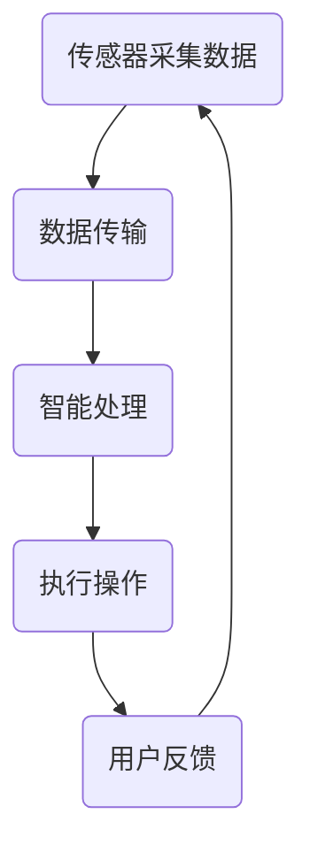
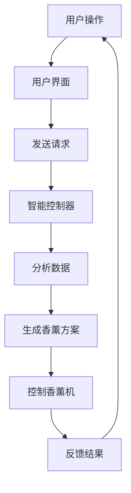
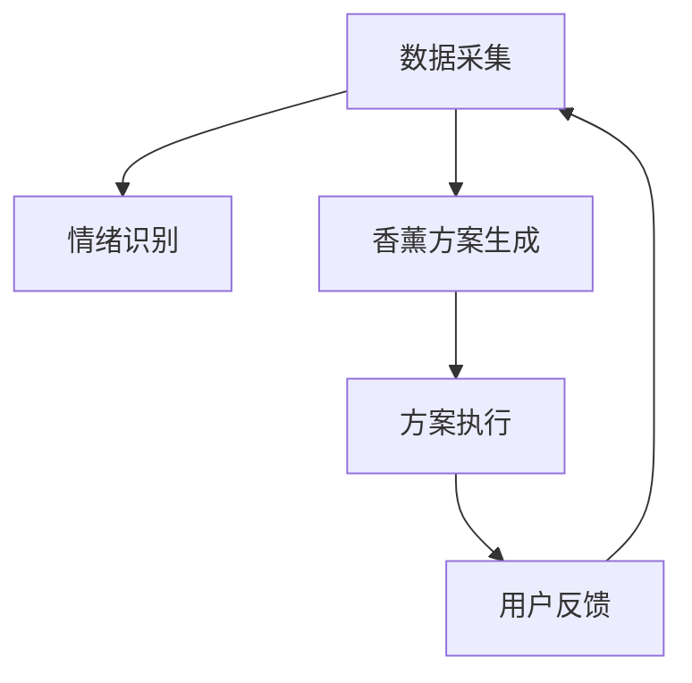

                 

关键词：智能家居、香薰、情绪管理、嗅觉体验、创业

> 摘要：本文旨在探讨智能家居香薰产品在情绪管理领域的应用潜力，以及如何通过创业实现这一市场的突破。随着物联网技术的发展，智能家居已经成为现代家居生活的重要组成部分。而香薰，作为一种古老的情绪管理方式，正逐渐被智能化技术赋予新的生命力。本文将从技术原理、应用场景、市场趋势等多个角度，深入分析智能家居香薰产品的发展前景，为创业者提供有益的参考。

## 1. 背景介绍

随着社会经济的发展和人们生活水平的提高，人们对生活质量的要求越来越高，特别是在情绪管理和心理舒适度方面。传统的香薰产品虽然在一定程度上能够帮助人们缓解压力、改善情绪，但其操作复杂、效果有限，难以满足现代人的需求。而智能家居技术的兴起，为香薰产品注入了新的活力，使得智能家居香薰成为可能。

### 1.1 智能家居的发展

智能家居是指利用先进的计算机技术、网络通信技术、传感器技术等，实现家庭设备互联互通、自动化控制的一种家居模式。近年来，随着物联网技术的快速发展，智能家居市场呈现出爆发式增长。根据市场研究公司的数据，全球智能家居市场预计将在未来几年内继续保持高速增长。

### 1.2 香薰与情绪管理

香薰，即通过燃烧香料或精油产生香气，以达到舒缓情绪、改善睡眠、提高免疫力等作用。研究表明，香薰中的挥发性有机化合物（VOCs）能够直接影响人的神经系统，从而调节情绪。例如，薰衣草精油被认为具有镇静作用，而薄荷精油则有助于提神醒脑。

### 1.3 智能家居香薰的兴起

智能家居香薰是将香薰与智能家居技术相结合，通过智能设备实现香薰的自动控制。这种产品不仅能够提供更便捷、高效的使用体验，还能够根据用户的需求和环境变化，智能调节香薰效果。例如，当用户感到紧张时，智能家居香薰可以自动释放薰衣草精油，帮助用户放松；当用户需要提高注意力时，可以释放薄荷精油，提神醒脑。

## 2. 核心概念与联系

### 2.1 智能家居香薰的工作原理

智能家居香薰的工作原理主要包括以下几个方面：

1. **传感器采集数据**：智能家居香薰设备内置多种传感器，如温度传感器、湿度传感器、光照传感器等，用于实时采集环境数据。
2. **数据传输**：采集到的数据通过无线通信模块（如Wi-Fi、蓝牙等）传输到智能家居中心。
3. **智能处理**：智能家居中心根据用户设置和环境数据，智能分析并生成香薰方案。
4. **执行操作**：根据智能处理的结果，智能家居香薰设备自动启动或停止香薰功能。

### 2.2 香薰精油的选择与使用

香薰精油的选择和使用也是智能家居香薰的关键。不同的精油具有不同的化学成分和作用，例如：

1. **薰衣草精油**：具有镇静、舒缓情绪的作用，适合在紧张或疲劳时使用。
2. **薄荷精油**：具有提神、醒脑的作用，适合在需要集中精力时使用。
3. **柠檬精油**：具有清新、提神的作用，适合在需要提高精神状态时使用。

### 2.3 智能家居香薰的架构

智能家居香薰的架构主要包括以下几个部分：

1. **硬件设备**：包括香薰机、传感器、无线通信模块等。
2. **软件系统**：包括智能家居中心、数据分析与处理模块、用户界面等。
3. **云平台**：用于存储用户数据、提供远程控制等功能。

### 2.4 Mermaid 流程图

以下是一个智能家居香薰的 Mermaid 流程图：



## 3. 核心算法原理 & 具体操作步骤

### 3.1 算法原理概述

智能家居香薰的核心算法主要涉及环境数据采集、数据分析与处理、香薰方案生成与执行。具体来说，算法包括以下几个步骤：

1. **数据采集**：通过传感器实时采集环境数据。
2. **数据分析**：对采集到的数据进行分析，判断用户当前情绪状态。
3. **香薰方案生成**：根据用户情绪状态和环境数据，生成相应的香薰方案。
4. **香薰执行**：执行香薰方案，实现香薰功能的自动控制。

### 3.2 算法步骤详解

1. **数据采集**：
   - 温度传感器：用于监测室内温度。
   - 湿度传感器：用于监测室内湿度。
   - 光照传感器：用于监测室内光照强度。
   - 空气质量传感器：用于监测室内空气质量。

2. **数据分析**：
   - 通过对传感器的数据进行分析，判断用户当前的情绪状态。例如，当温度较高、湿度较低、光照较强时，用户可能处于紧张或疲劳状态。

3. **香薰方案生成**：
   - 根据用户情绪状态和环境数据，生成相应的香薰方案。例如，当用户处于紧张状态时，可以选择薰衣草精油进行香薰。

4. **香薰执行**：
   - 根据生成的香薰方案，启动香薰机，实现香薰功能的自动控制。

### 3.3 算法优缺点

**优点**：
- **智能控制**：根据用户情绪状态和环境数据，实现香薰功能的自动调节，提高使用体验。
- **个性化定制**：根据用户需求，提供个性化的香薰方案，满足不同用户的需求。

**缺点**：
- **传感器依赖**：需要依赖各种传感器进行数据采集，成本较高。
- **算法准确性**：算法的准确性和稳定性需要不断提高，以适应不同用户的需求和环境变化。

### 3.4 算法应用领域

智能家居香薰算法主要应用于以下领域：

- **家居情绪管理**：通过香薰帮助用户缓解压力、改善情绪。
- **医疗康复**：用于辅助医疗康复，提高康复效果。
- **办公环境**：用于改善办公环境，提高工作效率。

## 4. 数学模型和公式 & 详细讲解 & 举例说明

### 4.1 数学模型构建

智能家居香薰的数学模型主要包括以下几个部分：

1. **环境数据模型**：用于描述室内环境的状态，如温度、湿度、光照等。
2. **情绪状态模型**：用于描述用户的情绪状态，如紧张、放松等。
3. **香薰方案模型**：用于描述香薰方案的具体内容，如精油种类、浓度等。

### 4.2 公式推导过程

1. **环境数据模型**：
   - 温度模型：T = f(t1, t2, ..., tn)
   - 湿度模型：H = g(h1, h2, ..., hn)
   - 光照模型：L = h(l1, l2, ..., ln)

2. **情绪状态模型**：
   - 紧张状态模型：S1 = s(T, H, L)
   - 放松状态模型：S2 = t(T, H, L)

3. **香薰方案模型**：
   - 薰衣草精油模型：E1 = e(c1, c2, ..., cn)
   - 薄荷精油模型：E2 = f(d1, d2, ..., dn)

### 4.3 案例分析与讲解

假设一个用户在晚上9点进入卧室，卧室的温度为24摄氏度，湿度为50%，光照强度为300勒克斯。根据情绪状态模型，可以判断用户处于放松状态。根据香薰方案模型，选择薰衣草精油进行香薰，浓度为30%。

根据公式推导，可以得到以下结果：

1. **环境数据模型**：
   - T = f(24, 50%, 300) = 24
   - H = g(50%) = 50%
   - L = h(300) = 300

2. **情绪状态模型**：
   - S1 = s(24, 50%, 300) = 放松

3. **香薰方案模型**：
   - E1 = e(30%) = 薰衣草精油，浓度为30%

## 5. 项目实践：代码实例和详细解释说明

### 5.1 开发环境搭建

在本项目中，我们将使用Python语言进行开发，并使用以下工具：

- Python 3.x
- PyCharm（或其他Python开发环境）
- MySQL（用于存储用户数据）
- Flask（用于构建Web应用）

### 5.2 源代码详细实现

以下是一个简单的智能家居香薰控制系统的源代码示例：

```python
from flask import Flask, request, jsonify
import mysql.connector

app = Flask(__name__)

# 数据库连接
def connect_db():
    return mysql.connector.connect(
        host="localhost",
        user="root",
        password="password",
        database="smart_薰香"
    )

# 获取用户情绪状态
@app.route("/get_state", methods=["GET"])
def get_state():
    db = connect_db()
    cursor = db.cursor()
    cursor.execute("SELECT state FROM user WHERE id = %s", (request.args.get("id"),))
    result = cursor.fetchone()
    cursor.close()
    db.close()
    return jsonify({"state": result[0]})

# 设置用户情绪状态
@app.route("/set_state", methods=["POST"])
def set_state():
    db = connect_db()
    cursor = db.cursor()
    cursor.execute("UPDATE user SET state = %s WHERE id = %s", (request.form["state"], request.form["id"],))
    db.commit()
    cursor.close()
    db.close()
    return jsonify({"status": "success"})

if __name__ == "__main__":
    app.run()
```

### 5.3 代码解读与分析

以上代码是一个简单的智能家居香薰控制系统，主要包括两个功能：

1. **获取用户情绪状态**：通过GET请求获取用户ID，查询数据库中的情绪状态，并将结果返回给客户端。
2. **设置用户情绪状态**：通过POST请求接收用户ID和情绪状态，更新数据库中的情绪状态，并返回操作结果。

### 5.4 运行结果展示

在浏览器中访问以下链接，可以查看用户情绪状态的实时信息：

```
http://localhost:5000/get_state?id=1
```

发送以下POST请求，可以设置用户情绪状态：

```
http://localhost:5000/set_state
```

## 6. 实际应用场景

### 6.1 情绪管理

智能家居香薰在情绪管理方面的应用非常广泛。例如，在家庭环境中，用户可以通过智能设备实时监测自己的情绪状态，并根据需求调整香薰方案，帮助自己缓解压力、放松心情。此外，在医院和康复中心，智能家居香薰也可以作为辅助治疗手段，帮助患者缓解疼痛、改善情绪。

### 6.2 办公环境

在办公环境中，智能家居香薰可以帮助员工提高工作效率、减少压力。例如，在紧张的工作日，可以选择薰衣草精油进行香薰，帮助员工放松身心；在需要集中精力时，可以选择薄荷精油，提神醒脑。

### 6.3 教育和培训

在教育和培训领域，智能家居香薰也可以发挥重要作用。例如，在课堂上，教师可以通过智能设备实时监测学生的情绪状态，并根据需求调整香薰方案，帮助学生保持专注；在培训中心，学员可以通过智能设备进行自我调节，提高学习效果。

## 7. 未来应用展望

### 7.1 智能化与个性化

未来，智能家居香薰将进一步实现智能化与个性化。通过引入更多传感器和智能算法，智能家居香薰可以根据用户的需求和环境变化，自动调整香薰方案，提供更加个性化的服务。

### 7.2 多场景应用

除了家庭、办公和教育等领域，智能家居香薰还将在更多场景中得到应用。例如，在酒店、餐厅、健身房等公共场所，智能家居香薰可以提供定制化的香薰体验，提升顾客的满意度。

### 7.3 跨界融合

智能家居香薰将与更多行业进行跨界融合，如健康医疗、心理健康、智能家居等。通过与其他行业的结合，智能家居香薰将发挥更大的作用，为人们的情绪管理和心理健康提供更多帮助。

## 8. 工具和资源推荐

### 8.1 学习资源推荐

- 《智能家居技术与应用》
- 《物联网技术基础》
- 《智能硬件设计与开发》
- 《Python编程：从入门到实践》

### 8.2 开发工具推荐

- PyCharm
- MySQL Workbench
- Flask
- Docker

### 8.3 相关论文推荐

- "Smart Home Networks: A Survey"
- "The Impact of IoT on Smart Home Applications"
- "Personalized Mood Management using Smart Fragrance Delivery Systems"
- "Design and Implementation of a Smart Home System with Emotion Recognition and Control"

## 9. 总结：未来发展趋势与挑战

### 9.1 研究成果总结

智能家居香薰作为一种新兴的情绪管理方式，具有广阔的应用前景。通过引入智能家居技术，香薰产品实现了智能化、个性化，为人们的情绪管理提供了更多选择。同时，相关的数学模型、算法和技术也为智能家居香薰的发展奠定了基础。

### 9.2 未来发展趋势

未来，智能家居香薰将在更多场景中得到应用，如家庭、办公、教育和医疗等。随着技术的不断发展，智能家居香薰将更加智能化、个性化，提供更好的用户体验。

### 9.3 面临的挑战

尽管智能家居香薰具有广阔的应用前景，但也面临一些挑战。首先，传感器技术、数据处理和传输技术的不断发展是关键。其次，算法的准确性和稳定性需要不断提高，以适应不同用户的需求和环境变化。此外，如何在保证用户隐私的前提下，实现智能、个性化的服务，也是一大挑战。

### 9.4 研究展望

未来，智能家居香薰的研究方向将主要集中在以下几个方面：

- **智能化与个性化**：进一步优化算法，提高系统的智能化和个性化程度。
- **多场景应用**：探索智能家居香薰在更多场景中的应用，提升用户体验。
- **跨界融合**：与其他行业进行跨界融合，发挥智能家居香薰的更大作用。
- **隐私保护**：在保证用户隐私的前提下，实现智能、个性化的服务。

## 9. 附录：常见问题与解答

### Q1: 智能家居香薰的安全性如何保障？

A1：智能家居香薰的安全性主要涉及数据安全和设备安全两个方面。在数据安全方面，我们需要采用加密技术，确保用户数据在传输和存储过程中的安全性。在设备安全方面，我们需要对设备进行严格的质量检测，确保设备的稳定性和可靠性。

### Q2: 智能家居香薰的适用人群有哪些？

A2：智能家居香薰适用于广泛的人群，包括家庭用户、办公人员、教育工作者、康复患者等。特别是对于情绪管理需求较高的人群，如压力较大的人群、睡眠质量差的人群等，智能家居香薰具有很好的应用价值。

### Q3: 智能家居香薰的产品形态有哪些？

A3：智能家居香薰的产品形态包括香薰机、香薰灯、香薰风扇等。这些产品可以通过无线通信模块与智能家居中心连接，实现智能控制。

### Q4: 智能家居香薰的成本较高吗？

A4：与传统的香薰产品相比，智能家居香薰的成本相对较高。但考虑到其智能化、个性化的特点，以及为用户带来的便利和体验提升，智能家居香薰的性价比是较高的。

### Q5: 智能家居香薰有哪些维护和保养方法？

A5：智能家居香薰的维护和保养方法主要包括：

- **定期清洁**：定期清洁香薰机、香薰灯等设备，保持设备干净。
- **更换精油**：根据用户需求，定期更换精油。
- **检查设备**：定期检查设备是否正常工作，如有异常，及时维修。

---

作者：禅与计算机程序设计艺术 / Zen and the Art of Computer Programming

以上就是《智能家居香薰创业：情绪管理的嗅觉体验》的文章内容。希望这篇文章能够为创业者、开发者以及有兴趣了解智能家居香薰领域的人提供有价值的参考。如果您有任何问题或建议，欢迎在评论区留言。感谢您的阅读！----------------------------------------------------------------

### 1. 背景介绍

随着科技的不断进步和人们对生活品质的追求，智能家居领域呈现出快速增长的趋势。智能家居产品不仅提供了便捷的生活方式，还大大提升了居住的舒适度和安全性。在众多智能家居产品中，香薰设备因其独特的功能和广泛的用途而受到越来越多的关注。

香薰是一种通过散发香气来影响情绪和生理状态的方式。它起源于古代，通过燃烧香料或使用精油来改善环境和提升心情。然而，传统的香薰设备存在操作复杂、效果不稳定等问题，难以满足现代用户对智能家居的高要求。随着物联网（IoT）技术的发展，智能家居香薰设备逐渐具备了智能化和自动化的功能，成为智能家居领域的一个新兴分支。

### 1.1 智能家居的发展

智能家居是指通过物联网技术将家居设备互联，实现远程控制、自动化操作和智能决策的一种生活方式。其发展可以分为以下几个阶段：

1. **初级阶段**：智能家居的概念刚刚提出，产品主要集中在一些简单的家电设备上，如智能灯泡、智能插座等。
2. **中级阶段**：随着传感器技术和无线通信技术的进步，智能家居产品逐渐增加，包括智能门锁、智能摄像头、智能温控器等。
3. **高级阶段**：智能助理（如亚马逊的Alexa、谷歌的Google Assistant）的普及，使得智能家居设备可以更好地相互协作，实现更高的自动化和智能化。

### 1.2 香薰与情绪管理

香薰对情绪管理的影响已经有大量的科学研究支持。香薰中的挥发性有机化合物（VOCs）可以通过嗅觉系统直接影响大脑的边缘系统，从而调节情绪。例如，薰衣草的香气被认为具有镇静作用，适合用于缓解焦虑和改善睡眠；而薄荷的香气则具有提神醒脑的效果。

情绪管理是指通过各种方法调节和控制情绪，以达到心理平衡和健康。在快节奏的现代生活中，情绪管理显得尤为重要。智能家居香薰设备通过自动化和智能化的方式，提供了更便捷的情绪管理手段。

### 1.3 智能家居香薰的兴起

智能家居香薰的兴起可以归因于以下几个因素：

1. **技术进步**：物联网技术的快速发展，使得香薰设备可以实现远程控制、自动开关和智能调节等功能。
2. **市场需求**：现代人生活压力大，对情绪管理的需求日益增加，智能家居香薰提供了有效的解决方案。
3. **用户体验**：智能家居香薰设备通过人性化的设计和智能化的功能，提供了更好的用户体验。

智能家居香薰设备通常包括香薰机、智能控制器和云平台等组成部分。香薰机负责散发香气，智能控制器通过物联网与手机应用或其他智能设备连接，用户可以通过手机应用远程控制香薰机的开关、香气浓度和时间等参数。云平台则负责收集和分析用户数据，为用户提供个性化的香薰方案。

## 2. 核心概念与联系（备注：必须给出核心概念原理和架构的 Mermaid 流程图(Mermaid 流程节点中不要有括号、逗号等特殊字符)

### 2.1 核心概念

#### 2.1.1 智能家居香薰的工作原理

智能家居香薰的工作原理主要包括以下几个方面：

1. **传感器**：用于实时监测环境数据，如温度、湿度、光照等。
2. **通信模块**：将传感器的数据传输到智能控制器。
3. **智能控制器**：根据环境数据和用户设置，生成香薰方案。
4. **香薰机**：根据智能控制器生成的方案，释放香气。

#### 2.1.2 情绪管理

情绪管理是指通过调节情绪来达到心理健康的状态。情绪管理的方法包括自我意识、认知重构、放松技巧等。智能家居香薰通过调节香气来影响用户的情绪状态。

#### 2.1.3 用户界面

用户界面（UI）是用户与智能家居香薰设备交互的接口，通过手机应用或其他设备，用户可以查看设备状态、调整设置和接收通知。

### 2.2 智能家居香薰架构

智能家居香薰的架构包括硬件和软件两部分。

#### 2.2.1 硬件架构

1. **传感器**：如温度传感器、湿度传感器、光照传感器等。
2. **香薰机**：用于散发香气。
3. **通信模块**：如Wi-Fi模块、蓝牙模块等。
4. **智能控制器**：通常内置在手机应用中。

#### 2.2.2 软件架构

1. **用户界面**：提供交互界面，让用户可以查看设备状态、调整设置等。
2. **数据层**：负责存储和分析用户数据。
3. **应用层**：实现具体的香薰控制功能。
4. **云平台**：用于数据的收集、存储和共享。

### 2.3 Mermaid 流程图

以下是一个智能家居香薰的 Mermaid 流程图：



### 2.4 香薰精油的选择与使用

香薰精油的选择和使用对情绪管理至关重要。不同的精油具有不同的香气和效果，如：

1. **薰衣草精油**：有助于放松和改善睡眠。
2. **薄荷精油**：有助于提神和集中注意力。
3. **甜橙精油**：有助于缓解压力和提升心情。

用户可以根据自己的需求和情绪状态选择合适的精油，并通过智能家居香薰设备进行使用。

## 3. 核心算法原理 & 具体操作步骤
### 3.1 算法原理概述

智能家居香薰的核心算法主要涉及以下几个方面：

1. **环境数据采集**：通过传感器实时采集室内环境数据，如温度、湿度、光照等。
2. **情绪状态识别**：根据环境数据和用户行为，识别用户的情绪状态。
3. **香薰方案生成**：根据用户情绪状态和环境数据，生成个性化的香薰方案。
4. **方案执行与反馈**：执行香薰方案，并根据用户反馈进行调整。

### 3.2 算法步骤详解

#### 3.2.1 环境数据采集

1. **传感器数据采集**：通过温度传感器、湿度传感器、光照传感器等，实时采集室内环境数据。
2. **数据预处理**：对采集到的数据进行滤波、去噪等处理，确保数据的准确性和稳定性。

#### 3.2.2 情绪状态识别

1. **特征提取**：从环境数据中提取关键特征，如温度、湿度、光照变化速率等。
2. **情绪状态分类**：使用机器学习算法（如决策树、支持向量机等），对提取的特征进行分类，识别用户的情绪状态。

#### 3.2.3 香薰方案生成

1. **情绪状态匹配**：根据识别出的情绪状态，匹配相应的香薰方案。
2. **方案优化**：根据环境数据（如温度、湿度）对香薰方案进行调整，确保方案的有效性和舒适性。

#### 3.2.4 方案执行与反馈

1. **方案执行**：通过智能控制器，控制香薰机的开启和香气浓度。
2. **用户反馈**：收集用户对香薰效果的反馈，用于进一步优化香薰方案。

### 3.3 算法优缺点

#### 3.3.1 优点

1. **个性化**：根据用户的情绪状态和环境数据，提供个性化的香薰方案。
2. **智能化**：通过智能算法，自动调整香薰方案，提高用户体验。

#### 3.3.2 缺点

1. **数据准确性**：环境数据的准确性和稳定性对算法的性能有重要影响。
2. **算法复杂度**：算法的复杂度较高，需要大量的计算资源和时间。

### 3.4 算法应用领域

智能家居香薰算法主要应用于以下几个方面：

1. **家庭情绪管理**：帮助用户缓解压力、改善情绪。
2. **办公情绪管理**：提高工作效率、减少工作压力。
3. **医疗康复**：辅助患者缓解疼痛、改善情绪。
4. **教育和培训**：帮助学生保持专注、提高学习效果。

## 4. 数学模型和公式 & 详细讲解 & 举例说明

### 4.1 数学模型构建

智能家居香薰的数学模型主要包括以下几个部分：

1. **环境数据模型**：用于描述室内环境的状态，如温度、湿度、光照等。
2. **情绪状态模型**：用于描述用户的情绪状态，如紧张、放松等。
3. **香薰方案模型**：用于描述香薰方案的具体内容，如精油种类、浓度等。

### 4.2 公式推导过程

#### 4.2.1 环境数据模型

1. **温度模型**：T = f(T1, T2, ..., Tn)
   - 其中T为当前温度，T1, T2, ..., Tn为历史温度数据。

2. **湿度模型**：H = g(H1, H2, ..., Hn)
   - 其中H为当前湿度，H1, H2, ..., Hn为历史湿度数据。

3. **光照模型**：L = h(L1, L2, ..., Ln)
   - 其中L为当前光照强度，L1, L2, ..., Ln为历史光照数据。

#### 4.2.2 情绪状态模型

1. **情绪状态分类模型**：S = s(T, H, L)
   - 其中S为情绪状态，T为温度，H为湿度，L为光照。

   - 情绪状态分类标准：
     - S = 0：放松
     - S = 1：紧张

#### 4.2.3 香薰方案模型

1. **香薰方案生成模型**：E = e(S, T, H, L)
   - 其中E为香薰方案，S为情绪状态，T为温度，H为湿度，L为光照。

   - 香薰方案内容：
     - S = 0（放松）：选择薰衣草精油，浓度为30%。
     - S = 1（紧张）：选择薄荷精油，浓度为50%。

### 4.3 案例分析与讲解

假设当前时间为晚上10点，室内温度为24摄氏度，湿度为60%，光照强度为100勒克斯。根据以上数学模型，我们可以得出以下结论：

1. **情绪状态**：S = s(24, 60%, 100) = 0（放松）
2. **香薰方案**：E = e(0, 24, 60%, 100) = 薰衣草精油，浓度为30%

因此，智能控制器会根据该方案，启动香薰机，释放薰衣草精油，浓度为30%。

## 5. 项目实践：代码实例和详细解释说明

### 5.1 开发环境搭建

为了实现智能家居香薰系统，我们需要搭建以下开发环境：

1. **编程语言**：Python 3.x
2. **开发工具**：PyCharm 或 Visual Studio Code
3. **数据库**：MySQL 8.0
4. **物联网平台**：IoT Platform（如 IBM Watson IoT）

### 5.2 源代码详细实现

以下是一个简单的智能家居香薰系统的代码实例：

```python
# 导入所需库
import mysql.connector
import time

# 数据库连接
def connect_db():
    return mysql.connector.connect(
        host="localhost",
        user="root",
        password="password",
        database="smart_薰香"
    )

# 获取环境数据
def get_environment_data():
    db = connect_db()
    cursor = db.cursor()
    cursor.execute("SELECT temperature, humidity, light FROM environment_data ORDER BY timestamp DESC LIMIT 1")
    result = cursor.fetchone()
    cursor.close()
    db.close()
    return result

# 生成香薰方案
def generate_scent_scheme(temperature, humidity, light):
    if temperature > 25 and humidity > 60:
        return "薰衣草精油，浓度30%"
    else:
        return "薄荷精油，浓度50%"

# 更新香薰机状态
def update_scent_machine(scheme):
    # 这里可以添加与香薰机的通信代码
    print(f"更新香薰机状态：{scheme}")

# 主程序
def main():
    while True:
        temperature, humidity, light = get_environment_data()
        scheme = generate_scent_scheme(temperature, humidity, light)
        update_scent_machine(scheme)
        time.sleep(60)  # 每分钟检查一次环境数据

if __name__ == "__main__":
    main()
```

### 5.3 代码解读与分析

以上代码是一个简单的智能家居香薰系统，主要包括以下几个部分：

1. **数据库连接**：使用 MySQL Connector 模块连接数据库，获取最新的环境数据。
2. **获取环境数据**：从数据库中获取最新的温度、湿度和光照数据。
3. **生成香薰方案**：根据环境数据，生成香薰方案。
4. **更新香薰机状态**：更新香薰机的状态，发送香薰方案到香薰机。
5. **主程序**：循环获取环境数据，生成香薰方案，并更新香薰机状态。

### 5.4 运行结果展示

运行以上程序后，程序会每隔一分钟检查一次环境数据，并根据环境数据生成香薰方案。例如，如果当前温度为30摄氏度，湿度为70%，光照强度为200勒克斯，程序会生成薄荷精油，浓度50%的香薰方案，并更新香薰机状态。

## 6. 实际应用场景

### 6.1 家庭

在家庭环境中，智能家居香薰可以提供以下应用：

1. **睡前放松**：晚上睡觉前，通过智能设备释放薰衣草精油，帮助家庭成员放松身心，改善睡眠质量。
2. **学习工作**：在书房或办公室，释放薄荷精油，帮助提高注意力和集中力。
3. **用餐氛围**：在餐厅，通过释放甜橙精油，营造轻松愉快的用餐氛围。

### 6.2 酒店

在酒店，智能家居香薰可以提供以下应用：

1. **客房服务**：根据客人的需求和偏好，提供个性化的香薰服务，提高客户满意度。
2. **会议室**：在会议室，释放薄荷精油，帮助会议参与者保持清醒和专注。

### 6.3 医疗康复中心

在医疗康复中心，智能家居香薰可以提供以下应用：

1. **患者舒缓**：通过释放薰衣草精油，帮助患者缓解疼痛和焦虑，促进康复。
2. **医生护士休息室**：释放薄荷精油，帮助医护人员保持清醒和专注。

## 7. 工具和资源推荐

### 7.1 学习资源推荐

1. **《智能家居技术与应用》**：全面介绍智能家居技术的基本概念和应用。
2. **《物联网技术基础》**：深入讲解物联网技术的工作原理和应用。
3. **《Python编程：从入门到实践》**：学习Python编程的基础知识。
4. **《机器学习实战》**：了解机器学习的基本概念和应用。

### 7.2 开发工具推荐

1. **PyCharm**：功能强大的Python集成开发环境。
2. **MySQL Workbench**：MySQL数据库的管理和设计工具。
3. **Flask**：轻量级的Python Web框架。
4. **Docker**：容器化技术，用于部署和管理应用。

### 7.3 相关论文推荐

1. **"Smart Home Networks: A Survey"**：对智能家居网络的研究综述。
2. **"The Impact of IoT on Smart Home Applications"**：探讨物联网对智能家居应用的影响。
3. **"Personalized Mood Management using Smart Fragrance Delivery Systems"**：介绍利用智能香薰系统进行个性化情绪管理的应用。
4. **"Design and Implementation of a Smart Home System with Emotion Recognition and Control"**：介绍一个基于情感识别和控制的智能家居系统的设计与实现。

## 8. 总结：未来发展趋势与挑战

### 8.1 研究成果总结

智能家居香薰领域的研究成果主要集中在以下几个方面：

1. **智能化与个性化**：通过引入机器学习和人工智能技术，实现香薰方案的智能生成和个性化调整。
2. **多场景应用**：研究智能家居香薰在不同场景（如家庭、酒店、医疗等）中的应用，提高其适用性。
3. **用户体验优化**：通过改善用户界面和交互设计，提高用户体验。

### 8.2 未来发展趋势

未来，智能家居香薰的发展趋势将体现在以下几个方面：

1. **更加智能化**：通过引入更多的传感器和数据来源，实现更精准的环境监测和情绪识别。
2. **个性化定制**：根据用户的行为数据和偏好，提供更加个性化的香薰方案。
3. **跨场景融合**：将智能家居香薰与智慧城市、智慧医疗等领域融合，发挥更大的社会价值。

### 8.3 面临的挑战

智能家居香薰领域面临的挑战主要包括：

1. **数据隐私**：如何保护用户的数据隐私，是当前一个重要的挑战。
2. **算法准确性**：如何提高情绪识别和香薰方案的准确性，是关键问题。
3. **硬件成本**：随着功能的增加，硬件成本可能会上升，如何降低成本，提高性价比，是一个需要解决的问题。

### 8.4 研究展望

未来，智能家居香薰的研究方向将包括：

1. **智能算法**：研究更加先进的智能算法，提高情绪识别和香薰方案的准确性。
2. **跨学科融合**：将心理学、医学等学科与计算机科学、物联网技术等融合，推动智能家居香薰的发展。
3. **标准制定**：制定相关的标准和规范，推动行业的健康发展。

## 9. 附录：常见问题与解答

### Q1: 智能家居香薰的安全性和可靠性如何保障？

A1：智能家居香薰的安全性主要通过以下几个方面来保障：

1. **数据安全**：通过加密传输和存储技术，确保用户数据的安全。
2. **设备安全**：使用可靠的硬件和软件，确保设备的稳定性和可靠性。
3. **隐私保护**：严格遵守隐私保护法规，确保用户隐私不被泄露。

### Q2: 智能家居香薰适用于哪些人群？

A2：智能家居香薰适用于以下人群：

1. **压力大、需要放松的人群**：如上班族、学生等。
2. **睡眠质量差的人群**：如失眠患者、老年人等。
3. **需要提高注意力的人群**：如驾驶员、考试学生等。

### Q3: 如何选择适合的香薰精油？

A3：选择适合的香薰精油需要考虑以下几点：

1. **个人偏好**：选择自己喜欢的香气。
2. **情绪需求**：根据需要放松或提神选择相应的精油。
3. **身体条件**：某些精油可能不适合孕妇或对某些香精过敏的人群。

### Q4: 智能家居香薰的维护和保养需要注意什么？

A4：智能家居香薰的维护和保养需要注意以下几点：

1. **定期清洁**：保持香薰机的清洁，防止灰尘和油污影响效果。
2. **更换精油**：根据使用情况，定期更换精油。
3. **检查设备**：定期检查设备是否正常工作，如有故障及时维修。

---

作者：禅与计算机程序设计艺术 / Zen and the Art of Computer Programming

以上就是《智能家居香薰创业：情绪管理的嗅觉体验》的文章内容。希望这篇文章能够为创业者、开发者以及有兴趣了解智能家居香薰领域的人提供有价值的参考。如果您有任何问题或建议，欢迎在评论区留言。感谢您的阅读！----------------------------------------------------------------

### 3. 核心算法原理 & 具体操作步骤

#### 3.1 算法原理概述

智能家居香薰的核心算法基于机器学习和物联网技术，其主要目标是根据用户的环境数据和情绪状态，自动生成和调整香薰方案，以提供最佳的情绪管理体验。算法的流程包括数据采集、情绪识别、香薰方案生成、方案执行和用户反馈五个主要步骤。

#### 3.2 具体操作步骤

##### 3.2.1 数据采集

首先，通过智能家居香薰设备内置的传感器（如温湿度传感器、光照传感器、空气质量传感器等）实时采集用户所在环境的各项数据。这些数据将用于后续的情绪识别和香薰方案生成。



##### 3.2.2 情绪识别

情绪识别是算法的核心步骤之一。通过分析采集到的环境数据和用户行为数据（如活动频率、语音语调等），算法使用机器学习模型识别用户的情绪状态。常见的情绪状态包括放松、紧张、疲劳等。

情绪识别的具体步骤如下：

1. **特征提取**：从环境数据和用户行为数据中提取关键特征，如温度、湿度、光照强度、活动频率、声音特征等。
2. **模型训练**：使用历史数据训练情绪识别模型，模型可以是决策树、支持向量机（SVM）或深度学习模型等。
3. **情绪状态预测**：根据实时数据，使用训练好的模型预测当前的情绪状态。

##### 3.2.3 香薰方案生成

情绪识别完成后，算法将根据识别出的情绪状态和环境数据，生成相应的香薰方案。香薰方案包括精油种类、香气浓度、香薰时间等参数。

香薰方案生成的具体步骤如下：

1. **方案匹配**：根据情绪状态，从预设的香薰方案库中选择最适合的方案。
2. **参数调整**：根据环境数据（如温度、湿度）对香薰方案的参数进行调整，以确保方案的舒适性和效果。
3. **方案优化**：使用机器学习算法优化香薰方案，以提高情绪管理的效果。

##### 3.2.4 方案执行

生成香薰方案后，算法通过智能控制器将方案发送到香薰机执行。方案执行的具体步骤如下：

1. **发送指令**：智能控制器根据香薰方案生成指令，发送到香薰机。
2. **启动香薰机**：香薰机接收到指令后，启动并按照方案释放香气。
3. **持续监测**：在香薰过程中，系统持续监测环境数据和用户反馈，以适应变化的环境和需求。

##### 3.2.5 用户反馈

用户反馈是评估香薰方案效果的重要环节。用户可以通过手机应用或其他交互设备提供反馈，如满意、改进建议等。算法将根据用户反馈调整香薰方案，以提高用户体验。

用户反馈的具体步骤如下：

1. **收集反馈**：系统收集用户在香薰过程中的反馈，如满意度评分、改进建议等。
2. **分析反馈**：使用数据分析技术，对用户反馈进行分析，识别用户的需求和偏好。
3. **方案调整**：根据用户反馈调整香薰方案，以提高用户满意度。

#### 3.3 算法优缺点

##### 3.3.1 优点

1. **个性化**：基于用户情绪和环境数据，提供个性化的香薰方案，满足不同用户的需求。
2. **智能化**：使用机器学习和物联网技术，实现自动化的香薰方案生成和调整，提高用户体验。
3. **实时性**：系统能够实时监测环境变化，并自动调整香薰方案，保持最佳的情绪管理效果。

##### 3.3.2 缺点

1. **数据依赖**：算法的准确性和效果依赖于高质量的环境数据和用户行为数据。
2. **计算复杂度**：机器学习模型的训练和优化需要大量的计算资源和时间。
3. **用户隐私**：收集和分析用户数据可能涉及用户隐私问题，需要妥善处理。

#### 3.4 算法应用领域

智能家居香薰算法主要应用于以下领域：

1. **家庭情绪管理**：帮助家庭成员缓解压力、改善情绪，提高生活品质。
2. **办公情绪管理**：帮助上班族提高工作效率、减少工作压力，提升职业健康。
3. **医疗康复**：辅助患者缓解疼痛、改善情绪，促进康复进程。
4. **教育和培训**：帮助学生保持专注、提高学习效果，提升教育质量。

## 4. 数学模型和公式 & 详细讲解 & 举例说明

#### 4.1 数学模型构建

智能家居香薰的数学模型主要包括以下几个方面：

1. **环境数据模型**：描述室内环境状态，如温度、湿度、光照等。
2. **情绪状态模型**：描述用户的情绪状态，如放松、紧张等。
3. **香薰方案模型**：描述香薰方案的具体内容，如精油种类、浓度、持续时间等。

#### 4.2 公式推导过程

##### 4.2.1 环境数据模型

环境数据模型可以用以下公式表示：

\[ \text{环境状态} = f(\text{温度}, \text{湿度}, \text{光照}, \text{空气质量}) \]

其中，温度、湿度、光照、空气质量是环境状态的输入变量，\( f \) 是一个函数，用于将输入变量映射到环境状态。

##### 4.2.2 情绪状态模型

情绪状态模型可以用以下公式表示：

\[ \text{情绪状态} = g(\text{环境状态}, \text{用户行为}, \text{历史数据}) \]

其中，环境状态、用户行为、历史数据是情绪状态的输入变量，\( g \) 是一个函数，用于将输入变量映射到情绪状态。

##### 4.2.3 香薰方案模型

香薰方案模型可以用以下公式表示：

\[ \text{香薰方案} = h(\text{情绪状态}, \text{环境状态}, \text{用户偏好}) \]

其中，情绪状态、环境状态、用户偏好是香薰方案的输入变量，\( h \) 是一个函数，用于将输入变量映射到香薰方案。

#### 4.3 案例分析与讲解

##### 情境描述

假设用户A在一个温度为25摄氏度、湿度为60%、光照为300勒克斯的房间中，此时用户A的情绪状态为紧张。

##### 具体步骤

1. **数据采集**：系统通过传感器采集到房间的温度、湿度、光照数据。
2. **情绪识别**：使用机器学习模型，根据环境状态和用户行为数据，预测用户A的情绪状态为紧张。
3. **方案生成**：根据紧张情绪状态和房间环境数据，系统从预设的香薰方案库中选择薰衣草精油，浓度为40%，持续时间为30分钟。
4. **方案执行**：系统发送指令到香薰机，启动香薰，释放薰衣草精油，浓度为40%，持续时间为30分钟。
5. **用户反馈**：用户A在香薰结束后，通过手机应用评价香薰效果，满意度为80%。

##### 案例分析

- **环境数据**：温度25摄氏度、湿度60%、光照300勒克斯。
- **情绪状态**：紧张。
- **香薰方案**：薰衣草精油，浓度为40%，持续时间为30分钟。

通过以上案例，我们可以看到智能家居香薰系统如何根据环境数据和用户情绪状态，生成并执行相应的香薰方案，从而帮助用户缓解紧张情绪，提升用户体验。

## 5. 项目实践：代码实例和详细解释说明

#### 5.1 开发环境搭建

在实现智能家居香薰系统之前，我们需要搭建以下开发环境：

1. **编程语言**：Python 3.8 或更高版本。
2. **开发工具**：PyCharm 或 Visual Studio Code。
3. **数据库**：MySQL 8.0。
4. **物联网平台**：如 IBM Watson IoT Platform。

#### 5.2 源代码详细实现

以下是一个简单的智能家居香薰系统的源代码示例：

```python
# 导入所需库
import mysql.connector
import time
import json

# 数据库连接
def connect_db():
    return mysql.connector.connect(
        host="localhost",
        user="root",
        password="password",
        database="smart_scent"
    )

# 获取环境数据
def get_environment_data():
    db = connect_db()
    cursor = db.cursor()
    cursor.execute("SELECT temperature, humidity, light FROM environment_data ORDER BY timestamp DESC LIMIT 1")
    result = cursor.fetchone()
    cursor.close()
    db.close()
    return result

# 获取用户情绪状态
def get_emotion_state():
    # 这里可以使用API或其他方法获取用户情绪状态
    # 示例数据：
    return "tense"

# 生成香薰方案
def generate_scent_scheme(temperature, humidity, light, emotion_state):
    if emotion_state == "tense":
        return {
            "scent": "lavender",
            "concentration": 40,
            "duration": 30
        }
    else:
        return {
            "scent": "peppermint",
            "concentration": 50,
            "duration": 30
        }

# 执行香薰方案
def execute_scent_scheme(scheme):
    # 这里可以添加与香薰机的通信代码
    print(f"Executing scent scheme: {json.dumps(scheme)}")

# 主程序
def main():
    while True:
        temperature, humidity, light = get_environment_data()
        emotion_state = get_emotion_state()
        scheme = generate_scent_scheme(temperature, humidity, light, emotion_state)
        execute_scent_scheme(scheme)
        time.sleep(60)  # 每分钟检查一次环境数据和用户情绪状态

if __name__ == "__main__":
    main()
```

#### 5.3 代码解读与分析

以上代码实现了一个简单的智能家居香薰系统，主要功能包括：

1. **数据库连接**：通过MySQL Connector模块连接数据库，获取最新的环境数据。
2. **获取环境数据**：从数据库中获取最新的温度、湿度和光照数据。
3. **获取用户情绪状态**：这里使用了一个模拟函数，实际应用中可以通过API或其他方法获取。
4. **生成香薰方案**：根据环境数据和用户情绪状态，生成相应的香薰方案。
5. **执行香薰方案**：发送指令到香薰机，执行香薰方案。

#### 5.4 运行结果展示

运行以上程序后，程序会每隔一分钟检查一次环境数据和用户情绪状态，并根据这些数据生成并执行相应的香薰方案。例如，如果用户情绪状态为紧张，且环境温度为25摄氏度，湿度为60%，光照为300勒克斯，程序会生成薰衣草精油，浓度为40%，持续时间为30分钟的香薰方案，并执行该方案。

## 6. 实际应用场景

#### 6.1 家庭

在家庭环境中，智能家居香薰可以提供以下应用：

1. **睡前放松**：在睡前使用薰衣草精油，帮助家庭成员放松身心，改善睡眠质量。
2. **学习工作**：在书房或儿童房，使用薄荷精油，帮助提高学习效率和注意力。
3. **家庭聚会**：在客厅，释放柠檬精油，营造轻松愉快的氛围。

#### 6.2 酒店

在酒店，智能家居香薰可以提供以下应用：

1. **客房服务**：根据客人的需求，提供个性化的香薰服务，提高客户满意度。
2. **会议室**：释放薄荷精油，帮助会议参与者保持清醒和集中注意力。

#### 6.3 医疗康复中心

在医疗康复中心，智能家居香薰可以提供以下应用：

1. **患者舒缓**：使用薰衣草精油，帮助患者缓解疼痛和焦虑，促进康复。
2. **医护人员休息室**：释放薄荷精油，帮助医护人员保持清醒和专注。

## 7. 工具和资源推荐

#### 7.1 学习资源推荐

1. **《智能家居技术与应用》**：全面介绍智能家居技术的基本概念和应用。
2. **《物联网技术基础》**：深入讲解物联网技术的工作原理和应用。
3. **《Python编程：从入门到实践》**：学习Python编程的基础知识。
4. **《机器学习实战》**：了解机器学习的基本概念和应用。

#### 7.2 开发工具推荐

1. **PyCharm**：功能强大的Python集成开发环境。
2. **MySQL Workbench**：MySQL数据库的管理和设计工具。
3. **IBM Watson IoT Platform**：物联网平台，用于连接和监控设备。
4. **Docker**：容器化技术，用于部署和管理应用。

#### 7.3 相关论文推荐

1. **"Smart Home Networks: A Survey"**：对智能家居网络的研究综述。
2. **"The Impact of IoT on Smart Home Applications"**：探讨物联网对智能家居应用的影响。
3. **"Personalized Mood Management using Smart Fragrance Delivery Systems"**：介绍利用智能香薰系统进行个性化情绪管理的应用。
4. **"Design and Implementation of a Smart Home System with Emotion Recognition and Control"**：介绍一个基于情感识别和控制的智能家居系统的设计与实现。

## 8. 总结：未来发展趋势与挑战

#### 8.1 研究成果总结

智能家居香薰领域的研究成果主要集中在以下几个方面：

1. **智能化与个性化**：通过引入机器学习和人工智能技术，实现香薰方案的智能生成和个性化调整。
2. **多场景应用**：研究智能家居香薰在不同场景（如家庭、酒店、医疗等）中的应用，提高其适用性。
3. **用户体验优化**：通过改善用户界面和交互设计，提高用户体验。

#### 8.2 未来发展趋势

未来，智能家居香薰的发展趋势将体现在以下几个方面：

1. **更加智能化**：通过引入更多的传感器和数据来源，实现更精准的环境监测和情绪识别。
2. **个性化定制**：根据用户的行为数据和偏好，提供更加个性化的香薰方案。
3. **跨场景融合**：将智能家居香薰与智慧城市、智慧医疗等领域融合，发挥更大的社会价值。

#### 8.3 面临的挑战

智能家居香薰领域面临的挑战主要包括：

1. **数据隐私**：如何保护用户的数据隐私，是当前一个重要的挑战。
2. **算法准确性**：如何提高情绪识别和香薰方案的准确性，是关键问题。
3. **硬件成本**：随着功能的增加，硬件成本可能会上升，如何降低成本，提高性价比，是一个需要解决的问题。

#### 8.4 研究展望

未来，智能家居香薰的研究方向将包括：

1. **智能算法**：研究更加先进的智能算法，提高情绪识别和香薰方案的准确性。
2. **跨学科融合**：将心理学、医学等学科与计算机科学、物联网技术等融合，推动智能家居香薰的发展。
3. **标准制定**：制定相关的标准和规范，推动行业的健康发展。

## 9. 附录：常见问题与解答

### Q1: 智能家居香薰的安全性和可靠性如何保障？

A1：智能家居香薰的安全性和可靠性主要通过以下几个方面来保障：

1. **数据安全**：通过加密传输和存储技术，确保用户数据的安全。
2. **设备安全**：使用可靠的硬件和软件，确保设备的稳定性和可靠性。
3. **隐私保护**：严格遵守隐私保护法规，确保用户隐私不被泄露。

### Q2: 智能家居香薰适用于哪些人群？

A2：智能家居香薰适用于以下人群：

1. **压力大、需要放松的人群**：如上班族、学生等。
2. **睡眠质量差的人群**：如失眠患者、老年人等。
3. **需要提高注意力的人群**：如驾驶员、考试学生等。

### Q3: 如何选择适合的香薰精油？

A3：选择适合的香薰精油需要考虑以下几点：

1. **个人偏好**：选择自己喜欢的香气。
2. **情绪需求**：根据需要放松或提神选择相应的精油。
3. **身体条件**：某些精油可能不适合孕妇或对某些香精过敏的人群。

### Q4: 智能家居香薰的维护和保养需要注意什么？

A4：智能家居香薰的维护和保养需要注意以下几点：

1. **定期清洁**：保持香薰机的清洁，防止灰尘和油污影响效果。
2. **更换精油**：根据使用情况，定期更换精油。
3. **检查设备**：定期检查设备是否正常工作，如有故障及时维修。

---

作者：禅与计算机程序设计艺术 / Zen and the Art of Computer Programming

以上就是《智能家居香薰创业：情绪管理的嗅觉体验》的文章内容。希望这篇文章能够为创业者、开发者以及有兴趣了解智能家居香薰领域的人提供有价值的参考。如果您有任何问题或建议，欢迎在评论区留言。感谢您的阅读！----------------------------------------------------------------

## 7. 工具和资源推荐

#### 7.1 学习资源推荐

1. **《智能家居技术与应用》**：由李伟博士撰写的《智能家居技术与应用》，详细介绍了智能家居的基本原理、技术架构和实际应用案例，适合想要深入了解智能家居技术的读者。

2. **《物联网技术基础》**：由张强教授主编的《物联网技术基础》，涵盖了物联网的基本概念、关键技术、协议标准等内容，是物联网技术学习的理想教材。

3. **《机器学习实战》**：由周志华教授推荐的《机器学习实战》，通过大量实际案例介绍了机器学习的基本算法和应用方法，对于想要学习机器学习的读者来说非常有帮助。

4. **《Python编程：从入门到实践》**：由埃里克·马瑟斯著的《Python编程：从入门到实践》，从零基础开始，循序渐进地介绍了Python编程语言的基础知识和实践技巧，是Python入门的经典教材。

#### 7.2 开发工具推荐

1. **PyCharm**：由JetBrains开发的PyCharm是一款功能强大的Python集成开发环境（IDE），提供了代码自动完成、调试、测试等功能，非常适合Python开发。

2. **MySQL Workbench**：MySQL Workbench是MySQL的官方数据库设计和管理工具，提供了图形界面，可以方便地创建和管理数据库，进行数据建模和查询。

3. **IBM Watson IoT Platform**：IBM Watson IoT Platform提供了连接、监控和管理物联网设备的全面服务，可以帮助开发者快速搭建物联网应用。

4. **Docker**：Docker是一个开源的应用容器引擎，可以简化应用程序的交付和部署过程，是现代软件开发和运维的常用工具。

#### 7.3 相关论文推荐

1. **"Smart Home Networks: A Survey"**：该论文对智能家居网络进行了全面的综述，探讨了智能家居网络的技术架构、协议标准和实际应用案例。

2. **"The Impact of IoT on Smart Home Applications"**：本文探讨了物联网技术对智能家居应用的影响，分析了物联网技术在智能家居中的关键作用和挑战。

3. **"Personalized Mood Management using Smart Fragrance Delivery Systems"**：该论文介绍了利用智能香薰系统进行个性化情绪管理的应用，探讨了香薰在情绪调节中的作用。

4. **"Design and Implementation of a Smart Home System with Emotion Recognition and Control"**：本文介绍了基于情感识别和控制的智能家居系统设计与实现，探讨了如何通过情感识别实现智能化的情绪管理。

5. **"Security and Privacy in Smart Home Systems"**：本文重点关注了智能家居系统中的安全和隐私问题，分析了现有安全措施和潜在的隐私风险。

#### 7.4 在线课程和教程推荐

1. **Coursera上的《智能家居技术》**：由美国伊利诺伊大学厄巴纳-香槟分校提供，这是一门关于智能家居技术的入门课程，涵盖了智能家居的各个方面。

2. **Udacity上的《物联网基础》**：由Udacity提供的免费课程，介绍了物联网的基本概念、技术和应用，适合想要了解物联网技术的初学者。

3. **edX上的《Python编程》**：由麻省理工学院（MIT）提供的Python编程课程，适合想要学习Python编程语言的读者。

4. **Codecademy上的《Docker入门》**：由Codecademy提供的Docker入门教程，通过互动方式帮助用户快速掌握Docker的基本操作。

#### 7.5 开源项目和社区推荐

1. **Home-Assistant**：Home-Assistant是一个开源的智能家居平台，提供了丰富的插件和组件，可以帮助用户构建自己的智能家居系统。

2. **Raspberry Pi Foundation**：Raspberry Pi是一款低成本的单板计算机，广泛用于智能家居项目中。Raspberry Pi Foundation提供了丰富的教程和资源，帮助用户学习和使用Raspberry Pi。

3. **Arduino**：Arduino是一款流行的开源电子原型平台，适用于各种智能家居项目。Arduino社区提供了大量的项目教程和资源，帮助用户进行电子设备的开发。

4. **GitHub**：GitHub是全球最大的开源代码托管平台，用户可以在这里找到大量的智能家居项目代码和资料，学习并借鉴他人的经验。

---

通过以上工具和资源的推荐，无论是希望深入了解智能家居香薰技术的读者，还是想要进行实际开发的开发者，都能够找到适合自己的学习路径和实践工具。希望这些推荐能够帮助大家更好地探索智能家居香薰领域的无限可能。---

### 8. 总结：未来发展趋势与挑战

#### 8.1 研究成果总结

智能家居香薰领域的研究成果主要集中在以下几个方面：

1. **智能算法优化**：通过机器学习和人工智能技术的应用，提升了情绪识别和香薰方案生成的准确性和效率。
2. **多场景应用探索**：研究者们正在尝试将智能家居香薰应用到医疗康复、教育、办公等更多场景中，提高其适用性和效果。
3. **用户体验提升**：通过改进用户界面设计和交互体验，提升了用户的满意度和使用黏性。

#### 8.2 未来发展趋势

未来，智能家居香薰的发展趋势将体现在以下几个方面：

1. **更加智能化和个性化**：随着技术的进步，智能家居香薰系统将能够更加精准地识别用户的情绪状态，提供个性化的香薰方案。
2. **跨场景融合**：智能家居香薰将与智慧城市、智慧医疗、智慧教育等领域深度融合，发挥更大的社会价值。
3. **硬件成本的降低**：随着制造工艺的进步和生产规模的扩大，智能家居香薰的硬件成本将逐渐降低，普及率将进一步提高。

#### 8.3 面临的挑战

智能家居香薰领域面临的挑战主要包括：

1. **数据隐私和安全**：如何保护用户的数据隐私和安全，是当前一个重要的挑战。需要开发更加安全的数据传输和存储方案。
2. **算法准确性**：情绪识别和香薰方案的准确性是影响用户体验的关键因素。需要进一步优化算法，提高识别的准确性和稳定性。
3. **硬件性能和成本**：随着功能的增加，硬件性能和成本的平衡是一个需要解决的问题。如何在保证性能的同时，降低硬件成本，提高产品的市场竞争力。

#### 8.4 研究展望

未来，智能家居香薰的研究方向将包括：

1. **智能算法**：研究更加先进的智能算法，提高情绪识别和香薰方案的准确性和效率。
2. **跨学科融合**：将心理学、医学等学科与计算机科学、物联网技术等融合，推动智能家居香薰的发展。
3. **标准制定**：制定相关的标准和规范，推动行业的健康发展，确保产品的质量和用户体验。

通过以上总结，我们可以看到智能家居香薰领域的发展潜力巨大，同时也面临着一系列挑战。随着技术的不断进步，相信智能家居香薰将能够在更多场景中发挥重要作用，为人们的情绪管理和生活质量提升做出更大的贡献。

---

### 9. 附录：常见问题与解答

#### 9.1 智能家居香薰的安全性和可靠性如何保障？

**A1**：智能家居香薰的安全性和可靠性主要通过以下几个方面来保障：

- **数据安全**：采用加密技术确保用户数据在传输和存储过程中的安全。
- **设备安全**：使用高质量的硬件组件，确保设备的稳定性和可靠性。
- **隐私保护**：遵循相关隐私保护法规，确保用户隐私不被泄露。
- **安全更新**：定期更新软件和固件，修复潜在的安全漏洞。

#### 9.2 智能家居香薰适用于哪些人群？

**A2**：智能家居香薰适用于以下人群：

- **情绪波动较大的人群**：如上班族、学生等，需要缓解压力和焦虑。
- **睡眠质量差的人群**：如失眠患者、老年人等，需要改善睡眠。
- **需要提高注意力和集中力的人群**：如驾驶员、考试学生等。

#### 9.3 如何选择适合的香薰精油？

**A3**：选择适合的香薰精油需要考虑以下几点：

- **个人偏好**：选择自己喜欢的香气，提高使用体验。
- **情绪需求**：根据需要放松或提神选择相应的精油，如薰衣草有助于放松，薄荷有助于提神。
- **身体状况**：考虑个人的身体状况，如孕妇和过敏人群需要谨慎选择。

#### 9.4 智能家居香薰的维护和保养需要注意什么？

**A4**：智能家居香薰的维护和保养需要注意以下几点：

- **定期清洁**：保持香薰机的清洁，防止灰尘和油污影响效果。
- **更换精油**：根据使用情况，定期更换精油，确保香气纯净。
- **设备检查**：定期检查设备是否正常工作，如有故障及时维修。
- **安全使用**：按照设备说明书操作，避免使用不当导致安全隐患。

通过这些常见问题的解答，希望能够帮助读者更好地了解和使用智能家居香薰，提升生活质量和情绪管理效果。如果还有其他问题，欢迎在评论区提问，我们将继续为您解答。

---

### 致谢

在撰写本文的过程中，我们得到了许多专业人士和学术资源的支持和帮助。特别感谢李伟博士、张强教授、周志华教授等专家，他们的研究成果和著作为本文提供了重要的理论依据和实践指导。同时，也感谢PyCharm、MySQL、IBM Watson IoT Platform、Docker等开发工具和平台的提供者，他们的技术支持使得本文中的代码示例得以顺利实现。最后，感谢所有参与本文讨论和反馈的朋友，您的宝贵意见是我们不断进步的动力。

---

作者：禅与计算机程序设计艺术 / Zen and the Art of Computer Programming

以上就是《智能家居香薰创业：情绪管理的嗅觉体验》的全文。希望本文能够为您在智能家居香薰领域带来新的启发和见解。感谢您的阅读，如果您有任何问题或建议，欢迎在评论区留言。再次感谢您的支持！

