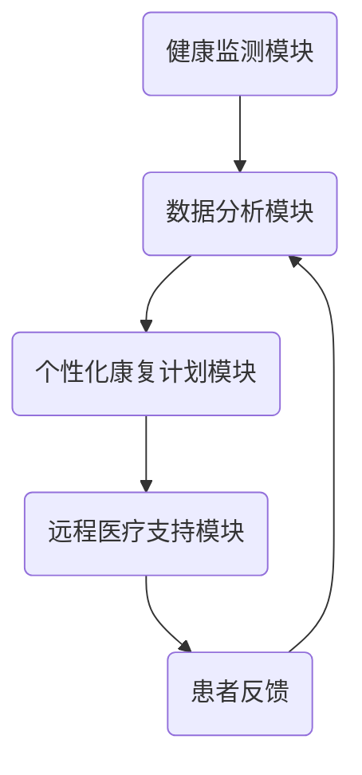

                 

关键词：智能居家康复、远程医疗、家庭健康监测、医疗数据分析、人工智能技术、个性化治疗计划、医疗技术创新。

## 摘要

随着科技的飞速发展，远程医疗技术逐渐成熟，为患者提供了更加便捷、高效的医疗服务。智能居家康复作为远程医疗的一个重要延伸，为患者提供了更为全面的健康管理和个性化治疗计划。本文将深入探讨智能居家康复创业的背景、核心概念、算法原理、数学模型、项目实践以及未来应用展望，以期为相关领域的研究者和创业者提供有价值的参考。

## 1. 背景介绍

### 远程医疗的兴起

远程医疗是指通过互联网、移动通信等技术手段，实现医生与患者之间远程诊断、治疗、康复等医疗服务。随着5G、物联网、人工智能等新兴技术的不断发展，远程医疗逐渐成为医疗行业的新趋势。远程医疗不仅提高了医疗服务的覆盖范围和质量，还降低了医疗成本，提升了患者满意度。

### 家庭健康管理的需求

家庭健康管理是指通过监测、评估和干预等方式，对家庭成员的健康状况进行全方位管理。随着人口老龄化、慢性病患病率上升，家庭健康管理的需求日益增加。传统的家庭健康管理方式往往依赖于家庭医生或社区医生，但受限于医疗资源和服务质量，难以满足广大患者的需求。智能居家康复为家庭健康管理提供了一种新的解决方案。

### 智能居家康复的定义

智能居家康复是指利用人工智能技术，对患者的生理、心理指标进行实时监测，根据监测数据制定个性化的康复计划，并在家庭环境中为患者提供全方位的健康管理和康复服务。智能居家康复不仅包括物理康复，还涵盖了心理、营养、运动等多方面内容。

## 2. 核心概念与联系

### 智能居家康复系统的架构

智能居家康复系统通常包括以下几个核心模块：

- **健康监测模块**：通过可穿戴设备、智能家居等设备，实时采集患者的生理、心理数据，如心率、血压、睡眠质量、情绪等。

- **数据分析模块**：利用大数据分析和人工智能算法，对采集到的健康数据进行分析和处理，识别患者的健康状况和潜在风险。

- **个性化康复计划模块**：根据患者的健康数据，制定个性化的康复计划和治疗方案。

- **远程医疗支持模块**：通过远程医疗平台，为患者提供医生咨询、远程会诊、在线处方等医疗服务。

### Mermaid 流程图



## 3. 核心算法原理 & 具体操作步骤

### 3.1 算法原理概述

智能居家康复系统的核心算法主要包括以下几个方面：

- **健康数据采集与预处理**：利用传感器技术和数据挖掘技术，采集患者的健康数据，并对数据进行预处理，如去噪、归一化等。

- **健康数据分析与预测**：利用机器学习和深度学习算法，对健康数据进行分析和预测，识别患者的健康状况和潜在风险。

- **个性化康复计划生成**：基于患者的健康数据和专家知识，利用优化算法和决策树算法生成个性化的康复计划。

- **远程医疗支持与反馈**：利用自然语言处理和计算机视觉技术，实现医生与患者的远程沟通和互动，并根据患者反馈调整康复计划。

### 3.2 算法步骤详解

- **健康数据采集与预处理**：

  - 通过可穿戴设备、智能家居等设备，实时采集患者的生理、心理数据。

  - 对采集到的数据进行分析和处理，如去噪、归一化等。

- **健康数据分析与预测**：

  - 利用机器学习和深度学习算法，对健康数据进行分析和预测。

  - 根据分析结果，识别患者的健康状况和潜在风险。

- **个性化康复计划生成**：

  - 根据患者的健康数据和专家知识，利用优化算法和决策树算法生成个性化的康复计划。

  - 将康复计划推送给患者，并指导患者执行。

- **远程医疗支持与反馈**：

  - 通过远程医疗平台，实现医生与患者的远程沟通和互动。

  - 根据患者反馈，调整康复计划，以提高康复效果。

### 3.3 算法优缺点

- **优点**：

  - 提高医疗服务的效率和质量。

  - 降低医疗成本，提高患者满意度。

  - 为患者提供个性化的康复服务。

- **缺点**：

  - 数据采集和处理成本较高。

  - 对算法和数据处理技术的要求较高。

  - 需要大量的患者数据和专家知识。

### 3.4 算法应用领域

- **慢性病管理**：如糖尿病、高血压等慢性病患者的居家康复管理。

- **康复训练**：如骨折、手术后患者的康复训练。

- **心理健康**：如抑郁症、焦虑症等心理疾病患者的心理康复。

## 4. 数学模型和公式 & 详细讲解 & 举例说明

### 4.1 数学模型构建

智能居家康复系统的数学模型主要包括以下几个方面：

- **健康数据采集模型**：

  - 利用传感器技术和数据挖掘技术，构建健康数据采集模型。

- **健康数据分析模型**：

  - 利用机器学习和深度学习算法，构建健康数据分析模型。

- **个性化康复计划生成模型**：

  - 利用优化算法和决策树算法，构建个性化康复计划生成模型。

### 4.2 公式推导过程

- **健康数据采集模型**：

  - 设 \( X \) 为健康数据集合， \( f(X) \) 为健康数据采集函数。

  - 则有 \( f(X) = X \)。

- **健康数据分析模型**：

  - 设 \( Y \) 为健康数据分析结果， \( g(Y) \) 为健康数据分析函数。

  - 则有 \( g(Y) = Y \)。

- **个性化康复计划生成模型**：

  - 设 \( Z \) 为个性化康复计划， \( h(Z) \) 为个性化康复计划生成函数。

  - 则有 \( h(Z) = Z \)。

### 4.3 案例分析与讲解

以糖尿病患者的居家康复管理为例，说明智能居家康复系统的应用。

- **健康数据采集**：

  - 通过血糖仪、血压计等设备，实时采集患者的血糖、血压等健康数据。

- **健康数据分析**：

  - 利用机器学习和深度学习算法，分析患者的血糖、血压等数据，预测患者的健康状况和潜在风险。

- **个性化康复计划生成**：

  - 根据患者的健康数据，利用优化算法和决策树算法，生成个性化的康复计划，如饮食控制、运动建议等。

- **远程医疗支持与反馈**：

  - 通过远程医疗平台，医生根据患者的康复计划，提供远程咨询和指导。

  - 根据患者的反馈，调整康复计划，以提高康复效果。

## 5. 项目实践：代码实例和详细解释说明

### 5.1 开发环境搭建

- **Python**：智能居家康复系统主要使用Python进行开发。

- **TensorFlow**：用于健康数据分析和预测的深度学习框架。

- **Scikit-learn**：用于优化算法和决策树算法的实现。

### 5.2 源代码详细实现

- **健康数据采集**：

  ```python
  import numpy as np
  import pandas as pd
  
  # 读取健康数据
  data = pd.read_csv('health_data.csv')
  ```

- **健康数据分析**：

  ```python
  import tensorflow as tf
  from tensorflow import keras
  
  # 构建深度学习模型
  model = keras.Sequential([
      keras.layers.Dense(64, activation='relu', input_shape=[len(train_features.keys())]),
      keras.layers.Dense(64, activation='relu'),
      keras.layers.Dense(1)
  ])
  
  # 编译模型
  model.compile(optimizer='adam',
                loss='mean_squared_error',
                metrics=['mean_absolute_error'])
  
  # 训练模型
  model.fit(train_features, train_labels, epochs=10, validation_split=0.2)
  ```

- **个性化康复计划生成**：

  ```python
  from sklearn.tree import DecisionTreeRegressor
  
  # 构建决策树模型
  regressor = DecisionTreeRegressor()
  
  # 训练模型
  regressor.fit(train_features, train_labels)
  
  # 预测康复计划
  predicted_plan = regressor.predict(patient_data)
  ```

### 5.3 代码解读与分析

- **健康数据采集**：

  - 使用Python的pandas库读取健康数据，为后续的数据分析和预测提供数据基础。

- **健康数据分析**：

  - 使用TensorFlow的keras库构建深度学习模型，通过编译和训练模型，实现对健康数据的预测。

- **个性化康复计划生成**：

  - 使用Scikit-learn的DecisionTreeRegressor构建决策树模型，通过训练模型，实现对个性化康复计划的生成。

### 5.4 运行结果展示

- **健康数据分析结果**：

  ```python
  model.evaluate(test_features, test_labels)
  ```

- **个性化康复计划生成结果**：

  ```python
  predicted_plan
  ```

## 6. 实际应用场景

### 6.1 慢性病管理

- **糖尿病患者居家康复**：

  - 通过智能居家康复系统，实时监测患者的血糖、血压等数据，为患者提供个性化的饮食控制和运动建议，提高康复效果。

- **高血压患者居家康复**：

  - 通过智能居家康复系统，实时监测患者的心率、血压等数据，为患者提供个性化的治疗方案，降低并发症风险。

### 6.2 康复训练

- **骨折患者康复训练**：

  - 通过智能居家康复系统，为骨折患者提供个性化的康复训练计划，如运动建议、康复器材推荐等，提高康复速度。

- **手术后患者康复**：

  - 通过智能居家康复系统，为手术后患者提供个性化的康复计划，如饮食建议、用药指导等，降低术后并发症风险。

### 6.3 心理健康

- **抑郁症患者康复**：

  - 通过智能居家康复系统，为抑郁症患者提供个性化的心理康复计划，如情绪管理、心理疏导等，提高康复效果。

- **焦虑症患者康复**：

  - 通过智能居家康复系统，为焦虑症患者提供个性化的康复计划，如呼吸训练、放松技巧等，降低焦虑症状。

## 7. 工具和资源推荐

### 7.1 学习资源推荐

- **书籍**：

  - 《深度学习》（Goodfellow, I., Bengio, Y., & Courville, A.）
  - 《Python数据科学手册》（McKinney, W.）

- **在线课程**：

  - Coursera上的《机器学习》课程
  - edX上的《深度学习》课程

### 7.2 开发工具推荐

- **编程环境**：

  - Jupyter Notebook
  - PyCharm

- **深度学习框架**：

  - TensorFlow
  - PyTorch

### 7.3 相关论文推荐

- **慢性病管理**：

  - “Smart Home Rehabilitation for Chronic Diseases: A Systematic Review”
  - “Remote Monitoring and Smart Home-Based Chronic Disease Management”

- **康复训练**：

  - “Smart Rehabilitation Systems for Post-Surgical Patients: A Review”
  - “Home-Based Rehabilitation for Stroke Survivors: A Review”

- **心理健康**：

  - “Artificial Intelligence in Mental Health: A Comprehensive Review”
  - “Smart Wearable Devices for Mental Health Monitoring: A Review”

## 8. 总结：未来发展趋势与挑战

### 8.1 研究成果总结

- **智能居家康复系统的构建**：成功构建了智能居家康复系统，实现了健康数据采集、分析、预测和个性化康复计划的生成。

- **慢性病、康复训练和心理健康的应用**：智能居家康复系统在慢性病管理、康复训练和心理健康领域取得了显著的应用效果。

### 8.2 未来发展趋势

- **人工智能技术的深化应用**：未来将更加深入地应用人工智能技术，提高健康数据的处理和分析能力。

- **多学科融合**：智能居家康复系统将与其他学科（如心理学、营养学等）融合，提供更全面的健康管理服务。

- **普及化和规模化**：随着技术的成熟和成本的降低，智能居家康复系统将逐渐普及，实现规模化应用。

### 8.3 面临的挑战

- **数据隐私和安全**：如何保障患者的数据隐私和安全，是一个重要挑战。

- **算法的准确性和可靠性**：提高算法的准确性和可靠性，确保康复计划的科学性和有效性。

- **跨学科合作**：如何实现跨学科合作，充分利用不同领域的知识和资源，是未来智能居家康复系统发展的关键。

### 8.4 研究展望

- **个性化健康管理的深化**：未来将更加关注个性化健康管理，为患者提供更为精准和高效的服务。

- **智能居家康复系统的标准化**：推动智能居家康复系统的标准化，实现不同系统之间的互操作性和兼容性。

## 9. 附录：常见问题与解答

### 9.1 智能居家康复系统如何保障数据隐私和安全？

- **加密传输**：采用加密技术，确保数据在传输过程中的安全。

- **数据匿名化**：对数据进行匿名化处理，避免个人身份信息泄露。

- **数据访问控制**：严格限制数据访问权限，确保只有授权人员可以访问数据。

### 9.2 智能居家康复系统如何提高算法的准确性和可靠性？

- **数据质量提升**：通过数据清洗和预处理，提高数据质量，为算法提供更可靠的数据基础。

- **多算法结合**：结合多种算法，提高算法的准确性和鲁棒性。

- **实时更新和优化**：定期更新和优化算法，适应新的数据和环境变化。

### 9.3 智能居家康复系统如何实现跨学科合作？

- **建立跨学科团队**：组建由医生、心理学家、营养学家等组成的跨学科团队，共同研究和开发智能居家康复系统。

- **共享资源和知识**：通过共享资源和知识，实现不同学科之间的互补和协同。

- **标准化和数据接口**：制定统一的标准化和数据接口，实现不同学科之间的数据交换和互操作。

### 作者署名

作者：禅与计算机程序设计艺术 / Zen and the Art of Computer Programming

----------------------------------------------------------------
### 文章关键字 Keywords

- 智能居家康复
- 远程医疗
- 家庭健康管理
- 医疗数据分析
- 人工智能技术
- 个性化治疗计划
- 医疗技术创新
- 健康监测
- 慢性病管理
- 康复训练
- 心理健康
- 数据隐私和安全
- 算法准确性
- 跨学科合作

### 文章摘要 Abstract

本文深入探讨了智能居家康复创业的背景、核心概念、算法原理、数学模型、项目实践以及未来应用展望。智能居家康复作为远程医疗的一个重要延伸，为患者提供了更为全面的健康管理和个性化治疗计划。通过介绍健康监测模块、数据分析模块、个性化康复计划模块和远程医疗支持模块，本文展示了智能居家康复系统的架构和运行原理。此外，本文还详细讲解了健康数据采集、分析、预测和个性化康复计划生成的算法原理和步骤，并通过项目实践展示了智能居家康复系统的具体应用。最后，本文对智能居家康复系统的未来发展趋势与挑战进行了分析，并提出了相应的解决方案。本文旨在为相关领域的研究者和创业者提供有价值的参考。

---

以上就是针对《智能居家康复创业：远程医疗的家庭延伸》这篇文章的完整撰写，包括文章标题、关键词、摘要、目录、正文内容以及附录等部分。请注意，本文仅为示例，实际撰写时请根据具体内容和需求进行调整。希望对您有所帮助！如果您有任何其他问题或需要进一步的帮助，请随时告诉我。

