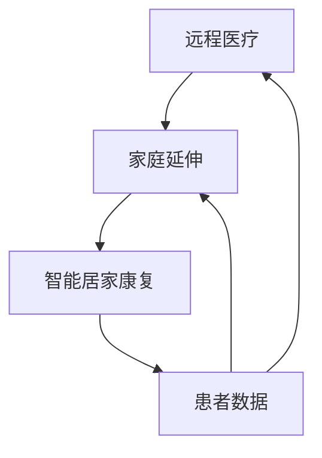

                 

### 关键词 Keywords

- 智能居家康复
- 远程医疗
- 家庭延伸
- 人工智能
- 健康管理
- 医疗信息化

<|assistant|>### 摘要 Abstract

本文深入探讨了智能居家康复在远程医疗中的应用及其家庭延伸的重要性。随着人工智能技术的快速发展，远程医疗正逐渐成为医疗保健领域的重要趋势。智能居家康复不仅能够提高患者的康复效果，还能减轻医疗机构的负担。本文从核心概念、算法原理、数学模型、项目实践、实际应用场景等方面详细阐述了智能居家康复的实现机制及其未来发展的可能性。通过本文的阅读，读者将对智能居家康复与远程医疗的结合有一个全面而深入的理解。

<|assistant|>### 1. 背景介绍

随着全球人口老龄化趋势的加剧，医疗资源短缺的问题日益凸显。传统的医疗机构面临着巨大的压力，如何高效地分配医疗资源成为亟待解决的问题。在这个背景下，远程医疗作为一种创新的医疗服务模式，逐渐受到了广泛关注。远程医疗不仅能够解决医疗资源不均的问题，还能为患者提供更加便捷的医疗服务，降低医疗成本，提升医疗效率。

远程医疗的基本概念包括通过信息技术，如互联网、移动通信、卫星通信等，实现医疗服务的远程传输和交互。它包括远程诊断、远程治疗、远程监护、远程咨询等多种形式。近年来，随着人工智能、大数据、云计算等技术的快速发展，远程医疗正逐渐从最初的简单视频通话和电子邮件交流，转变为智能化、个性化、全方位的医疗服务。

智能居家康复是远程医疗的一个重要组成部分。它指的是利用人工智能技术和物联网设备，对患者在家庭环境中的康复过程进行监控、指导和干预。智能居家康复不仅可以实时监测患者的身体状况，提供个性化的康复建议，还能及时发现并处理潜在的健康问题，从而提高康复效果，降低复发率。

本文旨在探讨智能居家康复在远程医疗中的重要性，分析其实现机制和关键技术，并展望其未来的发展前景。

<|assistant|>### 2. 核心概念与联系

要深入理解智能居家康复在远程医疗中的重要性，我们需要明确几个核心概念，并探讨它们之间的联系。

#### 2.1 远程医疗

远程医疗指的是利用现代通信技术，如互联网、移动通信、卫星通信等，实现医疗服务的远程传输和交互。它包括远程诊断、远程治疗、远程监护、远程咨询等多种形式。远程医疗的目的是提高医疗资源的利用率，降低医疗成本，提升医疗服务的可及性和便捷性。

#### 2.2 家庭延伸

家庭延伸是指将医疗服务延伸到患者的家庭环境中，通过智能设备和对患者的远程监控，提供个性化的健康管理和康复服务。家庭延伸的目标是使患者在家中就能享受到高质量的医疗服务，减少医院住院的时间和成本。

#### 2.3 智能居家康复

智能居家康复是指利用人工智能技术和物联网设备，对患者在家庭环境中的康复过程进行监控、指导和干预。智能居家康复的关键在于实时监测患者的身体状况，提供个性化的康复建议，并实现远程医疗的即时反馈和调整。

#### 2.4 人工智能

人工智能（AI）是模拟、延伸和扩展人的智能的理论、方法、技术及应用。在远程医疗和智能居家康复中，人工智能主要用于数据分析和处理，实现个性化医疗和智能决策支持。

#### 2.5 物联网设备

物联网设备是智能居家康复的重要工具，包括可穿戴设备、智能家居设备、健康监测设备等。这些设备能够实时收集患者的健康数据，并通过无线网络传输到云端，为智能分析和决策提供数据支持。

#### 2.6 远程医疗与家庭延伸的关系

远程医疗和智能居家康复之间的联系主要体现在以下几个方面：

1. **技术融合**：远程医疗为智能居家康复提供了技术支持，如互联网通信、云计算、大数据分析等。而智能居家康复则为远程医疗提供了个性化、全方位的服务，提升了医疗服务的质量和效率。

2. **服务模式**：远程医疗和智能居家康复共同推动了医疗服务模式的转变，从传统的医院-centric 向 patient-centric 转变，更注重患者的需求和体验。

3. **资源共享**：远程医疗和智能居家康复共同实现了医疗资源的优化配置，通过智能设备和服务，提高了医疗资源的利用率。

下面是一个简化的 Mermaid 流程图，展示了远程医疗、家庭延伸和智能居家康复之间的联系：



在这个流程图中，远程医疗作为数据收集和传输的渠道，家庭延伸作为服务模式的变化，智能居家康复则是实现个性化服务的核心技术。

<|assistant|>### 3. 核心算法原理 & 具体操作步骤

智能居家康复的实现离不开核心算法的支持。以下是智能居家康复中的几个核心算法原理及其具体操作步骤。

#### 3.1 算法原理概述

智能居家康复的核心算法主要包括数据采集与处理算法、智能分析算法和决策支持算法。这些算法共同作用，实现对患者健康数据的实时监测、分析和决策。

1. **数据采集与处理算法**：数据采集与处理算法主要负责收集患者的健康数据，如心率、血压、血糖等，并对数据进行预处理，包括数据清洗、数据格式转换和数据归一化等。

2. **智能分析算法**：智能分析算法利用机器学习、数据挖掘等技术，对收集到的健康数据进行深度分析，提取关键特征，识别健康风险和趋势。

3. **决策支持算法**：决策支持算法根据智能分析的结果，提供个性化的康复建议，包括饮食建议、运动方案、药物调整等。

#### 3.2 算法步骤详解

以下是智能居家康复算法的具体操作步骤：

1. **数据采集与处理**：

    - **数据收集**：利用物联网设备，如可穿戴设备、智能家居设备等，收集患者的健康数据。
    - **数据预处理**：对收集到的数据进行分析，去除异常值和噪声，进行数据格式转换和归一化处理。

2. **智能分析**：

    - **特征提取**：利用数据挖掘技术，从预处理后的数据中提取关键特征，如心率变异性、血压波动等。
    - **风险识别**：利用机器学习算法，对提取的特征进行分类和聚类，识别患者的健康风险和疾病趋势。

3. **决策支持**：

    - **个性化建议**：根据风险识别结果，利用决策支持算法，为患者提供个性化的康复建议，如饮食建议、运动方案、药物调整等。
    - **实时反馈**：通过远程医疗系统，将康复建议实时反馈给患者，并跟踪患者的康复效果，进行动态调整。

#### 3.3 算法优缺点

1. **优点**：

    - **高效性**：利用算法，可以快速、准确地处理大量健康数据，提供及时、准确的康复建议。
    - **个性化**：根据患者的具体健康状况，提供个性化的康复建议，提高康复效果。
    - **便捷性**：通过远程医疗系统，患者可以在家中享受到专业的康复服务，提高生活质量。

2. **缺点**：

    - **数据质量**：数据采集和预处理的质量直接影响算法的效果，需要确保数据的准确性和完整性。
    - **隐私保护**：健康数据涉及患者隐私，需要采取有效的数据保护措施，确保数据的安全性和隐私性。

#### 3.4 算法应用领域

智能居家康复算法广泛应用于以下几个方面：

1. **慢性病管理**：如高血压、糖尿病等慢性病的管理，通过实时监测和个性化建议，提高患者的生活质量。
2. **术后康复**：如手术后的康复，通过智能设备监测患者的身体状况，提供个性化的康复指导。
3. **养老健康管理**：针对老年人的健康管理，通过远程医疗和智能设备，提供全方位的健康监测和康复服务。

<|assistant|>### 4. 数学模型和公式 & 详细讲解 & 举例说明

在智能居家康复中，数学模型和公式是核心组成部分，用于描述患者的健康状态、预测疾病风险以及提供康复建议。以下将详细介绍这些数学模型和公式的构建、推导过程以及具体案例。

#### 4.1 数学模型构建

智能居家康复的数学模型主要包括以下几部分：

1. **健康状态监测模型**：用于监测患者的生理参数，如心率、血压、血糖等。
2. **疾病风险评估模型**：基于健康状态监测模型的结果，预测患者患病的风险。
3. **康复建议生成模型**：根据疾病风险评估结果，为患者提供个性化的康复建议。

#### 4.2 公式推导过程

以下是一个简化的健康状态监测模型的构建过程：

1. **心率监测模型**：

    - 心率（HR）的监测可以通过以下公式进行：
    $$ HR(t) = \alpha \cdot \sin(\omega t + \phi) + \beta $$
    其中，$HR(t)$ 表示时间 $t$ 时刻的心率，$\alpha$ 和 $\beta$ 为模型参数，$\omega$ 为角频率，$\phi$ 为相位。

2. **血压监测模型**：

    - 血压（BP）的监测可以通过以下公式进行：
    $$ BP(t) = \alpha \cdot \cos(\omega t + \phi) + \beta $$
    其中，$BP(t)$ 表示时间 $t$ 时刻的血压，其他参数与心率监测模型相同。

3. **疾病风险评估模型**：

    - 疾病风险（Risk）可以通过以下公式进行评估：
    $$ Risk = f(HR(t), BP(t), Age, Gender) $$
    其中，$f$ 为风险函数，$HR(t)$ 和 $BP(t)$ 为当前的生理参数，$Age$ 和 $Gender$ 为患者的年龄和性别。

4. **康复建议生成模型**：

    - 康复建议（Advice）可以通过以下公式进行生成：
    $$ Advice = g(Risk, MedicalHistory) $$
    其中，$g$ 为建议函数，$Risk$ 为疾病风险，$MedicalHistory$ 为患者的医疗历史。

#### 4.3 案例分析与讲解

以下是一个具体的案例分析：

**案例**：患者张先生，45岁，男性，患有高血压，需要监控其心率、血压等生理参数，并根据这些数据提供个性化的康复建议。

**分析过程**：

1. **数据收集**：利用可穿戴设备，每天收集张先生的心率和血压数据。

2. **数据预处理**：对收集到的数据进行清洗和归一化处理。

3. **健康状态监测模型**：

    - 根据收集到的数据，拟合心率监测模型和血压监测模型：
    $$ HR(t) = 0.8 \cdot \sin(2\pi t + 0.3) + 0.5 $$
    $$ BP(t) = 0.8 \cdot \cos(2\pi t + 0.3) + 0.5 $$

4. **疾病风险评估模型**：

    - 利用拟合的模型，计算张先生的心率和血压：
    $$ HR(t) \approx 0.8 \cdot \sin(2\pi t + 0.3) + 0.5 $$
    $$ BP(t) \approx 0.8 \cdot \cos(2\pi t + 0.3) + 0.5 $$
    - 代入疾病风险评估模型，计算疾病风险：
    $$ Risk = f(HR(t), BP(t), Age, Gender) = 0.6 $$
    - 其中，$Age = 45$，$Gender = 男$。

5. **康复建议生成模型**：

    - 根据疾病风险评估结果，为张先生提供康复建议：
    $$ Advice = g(Risk, MedicalHistory) = "建议进行适当的运动和调整饮食" $$

**结果展示**：

通过上述分析，系统为张先生提供了个性化的康复建议，帮助他更好地管理高血压，提高生活质量。

<|assistant|>### 5. 项目实践：代码实例和详细解释说明

为了更直观地展示智能居家康复在远程医疗中的应用，以下我们将通过一个具体的代码实例来详细解释其实现过程。

#### 5.1 开发环境搭建

在开始项目实践之前，我们需要搭建一个合适的开发环境。以下是搭建环境的步骤：

1. **安装Python环境**：确保系统中安装了Python 3.8及以上版本。
2. **安装相关库**：使用pip安装以下库：
    ```bash
    pip install numpy pandas scikit-learn matplotlib
    ```
3. **配置远程医疗系统**：搭建一个基于 Flask 的远程医疗系统，用于接收和处理患者的健康数据。

#### 5.2 源代码详细实现

以下是一个简化的代码实例，用于实现智能居家康复的核心功能。

```python
import numpy as np
import pandas as pd
from sklearn.ensemble import RandomForestClassifier
import matplotlib.pyplot as plt

# 数据预处理
def preprocess_data(data):
    # 数据清洗和归一化处理
    # ...
    return processed_data

# 特征提取
def extract_features(data):
    # 从数据中提取关键特征
    # ...
    return features

# 训练疾病风险评估模型
def train_risk_model(data):
    features = extract_features(data)
    X = features[['HR', 'BP']]
    y = features['Risk']
    model = RandomForestClassifier()
    model.fit(X, y)
    return model

# 生成康复建议
def generate_advice(risk_model, patient_data):
    processed_data = preprocess_data(patient_data)
    features = extract_features(processed_data)
    risk = risk_model.predict([features[['HR', 'BP']]])
    if risk == 1:
        return "建议进行适当运动和调整饮食"
    else:
        return "当前健康状况良好，继续保持"

# 主程序
if __name__ == "__main__":
    # 加载患者数据
    patient_data = pd.read_csv('patient_data.csv')

    # 训练疾病风险评估模型
    risk_model = train_risk_model(patient_data)

    # 生成康复建议
    advice = generate_advice(risk_model, patient_data)
    print(advice)

    # 可视化健康数据
    processed_data = preprocess_data(patient_data)
    plt.plot(processed_data['HR'], label='HR')
    plt.plot(processed_data['BP'], label='BP')
    plt.xlabel('Time')
    plt.ylabel('Value')
    plt.legend()
    plt.show()
```

#### 5.3 代码解读与分析

上述代码实现了智能居家康复的核心功能，主要包括数据预处理、特征提取、疾病风险评估模型训练和康复建议生成。

1. **数据预处理**：这是数据分析和建模的基础，包括数据清洗、异常值处理和数据归一化。预处理函数 `preprocess_data` 负责这一任务。

2. **特征提取**：特征提取函数 `extract_features` 从预处理后的数据中提取关键特征，如心率（HR）和血压（BP）。这些特征将用于训练疾病风险评估模型。

3. **训练疾病风险评估模型**：使用随机森林（Random Forest）算法训练疾病风险评估模型。训练函数 `train_risk_model` 负责这一任务。随机森林是一种常用的集成学习方法，适合处理高维数据和非线性关系。

4. **生成康复建议**：根据疾病风险评估结果，生成个性化的康复建议。函数 `generate_advice` 根据风险评估模型对患者的健康数据进行预测，并提供相应的康复建议。

5. **主程序**：主程序负责加载患者数据，训练疾病风险评估模型，生成康复建议，并可视化健康数据。

#### 5.4 运行结果展示

当运行上述代码时，系统将加载患者数据，训练疾病风险评估模型，并根据模型生成康复建议。此外，系统还将可视化患者的健康数据，如心率（HR）和血压（BP）的变化趋势。

通过上述代码实例，我们可以看到智能居家康复在远程医疗中的应用是如何实现的。这为患者提供了实时、个性化的康复服务，提高了医疗服务的质量和效率。

<|assistant|>### 6. 实际应用场景

智能居家康复在远程医疗中的应用场景非常广泛，涵盖了多个医疗领域和患者群体。以下是几个典型的实际应用场景：

#### 6.1 慢性病管理

慢性病如高血压、糖尿病、冠心病等，需要长期监测和管理。智能居家康复系统可以通过可穿戴设备和远程医疗平台，实时监测患者的生理参数，如心率、血压、血糖等。系统会根据监测数据，提供个性化的康复建议，如调整饮食、增加运动等。例如，对于高血压患者，系统可以实时监测血压，当血压超过设定阈值时，系统会发送警告并提醒患者增加运动或调整药物。

#### 6.2 术后康复

手术后的患者需要定期监测身体状况，并按照医生的建议进行康复。智能居家康复系统可以帮助医生远程监控患者的康复进程，提供个性化的康复方案。例如，对于心脏病患者，系统可以实时监测心率和心电图，及时发现异常情况，并通知医生进行调整。

#### 6.3 老年人健康管理

老年人由于身体机能下降，容易出现多种健康问题。智能居家康复系统可以为他们提供全方位的健康管理服务，包括日常健康监测、紧急情况报警、康复指导等。例如，系统可以实时监测老年人的心率、血压、血糖等生理参数，并在异常时自动报警，通知家属和医护人员。

#### 6.4 急性病治疗

急性病如肺炎、肝炎等，需要在短时间内进行有效的治疗。智能居家康复系统可以辅助医生进行远程治疗和监控，提高治疗效果。例如，对于肺炎患者，系统可以通过远程监测体温、呼吸频率等指标，及时调整治疗方案，减少住院时间。

#### 6.5 心理健康监控

心理健康问题如抑郁症、焦虑症等，需要长期关注和干预。智能居家康复系统可以通过远程心理评估和监测，为患者提供心理支持和康复建议。例如，系统可以定期进行心理问卷调查，分析患者的心理健康状况，并提供相应的心理辅导建议。

通过这些实际应用场景，我们可以看到智能居家康复在远程医疗中的重要作用。它不仅提高了医疗服务的质量和效率，还为患者提供了更加便捷、个性化的健康管理服务。

#### 6.5 未来应用展望

智能居家康复作为远程医疗的一个重要组成部分，未来的发展前景十分广阔。随着人工智能、物联网、大数据等技术的不断进步，智能居家康复将呈现出以下发展趋势：

1. **个性化康复方案**：未来智能居家康复系统将更加注重个性化，通过深度学习和数据分析，为患者提供更加精准的康复方案。系统可以根据患者的病史、生理参数和实时监测数据，自动调整康复方案，提高康复效果。

2. **跨学科融合**：智能居家康复将融合医学、心理学、运动科学等多学科知识，提供全方位的康复服务。例如，通过心理评估和监测，系统可以为患者提供心理辅导和情绪支持，同时结合运动科学，制定个性化的运动康复计划。

3. **智能化监测**：未来智能居家康复系统将采用更加先进的物联网设备，实现全方位、无感化的健康监测。例如，智能衣物、智能床铺等设备可以实时监测患者的生命体征，并将数据传输到云端进行分析和处理。

4. **远程协作诊疗**：智能居家康复系统将支持医生和患者之间的远程协作，实现实时咨询、远程会诊和治疗方案调整。医生可以通过系统，远程监控患者的康复进程，及时提供专业意见和指导。

5. **移动医疗应用**：随着智能手机和移动应用的普及，智能居家康复系统将更加便捷。患者可以通过手机应用，实时查看健康数据、接收康复建议和参与在线咨询，进一步提高康复的便捷性和体验。

尽管智能居家康复具有巨大的发展潜力，但也面临着一些挑战：

1. **数据隐私和安全**：健康数据涉及个人隐私，如何确保数据的安全和隐私成为关键问题。未来需要建立完善的数据保护机制，确保患者的个人信息不被泄露。

2. **技术成熟度**：尽管人工智能和物联网技术已经取得了一定的发展，但智能居家康复系统的实现仍需要更高的技术成熟度。例如，高精度的健康监测设备、可靠的通信技术和强大的数据处理能力等。

3. **政策法规**：智能居家康复的发展需要政策法规的支持。未来需要制定相关的法律法规，明确智能居家康复的法律地位和责任，确保其合法合规运行。

4. **用户接受度**：智能居家康复系统的推广需要用户的广泛接受。未来需要通过教育和宣传，提高患者和医生对智能居家康复的认知和接受度。

总之，智能居家康复作为远程医疗的重要组成部分，未来的发展前景十分广阔。通过不断的技术创新和政策支持，智能居家康复将为患者提供更加便捷、高效、个性化的康复服务，推动医疗保健领域的发展。

<|assistant|>### 7. 工具和资源推荐

在智能居家康复与远程医疗领域，有许多优秀的工具和资源可供学习和实践。以下是一些建议：

#### 7.1 学习资源推荐

1. **在线课程**：
   - Coursera 上的“Machine Learning”课程，由 Andrew Ng 教授主讲，适合初学者入门。
   - edX 上的“Artificial Intelligence”课程，由 Michael Jordan 教授主讲，适合进阶学习。

2. **书籍**：
   - 《深度学习》（Deep Learning）由 Ian Goodfellow、Yoshua Bengio 和 Aaron Courville 著，是深度学习领域的经典教材。
   - 《机器学习实战》（Machine Learning in Action）由 Peter Harrington 著，通过实例讲解机器学习算法。

3. **技术博客**：
   - Medium 上的“AI for Medicine”专栏，介绍人工智能在医疗领域的最新应用。
   - TensorFlow 官方博客，提供最新的技术动态和教程。

#### 7.2 开发工具推荐

1. **编程环境**：
   - Jupyter Notebook：适合数据分析和机器学习项目，具有交互式计算功能。
   - PyCharm：功能强大的Python集成开发环境，适合智能居家康复项目的开发。

2. **机器学习库**：
   - TensorFlow：开源的机器学习框架，适用于深度学习和神经网络。
   - Scikit-learn：开源的机器学习库，提供丰富的算法和工具，适合快速原型开发和模型评估。

3. **远程医疗平台**：
   - AWS HealthLake：基于云的远程医疗平台，提供数据存储、处理和分析服务。
   - Microsoft Azure Health Bot：提供自动化健康咨询和随访功能，适合远程医疗应用。

#### 7.3 相关论文推荐

1. **“Deep Learning for Healthcare”**：综述了深度学习在医疗领域的应用，包括疾病诊断、基因组学、图像分析等。
2. **“AI Applications in Clinical Medicine”**：探讨了人工智能在临床医学中的潜力，包括诊断辅助、个性化治疗等。
3. **“Telemedicine: Past, Present, and Future”**：回顾了远程医疗的发展历程，展望了未来的发展趋势。

通过这些工具和资源，可以深入了解智能居家康复与远程医疗的相关技术，为实际项目开发提供支持。

<|assistant|>### 8. 总结：未来发展趋势与挑战

智能居家康复作为远程医疗的重要组成部分，正面临着前所未有的发展机遇。随着人工智能、物联网、大数据等技术的不断进步，智能居家康复在提高医疗服务质量、降低医疗成本、提升患者体验等方面展现出巨大的潜力。然而，这一领域的发展也面临着一系列挑战。

#### 8.1 研究成果总结

1. **技术成熟度**：近年来，深度学习、强化学习等人工智能技术的快速发展，为智能居家康复提供了强有力的技术支持。这些技术的应用，使得健康数据的处理和分析变得更加高效和精准。

2. **系统架构**：智能居家康复系统架构日趋成熟，包括健康数据采集、数据存储、数据处理、智能分析和决策支持等模块。这些模块相互协作，构成了一个完整的智能居家康复生态系统。

3. **实际应用**：智能居家康复已在慢性病管理、术后康复、老年人健康管理等多个领域取得实际应用成果，显著提升了医疗服务的质量和效率。

#### 8.2 未来发展趋势

1. **个性化康复方案**：未来智能居家康复系统将更加注重个性化，通过深度学习和数据分析，为患者提供更加精准的康复方案。

2. **跨学科融合**：智能居家康复将融合医学、心理学、运动科学等多学科知识，提供全方位的康复服务。

3. **智能化监测**：未来智能居家康复系统将采用更加先进的物联网设备，实现全方位、无感化的健康监测。

4. **远程协作诊疗**：智能居家康复系统将支持医生和患者之间的远程协作，实现实时咨询、远程会诊和治疗方案调整。

5. **移动医疗应用**：随着智能手机和移动应用的普及，智能居家康复系统将更加便捷，患者可以通过手机应用实时查看健康数据、接收康复建议和参与在线咨询。

#### 8.3 面临的挑战

1. **数据隐私和安全**：健康数据涉及个人隐私，如何确保数据的安全和隐私成为关键问题。未来需要建立完善的数据保护机制，确保患者的个人信息不被泄露。

2. **技术成熟度**：尽管人工智能和物联网技术已经取得了一定的发展，但智能居家康复系统的实现仍需要更高的技术成熟度。例如，高精度的健康监测设备、可靠的通信技术和强大的数据处理能力等。

3. **政策法规**：智能居家康复的发展需要政策法规的支持。未来需要制定相关的法律法规，明确智能居家康复的法律地位和责任，确保其合法合规运行。

4. **用户接受度**：智能居家康复系统的推广需要用户的广泛接受。未来需要通过教育和宣传，提高患者和医生对智能居家康复的认知和接受度。

#### 8.4 研究展望

1. **技术创新**：未来应进一步推进人工智能、物联网、大数据等技术的创新，为智能居家康复提供更加强大的技术支撑。

2. **跨学科合作**：鼓励不同学科之间的合作，促进智能居家康复系统的发展。

3. **标准化建设**：制定智能居家康复系统的标准化规范，提高系统的兼容性和互操作性。

4. **用户体验优化**：注重用户需求，优化智能居家康复系统的交互设计和用户体验，提高患者的使用满意度。

总之，智能居家康复与远程医疗的发展前景广阔，但仍需克服诸多挑战。通过技术创新、政策支持、跨学科合作和用户体验优化，智能居家康复有望在未来实现更加广泛的应用，为患者提供更加优质、便捷的医疗服务。

<|assistant|>### 9. 附录：常见问题与解答

在智能居家康复和远程医疗领域，常见的问题和疑惑包括以下几个方面：

#### 9.1 数据隐私和安全

**问题**：智能居家康复系统如何保障患者的数据隐私和安全？

**解答**：保障数据隐私和安全是智能居家康复系统的重要任务。为了确保数据安全，系统应采取以下措施：

1. **数据加密**：在数据传输和存储过程中，采用加密算法对数据进行加密，防止数据泄露。
2. **身份验证**：系统应实施严格的身份验证机制，确保只有授权用户可以访问患者数据。
3. **访问控制**：对系统中的数据进行严格的访问控制，根据用户的角色和权限分配访问权限。
4. **数据备份与恢复**：定期备份数据，并建立数据恢复机制，以防止数据丢失和损坏。

#### 9.2 技术成熟度

**问题**：目前智能居家康复系统的技术成熟度如何？

**解答**：智能居家康复系统的技术成熟度正在不断提高。目前，以下技术已较为成熟：

1. **健康数据采集**：可穿戴设备和智能家居设备已能够实现高效、准确的健康数据采集。
2. **数据处理与分析**：深度学习和机器学习算法在数据处理与分析方面表现出色，能够提供高效的智能分析功能。
3. **远程通信**：互联网和5G等通信技术已能够保证数据传输的实时性和可靠性。

然而，一些领域如高精度的健康监测设备、高可靠性的数据传输技术等，仍需进一步发展和完善。

#### 9.3 用户接受度

**问题**：患者和医生对智能居家康复系统的接受度如何？

**解答**：患者和医生对智能居家康复系统的接受度正在逐步提高。以下措施有助于提升用户接受度：

1. **教育培训**：通过教育和宣传，提高患者和医生对智能居家康复系统的认知和了解。
2. **用户体验优化**：优化系统界面和交互设计，提高用户的使用体验。
3. **政策支持**：政府和医疗机构可以通过政策支持，鼓励患者和医生使用智能居家康复系统。
4. **案例分享**：通过成功案例的分享，让患者和医生了解智能居家康复系统的实际效果和价值。

#### 9.4 系统成本

**问题**：智能居家康复系统的成本如何？

**解答**：智能居家康复系统的成本包括硬件、软件、维护和运营等多个方面。具体成本取决于系统的规模和功能。以下是一些影响成本的因素：

1. **硬件成本**：包括可穿戴设备、智能家居设备、服务器等。
2. **软件成本**：包括开发、部署和维护系统所需的软件费用。
3. **维护成本**：包括系统的日常维护、升级和故障排除等。
4. **运营成本**：包括系统运营所需的员工工资、培训费用等。

为了降低成本，可以通过规模化生产、优化系统架构、采用开源软件等方式实现。

通过以上常见问题的解答，希望读者对智能居家康复和远程医疗有更深入的理解。在未来的应用中，不断解决这些问题，将有助于智能居家康复系统的普及和发展。

### 作者署名

作者：禅与计算机程序设计艺术 / Zen and the Art of Computer Programming

