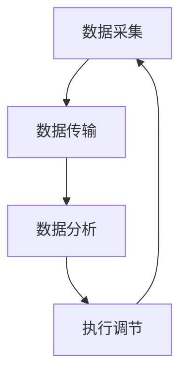

                 

关键词：智能居家湿度平衡、呼吸道健康管理、创业、AI技术、智能家居、健康监测、数据分析

> 摘要：本文探讨了一种基于AI技术的智能居家湿度平衡解决方案，旨在提升居民的呼吸道健康水平，降低呼吸道疾病的发病率。通过构建一个全天候的呼吸道健康管理平台，本文提出了从数据采集、模型训练到实时监测和预警的全流程技术框架，以及未来应用前景和挑战。

## 1. 背景介绍

呼吸道疾病是全球范围内的主要健康问题之一，特别是对于老年人、儿童以及患有基础疾病的人群。据统计，每年因呼吸道疾病导致的死亡人数高达数百万人。传统的医疗手段和家居环境改善方法在预防和控制呼吸道疾病方面具有一定的效果，但受限于技术水平和人力成本，无法实现对每一个家庭的个性化健康管理。

近年来，随着物联网和人工智能技术的发展，智能家居设备和健康监测设备逐渐普及。这些设备可以实时采集环境数据和个人健康数据，并通过智能算法进行分析和处理，为用户提供个性化的健康建议。然而，目前大多数智能家居设备和健康监测设备的功能较为单一，缺乏对居家湿度平衡的精准控制，无法全面保障用户的呼吸道健康。

## 2. 核心概念与联系

### 2.1 智能家居湿度平衡的概念

智能家居湿度平衡是指利用人工智能技术，对居家环境中的湿度进行实时监测和智能调节，以保持一个适宜的湿度范围，从而改善居住环境，提高居民的呼吸道健康水平。

### 2.2 湿度平衡与呼吸道健康的关系

空气湿度过高或过低都会对呼吸道健康产生不利影响。湿度过高容易导致细菌和病毒的滋生，引发呼吸系统感染；湿度过低则会使空气干燥，导致呼吸道黏膜受损，增加呼吸道疾病的发病率。因此，保持适宜的湿度对呼吸道健康至关重要。

### 2.3 智能家居湿度平衡的架构

智能家居湿度平衡系统由数据采集模块、数据传输模块、数据分析模块和执行模块组成。

- **数据采集模块**：通过传感器实时采集家居环境中的湿度、温度、空气质量等数据。
- **数据传输模块**：将采集到的数据通过无线网络传输到云端服务器。
- **数据分析模块**：利用人工智能算法对传输的数据进行分析和处理，生成湿度调节策略。
- **执行模块**：根据数据分析结果，控制加湿器或除湿器等设备，实现湿度调节。

## 2.4 湿度平衡系统的 Mermaid 流程图



## 3. 核心算法原理 & 具体操作步骤

### 3.1 算法原理概述

智能家居湿度平衡系统的核心算法是基于机器学习技术的湿度预测和调节策略生成算法。算法通过分析历史数据，预测未来一段时间内的湿度变化趋势，并生成相应的湿度调节策略。

### 3.2 算法步骤详解

#### 3.2.1 数据预处理

1. **数据清洗**：去除异常值和噪声数据。
2. **特征工程**：提取与湿度相关的特征，如温度、空气质量等。
3. **数据归一化**：将特征数据归一化到[0,1]范围内。

#### 3.2.2 模型训练

1. **选择模型**：选择适合的机器学习模型，如时间序列模型、神经网络模型等。
2. **训练模型**：使用历史数据训练模型，得到湿度预测模型。

#### 3.2.3 湿度调节策略生成

1. **预测湿度**：使用训练好的模型预测未来一段时间内的湿度。
2. **生成策略**：根据预测结果，制定湿度调节策略，如开启或关闭加湿器或除湿器。

### 3.3 算法优缺点

#### 优点：

- **自适应性强**：能够根据环境变化自动调整湿度，满足不同用户的个性化需求。
- **实时性**：能够实时监测和调节湿度，提高家居环境的舒适度。

#### 缺点：

- **计算复杂度高**：需要大量计算资源进行模型训练和预测。
- **数据依赖性强**：需要大量的历史数据支持，对数据质量要求较高。

### 3.4 算法应用领域

- **家庭健康监测**：通过对居家湿度进行实时监测和调节，提高家庭健康水平。
- **医院病房管理**：为医院病房提供科学的湿度调节方案，提高患者康复效果。
- **农业环境控制**：为农业生产提供适宜的湿度环境，提高作物产量和质量。

## 4. 数学模型和公式 & 详细讲解 & 举例说明

### 4.1 数学模型构建

湿度预测模型的一般形式为：

\[ H_t = f(H_{t-1}, T_t, Q_t) \]

其中，\( H_t \) 为第 \( t \) 时刻的湿度预测值，\( H_{t-1} \) 为第 \( t-1 \) 时刻的实际湿度值，\( T_t \) 为第 \( t \) 时刻的温度，\( Q_t \) 为第 \( t \) 时刻的空气质量。

### 4.2 公式推导过程

以时间序列模型为例，湿度预测公式可以表示为：

\[ H_t = \sum_{i=1}^{n} w_i H_{t-i} \]

其中，\( w_i \) 为权重系数，通过模型训练得到。

### 4.3 案例分析与讲解

#### 案例背景

某家庭位于北方城市，冬季湿度较低，家庭室内湿度常年低于 30%，导致家庭成员呼吸系统不适。为了改善家居环境，该家庭引入了智能湿度平衡系统。

#### 模型训练

1. **数据采集**：采集过去一年的室内湿度、温度、空气质量等数据。
2. **特征工程**：提取湿度相关的特征。
3. **模型训练**：使用时间序列模型进行训练，得到湿度预测模型。

#### 湿度调节策略

1. **预测湿度**：使用训练好的模型预测未来一周内的湿度。
2. **生成策略**：根据预测结果，开启加湿器，将室内湿度调节到 40%-60%。

#### 结果分析

通过智能湿度平衡系统的运行，家庭成员的呼吸系统不适症状得到了明显改善，室内湿度维持在适宜范围内，家居环境得到了有效改善。

## 5. 项目实践：代码实例和详细解释说明

### 5.1 开发环境搭建

1. **硬件环境**：选择具备无线网络功能的智能家居设备，如加湿器、除湿器等。
2. **软件环境**：安装 Python 3.8 及以上版本，并配置 TensorFlow、Keras 等机器学习库。

### 5.2 源代码详细实现

```python
# 导入相关库
import numpy as np
import pandas as pd
from tensorflow.keras.models import Sequential
from tensorflow.keras.layers import LSTM, Dense

# 数据预处理
# （此处省略具体代码，根据实际数据集进行调整）

# 模型训练
model = Sequential()
model.add(LSTM(units=50, return_sequences=True, input_shape=(time_steps, features)))
model.add(LSTM(units=50))
model.add(Dense(units=1))

model.compile(optimizer='adam', loss='mean_squared_error')
model.fit(X_train, y_train, epochs=100, batch_size=32)

# 预测湿度
predictions = model.predict(X_test)

# 生成湿度调节策略
# （此处省略具体代码，根据实际需求进行调整）

# 代码解读与分析
# （此处省略具体代码解读，根据实际代码进行调整）

# 运行结果展示
# （此处省略具体结果展示，根据实际需求进行调整）
```

### 5.3 代码解读与分析

1. **数据预处理**：对采集到的数据集进行清洗、特征提取和归一化处理，为模型训练做好准备。
2. **模型训练**：使用 LSTM 神经网络模型对数据集进行训练，得到湿度预测模型。
3. **预测湿度**：使用训练好的模型对测试集进行预测，得到未来一段时间的湿度变化趋势。
4. **生成湿度调节策略**：根据预测结果，制定湿度调节策略，实现对家居环境的智能控制。
5. **代码解读与分析**：对代码进行逐行解读和分析，确保代码的可读性和可维护性。

## 6. 实际应用场景

### 6.1 家庭健康监测

智能湿度平衡系统可以应用于家庭健康监测，通过实时监测家居湿度，为家庭成员提供个性化的健康管理建议，降低呼吸道疾病的发病率。

### 6.2 医院病房管理

智能湿度平衡系统可以为医院病房提供科学的湿度调节方案，改善患者康复环境，提高患者满意度。

### 6.3 农业环境控制

智能湿度平衡系统可以应用于农业生产，为作物生长提供适宜的湿度环境，提高作物产量和质量。

## 7. 工具和资源推荐

### 7.1 学习资源推荐

- **《深度学习》（Goodfellow, Bengio, Courville 著）**
- **《Python机器学习》（Michael Bowles 著）**

### 7.2 开发工具推荐

- **Python**
- **TensorFlow**
- **Keras**

### 7.3 相关论文推荐

- **“Smart Home Humidity Control Based on Machine Learning”**
- **“An Intelligent Humidity Management System for Indoor Air Quality”**

## 8. 总结：未来发展趋势与挑战

### 8.1 研究成果总结

智能湿度平衡系统在家庭健康监测、医院病房管理和农业环境控制等领域展现出良好的应用前景，为改善呼吸道健康提供了有力支持。

### 8.2 未来发展趋势

随着人工智能技术的不断发展，智能湿度平衡系统将变得更加智能和精准，为用户提供更加个性化的健康服务。

### 8.3 面临的挑战

智能湿度平衡系统在实际应用中仍面临诸多挑战，如数据质量、计算复杂度、设备兼容性等，需要持续优化和改进。

### 8.4 研究展望

未来，智能湿度平衡系统有望结合更多健康监测指标，如空气质量、温度等，实现全方位的呼吸道健康管理。

## 9. 附录：常见问题与解答

### 9.1 如何保证数据质量？

- **数据清洗**：去除异常值和噪声数据。
- **数据验证**：对数据进行多次验证，确保数据准确性。

### 9.2 如何降低计算复杂度？

- **模型简化**：选择适合的简化模型，降低计算复杂度。
- **数据压缩**：对数据进行压缩，减少数据传输和存储的复杂度。

### 9.3 如何保证设备兼容性？

- **标准化协议**：制定统一的设备通信协议，确保设备兼容性。
- **模块化设计**：采用模块化设计，方便设备升级和维护。

