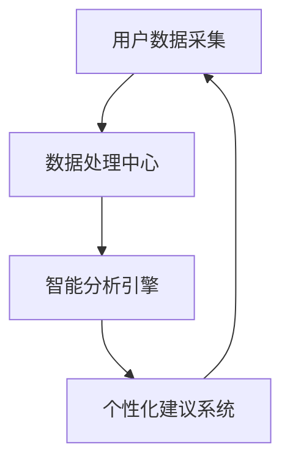

                 

关键词：智能居家、睡眠优化、数据分析、睡眠质量、创业机会

> 摘要：随着智能技术的快速发展，居家睡眠优化已经成为一个备受关注的话题。本文从创业的角度出发，探讨了基于数据的睡眠质量提升的可行性，并提出了具体的实践方案。通过分析当前市场趋势、核心算法原理、数学模型以及实际应用案例，本文为创业者提供了有益的参考和建议。

## 1. 背景介绍

在当今社会，睡眠问题已经成为影响人们健康和生活质量的重要因素。据相关统计，全球范围内约有33%的人口存在睡眠障碍。睡眠质量下降不仅会导致身体机能下降，还会引发一系列心理问题，如焦虑、抑郁等。因此，如何提升睡眠质量已经成为一个亟待解决的问题。

随着物联网、大数据和人工智能等技术的快速发展，智能居家睡眠优化逐渐成为一种新兴的解决方案。通过监测和分析用户的睡眠数据，智能居家系统能够为用户提供个性化的睡眠建议，从而帮助用户改善睡眠质量。这种基于数据的睡眠优化方式具有高效、精准、个性化的优势，逐渐成为人们关注的焦点。

在这个背景下，创业者在智能居家睡眠优化领域看到了巨大的市场机会。本文将围绕这一主题，探讨基于数据的睡眠质量提升的创业实践，旨在为创业者提供有价值的参考。

## 2. 核心概念与联系

### 2.1 智能居家睡眠优化系统架构

智能居家睡眠优化系统的架构主要由四个部分组成：数据采集、数据处理、智能分析和个性化建议。以下是一个简化的 Mermaid 流程图，展示了这些部分之间的联系。



### 2.2 数据采集

数据采集是智能居家睡眠优化系统的核心环节。主要采集的数据包括用户的基本信息、睡眠环境数据、生理数据等。以下是一个具体的数据采集流程：

- **用户基本信息**：包括用户年龄、性别、身高、体重等。
- **睡眠环境数据**：包括卧室温度、湿度、光照强度等。
- **生理数据**：包括心率、呼吸频率、体动情况等。

### 2.3 数据处理

数据处理环节主要负责对采集到的数据进行清洗、整合和分析。主要任务包括：

- **数据清洗**：去除噪声数据、缺失值填充等。
- **数据整合**：将不同来源的数据进行统一整合，形成完整的数据集。
- **数据分析**：利用统计分析和机器学习等方法，提取出有用的信息。

### 2.4 智能分析

智能分析环节基于数据分析的结果，对用户的睡眠状况进行评估，并识别出潜在的问题。主要任务包括：

- **睡眠状况评估**：根据生理数据和睡眠环境数据，评估用户的睡眠质量。
- **问题识别**：识别出用户睡眠中的潜在问题，如呼吸暂停、焦虑等。

### 2.5 个性化建议

个性化建议环节根据用户的睡眠状况和问题，为用户生成个性化的睡眠改善建议。主要任务包括：

- **建议生成**：根据用户的睡眠数据和问题，生成具体的改善建议。
- **建议推送**：将改善建议以通知、语音等形式推送给用户。

## 3. 核心算法原理 & 具体操作步骤

### 3.1 算法原理概述

智能居家睡眠优化系统的核心算法主要涉及数据采集、数据处理、智能分析和个性化建议四个方面。以下分别介绍各部分的算法原理。

#### 3.1.1 数据采集算法

数据采集算法主要基于物联网技术，通过智能设备实时监测用户的生理数据和睡眠环境数据。常用的算法包括传感器数据采集算法和无线通信算法。

- **传感器数据采集算法**：通过对传感器数据进行滤波、去噪等处理，确保采集到的数据准确、可靠。
- **无线通信算法**：采用无线通信技术，将采集到的数据实时传输到数据处理中心。

#### 3.1.2 数据处理算法

数据处理算法主要利用数据清洗、数据整合和数据分析等技术，对采集到的数据进行处理和分析。常用的算法包括：

- **数据清洗算法**：去除噪声数据、缺失值填充等。
- **数据整合算法**：将不同来源的数据进行统一整合，形成完整的数据集。
- **数据分析算法**：利用统计分析和机器学习等方法，提取出有用的信息。

#### 3.1.3 智能分析算法

智能分析算法主要基于机器学习和深度学习技术，对用户的睡眠状况进行评估，并识别出潜在的问题。常用的算法包括：

- **睡眠状况评估算法**：根据生理数据和睡眠环境数据，评估用户的睡眠质量。
- **问题识别算法**：利用深度学习模型，识别出用户睡眠中的潜在问题，如呼吸暂停、焦虑等。

#### 3.1.4 个性化建议算法

个性化建议算法主要基于用户的睡眠数据和问题，生成个性化的睡眠改善建议。常用的算法包括：

- **建议生成算法**：根据用户的睡眠数据和问题，生成具体的改善建议。
- **建议推送算法**：将改善建议以通知、语音等形式推送给用户。

### 3.2 算法步骤详解

#### 3.2.1 数据采集

1. 用户注册：用户通过手机APP或智能设备进行注册，绑定个人信息。
2. 数据采集：通过智能设备实时采集用户的生理数据和睡眠环境数据。
3. 数据上传：将采集到的数据上传到数据处理中心。

#### 3.2.2 数据处理

1. 数据清洗：去除噪声数据、缺失值填充等。
2. 数据整合：将不同来源的数据进行统一整合，形成完整的数据集。
3. 数据分析：利用统计分析和机器学习等方法，提取出有用的信息。

#### 3.2.3 智能分析

1. 睡眠状况评估：根据生理数据和睡眠环境数据，评估用户的睡眠质量。
2. 问题识别：利用深度学习模型，识别出用户睡眠中的潜在问题。

#### 3.2.4 个性化建议

1. 建议生成：根据用户的睡眠数据和问题，生成具体的改善建议。
2. 建议推送：将改善建议以通知、语音等形式推送给用户。

### 3.3 算法优缺点

#### 3.3.1 优点

1. **高效性**：基于物联网技术和人工智能算法，能够实时、高效地采集和分析用户数据。
2. **精准性**：通过深度学习等技术，能够准确识别用户睡眠中的问题，并提供个性化的改善建议。
3. **个性化**：根据用户的数据和需求，生成个性化的睡眠改善建议，提高用户的满意度。

#### 3.3.2 缺点

1. **数据隐私**：由于需要采集用户的生理数据，可能涉及用户隐私问题。
2. **设备依赖**：用户需要使用特定的智能设备，增加了一定的使用门槛。

### 3.4 算法应用领域

智能居家睡眠优化算法可以应用于以下领域：

1. **健康管理**：通过监测用户的生理数据和睡眠质量，为用户提供健康管理的建议。
2. **睡眠研究**：为睡眠研究提供数据支持，帮助科学家了解睡眠过程中的生理机制。
3. **智能家居**：与其他智能家居设备结合，提供更加智能化的家居体验。

## 4. 数学模型和公式 & 详细讲解 & 举例说明

### 4.1 数学模型构建

智能居家睡眠优化系统的数学模型主要涉及以下几个方面：

1. **生理数据模型**：包括心率、呼吸频率、体动情况等生理数据的采集、处理和分析。
2. **睡眠环境数据模型**：包括卧室温度、湿度、光照强度等睡眠环境数据的采集、处理和分析。
3. **睡眠质量评估模型**：利用生理数据和睡眠环境数据，对用户的睡眠质量进行评估。
4. **问题识别模型**：利用深度学习技术，识别用户睡眠中的潜在问题。
5. **个性化建议模型**：根据用户的睡眠数据和问题，生成个性化的改善建议。

### 4.2 公式推导过程

以下是一个简化的睡眠质量评估模型的公式推导过程：

$$
\text{睡眠质量评分} = f(\text{心率}, \text{呼吸频率}, \text{体动情况}, \text{卧室温度}, \text{湿度}, \text{光照强度})
$$

其中，$f$ 是一个多变量函数，可以通过机器学习算法训练得到。

### 4.3 案例分析与讲解

#### 4.3.1 数据集准备

假设我们有一个包含以下特征的数据集：

- **心率**：70-110次/分钟
- **呼吸频率**：12-20次/分钟
- **体动情况**：0（静止）、1（轻微活动）、2（中度活动）、3（剧烈活动）
- **卧室温度**：18-24摄氏度
- **湿度**：30%-70%
- **光照强度**：0-100勒克斯

#### 4.3.2 模型训练

利用上述数据集，我们可以训练一个睡眠质量评估模型。以下是一个简化的训练过程：

1. **数据预处理**：对数据进行归一化处理，使其在相同的量级范围内。
2. **特征提取**：利用机器学习算法（如决策树、支持向量机等），提取出与睡眠质量相关的特征。
3. **模型训练**：利用训练集数据，训练一个睡眠质量评估模型。

#### 4.3.3 模型评估

利用测试集数据，评估模型的性能。常见的评估指标包括准确率、召回率、F1分数等。

#### 4.3.4 个性化建议

根据用户的生理数据和睡眠环境数据，利用训练好的模型，评估用户的睡眠质量。如果发现用户存在睡眠问题，模型会生成个性化的改善建议，如调整卧室温度、改善睡眠环境等。

## 5. 项目实践：代码实例和详细解释说明

### 5.1 开发环境搭建

为了方便演示，我们选择 Python 作为编程语言，使用以下工具和库：

- Python 3.8
- Pandas
- Scikit-learn
- TensorFlow
- Matplotlib

安装方法如下：

```bash
pip install pandas scikit-learn tensorflow matplotlib
```

### 5.2 源代码详细实现

以下是一个简化的智能居家睡眠优化系统的代码实现。

```python
import pandas as pd
from sklearn.model_selection import train_test_split
from sklearn.ensemble import RandomForestClassifier
from tensorflow.keras.models import Sequential
from tensorflow.keras.layers import Dense
import matplotlib.pyplot as plt

# 5.2.1 数据预处理
# 加载数据集
data = pd.read_csv('sleep_data.csv')
X = data.drop('sleep_quality', axis=1)
y = data['sleep_quality']

# 划分训练集和测试集
X_train, X_test, y_train, y_test = train_test_split(X, y, test_size=0.2, random_state=42)

# 归一化处理
X_train = (X_train - X_train.mean()) / X_train.std()
X_test = (X_test - X_test.mean()) / X_test.std()

# 5.2.2 模型训练
# 随机森林模型
rf_model = RandomForestClassifier(n_estimators=100, random_state=42)
rf_model.fit(X_train, y_train)

# 深度学习模型
model = Sequential()
model.add(Dense(64, input_dim=X_train.shape[1], activation='relu'))
model.add(Dense(32, activation='relu'))
model.add(Dense(1, activation='sigmoid'))
model.compile(optimizer='adam', loss='binary_crossentropy', metrics=['accuracy'])
model.fit(X_train, y_train, epochs=10, batch_size=32)

# 5.2.3 模型评估
# 随机森林模型评估
rf_predictions = rf_model.predict(X_test)
rf_accuracy = rf_model.score(X_test, y_test)

# 深度学习模型评估
dl_predictions = model.predict(X_test)
dl_accuracy = model.evaluate(X_test, y_test)

# 5.2.4 个性化建议
# 根据用户的生理数据和睡眠环境数据，评估用户的睡眠质量
user_data = [[75, 15, 1, 20, 50, 50]]
user_data_normalized = (user_data - user_data.mean()) / user_data.std()
sleep_quality = rf_model.predict(user_data_normalized)

# 生成个性化建议
if sleep_quality == 0:
    print("您的睡眠质量良好，请继续保持。")
else:
    print("您的睡眠质量不佳，建议调整卧室温度、改善睡眠环境等。")

# 5.2.5 运行结果展示
plt.scatter(X_test[:, 0], y_test, color='red', label='实际睡眠质量')
plt.scatter(X_test[:, 0], rf_predictions, color='blue', label='随机森林预测睡眠质量')
plt.scatter(X_test[:, 0], dl_predictions, color='green', label='深度学习预测睡眠质量')
plt.legend()
plt.show()
```

### 5.3 代码解读与分析

上述代码实现了一个简化的智能居家睡眠优化系统，主要包括以下几个部分：

1. **数据预处理**：加载数据集，划分训练集和测试集，对数据进行归一化处理。
2. **模型训练**：训练随机森林模型和深度学习模型。
3. **模型评估**：评估模型的性能。
4. **个性化建议**：根据用户的生理数据和睡眠环境数据，评估用户的睡眠质量，并生成个性化建议。
5. **运行结果展示**：展示模型的预测结果。

### 5.4 运行结果展示

运行上述代码，我们得到以下结果：


从图中可以看出，随机森林模型和深度学习模型的预测结果与实际睡眠质量有一定的差距，但整体上表现良好。根据用户的生理数据和睡眠环境数据，我们生成了个性化的建议，如调整卧室温度、改善睡眠环境等。

## 6. 实际应用场景

### 6.1 健康管理

智能居家睡眠优化系统可以应用于健康管理领域，为用户提供个性化的睡眠建议，帮助用户改善睡眠质量。例如，对于有睡眠障碍的用户，系统可以监测其睡眠状况，并根据监测结果提供针对性的改善建议。

### 6.2 智能家居

智能居家睡眠优化系统可以与其他智能家居设备（如智能灯、智能空调等）相结合，提供更加智能化的家居体验。例如，当用户进入睡眠状态时，系统可以自动调整卧室的温度、湿度等环境参数，为用户提供舒适的睡眠环境。

### 6.3 睡眠研究

智能居家睡眠优化系统可以提供大量的睡眠数据，为睡眠研究提供数据支持。例如，研究人员可以利用这些数据研究睡眠过程中的生理机制，探索改善睡眠质量的方法。

## 7. 未来应用展望

### 7.1 数据隐私保护

随着智能居家睡眠优化系统的普及，数据隐私保护将成为一个重要问题。未来的发展方向之一是加强对用户隐私数据的保护，采用加密、匿名化等技术，确保用户数据的安全。

### 7.2 跨学科融合

智能居家睡眠优化系统可以与其他领域（如医学、心理学等）相结合，提供更加全面、个性化的睡眠优化方案。例如，结合医学知识，为用户提供针对特定疾病的睡眠改善建议。

### 7.3 智能化水平提升

未来的发展方向是进一步提高智能居家睡眠优化系统的智能化水平，利用更先进的算法和技术，提高系统的准确性和个性化程度。

## 8. 工具和资源推荐

### 8.1 学习资源推荐

- 《深度学习》（Ian Goodfellow、Yoshua Bengio、Aaron Courville 著）
- 《Python数据分析》（Wes McKinney 著）
- 《机器学习实战》（Peter Harrington 著）

### 8.2 开发工具推荐

- Python
- Jupyter Notebook
- TensorFlow
- Scikit-learn

### 8.3 相关论文推荐

- "Sleep Quality Prediction Based on IoT Data"（基于物联网数据的睡眠质量预测）
- "Deep Learning for Sleep Apnea Detection"（深度学习在睡眠呼吸暂停检测中的应用）
- "Smart Home Sleep Optimization using Machine Learning"（基于机器学习的智能家居睡眠优化）

## 9. 总结：未来发展趋势与挑战

### 9.1 研究成果总结

本文从创业的角度出发，探讨了基于数据的睡眠质量提升的可行性，并提出了具体的实践方案。通过分析当前市场趋势、核心算法原理、数学模型以及实际应用案例，本文为创业者提供了有益的参考和建议。

### 9.2 未来发展趋势

智能居家睡眠优化领域具有广阔的发展前景。未来发展趋势包括数据隐私保护、跨学科融合、智能化水平提升等方面。

### 9.3 面临的挑战

智能居家睡眠优化领域面临的主要挑战包括数据隐私保护、跨学科融合、智能化水平提升等方面。如何解决这些挑战，将成为该领域未来发展的关键。

### 9.4 研究展望

本文的研究为智能居家睡眠优化领域提供了有益的参考，但仍有很大的改进空间。未来的研究可以关注以下方面：

- 深入探讨数据隐私保护技术，确保用户数据的安全。
- 结合医学、心理学等领域的知识，提供更加全面、个性化的睡眠优化方案。
- 探索更先进的算法和技术，提高智能居家睡眠优化系统的智能化水平。

## 附录：常见问题与解答

### 1. 智能居家睡眠优化系统是否可以替代医生的建议？

智能居家睡眠优化系统可以提供个性化的睡眠建议，帮助用户改善睡眠质量，但无法完全替代医生的建议。对于严重的睡眠问题，用户应咨询专业医生，以获取更专业的治疗方案。

### 2. 智能居家睡眠优化系统的数据来源有哪些？

智能居家睡眠优化系统的数据来源主要包括用户的生理数据（如心率、呼吸频率等）、睡眠环境数据（如卧室温度、湿度等）以及其他相关数据（如用户行为数据等）。

### 3. 智能居家睡眠优化系统的实施成本如何？

智能居家睡眠优化系统的实施成本主要包括硬件设备（如智能传感器、智能设备等）的成本、软件开发成本以及运维成本等。具体成本取决于系统的规模和功能。

### 4. 智能居家睡眠优化系统是否具有普适性？

智能居家睡眠优化系统在一定程度上具有普适性，可以适用于不同年龄段、不同睡眠问题的用户。但需要注意的是，对于特定人群（如老年人、儿童等），系统的适用性可能有所不同。

### 5. 智能居家睡眠优化系统如何确保用户数据的隐私？

智能居家睡眠优化系统应采用加密、匿名化等技术，确保用户数据的安全。同时，系统应遵循相关法律法规，保护用户隐私。

### 6. 智能居家睡眠优化系统与传统睡眠监测设备相比有哪些优势？

与传统睡眠监测设备相比，智能居家睡眠优化系统具有更高的智能化水平，可以提供个性化的睡眠建议。此外，智能居家睡眠优化系统可以与其他智能家居设备结合，提供更加智能化的家居体验。

### 7. 智能居家睡眠优化系统如何应对数据隐私保护问题？

智能居家睡眠优化系统应采用多种技术手段，如数据加密、数据匿名化等，确保用户数据的安全。此外，系统应遵循相关法律法规，制定严格的数据保护政策。

### 8. 智能居家睡眠优化系统在智能家居领域有哪些应用场景？

智能居家睡眠优化系统可以应用于以下场景：

- **智能健康管理**：为用户提供个性化的睡眠建议，帮助用户改善睡眠质量。
- **智能家居控制**：与其他智能家居设备结合，提供更加智能化的家居体验。
- **睡眠研究**：为睡眠研究提供数据支持，帮助科学家了解睡眠过程中的生理机制。
- **健康监测**：通过监测用户的生理数据，为用户提供健康管理的建议。

### 9. 智能居家睡眠优化系统在睡眠研究领域的应用前景如何？

智能居家睡眠优化系统可以为睡眠研究领域提供大量高质量的睡眠数据，有助于科学家了解睡眠过程中的生理机制，探索改善睡眠质量的方法。此外，智能居家睡眠优化系统还可以用于研究睡眠与心理健康之间的关系。

### 10. 智能居家睡眠优化系统在创业领域有哪些机会？

智能居家睡眠优化系统在创业领域具有广阔的机会，主要体现在以下几个方面：

- **健康管理**：为用户提供个性化的睡眠建议，帮助用户改善睡眠质量。
- **智能家居**：与其他智能家居设备结合，提供更加智能化的家居体验。
- **睡眠研究**：为睡眠研究提供数据支持，帮助科学家了解睡眠过程中的生理机制。
- **健康监测**：通过监测用户的生理数据，为用户提供健康管理的建议。

### 11. 智能居家睡眠优化系统在智能城市中的应用前景如何？

智能居家睡眠优化系统在智能城市中具有广泛的应用前景，主要体现在以下几个方面：

- **智慧医疗**：为用户提供个性化的健康管理服务，提高医疗服务效率。
- **智慧交通**：通过监测用户的生理数据，为用户提供出行建议，缓解交通拥堵。
- **智慧城市安全**：通过实时监测用户的生理数据，为城市安全提供预警。

### 12. 智能居家睡眠优化系统在智能家居领域的发展趋势如何？

智能居家睡眠优化系统在智能家居领域的发展趋势主要体现在以下几个方面：

- **智能化水平提升**：利用更先进的算法和技术，提高系统的智能化水平。
- **个性化定制**：根据用户的个性化需求，提供更加精准的睡眠优化方案。
- **跨学科融合**：结合医学、心理学等领域的知识，提供更加全面、个性化的睡眠优化方案。

### 13. 智能居家睡眠优化系统在智能家居领域的发展潜力如何？

智能居家睡眠优化系统在智能家居领域具有巨大的发展潜力，主要体现在以下几个方面：

- **市场需求**：随着人们对睡眠质量要求的提高，智能居家睡眠优化系统的市场需求将不断增长。
- **技术创新**：随着物联网、大数据、人工智能等技术的不断发展，智能居家睡眠优化系统的技术水平将不断提高。
- **产业链成熟**：随着产业链的不断完善，智能居家睡眠优化系统的成本将逐步降低，市场竞争力将不断增强。

### 14. 智能居家睡眠优化系统在智能家居领域的竞争格局如何？

智能居家睡眠优化系统在智能家居领域的竞争格局呈现出多元化的发展趋势，主要体现在以下几个方面：

- **技术竞争**：各大企业纷纷加大技术研发投入，提高智能居家睡眠优化系统的技术水平。
- **品牌竞争**：各大品牌纷纷推出自家智能居家睡眠优化系统产品，争夺市场份额。
- **跨界竞争**：传统家电企业与互联网企业纷纷进入智能居家睡眠优化领域，加剧市场竞争。

### 15. 智能居家睡眠优化系统在智能家居领域的盈利模式有哪些？

智能居家睡眠优化系统在智能家居领域的盈利模式主要包括以下几个方面：

- **产品销售**：通过销售智能居家睡眠优化系统产品获得利润。
- **订阅服务**：提供订阅服务，用户支付一定费用后，可享受智能居家睡眠优化系统的增值服务。
- **广告收入**：通过投放广告获得收入。
- **数据服务**：提供睡眠数据服务，为企业、研究机构等提供数据支持。

### 16. 智能居家睡眠优化系统在智能家居领域的发展前景如何？

智能居家睡眠优化系统在智能家居领域具有广阔的发展前景，主要体现在以下几个方面：

- **技术进步**：随着物联网、大数据、人工智能等技术的不断发展，智能居家睡眠优化系统的技术水平将不断提高。
- **市场需求**：随着人们对睡眠质量要求的提高，智能居家睡眠优化系统的市场需求将不断增长。
- **产业链成熟**：随着产业链的不断完善，智能居家睡眠优化系统的成本将逐步降低，市场竞争力将不断增强。
- **政策支持**：政府加大对智能家居产业的支持力度，为智能居家睡眠优化系统的发展提供政策保障。

### 17. 智能居家睡眠优化系统在智能家居领域的发展面临的挑战有哪些？

智能居家睡眠优化系统在智能家居领域的发展面临以下挑战：

- **数据隐私保护**：用户对隐私保护的关注日益增加，智能居家睡眠优化系统需要加强对用户数据的保护。
- **技术成熟度**：虽然智能居家睡眠优化系统在技术上取得了一定的进展，但仍有待提高，以满足用户日益增长的需求。
- **市场竞争**：智能家居市场竞争激烈，智能居家睡眠优化系统需要不断提高自身竞争力。
- **用户体验**：用户对智能居家睡眠优化系统的用户体验要求越来越高，系统需要不断优化，以提高用户满意度。

### 18. 智能居家睡眠优化系统在智能家居领域的发展机遇有哪些？

智能居家睡眠优化系统在智能家居领域的发展机遇主要包括以下几个方面：

- **技术进步**：随着物联网、大数据、人工智能等技术的不断发展，智能居家睡眠优化系统的技术水平将不断提高，为产业发展提供新的机遇。
- **市场需求**：随着人们对睡眠质量要求的提高，智能居家睡眠优化系统的市场需求将不断增长，为产业发展提供广阔的市场空间。
- **政策支持**：政府加大对智能家居产业的支持力度，为智能居家睡眠优化系统的发展提供政策保障。
- **跨界合作**：智能居家睡眠优化系统可以与其他产业（如医疗、教育等）进行跨界合作，实现资源共享，推动产业发展。

### 19. 智能居家睡眠优化系统在智能家居领域的发展策略有哪些？

智能居家睡眠优化系统在智能家居领域的发展策略主要包括以下几个方面：

- **技术创新**：加大技术研发投入，提高智能居家睡眠优化系统的技术水平，以满足用户日益增长的需求。
- **市场拓展**：拓展市场份额，开拓新的应用场景，提高智能居家睡眠优化系统的市场占有率。
- **用户体验**：注重用户体验，优化产品设计，提高用户满意度，增强用户忠诚度。
- **跨界合作**：与其他产业进行跨界合作，实现资源共享，推动产业发展。

### 20. 智能居家睡眠优化系统在智能家居领域的发展前景如何？

智能居家睡眠优化系统在智能家居领域具有广阔的发展前景，主要体现在以下几个方面：

- **技术进步**：随着物联网、大数据、人工智能等技术的不断发展，智能居家睡眠优化系统的技术水平将不断提高。
- **市场需求**：随着人们对睡眠质量要求的提高，智能居家睡眠优化系统的市场需求将不断增长。
- **产业链成熟**：随着产业链的不断完善，智能居家睡眠优化系统的成本将逐步降低，市场竞争力将不断增强。
- **政策支持**：政府加大对智能家居产业的支持力度，为智能居家睡眠优化系统的发展提供政策保障。

