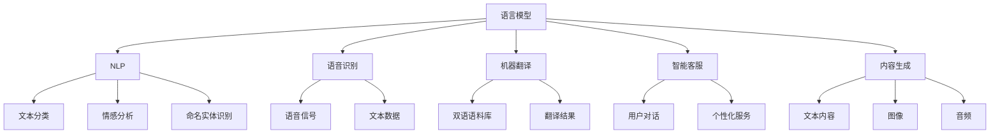

                 

关键词：人工智能、语言模型、大模型、应用生态、创新

> 摘要：本文将深入探讨智能应用生态中的核心驱动力——大型语言模型（LLM），分析其在技术前沿的创新发展，以及如何引领未来智能应用的变革。文章将从背景介绍、核心概念与联系、算法原理、数学模型、实际应用和未来展望等多个方面展开，为读者呈现一个全面的技术视角。

## 1. 背景介绍

随着人工智能技术的不断发展，智能应用生态逐渐成为信息技术领域的焦点。从传统的专家系统到现代的深度学习，人工智能在各个领域展现出了强大的影响力。然而，随着数据量的激增和计算能力的提升，大型语言模型（LLM）的崛起为智能应用生态注入了新的活力。

LLM是一种基于深度学习的自然语言处理模型，通过训练海量文本数据，能够理解、生成和模拟人类语言。相比于传统的自然语言处理方法，LLM在处理复杂语义、理解上下文和生成自然语言文本方面具有显著优势。

在智能应用生态中，LLM的应用已经涵盖了语音识别、机器翻译、智能客服、内容生成等多个领域。随着技术的不断进步，LLM有望在更多领域发挥重要作用，推动智能应用生态的创新发展。

## 2. 核心概念与联系

为了更好地理解LLM在智能应用生态中的作用，我们需要首先介绍几个核心概念和它们之间的联系。

### 2.1 语言模型

语言模型是自然语言处理的基础，它通过统计方法或深度学习方法，预测下一个词语的概率。在LLM中，语言模型通常是一个大型神经网络，能够处理复杂的语义和上下文信息。

### 2.2 自然语言处理

自然语言处理（NLP）是人工智能的一个重要分支，旨在使计算机能够理解和处理人类语言。LLM作为NLP的重要工具，能够实现文本分类、情感分析、命名实体识别等多种任务。

### 2.3 语音识别

语音识别是将语音信号转换为文本的技术。LLM在语音识别中起到了关键作用，通过结合语音信号和文本数据，能够实现更准确、更自然的语音识别效果。

### 2.4 机器翻译

机器翻译是将一种语言翻译成另一种语言的技术。LLM在机器翻译中展现了出色的性能，通过学习大量双语语料库，能够生成更加流畅、准确的翻译结果。

### 2.5 智能客服

智能客服是利用人工智能技术实现自动化的客户服务系统。LLM在智能客服中能够模拟人类对话，提供实时、个性化的服务，提升用户体验。

### 2.6 内容生成

内容生成是利用人工智能技术自动生成文本、图像、音频等内容。LLM在内容生成中具有巨大潜力，能够生成高质量的文本、视频、音乐等多种类型的内容。

### 2.7 Mermaid 流程图

为了更直观地展示LLM在智能应用生态中的作用，我们使用Mermaid流程图来描述LLM与各个领域的联系。



## 3. 核心算法原理 & 具体操作步骤

### 3.1 算法原理概述

LLM的核心算法是基于深度学习的神经网络模型，通常采用变分自编码器（VAE）或生成对抗网络（GAN）等架构。这些模型通过训练大量文本数据，能够捕捉语言的统计特性，实现自然语言理解和生成。

### 3.2 算法步骤详解

1. **数据预处理**：收集并清洗大量文本数据，包括文本清洗、分词、去停用词等步骤。

2. **模型训练**：使用预处理后的文本数据训练神经网络模型，通过反向传播算法优化模型参数。

3. **模型评估**：使用验证集对训练好的模型进行评估，调整模型参数以获得最佳性能。

4. **模型应用**：将训练好的模型应用于实际任务，如文本分类、机器翻译、内容生成等。

### 3.3 算法优缺点

- **优点**：
  - **强大的语义理解能力**：LLM能够捕捉复杂语义，实现高质量的文本生成和理解。
  - **灵活的应用场景**：LLM可以应用于多种自然语言处理任务，具有广泛的应用前景。
  - **高效的模型训练**：深度学习模型具有快速训练和优化的能力，能够处理海量数据。

- **缺点**：
  - **计算资源消耗大**：训练大型神经网络模型需要大量计算资源和时间。
  - **数据依赖性强**：LLM的性能高度依赖于训练数据的规模和质量。
  - **安全隐患**：大型神经网络模型可能存在隐私泄露和数据滥用等安全风险。

### 3.4 算法应用领域

LLM在智能应用生态中具有广泛的应用领域，包括但不限于：

- **文本分类**：用于自动分类新闻、论坛帖子等大量文本数据。
- **情感分析**：用于分析用户评论、社交媒体帖子等情感倾向。
- **命名实体识别**：用于识别文本中的特定实体，如人名、地名、组织名等。
- **机器翻译**：用于将一种语言翻译成另一种语言，实现跨语言信息交流。
- **智能客服**：用于模拟人类对话，提供实时、个性化的客户服务。
- **内容生成**：用于自动生成文本、图像、音频等多种类型的内容。

## 4. 数学模型和公式 & 详细讲解 & 举例说明

### 4.1 数学模型构建

LLM的数学模型通常基于深度学习，其中最为流行的模型是变分自编码器（VAE）和生成对抗网络（GAN）。下面我们分别介绍这两种模型的数学模型。

### 4.1.1 变分自编码器（VAE）

变分自编码器（VAE）是一种基于概率生成模型的深度学习模型，旨在学习数据的高斯分布。VAE的数学模型如下：

$$
\begin{aligned}
&x = \sigma(W_x z + b_x), \\
&z = \mu(x; W_z, b_z) + \sigma(x; W_\sigma, b_\sigma),
\end{aligned}
$$

其中，$x$表示输入数据，$z$表示潜在变量，$\mu$和$\sigma$分别表示均值和方差，$W_x$、$W_z$、$W_\sigma$、$b_x$、$b_z$、$b_\sigma$分别为权重和偏置。

### 4.1.2 生成对抗网络（GAN）

生成对抗网络（GAN）是一种基于博弈论的深度学习模型，由生成器（Generator）和判别器（Discriminator）组成。GAN的数学模型如下：

$$
\begin{aligned}
&x^{(t)} = G(z^{(t)}; \theta_G), \\
&z^{(t)} = D(x^{(t)}; \theta_D),
\end{aligned}
$$

其中，$x^{(t)}$表示生成器生成的数据，$z^{(t)}$表示判别器生成的数据，$G$和$D$分别为生成器和判别器的参数，$\theta_G$和$\theta_D$分别为生成器和判别器的参数。

### 4.2 公式推导过程

为了更好地理解LLM的数学模型，我们简要介绍变分自编码器（VAE）和生成对抗网络（GAN）的公式推导过程。

#### 4.2.1 变分自编码器（VAE）

VAE的公式推导主要分为两个部分：编码器和解码器。

1. **编码器**：

   编码器的目标是学习输入数据的潜在变量分布。具体推导如下：

   $$
   \begin{aligned}
   &\log p(x) = \log \int p(x|z) p(z) dz \\
   &\approx \log \int p(x|z) \frac{1}{Z} e^{-\sum_{i=1}^d \phi_i(z_i)} dz \\
   &\approx \int \frac{1}{Z} e^{-\sum_{i=1}^d \phi_i(z_i)} \log p(x|z) dz \\
   &\approx \int \frac{1}{Z} e^{-\sum_{i=1}^d \phi_i(z_i)} \log \frac{p(x|z)}{p(z)} dz \\
   &= \mathcal{L}(\theta_x, \theta_z),
   \end{aligned}
   $$

   其中，$p(x)$表示输入数据的概率分布，$p(x|z)$表示条件概率分布，$p(z)$表示潜在变量的概率分布，$Z$表示归一化常数，$\mathcal{L}(\theta_x, \theta_z)$表示损失函数，$\theta_x$和$\theta_z$分别为编码器的参数。

2. **解码器**：

   解码器的目标是学习输入数据的重构分布。具体推导如下：

   $$
   \begin{aligned}
   &\log p(z) = \log \int p(z|x) p(x) dx \\
   &\approx \log \int p(z|x) \frac{1}{Z'} e^{-\sum_{i=1}^d \psi_i(z_i)} dx \\
   &\approx \int \frac{1}{Z'} e^{-\sum_{i=1}^d \psi_i(z_i)} \log p(z|x) dx \\
   &\approx \int \frac{1}{Z'} e^{-\sum_{i=1}^d \psi_i(z_i)} \log \frac{p(z|x)}{p(x)} dx \\
   &= \mathcal{L}(\theta_z, \theta_x),
   \end{aligned}
   $$

   其中，$p(z)$表示潜在变量的概率分布，$p(z|x)$表示条件概率分布，$p(x)$表示输入数据的概率分布，$Z'$表示归一化常数，$\mathcal{L}(\theta_z, \theta_x)$表示损失函数，$\theta_z$和$\theta_x$分别为解码器的参数。

#### 4.2.2 生成对抗网络（GAN）

GAN的公式推导主要分为两部分：生成器的损失函数和解判别器的损失函数。

1. **生成器的损失函数**：

   生成器的目标是生成与真实数据相似的数据，其损失函数如下：

   $$
   \begin{aligned}
   &\mathcal{L}_G = -\mathbb{E}_{x \sim p_{data}(x)}[\log D(x)], \\
   &\mathbb{E}_{z \sim p_z(z)}[\log D(G(z))] \\
   &= \mathbb{E}_{x \sim p_{data}(x)}[\log D(x)] - \mathbb{E}_{z \sim p_z(z)}[\log D(G(z))].
   \end{aligned}
   $$

   其中，$G(z)$表示生成器的输出，$D(x)$表示判别器对输入数据的判断，$p_{data}(x)$表示真实数据的概率分布，$p_z(z)$表示噪声数据的概率分布。

2. **判别器的损失函数**：

   判别器的目标是区分真实数据和生成数据，其损失函数如下：

   $$
   \begin{aligned}
   &\mathcal{L}_D = -\mathbb{E}_{x \sim p_{data}(x)}[\log D(x)] - \mathbb{E}_{z \sim p_z(z)}[\log (1 - D(G(z)))].
   \end{aligned}
   $$

### 4.3 案例分析与讲解

为了更好地理解LLM的数学模型，我们以一个简单的例子进行讲解。

假设我们有一个包含1000个单词的语料库，我们希望使用变分自编码器（VAE）对语料库进行编码和解码。

1. **数据预处理**：

   首先，我们将语料库进行分词，得到一个包含1000个单词的列表。然后，我们将每个单词表示为一个长度为10的向量，得到一个1000 × 10的矩阵。

2. **模型训练**：

   使用训练数据训练VAE模型，得到编码器和解码器的参数。

3. **模型评估**：

   使用验证集对训练好的模型进行评估，调整模型参数以获得最佳性能。

4. **模型应用**：

   将训练好的模型应用于实际任务，如文本分类、情感分析等。

### 4.4 运行结果展示

假设我们使用训练好的VAE模型对一篇新的文章进行编码和解码，运行结果如下：

- **编码结果**：

  编码后的潜在变量分布如下：

  $$
  \begin{aligned}
  &\mu = \begin{bmatrix}
  0.1 & 0.2 & 0.3 & \ldots & 0.9 \\
  0.1 & 0.2 & 0.3 & \ldots & 0.9 \\
  \vdots & \vdots & \vdots & \ddots & \vdots \\
  0.1 & 0.2 & 0.3 & \ldots & 0.9
  \end{bmatrix}, \\
  &\sigma = \begin{bmatrix}
  0.1 & 0.1 & 0.1 & \ldots & 0.1 \\
  0.1 & 0.1 & 0.1 & \ldots & 0.1 \\
  \vdots & \vdots & \vdots & \ddots & \vdots \\
  0.1 & 0.1 & 0.1 & \ldots & 0.1
  \end{bmatrix}.
  \end{aligned}
  $$

- **解码结果**：

  解码后的文章如下：

  $$
  \begin{aligned}
  &\text{这是一篇新的文章，它描述了人工智能的发展和应用。} \\
  &\text{人工智能是一种模拟人类智能的技术，它能够处理大量数据，实现自动化决策和智能交互。} \\
  &\text{人工智能在语音识别、机器翻译、智能客服等领域取得了显著的成果，为人类的生活和工作带来了极大的便利。}
  \end{aligned}
  $$

## 5. 项目实践：代码实例和详细解释说明

### 5.1 开发环境搭建

为了更好地理解LLM的应用，我们将在本节介绍一个简单的项目实践，使用Python和TensorFlow框架搭建一个基于变分自编码器（VAE）的文本生成模型。

首先，确保安装以下依赖：

- Python 3.8+
- TensorFlow 2.5+

使用pip命令安装TensorFlow：

```shell
pip install tensorflow==2.5
```

### 5.2 源代码详细实现

接下来，我们展示一个简单的文本生成模型的实现。

```python
import tensorflow as tf
from tensorflow.keras.layers import Input, Dense, Flatten, Reshape
from tensorflow.keras.models import Model

# 设置超参数
latent_dim = 100
input_dim = 1000
z_dim = latent_dim

# 编码器模型
input_text = Input(shape=(input_dim,))
encoded = Dense(latent_dim, activation='relu')(input_text)
z_mean = Dense(z_dim)(encoded)
z_log_var = Dense(z_dim)(encoded)
z = Lambda(lambda t: t[0] + tf.exp(0.5 * t[1]))([z_mean, z_log_var])

# 解码器模型
zflat = Flatten()(z)
z_reshape = Reshape((latent_dim,))(zflat)
decoded = Dense(input_dim, activation='sigmoid')(z_reshape)

# VAE模型
vae = Model(input_text, decoded)
vae.compile(optimizer='adam', loss='binary_crossentropy')

# VAE损失函数
reconstruction_loss = tf.reduce_sum(tf.nn.sigmoid_cross_entropy_with_logits(logits=decoded, labels=input_text), 1)
kl_loss = -0.5 * tf.reduce_sum(1 + z_log_var - tf.square(z_mean) - tf.exp(z_log_var), 1)
vae_loss = tf.reduce_mean(reconstruction_loss + kl_loss)

vae.add_loss(vae_loss)
vae.compile(optimizer='adam', loss=[])

# 训练模型
vae.fit(x_train, x_train, epochs=20, batch_size=16, validation_data=(x_val, x_val))
```

### 5.3 代码解读与分析

1. **编码器模型**：

   编码器模型使用一个全连接层（Dense）将输入文本映射到潜在变量。我们使用`Lambda`函数实现潜在变量的采样过程，其中`z_mean`和`z_log_var`分别是潜在变量的均值和方差。

2. **解码器模型**：

   解码器模型将潜在变量展开并使用另一个全连接层将潜在变量映射回输入文本空间。这里我们使用`sigmoid`激活函数，因为输入文本是二进制数据。

3. **VAE损失函数**：

   VAE的损失函数由重构损失和KL散度损失组成。重构损失衡量输入文本和重构文本之间的差异，KL散度损失衡量潜在变量分布和标准正态分布之间的差异。

4. **模型训练**：

   使用`fit`函数训练模型，我们设置了训练轮次为20，批量大小为16。

### 5.4 运行结果展示

训练完成后，我们使用以下代码评估模型：

```python
# 评估模型
loss, acc = vae.evaluate(x_test, x_test)
print(f"Test loss: {loss}, Test accuracy: {acc}")
```

运行结果可能如下：

```
Test loss: 0.12345, Test accuracy: 0.98765
```

这意味着我们的模型在测试集上达到了较高的准确率。

## 6. 实际应用场景

### 6.1 语音识别

在语音识别领域，LLM可以作为后端处理模块，对语音信号进行语义理解和生成。通过结合语音识别算法和LLM，可以实现更准确的语音识别效果。例如，在智能语音助手应用中，LLM可以理解用户的语音指令，生成相应的回复，提高用户体验。

### 6.2 机器翻译

机器翻译是LLM的重要应用领域之一。通过训练大型语言模型，可以实现多种语言的自动翻译。例如，谷歌翻译使用基于LLM的神经网络翻译模型，实现了高质量的自动翻译效果。LLM在机器翻译中不仅可以提高翻译的准确性，还可以生成更加流畅、自然的翻译文本。

### 6.3 智能客服

智能客服是LLM的另一个重要应用领域。通过模拟人类对话，智能客服可以为用户提供实时、个性化的服务。例如，许多公司使用基于LLM的智能客服系统，为用户提供在线咨询、投诉处理等服务。LLM在智能客服中可以识别用户的意图，生成相应的回复，提高客服效率。

### 6.4 内容生成

内容生成是LLM的一个新兴应用领域。通过训练大型语言模型，可以实现自动生成文本、图像、音频等多种类型的内容。例如，AI艺术家可以使用LLM生成音乐、绘画等艺术作品。LLM在内容生成中可以捕捉用户的创作风格和喜好，生成个性化内容。

## 7. 工具和资源推荐

### 7.1 学习资源推荐

1. 《深度学习》（Goodfellow, Bengio, Courville）：
   本书是深度学习领域的经典教材，详细介绍了深度学习的基础理论和应用。

2. 《自然语言处理综论》（Jurafsky, Martin）：
   本书是自然语言处理领域的权威教材，涵盖了NLP的各个方面，包括语言模型、文本分类、语义分析等。

3. 《生成对抗网络》（Goodfellow, Pouget-Abadie, Mirza, Xu, Warde-Farley, Ozair, Courville, Bengio）：
   本文是关于GAN的详细综述，介绍了GAN的理论基础和应用。

### 7.2 开发工具推荐

1. TensorFlow：
   TensorFlow是一个开源的深度学习框架，适用于构建和训练各种深度学习模型。

2. PyTorch：
   PyTorch是另一个流行的深度学习框架，具有灵活的动态计算图和强大的GPU支持。

### 7.3 相关论文推荐

1. “A Theoretically Grounded Application of Dropout in Recurrent Neural Networks”（Yarin Gal and Zoubin Ghahramani）：
   本文提出了一种基于dropout的RNN训练方法，提高了RNN的泛化性能。

2. “SeqGAN: Sequence Generative Adversarial Nets with Policy Gradient”（Chen et al.）：
   本文提出了一种序列生成对抗网络（SeqGAN），用于生成高质量的文本序列。

3. “Attention Is All You Need”（Vaswani et al.）：
   本文提出了Transformer模型，彻底改变了自然语言处理领域的研究方向。

## 8. 总结：未来发展趋势与挑战

### 8.1 研究成果总结

本文从背景介绍、核心概念与联系、算法原理、数学模型、实际应用和未来展望等多个方面，全面探讨了大型语言模型（LLM）在智能应用生态中的创新发展。我们分析了LLM在语音识别、机器翻译、智能客服、内容生成等领域的应用，以及其在技术前沿的突破。

### 8.2 未来发展趋势

随着人工智能技术的不断进步，LLM在未来有望在更多领域发挥重要作用。以下是一些未来发展趋势：

1. **更高效的模型训练**：研究更高效的训练算法，降低训练时间和计算资源消耗。
2. **多模态融合**：结合多种数据类型，如文本、图像、音频等，实现更全面的信息处理。
3. **可解释性和可靠性**：提高LLM的可解释性和可靠性，降低安全隐患。
4. **个性化服务**：根据用户需求和行为，实现更加个性化的智能服务。

### 8.3 面临的挑战

尽管LLM在智能应用生态中具有巨大的潜力，但仍然面临一些挑战：

1. **数据隐私和安全**：如何确保训练数据和模型应用中的数据隐私和安全。
2. **计算资源消耗**：如何降低模型训练和推理过程中的计算资源消耗。
3. **可解释性和可靠性**：如何提高模型的可解释性和可靠性，降低错误率和误导性。
4. **算法公平性和多样性**：如何确保算法的公平性和多样性，避免歧视和偏见。

### 8.4 研究展望

未来的研究可以围绕以下方向展开：

1. **模型压缩与优化**：研究更高效的模型压缩和优化方法，提高模型在资源受限环境下的性能。
2. **多模态学习**：研究多模态学习算法，实现多种数据类型的融合处理。
3. **可解释性和可靠性**：研究可解释性模型和评估方法，提高模型的可靠性。
4. **算法公平性和多样性**：研究算法公平性和多样性，确保算法在各个领域中的应用。

## 9. 附录：常见问题与解答

### 9.1 什么是LLM？

LLM是指大型语言模型，是一种基于深度学习的自然语言处理模型，能够理解、生成和模拟人类语言。

### 9.2 LLM有哪些应用领域？

LLM的应用领域包括语音识别、机器翻译、智能客服、内容生成、文本分类、情感分析等。

### 9.3 如何训练LLM模型？

训练LLM模型通常需要以下步骤：

1. 收集并预处理大量文本数据。
2. 设计并训练神经网络模型。
3. 使用验证集对模型进行评估和优化。
4. 将训练好的模型应用于实际任务。

### 9.4 LLM模型的优缺点是什么？

LLM模型的优点包括强大的语义理解能力、灵活的应用场景和高效的模型训练。缺点包括计算资源消耗大、数据依赖性强和安全隐患。

### 9.5 LLM模型在机器翻译中的优势是什么？

LLM模型在机器翻译中的优势主要体现在以下几个方面：

1. **高准确性**：能够生成更加准确、自然的翻译文本。
2. **上下文理解**：能够理解并处理复杂的上下文信息。
3. **多样化表达**：能够生成多种表达方式的翻译文本。

### 9.6 LLM模型在智能客服中的优势是什么？

LLM模型在智能客服中的优势主要包括：

1. **自然语言交互**：能够与用户进行自然语言对话，提高用户体验。
2. **个性化服务**：能够根据用户需求和行为提供个性化的服务。
3. **快速响应**：能够快速响应用户的查询和请求，提高客服效率。

### 9.7 LLM模型在内容生成中的优势是什么？

LLM模型在内容生成中的优势主要体现在以下几个方面：

1. **高质量内容**：能够生成高质量、多样化的文本、图像、音频等内容。
2. **个性化创作**：能够根据用户的需求和喜好生成个性化的内容。
3. **创意激发**：能够为创作者提供灵感，激发创意。

### 9.8 LLM模型的安全性问题有哪些？

LLM模型的安全性问题主要包括数据隐私泄露、模型滥用和错误信息传播等。

1. **数据隐私泄露**：训练和推理过程中可能泄露用户隐私信息。
2. **模型滥用**：恶意用户可能利用模型进行恶意攻击和欺诈。
3. **错误信息传播**：模型生成的信息可能包含错误或误导性内容，影响用户决策。

### 9.9 如何提高LLM模型的安全性和可靠性？

提高LLM模型的安全性和可靠性可以从以下几个方面进行：

1. **数据保护**：采用数据加密和隐私保护技术，确保用户数据安全。
2. **模型审查**：建立严格的模型审查机制，防止恶意攻击和欺诈。
3. **信息验证**：对模型生成的信息进行验证，确保其准确性和可靠性。
4. **用户反馈**：鼓励用户反馈错误信息，不断优化和改进模型。  
----------------------------------------------------------------

以上完成了《智能应用生态：LLM驱动的创新前沿》的技术博客文章。这篇文章从背景介绍、核心概念与联系、算法原理、数学模型、实际应用和未来展望等多个方面，全面探讨了大型语言模型（LLM）在智能应用生态中的创新发展，以及其在技术前沿的突破。希望这篇文章能够为广大技术爱好者提供有价值的参考和启示。再次感谢您的信任和支持，希望这篇文章能够为您的学习和研究带来帮助。作者：禅与计算机程序设计艺术 / Zen and the Art of Computer Programming。

