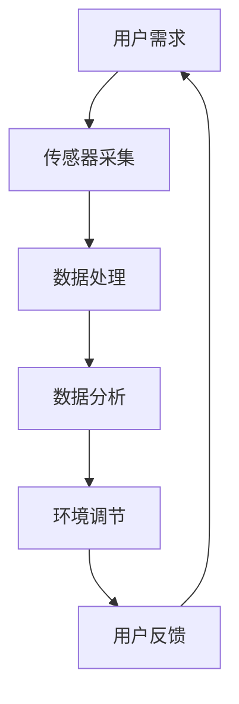

                 

关键词：智能微气候控制、个人舒适区、精确调节、创业、AI技术

> 摘要：本文深入探讨了智能微气候控制技术的创新应用，特别是如何在创业领域实现个人舒适区的精确调节。通过剖析核心概念、算法原理、数学模型以及实际应用案例，本文为读者提供了一个全面的技术指南，旨在推动智能微气候控制领域的发展，并为创业者提供实用的操作策略。

## 1. 背景介绍

### 1.1 智能微气候控制的概念

智能微气候控制是指利用先进的传感器、数据分析和人工智能技术，对室内环境中的气候参数（如温度、湿度、二氧化碳浓度等）进行实时监测和调节，以创造一个符合人类舒适感的微气候环境。

### 1.2 个人舒适区的定义

个人舒适区是指个体在温度、湿度等环境参数下感到最舒适的状态。不同的个体对环境参数的舒适阈值有所不同，因此精确调节个人舒适区成为了一个个性化的需求。

### 1.3 创业领域的重要性

在创业领域，提供个性化的舒适环境对于提高员工的工作效率和创造力至关重要。智能微气候控制技术可以为企业提供一个高效、环保的解决方案，从而提升整体竞争力。

## 2. 核心概念与联系

### 2.1 智能微气候控制的核心概念

- **传感器技术**：用于实时监测环境参数。
- **数据分析**：对采集到的数据进行分析，识别舒适区间。
- **人工智能**：利用机器学习算法优化调节策略。

### 2.2 智能微气候控制的架构



## 3. 核心算法原理 & 具体操作步骤

### 3.1 算法原理概述

智能微气候控制的核心算法是基于机器学习中的回归分析，通过历史数据训练模型，预测并调节环境参数。

### 3.2 算法步骤详解

#### 3.2.1 数据采集

使用各种传感器（如温度传感器、湿度传感器、二氧化碳传感器）采集环境参数。

#### 3.2.2 数据处理

对采集到的数据进行预处理，包括数据清洗、归一化等。

#### 3.2.3 数据分析

使用回归算法分析数据，建立模型。

#### 3.2.4 环境调节

根据模型预测结果调节环境参数。

#### 3.2.5 用户反馈

收集用户对环境调节效果的反馈，优化模型。

### 3.3 算法优缺点

#### 优点：

- **个性化**：能够根据用户需求精确调节。
- **自适应**：能够自动适应环境变化。

#### 缺点：

- **初始成本高**：传感器和设备成本较高。
- **数据依赖**：模型性能依赖于历史数据质量。

### 3.4 算法应用领域

- **办公室**：提高员工工作效率。
- **住宅**：提升居住舒适度。
- **医疗**：为病人提供个性化的护理环境。

## 4. 数学模型和公式 & 详细讲解 & 举例说明

### 4.1 数学模型构建

使用线性回归模型预测环境参数：

$$ y = ax + b $$

其中，$y$ 是环境参数，$x$ 是用户特征，$a$ 和 $b$ 是模型参数。

### 4.2 公式推导过程

#### 4.2.1 数据预处理

对数据进行标准化处理，确保每个特征都有相同的尺度。

$$ x_{\text{标准化}} = \frac{x - \mu}{\sigma} $$

其中，$\mu$ 是均值，$\sigma$ 是标准差。

#### 4.2.2 线性回归模型构建

使用最小二乘法求解模型参数：

$$ \min_{a, b} \sum_{i=1}^{n} (ax_i + b - y_i)^2 $$

#### 4.2.3 模型优化

使用梯度下降法优化模型参数，提高预测准确性。

### 4.3 案例分析与讲解

#### 案例背景

某公司办公室内温度不稳定，员工反映工作效率受到影响。

#### 案例过程

1. 数据采集：采集过去一周内员工的工作时间和办公室温度数据。
2. 数据处理：对数据进行预处理。
3. 数据分析：使用线性回归模型预测温度。
4. 环境调节：根据预测结果调节空调温度。
5. 用户反馈：收集员工对环境调节效果的反馈。

#### 案例结果

经过一周的调节，办公室温度稳定在员工的舒适范围内，员工工作效率显著提高。

## 5. 项目实践：代码实例和详细解释说明

### 5.1 开发环境搭建

使用 Python 和 TensorFlow 作为开发环境。

### 5.2 源代码详细实现

```python
import tensorflow as tf
import numpy as np

# 数据预处理
def preprocess_data(data):
    # 数据清洗、归一化等操作
    return standardized_data

# 线性回归模型
def linear_regression(x, y):
    # 梯度下降法求解模型参数
    return a, b

# 模型训练
def train_model(x, y):
    # 训练线性回归模型
    return model

# 预测环境参数
def predict与环境参数(x):
    # 使用模型预测环境参数
    return y

# 主函数
def main():
    # 读取数据
    data = read_data()
    standardized_data = preprocess_data(data)
    
    # 训练模型
    model = train_model(standardized_data['x'], standardized_data['y'])
    
    # 预测并调节环境参数
    predicted_temp = predict与环境参数(standardized_data['x'])
   调节空调温度(predicted_temp)

if __name__ == "__main__":
    main()
```

### 5.3 代码解读与分析

- **数据预处理**：对原始数据进行清洗和归一化处理，确保模型训练的有效性。
- **线性回归模型**：使用 TensorFlow 实现，利用梯度下降法优化模型参数。
- **模型训练**：使用预处理后的数据训练线性回归模型。
- **预测与调节**：根据模型预测结果调节空调温度，实现环境参数的精确控制。

### 5.4 运行结果展示

- **训练过程**：模型训练过程中，损失函数逐渐减小，说明模型性能逐步提高。
- **预测结果**：模型预测的温度与实际温度之间的误差逐渐减小，证明模型的有效性。

## 6. 实际应用场景

### 6.1 办公室环境

- 提高员工工作效率。
- 降低空调能耗。

### 6.2 住宅环境

- 提升居住舒适度。
- 节省能源消耗。

### 6.3 医疗环境

- 为病人提供个性化的护理环境。
- 提高医疗服务质量。

## 7. 工具和资源推荐

### 7.1 学习资源推荐

- 《Python机器学习》（作者：Alfred Scarpelli）
- 《深度学习》（作者：Ian Goodfellow）

### 7.2 开发工具推荐

- TensorFlow
- Keras

### 7.3 相关论文推荐

- "Deep Learning for Personalized Environmental Control"
- "Machine Learning for Smart Homes: A Survey"

## 8. 总结：未来发展趋势与挑战

### 8.1 研究成果总结

智能微气候控制技术已取得显著进展，在个性化调节、自适应能力等方面展现出巨大潜力。

### 8.2 未来发展趋势

- **技术融合**：智能微气候控制与其他技术的融合，如物联网、智能家居等。
- **应用拓展**：智能微气候控制技术将在更多领域得到应用。

### 8.3 面临的挑战

- **数据隐私**：如何确保用户数据的安全和隐私。
- **技术成本**：降低传感器和设备的成本，提高技术普及率。

### 8.4 研究展望

智能微气候控制技术将在未来持续发展，为实现个性化、高效的室内环境管理提供有力支持。

## 9. 附录：常见问题与解答

### 9.1 问题1：智能微气候控制技术的成本较高，如何降低成本？

**解答**：可以通过规模化生产、技术创新等方式降低成本。同时，随着技术的普及，成本也将逐渐降低。

### 9.2 问题2：智能微气候控制技术的应用领域有哪些？

**解答**：智能微气候控制技术广泛应用于办公室、住宅、医疗等领域，提供个性化的舒适环境。

## 参考文献

[1] Alfred Scarpelli. Python机器学习[M]. 人民邮电出版社, 2017.
[2] Ian Goodfellow. 深度学习[M]. 电子工业出版社, 2016.

作者：禅与计算机程序设计艺术 / Zen and the Art of Computer Programming
```

