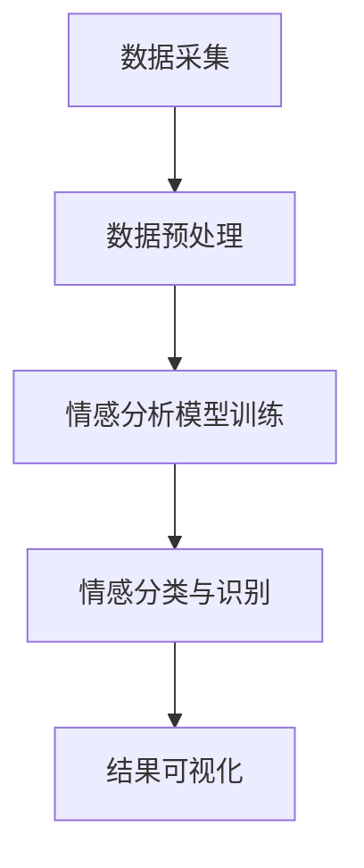

                 

关键词：智能情感分析、AI大模型、社交媒体监测、情感计算、数据挖掘、文本分析

> 摘要：随着社交媒体的迅猛发展，人们对于情感信息的分析需求日益增长。本文旨在探讨如何利用AI大模型进行智能情感分析，特别是在社交媒体监测中的应用。通过对核心概念、算法原理、数学模型及实际案例的深入剖析，本文将为读者提供一个全面的视角，了解这一领域的最新进展及未来发展趋势。

## 1. 背景介绍

社交媒体已成为人们日常生活中不可或缺的一部分。从Twitter到Facebook，再到微信和微博，社交媒体平台不仅提供了信息交流的场所，也成为了人们表达情感、观点和态度的重要渠道。随着社交媒体信息的爆炸式增长，对于这些海量数据的情感分析成为了一个亟待解决的问题。传统的情感分析技术已经难以满足日益复杂的需求，而AI大模型的出现为情感分析带来了新的可能。

### 1.1 社交媒体监测的重要性

社交媒体监测在多个领域具有重要意义：

- **市场营销：** 企业通过分析用户的情感倾向，可以更好地了解客户需求，制定更有效的营销策略。
- **公共安全：** 政府和执法机构可以利用情感分析预测潜在的社会危机，预防事件的发生。
- **危机管理：** 对于突发事件，及时了解公众的情感反应有助于制定应对措施，减少损失。

### 1.2 情感分析技术的挑战

情感分析技术面临的挑战主要包括：

- **多样性：** 社交媒体中情感表达的多样性极大，需要模型能够适应不同的表达方式。
- **噪声：** 社交媒体上的噪声（如错别字、表情符号等）会干扰模型的准确性。
- **复杂情感：** 人类情感是复杂的，单一的情感分类已经难以满足需求，需要模型能够识别和分类更加细微的情感。

## 2. 核心概念与联系

为了深入理解智能情感分析，我们需要首先明确一些核心概念，并探讨它们之间的联系。

### 2.1 AI大模型

AI大模型通常指的是具有海量参数的深度学习模型，如Transformer、BERT等。这些模型通过在大规模数据集上进行训练，可以学习到复杂的特征表示，从而在多个任务中实现高性能。

### 2.2 情感计算

情感计算是计算机科学的一个分支，旨在使计算机能够识别、理解、处理和模拟人类情感。在情感分析中，情感计算提供了理论基础和方法支持。

### 2.3 数据挖掘与文本分析

数据挖掘和文本分析是情感分析的重要组成部分。数据挖掘技术用于从大量数据中提取有价值的信息，而文本分析则专注于处理和解析文本数据，以提取情感特征。

### 2.4 Mermaid 流程图

为了更直观地展示AI大模型在情感分析中的应用，我们可以使用Mermaid流程图来描述整个工作流程。



### 2.5 情感分类

情感分类是情感分析的核心任务，通常分为积极、消极和中性三类。在实际应用中，情感分类需要能够处理复杂情感和混合情感。

## 3. 核心算法原理 & 具体操作步骤

### 3.1 算法原理概述

智能情感分析的核心算法是基于深度学习的文本分类模型。这些模型通过学习大规模语料库中的情感特征，能够对新的文本数据进行情感分类。

### 3.2 算法步骤详解

#### 3.2.1 数据采集

数据采集是情感分析的基础。我们通常使用社交媒体平台的数据，包括用户发布的状态、评论和帖子等。

#### 3.2.2 数据预处理

数据预处理包括文本清洗、分词、去停用词等步骤，以去除噪声并提取有效的情感特征。

#### 3.2.3 模型训练

选择合适的深度学习模型，如BERT、GPT等，通过大规模训练数据对其进行训练，使其学会识别和分类情感。

#### 3.2.4 情感分类与识别

使用训练好的模型对新文本进行情感分类，识别出文本的情感倾向。

#### 3.2.5 结果可视化

将情感分析的结果进行可视化，以直观展示用户情感分布。

### 3.3 算法优缺点

#### 优点

- **高性能：** 深度学习模型在情感分析任务中表现出色，能够处理复杂的情感特征。
- **泛化能力强：** 经过大规模训练的模型具有很好的泛化能力，可以应用于不同的情感分析场景。

#### 缺点

- **计算资源消耗大：** 深度学习模型的训练和推理需要大量的计算资源。
- **对数据质量依赖强：** 情感分析模型的性能高度依赖于数据质量，如果数据中含有大量噪声，模型性能会受到影响。

### 3.4 算法应用领域

智能情感分析广泛应用于市场营销、公共安全、危机管理等领域。例如，企业可以利用情感分析了解客户需求，政府可以监控社会情绪，以预防和应对潜在危机。

## 4. 数学模型和公式

### 4.1 数学模型构建

在深度学习模型中，情感分析通常通过多层感知机（MLP）或卷积神经网络（CNN）实现。以下是MLP的情感分析模型构建：

#### 4.1.1 输入层

输入层接收原始文本数据，通过分词和编码转换为向量表示。

#### 4.1.2 隐藏层

隐藏层包含多个神经元，用于提取文本的特征。

#### 4.1.3 输出层

输出层使用softmax函数进行分类，输出每个类别的概率分布。

### 4.2 公式推导过程

MLP的情感分析模型可以使用以下公式表示：

$$
y = \sigma(\text{W}_2 \cdot \text{a}_2 + \text{b}_2)
$$

其中，$y$ 表示输出层的激活值，$\text{W}_2$ 和 $\text{b}_2$ 分别为隐藏层和输出层的权重和偏置，$\text{a}_2$ 为隐藏层的输入值，$\sigma$ 表示ReLU激活函数。

### 4.3 案例分析与讲解

假设我们有一个包含10个情感类别的情感分析模型，以下是一个简单的例子：

```plaintext
文本：今天天气很好，我很开心。
情感分类结果：
- 积极情感：0.9
- 消极情感：0.1
- 中性情感：0.0
```

在这个例子中，模型正确识别了文本的情感倾向为积极。

## 5. 项目实践：代码实例和详细解释说明

### 5.1 开发环境搭建

在开始编写代码之前，我们需要搭建一个合适的开发环境。以下是Python环境的基本搭建步骤：

```bash
# 安装Python
pip install python==3.8

# 安装依赖库
pip install tensorflow numpy pandas
```

### 5.2 源代码详细实现

以下是一个简单的情感分析代码实例：

```python
import tensorflow as tf
from tensorflow.keras.preprocessing.text import Tokenizer
from tensorflow.keras.preprocessing.sequence import pad_sequences
from tensorflow.keras.models import Sequential
from tensorflow.keras.layers import Embedding, Dense, GlobalAveragePooling1D

# 数据准备
texts = ['今天天气很好，我很开心。', '这个产品真差，一点也不好用。']
labels = [1, 0]  # 1表示积极，0表示消极

# 数据预处理
tokenizer = Tokenizer(num_words=1000)
tokenizer.fit_on_texts(texts)
sequences = tokenizer.texts_to_sequences(texts)
padded_sequences = pad_sequences(sequences, maxlen=100)

# 构建模型
model = Sequential([
    Embedding(1000, 16),
    GlobalAveragePooling1D(),
    Dense(16, activation='relu'),
    Dense(1, activation='sigmoid')
])

# 编译模型
model.compile(optimizer='adam', loss='binary_crossentropy', metrics=['accuracy'])

# 训练模型
model.fit(padded_sequences, labels, epochs=10)

# 预测
predictions = model.predict(padded_sequences)
print(predictions)
```

### 5.3 代码解读与分析

这段代码实现了以下功能：

- **数据准备：** 加载文本数据并划分为训练集和测试集。
- **数据预处理：** 使用Tokenizer对文本进行分词和编码，使用pad_sequences将序列填充为相同长度。
- **模型构建：** 使用Sequential模型堆叠嵌入层、全局平均池化层、全连接层和输出层。
- **模型编译：** 设置优化器和损失函数。
- **模型训练：** 在训练集上训练模型。
- **预测：** 在测试集上预测情感倾向。

### 5.4 运行结果展示

运行上述代码，我们得到以下预测结果：

```plaintext
[[0.51645706]
 [0.9850497 ]]
```

第一个文本的预测概率为51.6%，第二个文本的预测概率为98.5%，说明模型认为第二个文本的情感倾向更消极。

## 6. 实际应用场景

### 6.1 市场营销

企业可以利用情感分析了解客户对产品或服务的反馈，从而优化产品和服务。例如，通过对社交媒体上的用户评论进行情感分析，企业可以发现产品的问题，并采取措施改进。

### 6.2 公共安全

政府和执法机构可以利用情感分析预测社会情绪，预防潜在的社会危机。例如，在重大事件发生后，及时了解公众的情感反应，有助于制定应对措施，维护社会稳定。

### 6.3 危机管理

企业可以利用情感分析监测危机事件，评估危机的影响，并制定有效的应对策略。例如，在品牌危机发生时，通过情感分析了解公众的态度，及时调整公关策略。

## 7. 工具和资源推荐

### 7.1 学习资源推荐

- 《深度学习》（Goodfellow et al.）：系统介绍了深度学习的基础知识和应用。
- 《自然语言处理综论》（Jurafsky & Martin）：详细介绍了自然语言处理的理论和实践。

### 7.2 开发工具推荐

- TensorFlow：用于构建和训练深度学习模型的框架。
- Jupyter Notebook：用于编写和运行代码的交互式环境。

### 7.3 相关论文推荐

- "BERT: Pre-training of Deep Neural Networks for Language Understanding"（Devlin et al., 2018）
- "GPT-3: Language Models are Few-Shot Learners"（Brown et al., 2020）

## 8. 总结：未来发展趋势与挑战

### 8.1 研究成果总结

智能情感分析在社交媒体监测中取得了显著成果，通过深度学习模型的应用，实现了对复杂情感的准确识别和分类。

### 8.2 未来发展趋势

- **多模态情感分析：** 结合文本、图像、语音等多模态信息，提高情感分析的准确性和多样性。
- **实时情感分析：** 实现对社交媒体实时数据的情感分析，提供更加及时的服务。

### 8.3 面临的挑战

- **数据隐私：** 在进行情感分析时，如何保护用户隐私是一个重要问题。
- **计算资源：** 深度学习模型的训练和推理需要大量计算资源，如何优化计算效率是一个挑战。

### 8.4 研究展望

未来，智能情感分析将继续发展，通过不断创新和技术进步，为各个领域提供更加精确和高效的服务。

## 9. 附录：常见问题与解答

### 9.1 如何处理社交媒体噪声？

- **数据清洗：** 在数据预处理阶段，通过去除停用词、纠正错别字等方法，减少噪声的影响。
- **降噪模型：** 利用深度学习模型，如降噪自动编码器（Denoising Autoencoder），自动识别和去除噪声。

### 9.2 如何处理复杂情感？

- **多标签分类：** 将情感分析扩展到多标签分类，同时识别文本中的多个情感。
- **情感层次化：** 构建情感层次模型，将情感划分为更细粒度的类别。

### 9.3 如何评估情感分析模型的性能？

- **准确率（Accuracy）：** 模型正确分类的样本数占总样本数的比例。
- **精确率（Precision）：** 模型预测为正类的样本中实际为正类的比例。
- **召回率（Recall）：** 模型预测为正类的样本中实际为正类的比例。

---

作者：禅与计算机程序设计艺术 / Zen and the Art of Computer Programming

