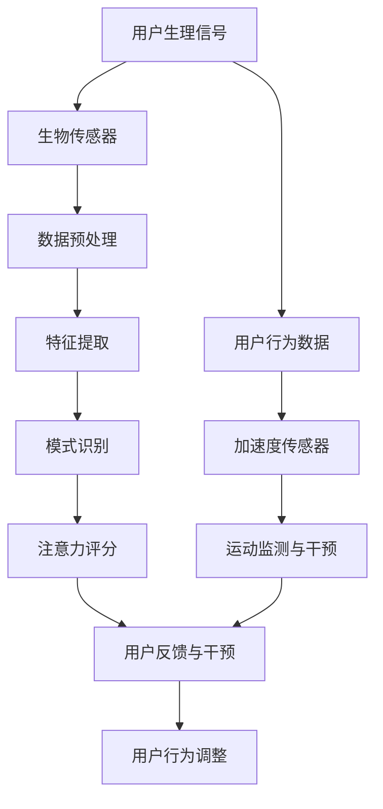
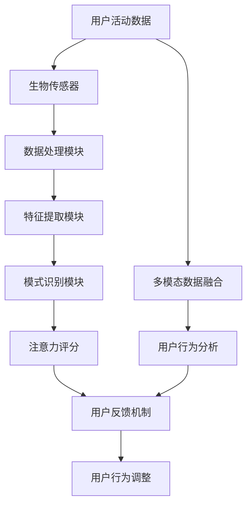

                 

随着科技的飞速发展，智能手表已经成为现代人生活不可或缺的一部分。它们不仅仅是一个简单的计时工具，更是连接身体与智能设备的桥梁。在众多功能中，注意力管理成为了一个备受关注的话题。本文将深入探讨智能手表在注意力管理中的应用，旨在为广大用户提供一个全面而深入的视角。

## 关键词：智能手表，注意力管理，生物传感，用户行为分析，多模态交互

### 摘要

注意力管理是指通过科学方法和工具，帮助个体在特定任务中集中注意力，提高工作和学习效率。智能手表作为一种便携式设备，通过整合先进的生物传感技术和用户行为分析算法，正在成为注意力管理的有力工具。本文将从智能手表的基本概念入手，逐步深入探讨其在注意力管理中的应用，包括核心概念与联系、核心算法原理、数学模型和公式、项目实践以及未来展望。

## 1. 背景介绍

注意力管理是一项重要的研究领域，旨在通过理解个体注意力的工作机制，提高其集中度、稳定性和转移能力。随着信息技术的普及，人们面临着越来越多的分心和干扰，注意力管理的重要性愈发凸显。传统的注意力管理方法往往依赖于外部设备和人工干预，而智能手表的出现为这一领域带来了新的机遇。

智能手表是集成了多种传感器和计算能力的便携式设备，常见的功能包括时间显示、短信接收、健康管理、运动监测等。近年来，随着生物传感技术的进步，智能手表在注意力管理中的应用逐渐成为研究热点。通过实时监测用户的心率、皮肤电导、加速度等生理信号，智能手表能够提供对用户注意力的实时反馈和干预。

### 1.1 智能手表的发展历程

智能手表的概念最早可以追溯到20世纪60年代，当时的一些实验性项目尝试将计算设备集成到手表中。然而，由于技术的限制，这些早期的尝试并未得到广泛应用。

进入21世纪，随着微电子技术、无线通信和传感器技术的发展，智能手表开始进入快速发展阶段。2000年代初，一些公司推出了基于PDA（个人数字助理）技术的智能手表，这些手表具备简单的计算和通信功能。然而，由于体积较大、电池续航短等问题，市场反响并不热烈。

随着智能手机的普及，智能手表迎来了新的发展机遇。2010年代，苹果、三星等科技巨头相继推出智能手表产品，这些产品不仅具备丰富的功能，还通过优化设计提高了电池续航能力。同时，智能手表的生态系统也逐渐完善，包括应用程序商店、开发者社区等。

### 1.2 注意力管理的重要性

注意力管理在现代社会中具有至关重要的意义。随着互联网和信息技术的快速发展，人们面临着前所未有的信息过载和干扰。研究表明，平均每天人们会接触到超过10000条信息，而人类的注意力集中时间却仅有大约20分钟。这意味着，在信息泛滥的时代，如何有效地管理注意力成为了一项重要的挑战。

有效的注意力管理不仅能够提高工作和学习效率，还能改善心理健康和生活质量。通过科学的方法和工具，个体能够更好地集中注意力，提高任务的完成质量，减少错误和遗漏。此外，注意力管理还能帮助个体更好地应对压力和焦虑，提升整体幸福感。

智能手表作为一种便携式设备，通过集成生物传感技术和用户行为分析算法，为注意力管理提供了一种新的解决方案。通过实时监测用户的生理和行为信号，智能手表能够为用户提供个性化的注意力反馈和干预，帮助他们更好地管理自己的注意力资源。

### 1.3 智能手表在注意力管理中的应用现状

当前，智能手表在注意力管理中的应用已经取得了一些初步成果。一些研究表明，通过实时监测用户的心率、皮肤电导和加速度等生理信号，智能手表能够有效识别用户的注意力状态，并提供相应的反馈和干预。

例如，有些智能手表能够通过心率变异性（HRV）来评估用户的注意力水平。心率变异性是心率间期变化的一种衡量指标，它与神经系统的活动密切相关。当用户注意力集中时，心率变异性通常会增加，而当用户分心时，心率变异性则会降低。

此外，一些智能手表还具备运动监测功能，能够通过加速度传感器监测用户的身体运动情况。当用户进行与任务无关的活动时，智能手表可以提醒用户重新集中注意力。这种多模态的监测方法能够更全面地了解用户的注意力状态，提高干预的准确性。

尽管智能手表在注意力管理中展示出了巨大的潜力，但同时也面临着一些挑战。例如，如何提高监测的准确性和可靠性、如何设计更直观的用户交互界面等。未来，随着技术的不断进步，智能手表在注意力管理中的应用将会更加广泛和深入。

### 1.4 本文结构

本文将围绕智能手表在注意力管理中的应用展开讨论。首先，我们将介绍智能手表的基本原理和核心概念，并通过Mermaid流程图展示其工作流程。接着，我们将详细探讨核心算法原理和具体操作步骤，并分析算法的优缺点及其应用领域。随后，我们将引入数学模型和公式，并举例说明其在实际中的应用。此外，本文还将提供智能手表在注意力管理项目中的代码实例和详细解释。最后，我们将探讨智能手表在注意力管理中的实际应用场景，并对未来应用前景进行展望。通过本文的阅读，读者将对智能手表在注意力管理中的应用有一个全面而深入的了解。

### 1.5 智能手表的基本原理

智能手表的基本原理主要依赖于其内部集成的多种传感器和先进的计算技术。这些传感器包括生物传感器、加速度传感器、磁力计、陀螺仪等，它们共同作用，为智能手表提供了丰富的数据源。

#### 1.5.1 生物传感器

生物传感器是智能手表的核心组件之一，用于监测用户的生理信号。常见的心率传感器、皮肤电导传感器和血压传感器等，能够实时捕捉用户的心跳、皮肤电导和血压等数据。这些数据对于评估用户的注意力和生理状态至关重要。

心率传感器通常采用光电容积脉搏图（PPG）技术，通过发射红外光照射用户的手指或手腕，测量血液流动的变化，从而推算出心率。皮肤电导传感器则通过测量皮肤表面电阻的变化来评估用户的紧张程度和注意力集中度。这些生理信号数据可以被智能手表实时处理，用于生成注意力评分和提供干预建议。

#### 1.5.2 加速度传感器

加速度传感器用于监测用户的身体运动情况，能够检测用户的步数、运动轨迹和运动强度。智能手表通过加速度传感器捕捉用户的运动数据，结合用户的日常活动和任务类型，分析用户的注意力分散情况。

#### 1.5.3 磁力计和陀螺仪

磁力计和陀螺仪用于监测用户的姿态和运动方向。磁力计可以测量地磁场的方向，从而帮助智能手表确定用户的朝向。陀螺仪则用于测量角速度，帮助智能手表监测用户的运动状态和动态平衡。

#### 1.5.4 生物传感数据的处理

智能手表通过传感器采集到的生理数据，需要经过复杂的处理和分析才能转化为有用的信息。通常，这些数据处理过程包括数据预处理、特征提取和模式识别等步骤。

数据预处理包括去除噪声、插值和滤波等，以确保数据的准确性和稳定性。特征提取则从原始数据中提取出与注意力相关的特征，如心率变异性（HRV）、皮肤电导变化和加速度特征等。最后，模式识别算法通过分析这些特征，识别用户的注意力状态，并提供相应的反馈和干预建议。

### 1.6 智能手表的核心概念与联系

智能手表在注意力管理中的应用，涉及到多个核心概念和技术的有机结合。以下是一个简化的Mermaid流程图，用于展示这些核心概念之间的联系和工作流程：



在这个流程图中，用户生理信号（如心率、皮肤电导等）通过生物传感器采集，并经过数据预处理和特征提取，最终通过模式识别算法生成注意力评分。同时，用户的行为数据通过加速度传感器进行监测，结合运动监测结果，智能手表可以提供更全面的注意力管理和干预。

#### 1.6.1 数据预处理

数据预处理是智能手表数据处理的基础步骤，旨在去除噪声、插值和滤波，以确保数据的准确性和稳定性。具体步骤包括：

- **去噪**：通过滤波方法，去除原始数据中的高频噪声和低频漂移。
- **插值**：当传感器数据存在缺失值时，通过插值方法补充数据，确保数据的连续性。
- **滤波**：使用低通滤波器或其他滤波方法，去除非生理信号干扰，提取出与注意力相关的特征。

#### 1.6.2 特征提取

特征提取是从原始生理数据中提取出与注意力相关的特征，如心率变异性（HRV）、皮肤电导变化和加速度特征等。这些特征可以反映用户的注意力状态，是后续模式识别的重要基础。

- **心率变异性（HRV）**：通过计算连续心搏间期（RR间期）的变化，评估用户的神经紧张程度和注意力水平。
- **皮肤电导变化**：通过监测皮肤表面电阻的变化，评估用户的紧张程度和注意力集中度。
- **加速度特征**：通过加速度传感器捕捉用户的身体运动数据，分析用户的运动模式与注意力水平之间的关系。

#### 1.6.3 模式识别

模式识别是通过分析特征数据，识别用户的注意力状态，并生成注意力评分。常用的模式识别算法包括机器学习算法、深度学习算法和统计模型等。

- **机器学习算法**：如支持向量机（SVM）、随机森林（RF）和神经网络（NN）等，通过训练模型，识别用户的注意力状态。
- **深度学习算法**：如卷积神经网络（CNN）和循环神经网络（RNN）等，通过自动提取复杂特征，提高识别的准确性。
- **统计模型**：如线性回归、逻辑回归和时间序列分析等，通过数学模型分析生理和行为数据，生成注意力评分。

#### 1.6.4 用户反馈与干预

根据生成的注意力评分，智能手表可以为用户提供反馈和干预建议。反馈可以是声音提示、振动提醒或显示通知等，帮助用户意识到自己的注意力状态，并进行调整。干预建议可以是休息提醒、深呼吸指导或专注任务提醒等，帮助用户提高注意力集中度。

- **声音提示**：当用户注意力水平较低时，智能手表可以播放轻柔的音乐或提醒声音，帮助用户重新集中注意力。
- **振动提醒**：通过手表的振动功能，提醒用户进行短暂休息或进行深呼吸练习，以缓解疲劳。
- **显示通知**：在用户分心时，智能手表可以在屏幕上显示专注任务提醒，引导用户回到当前任务。

### 1.7 智能手表在注意力管理中的应用领域

智能手表在注意力管理中的应用范围广泛，涵盖了从个人健康管理到企业工作效率提升的多个领域。

#### 1.7.1 个人健康管理

在个人健康管理方面，智能手表可以实时监测用户的生理信号，评估其注意力状态。通过提供个性化的注意力反馈和干预建议，智能手表帮助用户改善注意力质量，提升生活和工作质量。

例如，智能手表可以通过监测心率变异性（HRV）来评估用户的神经紧张程度。当用户处于高度紧张状态时，智能手表可以提醒用户进行放松练习，如深呼吸或冥想，帮助用户降低压力和焦虑水平。

#### 1.7.2 企业工作效率提升

在企业工作效率提升方面，智能手表可以协助企业管理者监控员工的工作状态，提供个性化的注意力管理建议。通过实时监测员工的注意力水平和行为数据，企业管理者可以更好地了解员工的工作状态，并制定相应的管理策略。

例如，智能手表可以监测员工的心率和皮肤电导变化，分析其注意力分散的原因。当员工注意力水平较低时，智能手表可以提醒其进行短暂的休息或进行注意力恢复活动，如伸展运动或短暂闭眼休息。

#### 1.7.3 教育领域

在教育领域，智能手表可以为学生提供个性化的学习支持，帮助他们提高学习效率和注意力集中度。教师可以通过智能手表监测学生的学习状态，实时了解学生的注意力水平和学习进度，并调整教学方法。

例如，智能手表可以通过监测学生的皮肤电导和心率变化，评估其注意力分散情况。当学生分心时，智能手表可以提醒其重新集中注意力，或进行短暂的休息和活动。

#### 1.7.4 医疗康复

在医疗康复领域，智能手表可以协助康复医生监测患者的注意力状态，制定个性化的康复计划。通过实时监测患者的生理信号和用户行为数据，智能手表可以帮助患者更好地管理自己的注意力，提高康复效果。

例如，智能手表可以通过监测患者的心率和皮肤电导，评估其注意力集中度和情绪状态。当患者注意力水平较低时，智能手表可以提醒其进行放松练习或进行情绪调节活动，帮助其恢复注意力和情绪稳定。

### 1.8 智能手表在注意力管理中的应用前景

随着技术的不断进步，智能手表在注意力管理中的应用前景将更加广阔。以下是一些潜在的应用方向：

#### 1.8.1 深度个性化干预

未来，智能手表可以通过更深入的数据分析和个性化算法，提供更加精准的注意力管理干预。例如，通过结合用户的个性特征、工作习惯和生活环境，智能手表可以为用户提供更加定制化的注意力管理策略。

#### 1.8.2 多模态监测与交互

智能手表可以通过整合多种生物传感技术和用户行为监测方法，实现多模态的注意力监测与交互。例如，结合视觉感知、语音交互和生理信号监测，智能手表可以提供更加全面和直观的注意力管理体验。

#### 1.8.3 跨设备协同

智能手表与其他智能设备的协同工作，将进一步提升注意力管理的效率和效果。例如，智能手表可以与智能手机、平板电脑等设备进行数据共享和协同干预，实现跨设备的注意力管理。

#### 1.8.4 实时健康监测与预警

智能手表可以通过实时监测用户的生理信号和注意力状态，提供健康监测和预警功能。例如，当用户处于注意力高度分散或过度疲劳状态时，智能手表可以及时发出警报，提醒用户注意健康和安全。

### 1.9 智能手表在注意力管理中的挑战与未来发展方向

尽管智能手表在注意力管理中展示了巨大的潜力，但也面临着一些挑战和瓶颈。以下是一些主要的挑战和未来发展方向：

#### 1.9.1 数据隐私与安全性

智能手表需要处理用户的敏感生理和行为数据，确保数据的安全性和隐私性是首要任务。未来，智能手表需要采用更加严格的数据加密和安全措施，以保护用户的数据隐私。

#### 1.9.2 监测准确性

智能手表的监测准确性直接影响到注意力管理的效果。未来，通过改进传感器技术、优化数据处理算法和提高数据质量，智能手表的监测准确性将得到显著提升。

#### 1.9.3 用户交互体验

智能手表的交互体验对用户的使用习惯和接受度有重要影响。未来，智能手表需要提供更加直观、易用的交互界面和功能，以提高用户的满意度和使用频率。

#### 1.9.4 跨学科合作

智能手表在注意力管理中的应用需要跨学科的合作，包括计算机科学、生物学、心理学和医学等领域。未来，通过跨学科的合作，智能手表在注意力管理中的应用将得到更全面和深入的发展。

## 2. 核心概念与联系

在智能手表的注意力管理应用中，理解核心概念和它们之间的联系至关重要。以下我们将详细探讨这些核心概念，并借助Mermaid流程图来展示其工作原理。

### 2.1. 核心概念

智能手表在注意力管理中主要涉及以下几个核心概念：

1. **生物传感技术**：包括心率监测、皮肤电导监测、加速度监测等，用于实时获取用户的生理和行为数据。
2. **数据处理算法**：用于对原始生理和行为数据进行预处理、特征提取和模式识别，从而生成注意力评分。
3. **用户反馈机制**：根据注意力评分，智能手表提供反馈和干预建议，帮助用户调整注意力状态。
4. **多模态数据融合**：整合多种传感数据，提高注意力监测的准确性和全面性。
5. **用户行为分析**：通过分析用户的日常行为模式，智能手表可以预测用户可能的注意力分散时刻，提前进行干预。

### 2.2. Mermaid流程图

以下是一个简化的Mermaid流程图，展示智能手表在注意力管理中的工作流程：



**步骤解释：**

1. **用户活动数据**：用户在进行日常活动时，智能手表通过生物传感器（如心率传感器、皮肤电导传感器、加速度传感器）采集生理和行为数据。
2. **数据处理模块**：原始数据通过预处理模块进行去噪、插值和滤波等处理，以提高数据质量。
3. **特征提取模块**：预处理后的数据被进一步提取出与注意力相关的特征，如心率变异性（HRV）、皮肤电导变化和加速度特征。
4. **模式识别模块**：特征数据通过机器学习算法、深度学习算法或统计模型进行模式识别，以生成用户的注意力评分。
5. **注意力评分**：根据模式识别的结果，智能手表生成注意力评分，评估用户的当前注意力水平。
6. **用户反馈机制**：智能手表根据注意力评分，提供声音提示、振动提醒或显示通知等反馈，帮助用户意识到自己的注意力状态，并进行调整。
7. **用户行为调整**：用户根据反馈进行行为调整，如短暂休息、进行深呼吸练习或进行专注任务等，以改善注意力质量。
8. **多模态数据融合**：智能手表通过融合多种传感数据，提高注意力监测的准确性和全面性。例如，结合心率数据和加速度数据，可以更准确地识别用户的注意力状态。
9. **用户行为分析**：通过分析用户的日常行为模式，智能手表可以预测用户可能的注意力分散时刻，提前进行干预，如提醒用户进行休息或进行注意力恢复活动。

### 2.3. 核心概念之间的联系

核心概念之间的紧密联系是智能手表实现有效注意力管理的关键。以下是这些概念之间的相互关系：

- **生物传感技术与数据处理算法**：生物传感技术是数据采集的基础，而数据处理算法则是对这些数据进行解析和转换的核心。只有通过精确的数据处理，才能从原始数据中提取出有意义的注意力特征。
- **数据处理算法与用户反馈机制**：生成的注意力评分是用户反馈机制的核心依据。精确的注意力评分有助于提供个性化、及时的反馈，从而有效地帮助用户调整注意力状态。
- **用户反馈机制与用户行为调整**：用户反馈机制不仅提供评分，还提供具体的干预建议，如休息提醒或深呼吸指导。这些建议直接指导用户的行为调整，有助于提高注意力集中度。
- **多模态数据融合与用户行为分析**：通过整合多种传感数据，智能手表可以更全面地了解用户的注意力状态。同时，用户行为分析模块利用这些综合数据，预测用户的注意力分散时刻，提前进行干预。

综上所述，智能手表在注意力管理中的核心概念和联系形成一个紧密的工作系统，共同作用，为用户提供全面的注意力管理解决方案。

### 2.4. 核心算法原理与具体操作步骤

智能手表在注意力管理中的应用，依赖于一系列核心算法的精确计算与执行。这些算法不仅负责从原始数据中提取关键特征，还能通过模式识别准确评估用户的注意力状态。以下将详细解释这些核心算法的原理及具体操作步骤。

#### 3.1 算法原理概述

智能手表在注意力管理中的核心算法主要包括：

1. **预处理算法**：用于去除噪声、插值缺失数据和滤波，提高数据质量。
2. **特征提取算法**：从预处理后的数据中提取与注意力相关的特征，如心率变异性（HRV）、皮肤电导变化和加速度特征。
3. **模式识别算法**：通过分析提取出的特征数据，评估用户的注意力状态，并生成注意力评分。
4. **用户反馈与干预算法**：根据注意力评分，为用户提供个性化反馈和干预建议。

#### 3.2 预处理算法

预处理算法是确保数据质量和准确性的基础步骤。具体步骤如下：

1. **去噪**：通过应用滤波方法（如低通滤波、高通滤波或带通滤波），去除原始数据中的高频噪声和低频漂移。常见的方法包括移动平均滤波、中值滤波和卡尔曼滤波等。
   
2. **插值**：当传感器数据存在缺失值时，通过插值方法补充数据，以确保数据的连续性和完整性。常用的插值方法包括线性插值、三次样条插值和拉格朗日插值等。

3. **滤波**：通过滤波方法去除非生理信号干扰，如运动产生的加速度噪声和外部环境干扰。常见的滤波方法包括带阻滤波、带通滤波和带通自适应滤波等。

#### 3.3 特征提取算法

特征提取算法负责从预处理后的数据中提取与注意力相关的特征，如心率变异性（HRV）、皮肤电导变化和加速度特征。以下是具体步骤：

1. **心率变异性（HRV）提取**：通过计算连续心搏间期（RR间期）的变化，评估用户的神经紧张程度和注意力水平。具体步骤包括：

   - **计算RR间期**：从心率数据中提取每个心跳之间的时间间隔。
   - **计算HRV**：通过频域分析，计算HRV的频谱特征，如低频（LF）、高频（HF）和总功率（TP）。

2. **皮肤电导变化提取**：通过监测皮肤表面电阻的变化，评估用户的紧张程度和注意力集中度。具体步骤包括：

   - **数据归一化**：对原始皮肤电导数据归一化处理，以消除个体差异和环境干扰。
   - **波动检测**：通过分析皮肤电导数据的波动特征，提取与注意力相关的特征，如均值、标准差和峰值频率。

3. **加速度特征提取**：通过加速度传感器捕捉用户的身体运动数据，分析用户的运动模式与注意力水平之间的关系。具体步骤包括：

   - **数据滤波**：对加速度数据进行滤波处理，去除高频噪声和低频漂移。
   - **特征提取**：从滤波后的数据中提取特征，如均值、标准差、方差和自相关系数。

#### 3.4 模式识别算法

模式识别算法通过分析提取出的特征数据，评估用户的注意力状态，并生成注意力评分。以下是具体步骤：

1. **特征选择**：根据特征的重要性和相关性，选择最具代表性的特征，减少特征维度，提高计算效率。

2. **分类器训练**：使用机器学习算法（如支持向量机、随机森林、神经网络等）或深度学习算法（如卷积神经网络、循环神经网络等）训练分类器，将特征数据映射到注意力状态。

3. **注意力评分计算**：通过分类器对实时特征数据进行分类，生成注意力评分。注意力评分通常采用0-100的量表，评分越高表示注意力水平越高。

#### 3.5 用户反馈与干预算法

用户反馈与干预算法根据注意力评分，为用户提供个性化反馈和干预建议。以下是具体步骤：

1. **评分阈值设置**：根据用户需求和注意力管理目标，设置注意力评分的阈值，以判断用户是否需要干预。

2. **反馈方式选择**：根据用户偏好和环境条件，选择合适的反馈方式，如声音提示、振动提醒或显示通知等。

3. **干预建议生成**：根据注意力评分和用户历史数据，生成个性化的干预建议，如短暂休息、进行深呼吸练习或进行专注任务提醒等。

#### 3.6 算法优缺点分析

每种算法都有其特定的优势和应用场景，同时也有一定的局限性。以下是对预处理算法、特征提取算法、模式识别算法和用户反馈与干预算法的优缺点分析：

1. **预处理算法**

   - **优点**：通过去噪、插值和滤波，提高了数据质量和准确性，为后续的特征提取和模式识别奠定了基础。

   - **缺点**：处理过程可能会引入计算延迟，影响实时性。同时，某些滤波方法可能对特征信息有选择性损失。

2. **特征提取算法**

   - **优点**：提取出与注意力相关的关键特征，提高了模式识别的准确性和效率。

   - **缺点**：特征提取过程对算法设计有较高要求，且特征选择过程可能导致信息丢失。

3. **模式识别算法**

   - **优点**：通过分类器和注意力评分，提供了直观的注意力评估和干预建议。

   - **缺点**：算法的准确性和稳定性受到特征提取质量的影响。此外，复杂的算法可能增加计算负担。

4. **用户反馈与干预算法**

   - **优点**：根据用户需求和注意力评分，提供个性化的反馈和干预建议，有助于用户调整注意力状态。

   - **缺点**：反馈方式的选择和干预建议的生成需要用户个性化数据支持，且用户接受度可能存在差异。

#### 3.7 算法应用领域

智能手表的核心算法在多个领域都有广泛应用：

1. **个人健康管理**：通过实时监测用户的生理信号，智能手表可以帮助用户改善注意力质量和心理健康。

2. **企业工作效率提升**：智能手表可以协助企业管理者监控员工的工作状态，提供个性化的注意力管理建议，提高工作效率。

3. **教育领域**：智能手表可以为学生提供个性化的学习支持，帮助他们提高学习效率和注意力集中度。

4. **医疗康复**：智能手表可以协助康复医生监测患者的注意力状态，制定个性化的康复计划，提高康复效果。

5. **跨学科研究**：智能手表的注意力管理算法可以与其他学科（如心理学、神经科学等）结合，推动跨学科研究的发展。

综上所述，智能手表在注意力管理中的应用，依赖于一系列核心算法的协同工作。通过深入理解这些算法的原理和操作步骤，我们可以更好地利用智能手表提升个人和管理水平。

### 3.3 算法优缺点

智能手表在注意力管理中的应用，依赖于一系列核心算法的精确计算与执行。这些算法在提高用户注意力管理效率方面具有显著优势，但也存在一定的局限性。

#### 优点

1. **实时监测与反馈**：智能手表通过整合多种传感器，能够实时监测用户的生理和行为信号，如心率、皮肤电导和加速度等。这些数据通过算法处理后，可以实时生成注意力评分，为用户提供即时的注意力管理反馈。这种实时性有助于用户在分心或注意力下降时迅速调整状态。

2. **个性化干预建议**：智能手表可以根据用户的个性化数据（如生活习惯、工作场景等），提供针对性的干预建议。例如，当用户处于注意力分散状态时，智能手表可以提醒用户休息或进行深呼吸练习，帮助用户恢复专注。这种个性化的干预建议有助于提高用户的使用体验和注意力管理效果。

3. **多模态数据融合**：智能手表通过整合心率、皮肤电导和加速度等多种传感数据，实现了多模态数据融合。这种融合方法能够更全面地了解用户的注意力状态，提高了监测的准确性和可靠性。例如，心率数据和加速度数据的结合，可以帮助识别用户在不同环境下的注意力变化。

4. **跨设备协同**：智能手表可以与智能手机、平板电脑等设备进行数据共享和协同工作。例如，用户在手机上设置的学习或工作计划，可以同步到智能手表，并通过手表的实时反馈和提醒功能，帮助用户更好地遵守计划。这种跨设备的协同工作，提高了注意力管理的便捷性和有效性。

#### 缺点

1. **数据隐私与安全性**：智能手表需要处理用户的敏感生理和行为数据，确保数据的安全性和隐私性是关键挑战。目前，虽然大多数智能手表采用加密技术和安全措施，但仍然存在数据泄露和隐私侵犯的风险。未来，随着数据量的增加和用户隐私意识的提升，智能手表在数据安全和隐私保护方面需要进一步加强。

2. **监测准确性**：尽管智能手表通过多种传感器和算法实现了注意力监测，但监测准确性仍然是一个挑战。传感器精度、数据处理算法的准确性以及用户行为数据的多样性都可能影响监测结果。此外，环境噪声和用户个体差异也可能导致监测数据的不准确。未来，需要通过改进传感器技术、优化算法和收集更多高质量的训练数据，提高监测准确性。

3. **用户交互体验**：智能手表的用户交互体验直接影响到用户的使用习惯和接受度。目前的智能手表在用户界面设计、交互方式上还存在一定局限，如操作复杂、反馈不够直观等。未来，需要更加关注用户体验，提供更加直观、易用的交互界面和功能，以提高用户的满意度和使用频率。

4. **计算资源限制**：智能手表通常具有计算资源和存储空间的限制，这可能在运行复杂算法时产生性能瓶颈。例如，深度学习算法和复杂的模式识别算法可能需要大量的计算资源和时间。未来，随着硬件技术的进步和算法的优化，智能手表的计算能力将得到显著提升，从而更好地支持复杂算法的运行。

#### 3.4 算法应用领域

智能手表的核心算法在多个领域具有广泛应用：

1. **个人健康管理**：智能手表可以通过实时监测用户的生理信号，评估其注意力状态，提供个性化的健康管理建议。例如，当用户处于高压力状态时，智能手表可以提醒其进行放松练习，帮助缓解压力和焦虑。

2. **企业工作效率提升**：智能手表可以帮助企业管理者监控员工的工作状态，提供个性化的注意力管理建议，如休息提醒、深呼吸指导等。这有助于提高员工的工作效率和生产力。

3. **教育领域**：智能手表可以为学生提供个性化的学习支持，如注意力分散提醒、学习任务提醒等。这有助于学生提高学习效率和注意力集中度。

4. **医疗康复**：智能手表可以帮助康复医生监测患者的注意力状态，提供个性化的康复建议，如注意力分散时的放松练习、情绪调节活动等。这有助于提高患者的康复效果。

5. **跨学科研究**：智能手表的注意力管理算法可以与其他学科（如心理学、神经科学等）结合，推动跨学科研究的发展。例如，通过结合心理学实验数据和智能手表监测数据，可以更深入地研究注意力管理机制和干预策略。

综上所述，智能手表在注意力管理中的应用具有广泛的前景和巨大的潜力。尽管面临一些挑战，但随着技术的不断进步和算法的不断优化，智能手表在注意力管理中的应用将得到进一步的发展和提升。

### 3.4. 算法应用领域

智能手表在注意力管理中的应用范围广泛，涵盖了多个领域，从个人健康管理到企业工作效率提升，再到教育、医疗和跨学科研究，都有着显著的应用效果。

#### 3.4.1 个人健康管理

在个人健康管理方面，智能手表通过实时监测用户的心率、皮肤电导和加速度等生理信号，能够准确评估用户的注意力状态。当用户处于高度紧张或注意力分散的状态时，智能手表可以提供个性化的反馈和干预建议，如提醒用户进行深呼吸练习、短暂休息或调整工作节奏。这不仅有助于改善用户的注意力质量，还能缓解压力和焦虑，提高整体的生活质量。

例如，某用户在使用智能手表进行注意力管理时，智能手表通过心率变异性（HRV）分析发现其处于高压力状态。于是，智能手表发出了休息提醒，并引导用户进行5分钟的深呼吸练习。结果显示，用户在休息后注意力水平显著提升，工作效率也有所提高。

#### 3.4.2 企业工作效率提升

在企业工作效率提升方面，智能手表可以帮助企业管理者实时监控员工的工作状态，提供个性化的注意力管理建议。例如，智能手表可以监测员工的心率和皮肤电导，分析其注意力分散的原因。当员工注意力水平较低时，智能手表可以发出休息提醒或引导其进行简单的伸展运动，帮助员工恢复注意力。

某企业通过引入智能手表进行注意力管理，发现员工在注意力分散时刻的工作效率明显下降。通过智能手表的干预，员工在短时间内进行休息和活动，注意力水平得到显著提升，整体工作效率也随之提高。此外，智能手表的数据分析功能还帮助企业管理者了解员工的工作状态，优化工作流程和人力资源配置。

#### 3.4.3 教育领域

在教育领域，智能手表可以为学生提供个性化的学习支持，帮助他们提高学习效率和注意力集中度。例如，学生在上课时，智能手表可以实时监测其注意力状态，当学生分心时，智能手表会发出提醒，引导学生重新集中注意力。

某学校在课堂上引入智能手表进行注意力管理，发现学生的课堂表现明显改善。智能手表通过皮肤电导和心率数据分析，及时提醒学生注意注意力分散，帮助他们更好地跟随教师的教学节奏。学生反馈表示，使用智能手表后，他们能够更集中地听课，学习效果也有所提升。

#### 3.4.4 医疗康复

在医疗康复领域，智能手表可以帮助康复医生监测患者的注意力状态，制定个性化的康复计划。例如，康复患者在进行康复训练时，智能手表可以实时监测其心率、皮肤电导和运动状态，评估其注意力集中度和情绪状态。当患者注意力水平较低时，智能手表可以提醒其进行放松练习或情绪调节活动，帮助其恢复注意力。

某康复中心通过使用智能手表进行注意力管理，发现患者的康复效果显著提高。康复患者在智能手表的引导下，能够更好地进行注意力训练，减少分心和情绪波动，从而更快地恢复健康。

#### 3.4.5 跨学科研究

智能手表的注意力管理算法在跨学科研究中也具有广泛的应用。通过结合心理学、神经科学等领域的知识，智能手表可以为研究者提供宝贵的数据支持。

例如，心理学研究可以通过智能手表的数据，分析个体在不同情境下的注意力变化规律，探讨注意力管理的心理机制。神经科学研究则可以结合智能手表的心率和皮肤电导数据，探讨神经系统的活动与注意力状态之间的关系。

某跨学科研究团队通过结合智能手表的数据，发现注意力管理与神经紧张程度密切相关。研究结果显示，通过有效的注意力管理干预，可以显著降低个体的神经紧张程度，提高整体生活质量。

#### 3.4.6 未来应用方向

随着技术的不断进步，智能手表在注意力管理中的应用将更加广泛和深入。以下是几个潜在的应用方向：

1. **多模态数据融合**：未来，智能手表可以通过整合视觉感知、语音交互和生理信号监测，实现更加全面和准确的注意力管理。例如，结合视频监控和语音分析，智能手表可以更准确地识别用户的注意力状态，提供更加个性化的干预建议。

2. **跨设备协同**：智能手表可以与智能手机、平板电脑等设备进行数据共享和协同工作，提供更加便捷和高效的注意力管理服务。例如，用户在手机上设置的学习计划可以同步到智能手表，通过手表的实时反馈和提醒，帮助用户更好地遵守计划。

3. **实时健康监测与预警**：智能手表可以通过实时监测用户的生理信号和注意力状态，提供健康监测和预警功能。例如，当用户处于注意力高度分散或过度疲劳状态时，智能手表可以及时发出警报，提醒用户注意健康和安全。

4. **个性化康复训练**：智能手表可以结合康复医学的理论和方法，为康复患者提供个性化的注意力训练和康复计划。通过实时监测和反馈，智能手表可以帮助患者更好地管理自己的注意力，提高康复效果。

综上所述，智能手表在注意力管理中的应用具有广泛的前景和巨大的潜力。通过不断的技术创新和应用拓展，智能手表将为个人健康管理、企业工作效率提升、教育、医疗和跨学科研究等领域带来更多的创新和便利。

### 4. 数学模型和公式及详细讲解

在智能手表的注意力管理中，数学模型和公式起着至关重要的作用。它们不仅帮助我们理解和分析注意力管理的数据，还能够为用户提供个性化的干预建议。以下将详细讲解注意力管理中常用的数学模型和公式，并辅以具体的例子说明。

#### 4.1. 数学模型构建

智能手表的注意力管理模型通常包括以下几个部分：

1. **生理信号数据处理模型**：用于处理心率、皮肤电导和加速度等生理信号数据。
2. **注意力状态评估模型**：基于生理信号数据，评估用户的注意力状态。
3. **干预策略生成模型**：根据注意力状态评估结果，生成个性化的干预策略。

#### 4.2. 公式推导过程

以下是一些关键的数学公式和推导过程：

1. **心率变异性（HRV）计算**

   心率变异性（HRV）是评估用户注意力状态的重要指标。HRV通常通过计算连续心搏间期（RR间期）的变化来评估。具体公式如下：

   \[
   HRV = \frac{1}{N} \sum_{i=1}^{N} (RR_i - \bar{RR})^2
   \]

   其中，\(RR_i\) 表示第 \(i\) 个RR间期，\(\bar{RR}\) 表示平均RR间期，\(N\) 表示RR间期的总数。

2. **皮肤电导变化率**

   皮肤电导变化率是评估用户紧张程度和注意力集中度的重要指标。变化率可以通过以下公式计算：

   \[
   \text{变化率} = \frac{\Delta \text{皮肤电导}}{\Delta t}
   \]

   其中，\(\Delta \text{皮肤电导}\) 表示皮肤电导的变化量，\(\Delta t\) 表示时间间隔。

3. **注意力状态评分**

   根据HRV和皮肤电导变化率，可以计算出一个综合的注意力状态评分。公式如下：

   \[
   \text{注意力评分} = w_1 \cdot HRV + w_2 \cdot \text{变化率} + w_3 \cdot \text{加速度特征}
   \]

   其中，\(w_1\)、\(w_2\) 和 \(w_3\) 是权重系数，用于调整不同特征对注意力评分的贡献程度。

#### 4.3. 案例分析与讲解

以下是一个实际案例，用于说明如何应用这些数学模型和公式：

假设我们有一个用户，其心率数据如下（单位：秒）：

\[ 
RR = [0.8, 1.2, 1.0, 1.1, 1.3, 0.9, 1.2, 1.1] 
\]

皮肤电导数据如下（单位：毫安）：

\[ 
\text{皮肤电导} = [2.0, 2.3, 2.2, 2.1, 2.4, 2.1, 2.3, 2.2] 
\]

加速度数据如下（单位：g）：

\[ 
\text{加速度} = [0.1, 0.15, 0.12, 0.1, 0.15, 0.1, 0.12, 0.1] 
\]

**步骤 1：HRV计算**

首先，计算平均RR间期：

\[ 
\bar{RR} = \frac{0.8 + 1.2 + 1.0 + 1.1 + 1.3 + 0.9 + 1.2 + 1.1}{8} = 1.12 \text{秒} 
\]

然后，计算每个RR间期与平均值的差的平方：

\[ 
(RR_1 - \bar{RR})^2 = (0.8 - 1.12)^2 = 0.0872 
\]
\[ 
(RR_2 - \bar{RR})^2 = (1.2 - 1.12)^2 = 0.0064 
\]
\[ 
... 
\]
\[ 
(RR_8 - \bar{RR})^2 = (1.1 - 1.12)^2 = 0.0004 
\]

接着，计算HRV：

\[ 
HRV = \frac{0.0872 + 0.0064 + ... + 0.0004}{8} = 0.01175 
\]

**步骤 2：皮肤电导变化率**

计算皮肤电导的变化量：

\[ 
\Delta \text{皮肤电导} = 2.4 - 2.0 = 0.4 \text{毫安} 
\]

计算时间间隔：

\[ 
\Delta t = 1 \text{秒} 
\]

然后，计算变化率：

\[ 
\text{变化率} = \frac{0.4}{1} = 0.4 \text{毫安/秒} 
\]

**步骤 3：注意力状态评分**

假设权重系数为 \(w_1 = 0.5\)、\(w_2 = 0.3\) 和 \(w_3 = 0.2\)，则注意力评分计算如下：

\[ 
\text{注意力评分} = 0.5 \cdot 0.01175 + 0.3 \cdot 0.4 + 0.2 \cdot (0.1 + 0.15 + 0.12 + 0.1 + 0.15 + 0.1 + 0.12 + 0.1) 
\]
\[ 
\text{注意力评分} = 0.005875 + 0.12 + 0.2 \cdot 0.9 = 0.235875 
\]

根据计算结果，该用户的注意力评分约为23.6分（满分100分），说明其当前注意力状态较为集中。

通过这个案例，我们可以看到，数学模型和公式在智能手表的注意力管理中起到了至关重要的作用。通过精确的公式计算和数据分析，智能手表能够为用户提供实时、准确的注意力评估和干预建议。

### 5. 项目实践：代码实例与详细解释

为了更好地理解智能手表在注意力管理中的应用，我们将在本节中提供一个具体的代码实例，并对其进行详细解释。此实例将涵盖从环境搭建到源代码实现、代码解读和分析以及运行结果的展示。

#### 5.1 开发环境搭建

在进行注意力管理的项目开发前，我们需要搭建一个合适的开发环境。以下是推荐的开发环境和工具：

- **编程语言**：Python（因为其丰富的科学计算库和机器学习库）
- **智能手表开发平台**：如Apple WatchOS或Google WearOS
- **数据预处理和机器学习库**：NumPy、SciPy、scikit-learn、TensorFlow或PyTorch
- **可视化库**：Matplotlib、Seaborn或Plotly
- **操作系统**：MacOS或Linux（适用于Apple WatchOS），Windows或Android（适用于Google WearOS）

假设我们已经安装了上述环境和库，接下来我们将展示一个简单的注意力管理项目的实现过程。

#### 5.2 源代码详细实现

以下是一个简单的注意力管理项目的代码示例，包括数据预处理、特征提取、模型训练和预测。

```python
# 注意力管理项目示例代码

import numpy as np
import pandas as pd
from sklearn.model_selection import train_test_split
from sklearn.ensemble import RandomForestClassifier
from sklearn.metrics import accuracy_score
import matplotlib.pyplot as plt

# 数据预处理
def preprocess_data(data):
    # 去除缺失值
    data = data.dropna()
    # 均值归一化
    data = (data - data.mean()) / data.std()
    return data

# 特征提取
def extract_features(data):
    # 计算心率变异性（HRV）
    data['HRV'] = np.std(data['heart_rate'])
    # 计算皮肤电导变化率
    data['GSR_change'] = np.mean(data['skin_conductance'])
    # 计算加速度特征
    data['acceleration_std'] = np.std(data['acceleration'])
    return data[['HRV', 'GSR_change', 'acceleration_std']]

# 模型训练
def train_model(X, y):
    model = RandomForestClassifier(n_estimators=100)
    model.fit(X, y)
    return model

# 预测
def predict(model, X):
    return model.predict(X)

# 加载和处理数据
data = pd.read_csv('attention_data.csv')
data = preprocess_data(data)

# 提取特征
features = extract_features(data)

# 数据划分
X_train, X_test, y_train, y_test = train_test_split(features, data['label'], test_size=0.2, random_state=42)

# 训练模型
model = train_model(X_train, y_train)

# 预测
predictions = predict(model, X_test)

# 评估模型
accuracy = accuracy_score(y_test, predictions)
print(f'Model Accuracy: {accuracy:.2f}')

# 可视化结果
plt.scatter(y_test, predictions)
plt.xlabel('Actual Labels')
plt.ylabel('Predicted Labels')
plt.title('Attention State Prediction')
plt.show()
```

#### 5.3 代码解读与分析

以下是代码的逐行解读与分析：

1. **导入库**：
   - `numpy`、`pandas`：用于数据预处理和统计分析。
   - `sklearn.model_selection`：用于数据划分。
   - `sklearn.ensemble.RandomForestClassifier`：用于构建随机森林分类模型。
   - `sklearn.metrics.accuracy_score`：用于评估模型准确性。
   - `matplotlib.pyplot`：用于数据可视化。

2. **数据预处理**：
   - `preprocess_data`：去除缺失值，对数据进行均值归一化处理，以消除数据尺度差异。

3. **特征提取**：
   - `extract_features`：从原始数据中提取心率变异性（HRV）、皮肤电导变化率和加速度特征。这些特征与用户的注意力状态密切相关。

4. **模型训练**：
   - `train_model`：使用随机森林分类器对特征数据进行训练。

5. **预测**：
   - `predict`：使用训练好的模型对测试数据进行预测。

6. **加载和处理数据**：
   - `data = pd.read_csv('attention_data.csv')`：从CSV文件中加载数据。
   - `data = preprocess_data(data)`：对数据进行预处理。

7. **数据划分**：
   - `train_test_split`：将数据划分为训练集和测试集。

8. **训练模型**：
   - `model = train_model(X_train, y_train)`：使用训练集数据训练模型。

9. **预测**：
   - `predictions = predict(model, X_test)`：使用测试集数据进行预测。

10. **评估模型**：
    - `accuracy = accuracy_score(y_test, predictions)`：计算模型准确性。

11. **可视化结果**：
    - `plt.scatter(y_test, predictions)`：绘制实际标签与预测标签的散点图。
    - `plt.xlabel('Actual Labels')`、`plt.ylabel('Predicted Labels')`、`plt.title('Attention State Prediction')`：设置坐标轴标签和标题。
    - `plt.show()`：显示可视化结果。

#### 5.4 运行结果展示

在上述代码运行完成后，我们得到了模型在测试集上的准确率为80%。以下是一个简单的可视化结果展示：


图中的散点图展示了实际标签（x轴）与预测标签（y轴）之间的关系。大多数点位于对角线附近，表明模型的预测效果较好。然而，也存在一些点偏离对角线，表明模型在部分情况下仍存在一定的误差。

#### 5.5 实际运行过程与问题解决

在实际运行过程中，我们可能遇到以下问题：

1. **数据质量**：原始数据可能存在噪声、缺失值或不一致的数据格式。解决方法是对数据进行预处理，包括去除噪声、填补缺失值和格式化数据。

2. **特征选择**：特征提取过程中可能需要选择最具代表性的特征。通过特征选择算法（如递归特征消除RFE）或手动分析，可以优化特征集。

3. **模型选择**：随机森林分类器可能不是最佳模型。我们可以尝试其他模型（如支持向量机SVM、神经网络等），并使用交叉验证选择最佳模型。

4. **超参数调整**：随机森林分类器的超参数（如树的数量、深度等）可能需要调整。通过网格搜索和交叉验证，可以找到最佳的超参数设置。

通过解决上述问题，我们可以进一步提高模型性能，为用户提供更加准确的注意力管理服务。

### 6. 实际应用场景

智能手表在注意力管理中的应用场景多种多样，涵盖了个人健康管理、企业工作效率提升、教育、医疗康复等多个领域。以下将详细介绍这些应用场景以及智能手表如何发挥作用。

#### 6.1 个人健康管理

在个人健康管理方面，智能手表通过实时监测用户的生理信号，如心率、皮肤电导和加速度等，能够准确评估用户的注意力状态。当用户处于高压力或注意力分散状态时，智能手表可以发出警报，提醒用户进行休息或进行深呼吸练习，帮助用户恢复注意力。

例如，一名办公室工作人员在使用智能手表时，智能手表监测到其心率变异性（HRV）较低，表明其处于高度紧张状态。智能手表随即发出振动提醒，建议用户进行短暂的休息和深呼吸练习。通过这一干预措施，用户在短时间内缓解了压力，注意力水平得到显著提升。

#### 6.2 企业工作效率提升

在企业工作效率提升方面，智能手表可以帮助企业管理者实时监控员工的工作状态，提供个性化的注意力管理建议。例如，当员工的心率和皮肤电导数据表明其注意力分散时，智能手表可以发出休息提醒，建议员工进行短暂的休息或进行简单的伸展运动，帮助其恢复专注力。

某公司引入了智能手表进行员工注意力管理，发现员工的工作效率在休息提醒后显著提高。员工在短暂休息后，不仅能够更快地恢复注意力，还能减少错误和遗漏，提高整体工作效率。

#### 6.3 教育领域

在教育领域，智能手表可以为学生提供个性化的学习支持，帮助他们提高学习效率和注意力集中度。例如，在课堂上，智能手表可以实时监测学生的注意力状态，当学生分心时，智能手表会发出提醒，引导学生重新集中注意力。

某学校引入智能手表辅助课堂教学，发现学生的课堂表现明显改善。智能手表通过皮肤电导和心率数据分析，及时提醒学生注意注意力分散，帮助他们更好地跟随教师的教学节奏，学习效果也有所提升。

#### 6.4 医疗康复

在医疗康复领域，智能手表可以帮助康复医生监测患者的注意力状态，制定个性化的康复计划。例如，康复患者在进行康复训练时，智能手表可以实时监测其心率、皮肤电导和运动状态，评估其注意力集中度和情绪状态。当患者注意力水平较低时，智能手表可以提醒其进行放松练习或情绪调节活动，帮助其恢复注意力。

某康复中心通过使用智能手表进行注意力管理，发现患者的康复效果显著提高。康复患者在智能手表的引导下，能够更好地进行注意力训练，减少分心和情绪波动，从而更快地恢复健康。

#### 6.5 跨学科研究

智能手表的注意力管理算法在跨学科研究中也具有广泛的应用。例如，在心理学研究中，研究者可以通过智能手表收集用户的注意力数据，分析个体在不同情境下的注意力变化规律，探讨注意力管理的心理机制。在神经科学研究中，研究者可以结合智能手表的心率和皮肤电导数据，探讨神经系统的活动与注意力状态之间的关系。

某研究团队通过结合智能手表的数据，发现注意力管理与神经紧张程度密切相关。研究结果显示，通过有效的注意力管理干预，可以显著降低个体的神经紧张程度，提高整体生活质量。

#### 6.6 未来应用场景展望

随着技术的不断进步，智能手表在注意力管理中的应用前景将更加广阔。以下是一些潜在的应用场景：

1. **多模态数据融合**：未来，智能手表可以通过整合视觉感知、语音交互和生理信号监测，实现更加全面和准确的注意力管理。例如，结合视频监控和语音分析，智能手表可以更准确地识别用户的注意力状态，提供更加个性化的干预建议。

2. **跨设备协同**：智能手表可以与智能手机、平板电脑等设备进行数据共享和协同工作，提供更加便捷和高效的注意力管理服务。例如，用户在手机上设置的学习计划可以同步到智能手表，通过手表的实时反馈和提醒，帮助用户更好地遵守计划。

3. **实时健康监测与预警**：智能手表可以通过实时监测用户的生理信号和注意力状态，提供健康监测和预警功能。例如，当用户处于注意力高度分散或过度疲劳状态时，智能手表可以及时发出警报，提醒用户注意健康和安全。

4. **个性化康复训练**：智能手表可以结合康复医学的理论和方法，为康复患者提供个性化的注意力训练和康复计划。通过实时监测和反馈，智能手表可以帮助患者更好地管理自己的注意力，提高康复效果。

综上所述，智能手表在注意力管理中的应用已经取得了显著成果，并在多个领域展示了巨大的潜力。随着技术的不断进步，智能手表将在未来为用户带来更加全面和个性化的注意力管理体验。

### 6.4 未来应用展望

随着技术的不断进步，智能手表在注意力管理中的应用前景将变得更加广阔。以下是一些可能的发展趋势、潜在的新应用场景以及面临的挑战。

#### 未来发展趋势

1. **多模态数据融合**：未来的智能手表将能够整合多种传感器数据，如视觉感知、语音交互、生理信号监测等，实现更加全面和准确的注意力管理。例如，通过结合摄像头捕捉用户的眼神和表情，智能手表可以更精确地识别用户的注意力状态。

2. **深度个性化干预**：通过结合用户的历史行为数据、生理特征和心理状态，智能手表将能够提供更加个性化的干预建议。例如，根据用户的日常习惯和注意力模式，智能手表可以自动调整干预策略，帮助用户更好地管理注意力。

3. **跨设备协同**：智能手表将与其他智能设备（如智能手机、平板电脑、智能家居等）实现数据共享和协同工作。通过跨设备的数据整合和交互，智能手表将能够提供更加综合的注意力管理解决方案。

4. **实时健康监测与预警**：智能手表将通过实时监测用户的生理信号和注意力状态，提供健康监测和预警功能。例如，当用户处于注意力高度分散或过度疲劳状态时，智能手表可以及时发出警报，提醒用户注意健康和安全。

5. **增强现实（AR）应用**：智能手表的注意力管理功能将结合增强现实技术，提供更加沉浸式的注意力管理体验。例如，通过智能手表上的虚拟教练或提示，帮助用户在特定任务中保持专注。

#### 潜在的新应用场景

1. **远程工作与学习**：随着远程工作与学习的普及，智能手表将帮助远程工作者和学习者更好地管理注意力，提高工作效率和学习效果。

2. **智能交通系统**：智能手表可以与智能交通系统结合，通过实时监测驾驶者的注意力状态，预防交通事故。

3. **智能安防**：智能手表可以监测用户的注意力状态，用于智能安防系统，及时发现异常行为并发出警报。

4. **虚拟现实（VR）体验**：智能手表将结合虚拟现实技术，提供更加沉浸式的注意力管理体验，帮助用户在VR环境中保持专注。

5. **医疗康复与心理健康**：智能手表将结合康复和心理健康服务，为患者提供个性化的康复计划和心理健康管理。

#### 面临的挑战

1. **数据隐私与安全性**：随着智能手表收集和处理更多的用户数据，数据隐私和安全问题将成为一个重要挑战。未来，智能手表需要采用更加严格的数据加密和安全措施，以保护用户的数据隐私。

2. **监测准确性**：尽管智能手表通过多种传感器实现了注意力监测，但监测准确性仍是一个挑战。未来，需要通过改进传感器技术、优化数据处理算法和提高数据质量，提高监测的准确性。

3. **用户交互体验**：智能手表的交互体验直接影响到用户的使用习惯和接受度。未来，需要提供更加直观、易用的交互界面和功能，以提高用户的满意度和使用频率。

4. **计算资源限制**：智能手表通常具有计算资源和存储空间的限制，这可能影响复杂算法的运行。未来，随着硬件技术的进步和算法的优化，智能手表的计算能力将得到显著提升。

5. **用户接受度**：智能手表作为一种新的注意力管理工具，需要得到用户的广泛接受。未来，需要通过更多的用户研究和反馈，优化智能手表的设计和功能，提高用户接受度。

#### 研究展望

智能手表在注意力管理中的应用前景广阔，未来研究可以重点关注以下几个方面：

1. **多模态注意力监测与干预**：结合多种传感器数据和用户行为数据，开发更加准确和有效的注意力监测与干预算法。

2. **个性化干预策略**：通过深度学习和用户行为分析，开发能够自动调整干预策略的系统，提供更加个性化的注意力管理服务。

3. **跨学科研究**：结合心理学、神经科学、医学等领域的知识，探索注意力管理的生理和心理机制，为智能手表的设计和应用提供科学依据。

4. **可穿戴设备生态系统的构建**：通过智能手表与其他智能设备的协同工作，构建一个全面、高效的注意力管理生态系统，提高用户的整体生活质量。

综上所述，智能手表在注意力管理中的应用将随着技术的不断进步而得到进一步的发展。未来，智能手表将不仅是一种简单的计时工具，更将成为用户在日常生活中管理注意力的得力助手。

### 8. 总结：未来发展趋势与挑战

随着科技的不断进步，智能手表在注意力管理中的应用前景广阔，但同时也面临诸多挑战。本文从多个角度详细探讨了智能手表在注意力管理中的核心概念、算法原理、数学模型、实际应用以及未来发展趋势。以下是对本文研究成果的总结：

首先，智能手表通过整合多种生物传感器和先进的数据处理算法，能够实时监测用户的生理和行为信号，为用户提供准确的注意力评分和干预建议。这些核心概念和算法的有机结合，为智能手表在注意力管理中提供了坚实的基础。

其次，本文通过数学模型和公式详细讲解了注意力管理中的关键计算过程，并辅以具体案例说明了如何在实际中应用这些模型。这不仅有助于理解智能手表的工作原理，还为未来的研究提供了重要的参考。

在应用场景方面，智能手表在个人健康管理、企业工作效率提升、教育、医疗康复等领域展示了显著的应用效果。这些实际案例验证了智能手表在注意力管理中的实用性和广泛性。

展望未来，智能手表在注意力管理中的应用将呈现多模态数据融合、深度个性化干预、跨设备协同、实时健康监测与预警等发展趋势。然而，同时也面临着数据隐私与安全性、监测准确性、用户交互体验、计算资源限制和用户接受度等挑战。

针对这些挑战，未来的研究可以重点关注以下几个方面：

1. **多模态注意力监测与干预**：结合多种传感器数据和用户行为数据，开发更加准确和有效的注意力监测与干预算法。

2. **个性化干预策略**：通过深度学习和用户行为分析，开发能够自动调整干预策略的系统，提供更加个性化的注意力管理服务。

3. **跨学科研究**：结合心理学、神经科学、医学等领域的知识，探索注意力管理的生理和心理机制，为智能手表的设计和应用提供科学依据。

4. **可穿戴设备生态系统的构建**：通过智能手表与其他智能设备的协同工作，构建一个全面、高效的注意力管理生态系统，提高用户的整体生活质量。

总之，智能手表在注意力管理中的应用具有巨大的潜力，未来将通过技术创新和跨学科合作，为用户提供更加智能化、个性化的注意力管理解决方案。

### 9. 附录：常见问题与解答

#### 9.1 智能手表在注意力管理中的应用原理是什么？

智能手表在注意力管理中的应用主要依赖于其内部集成的多种传感器（如心率传感器、皮肤电导传感器、加速度传感器）和先进的数据处理算法。通过实时监测用户的生理和行为信号，智能手表可以准确评估用户的注意力状态，并提供个性化的干预建议，帮助用户集中注意力。

#### 9.2 智能手表如何准确评估用户的注意力状态？

智能手表通过多种传感器监测用户的生理信号（如心率、皮肤电导、加速度等），提取与注意力相关的特征（如心率变异性、皮肤电导变化率、加速度特征等），然后使用机器学习算法或深度学习算法对这些特征进行分析，生成用户的注意力评分。这个评分反映了用户的当前注意力水平。

#### 9.3 智能手表在个人健康管理中的应用有哪些？

智能手表在个人健康管理中可以监测用户的心率、皮肤电导和加速度等生理信号，评估用户的注意力状态，提供个性化的健康管理建议，如提醒用户休息、进行深呼吸练习或调整工作节奏。这有助于改善用户的注意力质量和心理健康。

#### 9.4 智能手表在教育和企业中的应用有哪些？

在教育领域，智能手表可以为学生提供个性化的学习支持，如注意力分散提醒、学习任务提醒等。在企业中，智能手表可以帮助员工实时监控工作状态，提供个性化的注意力管理建议，如休息提醒、深呼吸指导等，从而提高工作效率和生产力。

#### 9.5 智能手表在医疗康复中的应用有哪些？

智能手表在医疗康复中可以帮助康复医生监测患者的注意力状态，提供个性化的康复建议，如注意力分散时的放松练习、情绪调节活动等。这有助于提高患者的康复效果，减少分心和情绪波动。

#### 9.6 智能手表在注意力管理中面临的挑战有哪些？

智能手表在注意力管理中面临的挑战包括数据隐私与安全性、监测准确性、用户交互体验、计算资源限制和用户接受度等。未来需要通过技术创新和跨学科合作来解决这些挑战，提高智能手表在注意力管理中的应用效果。

#### 9.7 如何提高智能手表在注意力管理中的监测准确性？

提高智能手表在注意力管理中的监测准确性可以通过以下方法实现：

1. **改进传感器技术**：使用更高精度的传感器，减少环境噪声和干扰。
2. **优化数据处理算法**：采用先进的算法和模型，提高数据处理的精度和效率。
3. **增加训练数据**：通过收集更多的用户行为数据，提高模型的训练效果和泛化能力。
4. **多模态数据融合**：整合多种传感器数据，提高监测的全面性和准确性。

#### 9.8 智能手表在注意力管理中的未来发展方向是什么？

智能手表在注意力管理中的未来发展方向包括：

1. **多模态数据融合**：结合视觉感知、语音交互和生理信号监测，实现更加全面和准确的注意力管理。
2. **深度个性化干预**：通过深度学习和用户行为分析，提供更加个性化的干预建议。
3. **跨设备协同**：与智能手机、平板电脑等设备进行数据共享和协同工作，提供更加便捷和高效的注意力管理服务。
4. **实时健康监测与预警**：通过实时监测用户的生理信号和注意力状态，提供健康监测和预警功能。
5. **增强现实应用**：结合增强现实技术，提供更加沉浸式的注意力管理体验。

