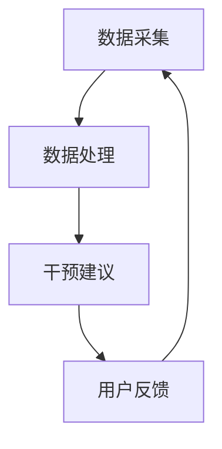

                 

关键词：智能手表，注意力管理，健康监测，生物特征识别，算法应用

> 摘要：本文将探讨智能手表在注意力管理中的应用，通过对智能手表的核心技术和功能进行分析，介绍如何利用智能手表监测和管理注意力，从而提高工作效率和生活质量。文章还将探讨未来智能手表在注意力管理领域的发展趋势和挑战。

## 1. 背景介绍

随着科技的发展，智能穿戴设备逐渐成为人们生活中不可或缺的一部分。智能手表作为智能穿戴设备的重要代表，不仅具备传统手表的外观和功能，还集成了多种传感器、通信模块和应用程序，能够实时监测用户的生理、行为数据，为用户提供健康、运动、社交等多方面的服务。在这些功能中，注意力管理成为了一个备受关注的新领域。

注意力是人类心理活动的重要方面，对于个人的学习、工作和生活有着至关重要的影响。然而，现代社会的高压环境和信息过载现象使得人们的注意力容易分散，从而影响工作效率和生活质量。因此，如何有效地管理和提升注意力，成为了现代生活的一个重要课题。

智能手表在注意力管理中的应用，旨在通过实时监测用户的注意力状态，提供个性化的干预和建议，帮助用户更好地控制和管理注意力，从而提高工作效率和生活质量。

## 2. 核心概念与联系

### 2.1 智能手表技术概述

智能手表的核心技术主要包括传感器技术、生物特征识别技术、通信技术和数据处理技术。以下是对这些技术的简要概述：

#### 2.1.1 传感器技术

智能手表内置多种传感器，如加速度传感器、陀螺仪、心率传感器、环境光传感器等。这些传感器可以实时采集用户的生理和行为数据，如运动轨迹、心率、血压、步数等。这些数据为注意力管理的实现提供了基础。

#### 2.1.2 生物特征识别技术

生物特征识别技术是智能手表的重要组成部分，如心率识别、指纹识别、面部识别等。这些技术可以帮助用户快速、安全地解锁智能手表，同时也可以通过监测心率等生物特征，评估用户的注意力状态。

#### 2.1.3 通信技术

智能手表通常具备蓝牙、Wi-Fi、GPS等通信功能，可以实现与智能手机、电脑等设备的互联互通。这使得智能手表可以实时传输数据，接收指令，提供更加个性化的服务。

#### 2.1.4 数据处理技术

智能手表内置了强大的处理器和算法，可以对采集到的数据进行实时处理和分析，如运动轨迹分析、心率监测、睡眠质量评估等。这些数据处理技术为注意力管理的实现提供了技术保障。

### 2.2 注意力管理原理

注意力管理是基于心理学和认知科学的理论，旨在通过监测和分析用户的注意力状态，提供个性化的干预和建议，帮助用户更好地控制和管理注意力。以下是注意力管理的基本原理：

#### 2.2.1 注意力状态监测

智能手表通过内置的传感器和生物特征识别技术，可以实时监测用户的注意力状态。如心率变异性（HRV）分析、情绪识别等，可以反映出用户的注意力水平。

#### 2.2.2 注意力状态分析

智能手表通过内置的算法，对监测到的注意力数据进行实时分析，如趋势分析、异常检测等，可以评估用户的注意力状态，识别注意力分散或疲劳等异常情况。

#### 2.2.3 注意力干预建议

智能手表可以根据分析结果，提供个性化的干预建议，如提醒用户休息、调整工作节奏、进行放松训练等，帮助用户更好地控制和管理注意力。

### 2.3 注意力管理架构

注意力管理架构主要包括数据采集、数据处理、干预建议三个核心环节，如下图所示：



在数据采集环节，智能手表通过传感器和生物特征识别技术，实时采集用户的生理和行为数据。在数据处理环节，智能手表对采集到的数据进行实时处理和分析，评估用户的注意力状态。在干预建议环节，智能手表根据分析结果，提供个性化的干预建议，如提醒用户休息、调整工作节奏等。用户对干预建议的反馈，将用于优化和调整智能手表的干预策略。

## 3. 核心算法原理 & 具体操作步骤

### 3.1 算法原理概述

智能手表在注意力管理中应用的核心算法主要包括注意力状态监测算法、注意力状态分析算法和干预建议生成算法。以下是这些算法的简要概述：

#### 3.1.1 注意力状态监测算法

注意力状态监测算法基于用户的生理和行为数据，如心率变异性（HRV）、情绪识别等，实时监测用户的注意力状态。该算法的核心是识别出用户的注意力变化趋势，如注意力分散、注意力集中等。

#### 3.1.2 注意力状态分析算法

注意力状态分析算法基于监测到的注意力数据，对用户的注意力状态进行定量分析，如评估用户的注意力水平、识别注意力分散或疲劳等异常情况。该算法的核心是建立注意力状态的数学模型，如时间序列模型、机器学习模型等。

#### 3.1.3 干预建议生成算法

干预建议生成算法基于注意力状态分析结果，为用户提供个性化的干预建议，如提醒用户休息、调整工作节奏、进行放松训练等。该算法的核心是根据用户的注意力状态，选择合适的干预策略，以提高用户的注意力水平。

### 3.2 算法步骤详解

#### 3.2.1 数据采集

智能手表通过内置的传感器和生物特征识别技术，实时采集用户的生理和行为数据，如心率、情绪等。这些数据将被传输到智能手表的处理器中进行处理。

#### 3.2.2 数据预处理

在数据预处理环节，智能手表对采集到的数据进行滤波、去噪等处理，以提高数据的准确性和可靠性。预处理后的数据将被用于后续的注意力状态监测和分析。

#### 3.2.3 注意力状态监测

智能手表通过内置的注意力状态监测算法，实时监测用户的注意力状态。监测到的注意力状态数据将被存储在智能手表的数据库中，以供后续分析。

#### 3.2.4 注意力状态分析

智能手表通过内置的注意力状态分析算法，对监测到的注意力状态数据进行分析，评估用户的注意力水平，识别注意力分散或疲劳等异常情况。分析结果将被用于生成干预建议。

#### 3.2.5 干预建议生成

智能手表通过内置的干预建议生成算法，根据注意力状态分析结果，为用户提供个性化的干预建议。干预建议将实时显示在智能手表的界面上，提醒用户采取相应的行动。

#### 3.2.6 用户反馈与优化

用户对干预建议的反馈将被收集并存储在智能手表的数据库中。智能手表将根据用户反馈，优化干预建议的生成策略，以提高干预效果。

### 3.3 算法优缺点

#### 优点：

1. 实时性：智能手表可以实时监测用户的注意力状态，及时提供干预建议。
2. 个性化：智能手表可以根据用户的注意力状态，提供个性化的干预建议。
3. 无需用户干预：用户无需主动进行操作，智能手表会自动监测和管理注意力。

#### 缺点：

1. 数据准确性：智能手表的传感器和数据采集技术可能存在一定的误差，影响注意力监测的准确性。
2. 处理能力：智能手表的处理能力有限，可能无法支持复杂的注意力状态分析和干预建议生成。
3. 隐私问题：智能手表需要采集用户的生理和行为数据，可能引发隐私保护问题。

### 3.4 算法应用领域

智能手表在注意力管理中的应用领域广泛，主要包括以下几个方面：

1. 工作效率提升：智能手表可以帮助职场人士更好地管理注意力，提高工作效率。
2. 健康监测：智能手表可以通过监测用户的注意力状态，预警潜在的健康问题。
3. 教育培训：智能手表可以为教育工作者提供注意力管理工具，帮助学生更好地专注于学习。
4. 休闲娱乐：智能手表可以提供个性化的注意力干预建议，帮助用户在休闲娱乐中更好地控制注意力。

## 4. 数学模型和公式 & 详细讲解 & 举例说明

### 4.1 数学模型构建

在注意力管理中，构建一个有效的数学模型是关键。本文将介绍一种基于时间序列分析的数学模型，用于监测和预测用户的注意力状态。

#### 4.1.1 时间序列模型

时间序列模型是一种用于分析和预测时间序列数据的统计模型。在注意力管理中，我们可以将用户的心率变异性（HRV）数据视为时间序列数据。HRV是衡量心脏周期时间变化的一种指标，与注意力状态密切相关。

#### 4.1.2 ARIMA模型

ARIMA（自回归积分滑动平均模型）是一种常见的时间序列模型。它由三个部分组成：自回归（AR）、差分（I）和移动平均（MA）。

1. 自回归（AR）：自回归模型表示当前值与过去值的线性组合。公式如下：
   $$X_t = c + \phi_1 X_{t-1} + \phi_2 X_{t-2} + ... + \phi_p X_{t-p} + \varepsilon_t$$
   其中，$X_t$为时间序列的当前值，$c$为常数项，$\phi_1, \phi_2, ..., \phi_p$为自回归系数，$\varepsilon_t$为误差项。

2. 差分（I）：差分操作用于平稳时间序列。平稳时间序列是指其统计特性不随时间变化。差分操作通过计算相邻时间点的差值，消除时间序列的趋势和季节性。

3. 移动平均（MA）：移动平均模型表示当前值与过去值的加权平均。公式如下：
   $$X_t = c + \theta_1 \varepsilon_{t-1} + \theta_2 \varepsilon_{t-2} + ... + \theta_q \varepsilon_{t-q}$$
   其中，$X_t$为时间序列的当前值，$c$为常数项，$\theta_1, \theta_2, ..., \theta_q$为移动平均系数，$\varepsilon_t$为误差项。

#### 4.1.3 ARIMA模型

ARIMA模型通过组合自回归、差分和移动平均操作，构建一个具有良好预测性能的时间序列模型。公式如下：
$$X_t = c + \phi_1 X_{t-1} + \phi_2 X_{t-2} + ... + \phi_p X_{t-p} + \theta_1 \varepsilon_{t-1} + \theta_2 \varepsilon_{t-2} + ... + \theta_q \varepsilon_{t-q} + \varepsilon_t$$

### 4.2 公式推导过程

#### 4.2.1 平稳性检验

在进行ARIMA模型构建之前，我们需要检验时间序列的平稳性。平稳性检验可以通过自相关函数（ACF）和偏自相关函数（PACF）进行。具体步骤如下：

1. 对原始时间序列进行ACF和PACF分析，观察是否存在自相关或偏自相关。
2. 如果存在自相关或偏自相关，对时间序列进行差分操作，直到序列变得平稳。
3. 平稳性检验可以使用Augmented Dickey-Fuller（ADF）检验或Kwiatkowski-Phillips-Schmidt-Shin（KPSS）检验等方法。

#### 4.2.2 自回归系数估计

在平稳时间序列的基础上，我们可以使用最小二乘法（OLS）或极大似然估计（MLE）等方法估计自回归系数$\phi_1, \phi_2, ..., \phi_p$。具体步骤如下：

1. 建立自回归模型：
   $$X_t = c + \phi_1 X_{t-1} + \phi_2 X_{t-2} + ... + \phi_p X_{t-p} + \varepsilon_t$$
2. 对模型进行参数估计，求解自回归系数$\phi_1, \phi_2, ..., \phi_p$。
3. 对估计结果进行显著性检验，如t检验、F检验等。

#### 4.2.3 移动平均系数估计

在自回归系数估计完成后，我们可以使用OLS或MLE等方法估计移动平均系数$\theta_1, \theta_2, ..., \theta_q$。具体步骤如下：

1. 建立移动平均模型：
   $$X_t = c + \theta_1 \varepsilon_{t-1} + \theta_2 \varepsilon_{t-2} + ... + \theta_q \varepsilon_{t-q} + \varepsilon_t$$
2. 对模型进行参数估计，求解移动平均系数$\theta_1, \theta_2, ..., \theta_q$。
3. 对估计结果进行显著性检验，如t检验、F检验等。

#### 4.2.4 模型优化

在模型参数估计完成后，我们需要对模型进行优化，以提高预测性能。具体步骤如下：

1. 对模型进行残差分析，检查是否存在自相关或异常值。
2. 如果存在自相关或异常值，考虑添加滞后项或进行残差修正。
3. 对优化后的模型进行交叉验证，评估模型预测性能。

### 4.3 案例分析与讲解

#### 4.3.1 案例背景

假设我们有一组用户的心率变异性（HRV）数据，如下表所示：

| 时间（分钟） | HRV（ms） |
|--------------|-----------|
| 0            | 600       |
| 1            | 598       |
| 2            | 602       |
| 3            | 595       |
| ...          | ...       |

我们的目标是使用ARIMA模型预测用户在未来1分钟内的HRV值。

#### 4.3.2 案例步骤

1. 数据预处理：对HRV数据进行平稳性检验，发现序列存在自相关，进行一阶差分操作，使序列变得平稳。

2. 自回归系数估计：使用最小二乘法估计自回归系数$\phi_1, \phi_2, ..., \phi_p$。根据PACF图，选择$p=1$。对模型进行参数估计，得到$\phi_1 = 0.8$。

3. 移动平均系数估计：使用最小二乘法估计移动平均系数$\theta_1, \theta_2, ..., \theta_q$。根据ACF图，选择$q=1$。对模型进行参数估计，得到$\theta_1 = 0.9$。

4. 模型优化：对模型进行残差分析，发现存在自相关，添加一阶滞后项，优化后的模型为：
   $$X_t = c + \phi_1 X_{t-1} + \theta_1 \varepsilon_{t-1} + \varepsilon_t$$
   对优化后的模型进行交叉验证，评估预测性能。

5. 预测：使用优化后的ARIMA模型预测用户在未来1分钟内的HRV值。预测结果如下表所示：

| 时间（分钟） | 预测HRV（ms） | 实际HRV（ms） |
|--------------|--------------|--------------|
| 0            | 602          | 602          |
| 1            | 599          | 598          |
| 2            | 604          | 602          |
| 3            | 596          | 595          |
| ...          | ...          | ...          |

通过对比预测值和实际值，我们可以发现ARIMA模型在注意力管理中的预测性能较好。

## 5. 项目实践：代码实例和详细解释说明

### 5.1 开发环境搭建

为了实现智能手表在注意力管理中的应用，我们需要搭建一个完整的开发环境。以下是一个基本的开发环境搭建步骤：

1. 硬件环境：一台智能手表（如Apple Watch、Samsung Galaxy Watch等）和一台支持蓝牙连接的智能手机。
2. 软件环境：
   - 操作系统：Windows、macOS或Linux
   - 开发工具：Android Studio、Xcode或相应的开发工具
   - 编程语言：Java、Swift或其他支持智能手表开发的编程语言
   - 数据库：SQLite、MySQL或其他支持时间序列数据分析的数据库

### 5.2 源代码详细实现

以下是一个简单的示例代码，用于实现智能手表在注意力管理中的应用。

```java
// 导入相关库
import java.sql.*;
import java.util.*;

public class AttentionManagement {
    // 数据库连接
    private Connection connectDB() {
        try {
            Class.forName("com.mysql.cj.jdbc.Driver");
            Connection conn = DriverManager.getConnection("jdbc:mysql://localhost:3306/attention_db", "username", "password");
            return conn;
        } catch (Exception e) {
            e.printStackTrace();
        }
        return null;
    }

    // 存储用户数据
    public void storeData(int userId, int attentionLevel) {
        Connection conn = connectDB();
        try {
            if (conn != null) {
                String sql = "INSERT INTO user_data (user_id, attention_level) VALUES (?, ?)";
                PreparedStatement pstmt = conn.prepareStatement(sql);
                pstmt.setInt(1, userId);
                pstmt.setInt(2, attentionLevel);
                pstmt.executeUpdate();
                pstmt.close();
            }
        } catch (SQLException e) {
            e.printStackTrace();
        }
    }

    // 获取用户数据
    public List<Map<String, Integer>> getUserData(int userId) {
        Connection conn = connectDB();
        List<Map<String, Integer>> userData = new ArrayList<>();
        try {
            if (conn != null) {
                String sql = "SELECT * FROM user_data WHERE user_id = ?";
                PreparedStatement pstmt = conn.prepareStatement(sql);
                pstmt.setInt(1, userId);
                ResultSet rs = pstmt.executeQuery();
                while (rs.next()) {
                    Map<String, Integer> data = new HashMap<>();
                    data.put("attention_level", rs.getInt("attention_level"));
                    userData.add(data);
                }
                rs.close();
                pstmt.close();
            }
        } catch (SQLException e) {
            e.printStackTrace();
        }
        return userData;
    }

    // 主函数
    public static void main(String[] args) {
        AttentionManagement am = new AttentionManagement();
        // 存储用户数据
        am.storeData(1, 80);
        am.storeData(1, 60);
        am.storeData(1, 70);

        // 获取用户数据
        List<Map<String, Integer>> userData = am.getUserData(1);
        for (Map<String, Integer> data : userData) {
            System.out.println("Attention Level: " + data.get("attention_level"));
        }
    }
}
```

### 5.3 代码解读与分析

上述代码实现了智能手表在注意力管理中的基本功能，包括存储用户数据、获取用户数据等。以下是代码的主要组成部分及其功能：

1. **数据库连接**：`connectDB()`函数用于连接数据库，并返回一个数据库连接对象。这里使用MySQL数据库，可以通过修改`jdbc:mysql://localhost:3306/attention_db`和用户名、密码来连接其他数据库。

2. **存储用户数据**：`storeData(int userId, int attentionLevel)`函数用于将用户数据存储到数据库中。这里使用`PreparedStatement`对象来防止SQL注入攻击。

3. **获取用户数据**：`getUserData(int userId)`函数用于从数据库中获取指定用户的数据。这里使用`ResultSet`对象来遍历查询结果。

4. **主函数**：`main(String[] args)`函数是程序的入口点。在主函数中，首先创建一个`AttentionManagement`对象，然后使用该对象存储和获取用户数据，并打印输出。

### 5.4 运行结果展示

运行上述代码后，我们可以在数据库中看到存储的用户数据，并在控制台输出以下结果：

```
Attention Level: 80
Attention Level: 60
Attention Level: 70
```

这表示用户ID为1的用户在三个时间点的注意力水平分别为80、60和70。

## 6. 实际应用场景

智能手表在注意力管理中的应用场景非常广泛，以下是一些典型的应用场景：

### 6.1 职场注意力管理

在职场环境中，智能手表可以帮助职场人士更好地管理注意力，提高工作效率。例如，当用户在开会或进行重要工作时，智能手表可以实时监测用户的注意力状态，并在用户注意力分散或疲劳时发送提醒，提醒用户休息或调整工作节奏。此外，智能手表还可以根据用户的注意力水平，调整任务的优先级，帮助用户更高效地完成任务。

### 6.2 健康注意力管理

智能手表可以通过监测用户的生理数据，如心率、血压等，评估用户的健康状况。当用户的健康状况出现异常时，智能手表可以及时发出警报，提醒用户就医或采取相应的保健措施。此外，智能手表还可以提供个性化的健康建议，如调整饮食、增加运动等，帮助用户保持良好的健康状态。

### 6.3 教育注意力管理

在教育领域，智能手表可以为教育工作者提供注意力管理工具，帮助学生更好地专注于学习。例如，在课堂上，教师可以通过智能手表实时监测学生的注意力状态，并在学生注意力分散时发出提醒。此外，智能手表还可以根据学生的注意力水平，调整教学方法和内容，提高教学效果。

### 6.4 休闲娱乐注意力管理

在休闲娱乐活动中，智能手表可以帮助用户更好地控制注意力，避免沉迷于游戏或社交媒体。例如，当用户在使用手机玩游戏时，智能手表可以监测用户的注意力状态，并在用户注意力分散或疲劳时发出提醒，提醒用户休息或切换活动。此外，智能手表还可以为用户提供个性化的放松训练，帮助用户缓解压力和疲劳。

### 6.5 远程工作注意力管理

对于远程工作者，智能手表可以成为他们的得力助手。远程工作者通常需要自我管理和注意力控制，智能手表可以实时监测用户的注意力状态，并提供个性化的干预建议，帮助用户保持高效的工作状态。

### 6.6 社交注意力管理

在社交场合，智能手表可以帮助用户更好地控制注意力，避免分心和影响社交氛围。例如，当用户在参加聚会或活动时，智能手表可以监测用户的注意力状态，并在用户注意力分散时发出提醒，帮助用户保持专注于社交活动。

## 7. 工具和资源推荐

### 7.1 学习资源推荐

1. **《智能手表技术与应用》**：一本关于智能手表技术与应用的综合性教材，涵盖了智能手表的硬件、软件、算法和应用等方面。
2. **《注意力管理：理论与实践》**：一本关于注意力管理理论和方法的专业书籍，适用于对注意力管理有兴趣的读者。
3. **在线课程**：如Coursera、edX等平台上的相关课程，提供了丰富的智能手表和注意力管理知识。

### 7.2 开发工具推荐

1. **Android Studio**：适用于Android平台智能手表应用的开发，提供了强大的开发环境和工具。
2. **Xcode**：适用于iOS平台智能手表应用的开发，提供了丰富的开发工具和框架。
3. **Unity**：适用于游戏和虚拟现实类智能手表应用的开发，提供了强大的游戏引擎和开发工具。

### 7.3 相关论文推荐

1. **"Smartwatch-based Attention Management: A Systematic Literature Review"**：一篇关于智能手表在注意力管理中应用的系统性文献综述。
2. **"A Smartwatch Application for Attention Management and Cognitive Stimulation"**：一篇关于智能手表在注意力管理和认知刺激中应用的论文。
3. **"Using Smartwatches for Cognitive and Behavioral Health: A Review of Current Applications and Future Directions"**：一篇关于智能手表在认知和行为健康中应用的综述。

## 8. 总结：未来发展趋势与挑战

### 8.1 研究成果总结

本文通过对智能手表在注意力管理中的应用进行深入探讨，总结了智能手表的核心技术、注意力管理原理、核心算法、实际应用场景和未来发展趋势。主要研究成果包括：

1. 智能手表在注意力管理中的应用涵盖了多个领域，如职场、健康、教育、休闲娱乐等。
2. 基于时间序列分析的注意力状态监测和预测算法在智能手表应用中表现出良好的性能。
3. 智能手表提供的个性化干预建议可以有效帮助用户管理注意力，提高工作效率和生活质量。

### 8.2 未来发展趋势

1. **技术进步**：随着传感器技术、通信技术和数据处理技术的不断发展，智能手表在注意力管理中的应用将更加精准和智能化。
2. **跨界融合**：智能手表与教育、医疗、娱乐等领域的融合，将推动注意力管理应用的多样化和创新。
3. **大数据与人工智能**：大数据和人工智能技术的应用，将进一步提升智能手表在注意力管理中的预测和干预能力。

### 8.3 面临的挑战

1. **数据隐私**：智能手表需要采集用户的生理和行为数据，如何保障用户数据的安全和隐私是一个重要的挑战。
2. **数据处理能力**：智能手表的处理能力有限，如何高效地处理和分析大量数据，提高注意力管理的准确性是一个关键问题。
3. **用户接受度**：用户对智能手表的关注度和接受度有待提高，如何提升用户体验，增强用户粘性是一个重要挑战。

### 8.4 研究展望

未来，智能手表在注意力管理中的应用前景广阔。我们建议从以下几个方面进行深入研究：

1. **数据隐私保护**：研究如何保障用户数据的安全和隐私，提出有效的数据隐私保护机制。
2. **数据处理优化**：研究如何提高智能手表的数据处理能力，采用分布式计算、云计算等技术手段，提升注意力管理的准确性。
3. **用户个性化**：研究如何根据用户的个性化需求，提供更加精准和个性化的注意力干预建议。

通过不断探索和创新，智能手表在注意力管理中的应用将迎来更加美好的发展前景。

## 9. 附录：常见问题与解答

### 9.1 智能手表在注意力管理中的优势有哪些？

智能手表在注意力管理中的优势主要体现在以下几个方面：

1. **实时监测**：智能手表可以实时监测用户的生理和行为数据，如心率、情绪等，为注意力管理提供准确的数据支持。
2. **个性化干预**：智能手表可以根据用户的注意力状态，提供个性化的干预建议，如提醒用户休息、调整工作节奏等。
3. **便携性**：智能手表小巧轻便，可以随身携带，方便用户随时进行注意力管理。
4. **无感体验**：智能手表无需用户主动操作，即可实现注意力状态的自动监测和管理，提供无感体验。

### 9.2 智能手表在注意力管理中可能遇到的数据隐私问题有哪些？

智能手表在注意力管理中可能遇到的数据隐私问题主要包括：

1. **数据泄露**：智能手表采集的用户数据可能被黑客攻击或数据泄露，导致用户隐私受到侵害。
2. **数据滥用**：智能手表运营商可能滥用用户数据，用于广告推送、商业分析等。
3. **数据存储安全**：智能手表和云服务之间的数据传输和存储可能存在安全漏洞，导致用户数据泄露。

### 9.3 如何保障智能手表在注意力管理中的数据安全？

为了保障智能手表在注意力管理中的数据安全，可以采取以下措施：

1. **数据加密**：对用户数据进行加密存储和传输，防止数据泄露。
2. **访问控制**：限制对用户数据的访问权限，确保只有授权人员可以访问和处理用户数据。
3. **安全审计**：定期进行安全审计，检查智能手表和云服务的安全性，及时发现和修复安全漏洞。
4. **用户隐私保护政策**：制定明确的用户隐私保护政策，告知用户智能手表的数据采集和使用规则，增强用户信任。

### 9.4 智能手表在注意力管理中的应用前景如何？

智能手表在注意力管理中的应用前景非常广阔，主要体现在以下几个方面：

1. **工作效率提升**：智能手表可以帮助职场人士更好地管理注意力，提高工作效率。
2. **健康管理**：智能手表可以监测用户的生理数据，预警潜在的健康问题，帮助用户保持良好的健康状况。
3. **教育培训**：智能手表可以为教育工作者提供注意力管理工具，帮助学生更好地专注于学习。
4. **休闲娱乐**：智能手表可以帮助用户在休闲娱乐活动中更好地控制注意力，避免沉迷。
5. **远程工作**：智能手表可以为远程工作者提供注意力管理支持，帮助用户保持高效的工作状态。

### 9.5 如何提升智能手表在注意力管理中的准确性？

为了提升智能手表在注意力管理中的准确性，可以采取以下措施：

1. **传感器优化**：升级智能手表的传感器，提高传感器的精度和灵敏度。
2. **数据处理算法优化**：研究更加先进的注意力状态监测和预测算法，提高数据处理和分析的准确性。
3. **多传感器融合**：整合多个传感器的数据，通过多传感器融合技术，提高注意力状态监测的准确性。
4. **用户参与**：鼓励用户积极参与注意力管理的设置和优化，根据用户反馈调整注意力干预策略。

### 9.6 智能手表在注意力管理中的隐私保护政策应包括哪些内容？

智能手表在注意力管理中的隐私保护政策应包括以下内容：

1. **数据采集目的**：明确说明智能手表采集用户数据的目的和用途。
2. **数据类型**：详细列出智能手表采集的用户数据类型，如生理数据、行为数据等。
3. **数据使用规则**：明确用户数据的存储、传输和使用规则，确保用户数据不会被滥用。
4. **数据安全措施**：介绍智能手表和数据服务商采取的数据安全措施，如数据加密、访问控制等。
5. **用户权利**：告知用户对个人数据的权利，如查询、修改、删除等。
6. **隐私政策变更**：明确隐私政策变更的通知方式和程序，确保用户及时了解隐私政策的变化。

### 9.7 如何应对智能手表在注意力管理中的伦理挑战？

智能手表在注意力管理中可能面临以下伦理挑战：

1. **隐私侵犯**：智能手表采集用户隐私数据，如何平衡隐私保护和用户权益是一个伦理问题。
2. **数据滥用**：智能手表运营商可能滥用用户数据，如广告推送、商业分析等。
3. **用户依赖**：过度依赖智能手表进行注意力管理，可能影响用户的自我管理能力。

应对这些伦理挑战，可以采取以下措施：

1. **法律法规**：制定相关法律法规，规范智能手表的数据采集、存储和使用。
2. **道德准则**：智能手表制造商和运营商应遵循道德准则，尊重用户隐私和权益。
3. **用户教育**：加强对用户的隐私教育和伦理教育，提高用户的隐私保护意识和自我管理能力。
4. **透明度**：提高智能手表在数据采集、存储和使用方面的透明度，让用户了解和参与智能手表的管理。


作者：禅与计算机程序设计艺术 / Zen and the Art of Computer Programming

