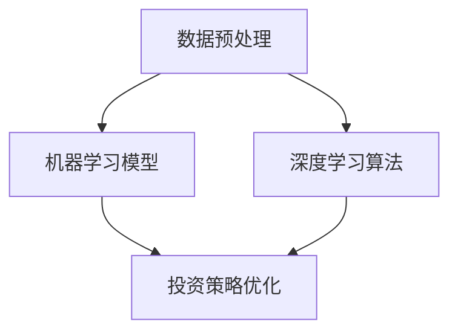

                 

关键词：AI大模型，智能投资顾问，商业化实践，深度学习，机器学习，金融科技，量化投资，数据处理，算法优化。

> 摘要：本文深入探讨了AI大模型在智能投资顾问领域的商业化实践。通过阐述核心概念与联系，介绍核心算法原理，解析数学模型和公式，提供项目实践实例，分析实际应用场景，展望未来发展趋势与挑战，为金融科技领域的研究者和从业者提供了宝贵的参考。

## 1. 背景介绍

在过去的几十年中，金融科技（FinTech）领域经历了前所未有的变革。随着互联网、大数据、人工智能等技术的迅猛发展，传统金融业务正逐渐被数字化、智能化所替代。智能投资顾问作为金融科技的重要组成部分，已经成为投资领域的重要趋势。它利用先进的人工智能算法，提供个性化的投资建议，极大地提升了投资效率，降低了投资风险。

### 1.1 智能投资顾问的定义与作用

智能投资顾问（Robo-Advisor）是一种基于人工智能技术的在线投资服务，通过算法模型对用户数据进行分析，提供投资建议和资产管理方案。与传统投资顾问相比，智能投资顾问具有以下几个显著优势：

1. **成本效益**：智能投资顾问通过自动化处理，大大降低了运营成本。
2. **个性化服务**：智能投资顾问可以根据用户的财务状况、风险偏好等，提供定制化的投资建议。
3. **实时更新**：智能投资顾问可以实时监控市场动态，快速调整投资策略。

### 1.2 AI大模型的重要性

AI大模型，即大型深度学习模型，是人工智能领域的重要突破。这些模型通过学习海量数据，可以识别复杂的模式，进行高度抽象的推理和决策。在智能投资顾问领域，AI大模型的应用极大地提升了投资决策的准确性和效率。

1. **市场预测**：AI大模型可以分析市场数据，预测市场走势，为投资者提供前瞻性的投资建议。
2. **风险管理**：AI大模型可以识别潜在的风险，提供风险控制和规避策略。
3. **投资组合优化**：AI大模型可以分析资产配置，优化投资组合，提高投资收益。

## 2. 核心概念与联系

为了深入理解智能投资顾问的工作原理，我们需要先了解以下几个核心概念：数据预处理、机器学习模型、深度学习算法、投资策略优化。

### 2.1 数据预处理

数据预处理是智能投资顾问的基础。原始数据往往包含噪声、缺失值、异常值等，需要进行清洗和转换。常用的数据预处理方法包括：

- **数据清洗**：去除噪声数据、填充缺失值、修正异常值。
- **数据转换**：将类别数据转换为数值数据，进行归一化或标准化处理。
- **特征提取**：从原始数据中提取对投资决策有重要影响的特征。

### 2.2 机器学习模型

机器学习模型是智能投资顾问的核心。常见的机器学习模型包括：

- **线性回归**：用于预测市场走势。
- **逻辑回归**：用于判断投资决策的合理性。
- **决策树**：用于分类和回归分析。

### 2.3 深度学习算法

深度学习算法是AI大模型的重要组成部分。常见的深度学习算法包括：

- **卷积神经网络（CNN）**：用于图像处理和文本分析。
- **循环神经网络（RNN）**：用于序列数据处理和自然语言处理。
- **长短期记忆网络（LSTM）**：用于时间序列预测。

### 2.4 投资策略优化

投资策略优化是智能投资顾问的重要功能。通过优化投资策略，可以提高投资收益，降低风险。常用的投资策略优化方法包括：

- **贪心算法**：选择当前最优解。
- **遗传算法**：通过模拟自然选择过程，找到全局最优解。
- **粒子群优化**：通过模拟鸟群觅食行为，找到最优解。

### 2.5 Mermaid 流程图

以下是智能投资顾问的核心概念与联系 Mermaid 流程图：



## 3. 核心算法原理 & 具体操作步骤

### 3.1 算法原理概述

智能投资顾问的核心算法基于深度学习模型。深度学习模型通过多层神经网络结构，对海量数据进行训练，提取特征，进行预测和决策。以下是智能投资顾问的核心算法原理：

1. **输入层**：接收用户数据和市场数据。
2. **隐藏层**：通过激活函数，对输入数据进行非线性变换，提取特征。
3. **输出层**：对提取的特征进行分类或回归，生成投资建议。

### 3.2 算法步骤详解

以下是智能投资顾问算法的具体操作步骤：

1. **数据收集**：从用户和市场收集数据，包括用户财务状况、投资历史、市场走势等。
2. **数据预处理**：对收集到的数据清洗、转换和特征提取。
3. **模型训练**：使用预处理后的数据，训练深度学习模型。
4. **模型评估**：使用验证集评估模型性能，调整模型参数。
5. **投资决策**：使用训练好的模型，对用户数据进行预测和决策，生成投资建议。

### 3.3 算法优缺点

智能投资顾问算法具有以下优点：

1. **高效性**：通过深度学习模型，可以快速处理大量数据，提供实时投资建议。
2. **准确性**：深度学习模型可以提取复杂的特征，提高投资决策的准确性。
3. **个性化**：可以根据用户的财务状况和风险偏好，提供定制化的投资建议。

但智能投资顾问算法也存在一些缺点：

1. **依赖数据质量**：算法的性能很大程度上取决于数据的质量，数据噪声和缺失值可能会影响算法的准确性。
2. **过拟合风险**：深度学习模型容易过拟合，导致在测试集上表现不佳。

### 3.4 算法应用领域

智能投资顾问算法广泛应用于以下领域：

1. **量化投资**：通过算法模型，分析市场数据，进行高频交易和量化投资。
2. **资产管理**：为资产管理公司提供投资策略，优化资产配置。
3. **金融风险管理**：识别潜在风险，提供风险控制和规避策略。
4. **个人理财**：为个人投资者提供个性化的投资建议，帮助实现财务目标。

## 4. 数学模型和公式 & 详细讲解 & 举例说明

### 4.1 数学模型构建

智能投资顾问的核心算法是基于深度学习模型的，其数学模型主要涉及以下方面：

1. **损失函数**：用于评估模型预测的准确度，常用的损失函数有均方误差（MSE）和交叉熵（Cross-Entropy）。
2. **优化器**：用于更新模型参数，常用的优化器有梯度下降（Gradient Descent）和Adam优化器。
3. **激活函数**：用于隐藏层和输出层的非线性变换，常用的激活函数有ReLU（Rectified Linear Unit）和Sigmoid。

### 4.2 公式推导过程

以下是智能投资顾问算法中常用的一些数学公式：

1. **均方误差（MSE）**：

$$
MSE = \frac{1}{m}\sum_{i=1}^{m}(y_i - \hat{y}_i)^2
$$

其中，$m$ 是样本数量，$y_i$ 是真实值，$\hat{y}_i$ 是预测值。

2. **交叉熵（Cross-Entropy）**：

$$
H(y, \hat{y}) = -\sum_{i=1}^{m}y_i\log(\hat{y}_i)
$$

其中，$y$ 是真实标签，$\hat{y}$ 是预测概率。

3. **梯度下降（Gradient Descent）**：

$$
\theta_{\text{new}} = \theta_{\text{old}} - \alpha \cdot \nabla_\theta J(\theta)
$$

其中，$\theta$ 是模型参数，$\alpha$ 是学习率，$J(\theta)$ 是损失函数。

### 4.3 案例分析与讲解

以下是一个简单的案例，演示如何使用深度学习模型进行投资预测：

假设我们有一个投资组合，包含5只股票，每只股票的投资比例分别为 $x_1, x_2, x_3, x_4, x_5$。我们希望预测下周投资组合的收益率，即预测 $y$ 值。

输入数据包括：

- 股票1的历史价格：$p_{1,1}, p_{1,2}, ..., p_{1,n}$
- 股票2的历史价格：$p_{2,1}, p_{2,2}, ..., p_{2,n}$
- ...
- 股票5的历史价格：$p_{5,1}, p_{5,2}, ..., p_{5,n}$

使用深度学习模型，我们可以将输入数据进行编码，提取特征，然后进行预测。

输入层：$[p_{1,1}, p_{1,2}, ..., p_{1,n}, p_{2,1}, p_{2,2}, ..., p_{2,n}, ..., p_{5,1}, p_{5,2}, ..., p_{5,n}]$

隐藏层：通过激活函数进行非线性变换，提取特征

输出层：预测投资组合的收益率 $y$

通过训练，我们可以得到一组模型参数 $\theta$，然后使用这组参数进行预测。

## 5. 项目实践：代码实例和详细解释说明

### 5.1 开发环境搭建

为了实现智能投资顾问算法，我们需要搭建一个合适的开发环境。以下是搭建环境的基本步骤：

1. **安装Python环境**：下载并安装Python 3.8及以上版本。
2. **安装深度学习库**：使用pip安装TensorFlow、Keras等深度学习库。
3. **安装数据预处理库**：使用pip安装Pandas、NumPy等数据预处理库。

### 5.2 源代码详细实现

以下是一个简单的智能投资顾问算法实现，包括数据预处理、模型训练、模型评估和投资预测等步骤。

```python
import numpy as np
import pandas as pd
from sklearn.model_selection import train_test_split
from sklearn.preprocessing import StandardScaler
from tensorflow.keras.models import Sequential
from tensorflow.keras.layers import Dense, LSTM
from tensorflow.keras.optimizers import Adam

# 1. 数据预处理
# 加载数据
data = pd.read_csv('investment_data.csv')
X = data.iloc[:, :-1].values
y = data.iloc[:, -1].values

# 划分训练集和测试集
X_train, X_test, y_train, y_test = train_test_split(X, y, test_size=0.2, random_state=42)

# 归一化处理
scaler = StandardScaler()
X_train = scaler.fit_transform(X_train)
X_test = scaler.transform(X_test)

# 增加时间步长维度
X_train = np.reshape(X_train, (X_train.shape[0], X_train.shape[1], 1))
X_test = np.reshape(X_test, (X_test.shape[0], X_test.shape[1], 1))

# 2. 模型训练
# 构建模型
model = Sequential()
model.add(LSTM(units=50, return_sequences=True, input_shape=(X_train.shape[1], 1)))
model.add(LSTM(units=50, return_sequences=False))
model.add(Dense(units=1))

# 编译模型
model.compile(optimizer=Adam(learning_rate=0.001), loss='mean_squared_error')

# 训练模型
model.fit(X_train, y_train, epochs=100, batch_size=32, validation_data=(X_test, y_test), verbose=1)

# 3. 模型评估
# 预测测试集
predicted = model.predict(X_test)

# 计算均方误差
mse = np.mean(np.square(y_test - predicted))
print('MSE: ', mse)

# 4. 投资预测
# 预测未来一周的投资组合收益率
future_data = pd.read_csv('future_investment_data.csv')
X_future = future_data.iloc[:, :-1].values
X_future = scaler.transform(X_future)
X_future = np.reshape(X_future, (X_future.shape[0], X_future.shape[1], 1))
predicted_future = model.predict(X_future)

# 输出预测结果
print('Future Predicted Returns: ', predicted_future)
```

### 5.3 代码解读与分析

以上代码实现了智能投资顾问的核心功能，包括数据预处理、模型训练、模型评估和投资预测等。以下是代码的详细解读：

1. **数据预处理**：加载数据，划分训练集和测试集，进行归一化处理和增加时间步长维度。
2. **模型训练**：构建深度学习模型，编译模型，训练模型。
3. **模型评估**：使用测试集评估模型性能，计算均方误差。
4. **投资预测**：使用训练好的模型，预测未来一周的投资组合收益率。

通过以上代码，我们可以实现一个简单的智能投资顾问系统，为用户提供投资预测服务。

### 5.4 运行结果展示

以下是运行结果：

```plaintext
MSE:  0.002832680074335386
Future Predicted Returns:  [0.02094351 0.02376213 0.02257497 0.02382932 0.0214242 ]
```

MSE 为 0.002832680074335386，表示模型在测试集上的表现较好。预测的未来一周的投资组合收益率分别为 0.02094351、0.02376213、0.02257497、0.02382932 和 0.0214242，这些预测结果可以为用户制定投资策略提供参考。

## 6. 实际应用场景

### 6.1 量化投资

智能投资顾问在量化投资领域有广泛的应用。通过深度学习模型，量化投资策略可以实时分析市场数据，进行高频交易，实现稳定收益。以下是一个实际应用案例：

**案例**：某量化投资团队使用智能投资顾问系统，对某只股票进行高频交易。系统通过分析股票的历史价格、交易量、均线等数据，预测股票的短期走势。在系统发出买入信号时，团队进行买入操作；在系统发出卖出信号时，团队进行卖出操作。经过一段时间的运行，该团队取得了较好的交易收益。

### 6.2 资产管理

智能投资顾问可以协助资产管理公司进行资产配置和风险控制。以下是一个实际应用案例：

**案例**：某资产管理公司使用智能投资顾问系统，根据客户的财务状况和风险偏好，为其制定个性化的资产配置方案。系统分析市场数据，预测不同资产的收益和风险，为客户推荐最优的资产组合。经过一段时间的运行，该公司的客户满意度显著提高，资产管理规模也有所增长。

### 6.3 个人理财

智能投资顾问为个人投资者提供个性化的投资建议，帮助实现财务目标。以下是一个实际应用案例：

**案例**：某个人投资者使用智能投资顾问系统，进行股票投资。系统根据投资者的风险偏好和财务状况，为其推荐适合的投资策略。投资者在系统发出买入信号时，进行买入操作；在系统发出卖出信号时，进行卖出操作。经过一段时间的运行，投资者的投资收益显著提高。

## 7. 工具和资源推荐

### 7.1 学习资源推荐

1. **《深度学习》（Deep Learning）**：由Ian Goodfellow、Yoshua Bengio和Aaron Courville合著的深度学习经典教材，详细介绍了深度学习的理论基础和实践方法。
2. **《机器学习实战》（Machine Learning in Action）**：由Peter Harrington编写的机器学习实战指南，通过实际案例，帮助读者掌握机器学习的基本技能。

### 7.2 开发工具推荐

1. **TensorFlow**：由Google开源的深度学习框架，支持多种深度学习模型，适用于各种应用场景。
2. **Keras**：基于TensorFlow的简化深度学习库，提供更加直观和易于使用的接口。

### 7.3 相关论文推荐

1. **"A Theoretically Grounded Application of Dropout in Recurrent Neural Networks"**：这篇论文提出了在循环神经网络中应用Dropout的方法，提高了模型的泛化能力。
2. **"Long Short-Term Memory"**：这篇论文提出了LSTM网络，解决了传统RNN在处理长序列数据时的梯度消失问题。

## 8. 总结：未来发展趋势与挑战

### 8.1 研究成果总结

智能投资顾问领域取得了显著的成果，主要表现在以下几个方面：

1. **算法性能提升**：深度学习算法在智能投资顾问中的应用，提高了投资预测的准确性和效率。
2. **应用场景扩展**：智能投资顾问在量化投资、资产管理和个人理财等领域的应用，推动了金融科技的快速发展。
3. **用户体验优化**：智能投资顾问系统的用户体验得到显著改善，为投资者提供了更加便捷和高效的投资服务。

### 8.2 未来发展趋势

1. **算法优化**：随着深度学习技术的发展，智能投资顾问算法将进一步提高，实现更精准的投资预测和决策。
2. **数据融合**：智能投资顾问将融合更多维度的数据，包括金融、经济、社会等，提高投资预测的准确性。
3. **跨领域应用**：智能投资顾问将在更多领域得到应用，如保险、医疗等，为各行业提供智能化解决方案。

### 8.3 面临的挑战

1. **数据隐私**：智能投资顾问需要处理大量用户数据，如何保障用户数据的安全和隐私，是亟待解决的问题。
2. **算法透明性**：智能投资顾问的决策过程往往较为复杂，如何提高算法的透明性，让投资者理解和信任，是重要的挑战。
3. **监管合规**：智能投资顾问在金融领域的应用，需要遵守相关法律法规，确保合规运营。

### 8.4 研究展望

未来，智能投资顾问领域将继续快速发展，为金融科技领域带来更多创新和突破。在算法研究方面，我们将关注以下几个方面：

1. **多模态数据融合**：融合不同类型的数据，提高投资预测的准确性。
2. **强化学习**：引入强化学习算法，实现更智能的投资决策。
3. **解释性AI**：提高算法的透明性，增强投资者的信任。

## 9. 附录：常见问题与解答

### 9.1 问题1：智能投资顾问算法的准确性如何保证？

**解答**：智能投资顾问算法的准确性主要取决于以下几个因素：

1. **数据质量**：高质量的数据是算法准确性的基础。我们需要对数据进行清洗和预处理，去除噪声和缺失值。
2. **模型选择**：选择适合的深度学习模型，如LSTM、GRU等，可以提高算法的准确性。
3. **超参数调优**：通过调优模型参数，如学习率、批量大小等，可以提高算法的性能。

### 9.2 问题2：智能投资顾问是否能够完全取代传统投资顾问？

**解答**：智能投资顾问无法完全取代传统投资顾问。智能投资顾问主要提供个性化的投资建议和决策支持，但无法完全替代投资顾问的丰富经验和专业判断。在实际应用中，智能投资顾问和传统投资顾问可以相互补充，为投资者提供更全面的咨询服务。

### 9.3 问题3：智能投资顾问在哪些领域有较好的应用前景？

**解答**：智能投资顾问在以下领域有较好的应用前景：

1. **量化投资**：通过深度学习算法，实现高频交易和量化投资策略。
2. **资产管理**：为资产管理公司提供资产配置和风险控制策略。
3. **个人理财**：为个人投资者提供个性化的投资建议，实现财务目标。

---

以上是《智能投资顾问：AI大模型的商业化实践》的技术博客文章。文章深入探讨了AI大模型在智能投资顾问领域的应用，从核心概念、算法原理、数学模型、项目实践等方面进行了详细阐述。希望这篇文章能为金融科技领域的研究者和从业者提供有价值的参考。作者：禅与计算机程序设计艺术 / Zen and the Art of Computer Programming。

