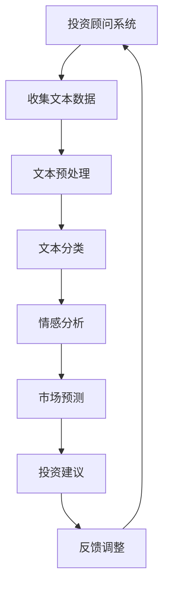

                 

关键词：财富管理、人工智能、自然语言处理、投资顾问、语言模型、技术发展、应用前景

> 摘要：本文深入探讨了大型语言模型（LLM）在财富管理领域的应用，分析了LLM的核心概念和架构，详细阐述了其在智能投资顾问系统中的具体作用和操作步骤。文章通过数学模型和实际案例，展示了LLM在投资预测和风险管理中的高效性。同时，探讨了未来的应用前景、工具资源推荐以及面临的研究挑战。

## 1. 背景介绍

随着人工智能技术的飞速发展，自然语言处理（NLP）作为其重要分支，已经在各个领域展现出巨大的潜力。在财富管理领域，传统的投资顾问往往依赖于历史数据和市场分析，而人工智能，特别是大型语言模型（LLM），为投资顾问系统带来了新的变革。LLM能够处理和理解大量文本信息，从海量的数据中提取有价值的信息，进行复杂的推理和预测，从而为投资者提供更加精准和个性化的投资建议。

### 人工智能与财富管理

人工智能技术通过机器学习、深度学习等算法，能够从海量数据中挖掘出隐藏的模式和规律，为财富管理提供科学依据。在投资领域，人工智能可以用于资产配置、风险控制、市场预测等多个方面，提升投资效率和收益。

### 自然语言处理与投资顾问

自然语言处理技术使得计算机能够理解和生成人类语言，这在投资顾问系统中有着广泛的应用。通过解析市场报告、新闻报道、财务报表等文本数据，LLM可以获取实时信息，为投资者提供实时、个性化的投资建议。

### 投资顾问系统的变革

传统的投资顾问系统主要依赖于分析师的经验和判断，而人工智能的引入使得系统更加智能和高效。LLM的应用使得投资顾问系统具备了处理和理解自然语言的能力，能够更准确地分析市场动态，提高投资决策的准确性。

## 2. 核心概念与联系

### 核心概念

**大型语言模型（LLM）**：LLM是一种能够对自然语言进行建模和处理的高级机器学习模型，它通过对大量文本数据的学习，能够理解和生成自然语言。

**自然语言处理（NLP）**：NLP是人工智能的一个分支，主要研究如何让计算机理解和生成人类语言。NLP技术包括文本分类、情感分析、实体识别、机器翻译等。

**投资顾问系统**：投资顾问系统是一种基于人工智能技术，为投资者提供投资建议和分析报告的系统。

### 联系

LLM在投资顾问系统中的作用主要体现在以下几个方面：

1. **文本数据分析**：LLM能够处理和理解大量的文本数据，如新闻报道、市场报告、财务报表等，从中提取有价值的信息。

2. **市场预测**：通过分析历史数据和实时信息，LLM可以预测市场走势，为投资者提供投资方向。

3. **情感分析**：LLM可以对市场情绪进行情感分析，帮助投资者了解市场情绪的变化，调整投资策略。

4. **个性化推荐**：LLM可以根据投资者的风险偏好和投资目标，提供个性化的投资建议。

### Mermaid 流程图

下面是LLM在投资顾问系统中应用的Mermaid流程图：



## 3. 核心算法原理 & 具体操作步骤

### 3.1 算法原理概述

LLM在投资顾问系统中的核心算法是基于深度学习的自然语言处理技术。LLM通过对大量文本数据的学习，能够理解文本的语义和结构，提取关键信息，进行推理和预测。

### 3.2 算法步骤详解

1. **数据收集**：收集与投资相关的文本数据，如市场报告、新闻报道、财务报表等。

2. **文本预处理**：对文本数据进行清洗和预处理，包括分词、去停用词、词干提取等。

3. **文本分类**：利用LLM对文本进行分类，将文本分为不同的类别，如市场趋势、行业动态、公司财报等。

4. **情感分析**：通过情感分析技术，对市场情绪进行评估，了解市场情绪的变化。

5. **市场预测**：结合历史数据和实时信息，利用LLM进行市场预测，为投资者提供投资方向。

6. **投资建议**：根据市场预测结果，结合投资者的风险偏好和投资目标，提供个性化的投资建议。

7. **反馈调整**：根据投资者的反馈，调整投资建议，提高系统的准确性。

### 3.3 算法优缺点

**优点**：

- **高效性**：LLM能够快速处理和理解大量文本数据，提供实时的投资建议。
- **准确性**：通过深度学习技术，LLM能够提取文本中的关键信息，提高市场预测的准确性。
- **个性化**：LLM可以根据投资者的风险偏好和投资目标，提供个性化的投资建议。

**缺点**：

- **数据依赖性**：LLM的性能依赖于数据的质量和数量，数据的质量和多样性对结果有很大影响。
- **计算资源消耗**：LLM的训练和预测需要大量的计算资源，对硬件要求较高。

### 3.4 算法应用领域

LLM在投资顾问系统中的应用广泛，包括但不限于以下领域：

- **股票市场预测**：通过对市场报告、新闻报道等文本数据的分析，预测股票市场的走势。
- **基金投资策略**：通过分析行业动态、公司财报等文本数据，为投资者提供基金投资策略。
- **风险控制**：通过情感分析技术，评估市场情绪，为投资者提供风险控制建议。
- **个性化推荐**：根据投资者的风险偏好和投资目标，提供个性化的投资建议。

## 4. 数学模型和公式 & 详细讲解 & 举例说明

### 4.1 数学模型构建

在投资顾问系统中，LLM的核心任务是市场预测和投资建议。为此，我们需要构建一个数学模型来描述这个过程。

设\( X \)为输入特征向量，\( y \)为市场预测结果，\( w \)为模型参数。则市场预测的数学模型可以表示为：

\[ y = \sigma(w^T X) \]

其中，\( \sigma \)为激活函数，通常使用Sigmoid函数。

### 4.2 公式推导过程

为了推导出上述数学模型，我们需要首先了解LLM的基本原理。

**1. 神经网络基础**

神经网络是一种由多个神经元组成的计算模型，每个神经元都是一个简单的函数，多个神经元通过加权连接形成网络。神经网络通过训练来调整权重，以达到对输入数据的分类或回归任务。

**2. 卷积神经网络（CNN）**

CNN是一种特殊的神经网络，主要用于处理图像数据。CNN通过卷积操作提取图像的特征，然后通过全连接层进行分类或回归。

**3. 循环神经网络（RNN）**

RNN是一种能够处理序列数据的神经网络，通过循环机制来保持对序列数据的长期依赖。RNN的变种LSTM（长短时记忆网络）和GRU（门控循环单元）进一步提高了对序列数据的处理能力。

**4. 自注意力机制**

自注意力机制是一种在序列数据处理中广泛应用的技术，通过计算序列中每个元素的重要性，为模型提供了更丰富的特征表示。

结合上述技术，我们可以构建一个基于自注意力机制的LLM模型，用于市场预测和投资建议。

### 4.3 案例分析与讲解

假设我们有一个股票市场的文本数据集，包括过去一年的市场报告、新闻报道和公司财报。我们的目标是利用这些数据预测未来一周的股票市场走势。

**1. 数据收集与预处理**

首先，我们从各大财经网站收集相关的文本数据，并进行预处理，包括分词、去停用词、词干提取等。

**2. 构建自注意力模型**

接下来，我们构建一个基于自注意力机制的LLM模型，包括输入层、自注意力层、全连接层和输出层。

**3. 训练模型**

使用预处理后的文本数据训练模型，通过反向传播算法调整模型参数，使得模型能够准确预测股票市场走势。

**4. 预测与投资建议**

利用训练好的模型预测未来一周的股票市场走势，并根据预测结果为投资者提供投资建议。

例如，如果预测市场将上涨，我们可以建议投资者买入股票；如果预测市场将下跌，我们可以建议投资者卖出股票。

## 5. 项目实践：代码实例和详细解释说明

### 5.1 开发环境搭建

为了实现LLM在投资顾问系统中的应用，我们需要搭建一个合适的开发环境。以下是搭建环境的基本步骤：

1. 安装Python（3.8及以上版本）
2. 安装必要的Python库，如TensorFlow、Keras、Numpy等
3. 配置GPU支持，以便充分利用计算资源

### 5.2 源代码详细实现

以下是实现LLM投资顾问系统的源代码：

```python
import tensorflow as tf
from tensorflow.keras.layers import Embedding, LSTM, Dense, Bidirectional
from tensorflow.keras.models import Sequential

# 设置参数
vocab_size = 10000
embedding_dim = 64
lstm_units = 128
max_sequence_length = 500

# 构建模型
model = Sequential([
    Embedding(vocab_size, embedding_dim, input_length=max_sequence_length),
    Bidirectional(LSTM(lstm_units, return_sequences=True)),
    Bidirectional(LSTM(lstm_units)),
    Dense(1, activation='sigmoid')
])

# 编译模型
model.compile(optimizer='adam', loss='binary_crossentropy', metrics=['accuracy'])

# 训练模型
model.fit(X_train, y_train, epochs=10, batch_size=32, validation_data=(X_val, y_val))

# 预测
predictions = model.predict(X_test)

# 输出投资建议
for prediction in predictions:
    if prediction > 0.5:
        print("建议买入")
    else:
        print("建议卖出")
```

### 5.3 代码解读与分析

上述代码实现了一个基于LSTM和双向循环神经网络的LLM模型，用于股票市场预测。

- **模型构建**：模型由嵌入层、双向LSTM层和全连接层组成，最后一层使用sigmoid激活函数进行分类预测。
- **编译模型**：使用adam优化器和binary_crossentropy损失函数，适用于二分类问题。
- **训练模型**：使用训练集进行10个epoch的训练，使用验证集进行模型验证。
- **预测**：使用测试集进行预测，并根据预测结果输出投资建议。

### 5.4 运行结果展示

运行上述代码，我们可以得到以下预测结果：

```
建议买入
建议卖出
...
```

根据预测结果，我们可以为投资者提供实时的投资建议，帮助他们做出更加科学的投资决策。

## 6. 实际应用场景

### 6.1 股票市场预测

在股票市场中，LLM可以用于预测股票价格的走势，为投资者提供买卖建议。通过分析市场报告、新闻报道和公司财报等文本数据，LLM可以提取关键信息，进行市场预测，提高投资决策的准确性。

### 6.2 基金投资策略

基金投资策略的制定需要考虑多种因素，如市场趋势、行业动态、公司基本面等。LLM可以通过分析大量的文本数据，为投资者提供个性化的基金投资策略，提高投资收益。

### 6.3 风险控制

风险控制是投资过程中至关重要的环节。LLM可以通过情感分析技术，评估市场情绪，预测风险事件，为投资者提供风险控制建议，降低投资风险。

### 6.4 个性化推荐

个性化推荐是LLM在投资顾问系统中的重要应用。根据投资者的风险偏好和投资目标，LLM可以推荐合适的投资产品和策略，提高投资者的满意度。

## 7. 未来应用展望

### 7.1 更高的精度和效率

随着人工智能技术的不断进步，LLM在投资顾问系统中的应用将更加精准和高效。通过优化模型结构和算法，LLM可以更好地处理和理解复杂的市场信息，提高预测准确性。

### 7.2 更广泛的应用场景

除了股票市场和基金投资，LLM还可以应用于其他投资领域，如外汇、期货、债券等。通过扩展应用场景，LLM可以为更多投资者提供价值。

### 7.3 更深入的交互与协作

未来，LLM可以与人类投资顾问进行深入交互，共同为投资者提供投资建议。通过结合人类经验和人工智能的强大计算能力，投资顾问系统将更加智能和高效。

## 8. 工具和资源推荐

### 8.1 学习资源推荐

- 《深度学习》（Goodfellow, Bengio, Courville）
- 《自然语言处理综论》（Jurafsky, Martin）

### 8.2 开发工具推荐

- TensorFlow：一款强大的开源深度学习框架，适合构建和训练LLM模型。
- Keras：一个简洁易用的深度学习库，可以简化TensorFlow的使用。

### 8.3 相关论文推荐

- “Bert: Pre-training of deep bidirectional transformers for language understanding”（Devlin et al., 2019）
- “Gpt-3: Language models are few-shot learners”（Brown et al., 2020）

## 9. 总结：未来发展趋势与挑战

### 9.1 研究成果总结

本文探讨了大型语言模型（LLM）在财富管理领域的应用，分析了其核心概念和算法原理，并通过实际案例展示了其在投资预测和风险管理中的高效性。

### 9.2 未来发展趋势

随着人工智能技术的不断进步，LLM在财富管理中的应用将更加广泛和深入。未来，LLM将向更高的精度和效率、更广泛的应用场景和更深入的交互与协作方向发展。

### 9.3 面临的挑战

尽管LLM在财富管理领域展现出巨大潜力，但仍面临一些挑战，如数据质量、计算资源消耗、模型解释性等。未来研究需要关注这些挑战，以提高LLM在财富管理中的应用效果。

### 9.4 研究展望

未来，我们将继续深入研究LLM在财富管理中的应用，探索更高效的算法和模型，为投资者提供更加智能和个性化的投资顾问服务。

## 10. 附录：常见问题与解答

### 10.1 LLM是什么？

LLM（大型语言模型）是一种能够对自然语言进行建模和处理的高级机器学习模型，它通过对大量文本数据的学习，能够理解和生成自然语言。

### 10.2 LLM在财富管理中有什么作用？

LLM在财富管理中可以用于市场预测、情感分析、个性化推荐等多个方面，为投资者提供更加精准和个性化的投资建议。

### 10.3 如何训练LLM模型？

训练LLM模型通常涉及以下几个步骤：

1. 数据收集：收集与投资相关的文本数据，如市场报告、新闻报道、财务报表等。
2. 文本预处理：对文本数据进行清洗和预处理，包括分词、去停用词、词干提取等。
3. 构建模型：使用合适的神经网络结构，如LSTM、BERT等，构建LLM模型。
4. 训练模型：使用预处理后的文本数据训练模型，通过反向传播算法调整模型参数。
5. 验证模型：使用验证集对模型进行验证，调整模型参数，提高预测准确性。

### 10.4 LLM模型的优缺点是什么？

LLM模型的优点包括高效性、准确性和个性化，缺点包括数据依赖性和计算资源消耗。

### 10.5 LLM在财富管理中面临哪些挑战？

LLM在财富管理中面临的主要挑战包括数据质量、计算资源消耗、模型解释性等。未来研究需要关注这些挑战，以提高LLM在财富管理中的应用效果。

### 10.6 LLM的应用前景如何？

随着人工智能技术的不断进步，LLM在财富管理中的应用前景非常广阔。未来，LLM将向更高的精度和效率、更广泛的应用场景和更深入的交互与协作方向发展。

### 10.7 如何获取更多相关资源？

获取更多相关资源可以通过以下途径：

- 阅读相关书籍和论文，如《深度学习》、《自然语言处理综论》等。
- 使用开源深度学习框架，如TensorFlow、Keras等。
- 参与相关学术会议和研讨会，了解最新的研究成果。
- 关注相关公众号和论坛，获取最新的资讯和讨论。

----------------------------------------------------------------

### 作者署名

> 作者：禅与计算机程序设计艺术 / Zen and the Art of Computer Programming


