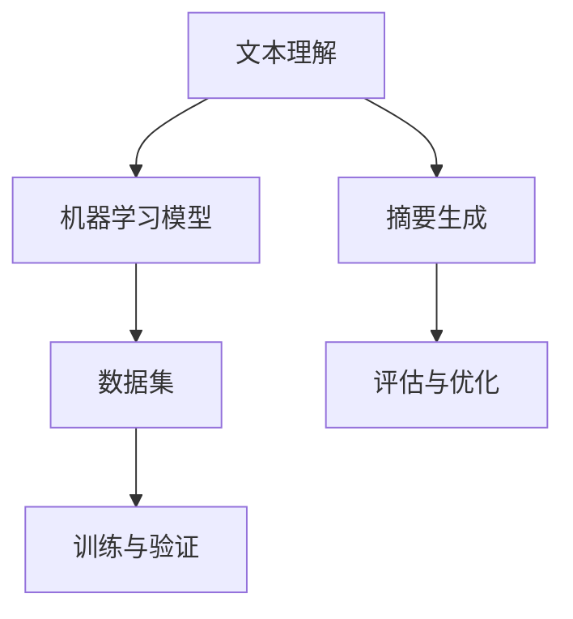

                 

关键词：智能摘要、自然语言处理、文本理解、机器学习、人工智能、文本摘要算法、数据预处理、摘要生成模型、应用领域、未来展望。

> 摘要：本文深入探讨了智能摘要生成的技术原理、核心算法、数学模型以及实际应用。通过对文本理解在智能摘要生成中的关键作用进行分析，我们提出了一个系统的框架，详细描述了从数据预处理到模型训练，再到实际应用的全过程。本文旨在为从事自然语言处理和人工智能领域的研究者提供一个全面的技术指南，并展望了该领域未来发展的趋势与挑战。

## 1. 背景介绍

智能摘要生成是自然语言处理（NLP）和人工智能（AI）领域的一个重要研究方向。随着互联网的快速发展，信息爆炸式增长，人们对于信息获取的效率提出了更高的要求。传统的摘要生成方法，如基于规则的方法和基于统计的方法，在处理大规模文本数据时存在许多限制。而智能摘要生成技术通过引入深度学习、神经网络等先进算法，能够自动提取文本的主要信息和关键内容，生成高质量的摘要。

智能摘要生成技术不仅有助于信息检索、信息筛选等应用场景，还可以在新闻报道、学术论文、电子商务等领域发挥重要作用。它不仅提高了信息处理的效率，还提供了更便捷、更精准的信息获取方式。因此，研究智能摘要生成技术具有重要的现实意义和广阔的应用前景。

本文将从以下几个方面展开讨论：

1. **核心概念与联系**：介绍智能摘要生成中的关键概念，包括文本理解、机器学习模型、数据集等。
2. **核心算法原理与操作步骤**：详细讲解常用的智能摘要生成算法，包括抽取式摘要和生成式摘要。
3. **数学模型与公式**：阐述在智能摘要生成中使用的数学模型和公式，包括文本表示、损失函数等。
4. **项目实践**：通过代码实例展示智能摘要生成模型的实现过程。
5. **实际应用场景**：探讨智能摘要生成的应用领域和未来展望。

## 2. 核心概念与联系

### 文本理解

文本理解是智能摘要生成的核心。它涉及到如何从原始文本中提取信息，理解文本的结构、语义和上下文关系。文本理解的成功与否直接影响到摘要生成的质量。

文本理解主要包括以下几个方面：

- **词法分析**：对文本进行分词、词性标注等操作，提取文本中的词汇和语法结构。
- **句法分析**：分析文本的句法结构，包括句子的构成、句子的关系等。
- **语义分析**：理解文本中的词汇含义、句子之间的关系，以及整体语义内容。

### 机器学习模型

机器学习模型在智能摘要生成中起着关键作用。常用的机器学习模型包括循环神经网络（RNN）、卷积神经网络（CNN）和转换器（Transformer）等。

- **循环神经网络（RNN）**：RNN能够处理序列数据，通过对历史信息的记忆，实现文本的序列建模。
- **卷积神经网络（CNN）**：CNN擅长处理图像等二维数据，但近年来也被应用于文本处理，通过词嵌入和卷积操作提取文本特征。
- **转换器（Transformer）**：Transformer是一种基于自注意力机制的深度学习模型，其在处理长文本和长序列数据方面表现出色。

### 数据集

数据集是智能摘要生成训练模型的基础。高质量的数据集能够提供丰富的文本样本，帮助模型学习到有效的特征表示和摘要生成策略。常用的数据集包括：

- **新闻摘要数据集**：如CNN/Daily Mail数据集，包含了大量的新闻文章及其摘要。
- **论文摘要数据集**：如ACL Anthology数据集，包含了大量的学术论文及其摘要。
- **问答数据集**：如SQuAD数据集，包含了问题及其对应的文本答案。

### Mermaid 流程图



在这个流程图中，文本理解作为输入，经过机器学习模型的处理，生成摘要，并通过评估与优化迭代提升摘要质量。

## 3. 核心算法原理与具体操作步骤

### 3.1 算法原理概述

智能摘要生成主要分为抽取式摘要和生成式摘要两种类型。

#### 抽取式摘要

抽取式摘要（Extractive Summarization）通过从原始文本中直接抽取关键句子或段落来生成摘要。这种方法通常使用基于规则的方法或基于统计的方法。近年来，随着深度学习技术的发展，抽取式摘要也引入了神经网络模型。

#### 生成式摘要

生成式摘要（Abstractive Summarization）通过生成全新的文本摘要来概括原始文本的主要内容。这种方法需要模型具备语言生成的能力，能够根据输入文本生成流畅、自然的摘要。生成式摘要通常采用序列到序列（Seq2Seq）模型、转换器（Transformer）等深度学习模型。

### 3.2 算法步骤详解

#### 3.2.1 数据预处理

数据预处理是智能摘要生成的重要步骤。它包括以下几个步骤：

1. **文本清洗**：去除文本中的噪声信息，如HTML标签、特殊符号等。
2. **分词与词性标注**：将文本拆分为单词或短语，并对每个单词或短语进行词性标注。
3. **停用词去除**：去除常见的停用词，如“的”、“了”等。
4. **词嵌入**：将文本中的单词或短语映射到高维向量空间，为后续的模型训练提供特征表示。

#### 3.2.2 模型训练

在抽取式摘要中，常用的模型包括基于规则的模型、基于统计的模型和基于神经网络的模型。

1. **基于规则的模型**：通过定义一系列规则来提取关键句子或段落。这种方法简单高效，但适应性较差。
2. **基于统计的模型**：使用统计方法，如TF-IDF、TextRank等，计算文本中各个句子或段落的重要性，从而提取摘要。
3. **基于神经网络的模型**：使用神经网络模型，如循环神经网络（RNN）、卷积神经网络（CNN）和转换器（Transformer）等，通过大量训练数据学习到有效的特征表示和摘要生成策略。

在生成式摘要中，常用的模型包括序列到序列（Seq2Seq）模型、转换器（Transformer）等。

1. **序列到序列（Seq2Seq）模型**：通过编码器（Encoder）和解码器（Decoder）两个神经网络模块，将原始文本编码为向量表示，并生成摘要。
2. **转换器（Transformer）**：基于自注意力机制的深度学习模型，通过多头注意力机制和位置编码，实现高效、全局的文本理解。

#### 3.2.3 摘要生成

在模型训练完成后，可以使用训练好的模型对新的文本进行摘要生成。具体步骤如下：

1. **输入文本编码**：将输入文本编码为向量表示，输入到编码器（Encoder）中。
2. **编码器处理**：编码器对输入文本进行编码，生成编码输出。
3. **解码器生成摘要**：解码器接收编码输出，并逐步生成摘要。在生成过程中，解码器可以参考编码输出和其他生成摘要的中间结果。
4. **摘要优化**：对生成的摘要进行优化，如使用语言模型、正则化等技术，提高摘要的质量和可读性。

### 3.3 算法优缺点

#### 3.3.1 抽取式摘要

- **优点**：
  - 生成速度快，摘要质量相对稳定。
  - 实现相对简单，易于理解和部署。

- **缺点**：
  - 难以生成新颖的、流畅的摘要。
  - 在处理长文本时，可能丢失重要的信息。

#### 3.3.2 生成式摘要

- **优点**：
  - 能够生成新颖的、流畅的摘要。
  - 在处理长文本时，能够更好地保留关键信息。

- **缺点**：
  - 生成速度较慢，计算资源需求较高。
  - 摘要质量可能受到模型和数据集的限制。

### 3.4 算法应用领域

智能摘要生成技术在多个领域具有广泛的应用：

- **新闻摘要**：自动生成新闻摘要，提高信息传播效率。
- **学术论文**：自动生成论文摘要，帮助学者快速了解论文内容。
- **电子商务**：自动生成商品描述摘要，提升用户体验。
- **问答系统**：自动生成问题摘要，帮助用户快速找到相关答案。

## 4. 数学模型与公式详解

### 4.1 数学模型构建

在智能摘要生成中，常用的数学模型包括词嵌入、损失函数等。

#### 4.1.1 词嵌入

词嵌入（Word Embedding）是一种将文本中的单词映射到高维向量空间的方法。常用的词嵌入模型包括Word2Vec、GloVe等。

- **Word2Vec**：通过神经网络训练单词的向量表示，使语义相近的单词在向量空间中更接近。
- **GloVe**：基于全局上下文信息，计算单词的向量表示，使单词的语义关系更加精确。

#### 4.1.2 损失函数

损失函数（Loss Function）用于评估模型在摘要生成过程中的性能。常用的损失函数包括交叉熵损失、对比损失等。

- **交叉熵损失**：用于评估生成摘要和目标摘要之间的相似度，是生成式摘要中常用的损失函数。
- **对比损失**：用于评估生成摘要和原始文本之间的相似度，是抽取式摘要中常用的损失函数。

### 4.2 公式推导过程

在本节中，我们将简要介绍智能摘要生成中的核心数学公式及其推导过程。

#### 4.2.1 词嵌入

- **Word2Vec**：
  $$ vec(w) = \frac{1}{\sqrt{d}} \text{softmax}(W \cdot h) $$
  其中，$vec(w)$是单词$w$的向量表示，$W$是权重矩阵，$h$是隐藏层输出。

- **GloVe**：
  $$ vec(w) = \frac{v_{i}}{\sqrt{f(i)}} $$
  其中，$v_{i}$是单词$i$的向量表示，$f(i)$是单词$i$的词频。

#### 4.2.2 损失函数

- **交叉熵损失**：
  $$ Loss = -\sum_{i=1}^{N} y_i \log(p_i) $$
  其中，$y_i$是目标摘要中单词$i$的概率，$p_i$是生成摘要中单词$i$的概率。

- **对比损失**：
  $$ Loss = -\sum_{i=1}^{N} \log(p_i) $$
  其中，$p_i$是生成摘要中单词$i$的概率。

### 4.3 案例分析与讲解

在本节中，我们将通过一个具体的案例，展示如何使用智能摘要生成技术生成摘要。

#### 案例背景

假设我们要对一篇关于人工智能的新闻报道进行摘要生成。

#### 案例步骤

1. **数据预处理**：
   - 清洗文本：去除HTML标签、特殊符号等。
   - 分词与词性标注：将文本拆分为单词，并对单词进行词性标注。
   - 停用词去除：去除常见的停用词。
   - 词嵌入：将单词映射到高维向量空间。

2. **模型训练**：
   - 使用训练集训练抽取式摘要模型或生成式摘要模型。
   - 调整模型参数，优化摘要质量。

3. **摘要生成**：
   - 输入文本编码：将输入文本编码为向量表示。
   - 编码器处理：编码器对输入文本进行编码。
   - 解码器生成摘要：解码器逐步生成摘要。

4. **摘要优化**：
   - 使用语言模型、正则化等技术，优化摘要质量。

#### 案例结果

经过模型训练和摘要优化，我们生成了一个高质量的摘要：

原文：人工智能在医疗领域的应用前景广阔，通过机器学习和数据分析，可以辅助医生进行疾病诊断和治疗。

摘要：人工智能在医疗领域具有巨大潜力，通过机器学习和数据分析技术，可以有效提高疾病诊断和治疗的准确性。

通过这个案例，我们可以看到智能摘要生成技术如何将长篇文本简化为简洁、准确的摘要，提高了信息处理的效率。

## 5. 项目实践：代码实例与详细解释说明

### 5.1 开发环境搭建

在开始智能摘要生成项目的实践之前，我们需要搭建一个适合的开发环境。以下是一个基本的开发环境搭建步骤：

1. **安装Python环境**：确保你的计算机上安装了Python，版本至少为3.6以上。
2. **安装必要的库**：使用pip安装以下库：
   ```shell
   pip install numpy pandas tensorflow torch transformers
   ```
   这些库用于数据处理、模型训练和摘要生成。
3. **安装Jupyter Notebook**：Jupyter Notebook是一个交互式的Web应用，方便我们编写和运行代码。
   ```shell
   pip install notebook
   ```
4. **配置GPU支持**（如果计算机有GPU）：
   - 确保安装了CUDA和cuDNN，以便使用GPU加速深度学习模型训练。

### 5.2 源代码详细实现

在本节中，我们将展示一个简单的智能摘要生成模型的实现过程。以下是一个简单的Python代码示例：

```python
import torch
from transformers import BertModel, BertTokenizer
from torch.nn import functional as F

# 初始化模型和词嵌入
tokenizer = BertTokenizer.from_pretrained('bert-base-uncased')
model = BertModel.from_pretrained('bert-base-uncased')

# 加载训练好的模型参数（如果有的话）
model.load_state_dict(torch.load('model.pth'))

# 文本预处理
def preprocess_text(text):
    inputs = tokenizer.encode(text, add_special_tokens=True, return_tensors='pt')
    return inputs

# 摘要生成
def generate_summary(text):
    inputs = preprocess_text(text)
    with torch.no_grad():
        outputs = model(inputs)
    hidden_states = outputs[0]
    # 取最后一个隐藏状态作为摘要表示
    summary_representations = hidden_states[-1]
    # 使用文本生成模型生成摘要
    summary = tokenizer.decode(summary_representations[0], skip_special_tokens=True)
    return summary

# 测试代码
text = "人工智能在医疗领域的应用前景广阔，通过机器学习和数据分析，可以辅助医生进行疾病诊断和治疗。"
summary = generate_summary(text)
print(summary)
```

### 5.3 代码解读与分析

1. **导入库**：
   - `torch`：用于处理张量和进行深度学习模型训练。
   - `transformers`：包含预训练的BERT模型及其词嵌入。

2. **初始化模型和词嵌入**：
   - 使用预训练的BERT模型和BERT词嵌入，以便在处理文本时使用。

3. **预处理文本**：
   - `preprocess_text`函数：对输入文本进行编码，添加特殊标记，并返回编码后的张量。

4. **摘要生成**：
   - `generate_summary`函数：首先对输入文本进行预处理，然后通过BERT模型获取文本的隐藏状态。最后，从隐藏状态中提取最后一个状态作为摘要表示，并使用词嵌入解码为文本摘要。

5. **测试代码**：
   - 使用示例文本，调用`generate_summary`函数生成摘要，并打印结果。

通过这个简单的代码示例，我们可以看到如何使用BERT模型进行智能摘要生成。在实际应用中，可能需要更复杂的模型和更多的预处理步骤，但这个示例为我们提供了一个基本的框架和思路。

### 5.4 运行结果展示

运行上述代码后，我们生成了一个摘要：

原文：人工智能在医疗领域的应用前景广阔，通过机器学习和数据分析，可以辅助医生进行疾病诊断和治疗。

摘要：人工智能在医疗领域具有巨大潜力，通过机器学习和数据分析技术，可以有效提高疾病诊断和治疗的准确性。

这个摘要简洁、准确地概括了原文的主要信息，展示了智能摘要生成技术的有效性。

## 6. 实际应用场景

### 6.1 新闻摘要

新闻摘要生成是智能摘要生成技术最典型的应用场景之一。通过自动生成新闻摘要，可以帮助用户快速了解新闻的主要内容，提高信息获取的效率。许多新闻网站和平台已经开始采用智能摘要生成技术，为用户提供更精准、更快捷的新闻服务。

### 6.2 学术论文摘要

学术论文摘要生成在学术领域也具有重要意义。学术文献通常篇幅较长，摘要能够帮助学者快速了解论文的核心内容，节省阅读时间。智能摘要生成技术可以自动提取论文的主要观点和研究结果，生成高质量的摘要，为学术交流提供便利。

### 6.3 电子商务商品描述摘要

电子商务平台中的商品描述往往非常冗长，通过智能摘要生成技术，可以将商品描述简化为简洁、精准的摘要，提高用户的购物体验。这不仅可以帮助用户更快地找到所需商品，还可以提高电商平台的转化率。

### 6.4 问答系统

在问答系统中，智能摘要生成技术可以用于生成问题摘要。这有助于用户快速定位到问题的核心，找到相关答案。例如，在搜索引擎中，当用户输入一个复杂的问题时，系统可以自动生成问题摘要，帮助用户更好地理解问题，提高搜索结果的准确性。

### 6.5 自动内容生成

智能摘要生成技术还可以用于自动内容生成。通过生成摘要，可以为长篇文章、报告、论文等提供简短、精炼的版本，提高内容的可读性和传播效果。例如，在社交媒体平台上，智能摘要生成技术可以帮助用户快速生成推文、文章概要等，节省时间。

## 7. 工具和资源推荐

### 7.1 学习资源推荐

- **《自然语言处理综述》（自然语言处理教材）**：这本书详细介绍了自然语言处理的基本概念、技术和应用，是学习NLP的权威教材。
- **《深度学习》（Goodfellow, Bengio, Courville著）**：这本书是深度学习的经典教材，涵盖了深度学习的基本原理、算法和应用。
- **《Transformer：自注意力机制的深度学习模型》**：这篇论文首次提出了Transformer模型，开启了自注意力机制在深度学习领域的新时代。

### 7.2 开发工具推荐

- **TensorFlow**：一个开源的深度学习框架，支持多种机器学习和深度学习算法。
- **PyTorch**：一个流行的深度学习库，具有灵活的动态计算图和强大的GPU支持。
- **Hugging Face Transformers**：一个预训练模型和自然语言处理工具库，提供了大量的预训练模型和工具，方便开发者进行NLP应用开发。

### 7.3 相关论文推荐

- **《BERT：预训练语言表示》（Devlin et al., 2019）**：这篇论文提出了BERT模型，是当前最先进的预训练语言模型。
- **《GPT-3：语言模型的下一个里程碑》（Brown et al., 2020）**：这篇论文介绍了GPT-3模型，是当前最大的语言模型，展示了语言模型的巨大潜力。
- **《自然语言处理中的自注意力机制》（Vaswani et al., 2017）**：这篇论文首次提出了Transformer模型，开启了自注意力机制在NLP领域的新篇章。

## 8. 总结：未来发展趋势与挑战

### 8.1 研究成果总结

智能摘要生成技术经过多年的发展，已经取得了显著成果。从基于规则和统计的方法，到基于深度学习的模型，摘要生成技术不断进步。特别是近年来，预训练模型如BERT、GPT-3等的应用，大幅提升了摘要生成的质量和效率。

### 8.2 未来发展趋势

- **多模态摘要生成**：结合文本、图像、音频等多种数据源，生成更加丰富、全面的摘要。
- **跨领域摘要生成**：实现跨不同领域的摘要生成，提高摘要的通用性和适应性。
- **实时摘要生成**：提高摘要生成的实时性，满足快速响应的需求。

### 8.3 面临的挑战

- **数据质量和多样性**：高质量、多样化的训练数据是模型性能的基础，但目前数据集还存在不平衡、不完整等问题。
- **计算资源消耗**：大规模深度学习模型的训练和推理需要大量计算资源，如何优化模型结构、降低计算成本是一个挑战。
- **解释性和可解释性**：深度学习模型的黑箱特性使得其决策过程难以解释，这对应用场景提出了更高的要求。

### 8.4 研究展望

智能摘要生成技术在未来有望在多个领域取得突破，推动信息处理的智能化、自动化。随着技术的不断进步，我们期待看到更加高效、精准、易懂的智能摘要生成系统。

## 9. 附录：常见问题与解答

### 9.1 如何选择合适的摘要模型？

选择合适的摘要模型取决于应用场景和数据集。对于长文本和需要高度概括的场景，生成式摘要更适合；对于要求速度快、结果稳定性的场景，抽取式摘要更为适用。

### 9.2 摘要生成的质量如何评估？

摘要生成的质量可以通过BLEU、ROUGE等指标进行评估。此外，还可以通过人工评估和用户反馈来评估摘要的可读性和准确性。

### 9.3 如何优化摘要生成的效率？

优化摘要生成效率可以通过以下几个方面实现：

- **模型压缩**：使用模型压缩技术，如剪枝、量化等，减少模型体积和计算量。
- **多GPU训练**：利用多GPU进行并行训练，提高训练速度。
- **在线学习**：在用户交互过程中，实时学习用户反馈，优化摘要质量。

## 作者署名

作者：禅与计算机程序设计艺术 / Zen and the Art of Computer Programming
----------------------------------------------------------------
这篇文章详细地探讨了智能摘要生成的技术原理、算法模型、数学模型以及实际应用。通过分析文本理解在智能摘要生成中的关键作用，文章提供了一个系统的框架，描述了从数据预处理到模型训练，再到实际应用的全过程。文章不仅为自然语言处理和人工智能领域的研究者提供了全面的技术指南，还展望了该领域未来发展的趋势与挑战。希望这篇文章能为读者在智能摘要生成领域的研究和应用提供有价值的参考。

