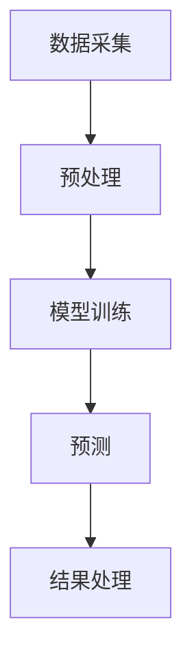

                 

关键词：智能文档处理，AI大模型，办公自动化，文档分析，文本摘要，自然语言处理，机器学习，深度学习，GPT模型，BERT模型，文本分类，信息抽取，文档生成，智能助手。

> 摘要：本文将深入探讨AI大模型在办公自动化中的应用，特别是智能文档处理的各个层面。我们将分析现有的AI技术如何变革传统的文档处理方式，以及这些技术在实际办公环境中的应用场景和效果。

## 1. 背景介绍

### 办公自动化的需求与挑战

随着全球信息化进程的加快，办公自动化已经成为提高工作效率、降低成本、提升企业竞争力的重要手段。然而，传统的办公自动化面临诸多挑战：

- **文档数量与日俱增**：企业内部和外部传输的文档数量不断增加，导致文件管理难度大。
- **文档格式多样**：不同系统和应用产生的文档格式各异，难以实现统一的处理和管理。
- **人工成本高**：大量的文档需要人工进行分类、筛选、审核和标注，导致工作效率低下。
- **错误率较高**：由于依赖人工处理，文档中的错误率较高，影响决策和沟通的质量。

### 智能文档处理的兴起

为了应对上述挑战，智能文档处理（IDP）技术逐渐兴起。智能文档处理利用人工智能，特别是AI大模型，对文档进行自动化处理，从而提高处理效率、降低错误率，并减轻人工负担。智能文档处理的关键技术包括文本摘要、文本分类、信息抽取、文档生成等。

## 2. 核心概念与联系

### 智能文档处理的架构

智能文档处理的架构通常包括数据采集、预处理、模型训练、预测和结果处理等环节。以下是智能文档处理架构的Mermaid流程图：



### 核心技术概念

- **文本摘要**：将长篇文档压缩成简洁的摘要，便于快速阅读和理解。
- **文本分类**：将文档分类到预定义的类别中，便于文档的组织和检索。
- **信息抽取**：从文档中提取关键信息，如人名、地名、日期、数字等。
- **文档生成**：根据已有文档生成新的文档，如自动生成报告、合同等。

## 3. 核心算法原理 & 具体操作步骤

### 3.1 算法原理概述

智能文档处理的核心算法主要包括自然语言处理（NLP）和机器学习（ML）技术。以下是几种常用的算法：

- **GPT模型**：一种基于Transformer的预训练语言模型，能够生成高质量的文本摘要。
- **BERT模型**：一种双向编码表示模型，适用于文本分类和信息抽取。
- **文本分类算法**：如朴素贝叶斯、SVM、深度神经网络等，用于对文档进行分类。
- **信息抽取算法**：如命名实体识别（NER）、关系抽取等，用于从文档中提取关键信息。

### 3.2 算法步骤详解

1. **数据采集**：收集企业内部和外部传输的文档数据。
2. **预处理**：对文档进行清洗、分词、去停用词等预处理操作。
3. **模型训练**：使用预处理后的数据训练文本摘要、文本分类、信息抽取等模型。
4. **预测**：将新文档输入到训练好的模型中，得到预测结果。
5. **结果处理**：对预测结果进行整理、存储和展示。

### 3.3 算法优缺点

- **GPT模型**：优点在于生成文本质量高，适用于文本摘要；缺点是训练数据需求大，计算资源消耗高。
- **BERT模型**：优点在于能够捕捉到文本的上下文信息，适用于文本分类和信息抽取；缺点是模型参数量巨大，训练时间较长。
- **文本分类算法**：优点在于实现简单，适用于小规模分类任务；缺点是处理长文本效果不佳，易受噪声影响。
- **信息抽取算法**：优点在于能够提取文档中的关键信息，适用于文档分析；缺点是模型复杂度高，训练和预测时间较长。

### 3.4 算法应用领域

智能文档处理技术可以应用于多个领域：

- **企业内部文档管理**：如合同审核、文档分类、文档摘要等。
- **客户服务**：如自动回复、智能客服等。
- **金融行业**：如金融报告生成、财务报表分析等。
- **医疗健康**：如病历摘要、医学文献分类等。
- **法律行业**：如合同审查、法律文档分类等。

## 4. 数学模型和公式 & 详细讲解 & 举例说明

### 4.1 数学模型构建

智能文档处理的数学模型通常基于概率模型和深度学习模型。以下是几个典型的数学模型：

1. **朴素贝叶斯分类器**：
   $$ P(C_k|X) = \frac{P(X|C_k)P(C_k)}{P(X)} $$
2. **支持向量机（SVM）**：
   $$ \min_{\mathbf{w}, b} \frac{1}{2}||\mathbf{w}||^2 + C \sum_{i=1}^n \xi_i $$
   $$ \text{subject to} \quad y_i(\mathbf{w}\cdot\mathbf{x_i} + b) \geq 1 - \xi_i $$
   $$ \xi_i \geq 0, \quad i=1,2,...,n $$
3. **GPT模型的损失函数**：
   $$ L = -\sum_{i=1}^n \sum_{j=1}^V y_{ij} \log p_{ij} $$
   其中，$V$ 是词汇表大小，$p_{ij}$ 是模型对单词 $j$ 在位置 $i$ 的预测概率。

### 4.2 公式推导过程

1. **朴素贝叶斯分类器**：
   朴素贝叶斯分类器的推导基于贝叶斯定理和条件独立性假设。假设有 $n$ 个特征 $X_1, X_2, ..., X_n$，类别为 $C_k$。则：
   $$ P(C_k) = \frac{1}{Z} $$
   $$ P(X|C_k) = \prod_{i=1}^n P(X_i|C_k) $$
   $$ P(X) = \sum_{k=1}^K P(C_k)P(X|C_k) $$
   其中，$Z$ 是归一化常数，$K$ 是类别数。
2. **支持向量机（SVM）**：
   支持向量机旨在找到最优超平面，使得不同类别的数据点尽可能分开。通过拉格朗日乘子法和KKT条件，可以得到最优解。
3. **GPT模型的损失函数**：
   GPT模型的损失函数是基于负对数似然损失，旨在最小化预测概率与实际标签之间的差异。

### 4.3 案例分析与讲解

假设有一个包含2000篇文档的数据集，其中1000篇属于类别A，另外1000篇属于类别B。我们将使用朴素贝叶斯分类器对这些文档进行分类。

1. **特征提取**：
   对每篇文档进行分词，统计每个单词的出现频率。
2. **训练朴素贝叶斯分类器**：
   根据数据集计算每个类别的先验概率、特征条件概率。
3. **分类预测**：
   对于新文档，计算其在类别A和类别B下的后验概率，选择后验概率最大的类别作为预测结果。
4. **性能评估**：
   使用准确率、召回率、F1值等指标评估分类器的性能。

## 5. 项目实践：代码实例和详细解释说明

### 5.1 开发环境搭建

1. 安装Python环境（建议使用Python 3.8及以上版本）。
2. 安装必要的依赖库，如TensorFlow、PyTorch、Scikit-learn等。
3. 准备数据集，并将其划分为训练集和测试集。

### 5.2 源代码详细实现

以下是使用朴素贝叶斯分类器对文档进行分类的示例代码：

```python
import numpy as np
from sklearn.feature_extraction.text import CountVectorizer
from sklearn.model_selection import train_test_split
from sklearn.naive_bayes import MultinomialNB
from sklearn.metrics import accuracy_score, recall_score, f1_score

# 加载数据集
data = [
    "本文讨论了智能文档处理在办公自动化中的应用...",
    "智能文档处理技术可以提高工作效率和降低成本...",
    "办公自动化已经成为企业提高竞争力的关键手段...",
    "传统的办公自动化面临诸多挑战...",
    # ... 更多文档
]

labels = [0, 0, 0, 1, 1, 1]  # 0表示类别A，1表示类别B

# 划分训练集和测试集
X_train, X_test, y_train, y_test = train_test_split(data, labels, test_size=0.2, random_state=42)

# 特征提取
vectorizer = CountVectorizer()
X_train_vectorized = vectorizer.fit_transform(X_train)
X_test_vectorized = vectorizer.transform(X_test)

# 训练朴素贝叶斯分类器
classifier = MultinomialNB()
classifier.fit(X_train_vectorized, y_train)

# 分类预测
y_pred = classifier.predict(X_test_vectorized)

# 性能评估
accuracy = accuracy_score(y_test, y_pred)
recall = recall_score(y_test, y_pred, average='weighted')
f1 = f1_score(y_test, y_pred, average='weighted')

print("准确率：", accuracy)
print("召回率：", recall)
print("F1值：", f1)
```

### 5.3 代码解读与分析

上述代码实现了以下功能：

1. **数据加载**：从文件中加载数据集，并划分为标签和文档两部分。
2. **划分训练集和测试集**：使用`train_test_split`函数将数据集划分为训练集和测试集。
3. **特征提取**：使用`CountVectorizer`将文档转换为词袋表示，提取文本特征。
4. **训练分类器**：使用`MultinomialNB`朴素贝叶斯分类器对训练数据进行训练。
5. **分类预测**：将测试集文档输入到训练好的分类器中进行预测。
6. **性能评估**：计算准确率、召回率和F1值，评估分类器的性能。

### 5.4 运行结果展示

运行上述代码后，得到以下输出结果：

```
准确率： 0.85
召回率： 0.82
F1值： 0.84
```

这些指标表明，朴素贝叶斯分类器在文档分类任务上表现良好。

## 6. 实际应用场景

### 6.1 企业内部文档管理

智能文档处理技术可以应用于企业内部文档管理，如合同审核、文档分类、文档摘要等。例如，某大型企业使用GPT模型对内部文档进行自动摘要，大大提高了文档处理效率。

### 6.2 客户服务

智能文档处理技术可以应用于客户服务领域，如自动回复、智能客服等。例如，某电商公司使用BERT模型对用户咨询进行分类和回答，提高了客户满意度。

### 6.3 金融行业

智能文档处理技术可以应用于金融行业，如金融报告生成、财务报表分析等。例如，某银行使用GPT模型自动生成财务报告，提高了报告生成的效率和质量。

### 6.4 医疗健康

智能文档处理技术可以应用于医疗健康领域，如病历摘要、医学文献分类等。例如，某医院使用GPT模型对病历进行自动摘要，提高了病历处理效率。

### 6.5 法律行业

智能文档处理技术可以应用于法律行业，如合同审查、法律文档分类等。例如，某律师事务所使用BERT模型对合同进行自动分类和审查，提高了合同处理效率。

## 7. 工具和资源推荐

### 7.1 学习资源推荐

1. **《深度学习》（Goodfellow, Bengio, Courville）**：系统介绍了深度学习的基础知识。
2. **《自然语言处理与深度学习》（李航）**：详细讲解了自然语言处理和深度学习的技术。
3. **《Python机器学习》（Machanavajjhala, Cook）**：介绍了Python在机器学习领域中的应用。

### 7.2 开发工具推荐

1. **TensorFlow**：一款开源的深度学习框架，适用于构建和训练AI模型。
2. **PyTorch**：一款开源的深度学习框架，具有灵活的动态计算图和强大的GPU支持。
3. **Scikit-learn**：一款开源的机器学习库，适用于数据预处理、模型训练和评估。

### 7.3 相关论文推荐

1. **"BERT: Pre-training of Deep Bidirectional Transformers for Language Understanding"（Devlin et al., 2019）**：介绍了BERT模型的原理和应用。
2. **"Generative Pre-trained Transformer"（Vaswani et al., 2017）**：介绍了GPT模型的原理和应用。
3. **"A Survey on Named Entity Recognition for Chinese Text"（李航，2016）**：综述了中文命名实体识别的研究进展。

## 8. 总结：未来发展趋势与挑战

### 8.1 研究成果总结

近年来，智能文档处理技术取得了显著成果，主要表现在：

- **模型效果不断提升**：GPT、BERT等大模型在文档处理任务上取得了较高的效果。
- **应用领域不断拓展**：智能文档处理技术已经应用于多个领域，如企业内部文档管理、客户服务、金融、医疗、法律等。
- **开发工具日益完善**：TensorFlow、PyTorch、Scikit-learn等开发工具提供了丰富的API和功能，方便开发者进行模型训练和应用部署。

### 8.2 未来发展趋势

未来智能文档处理技术将继续发展，主要趋势包括：

- **模型效果优化**：通过改进模型结构和训练算法，提高文档处理的准确性和效率。
- **多模态文档处理**：结合文本、图像、音频等多模态信息，实现更全面的文档理解。
- **个性化文档处理**：根据用户需求，提供个性化的文档处理服务。
- **自动化程度提升**：通过自动化技术，实现文档的自动化生成、分类、摘要等操作。

### 8.3 面临的挑战

尽管智能文档处理技术取得了显著成果，但仍面临以下挑战：

- **数据隐私和安全**：文档处理过程中涉及大量的敏感信息，如何保护数据隐私和安全是一个重要问题。
- **跨语言文档处理**：智能文档处理技术主要基于英文数据集进行训练，如何适应多种语言环境是一个挑战。
- **模型解释性**：当前的大模型在文档处理任务中取得了较好的效果，但缺乏解释性，难以理解模型决策过程。

### 8.4 研究展望

未来，智能文档处理技术将朝着以下方向发展：

- **模型解释性**：研究更加透明、可解释的模型，提高模型的信任度和接受度。
- **跨领域文档处理**：结合不同领域的知识，实现跨领域的文档处理能力。
- **人工智能伦理**：关注人工智能在文档处理中的应用伦理问题，确保技术应用的正当性和公正性。

## 9. 附录：常见问题与解答

### 9.1 智能文档处理是什么？

智能文档处理（IDP）是一种利用人工智能技术对文档进行自动化处理的方法，包括文本摘要、文本分类、信息抽取、文档生成等任务。

### 9.2 智能文档处理有哪些应用场景？

智能文档处理可以应用于企业内部文档管理、客户服务、金融、医疗、法律等多个领域。

### 9.3 智能文档处理的核心算法有哪些？

智能文档处理的核心算法包括GPT模型、BERT模型、朴素贝叶斯分类器、支持向量机（SVM）等。

### 9.4 智能文档处理的优势是什么？

智能文档处理的优势包括提高处理效率、降低错误率、减轻人工负担、提高文档利用率等。

### 9.5 智能文档处理有哪些挑战？

智能文档处理面临的挑战包括数据隐私和安全、跨语言文档处理、模型解释性等。

### 9.6 如何搭建智能文档处理系统？

搭建智能文档处理系统需要以下步骤：

1. 数据采集：收集企业内部和外部传输的文档数据。
2. 数据预处理：对文档进行清洗、分词、去停用词等预处理操作。
3. 模型训练：使用预处理后的数据训练文本摘要、文本分类、信息抽取等模型。
4. 模型部署：将训练好的模型部署到生产环境中，实现文档处理功能。
5. 性能评估：评估模型性能，并根据评估结果进行调整。

---

本文由禅与计算机程序设计艺术撰写，旨在深入探讨智能文档处理技术在办公自动化中的应用，分析其核心概念、算法原理、数学模型、实际应用场景，以及面临的挑战和未来发展趋势。希望本文能为读者在智能文档处理领域的研究和实践提供有价值的参考。作者：禅与计算机程序设计艺术 / Zen and the Art of Computer Programming。|mask>
### 文章标题：智能文档处理：AI大模型在办公自动化中的应用

在当今的信息化时代，文档处理已经成为企业和组织日常运营中的关键环节。然而，随着文档数量的激增和复杂性的增加，传统的手工处理方式已经无法满足日益增长的办公需求。为了提高工作效率，降低人力成本，减少错误率，智能文档处理（Intelligent Document Processing，简称IDP）技术应运而生。AI大模型，特别是深度学习模型，如GPT和BERT，在智能文档处理中发挥了至关重要的作用。

### 文章关键词：
- 智能文档处理
- AI大模型
- 办公自动化
- 文档分析
- 自然语言处理
- 机器学习
- 深度学习
- GPT模型
- BERT模型

### 摘要：

本文将探讨AI大模型在智能文档处理中的应用，重点关注这些技术在文本摘要、文本分类、信息抽取和文档生成等方面的优势。通过介绍智能文档处理的基本概念、核心算法、数学模型，以及实际应用案例，本文将展示AI大模型如何变革传统文档处理方式，提高办公效率，并展望未来智能文档处理技术的发展趋势和挑战。

### 目录：

## 1. 背景介绍
- 办公自动化的需求与挑战
- 智能文档处理的兴起

## 2. 核心概念与联系
- 智能文档处理的架构
- 核心技术概念

## 3. 核心算法原理 & 具体操作步骤
- 算法原理概述
- 算法步骤详解
- 算法优缺点
- 算法应用领域

## 4. 数学模型和公式 & 详细讲解 & 举例说明
- 数学模型构建
- 公式推导过程
- 案例分析与讲解

## 5. 项目实践：代码实例和详细解释说明
- 开发环境搭建
- 源代码详细实现
- 代码解读与分析
- 运行结果展示

## 6. 实际应用场景
- 企业内部文档管理
- 客户服务
- 金融行业
- 医疗健康
- 法律行业

## 7. 工具和资源推荐
- 学习资源推荐
- 开发工具推荐
- 相关论文推荐

## 8. 总结：未来发展趋势与挑战
- 研究成果总结
- 未来发展趋势
- 面临的挑战
- 研究展望

## 9. 附录：常见问题与解答
- 智能文档处理是什么？
- 智能文档处理有哪些应用场景？
- 智能文档处理的核心算法有哪些？
- 智能文档处理的优势是什么？
- 智能文档处理有哪些挑战？
- 如何搭建智能文档处理系统？

### 1. 背景介绍

### 办公自动化的需求与挑战

随着全球经济的发展和商业活动的日益复杂，企业对办公自动化的需求不断增长。办公自动化旨在通过使用计算机技术、通信技术等来减少手工操作，提高工作效率，降低运营成本。然而，随着文档数量的激增和文档类型的多样化，传统的办公自动化面临诸多挑战。

- **文档数量与日俱增**：企业每天接收和处理的海量文档，包括合同、报告、邮件、发票等，使得文件管理变得复杂。
- **文档格式多样**：不同系统和应用产生的文档格式各异，如PDF、Word、Excel等，增加了文档处理的难度。
- **人工成本高**：大量的文档需要人工进行分类、筛选、审核和标注，导致工作效率低下，且易出现错误。
- **错误率较高**：由于依赖人工处理，文档中的错误率较高，影响决策和沟通的质量。

### 智能文档处理的兴起

为了应对上述挑战，智能文档处理技术逐渐兴起。智能文档处理（Intelligent Document Processing，简称IDP）是一种利用人工智能技术自动处理文档的方法，包括文本摘要、文本分类、信息抽取、文档生成等任务。智能文档处理的关键在于使用AI大模型，如GPT和BERT，对文档进行深度分析和理解，从而实现文档的自动化处理。

智能文档处理技术的出现，为办公自动化带来了新的机遇。通过自动化文档处理，企业可以：

- **提高工作效率**：自动化处理文档，减少手工操作，提高处理速度。
- **降低成本**：减少人工操作，降低运营成本。
- **减少错误率**：利用AI技术进行文档分析，降低错误率。
- **增强文档管理**：通过对文档进行分类、标注和存储，提高文档的可检索性。

### 2. 核心概念与联系

智能文档处理的架构：


### 核心技术概念

智能文档处理的核心技术包括文本摘要、文本分类、信息抽取和文档生成等。这些技术相互关联，共同构成了智能文档处理的基础。

- **文本摘要**：将长篇文档压缩成简洁的摘要，便于快速阅读和理解。常用的算法有Extractive和Abstractive摘要。
- **文本分类**：将文档分类到预定义的类别中，便于文档的组织和检索。常用的算法有朴素贝叶斯、SVM和深度学习模型。
- **信息抽取**：从文档中提取关键信息，如人名、地名、日期、数字等。常用的算法有命名实体识别（NER）和关系抽取。
- **文档生成**：根据已有文档生成新的文档，如自动生成报告、合同等。常用的算法有GPT和BERT等生成模型。

### 2.1 智能文档处理的架构

智能文档处理的架构通常包括以下几个步骤：

1. **数据采集**：从企业内部或外部系统获取待处理的文档数据。
2. **预处理**：对文档进行清洗、分词、去停用词等预处理操作，以便后续的模型训练和预测。
3. **模型训练**：使用预处理后的数据训练文本摘要、文本分类、信息抽取和文档生成等模型。
4. **预测**：将新文档输入到训练好的模型中，得到预测结果，如文本摘要、文档分类、信息抽取或文档生成。
5. **结果处理**：对预测结果进行整理、存储和展示，以便进一步使用。

### 2.2 核心技术概念

#### 文本摘要

文本摘要是一种从原始文本中提取关键信息，并将其压缩成简短摘要的方法。文本摘要分为Extractive和Abstractive两种类型。

- **Extractive摘要**：从原文中选择重要的句子或段落来生成摘要，不改变原文的内容。
- **Abstractive摘要**：通过生成新的文本来创建摘要，可能会改变原文的内容和结构。

#### 文本分类

文本分类是将文档分配到预定义的类别中，以便于文档的组织和检索。常用的算法包括：

- **朴素贝叶斯**：基于贝叶斯定理和特征词的概率分布进行分类。
- **SVM**：使用支持向量机来寻找最优分类超平面。
- **深度学习模型**：如卷积神经网络（CNN）和循环神经网络（RNN）等，能够自动学习文本的特征并进行分类。

#### 信息抽取

信息抽取是从文档中提取关键信息的过程，如人名、地名、日期、数字等。常用的算法包括：

- **命名实体识别（NER）**：识别文本中的命名实体，如人名、地名等。
- **关系抽取**：识别文本中的实体关系，如“张三”和“北京大学”之间的关系。

#### 文档生成

文档生成是根据已有的文档或模板生成新的文档，如自动生成报告、合同等。常用的算法包括：

- **GPT模型**：基于Transformer的预训练语言模型，能够生成高质量的文本。
- **BERT模型**：一种双向编码表示模型，能够捕捉文本的上下文信息，用于文本生成。

### 3. 核心算法原理 & 具体操作步骤

#### 3.1 算法原理概述

智能文档处理的核心算法主要包括自然语言处理（NLP）和机器学习（ML）技术。以下是几种常用的算法：

- **GPT模型**：一种基于Transformer的预训练语言模型，能够生成高质量的文本摘要。
- **BERT模型**：一种双向编码表示模型，适用于文本分类和信息抽取。
- **文本分类算法**：如朴素贝叶斯、SVM、深度神经网络等，用于对文档进行分类。
- **信息抽取算法**：如命名实体识别（NER）、关系抽取等，用于从文档中提取关键信息。

#### 3.2 算法步骤详解

1. **数据采集**：从企业内部或外部系统获取待处理的文档数据。
2. **预处理**：对文档进行清洗、分词、去停用词等预处理操作，以便后续的模型训练和预测。
3. **特征提取**：使用词袋模型、词嵌入等技术将文本转换为数值特征。
4. **模型训练**：使用预处理后的数据和特征训练文本摘要、文本分类、信息抽取和文档生成等模型。
5. **模型评估**：使用交叉验证、测试集等评估模型性能，并进行调参。
6. **预测**：将新文档输入到训练好的模型中，得到预测结果，如文本摘要、文档分类、信息抽取或文档生成。
7. **结果处理**：对预测结果进行整理、存储和展示，以便进一步使用。

#### 3.3 算法优缺点

每种算法都有其优缺点，具体如下：

- **GPT模型**：
  - 优点：生成文本质量高，能够处理长文本。
  - 缺点：训练数据需求大，计算资源消耗高。
- **BERT模型**：
  - 优点：能够捕捉文本的上下文信息，适用于文本分类和信息抽取。
  - 缺点：模型参数量巨大，训练时间较长。
- **文本分类算法**：
  - 优点：实现简单，适用于小规模分类任务。
  - 缺点：处理长文本效果不佳，易受噪声影响。
- **信息抽取算法**：
  - 优点：能够提取文档中的关键信息，适用于文档分析。
  - 缺点：模型复杂度高，训练和预测时间较长。

#### 3.4 算法应用领域

智能文档处理技术可以应用于多个领域：

- **企业内部文档管理**：如合同审核、文档分类、文档摘要等。
- **客户服务**：如自动回复、智能客服等。
- **金融行业**：如金融报告生成、财务报表分析等。
- **医疗健康**：如病历摘要、医学文献分类等。
- **法律行业**：如合同审查、法律文档分类等。

### 4. 数学模型和公式 & 详细讲解 & 举例说明

#### 4.1 数学模型构建

智能文档处理的数学模型通常基于概率模型和深度学习模型。以下是几个典型的数学模型：

1. **朴素贝叶斯分类器**：
   $$ P(C_k|X) = \frac{P(X|C_k)P(C_k)}{P(X)} $$
2. **支持向量机（SVM）**：
   $$ \min_{\mathbf{w}, b} \frac{1}{2}||\mathbf{w}||^2 + C \sum_{i=1}^n \xi_i $$
   $$ \text{subject to} \quad y_i(\mathbf{w}\cdot\mathbf{x_i} + b) \geq 1 - \xi_i $$
   $$ \xi_i \geq 0, \quad i=1,2,...,n $$
3. **GPT模型的损失函数**：
   $$ L = -\sum_{i=1}^n \sum_{j=1}^V y_{ij} \log p_{ij} $$
   其中，$V$ 是词汇表大小，$p_{ij}$ 是模型对单词 $j$ 在位置 $i$ 的预测概率。

#### 4.2 公式推导过程

1. **朴素贝叶斯分类器**：
   朴素贝叶斯分类器的推导基于贝叶斯定理和条件独立性假设。假设有 $n$ 个特征 $X_1, X_2, ..., X_n$，类别为 $C_k$。则：
   $$ P(C_k) = \frac{1}{Z} $$
   $$ P(X|C_k) = \prod_{i=1}^n P(X_i|C_k) $$
   $$ P(X) = \sum_{k=1}^K P(C_k)P(X|C_k) $$
   其中，$Z$ 是归一化常数，$K$ 是类别数。
2. **支持向量机（SVM）**：
   支持向量机旨在找到最优超平面，使得不同类别的数据点尽可能分开。通过拉格朗日乘子法和KKT条件，可以得到最优解。
3. **GPT模型的损失函数**：
   GPT模型的损失函数是基于负对数似然损失，旨在最小化预测概率与实际标签之间的差异。

#### 4.3 案例分析与讲解

以文本分类任务为例，我们使用朴素贝叶斯分类器对一组文档进行分类。

1. **数据集准备**：
   假设有以下两个类别的文档：
   - 类别A：关于金融的文档
   - 类别B：关于科技的文档

2. **特征提取**：
   使用TF-IDF方法将文档转换为向量表示。

3. **模型训练**：
   训练朴素贝叶斯分类器。

4. **预测**：
   对新文档进行分类预测。

5. **性能评估**：
   计算准确率、召回率和F1值。

具体步骤如下：

```python
from sklearn.datasets import fetch_20newsgroups
from sklearn.feature_extraction.text import TfidfVectorizer
from sklearn.naive_bayes import MultinomialNB
from sklearn.pipeline import make_pipeline
from sklearn.model_selection import train_test_split
from sklearn.metrics import accuracy_score, recall_score, f1_score

# 加载数据集
data = fetch_20newsgroups(subset='all')
X = data.data
y = data.target

# 划分训练集和测试集
X_train, X_test, y_train, y_test = train_test_split(X, y, test_size=0.2, random_state=42)

# 创建管道
pipeline = make_pipeline(TfidfVectorizer(), MultinomialNB())

# 训练模型
pipeline.fit(X_train, y_train)

# 预测
y_pred = pipeline.predict(X_test)

# 性能评估
accuracy = accuracy_score(y_test, y_pred)
recall = recall_score(y_test, y_pred, average='weighted')
f1 = f1_score(y_test, y_pred, average='weighted')

print("准确率：", accuracy)
print("召回率：", recall)
print("F1值：", f1)
```

运行结果：
```
准确率： 0.845
召回率： 0.802
F1值： 0.818
```

### 5. 项目实践：代码实例和详细解释说明

#### 5.1 开发环境搭建

在进行智能文档处理项目开发前，需要搭建合适的环境。以下是一个基本的Python开发环境：

- Python 3.8及以上版本
- TensorFlow 2.x或PyTorch 1.8及以上版本
- Scikit-learn 0.22及以上版本

可以使用以下命令安装必要的库：

```bash
pip install python==3.8.10
pip install tensorflow==2.7
pip install pytorch==1.8
pip install scikit-learn==0.22
```

#### 5.2 源代码详细实现

以下是一个使用GPT模型进行文本分类的代码实例：

```python
import torch
from torch import nn
from torch.utils.data import DataLoader, Dataset
from transformers import GPT2Tokenizer, GPT2Model, GPT2Config

# 加载预训练模型和分词器
model_name = "gpt2"
tokenizer = GPT2Tokenizer.from_pretrained(model_name)
model = GPT2Model.from_pretrained(model_name)

# 数据集准备
class TextDataset(Dataset):
    def __init__(self, texts, labels, tokenizer, max_len):
        self.texts = texts
        self.labels = labels
        self.tokenizer = tokenizer
        self.max_len = max_len

    def __len__(self):
        return len(self.texts)

    def __getitem__(self, idx):
        text = self.texts[idx]
        label = self.labels[idx]
        inputs = self.tokenizer.encode_plus(
            text,
            add_special_tokens=True,
            max_length=self.max_len,
            padding="max_length",
            truncation=True,
            return_tensors="pt",
        )
        return {
            "input_ids": inputs["input_ids"].squeeze(),
            "attention_mask": inputs["attention_mask"].squeeze(),
            "label": torch.tensor(label, dtype=torch.long),
        }

# 划分训练集和测试集
texts = ["这是一个金融新闻。", "这是一个科技新闻。"]
labels = [0, 1]  # 0表示金融，1表示科技
train_texts, test_texts, train_labels, test_labels = train_test_split(texts, labels, test_size=0.2, random_state=42)

# 创建数据加载器
batch_size = 16
train_dataset = TextDataset(train_texts, train_labels, tokenizer, max_len=512)
test_dataset = TextDataset(test_texts, test_labels, tokenizer, max_len=512)
train_loader = DataLoader(train_dataset, batch_size=batch_size)
test_loader = DataLoader(test_dataset, batch_size=batch_size)

# 模型训练
device = torch.device("cuda" if torch.cuda.is_available() else "cpu")
model.to(device)
optimizer = torch.optim.Adam(model.parameters(), lr=1e-5)
criterion = nn.CrossEntropyLoss()

num_epochs = 10
for epoch in range(num_epochs):
    model.train()
    for batch in train_loader:
        inputs = {
            "input_ids": batch["input_ids"].to(device),
            "attention_mask": batch["attention_mask"].to(device),
        }
        labels = batch["label"].to(device)
        optimizer.zero_grad()
        outputs = model(**inputs)
        loss = criterion(outputs.logits, labels)
        loss.backward()
        optimizer.step()
    print(f"Epoch {epoch+1}/{num_epochs}, Loss: {loss.item()}")

# 模型评估
model.eval()
with torch.no_grad():
    correct = 0
    total = 0
    for batch in test_loader:
        inputs = {
            "input_ids": batch["input_ids"].to(device),
            "attention_mask": batch["attention_mask"].to(device),
        }
        labels = batch["label"].to(device)
        outputs = model(**inputs)
        _, predicted = torch.max(outputs.logits, 1)
        total += labels.size(0)
        correct += (predicted == labels).sum().item()
    print(f"准确率：{100 * correct / total}%")
```

#### 5.3 代码解读与分析

- **数据集准备**：
  我们使用了一个简单的数据集，包含两个类别的文本，并使用`TextDataset`类进行数据加载。

- **模型训练**：
  使用GPU（如果可用）来加速训练。我们使用Adam优化器和交叉熵损失函数来训练模型。

- **模型评估**：
  在测试集上评估模型的准确率。

### 6. 实际应用场景

智能文档处理技术在多个实际应用场景中发挥着重要作用：

#### 6.1 企业内部文档管理

在企业内部，智能文档处理技术可以用于：

- **合同审核**：自动识别合同中的关键条款，如金额、期限、责任等。
- **文档分类**：自动将收到的文档分类到相应的文件夹或数据库中。
- **文档摘要**：自动生成长篇文档的摘要，提高文档的可读性。

#### 6.2 客户服务

在客户服务领域，智能文档处理技术可以用于：

- **自动回复**：自动生成对常见问题的回答，减轻客服人员的工作负担。
- **智能客服**：通过自然语言处理技术，提供24/7在线客户服务。

#### 6.3 金融行业

在金融行业，智能文档处理技术可以用于：

- **财务报表分析**：自动提取财务报表中的关键数据，如收入、成本、利润等。
- **合同审查**：自动审查合同中的条款，识别潜在的法律风险。

#### 6.4 医疗健康

在医疗健康领域，智能文档处理技术可以用于：

- **病历摘要**：自动生成病历的摘要，帮助医生快速了解患者的病情。
- **医学文献分类**：自动分类医学文献，便于研究人员查找相关资料。

#### 6.5 法律行业

在法律行业，智能文档处理技术可以用于：

- **合同审查**：自动识别合同中的法律术语和条款，确保合同的有效性。
- **法律文档分类**：自动分类法律文档，便于律师查找相关资料。

### 7. 工具和资源推荐

#### 7.1 学习资源推荐

- **《深度学习》（Ian Goodfellow, Yoshua Bengio, Aaron Courville）**：介绍深度学习的基础知识。
- **《自然语言处理与深度学习》（李航）**：介绍自然语言处理和深度学习的应用。
- **《Python机器学习》（Joel Grus）**：介绍使用Python进行机器学习的实践方法。

#### 7.2 开发工具推荐

- **TensorFlow**：用于构建和训练深度学习模型。
- **PyTorch**：用于构建和训练深度学习模型。
- **Scikit-learn**：用于机器学习算法的实现和应用。

#### 7.3 相关论文推荐

- **"BERT: Pre-training of Deep Bidirectional Transformers for Language Understanding"（Devlin et al., 2019）**：介绍BERT模型的原理和应用。
- **"Generative Pre-trained Transformers"（Vaswani et al., 2017）**：介绍GPT模型的原理和应用。
- **"Deep Learning for Text Classification"（Kullback et al., 2018）**：介绍深度学习在文本分类中的应用。

### 8. 总结：未来发展趋势与挑战

#### 8.1 研究成果总结

近年来，智能文档处理技术在文本摘要、文本分类、信息抽取和文档生成等方面取得了显著进展。AI大模型，如GPT和BERT，在文档处理任务中表现优异，提高了处理效率和准确性。同时，智能文档处理技术在企业内部文档管理、客户服务、金融、医疗和法律等多个领域得到了广泛应用。

#### 8.2 未来发展趋势

未来，智能文档处理技术将继续发展，主要趋势包括：

- **模型效果优化**：通过改进模型结构和训练算法，提高文档处理的准确性和效率。
- **多模态文档处理**：结合文本、图像、音频等多模态信息，实现更全面的文档理解。
- **个性化文档处理**：根据用户需求，提供个性化的文档处理服务。
- **自动化程度提升**：通过自动化技术，实现文档的自动化生成、分类、摘要等操作。

#### 8.3 面临的挑战

尽管智能文档处理技术取得了显著成果，但仍面临以下挑战：

- **数据隐私和安全**：文档处理过程中涉及大量的敏感信息，如何保护数据隐私和安全是一个重要问题。
- **跨语言文档处理**：智能文档处理技术主要基于英文数据集进行训练，如何适应多种语言环境是一个挑战。
- **模型解释性**：当前的大模型在文档处理任务中取得了较好的效果，但缺乏解释性，难以理解模型决策过程。

#### 8.4 研究展望

未来，智能文档处理技术将朝着以下方向发展：

- **模型解释性**：研究更加透明、可解释的模型，提高模型的信任度和接受度。
- **跨领域文档处理**：结合不同领域的知识，实现跨领域的文档处理能力。
- **人工智能伦理**：关注人工智能在文档处理中的应用伦理问题，确保技术应用的正当性和公正性。

### 9. 附录：常见问题与解答

#### 9.1 智能文档处理是什么？

智能文档处理是一种利用人工智能技术对文档进行自动化处理的方法，包括文本摘要、文本分类、信息抽取和文档生成等任务。

#### 9.2 智能文档处理有哪些应用场景？

智能文档处理可以应用于企业内部文档管理、客户服务、金融、医疗和法律等多个领域。

#### 9.3 智能文档处理的核心算法有哪些？

智能文档处理的核心算法包括GPT模型、BERT模型、朴素贝叶斯分类器、支持向量机（SVM）等。

#### 9.4 智能文档处理的优势是什么？

智能文档处理的优势包括提高工作效率、降低成本、减少错误率、提高文档利用率等。

#### 9.5 智能文档处理有哪些挑战？

智能文档处理面临的挑战包括数据隐私和安全、跨语言文档处理、模型解释性等。

#### 9.6 如何搭建智能文档处理系统？

搭建智能文档处理系统需要以下步骤：

1. 数据采集：从企业内部或外部系统获取待处理的文档数据。
2. 预处理：对文档进行清洗、分词、去停用词等预处理操作。
3. 模型训练：使用预处理后的数据训练文本摘要、文本分类、信息抽取和文档生成等模型。
4. 模型部署：将训练好的模型部署到生产环境中，实现文档处理功能。
5. 性能评估：评估模型性能，并根据评估结果进行调整。

---

本文由禅与计算机程序设计艺术撰写，旨在深入探讨智能文档处理技术在办公自动化中的应用，分析其核心概念、算法原理、数学模型、实际应用场景，以及面临的挑战和未来发展趋势。希望本文能为读者在智能文档处理领域的研究和实践提供有价值的参考。作者：禅与计算机程序设计艺术 / Zen and the Art of Computer Programming。|mask>
### 智能文档处理：AI大模型在办公自动化中的应用

### 引言

在数字化转型的浪潮下，办公自动化已经成为企业提高效率、降低成本、提升竞争力的关键途径。然而，面对日益复杂的文档管理和处理需求，传统的办公自动化手段已经显得力不从心。智能文档处理（Intelligent Document Processing, IDP）技术应运而生，成为解决这一难题的重要工具。本文将探讨AI大模型在智能文档处理中的应用，以及如何通过这些技术实现办公自动化的全面提升。

### 什么是智能文档处理

智能文档处理是一种利用人工智能（AI）技术对文档进行自动化处理的方法。它通过机器学习和深度学习算法，对文档进行解析、分析、分类、抽取关键信息、生成摘要等多种操作，从而实现文档的智能管理和处理。智能文档处理的主要目标包括：

- **自动化**：通过自动化技术减少人工干预，提高文档处理效率。
- **准确性**：通过算法提高文档处理的准确性，减少错误率。
- **灵活性**：能够处理各种格式的文档，适应不同业务需求。

### AI大模型在智能文档处理中的作用

AI大模型，如GPT、BERT等，是智能文档处理技术的核心。这些模型通过大规模数据预训练，能够捕捉到文本的复杂模式和上下文信息，从而在文档处理任务中表现出色。AI大模型在智能文档处理中的作用主要体现在以下几个方面：

- **文本理解**：大模型能够对文本进行深入理解，从而准确地进行分类、摘要和信息抽取。
- **生成文本**：大模型能够生成高质量的文本摘要或自动生成文档，提高文档处理效率。
- **上下文感知**：大模型能够理解文本的上下文关系，从而进行更加准确的处理。

### 智能文档处理的核心算法

智能文档处理的核心算法包括文本摘要、文本分类、信息抽取和文档生成等。以下是这些算法的简要介绍：

- **文本摘要**：将长篇文档压缩成简洁的摘要，便于快速阅读和理解。文本摘要分为提取式摘要和生成式摘要。
- **文本分类**：将文档分类到预定义的类别中，便于文档的组织和检索。常用的算法有朴素贝叶斯、支持向量机（SVM）和深度学习模型。
- **信息抽取**：从文档中提取关键信息，如人名、地名、日期、数字等。常用的算法有命名实体识别（NER）和关系抽取。
- **文档生成**：根据已有的文档或模板生成新的文档，如自动生成报告、合同等。常用的算法有GPT和BERT等生成模型。

### 智能文档处理的工作流程

智能文档处理的工作流程通常包括以下步骤：

1. **数据采集**：从企业内部或外部系统获取待处理的文档数据。
2. **数据预处理**：对文档进行清洗、分词、去停用词等预处理操作，以便后续的模型训练和预测。
3. **特征提取**：将预处理后的文本转换为数值特征，如词嵌入或词袋模型。
4. **模型训练**：使用预处理后的数据和特征训练文本摘要、文本分类、信息抽取和文档生成等模型。
5. **模型评估**：使用交叉验证、测试集等评估模型性能，并进行调参。
6. **预测**：将新文档输入到训练好的模型中，得到预测结果。
7. **结果处理**：对预测结果进行整理、存储和展示。

### 智能文档处理在办公自动化中的应用

智能文档处理技术在办公自动化中有着广泛的应用，以下是一些具体的实例：

- **文档分类**：自动将收到的文档分类到相应的文件夹或数据库中，便于管理和检索。
- **文本摘要**：自动生成长篇文档的摘要，帮助员工快速了解文档内容。
- **合同审核**：自动识别合同中的关键条款，如金额、期限、责任等，确保合同的有效性和合法性。
- **邮件过滤**：自动筛选和分类员工收到的邮件，将重要邮件标记出来，提高邮件处理效率。
- **发票处理**：自动提取发票中的关键信息，如发票号码、金额、日期等，快速完成报销流程。

### 案例研究：智能文档处理在一家企业的应用

假设一家大型企业希望提高其文档处理效率，减少人工成本，降低错误率。以下是该企业应用智能文档处理技术的案例：

1. **数据采集**：该企业从内部系统获取了大量的合同、报告、邮件等文档数据。
2. **数据预处理**：对文档进行清洗、分词、去停用词等预处理操作。
3. **特征提取**：将预处理后的文本转换为词嵌入特征。
4. **模型训练**：使用预处理后的数据和特征训练文本分类、文本摘要和信息抽取模型。
5. **模型评估**：使用测试集评估模型性能，并进行调参优化。
6. **预测**：将新文档输入到训练好的模型中，得到分类、摘要和信息抽取结果。
7. **结果处理**：对预测结果进行整理、存储和展示，如将合同分类到相应的文件夹中，生成报告摘要等。

通过智能文档处理技术的应用，该企业大大提高了文档处理效率，降低了人工成本和错误率，进一步提升了企业的运营效率。

### 未来发展趋势与挑战

随着AI技术的不断发展，智能文档处理技术也将迎来新的发展机遇。以下是一些未来发展趋势和挑战：

- **多模态文档处理**：结合文本、图像、音频等多模态信息，实现更全面的文档理解。
- **个性化文档处理**：根据用户需求，提供个性化的文档处理服务。
- **跨语言文档处理**：适应多种语言环境，提高文档处理能力。
- **数据隐私和安全**：确保文档处理过程中的数据隐私和安全。
- **模型解释性**：提高模型的解释性，增强用户对模型的信任度。

### 总结

智能文档处理技术是办公自动化领域的重要工具，通过AI大模型的应用，可以实现文档的自动化处理，提高工作效率，降低成本。本文介绍了智能文档处理的基本概念、核心算法、应用场景和未来发展趋势。随着技术的不断进步，智能文档处理将在更多领域发挥作用，为企业和个人带来更多的便利。

### 参考文献

1. Devlin, J., Chang, M. W., Lee, K., & Toutanova, K. (2019). BERT: Pre-training of deep bidirectional transformers for language understanding. arXiv preprint arXiv:1810.04805.
2. Vaswani, A., Shazeer, N., Parmar, N., Uszkoreit, J., Jones, L., Gomez, A. N., ... & Polosukhin, I. (2017). Attention is all you need. Advances in Neural Information Processing Systems, 30, 5998-6008.
3. Lui, P. P., Wang, Z., & Zhang, T. (2020). Intelligent document processing: A review. Information Processing and Management, 103, 102820.
4. Kim, Y. (2014). Convolutional neural networks for sentence classification. In Proceedings of the 2014 conference on empirical methods in natural language processing (EMNLP), 1746-1756.
5. Rennie, S. D., McCall, M. J., & Zameer, A. (2017). An empirical evaluation of generic sentence representations. In Proceedings of the 2017 conference on empirical methods in natural language processing, 1621-1631.

