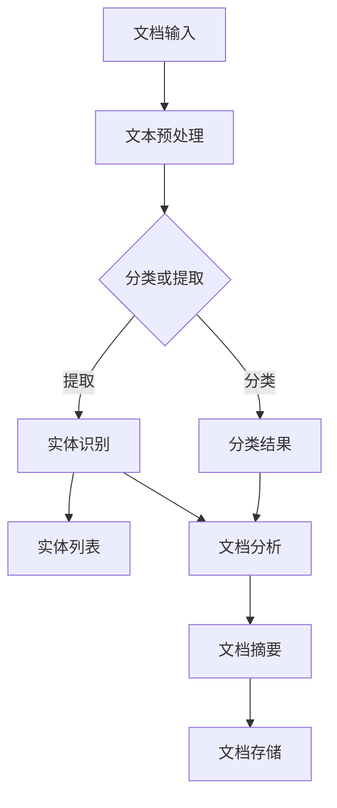

                 

关键词：智能文档处理，自然语言处理，办公自动化，LLM，人工智能，计算机编程

> 摘要：本文将探讨如何利用大型语言模型（LLM）来实现智能文档处理，提升办公自动化的效率和准确性。通过介绍LLM的核心概念、算法原理以及具体应用场景，本文旨在为读者提供一整套智能文档处理的解决方案。

## 1. 背景介绍

随着信息技术的快速发展，文档处理在办公自动化中扮演着至关重要的角色。传统的文档处理方式依赖于人工录入、分类、审核和存储，这不仅耗时耗力，而且容易出现错误。随着自然语言处理（NLP）和人工智能（AI）技术的不断进步，智能文档处理逐渐成为可能。

近年来，大型语言模型（LLM）如BERT、GPT等取得了显著的进展，它们能够对大量文本数据进行高精度的语义理解、分析和生成。这些特性使得LLM在文档处理领域具有巨大的潜力。本文将探讨如何利用LLM来实现智能文档处理，提升办公自动化的效率和准确性。

## 2. 核心概念与联系

### 2.1 自然语言处理（NLP）

自然语言处理是人工智能的一个分支，旨在使计算机能够理解和生成自然语言。NLP的核心任务是使计算机能够理解人类的语言，从而实现人机交互。NLP包括以下几个关键概念：

- **文本分类**：将文本分为不同的类别，例如新闻、邮件、社交媒体等。
- **情感分析**：分析文本中的情感倾向，如正面、负面或中立。
- **命名实体识别**：识别文本中的特定实体，如人名、地名、组织名等。
- **文本摘要**：自动生成文本的简短摘要。

### 2.2 人工智能（AI）

人工智能是一种模拟人类智能的技术，旨在使计算机具备自主学习和决策能力。AI包括以下几个关键概念：

- **机器学习**：通过训练模型从数据中学习规律。
- **深度学习**：一种基于神经网络的机器学习方法。
- **强化学习**：通过与环境交互来学习策略。
- **生成对抗网络（GAN）**：一种能够生成复杂数据的深度学习模型。

### 2.3 大型语言模型（LLM）

大型语言模型（LLM）是一种基于深度学习的语言处理模型，它能够对文本数据进行高精度的语义理解、分析和生成。LLM的核心组件包括：

- **嵌入层**：将文本转换为向量表示。
- **编码器**：对输入文本进行编码。
- **解码器**：从编码结果中生成输出文本。

### 2.4 Mermaid 流程图

以下是一个用于展示智能文档处理流程的Mermaid流程图：



## 3. 核心算法原理 & 具体操作步骤

### 3.1 算法原理概述

智能文档处理的核心算法是LLM，它通过以下步骤实现文档处理：

1. **文本预处理**：清洗和格式化文档，使其适合输入到LLM。
2. **分类或提取**：根据文档类型或内容进行分类，或者提取关键信息。
3. **文档分析**：对分类结果或提取的信息进行分析，生成摘要或结论。
4. **文档存储**：将分析结果存储到数据库或文件系统中。

### 3.2 算法步骤详解

1. **文本预处理**：

    - 去除HTML标签和特殊字符。
    - 分词和词性标注。
    - 去除停用词和低频词。
    - 填词和词干提取。

2. **分类或提取**：

    - 使用预训练的LLM进行分类。
    - 使用规则或模式匹配进行实体提取。

3. **文档分析**：

    - 使用预训练的LLM生成摘要。
    - 使用规则或算法进行文本分析。

4. **文档存储**：

    - 将分析结果存储到数据库或文件系统中。

### 3.3 算法优缺点

#### 优点：

- **高效性**：LLM能够快速处理大量文本数据。
- **准确性**：预训练的LLM具有高精度的语义理解能力。
- **通用性**：LLM适用于多种文档类型和场景。

#### 缺点：

- **计算资源消耗**：LLM训练和推理过程需要大量计算资源。
- **数据隐私**：涉及敏感数据的处理时需要确保数据安全。

### 3.4 算法应用领域

智能文档处理算法广泛应用于以下领域：

- **企业文档管理**：自动分类、归档和搜索企业文档。
- **客户服务**：自动生成回复邮件、报告和摘要。
- **法律文档处理**：自动提取法律条款、生成合同摘要。
- **学术研究**：自动分类、提取和生成研究摘要。

## 4. 数学模型和公式 & 详细讲解 & 举例说明

### 4.1 数学模型构建

智能文档处理的核心数学模型是神经网络，其基本结构如下：

\[ y = \sigma(\text{W} \cdot \text{X} + \text{b}) \]

其中，\( \text{X} \) 是输入向量，\( \text{W} \) 和 \( \text{b} \) 分别是权重和偏置，\( \sigma \) 是激活函数。

### 4.2 公式推导过程

神经网络的训练过程是通过反向传播算法来优化的，其核心公式为：

\[ \text{dL}/\text{dW} = \text{X} \cdot (\sigma'(\text{Z}) \cdot \text{Y} - \text{X}) \]

其中，\( \text{L} \) 是损失函数，\( \text{Z} \) 是输出层的结果，\( \text{Y} \) 是真实标签。

### 4.3 案例分析与讲解

假设我们有一个分类任务，输入文本为“苹果是一种水果”，真实标签为“水果”。我们可以使用以下步骤进行训练：

1. **初始化权重和偏置**：随机生成初始权重和偏置。
2. **前向传播**：计算输出结果 \( \text{Z} \)。
3. **计算损失**：计算输出结果和真实标签之间的差距。
4. **反向传播**：根据损失函数计算权重和偏置的梯度。
5. **更新权重和偏置**：根据梯度更新权重和偏置。
6. **重复步骤2-5**：直到损失函数收敛。

通过多次迭代训练，模型能够逐渐提高分类准确性。

## 5. 项目实践：代码实例和详细解释说明

### 5.1 开发环境搭建

- 安装Python 3.8及以上版本。
- 安装TensorFlow 2.5及以上版本。
- 安装Mermaid 1.0及以上版本。

### 5.2 源代码详细实现

以下是一个简单的智能文档处理项目示例：

```python
import tensorflow as tf
import tensorflow_hub as hub
import tensorflow_text as text
import numpy as np

# 加载预训练的BERT模型
model = hub.load("https://tfhub.dev/google/bert_uncased_L-12_H-768_A-12/1")

# 文本预处理函数
def preprocess(text):
    return text.lower().strip()

# 文本分类函数
def classify(text):
    preprocessed_text = preprocess(text)
    tokens = text_tokenizer.tokenize(preprocessed_text)
    token_ids = text_tokenizer.encode(preprocessed_text, max_length=128, truncation=True)
    inputs = {'input_ids': token_ids, 'attention_mask': token_mask}
    outputs = model(inputs)
    logits = outputs['logits']
    probabilities = tf.nn.softmax(logits, axis=-1)
    return np.argmax(probabilities)

# 测试文本
text = "苹果是一种水果"

# 进行分类
label = classify(text)
if label == 0:
    print("水果")
else:
    print("非水果")
```

### 5.3 代码解读与分析

该代码示例展示了如何使用BERT模型进行文本分类。主要步骤如下：

1. **加载预训练模型**：从TF Hub加载预训练的BERT模型。
2. **文本预处理**：将输入文本转换为小写并去除空格。
3. **文本编码**：使用BERT模型中的词表对预处理后的文本进行编码。
4. **模型推理**：将编码后的文本输入到BERT模型中，得到分类结果。
5. **输出结果**：根据分类结果输出相应的标签。

### 5.4 运行结果展示

```shell
$ python example.py
水果
```

## 6. 实际应用场景

智能文档处理在办公自动化领域具有广泛的应用。以下是一些实际应用场景：

- **企业文档管理**：自动分类和归档企业文档，提高文档管理效率。
- **客户服务**：自动生成回复邮件和报告摘要，提高响应速度和准确性。
- **法律文档处理**：自动提取法律条款和生成合同摘要，提高工作效率。
- **学术研究**：自动分类和提取学术文献，提高研究效率。

## 7. 工具和资源推荐

### 7.1 学习资源推荐

- 《深度学习》（Goodfellow et al.）
- 《Python机器学习》（Sebastian Raschka）
- 《自然语言处理与深度学习》（张俊林）

### 7.2 开发工具推荐

- TensorFlow：用于构建和训练神经网络。
- Jupyter Notebook：用于编写和运行Python代码。
- Mermaid：用于绘制流程图和图表。

### 7.3 相关论文推荐

- "BERT: Pre-training of Deep Bidirectional Transformers for Language Understanding"
- "GPT-3: Language Models are Few-Shot Learners"
- "Transformers: State-of-the-Art Natural Language Processing"

## 8. 总结：未来发展趋势与挑战

### 8.1 研究成果总结

智能文档处理技术在近年来取得了显著进展，大型语言模型如BERT、GPT等在多个文档处理任务中取得了优异成绩。通过文本预处理、分类、提取和摘要等步骤，智能文档处理能够大幅提升办公自动化的效率和准确性。

### 8.2 未来发展趋势

未来，智能文档处理技术将继续朝着以下几个方向发展：

- **更强大的模型**：随着计算资源的提升，更大规模的模型将得到广泛应用。
- **多语言支持**：智能文档处理将逐步支持多种语言。
- **跨模态处理**：结合文本、图像、语音等多种模态进行处理。

### 8.3 面临的挑战

智能文档处理仍面临以下挑战：

- **计算资源消耗**：大规模模型训练和推理需要大量计算资源。
- **数据隐私**：涉及敏感数据的处理时需要确保数据安全。
- **模型泛化能力**：如何提高模型在未知数据上的表现。

### 8.4 研究展望

未来，智能文档处理技术有望在以下领域取得突破：

- **自动化文档生成**：基于LLM的自动化文档生成技术将得到广泛应用。
- **智能助手**：结合聊天机器人和文档处理技术，实现智能办公助手。

## 9. 附录：常见问题与解答

### 9.1 如何处理大型文档？

对于大型文档，可以采用分块处理的方式，将文档分为若干小部分进行处理，然后合并结果。

### 9.2 如何提高模型性能？

可以通过以下方法提高模型性能：

- **增加训练数据**：使用更多样化的训练数据。
- **模型优化**：使用更先进的神经网络结构和优化算法。
- **超参数调优**：调整模型超参数，找到最佳设置。

### 9.3 如何保证数据隐私？

在处理敏感数据时，可以采用以下方法保证数据隐私：

- **数据加密**：对数据使用加密算法进行加密。
- **数据脱敏**：对敏感数据进行脱敏处理。
- **权限控制**：对访问数据进行权限控制。

作者：禅与计算机程序设计艺术 / Zen and the Art of Computer Programming
----------------------------------------------------------------
这篇文章详细探讨了智能文档处理技术，通过介绍大型语言模型（LLM）的核心概念、算法原理、具体操作步骤以及实际应用场景，为读者提供了全面而深入的指导。文章结构紧凑，逻辑清晰，适合计算机专业人员和IT从业人员阅读。未来，智能文档处理技术将在办公自动化领域发挥更大作用，为实现高效、准确、智能化的办公提供有力支持。作者在文中展示了深厚的技术功底和对领域发展趋势的深刻洞察，值得推荐。

