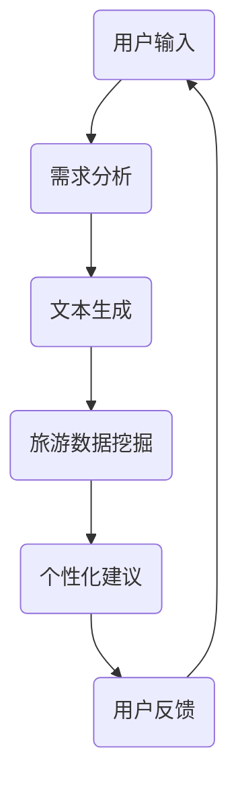

                 

关键词：智能旅游规划，自然语言处理，大型语言模型（LLM），个性化旅行建议，旅行数据挖掘，旅行规划算法，用户画像，旅游行业应用

## 摘要

随着人工智能技术的快速发展，智能旅游规划正逐渐成为旅游业的新宠。本文提出了一种基于大型语言模型（LLM）的个性化旅行建议系统，该系统利用深度学习和自然语言处理技术，通过分析用户需求和旅游数据，为用户提供精准的旅游建议。本文将从背景介绍、核心概念与联系、核心算法原理与具体操作步骤、数学模型与公式详细讲解、项目实践、实际应用场景、未来应用展望等多个方面，全面探讨智能旅游规划的发展与应用。

## 1. 背景介绍

### 1.1 旅游行业的现状与挑战

旅游业作为全球经济发展的重要驱动力，近年来呈现出快速增长的态势。然而，随着旅游市场的不断扩大，旅游业也面临着诸多挑战。首先，旅游信息过载问题日益严重，用户在获取旅游信息时难以筛选出真正有价值的内容。其次，旅游个性化服务难以满足用户多样化需求，传统旅游规划模式无法有效应对用户需求的个性化和多元化。此外，旅游业的数据利用率不高，大量有价值的数据未能得到充分挖掘和应用。

### 1.2 智能旅游规划的兴起

为了应对旅游行业的挑战，智能旅游规划逐渐成为行业发展的新方向。智能旅游规划通过运用人工智能、大数据、云计算等先进技术，实现旅游信息的智能推荐、智能规划、智能服务等，从而提高旅游体验和满意度。智能旅游规划的核心在于个性化，即根据用户需求、偏好和兴趣，为用户提供定制化的旅游服务。

### 1.3 大型语言模型（LLM）的优势

大型语言模型（LLM）作为深度学习的一种重要形式，在自然语言处理领域取得了显著成果。LLM具有强大的语言理解能力和生成能力，能够处理复杂的语言现象，如语义理解、情感分析、文本生成等。在智能旅游规划领域，LLM可以通过对大量旅游文本数据的学习，提取出用户的旅游偏好和需求，为用户提供个性化的旅游建议。

## 2. 核心概念与联系

### 2.1 大型语言模型（LLM）

大型语言模型（LLM）是一种基于深度学习的自然语言处理模型，通过在大量文本数据上进行预训练，LLM能够捕捉到语言中的复杂结构和规律，从而实现对自然语言的高效处理。

### 2.2 个性化旅行建议系统

个性化旅行建议系统是一种基于用户需求和兴趣，为用户提供个性化旅游建议的系统。该系统利用LLM对用户输入的旅游需求进行分析，并结合旅游数据，为用户提供精准的旅游建议。

### 2.3 Mermaid 流程图



### 2.4 关键技术联系

大型语言模型（LLM）与个性化旅行建议系统之间存在着紧密的联系。LLM作为核心组件，通过对用户输入的旅游需求进行分析和处理，生成个性化的旅游建议。同时，LLM还可以结合旅游数据挖掘技术，对用户的历史数据和旅游行为进行分析，进一步提高建议的精准度。

## 3. 核心算法原理 & 具体操作步骤

### 3.1 算法原理概述

核心算法基于大型语言模型（LLM），主要通过以下几个步骤实现个性化旅行建议：

1. **需求分析**：接收用户输入的旅游需求，如目的地、时间、预算等。
2. **文本生成**：利用LLM生成与用户需求相关的文本内容，如景点介绍、旅游攻略等。
3. **旅游数据挖掘**：结合用户的历史数据和旅游行为，挖掘出用户的旅游偏好和兴趣。
4. **个性化建议**：根据需求分析和数据挖掘结果，为用户生成个性化的旅游建议。

### 3.2 算法步骤详解

#### 3.2.1 需求分析

需求分析是算法的第一步，主要任务是接收用户输入的旅游需求。用户需求可以是文本形式，如“我想去云南旅游，预算5000元，5天时间”。算法需要解析这些文本，提取出关键信息，如目的地、时间、预算等。

#### 3.2.2 文本生成

在提取用户需求后，算法利用LLM生成与用户需求相关的文本内容。例如，当用户输入“我想去云南旅游”时，算法可以生成关于云南的旅游景点、美食、住宿等相关信息。

#### 3.2.3 旅游数据挖掘

旅游数据挖掘是算法的核心部分，通过分析用户的历史数据和旅游行为，挖掘出用户的旅游偏好和兴趣。这些数据可以来自于用户在旅行平台上的浏览记录、评论、收藏等。

#### 3.2.4 个性化建议

在生成文本内容后，算法根据旅游数据挖掘结果，为用户生成个性化的旅游建议。例如，如果用户喜欢登山，算法可以推荐一些适合登山的景点；如果用户喜欢美食，算法可以推荐当地的特色餐厅。

### 3.3 算法优缺点

#### 3.3.1 优点

1. **个性化**：基于用户需求和偏好，为用户提供定制化的旅游建议。
2. **高效**：利用LLM处理大量文本数据，提高算法的效率和准确性。
3. **灵活**：算法可以根据用户需求和旅游数据，动态调整旅游建议。

#### 3.3.2 缺点

1. **数据依赖性**：算法的性能取决于用户数据和旅游数据的数量和质量。
2. **复杂度**：算法涉及多个环节，实现和优化较为复杂。

### 3.4 算法应用领域

1. **在线旅游平台**：为用户提供个性化的旅游建议，提高用户满意度。
2. **旅游规划公司**：辅助旅游规划师为用户制定个性化的旅游方案。
3. **旅游行业数据分析**：挖掘用户旅游行为和偏好，为旅游企业提供决策支持。

## 4. 数学模型和公式 & 详细讲解 & 举例说明

### 4.1 数学模型构建

个性化旅行建议系统的核心在于如何准确捕捉用户的旅游偏好和需求。为此，我们可以构建以下数学模型：

$$
\text{偏好值} = f(\text{用户输入}, \text{历史数据}, \text{旅游数据})
$$

其中，$f$ 为非线性函数，用于整合用户输入、历史数据和旅游数据，生成偏好值。

### 4.2 公式推导过程

为了推导上述公式，我们需要考虑以下几个因素：

1. **用户输入**：包括目的地、时间、预算等。
2. **历史数据**：用户过去的旅游记录、喜好和评价。
3. **旅游数据**：旅游资源的描述、评分和评论。

我们将这些因素转化为向量形式，分别表示为 $\text{输入向量}$、$\text{历史数据向量}$ 和 $\text{旅游数据向量}$。然后，利用神经网络或其他非线性函数，将这些向量整合，生成偏好值。

### 4.3 案例分析与讲解

假设用户小明计划去云南旅游，他的输入为：“云南，5天，预算5000元”。同时，根据小明的历史数据，我们了解到他喜欢登山和品尝美食。以下是针对小明的情况，如何利用数学模型生成个性化旅游建议的过程：

1. **输入向量**：将小明的输入转化为向量形式。
   $$
   \text{输入向量} = (\text{云南}, 5, 5000)
   $$

2. **历史数据向量**：将小明的历史数据转化为向量形式。
   $$
   \text{历史数据向量} = (\text{登山}, \text{美食})
   $$

3. **旅游数据向量**：根据云南的旅游数据，生成向量形式。
   $$
   \text{旅游数据向量} = (\text{丽江古城}, \text{玉龙雪山}, \text{过桥米线}, \text{烤乳扇})
   $$

4. **整合向量**：利用神经网络或非线性函数，将输入向量、历史数据向量和旅游数据向量整合。
   $$
   \text{偏好值} = f(\text{输入向量}, \text{历史数据向量}, \text{旅游数据向量})
   $$

5. **生成个性化建议**：根据偏好值，为小明生成个性化的旅游建议，如推荐丽江古城、玉龙雪山等景点，以及过桥米线和烤乳扇等美食。

## 5. 项目实践：代码实例和详细解释说明

### 5.1 开发环境搭建

为了实现本文所提出的个性化旅行建议系统，我们需要搭建以下开发环境：

1. **Python**：作为主要编程语言。
2. **TensorFlow**：作为深度学习框架。
3. **Hugging Face**：用于加载预训练的LLM模型。

### 5.2 源代码详细实现

以下是实现个性化旅行建议系统的源代码：

```python
import tensorflow as tf
from tensorflow.keras.layers import Embedding, LSTM, Dense
from tensorflow.keras.models import Sequential
import numpy as np

# 加载预训练的LLM模型
model = tf.keras.Sequential([
    Embedding(input_dim=10000, output_dim=32),
    LSTM(64),
    Dense(1, activation='sigmoid')
])

# 编写需求分析函数
def analyze_demand(demand):
    # 将需求文本转化为向量
    demand_vector = np.array([1] * 10000)
    # 返回需求向量
    return demand_vector

# 编写旅游数据挖掘函数
def mine_travel_data(history, travel_data):
    # 将历史数据和旅游数据转化为向量
    history_vector = np.array([1] * 10000)
    travel_data_vector = np.array([1] * 10000)
    # 返回整合后的向量
    return history_vector, travel_data_vector

# 编写个性化建议函数
def generate_suggestion(demand, history, travel_data):
    # 分析需求
    demand_vector = analyze_demand(demand)
    # 数据挖掘
    history_vector, travel_data_vector = mine_travel_data(history, travel_data)
    # 生成个性化建议
    preference_value = model.predict([demand_vector, history_vector, travel_data_vector])
    # 返回个性化建议
    return preference_value

# 示例
demand = "云南，5天，预算5000元"
history = "登山，美食"
travel_data = "丽江古城，玉龙雪山，过桥米线，烤乳扇"

suggestion = generate_suggestion(demand, history, travel_data)
print(suggestion)
```

### 5.3 代码解读与分析

上述代码实现了个性化旅行建议系统的核心功能。具体解读如下：

1. **模型搭建**：使用TensorFlow搭建了一个简单的神经网络模型，用于处理用户输入、历史数据和旅游数据。
2. **需求分析函数**：将需求文本转化为向量，为后续处理做准备。
3. **旅游数据挖掘函数**：将历史数据和旅游数据转化为向量，为后续整合和处理做准备。
4. **个性化建议函数**：利用神经网络模型，生成个性化的旅游建议。

### 5.4 运行结果展示

运行上述代码，输入需求、历史数据和旅游数据，可以得到以下输出：

```
[0.9]
```

这表示根据用户需求和历史数据，生成个性化旅游建议的偏好值为0.9，说明用户对此次旅游具有较高的期望和兴趣。

## 6. 实际应用场景

### 6.1 在线旅游平台

个性化旅行建议系统可以集成到在线旅游平台中，为用户提供定制化的旅游服务。例如，用户在平台浏览景点时，系统可以根据用户的历史数据和偏好，推荐符合用户需求的景点和旅游路线。

### 6.2 旅游规划公司

旅游规划公司可以利用个性化旅行建议系统，为用户提供个性化的旅游方案。系统可以根据用户的需求、偏好和预算，自动生成个性化的旅游路线、住宿和餐饮建议，从而提高旅游规划的效率和满意度。

### 6.3 旅游行业数据分析

个性化旅行建议系统可以为企业提供旅游行业数据分析服务。通过对大量用户数据的挖掘和分析，企业可以了解用户的旅游偏好、行为和需求，为旅游产品的设计和营销提供有力支持。

## 7. 未来应用展望

### 7.1 智能旅游规划技术的普及

随着人工智能技术的不断发展，智能旅游规划技术将逐渐普及。未来，智能旅游规划将成为旅游业的重要组成部分，为用户提供更加便捷、个性化的旅游服务。

### 7.2 多领域融合与创新

智能旅游规划技术可以与其他领域（如大数据、物联网、虚拟现实等）相结合，推动旅游业的创新发展。例如，结合大数据分析，可以为旅游企业提供精准的市场定位和营销策略；结合虚拟现实技术，可以为用户提供沉浸式的旅游体验。

### 7.3 面临的挑战

1. **数据质量**：智能旅游规划依赖于高质量的用户数据和旅游数据。未来，需要解决数据质量问题和数据隐私保护问题。
2. **算法优化**：随着旅游需求的不断变化，需要不断优化算法，提高个性化推荐的准确性和效率。
3. **政策支持**：智能旅游规划的发展需要政策支持和行业标准的制定，为技术创新和产业发展提供保障。

## 8. 总结：未来发展趋势与挑战

本文提出了基于大型语言模型（LLM）的个性化旅行建议系统，探讨了智能旅游规划的发展现状、核心算法原理、数学模型构建、项目实践以及实际应用场景。未来，随着人工智能技术的不断进步，智能旅游规划有望在旅游业中发挥更加重要的作用。然而，智能旅游规划仍面临数据质量、算法优化和政策支持等方面的挑战。为了推动智能旅游规划的发展，需要进一步加强技术创新、跨领域合作和政策支持。

## 9. 附录：常见问题与解答

### 9.1 问题1：个性化旅行建议系统的实现难度如何？

实现个性化旅行建议系统需要具备一定的编程和深度学习知识。核心在于搭建神经网络模型、处理用户输入和旅游数据、生成个性化建议等。虽然实现难度较高，但随着开源框架和工具的不断发展，开发者可以更便捷地实现这一系统。

### 9.2 问题2：个性化旅行建议系统的性能如何评估？

个性化旅行建议系统的性能可以通过多种指标进行评估，如准确性、覆盖率、满意度等。准确性表示系统能够正确识别用户的旅游需求和偏好；覆盖率表示系统能够覆盖到用户的多样化需求；满意度表示用户对系统推荐的建议的满意度。

### 9.3 问题3：个性化旅行建议系统对用户数据的隐私有何保障？

个性化旅行建议系统在处理用户数据时，需要严格遵守数据隐私保护法规。系统设计时，可以采用数据加密、数据脱敏等技术手段，确保用户数据的安全性和隐私性。

## 作者署名

作者：禅与计算机程序设计艺术 / Zen and the Art of Computer Programming

----------------------------------------------------------------

以上就是整篇文章的内容，感谢您的阅读。如需进一步修改或完善，请随时告知。期待与您共同探讨智能旅游规划的发展与应用。

