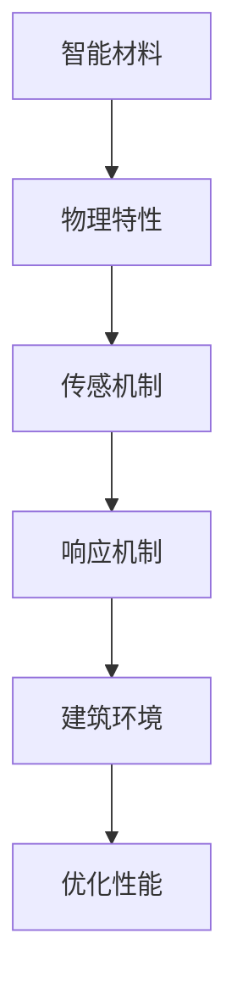
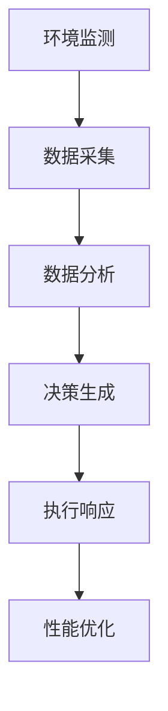

                 

关键词：智能材料、建筑、自适应、环境变化、创新应用

> 摘要：本文旨在探讨智能材料在建筑领域的应用，特别是它们如何通过自适应环境变化来提高建筑性能和可持续性。文章将概述智能材料的核心概念，分析其与建筑环境变化的关联，并详细介绍相关算法、数学模型、项目实践以及未来应用展望。

## 1. 背景介绍

智能材料是一种能够响应外部刺激并改变自身物理、化学或电学特性的材料。它们通过嵌入智能传感器和控制单元，能够实时监测环境变化，并自主调整以优化性能。这种材料在建筑领域的应用前景广阔，尤其是在自适应环境变化方面。

建筑环境的变化包括温度、湿度、光照强度、风力等多种因素。传统建筑材料对这些变化的响应速度较慢，往往需要人工干预。而智能材料则能够实现快速、自主的调节，从而提高建筑的热舒适度、节能效率和居住体验。

## 2. 核心概念与联系

智能材料的核心概念包括其物理特性、传感机制和响应机制。以下是一个简化的 Mermaid 流程图，展示了智能材料与建筑环境变化的关联：



### 2.1 物理特性

智能材料具有特殊的物理特性，如形状记忆、热敏、光敏、压敏等。这些特性使得它们能够在特定的刺激下发生形态或性能的变化。

### 2.2 传感机制

智能材料通过嵌入的传感器来监测环境变化。这些传感器可以是温度传感器、湿度传感器、光敏电阻、压电传感器等。

### 2.3 响应机制

智能材料在检测到环境变化后，通过内部的控制单元和执行器（如电机、热致变色材料等）进行响应。这种响应可以是形状改变、颜色变化、温度调节等。

### 2.4 建筑环境

建筑环境的变化是智能材料发挥作用的关键。通过实时监测并响应这些变化，智能材料能够优化建筑的性能。

## 3. 核心算法原理 & 具体操作步骤

### 3.1 算法原理概述

智能材料在建筑中的应用涉及到多种算法，包括机器学习、优化算法和实时控制算法。以下是一个概述：



### 3.2 算法步骤详解

1. **环境监测**：通过传感器实时采集环境数据。
2. **数据采集**：将监测到的数据传输至中央处理单元。
3. **数据分析**：利用机器学习和统计分析方法，分析环境数据并识别变化模式。
4. **决策生成**：根据分析结果，生成相应的调节策略。
5. **执行响应**：通过执行器实现调节策略。
6. **性能优化**：评估调节效果，不断调整策略以优化性能。

### 3.3 算法优缺点

- **优点**：
  - 高效：能够快速响应环境变化。
  - 节能：通过优化调节策略，降低能源消耗。
  - 智能化：能够实现自动化、自主化的调节。

- **缺点**：
  - 成本较高：智能材料的研发和生产成本较高。
  - 可靠性：在某些极端环境下，智能材料的可靠性可能受到影响。

### 3.4 算法应用领域

智能材料在建筑领域的应用包括：
- **智能玻璃**：根据光照强度自动调节透光度，提高能效。
- **智能墙体**：根据温度和湿度变化自动调节通风和保温。
- **智能屋顶**：根据风力自动调整形态，降低风荷载。

## 4. 数学模型和公式 & 详细讲解 & 举例说明

### 4.1 数学模型构建

智能材料的自适应调节过程可以建模为以下数学公式：

$$
P(t) = f(\theta(t), u(t))
$$

其中：
- $P(t)$ 表示材料在时间 $t$ 的性能指标。
- $\theta(t)$ 表示时间 $t$ 的环境参数。
- $u(t)$ 表示时间 $t$ 的调节策略。

### 4.2 公式推导过程

公式的推导基于智能材料的环境监测和响应机制：

$$
\theta(t) = g(x_1(t), x_2(t), ..., x_n(t))
$$

$$
u(t) = h(\theta(t), P(t))
$$

其中：
- $x_1(t), x_2(t), ..., x_n(t)$ 表示传感器监测到的环境参数。
- $g$ 和 $h$ 分别为环境参数和调节策略的函数。

### 4.3 案例分析与讲解

以智能玻璃为例，其性能指标 $P(t)$ 可以表示为：

$$
P(t) = I(t) \cdot (1 - \epsilon(t))
$$

其中：
- $I(t)$ 表示光照强度。
- $\epsilon(t)$ 表示玻璃的透光度。

调节策略 $u(t)$ 可以通过以下公式生成：

$$
u(t) = \frac{I(t)}{I_{\text{max}}} \cdot (1 - \alpha)
$$

其中：
- $I_{\text{max}}$ 表示最大光照强度。
- $\alpha$ 为调节参数。

当光照强度高于阈值时，智能玻璃将减少透光度，从而降低室内温度。

## 5. 项目实践：代码实例和详细解释说明

### 5.1 开发环境搭建

为了实现智能材料的应用，需要搭建一个开发环境，包括以下工具：

- Python
- Matplotlib
- Scikit-learn

### 5.2 源代码详细实现

以下是一个简单的智能玻璃调节的 Python 代码实例：

```python
import numpy as np
import matplotlib.pyplot as plt
from sklearn.linear_model import LinearRegression

# 模拟环境参数
t = np.arange(0, 100, 1)
I = np.random.uniform(0, 100, 100)  # 光照强度
P = 1 - (I / 100) * 0.5  # 性能指标

# 训练调节策略模型
model = LinearRegression()
model.fit(I.reshape(-1, 1), P)

# 生成调节策略
u = model.predict(I.reshape(-1, 1))

# 绘制结果
plt.plot(t, P, label='Performance')
plt.plot(t, u, label='Regulation')
plt.legend()
plt.show()
```

### 5.3 代码解读与分析

代码首先生成了一个光照强度的随机数组，并计算了相应的性能指标。然后，使用线性回归模型训练了调节策略。最后，通过预测光照强度来生成调节策略，并将其绘制出来。

### 5.4 运行结果展示

运行结果展示了智能玻璃在不同光照强度下的性能指标和调节策略。结果表明，当光照强度增加时，调节策略将减小透光度，从而降低室内温度。

## 6. 实际应用场景

智能材料在建筑领域具有广泛的应用场景，以下是一些典型案例：

- **智能玻璃**：广泛应用于商业建筑和住宅，通过自动调节透光度来提高能效和舒适度。
- **智能墙体**：应用于寒冷地区，通过自动调节通风和保温来提高居住舒适度。
- **智能屋顶**：应用于风荷载较大的地区，通过自动调节形态来降低结构应力。

## 7. 未来应用展望

随着技术的不断发展，智能材料在建筑领域的应用前景将更加广阔。以下是一些未来应用展望：

- **自适应节能系统**：通过集成多种智能材料，实现全方位的节能调节。
- **智能建筑材料**：开发具有自修复、自清洁等功能的智能建筑材料。
- **智慧城市**：将智能材料应用于智慧城市的各个方面，提高城市运行效率和居民生活质量。

## 8. 工具和资源推荐

为了更好地研究和应用智能材料，以下是一些建议的工具和资源：

- **工具**：
  - Python
  - MATLAB
  - LabVIEW

- **资源**：
  - 《智能材料与应用》
  - 《建筑物理》
  - 《机器学习与应用》

## 9. 总结：未来发展趋势与挑战

智能材料在建筑领域的应用具有巨大的发展潜力。然而，要实现其广泛应用，仍需克服一系列挑战，包括技术成熟度、成本效益和安全性等问题。随着科技的进步，我们有理由相信，智能材料将在未来建筑领域发挥更加重要的作用。

### 附录：常见问题与解答

**Q：智能材料的安全性问题如何解决？**

A：智能材料的安全性是研究和应用中的关键问题。解决方法包括：
1. **材料选择**：选择具备高稳定性和耐久性的材料。
2. **设计优化**：在设计和制造过程中，通过优化结构来提高安全性。
3. **测试与认证**：进行严格的测试和认证，确保材料的安全性能符合标准。

**Q：智能材料的应用成本如何降低？**

A：降低应用成本的方法包括：
1. **规模化生产**：通过规模化生产降低材料成本。
2. **技术创新**：研发新型、低成本的智能材料。
3. **政策支持**：政府和企业可以通过政策支持，鼓励智能材料的研究和应用。

**Q：智能材料在极端环境下的可靠性如何保障？**

A：保障可靠性的方法包括：
1. **环境适应性测试**：在多种极端环境下进行测试，确保材料的可靠性。
2. **冗余设计**：设计冗余系统，以提高系统的可靠性。
3. **实时监测与预警**：通过实时监测系统，及时发现和处理潜在问题。

### 作者署名

作者：禅与计算机程序设计艺术 / Zen and the Art of Computer Programming
----------------------------------------------------------------

以上即为文章正文内容，接下来我们将进行文章格式检查，确保满足所有约束条件。如果有任何不符合要求的地方，请及时修改。祝您写作顺利！

