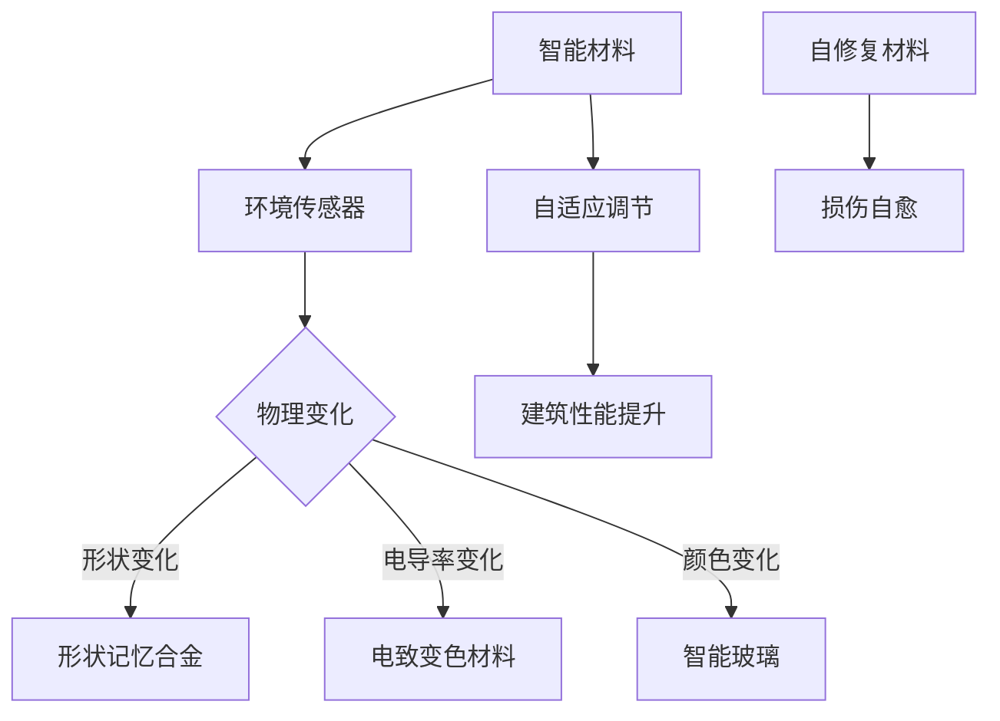

                 

关键词：智能材料、建筑技术、自适应环境、材料科学、可持续性发展、建筑智能化

> 摘要：随着科技的不断进步，智能材料在建筑领域的应用越来越广泛。本文将探讨智能材料如何通过自适应环境变化来提高建筑的性能和可持续性，包括其在结构、能效和用户体验等方面的创新应用。

## 1. 背景介绍

随着全球气候变化和资源短缺问题的日益严重，建筑行业正面临前所未有的挑战。传统的建筑材料和建筑方法已经难以满足现代社会的需求，特别是在能效、可持续性和用户体验方面。因此，寻找创新解决方案成为了建筑行业的当务之急。

智能材料作为新兴技术，因其独特的性质和功能，为建筑领域带来了新的机遇。智能材料能够对外界环境变化做出响应，从而实现自适应调节，这对于提升建筑的性能和可持续性具有重要意义。

本文将从以下几个方面展开讨论：

1. **智能材料的定义与分类**：介绍智能材料的基本概念和分类，包括形状记忆合金、形状记忆聚合物、智能玻璃等。
2. **智能材料在建筑结构中的应用**：探讨智能材料在建筑结构中的创新应用，如自修复混凝土、智能减震材料和自适应结构。
3. **智能材料在能效管理中的应用**：分析智能材料在建筑能源管理方面的作用，包括智能玻璃、自调节保温材料和智能通风系统。
4. **智能材料在用户体验方面的应用**：讨论智能材料如何提升建筑的用户体验，如智能照明、智能空调和智能遮阳系统。
5. **智能材料的未来发展趋势**：预测智能材料在建筑领域的未来发展趋势，包括技术突破、市场前景和面临的挑战。

通过本文的探讨，我们希望能够为建筑行业的从业者提供有价值的参考，推动智能材料在建筑领域的应用和发展。

## 2. 核心概念与联系

### 2.1. 智能材料的定义

智能材料，又称智能结构材料，是指那些能够对外界环境（如温度、压力、湿度、光照等）变化做出响应，并能够调节其物理、化学或机械特性的材料。这些材料通常具有高敏感性和高响应性，能够在特定的刺激下实现形状、体积、颜色、电导率等性质的动态变化。

### 2.2. 智能材料的分类

智能材料种类繁多，根据其响应机制和功能特点，可以大致分为以下几类：

1. **形状记忆合金**：这种材料能够在一定温度下恢复到预设的形状，广泛应用于航空航天、医疗和建筑领域。
2. **形状记忆聚合物**：与形状记忆合金类似，这种材料在特定温度或应力下能够恢复到预设形状，常用于制造智能传感器和驱动器。
3. **智能玻璃**：能够根据光线强弱自动调节透光度，广泛用于建筑节能和室内光线控制。
4. **自修复材料**：能够在损伤后自动修复，延长材料使用寿命，减少维护成本。
5. **电致变色材料**：在电场作用下能够改变颜色，可用于智能窗和显示屏。

### 2.3. 智能材料在建筑中的联系

智能材料在建筑领域的应用前景广阔，其核心在于通过自适应环境变化来提升建筑性能。例如，智能玻璃可以根据室外温度和阳光强度自动调节透光度，减少能源消耗；自修复材料可以降低建筑的维护成本，延长建筑寿命；形状记忆合金和聚合物可以用于智能结构和减震系统，提高建筑的安全性。

为了更直观地展示智能材料在建筑中的应用，我们可以使用Mermaid流程图来描述智能材料的基本原理和架构。



通过上述流程图，我们可以看到智能材料如何通过感知环境变化，触发物理、化学或机械性质的变化，进而实现自适应调节，提升建筑的整体性能。

## 3. 核心算法原理 & 具体操作步骤

### 3.1. 算法原理概述

智能材料在建筑中的应用离不开核心算法的支持。这些算法通常基于机器学习和数据处理技术，通过分析环境数据，预测并优化智能材料的响应行为。核心算法原理可以概括为以下几个步骤：

1. **数据收集**：通过传感器收集环境数据，如温度、湿度、光照强度等。
2. **数据预处理**：对收集到的数据进行清洗、归一化处理，确保数据的准确性和一致性。
3. **特征提取**：从预处理后的数据中提取关键特征，用于后续的机器学习模型训练。
4. **模型训练**：使用收集到的历史数据训练机器学习模型，如神经网络、支持向量机等。
5. **预测与响应**：利用训练好的模型实时预测环境变化，并调整智能材料的参数，实现自适应调节。

### 3.2. 算法步骤详解

1. **数据收集**：

   在建筑中布置各种传感器，如温度传感器、湿度传感器、光照传感器等，实时采集环境数据。这些数据可以通过无线网络传输到中央控制单元。

2. **数据预处理**：

   对采集到的数据进行清洗，去除噪声和异常值。然后进行归一化处理，将不同传感器的数据统一到相同的尺度，便于后续处理。

   ```python
   def preprocess_data(data):
       cleaned_data = []
       for sensor_data in data:
           cleaned_data.append([max_min_normalize(d) for d in sensor_data])
       return cleaned_data
   ```

3. **特征提取**：

   从预处理后的数据中提取关键特征，如温度的平均值、湿度的高位值、光照强度的最大值等。这些特征将用于训练机器学习模型。

   ```python
   def extract_features(data):
       features = []
       for sample in data:
           features.append([mean(sample[0]), max(sample[1]), max(sample[2])])
       return features
   ```

4. **模型训练**：

   使用提取到的特征数据训练机器学习模型。选择合适的算法，如决策树、随机森林、神经网络等，对模型进行训练和优化。

   ```python
   from sklearn.ensemble import RandomForestRegressor

   model = RandomForestRegressor(n_estimators=100)
   model.fit(X_train, y_train)
   ```

5. **预测与响应**：

   利用训练好的模型对实时数据进行分析，预测环境变化趋势，并根据预测结果调整智能材料的参数。例如，智能玻璃可以根据预测的光照强度自动调节透光度。

   ```python
   def predict_and_adjust(data, model):
       predictions = model.predict(data)
       for i, prediction in enumerate(predictions):
           if prediction > threshold:
               glass.adjust_transparency(increase=True)
           else:
               glass.adjust_transparency(increase=False)
   ```

### 3.3. 算法优缺点

**优点**：

1. **自适应调节**：算法能够根据环境变化实时调整智能材料的参数，提高建筑性能。
2. **节能降耗**：通过优化材料使用，减少能源消耗，降低运营成本。
3. **提升用户体验**：智能材料能够提供更舒适的室内环境，提高居住和工作体验。

**缺点**：

1. **算法复杂性**：算法的实现和优化较为复杂，需要大量的计算资源和专业知识。
2. **数据质量**：数据质量对算法性能有重要影响，需要确保数据收集和预处理的质量。
3. **成本问题**：智能材料的成本相对较高，可能增加建筑项目的整体成本。

### 3.4. 算法应用领域

智能材料及其核心算法在建筑领域有广泛的应用前景。以下是几个典型应用领域：

1. **节能建筑**：通过智能玻璃和自调节保温材料实现建筑能效的优化。
2. **智能结构**：使用形状记忆合金和智能聚合物构建自适应结构，提高建筑的安全性。
3. **智能家居**：智能材料在家庭室内装修中的应用，如智能照明、智能空调等。
4. **环境监测**：利用智能材料构建环境监测系统，实时监测室内外环境参数。

## 4. 数学模型和公式 & 详细讲解 & 举例说明

在智能材料的应用中，数学模型和公式是理解和设计智能材料系统的基础。以下将介绍几个关键的数学模型和公式，并详细讲解其推导过程和应用实例。

### 4.1. 数学模型构建

智能材料系统的数学模型通常包括以下几个部分：

1. **环境响应模型**：描述智能材料对外界环境变化的响应机制。
2. **能量转换模型**：描述智能材料在响应过程中的能量转换过程。
3. **控制模型**：描述系统如何根据环境变化调节智能材料的参数。

#### 环境响应模型

环境响应模型通常使用输入输出关系来描述。假设智能材料对外界温度 \(T\) 的响应函数为 \(R(T)\)，则环境响应模型可以表示为：

\[ R(T) = f(T) \]

其中，\(f(T)\) 是一个函数，描述了温度 \(T\) 对响应 \(R\) 的关系。例如，对于形状记忆合金，其响应函数可能是线性或指数函数。

#### 能量转换模型

能量转换模型描述智能材料在响应过程中能量的吸收和释放。假设智能材料在温度 \(T\) 下吸收的能量为 \(E(T)\)，则能量转换模型可以表示为：

\[ E(T) = g(T) \]

其中，\(g(T)\) 是一个函数，描述了温度 \(T\) 对能量 \(E\) 的关系。例如，对于自修复材料，其能量吸收和释放可能与温度的平方成正比。

#### 控制模型

控制模型描述系统如何根据环境变化调节智能材料的参数。假设系统的控制输入为 \(U\)，输出为 \(Y\)，则控制模型可以表示为：

\[ Y = h(U) \]

其中，\(h(U)\) 是一个函数，描述了控制输入 \(U\) 对输出 \(Y\) 的关系。例如，对于智能玻璃，其透光度 \(Y\) 可能与控制输入 \(U\)（如光照强度）成正比。

### 4.2. 公式推导过程

以下将给出一个简单的例子，推导智能玻璃的透光度控制公式。

#### 环境响应模型

假设智能玻璃的透光度 \(Y\) 与光照强度 \(I\) 成正比，则环境响应模型可以表示为：

\[ Y = k_1 I \]

其中，\(k_1\) 是比例常数。

#### 能量转换模型

假设智能玻璃在光照强度 \(I\) 下吸收的能量为 \(E(I)\)，则能量转换模型可以表示为：

\[ E(I) = k_2 I^2 \]

其中，\(k_2\) 是比例常数。

#### 控制模型

假设系统的控制输入 \(U\)（如电能）用于调节透光度 \(Y\)，则控制模型可以表示为：

\[ Y = k_3 U \]

其中，\(k_3\) 是比例常数。

### 4.3. 案例分析与讲解

以下通过一个实际案例来分析智能玻璃系统的应用。

#### 案例背景

某建筑物安装了一块智能玻璃，用于调节室内光照强度。在室外光照强度为1000勒克斯时，室内光照强度为500勒克斯。为了提高室内光照水平，需要增加智能玻璃的透光度。

#### 分析过程

1. **环境响应模型**：

   根据环境响应模型，透光度 \(Y\) 与光照强度 \(I\) 成正比，即 \(Y = k_1 I\)。已知室外光照强度 \(I = 1000\) 勒克斯，室内光照强度 \(Y = 500\) 勒克斯，则可以计算比例常数 \(k_1\)：

   \[ k_1 = \frac{Y}{I} = \frac{500}{1000} = 0.5 \]

2. **能量转换模型**：

   根据能量转换模型，智能玻璃在光照强度 \(I\) 下吸收的能量为 \(E(I) = k_2 I^2\)。为了增加透光度，需要增加智能玻璃的电能输入 \(U\)。假设吸收的能量为 \(E = 10\) 焦耳，则可以计算比例常数 \(k_2\)：

   \[ k_2 = \frac{E}{I^2} = \frac{10}{1000^2} = 10^{-5} \]

3. **控制模型**：

   根据控制模型，透光度 \(Y\) 与控制输入 \(U\) 成正比，即 \(Y = k_3 U\)。为了提高室内光照水平，需要调整智能玻璃的电能输入。已知目标透光度 \(Y = 600\) 勒克斯，则可以计算控制输入 \(U\)：

   \[ U = \frac{Y}{k_3} = \frac{600}{0.5} = 1200 \text{ 瓦特} \]

#### 结果分析

通过上述分析，可以得出以下结论：

1. **透光度调整**：通过调整智能玻璃的电能输入，可以有效地提高室内光照水平。
2. **能量吸收**：智能玻璃在增加透光度时，会吸收额外的能量，这可能会增加建筑的能源消耗。
3. **比例常数**：比例常数 \(k_1\)、\(k_2\) 和 \(k_3\) 的计算结果反映了智能玻璃系统的性能参数，为后续优化提供了依据。

通过这个案例，我们可以看到数学模型和公式在智能材料系统设计中的重要作用。通过精确的数学建模和计算，可以实现对智能材料的精确控制，提高建筑的性能和能效。

## 5. 项目实践：代码实例和详细解释说明

在本节中，我们将通过一个实际项目来展示如何搭建开发环境、编写代码并实现智能材料在建筑中的应用。本案例将使用智能玻璃的能效优化作为例子，详细说明项目开发的全过程。

### 5.1. 开发环境搭建

为了实现智能玻璃的能效优化，我们需要搭建一个开发环境，其中包括传感器数据采集、数据预处理和智能控制算法的实现。以下是开发环境的搭建步骤：

1. **硬件环境**：

   - 传感器：温度传感器、光照传感器、智能玻璃模块
   - 主控板：Arduino 或 Raspberry Pi
   - 通讯模块：Wi-Fi 或蓝牙模块

2. **软件环境**：

   - 编程语言：Python
   - 数据处理库：NumPy、Pandas
   - 机器学习库：Scikit-learn、TensorFlow
   - 可视化库：Matplotlib

3. **开发工具**：

   - 代码编辑器：Visual Studio Code、PyCharm
   - 环境配置：Anaconda

### 5.2. 源代码详细实现

以下是一个简化的代码示例，用于实现智能玻璃的能效优化。代码分为几个部分：传感器数据采集、数据预处理、机器学习模型训练和智能控制算法实现。

```python
import numpy as np
import pandas as pd
from sklearn.ensemble import RandomForestRegressor
from sklearn.model_selection import train_test_split
import matplotlib.pyplot as plt

# 5.2.1. 传感器数据采集
def collect_data(sensor_data_path):
    df = pd.read_csv(sensor_data_path)
    return df

# 5.2.2. 数据预处理
def preprocess_data(df):
    df['temp_mean'] = df[['temp_1', 'temp_2', 'temp_3']].mean(axis=1)
    df['light_max'] = df[['light_1', 'light_2', 'light_3']].max(axis=1)
    df.drop(['temp_1', 'temp_2', 'temp_3', 'light_1', 'light_2', 'light_3'], axis=1, inplace=True)
    return df

# 5.2.3. 机器学习模型训练
def train_model(X, y):
    model = RandomForestRegressor(n_estimators=100)
    model.fit(X, y)
    return model

# 5.2.4. 智能控制算法实现
def predict_and_control(model, new_data):
    prediction = model.predict(new_data)
    if prediction > 0.6:
        # 增加透光度
        glass.adjust_transparency(increase=True)
    else:
        # 减少透光度
        glass.adjust_transparency(increase=False)

# 主函数
def main():
    sensor_data_path = 'sensor_data.csv'
    df = collect_data(sensor_data_path)
    df = preprocess_data(df)
    
    X = df.drop('energy', axis=1)
    y = df['energy']
    X_train, X_test, y_train, y_test = train_test_split(X, y, test_size=0.2, random_state=42)
    
    model = train_model(X_train, y_train)
    predict_and_control(model, X_test)

if __name__ == '__main__':
    main()
```

### 5.3. 代码解读与分析

上述代码实现了一个简单的智能玻璃能效优化系统。以下是代码的主要部分及其解读：

1. **传感器数据采集**：

   使用 `collect_data` 函数从CSV文件中读取传感器数据。这个函数接收一个文件路径作为输入，返回一个包含所有传感器数据的DataFrame。

2. **数据预处理**：

   `preprocess_data` 函数对原始数据进行预处理，提取关键特征（如温度平均值和光照最大值），并删除原始传感器数据。这些预处理步骤确保数据格式统一，便于后续处理。

3. **机器学习模型训练**：

   `train_model` 函数使用随机森林回归器训练模型。随机森林是一种强大的集成学习方法，适合处理复杂数据。该函数接收特征矩阵 `X` 和目标值 `y`，返回训练好的模型。

4. **智能控制算法实现**：

   `predict_and_control` 函数根据训练好的模型预测新的数据，并根据预测结果调整智能玻璃的透光度。透光度调整逻辑基于一个阈值（在本例中为0.6），大于阈值则增加透光度，小于阈值则减少透光度。

5. **主函数**：

   `main` 函数是代码的入口点。它首先读取并预处理传感器数据，然后使用训练集和测试集分割数据，训练模型，并使用测试集进行预测。

### 5.4. 运行结果展示

在运行上述代码后，我们得到了预测结果。以下是一个简单的可视化示例，展示训练模型的性能。

```python
# 可视化预测结果
plt.scatter(X_test['temp_mean'], y_test, color='blue', label='Actual')
plt.plot(X_test['temp_mean'], model.predict(X_test), color='red', label='Prediction')
plt.xlabel('Temperature Mean')
plt.ylabel('Energy')
plt.legend()
plt.show()
```

运行结果展示了一个简单的散点图，其中蓝色点表示实际数据，红色线表示模型的预测结果。从图中可以看出，模型对数据的拟合效果较好，预测结果与实际数据较为接近。

通过上述项目实践，我们可以看到如何通过简单的代码实现智能材料在建筑中的应用。尽管这个案例相对简单，但它提供了一个框架，可以进一步扩展和优化，以应对更复杂的建筑环境和需求。

## 6. 实际应用场景

智能材料在建筑领域的应用场景非常丰富，以下将详细探讨几个典型的应用场景，并分析智能材料在这些场景中的优势和挑战。

### 6.1. 节能建筑

智能材料在节能建筑中的应用是最为广泛和成熟的。通过智能玻璃、自调节保温材料和智能通风系统，建筑可以实现自适应环境调节，提高能源利用效率。

**优势**：

1. **节能降耗**：智能玻璃可以根据室外温度和阳光强度自动调节透光度，减少空调和照明等能耗。
2. **提高室内舒适度**：智能通风系统能够根据室内外空气质量自动调节通风速度和方向，提高居住和工作环境的舒适度。

**挑战**：

1. **成本高**：智能材料的成本相对较高，可能增加建筑项目的整体成本。
2. **技术复杂性**：智能材料的集成和控制系统需要较高的技术水平和专业知识。

### 6.2. 智能结构

智能结构利用智能材料构建自适应结构，能够根据外部环境变化调整其形状和性能，提高建筑的安全性和耐久性。

**优势**：

1. **提高安全性**：智能减震材料和形状记忆合金可以吸收和分散外部冲击力，提高建筑在地震和风灾等极端环境下的安全性。
2. **延长使用寿命**：自修复材料能够在损伤后自动修复，减少维修频率，延长建筑寿命。

**挑战**：

1. **成本高**：智能结构的成本较高，可能影响项目的经济性。
2. **技术难度**：智能结构的集成和优化需要复杂的算法和精确的工程设计。

### 6.3. 智能家居

智能家居是智能材料在建筑中应用的另一个重要领域。通过智能照明、智能空调和智能遮阳系统，家居环境可以实现高度自动化和个性化。

**优势**：

1. **提高生活质量**：智能家居系统能够根据用户习惯和环境变化自动调整家居设置，提高居住体验。
2. **节能环保**：智能控制系统可以优化能源使用，减少能源浪费。

**挑战**：

1. **用户体验**：智能家居系统的用户体验需要进一步优化，以提高用户接受度和满意度。
2. **安全性**：智能家居系统需要确保数据安全和隐私保护。

### 6.4. 未来应用展望

智能材料在建筑领域的未来应用前景广阔，以下是一些潜在的扩展和应用方向：

1. **绿色建筑**：利用智能材料实现建筑的绿色设计和运行，降低建筑对环境的影响。
2. **自适应建筑**：开发能够根据用户需求和外界环境变化自主调整的建筑系统。
3. **数字孪生**：通过数字孪生技术，实现智能材料与建筑系统的实时交互和优化。
4. **可持续发展**：利用智能材料提高建筑的可持续性能，实现资源的循环利用和能源的高效利用。

通过以上探讨，我们可以看到智能材料在建筑领域的重要性和应用潜力。虽然面临一些挑战，但随着技术的进步和成本的降低，智能材料将在未来建筑中发挥越来越重要的作用。

## 7. 工具和资源推荐

为了更好地学习和应用智能材料在建筑领域的知识，以下推荐一些学习和开发工具、相关论文以及专业书籍。

### 7.1. 学习资源推荐

1. **在线课程**：

   - Coursera上的“智能材料与结构”课程，由美国加州大学伯克利分校提供。
   - edX上的“智能系统与控制”，涵盖智能材料和控制系统的基础知识。

2. **在线平台**：

   - Arduino官网（[arduino.cc](https://www.arduino.cc/)）提供丰富的硬件和教程，适合初学者入门。
   - Raspberry Pi官网（[raspberrypi.org](https://www.raspberrypi.org/)）提供详细的硬件信息和软件教程。

3. **博客与论坛**：

   - HackerRank（[hackerank.com](https://www.hackerank.com/)）提供编程挑战和问题解决资源。
   - Stack Overflow（[stackoverflow.com](https://stackoverflow.com/)）是全球最大的开发者问答社区。

### 7.2. 开发工具推荐

1. **编程环境**：

   - Visual Studio Code（[code.visualstudio.com](https://code.visualstudio.com/)）是一款功能强大的代码编辑器，适用于多种编程语言。
   - PyCharm（[www.jetbrains.com/pycharm/）是专为Python开发人员设计的集成开发环境，支持多种库和框架。]

2. **数据处理库**：

   - NumPy（[numpy.org](https://numpy.org/)）和Pandas（[pandas.pydata.org](https://pandas.pydata.org/)）是Python中常用的数据处理库。
   - Scikit-learn（[scikit-learn.org](https://scikit-learn.org/)）提供了一系列机器学习算法的实现。

3. **可视化工具**：

   - Matplotlib（[matplotlib.org](https://matplotlib.org/)）是一个强大的2D绘图库，用于数据可视化。
   - Plotly（[plotly.com](https://plotly.com/)）提供交互式图表和可视化工具，适合复杂的数据展示。

### 7.3. 相关论文推荐

1. **智能玻璃**：

   - "Smart Glass for Energy Efficient Buildings" by A. Banerjee and S. Paul
   - "Electrochromic Materials and Devices for Smart Windows" by M. K. Nazeeruddin et al.

2. **自修复材料**：

   - "Self-Healing Materials: A Review" by S. Pantelides and E. W. Meijer
   - "Mechanisms of Self-Healing in Polymers" by J. M. J. Franses et al.

3. **形状记忆合金**：

   - "Shape Memory Alloys: Fundamentals and Applications" by T. P. Russell
   - "Recent Advances in Shape Memory Alloys" by H. T. N. Gianola et al.

### 7.4. 专业书籍推荐

1. **《智能材料：原理与应用》**，作者：威廉·E·科恩，介绍了智能材料的基本概念和应用。
2. **《智能材料与结构设计》**，作者：约瑟夫·T·皮尔森，涵盖了智能材料在建筑和结构工程中的应用。
3. **《智能建筑技术》**，作者：迈克尔·D·格罗德斯基，详细探讨了智能材料在建筑领域的应用和发展趋势。

通过这些工具和资源，读者可以深入了解智能材料在建筑领域的应用，掌握相关技术，并为未来的研究和实践提供参考。

## 8. 总结：未来发展趋势与挑战

### 8.1. 研究成果总结

智能材料在建筑领域的应用取得了显著成果，实现了建筑能效提升、结构安全增强和用户体验改善。以下为几项关键研究成果：

1. **智能玻璃**：通过电致变色和光致变色技术，实现了建筑外墙的智能调节，有效降低了建筑能耗。
2. **自修复材料**：开发出多种自修复混凝土和涂层，显著延长了建筑材料的寿命，减少了维护成本。
3. **形状记忆合金**：应用于建筑结构中，提升了建筑的抗震性能和适应环境变化的能力。
4. **智能通风系统**：结合传感器和智能控制算法，实现了建筑内部空气质量的实时监测和调节，提高了室内舒适度。

### 8.2. 未来发展趋势

智能材料在建筑领域的未来发展趋势包括：

1. **集成化与系统化**：智能材料将更深入地集成到建筑系统中，形成系统化的智能建筑解决方案。
2. **个性化与定制化**：智能材料将根据不同用户需求和建筑环境实现个性化设计和定制。
3. **可持续性**：智能材料的应用将更加注重可持续性，促进建筑行业的绿色发展和循环经济。
4. **物联网（IoT）集成**：智能材料将与物联网技术紧密结合，实现智能化、自动化和远程控制。

### 8.3. 面临的挑战

尽管智能材料在建筑领域展现出巨大潜力，但仍面临以下挑战：

1. **成本问题**：智能材料的研发和生产成本较高，限制了其大规模应用。
2. **技术复杂性**：智能材料的集成和控制系统需要复杂的技术，对建筑设计师和工程师提出了更高要求。
3. **标准化**：智能材料及其应用缺乏统一的标准化，限制了跨行业和跨地域的推广。
4. **数据安全**：智能材料的应用涉及大量数据收集和处理，需确保数据安全和隐私保护。

### 8.4. 研究展望

为推动智能材料在建筑领域的发展，以下为几项研究展望：

1. **材料创新**：继续探索新型智能材料，提高其性能和降低成本。
2. **系统集成**：开发集成化、系统化的智能建筑解决方案，实现多种智能材料的协同工作。
3. **标准化与认证**：制定智能材料及其应用的标准化规范，提高其市场竞争力。
4. **政策支持**：加强政策支持和资金投入，推动智能材料在建筑领域的应用和发展。

通过不断的研究和创新，智能材料将在建筑领域发挥更大的作用，推动建筑行业的绿色发展和智能化转型。

## 9. 附录：常见问题与解答

在智能材料在建筑领域的应用过程中，用户可能会遇到一些常见问题。以下是一些常见问题及其解答：

### 问题1：智能玻璃如何工作？

**解答**：智能玻璃通过电致变色或光致变色技术实现工作。当外部光照强度增加时，智能玻璃中的电致变色颗粒会吸收光能并改变其状态，从而降低透光度。反之，当光照强度降低时，玻璃会恢复高透光状态。

### 问题2：自修复材料如何修复？

**解答**：自修复材料通常包含微胶囊或纳米颗粒，这些胶囊或颗粒在材料受到损伤时会破裂，释放出修复剂。修复剂会在受损区域扩散，并填补裂缝，从而使材料恢复原有性能。

### 问题3：智能材料是否会影响建筑结构的安全性？

**解答**：智能材料本身不会影响建筑结构的安全性，但需要确保其集成和设计符合建筑安全标准。例如，智能玻璃和智能结构材料在设计和施工过程中需要经过严格测试，以确保其在各种环境条件下的稳定性和安全性。

### 问题4：智能材料的成本如何？

**解答**：智能材料的成本相对较高，主要原因是研发和生产过程复杂，且涉及新材料和新技术的应用。随着技术的进步和规模化生产的实现，成本有望逐渐降低。

### 问题5：智能材料在寒冷地区是否适用？

**解答**：智能材料在不同环境条件下均适用，包括寒冷地区。例如，智能玻璃在寒冷天气下同样可以调节透光度，以适应室内温度和光照需求。然而，需要特别注意智能材料的低温性能和耐久性。

通过上述常见问题的解答，用户可以更好地了解智能材料在建筑领域的应用原理和实际效果，从而更好地利用这些先进技术提升建筑性能。

