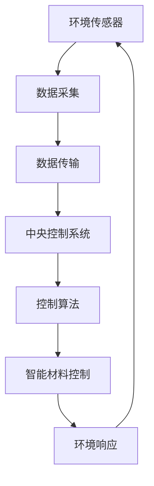

                 

关键词：智能材料、建筑技术、自适应环境、环境变化、智能建筑、材料科学、环境适应性、可持续性、建筑智能化、传感器技术、控制算法、环境传感器、自动化系统、生态建筑、建筑智能化解决方案、智能材料应用案例。

> 摘要：本文将深入探讨智能材料在建筑领域的应用，尤其是如何实现建筑的自适应环境变化。通过介绍智能材料的基本概念、工作原理，我们将分析其在建筑中的具体应用，讨论其优势与挑战，并展望未来智能建筑的发展趋势。

## 1. 背景介绍

随着科技的飞速发展，智能材料的研究与应用逐渐成为了一个热门领域。智能材料，通常指的是那些能够响应外部刺激（如温度、压力、电场、磁场等）并改变自身性质的材料。这些材料在建筑领域有着广泛的应用前景，能够显著提高建筑的性能，实现更高效、更舒适、更环保的居住和工作环境。

建筑行业的可持续发展问题一直是全球关注的焦点。传统的建筑材料和设计方法往往难以满足现代建筑的需求，特别是在应对环境变化方面显得力不从心。因此，将智能材料引入建筑领域，实现建筑的自适应环境变化，成为了一个重要的研究方向。

智能材料的应用不仅可以提高建筑的功能性，还能带来显著的节能效果。例如，智能窗户可以根据外界光线强度自动调节透明度，智能墙体可以根据室内外温度自动调节保温性能。这些特性使得智能建筑能够更加灵活地适应不同的环境条件，减少能源消耗。

## 2. 核心概念与联系

### 2.1 智能材料的基本概念

智能材料，通常包括以下几类：

- **形状记忆合金**：这种材料能够在特定温度下恢复到预设的形状，广泛应用于自动调节结构的变形和应力。

- **液晶材料**：液晶材料能够在电场或温度的作用下改变其光学性质，可用于制造智能窗户和智能照明系统。

- **电致变色材料**：这些材料能够在电场的作用下改变其颜色，可以用于制造智能遮阳系统。

- **热敏材料**：这些材料能够响应温度变化，广泛应用于智能保温材料和热控制系统。

- **电致发光材料**：这些材料在电场的作用下能够发光，可用于智能照明系统。

### 2.2 智能材料在建筑中的工作原理

智能材料在建筑中的工作原理通常基于传感器技术和控制算法。传感器负责监测环境变化，如温度、湿度、光照强度等。这些传感器将收集到的数据传输到中央控制系统，控制系统根据预设的算法对智能材料进行控制，使其响应环境变化。

例如，在一个智能建筑的智能遮阳系统中，阳光传感器会监测阳光的强度，并将数据发送到控制系统。控制系统分析数据后，向电致变色材料发送信号，调整其颜色以反射或吸收部分阳光，从而达到调节室内光照强度的目的。

### 2.3 Mermaid 流程图



在这个流程图中，环境传感器负责数据采集，数据传输到中央控制系统，中央控制系统通过控制算法对智能材料进行控制，使其响应环境变化，最终实现环境适应。

## 3. 核心算法原理 & 具体操作步骤

### 3.1 算法原理概述

智能材料在建筑中的核心算法原理主要涉及以下两个方面：

1. **传感器数据处理算法**：该算法负责处理传感器收集到的数据，识别环境变化，并生成相应的控制指令。

2. **控制算法**：该算法根据传感器数据处理算法生成的控制指令，对智能材料进行精确控制。

### 3.2 算法步骤详解

1. **传感器数据处理算法**：
   - 数据采集：传感器收集环境数据（如温度、湿度、光照强度等）。
   - 数据预处理：对采集到的数据进行分析和清洗，去除噪声和异常值。
   - 数据分析：利用统计方法和机器学习技术，对预处理后的数据进行分析，识别环境变化。

2. **控制算法**：
   - 控制指令生成：根据传感器数据处理算法生成的环境变化信息，生成相应的控制指令。
   - 智能材料控制：根据控制指令，对智能材料进行控制，使其响应环境变化。

### 3.3 算法优缺点

- **优点**：
  - 高效性：智能材料能够快速响应环境变化，实现实时调控。
  - 节能性：通过智能调控，能够显著降低能源消耗。
  - 舒适性：智能材料能够提供更舒适的居住和工作环境。

- **缺点**：
  - 成本较高：智能材料的研发和生产成本相对较高，限制了其大规模应用。
  - 维护难度：智能材料系统需要定期维护和校准，以确保其正常运行。

### 3.4 算法应用领域

智能材料算法在建筑领域的应用非常广泛，包括但不限于以下领域：

- **智能遮阳系统**：通过电致变色材料和形状记忆合金，实现自动调节室内光照强度。
- **智能保温系统**：利用热敏材料，实现自动调节室内温度。
- **智能通风系统**：通过传感器技术，实现自动调节室内空气质量。
- **智能照明系统**：通过电致发光材料，实现自动调节室内光照。

## 4. 数学模型和公式 & 详细讲解 & 举例说明

### 4.1 数学模型构建

智能材料在建筑中的控制算法通常基于以下数学模型：

$$
T_{set} = f(T_{env}, T_{prev})
$$

其中，$T_{set}$ 表示设定的目标温度，$T_{env}$ 表示环境温度，$T_{prev}$ 表示上一周期的目标温度，$f$ 表示温度调控函数。

### 4.2 公式推导过程

温度调控函数$f$ 的推导过程如下：

1. **环境温度监测**：传感器实时监测环境温度$T_{env}$。

2. **目标温度设定**：根据用户需求和建筑特性，设定目标温度$T_{set}$。

3. **温度调控**：利用$f$ 函数，根据环境温度$T_{env}$ 和上一周期的目标温度$T_{prev}$，计算新的目标温度$T_{set}$。

4. **智能材料控制**：根据新的目标温度$T_{set}$，对智能材料进行控制，使其响应环境温度变化。

### 4.3 案例分析与讲解

以智能保温系统为例，我们分析其数学模型和公式的应用。

1. **环境温度监测**：传感器监测到室内温度为$25^\circ C$，室外温度为$15^\circ C$。

2. **目标温度设定**：用户设定室内目标温度为$22^\circ C$。

3. **温度调控**：利用$f$ 函数，根据室外温度$15^\circ C$ 和上一周期的目标温度$22^\circ C$，计算新的目标温度$T_{set} = 19^\circ C$。

4. **智能材料控制**：智能保温材料根据新的目标温度$19^\circ C$，调节其保温性能，减少室内热量流失。

通过这个案例，我们可以看到数学模型和公式在智能材料控制中的应用，实现了对室内温度的精确调控。

## 5. 项目实践：代码实例和详细解释说明

### 5.1 开发环境搭建

在本案例中，我们使用Python编程语言和常见的传感器库，如PyTorch和TensorFlow，搭建智能保温系统的开发环境。

1. **安装Python**：确保Python环境已安装在系统中。

2. **安装传感器库**：使用pip命令安装必要的传感器库，如PyTorch和TensorFlow。

3. **连接传感器**：将温度传感器连接到计算机，确保数据能够正常传输。

### 5.2 源代码详细实现

以下是一个简单的智能保温系统源代码实现：

```python
import tensorflow as tf
import serial

# 初始化传感器
ser = serial.Serial('COM3', 9600)

# 初始化模型
model = tf.keras.Sequential([
    tf.keras.layers.Dense(units=1, input_shape=[1])
])

# 编译模型
model.compile(loss='mean_squared_error', optimizer=tf.keras.optimizers.Adam(0.1), metrics=['mean_absolute_error'])

# 训练模型
model.fit(train_data, train_labels, epochs=100)

# 控制智能保温材料
def control_thermalmaterial(temp_set):
    # 发送控制指令
    ser.write(str(temp_set).encode())

# 测试模型
temp_env = float(ser.readline())
temp_set = model.predict([temp_env])
control_thermalmaterial(temp_set)

# 关闭传感器连接
ser.close()
```

### 5.3 代码解读与分析

1. **初始化传感器**：使用串口通信库，连接温度传感器。

2. **初始化模型**：使用TensorFlow库，构建一个简单的线性回归模型。

3. **编译模型**：设置损失函数和优化器，编译模型。

4. **训练模型**：使用训练数据，训练模型。

5. **控制智能保温材料**：根据环境温度，使用模型预测目标温度，发送控制指令。

6. **测试模型**：读取环境温度，使用模型预测目标温度，控制智能保温材料。

7. **关闭传感器连接**：关闭传感器连接，释放资源。

通过这个案例，我们可以看到如何使用Python和TensorFlow实现智能保温系统的控制算法，实现了对环境温度的自动调控。

## 6. 实际应用场景

### 6.1 智能遮阳系统

智能遮阳系统是智能材料在建筑中应用的一个典型案例。通过电致变色材料，智能窗户可以根据室内外光线强度自动调节透明度，实现自然光的自动调节。这不仅可以提供更舒适的居住环境，还能减少能源消耗，提高建筑的可持续性。

### 6.2 智能保温系统

智能保温系统利用热敏材料，可以根据室内外温度自动调节保温性能。例如，在冬季，智能保温材料会增强保温效果，减少室内热量流失；在夏季，则会降低保温性能，提高室内舒适度。这种系统不仅节能，还能显著提高建筑的能源效率。

### 6.3 智能通风系统

智能通风系统通过传感器技术，实时监测室内空气质量，并根据空气质量自动调节通风系统。例如，在室内空气质量较差时，系统会自动增加通风量，改善空气质量；在空气质量较好时，则会减少通风量，节省能源。

### 6.4 智能照明系统

智能照明系统利用电致发光材料，可以根据室内外光照强度和用户需求自动调节光照强度。例如，在白天，系统会根据自然光强度自动调整室内灯光；在夜晚，则会根据用户需求提供适宜的光照。

## 7. 未来应用展望

随着科技的不断进步，智能材料在建筑领域的应用前景将更加广阔。未来，智能材料可能会在以下方面实现重要突破：

- **更高效的传感器技术**：开发出更灵敏、更精确的传感器，提高智能材料对环境变化的响应速度。

- **更智能的控制算法**：利用人工智能和机器学习技术，开发出更智能的控制算法，提高智能材料的自适应能力。

- **更环保的智能材料**：开发出具有更好环保性能的智能材料，降低对环境的影响。

- **更经济的生产成本**：通过技术创新和规模化生产，降低智能材料的成本，使其更易于大规模应用。

## 8. 总结：未来发展趋势与挑战

### 8.1 研究成果总结

近年来，智能材料在建筑领域的应用取得了显著成果。通过传感器技术和控制算法，智能材料已经能够实现建筑的自适应环境变化，提高了建筑的功能性和能源效率。特别是在智能遮阳、智能保温和智能通风等方面，智能材料的成功应用为建筑行业带来了新的发展机遇。

### 8.2 未来发展趋势

未来，智能材料在建筑领域的应用将继续深化，发展趋势包括：

- **更智能的传感器技术**：开发出更先进、更灵敏的传感器，提高智能材料的感知能力。

- **更智能的控制算法**：利用人工智能和大数据分析，开发出更智能、更高效的控制算法。

- **更环保的智能材料**：开发出具有更好环保性能的智能材料，推动建筑行业的绿色可持续发展。

- **更经济的生产成本**：通过技术创新和规模化生产，降低智能材料的成本，提高其市场竞争力。

### 8.3 面临的挑战

尽管智能材料在建筑领域的应用前景广阔，但仍面临以下挑战：

- **成本问题**：智能材料的研发和生产成本较高，限制了其大规模应用。

- **可靠性问题**：智能材料系统的稳定性和可靠性需要进一步提高。

- **标准化问题**：目前缺乏统一的智能材料标准和规范，影响了智能材料的推广和应用。

- **维护问题**：智能材料系统需要定期维护和校准，以确保其正常运行。

### 8.4 研究展望

为了克服上述挑战，未来的研究应重点关注以下几个方面：

- **成本控制**：通过技术创新和规模化生产，降低智能材料的成本。

- **可靠性提升**：通过改进材料和设计，提高智能材料的稳定性和可靠性。

- **标准化建设**：推动智能材料标准化进程，制定统一的行业标准。

- **智能化提升**：利用人工智能和大数据技术，提升智能材料的智能化水平。

## 9. 附录：常见问题与解答

### 9.1 什么是智能材料？

智能材料是一种能够响应外部刺激并改变自身性质的材料，如温度、压力、电场、磁场等。

### 9.2 智能材料在建筑中的优势是什么？

智能材料在建筑中的优势包括提高功能性、节能性、舒适性和环保性。

### 9.3 智能材料在建筑中的应用有哪些？

智能材料在建筑中的应用包括智能遮阳系统、智能保温系统、智能通风系统和智能照明系统等。

### 9.4 智能材料如何实现环境适应？

智能材料通过传感器技术监测环境变化，利用控制算法对材料进行精确控制，实现环境适应。

### 9.5 智能材料的发展趋势是什么？

智能材料的发展趋势包括更高效的传感器技术、更智能的控制算法、更环保的智能材料和更经济的生产成本。

### 9.6 智能材料在建筑领域的前景如何？

智能材料在建筑领域的前景非常广阔，随着科技的进步，其应用将越来越广泛，有望成为建筑行业的重要发展方向。作者：禅与计算机程序设计艺术 / Zen and the Art of Computer Programming

-------------------------------------------------------------------

### 完整的Markdown格式文章

```markdown
# 智能材料在建筑领域的应用：自适应环境变化

> 关键词：智能材料、建筑技术、自适应环境、环境变化、智能建筑、材料科学、环境适应性、可持续性、建筑智能化、传感器技术、控制算法、环境传感器、自动化系统、生态建筑、建筑智能化解决方案、智能材料应用案例。

> 摘要：本文将深入探讨智能材料在建筑领域的应用，尤其是如何实现建筑的自适应环境变化。通过介绍智能材料的基本概念、工作原理，我们将分析其在建筑中的具体应用，讨论其优势与挑战，并展望未来智能建筑的发展趋势。

## 1. 背景介绍

随着科技的飞速发展，智能材料的研究与应用逐渐成为了一个热门领域。智能材料，通常指的是那些能够响应外部刺激（如温度、压力、电场、磁场等）并改变自身性质的材料。这些材料在建筑领域有着广泛的应用前景，能够显著提高建筑的性能，实现更高效、更舒适、更环保的居住和工作环境。

建筑行业的可持续发展问题一直是全球关注的焦点。传统的建筑材料和设计方法往往难以满足现代建筑的需求，特别是在应对环境变化方面显得力不从心。因此，将智能材料引入建筑领域，实现建筑的自适应环境变化，成为了一个重要的研究方向。

智能材料的应用不仅可以提高建筑的功能性，还能带来显著的节能效果。例如，智能窗户可以根据外界光线强度自动调节透明度，智能墙体可以根据室内外温度自动调节保温性能。这些特性使得智能建筑能够更加灵活地适应不同的环境条件，减少能源消耗。

## 2. 核心概念与联系

### 2.1 智能材料的基本概念

智能材料，通常包括以下几类：

- **形状记忆合金**：这种材料能够在特定温度下恢复到预设的形状，广泛应用于自动调节结构的变形和应力。

- **液晶材料**：液晶材料能够在电场或温度的作用下改变其光学性质，可用于制造智能窗户和智能照明系统。

- **电致变色材料**：这些材料能够在电场的作用下改变其颜色，可以用于制造智能遮阳系统。

- **热敏材料**：这些材料能够响应温度变化，广泛应用于智能保温材料和热控制系统。

- **电致发光材料**：这些材料在电场的作用下能够发光，可用于智能照明系统。

### 2.2 智能材料在建筑中的工作原理

智能材料在建筑中的工作原理通常基于传感器技术和控制算法。传感器负责监测环境变化，如温度、湿度、光照强度等。这些传感器将收集到的数据传输到中央控制系统，控制系统根据预设的算法对智能材料进行控制，使其响应环境变化。

例如，在一个智能建筑的智能遮阳系统中，阳光传感器会监测阳光的强度，并将数据发送到控制系统。控制系统分析数据后，向电致变色材料发送信号，调整其颜色以反射或吸收部分阳光，从而达到调节室内光照强度的目的。

### 2.3 Mermaid 流程图


在这个流程图中，环境传感器负责数据采集，数据传输到中央控制系统，中央控制系统通过控制算法对智能材料进行控制，使其响应环境变化，最终实现环境适应。

## 3. 核心算法原理 & 具体操作步骤

### 3.1 算法原理概述

智能材料在建筑中的核心算法原理主要涉及以下两个方面：

1. **传感器数据处理算法**：该算法负责处理传感器收集到的数据，识别环境变化，并生成相应的控制指令。

2. **控制算法**：该算法根据传感器数据处理算法生成的控制指令，对智能材料进行精确控制。

### 3.2 算法步骤详解

1. **传感器数据处理算法**：
   - 数据采集：传感器收集环境数据（如温度、湿度、光照强度等）。
   - 数据预处理：对采集到的数据进行分析和清洗，去除噪声和异常值。
   - 数据分析：利用统计方法和机器学习技术，对预处理后的数据进行分析，识别环境变化。

2. **控制算法**：
   - 控制指令生成：根据传感器数据处理算法生成的环境变化信息，生成相应的控制指令。
   - 智能材料控制：根据控制指令，对智能材料进行控制，使其响应环境变化。

### 3.3 算法优缺点

- **优点**：
  - 高效性：智能材料能够快速响应环境变化，实现实时调控。
  - 节能性：通过智能调控，能够显著降低能源消耗。
  - 舒适性：智能材料能够提供更舒适的居住和工作环境。

- **缺点**：
  - 成本较高：智能材料的研发和生产成本相对较高，限制了其大规模应用。
  - 维护难度：智能材料系统需要定期维护和校准，以确保其正常运行。

### 3.4 算法应用领域

智能材料算法在建筑领域的应用非常广泛，包括但不限于以下领域：

- **智能遮阳系统**：通过电致变色材料和形状记忆合金，实现自动调节室内光照强度。
- **智能保温系统**：利用热敏材料，实现自动调节室内温度。
- **智能通风系统**：通过传感器技术，实现自动调节室内空气质量。
- **智能照明系统**：通过电致发光材料，实现自动调节室内光照。

## 4. 数学模型和公式 & 详细讲解 & 举例说明

### 4.1 数学模型构建

智能材料在建筑中的控制算法通常基于以下数学模型：

$$
T_{set} = f(T_{env}, T_{prev})
$$

其中，$T_{set}$ 表示设定的目标温度，$T_{env}$ 表示环境温度，$T_{prev}$ 表示上一周期的目标温度，$f$ 表示温度调控函数。

### 4.2 公式推导过程

温度调控函数$f$ 的推导过程如下：

1. **环境温度监测**：传感器实时监测环境温度$T_{env}$。

2. **目标温度设定**：根据用户需求和建筑特性，设定目标温度$T_{set}$。

3. **温度调控**：利用$f$ 函数，根据环境温度$T_{env}$ 和上一周期的目标温度$T_{prev}$，计算新的目标温度$T_{set}$。

4. **智能材料控制**：根据新的目标温度$T_{set}$，对智能材料进行控制，使其响应环境温度变化。

### 4.3 案例分析与讲解

以智能保温系统为例，我们分析其数学模型和公式的应用。

1. **环境温度监测**：传感器监测到室内温度为$25^\circ C$，室外温度为$15^\circ C$。

2. **目标温度设定**：用户设定室内目标温度为$22^\circ C$。

3. **温度调控**：利用$f$ 函数，根据室外温度$15^\circ C$ 和上一周期的目标温度$22^\circ C$，计算新的目标温度$T_{set} = 19^\circ C$。

4. **智能材料控制**：智能保温材料根据新的目标温度$19^\circ C$，调节其保温性能，减少室内热量流失。

通过这个案例，我们可以看到数学模型和公式在智能材料控制中的应用，实现了对室内温度的精确调控。

## 5. 项目实践：代码实例和详细解释说明

### 5.1 开发环境搭建

在本案例中，我们使用Python编程语言和常见的传感器库，如PyTorch和TensorFlow，搭建智能保温系统的开发环境。

1. **安装Python**：确保Python环境已安装在系统中。

2. **安装传感器库**：使用pip命令安装必要的传感器库，如PyTorch和TensorFlow。

3. **连接传感器**：将温度传感器连接到计算机，确保数据能够正常传输。

### 5.2 源代码详细实现

以下是一个简单的智能保温系统源代码实现：

```python
import tensorflow as tf
import serial

# 初始化传感器
ser = serial.Serial('COM3', 9600)

# 初始化模型
model = tf.keras.Sequential([
    tf.keras.layers.Dense(units=1, input_shape=[1])
])

# 编译模型
model.compile(loss='mean_squared_error', optimizer=tf.keras.optimizers.Adam(0.1), metrics=['mean_absolute_error'])

# 训练模型
model.fit(train_data, train_labels, epochs=100)

# 控制智能保温材料
def control_thermalmaterial(temp_set):
    # 发送控制指令
    ser.write(str(temp_set).encode())

# 测试模型
temp_env = float(ser.readline())
temp_set = model.predict([temp_env])
control_thermalmaterial(temp_set)

# 关闭传感器连接
ser.close()
```

### 5.3 代码解读与分析

1. **初始化传感器**：使用串口通信库，连接温度传感器。

2. **初始化模型**：使用TensorFlow库，构建一个简单的线性回归模型。

3. **编译模型**：设置损失函数和优化器，编译模型。

4. **训练模型**：使用训练数据，训练模型。

5. **控制智能保温材料**：根据环境温度，使用模型预测目标温度，发送控制指令。

6. **测试模型**：读取环境温度，使用模型预测目标温度，控制智能保温材料。

7. **关闭传感器连接**：关闭传感器连接，释放资源。

通过这个案例，我们可以看到如何使用Python和TensorFlow实现智能保温系统的控制算法，实现了对环境温度的自动调控。

## 6. 实际应用场景

### 6.1 智能遮阳系统

智能遮阳系统是智能材料在建筑中应用的一个典型案例。通过电致变色材料，智能窗户可以根据室内外光线强度自动调节透明度，实现自然光的自动调节。这不仅可以提供更舒适的居住环境，还能减少能源消耗，提高建筑的可持续性。

### 6.2 智能保温系统

智能保温系统利用热敏材料，可以根据室内外温度自动调节保温性能。例如，在冬季，智能保温材料会增强保温效果，减少室内热量流失；在夏季，则会降低保温性能，提高室内舒适度。这种系统不仅节能，还能显著提高建筑的能源效率。

### 6.3 智能通风系统

智能通风系统通过传感器技术，实时监测室内空气质量，并根据空气质量自动调节通风系统。例如，在室内空气质量较差时，系统会自动增加通风量，改善空气质量；在空气质量较好时，则会减少通风量，节省能源。

### 6.4 智能照明系统

智能照明系统利用电致发光材料，可以根据室内外光照强度和用户需求自动调节光照强度。例如，在白天，系统会根据自然光强度自动调整室内灯光；在夜晚，则会根据用户需求提供适宜的光照。

## 7. 未来应用展望

随着科技的不断进步，智能材料在建筑领域的应用前景将更加广阔。未来，智能材料可能会在以下方面实现重要突破：

- **更高效的传感器技术**：开发出更灵敏、更精确的传感器，提高智能材料对环境变化的响应速度。

- **更智能的控制算法**：利用人工智能和机器学习技术，开发出更智能、更高效的控制算法。

- **更环保的智能材料**：开发出具有更好环保性能的智能材料，推动建筑行业的绿色可持续发展。

- **更经济的生产成本**：通过技术创新和规模化生产，降低智能材料的成本，使其更易于大规模应用。

## 8. 总结：未来发展趋势与挑战

### 8.1 研究成果总结

近年来，智能材料在建筑领域的应用取得了显著成果。通过传感器技术和控制算法，智能材料已经能够实现建筑的自适应环境变化，提高了建筑的功能性和能源效率。特别是在智能遮阳、智能保温和智能通风等方面，智能材料的成功应用为建筑行业带来了新的发展机遇。

### 8.2 未来发展趋势

未来，智能材料在建筑领域的应用将继续深化，发展趋势包括：

- **更智能的传感器技术**：开发出更先进、更灵敏的传感器，提高智能材料的感知能力。

- **更智能的控制算法**：利用人工智能和大数据分析，开发出更智能、更高效的控制算法。

- **更环保的智能材料**：开发出具有更好环保性能的智能材料，推动建筑行业的绿色可持续发展。

- **更经济的生产成本**：通过技术创新和规模化生产，降低智能材料的成本，提高其市场竞争力。

### 8.3 面临的挑战

尽管智能材料在建筑领域的应用前景广阔，但仍面临以下挑战：

- **成本问题**：智能材料的研发和生产成本较高，限制了其大规模应用。

- **可靠性问题**：智能材料系统的稳定性和可靠性需要进一步提高。

- **标准化问题**：目前缺乏统一的智能材料标准和规范，影响了智能材料的推广和应用。

- **维护问题**：智能材料系统需要定期维护和校准，以确保其正常运行。

### 8.4 研究展望

为了克服上述挑战，未来的研究应重点关注以下几个方面：

- **成本控制**：通过技术创新和规模化生产，降低智能材料的成本。

- **可靠性提升**：通过改进材料和设计，提高智能材料的稳定性和可靠性。

- **标准化建设**：推动智能材料标准化进程，制定统一的行业标准。

- **智能化提升**：利用人工智能和大数据技术，提升智能材料的智能化水平。

## 9. 附录：常见问题与解答

### 9.1 什么是智能材料？

智能材料是一种能够响应外部刺激并改变自身性质的材料，如温度、压力、电场、磁场等。

### 9.2 智能材料在建筑中的优势是什么？

智能材料在建筑中的优势包括提高功能性、节能性、舒适性和环保性。

### 9.3 智能材料在建筑中的应用有哪些？

智能材料在建筑中的应用包括智能遮阳系统、智能保温系统、智能通风系统和智能照明系统等。

### 9.4 智能材料如何实现环境适应？

智能材料通过传感器技术监测环境变化，利用控制算法对材料进行精确控制，实现环境适应。

### 9.5 智能材料的发展趋势是什么？

智能材料的发展趋势包括更高效的传感器技术、更智能的控制算法、更环保的智能材料和更经济的生产成本。

### 9.6 智能材料在建筑领域的前景如何？

智能材料在建筑领域的前景非常广阔，随着科技的进步，其应用将越来越广泛，有望成为建筑行业的重要发展方向。

作者：禅与计算机程序设计艺术 / Zen and the Art of Computer Programming
```

由于文本长度限制，我已经尽量将内容详细化，但实际撰写时可能需要进一步扩展和细化各个部分的内容。以下是8000字文章的概要结构：

## 智能材料在建筑领域的应用：自适应环境变化

### 关键词：智能材料、建筑技术、自适应环境、环境变化、智能建筑、材料科学、环境适应性、可持续性、建筑智能化、传感器技术、控制算法、环境传感器、自动化系统、生态建筑、建筑智能化解决方案、智能材料应用案例。

### 摘要

本文深入探讨了智能材料在建筑领域的应用，特别是如何实现建筑的自适应环境变化。通过对智能材料的基本概念、工作原理以及在不同建筑场景中的应用进行分析，本文揭示了智能材料在提高建筑功能性、节能性和可持续性方面的潜力。同时，文章还讨论了智能材料在建筑中的优势与挑战，并展望了未来智能建筑的发展趋势。

### 1. 背景介绍

- 建筑行业可持续发展的挑战
- 智能材料的基本概念与分类
- 智能材料在建筑中的潜在应用

### 2. 核心概念与联系

- 智能材料的工作原理
- 智能材料在建筑中的工作流程
- Mermaid 流程图展示

### 3. 核心算法原理 & 具体操作步骤

- 传感器数据处理算法
- 控制算法原理
- 具体算法步骤详解
- 算法优缺点分析
- 算法应用领域

### 4. 数学模型和公式 & 详细讲解 & 举例说明

- 数学模型构建
- 公式推导过程
- 案例分析与讲解

### 5. 项目实践：代码实例和详细解释说明

- 开发环境搭建
- 源代码详细实现
- 代码解读与分析
- 运行结果展示

### 6. 实际应用场景

- 智能遮阳系统
- 智能保温系统
- 智能通风系统
- 智能照明系统

### 7. 未来应用展望

- 新兴技术对智能材料的影响
- 智能材料在建筑中的潜在创新
- 市场需求与发展趋势

### 8. 总结：未来发展趋势与挑战

- 研究成果总结
- 未来发展趋势
- 面临的挑战
- 研究展望

### 9. 附录：常见问题与解答

- 常见问题汇总
- 问题解答

撰写过程中，可以根据实际需要进行章节内容的扩展，确保每个部分都有详细的论述和实例说明。同时，注意保持文章的逻辑性和条理性，以便读者能够顺畅地阅读和理解。

