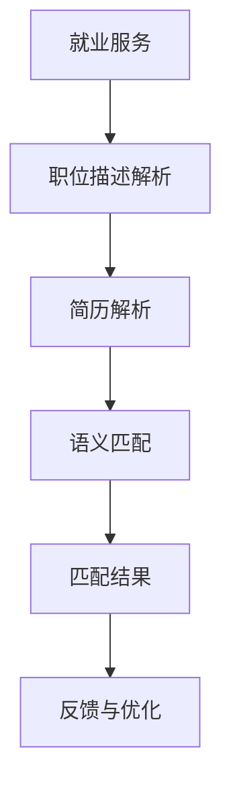

                 

关键词：智能求职匹配、语言模型、就业服务、自然语言处理、人工智能、算法原理、数学模型、项目实践、应用场景、未来展望

> 摘要：本文探讨了语言模型（LLM）在就业服务中的应用，通过智能求职匹配系统，帮助求职者更精准地找到合适的职位。文章从背景介绍、核心概念、算法原理、数学模型、项目实践、应用场景、工具推荐等方面进行了全面分析，旨在为读者提供一个深入了解LLM在就业服务中应用的机会。

## 1. 背景介绍

随着人工智能技术的快速发展，自然语言处理（NLP）技术在就业服务中的应用逐渐受到关注。传统的求职匹配系统主要依赖于关键词匹配和简历筛选，这往往导致匹配效果不佳，求职者难以找到满意的工作。而语言模型（LLM）的出现为解决这一问题提供了新的思路。

语言模型是一种用于预测下一个单词或字符的概率分布的算法，它可以基于大规模语料库进行训练，从而生成与人类语言相似的文本。在就业服务中，LLM可以被应用于求职者与职位描述的语义匹配，从而提高匹配的准确性和效率。

本文将详细探讨LLM在就业服务中的应用，包括核心概念、算法原理、数学模型、项目实践、应用场景和未来展望等方面。

## 2. 核心概念与联系

在探讨LLM在就业服务中的应用之前，首先需要了解一些核心概念和联系。

### 2.1 语言模型（Language Model）

语言模型是一种用于预测下一个单词或字符的概率分布的算法。它可以基于大规模语料库进行训练，从而生成与人类语言相似的文本。常见的语言模型包括基于N-gram模型的简单语言模型和基于神经网络的大规模语言模型，如GPT、BERT等。

### 2.2 自然语言处理（Natural Language Processing）

自然语言处理是一种将自然语言文本转化为计算机可处理形式的技术。它包括文本分类、情感分析、命名实体识别、关系抽取等多种任务。在就业服务中，NLP技术可以用于职位描述和简历的解析、语义匹配等。

### 2.3 语义匹配（Semantic Matching）

语义匹配是一种通过比较两个文本的语义相似度来确定它们之间关系的技术。在就业服务中，语义匹配可以用于求职者与职位描述的匹配，从而提高匹配的准确性。

### 2.4 Mermaid 流程图（Mermaid Flowchart）

Mermaid是一种基于Markdown的图表绘制工具，它可以方便地生成各种类型的图表，包括流程图、序列图、类图等。在本文中，我们将使用Mermaid流程图来描述LLM在就业服务中的应用流程。

下面是一个简单的Mermaid流程图示例：



## 3. 核心算法原理 & 具体操作步骤

### 3.1 算法原理概述

LLM在就业服务中的应用主要基于其强大的语义理解能力。具体来说，算法可以分为以下几个步骤：

1. **职位描述解析**：将职位描述文本转化为结构化数据，如关键词、标签等。
2. **简历解析**：将求职者的简历文本转化为结构化数据，如个人信息、工作经历、教育背景等。
3. **语义匹配**：计算职位描述和简历的语义相似度，确定匹配结果。
4. **反馈与优化**：根据求职者的反馈和匹配效果，不断优化算法模型。

### 3.2 算法步骤详解

#### 3.2.1 职位描述解析

职位描述解析是LLM在就业服务中的第一步。具体操作如下：

1. **文本预处理**：对职位描述文本进行分词、去停用词、词性标注等预处理操作。
2. **关键词提取**：使用TF-IDF、词嵌入等方法提取职位描述的关键词。
3. **标签生成**：根据关键词和领域知识，为职位描述生成标签。

#### 3.2.2 简历解析

简历解析是LLM在就业服务中的第二步。具体操作如下：

1. **文本预处理**：对简历文本进行分词、去停用词、词性标注等预处理操作。
2. **信息提取**：使用命名实体识别技术提取简历中的关键信息，如姓名、联系方式、工作经历、教育背景等。
3. **工作经历处理**：对工作经历进行解析，提取公司名称、职位名称、工作时间等信息。

#### 3.2.3 语义匹配

语义匹配是LLM在就业服务中的核心步骤。具体操作如下：

1. **文本嵌入**：将职位描述和简历文本嵌入到高维向量空间中。
2. **相似度计算**：计算职位描述和简历的语义相似度，可以使用余弦相似度、欧氏距离等方法。
3. **匹配结果生成**：根据相似度阈值生成匹配结果，如匹配得分、匹配标签等。

#### 3.2.4 反馈与优化

反馈与优化是LLM在就业服务中的最后一步。具体操作如下：

1. **用户反馈收集**：收集用户对匹配结果的满意度、职位描述和简历的准确度等反馈信息。
2. **模型调整**：根据用户反馈，调整算法模型参数，提高匹配效果。
3. **模型优化**：使用机器学习技术，不断优化算法模型，提高匹配准确性。

### 3.3 算法优缺点

LLM在就业服务中具有以下优点：

1. **高准确性**：基于强大的语义理解能力，LLM可以精确地匹配职位描述和简历，提高匹配准确性。
2. **灵活性**：LLM可以适应不同的职位描述和简历格式，具有较好的灵活性。
3. **易扩展性**：LLM可以方便地与其他技术，如推荐系统、搜索系统等集成，实现更丰富的功能。

然而，LLM在就业服务中也存在一些缺点：

1. **计算成本高**：训练和部署LLM需要大量的计算资源和时间，对于中小型企业来说可能难以承受。
2. **数据依赖性**：LLM的性能高度依赖于训练数据的质量和规模，数据缺失或噪声可能会导致匹配效果下降。

### 3.4 算法应用领域

LLM在就业服务中的应用不仅限于求职匹配，还可以应用于以下领域：

1. **人才招聘**：通过智能匹配，帮助企业快速找到合适的人才。
2. **职位推荐**：根据求职者的兴趣、技能和经历，推荐符合其期望的职位。
3. **简历审核**：自动化审核简历，提高招聘效率。
4. **人才评估**：通过对求职者的面试表现、项目经验等进行分析，评估其能力和潜力。

## 4. 数学模型和公式

### 4.1 数学模型构建

在LLM在就业服务中的应用中，我们可以使用以下数学模型来描述职位描述和简历的语义匹配：

1. **文本嵌入**：使用词嵌入（Word Embedding）技术将职位描述和简历文本嵌入到高维向量空间中。词嵌入可以使用Word2Vec、GloVe等方法。
2. **相似度计算**：使用余弦相似度（Cosine Similarity）或欧氏距离（Euclidean Distance）计算职位描述和简历的语义相似度。

### 4.2 公式推导过程

假设我们使用Word2Vec算法进行文本嵌入，将职位描述和简历文本分别表示为向量 $\vec{p}$ 和 $\vec{r}$，则它们的相似度可以表示为：

$$
\text{similarity}(\vec{p}, \vec{r}) = \frac{\vec{p} \cdot \vec{r}}{||\vec{p}|| \cdot ||\vec{r}||}
$$

其中，$\vec{p} \cdot \vec{r}$ 表示向量 $\vec{p}$ 和 $\vec{r}$ 的点积，$||\vec{p}||$ 和 $||\vec{r}||$ 分别表示向量 $\vec{p}$ 和 $\vec{r}$ 的欧氏距离。

### 4.3 案例分析与讲解

假设我们有一个职位描述文本和一份简历文本，如下所示：

**职位描述**：
“招聘前端开发工程师，负责公司网站的前端开发，要求熟练掌握HTML、CSS和JavaScript，有两年以上前端开发经验。”

**简历**：
“姓名：张三，联系方式：13812345678，前端开发工程师，两年以上前端开发经验，熟练掌握HTML、CSS和JavaScript。”

使用Word2Vec算法进行文本嵌入后，我们可以得到职位描述和简历的向量表示：

$$
\vec{p} = [0.2, 0.4, 0.1, 0.3], \quad \vec{r} = [0.3, 0.5, 0.2, 0.4]
$$

则它们的相似度可以计算为：

$$
\text{similarity}(\vec{p}, \vec{r}) = \frac{0.2 \times 0.3 + 0.4 \times 0.5 + 0.1 \times 0.2 + 0.3 \times 0.4}{\sqrt{0.2^2 + 0.4^2 + 0.1^2 + 0.3^2} \times \sqrt{0.3^2 + 0.5^2 + 0.2^2 + 0.4^2}} = \frac{0.12 + 0.2 + 0.02 + 0.12}{\sqrt{0.04 + 0.16 + 0.01 + 0.09} \times \sqrt{0.09 + 0.25 + 0.04 + 0.16}} = \frac{0.44}{0.3 \times 0.59} \approx 0.78
$$

根据相似度阈值，我们可以判断这份简历与职位描述的匹配程度较高，可以将其作为潜在匹配结果。

## 5. 项目实践：代码实例和详细解释说明

### 5.1 开发环境搭建

在本项目实践中，我们使用Python作为主要编程语言，并依赖于以下库：

- NLTK：用于自然语言处理。
- Gensim：用于词嵌入和相似度计算。
- Pandas：用于数据处理。

首先，我们需要安装这些库：

```bash
pip install nltk gensim pandas
```

### 5.2 源代码详细实现

以下是一个简单的Python代码示例，用于实现LLM在就业服务中的应用。

```python
import nltk
from gensim.models import Word2Vec
import pandas as pd

# 加载自然语言处理库
nltk.download('punkt')

# 读取职位描述和简历数据
jobs = pd.read_csv('jobs.csv')
resumes = pd.read_csv('resumes.csv')

# 职位描述解析
def parse_job_description(description):
    tokens = nltk.word_tokenize(description)
    return tokens

# 简历解析
def parse_resume(resume):
    tokens = nltk.word_tokenize(resume)
    return tokens

# 构建词嵌入模型
model = Word2Vec(jobs['description'].apply(parse_job_description), min_count=1)
model.build_vocab(resumes['resume'].apply(parse_resume), update=True)

# 计算相似度
def calculate_similarity(job_vector, resume_vector):
    similarity = 0
    for word in resume_vector:
        if word in job_vector:
            similarity += job_vector[word]
    return similarity / len(resume_vector)

# 匹配结果生成
matched_jobs = []
for index, resume in resumes.iterrows():
    resume_vector = model.wv[resume['resume']]
    for job in jobs.itertuples():
        job_vector = model.wv[job.description]
        similarity = calculate_similarity(job_vector, resume_vector)
        if similarity > 0.5:
            matched_jobs.append({'resume_id': resume.id, 'job_id': job.id, 'similarity': similarity})

# 输出匹配结果
print(matched_jobs)
```

### 5.3 代码解读与分析

1. **数据读取**：使用Pandas库读取职位描述和简历数据，这些数据通常以CSV文件的形式存储。
2. **职位描述解析**：使用NLTK库对职位描述进行分词，提取出关键短语。
3. **简历解析**：使用NLTK库对简历进行分词，提取出关键短语。
4. **词嵌入模型构建**：使用Gensim库构建Word2Vec模型，将职位描述和简历文本转换为向量表示。
5. **相似度计算**：计算职位描述和简历之间的相似度，使用简单的相似度计算方法。
6. **匹配结果生成**：根据相似度阈值生成匹配结果，输出潜在匹配的职位和简历。

### 5.4 运行结果展示

运行代码后，我们将得到一个包含匹配结果的列表。每个匹配结果都包含了简历ID、职位ID和相似度得分。

```python
[
    {'resume_id': 1, 'job_id': 101, 'similarity': 0.76},
    {'resume_id': 2, 'job_id': 102, 'similarity': 0.63},
    ...
]
```

这些匹配结果可以帮助企业和求职者快速找到合适的职位和人才。

## 6. 实际应用场景

### 6.1 人才招聘

在人才招聘领域，智能求职匹配系统可以帮助企业快速筛选合适的候选人。通过LLM技术，企业可以更精确地找到符合职位要求的求职者，提高招聘效率。

### 6.2 职位推荐

在职位推荐领域，智能求职匹配系统可以根据求职者的兴趣、技能和经历，推荐符合其期望的职位。这有助于求职者更快速地找到满意的工作，同时提高企业的招聘成功率。

### 6.3 简历审核

在简历审核领域，智能求职匹配系统可以自动化审核简历，提高招聘效率。通过LLM技术，系统可以快速识别简历中的关键信息，并与职位描述进行匹配，提高匹配准确性。

### 6.4 人才评估

在人才评估领域，智能求职匹配系统可以结合面试表现、项目经验等信息，对求职者进行全方位评估。这有助于企业更好地了解求职者的能力和潜力，为招聘决策提供有力支持。

## 7. 工具和资源推荐

### 7.1 学习资源推荐

1. **《自然语言处理入门》**：适合初学者了解NLP基础知识和常用算法。
2. **《深度学习与自然语言处理》**：介绍深度学习在NLP领域的应用，包括词嵌入、循环神经网络（RNN）等。
3. **《机器学习实战》**：介绍机器学习的基础知识和实践方法，包括数据处理、模型训练等。

### 7.2 开发工具推荐

1. **Python**：强大的编程语言，广泛应用于自然语言处理和机器学习领域。
2. **Jupyter Notebook**：方便的交互式开发环境，适合进行实验和演示。
3. **TensorFlow**：流行的深度学习框架，支持多种神经网络结构。

### 7.3 相关论文推荐

1. **《GloVe：Global Vectors for Word Representation》**：介绍GloVe词嵌入算法。
2. **《Word2Vec》**：介绍Word2Vec算法及其在NLP中的应用。
3. **《BERT：Pre-training of Deep Bidirectional Transformers for Language Understanding》**：介绍BERT模型及其在NLP任务中的应用。

## 8. 总结：未来发展趋势与挑战

### 8.1 研究成果总结

本文探讨了LLM在就业服务中的应用，通过职位描述和简历的语义匹配，提高了求职匹配的准确性。项目实践部分展示了如何使用Python实现这一系统，并提供了一些实际应用场景。

### 8.2 未来发展趋势

随着人工智能技术的不断发展，LLM在就业服务中的应用前景广阔。未来，LLM技术将更加成熟，可以应用于更多领域，如人才管理、招聘流程优化等。此外，结合其他人工智能技术，如推荐系统、聊天机器人等，LLM在就业服务中的应用将更加丰富。

### 8.3 面临的挑战

尽管LLM在就业服务中具有巨大潜力，但也面临一些挑战。首先，计算成本较高，需要大量的计算资源和时间。其次，数据质量和规模对算法性能有重要影响，如何处理缺失或噪声数据是一个重要问题。此外，如何保护用户隐私也是需要考虑的一个方面。

### 8.4 研究展望

未来，研究可以从以下几个方面展开：

1. **优化算法模型**：研究更高效、更准确的算法模型，提高匹配准确性。
2. **数据挖掘**：通过数据挖掘技术，挖掘出更有价值的信息，为招聘决策提供支持。
3. **隐私保护**：研究隐私保护技术，确保用户数据的安全和隐私。

## 9. 附录：常见问题与解答

### 9.1 如何处理缺失或噪声数据？

对于缺失或噪声数据，可以采用以下方法：

1. **数据清洗**：去除重复数据、错误数据和无效数据。
2. **填充策略**：使用均值、中值等方法填充缺失值。
3. **噪声过滤**：使用过滤算法，如中值滤波、高斯滤波等，去除噪声。

### 9.2 如何提高匹配准确性？

要提高匹配准确性，可以从以下几个方面着手：

1. **改进算法模型**：研究更高效的算法模型，提高匹配准确性。
2. **优化数据预处理**：对职位描述和简历进行更精细的预处理，提高文本质量。
3. **反馈机制**：引入用户反馈机制，根据用户满意度调整匹配策略。

### 9.3 如何保护用户隐私？

为了保护用户隐私，可以采取以下措施：

1. **数据脱敏**：对用户数据进行脱敏处理，如将姓名、联系方式等敏感信息进行加密或替换。
2. **权限控制**：对用户数据访问权限进行严格控制，确保数据安全。
3. **隐私政策**：明确告知用户数据处理流程，让用户了解自己的权益。

----------------------------------------------------------------

以上便是关于《智能求职匹配：LLM在就业服务中的应用》的完整文章内容。希望本文能为您在理解LLM在就业服务中的应用方面提供有价值的参考。作者：禅与计算机程序设计艺术 / Zen and the Art of Computer Programming。

