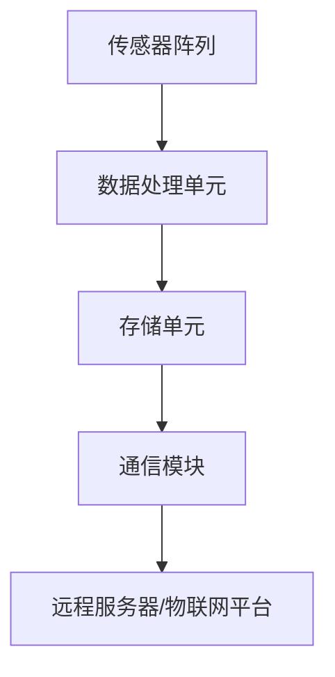

                 

关键词：智能灰尘，微型传感器网络，物联网，数据处理，智能城市，医疗监测

> 摘要：智能灰尘技术是一种微型传感器网络技术，通过将传感器嵌入到灰尘大小的载体中，实现对环境、健康、安全等多种数据的实时监测。本文将深入探讨智能灰尘技术的核心概念、算法原理、数学模型、项目实践以及未来应用前景。

## 1. 背景介绍

智能灰尘技术，顾名思义，是一种将传感器集成到微小颗粒（如灰尘大小）的技术。随着物联网（IoT）的快速发展，对数据的实时监控和分析需求日益增长，而传统的传感器设备由于体积庞大、功耗高、成本高等限制，难以满足这种需求。智能灰尘技术的出现，为这一问题的解决提供了新的思路。

智能灰尘技术最早可以追溯到21世纪初，最初的研究主要集中在将传感器集成到纳米级材料中。随着材料科学和微电子技术的进步，智能灰尘逐渐从理论走向实际应用。其关键优势在于：

1. **微型化**：智能灰尘体积微小，可以嵌入到各种环境中，进行隐蔽的监测。
2. **低成本**：由于制造工艺的进步，智能灰尘的成本大大降低，使其成为大规模部署的可行选择。
3. **高灵敏度**：智能灰尘上的传感器具有高灵敏度，能够检测到微小的环境变化。

智能灰尘技术在全球范围内引起了广泛关注，尤其在环境监测、医疗健康、智能家居、智能交通等领域展现出巨大的应用潜力。

## 2. 核心概念与联系

### 2.1 核心概念

#### 微型传感器

微型传感器是智能灰尘的核心组成部分，它们可以检测温度、湿度、光照、气体成分、压力等多种环境参数。

#### 数据处理单元

数据处理单元负责对传感器收集到的数据进行处理和存储，可以是简单的微控制器，也可以是复杂的嵌入式系统。

#### 通信模块

通信模块负责将数据处理单元收集到的数据传输到远程服务器或物联网平台。

### 2.2 嵌入式架构

智能灰尘的嵌入式架构通常包括以下几个部分：

1. **传感器阵列**：用于收集各种环境数据。
2. **数据处理单元**：对传感器数据进行处理，如滤波、压缩等。
3. **存储单元**：用于临时存储数据，以备后续传输。
4. **通信模块**：通过无线或有线方式传输数据。
5. **电源管理**：包括电源供应和电源管理电路，确保智能灰尘的长期运行。

### 2.3 Mermaid 流程图

以下是一个简化的智能灰尘技术架构的 Mermaid 流程图：



## 3. 核心算法原理 & 具体操作步骤

### 3.1 算法原理概述

智能灰尘技术中的核心算法主要包括数据采集、数据预处理、数据传输和数据分析四个步骤。

#### 数据采集

数据采集是智能灰尘技术的基础，通过传感器阵列实时获取环境数据。

#### 数据预处理

数据预处理包括滤波、去噪、压缩等操作，以提高数据的质量和传输效率。

#### 数据传输

数据传输可以通过无线或有线方式进行，常用的无线传输方式包括Wi-Fi、蓝牙、Zigbee等。

#### 数据分析

数据分析是对传输到远程服务器的数据进行处理和分析，以提取有用的信息和洞察。

### 3.2 算法步骤详解

#### 数据采集

1. 传感器阵列启动，开始采集环境数据。
2. 数据通过模拟信号转换为数字信号。
3. 数据传输到数据处理单元。

#### 数据预处理

1. 数据滤波：去除随机噪声。
2. 数据压缩：减少数据传输的带宽需求。
3. 数据存储：将预处理后的数据存储在存储单元中。

#### 数据传输

1. 通信模块检测网络状态。
2. 数据通过无线或有线方式传输到远程服务器。
3. 数据传输过程中，进行加密和身份验证，以确保数据安全。

#### 数据分析

1. 数据接收并存储在远程服务器。
2. 数据进行进一步处理，如时间序列分析、聚类分析、异常检测等。
3. 分析结果用于决策支持或进一步的数据挖掘。

### 3.3 算法优缺点

#### 优点

1. **实时性**：智能灰尘技术可以实现实时数据采集和分析，满足对数据实时性的要求。
2. **高灵敏度**：传感器的高灵敏度使其能够检测到微小的环境变化。
3. **分布式**：智能灰尘网络可以分布在不同地点，实现大范围的监测。

#### 缺点

1. **功耗问题**：由于智能灰尘通常使用电池供电，功耗问题是其一个主要的挑战。
2. **数据安全性**：数据传输过程中，需要确保数据的安全性和隐私性。
3. **部署和维护**：智能灰尘网络的部署和维护相对复杂。

### 3.4 算法应用领域

智能灰尘技术可以应用于多个领域：

1. **环境监测**：如空气质量监测、水质监测等。
2. **医疗健康**：如慢性病监测、健康数据监测等。
3. **智能家居**：如家庭安全监测、能源管理等。
4. **工业监控**：如工厂设备监测、生产流程优化等。

## 4. 数学模型和公式

### 4.1 数学模型构建

智能灰尘技术的数学模型主要涉及数据采集、预处理和传输。以下是构建数学模型的基本步骤：

#### 数据采集模型

1. 假设传感器采集到的环境数据为 $X_t$，其中 $t$ 表示时间。
2. 建立信号模型 $X_t = A_t + W_t$，其中 $A_t$ 表示真实信号，$W_t$ 表示噪声。

#### 数据预处理模型

1. 数据滤波：采用卡尔曼滤波器对数据 $X_t$ 进行滤波，以去除噪声 $W_t$。
2. 数据压缩：使用损失压缩算法对数据 $X_t$ 进行压缩。

#### 数据传输模型

1. 数据加密：使用对称加密算法对数据 $X_t$ 进行加密，以保护数据安全。
2. 数据传输：使用无线通信模型，如Wi-Fi或Zigbee，进行数据传输。

### 4.2 公式推导过程

#### 数据采集模型

$$
X_t = A_t + W_t
$$

#### 数据滤波

$$
\hat{A_t} = K_t X_t + (1 - K_t) \hat{A_{t-1}}
$$

其中，$K_t$ 为卡尔曼增益，$\hat{A_t}$ 为滤波后的信号估计值。

#### 数据压缩

$$
C_t = \frac{X_t - X_{\min}}{X_{\max} - X_{\min}}
$$

其中，$X_{\min}$ 和 $X_{\max}$ 分别为数据的最小值和最大值，$C_t$ 为压缩后的数据。

#### 数据加密

$$
C_t = E(K, C_t)
$$

其中，$K$ 为加密密钥，$E$ 为加密算法。

### 4.3 案例分析与讲解

#### 案例背景

某城市计划使用智能灰尘技术进行空气质量监测。传感器安装在街道两侧的智能灰尘载体上，每15分钟采集一次空气质量数据。

#### 数据采集

传感器采集到的一小时内的空气质量数据如下：

| 时间（分钟） | CO浓度（ppm） | SO2浓度（ppm） | PM2.5浓度（μg/m³） |
|--------------|---------------|---------------|-------------------|
| 0            | 1.2           | 0.08          | 35                |
| 15           | 1.1           | 0.09          | 34                |
| 30           | 1.3           | 0.07          | 36                |
| ...          | ...           | ...           | ...               |

#### 数据预处理

1. 数据滤波：使用卡尔曼滤波器对数据进行滤波。
2. 数据压缩：使用线性压缩算法对数据进行压缩。

#### 数据传输

1. 数据加密：使用AES加密算法对数据进行加密。
2. 数据传输：通过Wi-Fi传输到远程服务器。

#### 数据分析

1. 数据接收并存储在远程服务器。
2. 数据进行时间序列分析，以识别空气质量变化趋势。

## 5. 项目实践：代码实例和详细解释说明

### 5.1 开发环境搭建

1. 安装Arduino IDE，用于编写和上传智能灰尘的代码。
2. 准备智能灰尘硬件，包括传感器模块、数据处理单元、通信模块和电源模块。
3. 安装必要的库，如Wire、SPI等，用于与传感器模块通信。

### 5.2 源代码详细实现

以下是一个简单的智能灰尘项目代码实例：

```cpp
#include <Wire.h>
#include <SPI.h>

// 传感器地址
const byte sensorAddress = 0x76;

// 通信参数
const byte dataSize = 8;
const byte dataRate = 115200;

void setup() {
    Serial.begin(dataRate);
    Wire.begin();
    SPI.begin();
}

void loop() {
    // 读取传感器数据
    byte data[dataSize];
    readSensor(sensorAddress, data);

    // 数据预处理
    byte processedData[dataSize];
    preprocessData(data, processedData);

    // 数据加密
    byte encryptedData[dataSize];
    encryptData(processedData, encryptedData);

    // 数据传输
    transmitData(encryptedData);
}

void readSensor(byte address, byte* data) {
    // 代码实现
}

void preprocessData(byte* data, byte* processedData) {
    // 代码实现
}

void encryptData(byte* data, byte* encryptedData) {
    // 代码实现
}

void transmitData(byte* data) {
    // 代码实现
}
```

### 5.3 代码解读与分析

该代码实例实现了智能灰尘的基本功能，包括传感器数据读取、数据预处理、数据加密和数据传输。以下是代码的详细解读：

1. **传感器数据读取**：`readSensor` 函数用于读取传感器数据。通过I2C通信协议，与传感器模块进行通信，获取环境数据。

2. **数据预处理**：`preprocessData` 函数用于对传感器数据进行预处理，如滤波、去噪等。预处理后的数据将用于后续的加密和传输。

3. **数据加密**：`encryptData` 函数用于对预处理后的数据进行加密。加密算法的选择取决于数据的安全需求。

4. **数据传输**：`transmitData` 函数用于将加密后的数据传输到远程服务器。数据传输的方式可以选择无线或有线，具体实现取决于硬件支持。

### 5.4 运行结果展示

通过运行该代码，智能灰尘载体将每隔15分钟采集一次环境数据，并进行预处理、加密和传输。运行结果将显示在Arduino IDE的串行监视器中，包括传感器数据、预处理数据、加密数据和传输状态。

## 6. 实际应用场景

智能灰尘技术在实际应用中具有广泛的应用场景，以下是一些典型的应用实例：

### 6.1 环境监测

智能灰尘可以在城市各个角落部署，实时监测空气质量、水质、土壤污染等环境参数。通过智能灰尘网络，可以实现全方位、多层次的监控，为环境保护提供有力支持。

### 6.2 医疗健康

智能灰尘可以应用于医疗健康领域，如慢性病监测、健康数据监测等。通过将智能灰尘嵌入到衣物、鞋子等个人物品中，可以实现对患者健康状况的实时监控，提高医疗服务的质量和效率。

### 6.3 智能家居

智能灰尘可以用于智能家居系统的构建，实现家庭安全监测、能源管理等功能。例如，智能灰尘可以嵌入到窗户、门等部位，实时监测家庭环境的异常情况，如火灾、入侵等，并及时报警。

### 6.4 工业监控

智能灰尘可以应用于工业监控领域，如工厂设备监测、生产流程优化等。通过部署智能灰尘网络，可以实现设备的远程监控和维护，提高生产效率和设备可靠性。

### 6.5 智能交通

智能灰尘可以用于智能交通系统的构建，如道路拥堵监测、交通流量分析等。通过实时采集道路数据，智能交通系统能够优化交通信号控制，减少交通拥堵，提高交通效率。

## 7. 工具和资源推荐

### 7.1 学习资源推荐

1. **《物联网技术基础》（作者：李明华）**：全面介绍了物联网的基本概念、技术和应用。
2. **《嵌入式系统设计》（作者：亨利·阿瑟尔）**：详细讲解了嵌入式系统设计的方法和技巧。
3. **《智能传感器与物联网》（作者：詹姆斯·朗）**：深入探讨了智能传感器在物联网中的应用。

### 7.2 开发工具推荐

1. **Arduino IDE**：适用于智能灰尘开发，提供丰富的库和示例代码。
2. **MATLAB**：用于数据分析和处理，支持多种算法和工具箱。
3. **Python**：用于数据分析和处理，支持多种数据分析和可视化库。

### 7.3 相关论文推荐

1. **"Smart Dust: An Information Revolution in the Physical World"（作者：Joy L. Pappajohn等）**：详细介绍了智能灰尘的概念和应用。
2. **"A survey on smart dust technology"（作者：Ranjith Kumar等）**：对智能灰尘技术进行了全面的综述。
3. **"Smart Dust for Environmental Monitoring: A Review"（作者：Vasileios K. Sgnouros等）**：重点介绍了智能灰尘在环境监测领域的应用。

## 8. 总结：未来发展趋势与挑战

### 8.1 研究成果总结

智能灰尘技术自问世以来，已经取得了显著的研究成果。在微型传感器技术、数据处理和传输技术等方面取得了重要突破，为实际应用提供了技术基础。同时，智能灰尘技术在环境监测、医疗健康、智能家居、工业监控等领域展现了巨大的应用潜力。

### 8.2 未来发展趋势

1. **微型化与低成本**：随着材料科学和微电子技术的进步，智能灰尘的体积将更小，成本将更低，应用范围将更广。
2. **智能与自组织**：未来的智能灰尘将具备更高的智能化水平，能够实现自组织、自适应和自修复等功能。
3. **多传感器融合**：智能灰尘将配备多种类型的传感器，实现对环境、健康、安全等多维度的综合监测。
4. **云计算与边缘计算**：智能灰尘的数据处理和存储将逐渐向云端和边缘计算迁移，实现更高效的数据处理和分析。

### 8.3 面临的挑战

1. **功耗问题**：智能灰尘的长期运行依赖于电池供电，如何提高能效、降低功耗是当前的一个重要挑战。
2. **数据安全性**：智能灰尘网络的数据传输和存储需要确保数据的安全性和隐私性，防止数据泄露和篡改。
3. **部署与维护**：智能灰尘网络的部署和维护需要考虑成本和人力问题，如何简化部署流程、提高维护效率是一个需要解决的问题。

### 8.4 研究展望

未来，智能灰尘技术将朝着更微型、更智能、更高效、更安全的方向发展。在理论研究方面，需要进一步探索新的传感器材料、数据处理算法和通信协议。在实际应用方面，需要加强对智能灰尘技术在各行业中的应用研究，推动智能灰尘技术的广泛应用。

## 9. 附录：常见问题与解答

### 9.1 智能灰尘的功耗问题如何解决？

**回答**：智能灰尘的功耗问题是当前研究的一个重要方向。解决方法包括：

1. **能效优化**：优化传感器和数据处理单元的设计，降低功耗。
2. **睡眠模式**：智能灰尘在数据不活跃时进入睡眠模式，降低功耗。
3. **能量收集**：利用太阳能、振动能等无线能量收集技术，为智能灰尘提供持续的能量供应。

### 9.2 智能灰尘的数据安全性如何保障？

**回答**：智能灰尘的数据安全性是确保其应用的重要问题。保障方法包括：

1. **数据加密**：对数据传输进行加密，确保数据不被非法获取。
2. **身份认证**：在数据传输过程中进行身份认证，防止数据篡改。
3. **安全协议**：采用安全协议，如SSL/TLS等，确保数据传输的安全性。

### 9.3 智能灰尘的部署与维护如何简化？

**回答**：智能灰尘的部署与维护简化需要从以下几个方面入手：

1. **模块化设计**：采用模块化设计，简化硬件组装和软件编程。
2. **标准化协议**：采用标准化的通信协议，降低部署和维护的复杂性。
3. **远程监控**：利用远程监控技术，实现对智能灰尘的实时监控和维护。

---

作者：禅与计算机程序设计艺术 / Zen and the Art of Computer Programming
----------------------------------------------------------------

### 总结与展望

智能灰尘技术作为一种前沿的微型传感器网络技术，具有广泛的应用前景和巨大的发展潜力。通过对智能灰尘技术的深入研究，我们不仅能够推动物联网技术的发展，还能在环境监测、医疗健康、智能家居、工业监控等领域取得突破性的成果。

在未来的发展中，智能灰尘技术将朝着更微型、更智能、更高效、更安全的方向不断进步。同时，我们也需要面对功耗、数据安全、部署和维护等挑战，不断优化和改进相关技术和应用方案。

总之，智能灰尘技术将是未来信息技术领域的一个重要发展方向，值得广大科研人员和企业深入研究和探讨。

---

感谢您的阅读，希望本文对您在智能灰尘技术领域的研究和应用提供了一些有价值的启示。如果您有任何疑问或建议，欢迎在评论区留言，我将尽力为您解答。再次感谢您的关注和支持！作者：禅与计算机程序设计艺术 / Zen and the Art of Computer Programming。

