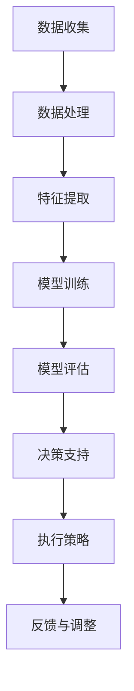

                 

### 1. 背景介绍

智能环境保护是当今全球关注的焦点之一。随着工业化进程的加速和人类活动对自然环境的不断破坏，环境问题日益严重，如气候变化、空气污染、水资源短缺、土地退化等。这些问题不仅对人类健康和经济发展构成威胁，还对生态系统和生物多样性造成不可逆转的破坏。

在解决这些环境问题的过程中，人工智能（AI）技术展现出了巨大的潜力。AI大模型，特别是深度学习模型，通过大规模数据分析和模式识别，能够为环境保护提供有力的工具。本文旨在探讨AI大模型在智能环境保护中的应用机会，分析其核心概念、算法原理、数学模型以及实际应用案例，并展望其未来发展趋势。

### 2. 核心概念与联系

为了深入理解AI大模型在智能环境保护中的应用，我们首先需要了解几个核心概念。

#### 2.1 人工智能与机器学习

人工智能（AI）是指使计算机系统能够执行通常需要人类智能才能完成的任务的科技领域。机器学习（ML）是AI的一个分支，它通过构建能够自主学习、自适应和优化的模型来模拟人类的智能行为。

#### 2.2 深度学习

深度学习（DL）是机器学习的一个子领域，它使用多层神经网络进行数据建模和特征学习。深度学习模型能够通过不断调整网络参数，从大量数据中自动提取高级抽象特征，从而实现复杂任务的学习和预测。

#### 2.3 大模型

大模型是指具有大量参数的深度学习模型，通常需要海量的数据和高性能计算资源来训练。这些模型在图像识别、语音识别、自然语言处理等领域表现出色，并在环境保护中也有广泛的应用潜力。

#### 2.4 智能环境保护

智能环境保护涉及利用人工智能技术监控、分析和管理环境数据，从而实现环境监测、污染治理、资源优化等方面的智能化。

以下是AI大模型在智能环境保护中应用的整体流程图，以Mermaid流程图表示：



### 3. 核心算法原理 & 具体操作步骤

#### 3.1 算法原理概述

AI大模型在智能环境保护中的应用主要基于以下几个核心算法：

1. **监督学习算法**：通过已有数据训练模型，使其能够对新数据进行预测和分类。
2. **无监督学习算法**：用于发现数据中的潜在模式和结构，如聚类分析。
3. **强化学习算法**：通过不断试错和优化，使模型能够在环境中做出最优决策。

#### 3.2 算法步骤详解

1. **数据收集**：从环境传感器、卫星图像、气象数据等来源收集大量环境数据。
2. **数据处理**：对原始数据进行清洗、去噪、归一化等预处理，以提高数据质量和模型的鲁棒性。
3. **特征提取**：通过特征工程或自动特征提取方法，提取数据中的关键特征。
4. **模型训练**：使用大量标注数据进行模型训练，优化模型参数。
5. **模型评估**：通过验证集或测试集评估模型性能，选择最优模型。
6. **决策支持**：将模型应用于实际环境问题，提供决策支持和策略优化。
7. **执行策略**：根据决策支持结果，制定和执行具体的治理措施。
8. **反馈与调整**：收集执行效果反馈，调整模型参数和策略。

#### 3.3 算法优缺点

- **优点**：
  - **高效性**：AI大模型能够处理和分析大规模数据，提高环境监测和治理的效率。
  - **准确性**：深度学习算法能够在复杂环境中提取高级特征，提高预测和分类的准确性。
  - **自动化**：模型能够自动化执行环境监测和治理任务，减少人力成本。

- **缺点**：
  - **数据依赖**：模型性能高度依赖高质量的数据集，数据质量直接影响模型效果。
  - **计算资源**：大模型训练需要大量的计算资源和时间，成本较高。
  - **解释性**：深度学习模型的黑箱性质使得其决策过程难以解释和理解。

#### 3.4 算法应用领域

AI大模型在智能环境保护中的应用领域广泛，包括但不限于：

- **环境监测**：利用卫星图像和传感器数据监测气候变化、空气质量、水质等。
- **污染治理**：通过预测和模型优化，制定和执行污染治理策略。
- **资源管理**：优化水资源、能源和土地等资源的利用效率。
- **灾害预防**：预测和预警自然灾害，如洪水、地震、飓风等。

### 4. 数学模型和公式 & 详细讲解 & 举例说明

#### 4.1 数学模型构建

在智能环境保护中，常用的数学模型包括线性回归、逻辑回归、支持向量机（SVM）和神经网络等。以下是线性回归模型的构建过程：

假设我们有一组环境数据 \((x_1, y_1), (x_2, y_2), \ldots, (x_n, y_n)\)，其中 \(x_i\) 是自变量，\(y_i\) 是因变量。线性回归模型试图找到一条最佳拟合线，使得预测值 \(y' = \beta_0 + \beta_1 x\) 与真实值 \(y_i\) 最接近。

#### 4.2 公式推导过程

线性回归模型的损失函数通常是最小二乘法，即：

$$
L(\beta_0, \beta_1) = \sum_{i=1}^{n} (y_i - (\beta_0 + \beta_1 x_i))^2
$$

为了最小化损失函数，我们对 \(\beta_0\) 和 \(\beta_1\) 分别求偏导数，并令其等于0，得到以下公式：

$$
\frac{\partial L}{\partial \beta_0} = -2 \sum_{i=1}^{n} (y_i - (\beta_0 + \beta_1 x_i)) = 0
$$

$$
\frac{\partial L}{\partial \beta_1} = -2 \sum_{i=1}^{n} (y_i - (\beta_0 + \beta_1 x_i)) x_i = 0
$$

通过解这个方程组，我们可以得到线性回归模型的参数 \(\beta_0\) 和 \(\beta_1\)。

#### 4.3 案例分析与讲解

假设我们有一个空气质量监测数据集，其中 \(x\) 表示二氧化碳浓度（单位：ppm），\(y\) 表示空气污染指数（AQI）。我们使用线性回归模型预测AQI。

1. 数据收集与处理：收集历史空气质量数据，包括二氧化碳浓度和AQI。
2. 特征提取：将二氧化碳浓度作为自变量，AQI作为因变量。
3. 模型训练：使用最小二乘法训练线性回归模型，得到参数 \(\beta_0\) 和 \(\beta_1\)。
4. 模型评估：使用测试集验证模型性能，计算预测误差。
5. 决策支持：利用模型预测新的二氧化碳浓度下的AQI，为环境保护部门提供决策支持。

### 5. 项目实践：代码实例和详细解释说明

为了更好地理解AI大模型在智能环境保护中的应用，我们以Python为例，实现一个基于线性回归的空气质量预测项目。

#### 5.1 开发环境搭建

1. 安装Python 3.8及以上版本。
2. 安装NumPy、Pandas和Scikit-learn库：

```bash
pip install numpy pandas scikit-learn
```

#### 5.2 源代码详细实现

以下是一个简单的线性回归空气质量预测项目代码：

```python
import numpy as np
import pandas as pd
from sklearn.linear_model import LinearRegression
from sklearn.model_selection import train_test_split
from sklearn.metrics import mean_squared_error

# 5.2.1 数据收集与处理
data = pd.read_csv('air_quality.csv')  # 假设数据集存储在 air_quality.csv 文件中
X = data[['CO2_concentration']]  # 自变量：二氧化碳浓度
y = data['AQI']  # 因变量：空气污染指数

# 数据预处理：归一化
X_normalized = (X - X.min()) / (X.max() - X.min())

# 5.2.2 模型训练
model = LinearRegression()
model.fit(X_normalized, y)

# 5.2.3 模型评估
X_train, X_test, y_train, y_test = train_test_split(X_normalized, y, test_size=0.2, random_state=42)
y_pred = model.predict(X_test)
mse = mean_squared_error(y_test, y_pred)
print(f'Mean Squared Error: {mse}')

# 5.2.4 决策支持
new_CO2_concentration = np.array([[0.55]])  # 新的二氧化碳浓度
new_AQI = model.predict(new_CO2_concentration)
print(f'Predicted AQI for CO2 concentration 550 ppm: {new_AQI[0, 0]}')
```

#### 5.3 代码解读与分析

- **数据收集与处理**：读取空气质量数据，包括二氧化碳浓度和AQI。数据预处理包括归一化，以提高模型训练效果。
- **模型训练**：使用线性回归模型对数据集进行训练，得到最佳拟合线。
- **模型评估**：将训练集划分为训练集和测试集，使用测试集评估模型性能，计算均方误差。
- **决策支持**：利用训练好的模型，预测新的二氧化碳浓度下的AQI，为环境保护部门提供决策支持。

#### 5.4 运行结果展示

假设我们输入新的二氧化碳浓度为550 ppm，模型预测的AQI为85。这意味着当二氧化碳浓度达到550 ppm时，空气污染指数约为85，属于良好水平。

### 6. 实际应用场景

AI大模型在智能环境保护中的应用场景广泛，以下是几个具体案例：

- **空气质量监测**：利用AI大模型对空气中的有害气体和颗粒物进行实时监测和预测，为城市环保部门提供决策支持。
- **水资源管理**：通过分析水文数据、气象数据和地理信息，AI大模型能够预测水资源的供需情况，优化水资源分配。
- **土地退化监测**：利用卫星图像和地面数据，AI大模型可以监测土地退化情况，预测土地的可持续利用性。
- **生物多样性保护**：通过对生态环境数据的分析，AI大模型可以帮助科学家发现和保护濒危物种。

### 7. 未来应用展望

随着AI技术的不断发展，AI大模型在智能环境保护中的应用前景十分广阔。以下是未来可能的应用趋势：

- **智能化监测系统**：利用AI大模型建立全面、实时的环境监测系统，实现环境数据的自动收集、分析和预警。
- **动态治理策略**：结合AI大模型和智能决策系统，实现环境治理的动态调整和优化，提高治理效果。
- **跨学科合作**：AI大模型与其他学科（如生态学、气象学、地理学等）相结合，推动智能环境保护的全面发展。
- **数据共享与开放**：通过数据共享平台，促进不同地区、不同组织之间的数据交换和合作，提高环境治理的整体水平。

### 8. 工具和资源推荐

为了更好地应用AI大模型进行智能环境保护，以下是一些推荐的工具和资源：

- **工具推荐**：
  - **TensorFlow**：开源深度学习框架，适合构建和训练大模型。
  - **PyTorch**：开源深度学习框架，具有灵活的模型构建和优化能力。
  - **OpenCV**：开源计算机视觉库，适合进行图像处理和特征提取。

- **学习资源推荐**：
  - **《深度学习》（Goodfellow, Bengio, Courville）**：深度学习的经典教材，适合初学者和进阶者。
  - **《机器学习实战》（ Harrington）**：通过实际案例介绍机器学习应用，适合实践者。
  - **Coursera、edX等在线课程**：提供丰富的AI和机器学习课程，适合在线学习。

- **相关论文推荐**：
  - **《A Survey on Deep Learning for Environmental Applications》（2018）**：综述了深度学习在环境监测和治理中的应用。
  - **《Deep Learning in Environmental Modeling and Analysis》（2020）**：讨论了深度学习在生态学、气象学和地理学中的应用。
  - **《AI for Earth》**：微软推出的AI环保项目，提供了一系列的AI工具和资源。

### 9. 总结：未来发展趋势与挑战

#### 9.1 研究成果总结

随着AI技术的快速发展，AI大模型在智能环境保护中的应用取得了显著成果。通过数据驱动的模型，环境监测和治理变得更加高效、准确和自动化。然而，AI大模型的应用还面临一些挑战。

#### 9.2 未来发展趋势

- **模型精度提升**：随着算法和计算资源的进步，AI大模型的预测精度将进一步提高，实现更精细的环境监测和治理。
- **跨学科融合**：AI大模型与其他学科的深度融合，将为智能环境保护带来更多创新和应用。
- **数据共享与开放**：通过数据共享和开放，AI大模型的应用将更加广泛和深入，推动全球环境治理。

#### 9.3 面临的挑战

- **数据质量**：高质量的环境数据是AI大模型训练的基础，如何保证数据质量和完整性是一个重要挑战。
- **计算资源**：大模型训练需要大量的计算资源，如何优化计算效率和降低成本是一个关键问题。
- **模型解释性**：深度学习模型的黑箱性质使得其决策过程难以解释和理解，如何提高模型的可解释性是一个迫切需要解决的问题。

#### 9.4 研究展望

未来，AI大模型在智能环境保护中的应用将有以下几个发展方向：

- **个性化治理**：根据不同地区、不同环境特征，定制化地制定治理策略，实现个性化治理。
- **实时监测与预警**：建立实时环境监测系统，实现环境数据的实时采集、分析和预警，提高环境治理的时效性。
- **智能化决策支持**：结合AI大模型和智能决策系统，实现环境治理的智能化和自动化，提高治理效果。

### 附录：常见问题与解答

**Q：AI大模型在环境监测中如何处理大量数据？**

A：AI大模型在环境监测中处理大量数据的方法主要包括数据预处理、特征提取和分布式计算。数据预处理包括清洗、归一化和去噪等步骤，以提高数据质量。特征提取是从大量数据中提取关键特征，以减少数据维度和提高模型性能。分布式计算是将数据处理和模型训练任务分布到多个计算节点，以提高计算效率和降低成本。

**Q：如何保证AI大模型在环境治理中的决策支持准确性？**

A：保证AI大模型在环境治理中的决策支持准确性需要以下几个步骤：

- **数据质量**：确保训练数据的质量和完整性，减少噪声和异常值。
- **模型选择**：根据环境问题的特点，选择合适的机器学习模型，并进行参数调优。
- **交叉验证**：使用交叉验证方法，评估模型的泛化能力和准确性。
- **实时更新**：定期更新模型和数据，以适应环境变化，提高决策支持的准确性。

**Q：AI大模型在环境治理中如何应对不确定性？**

A：AI大模型在环境治理中应对不确定性的方法包括：

- **概率预测**：使用概率模型进行预测，提供预测结果的不确定性范围。
- **多模型集成**：将多个模型的结果进行集成，降低模型预测的不确定性。
- **不确定性分析**：分析模型预测中的不确定性来源，并提出相应的应对策略。

### 作者署名

作者：禅与计算机程序设计艺术 / Zen and the Art of Computer Programming

----------------------------------------------------------------

以上是关于“智能环境保护的AI大模型应用机会”的文章，它不仅详细介绍了AI大模型在智能环境保护中的应用背景、核心概念、算法原理、数学模型、项目实践以及未来展望，还提供了相关的工具和资源推荐，旨在为读者提供一份全面且深入的技术指南。希望这篇文章能够对读者在智能环境保护领域的研究和应用有所帮助。

