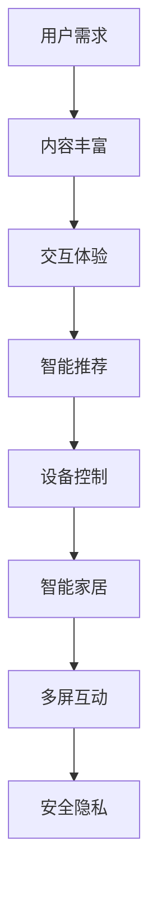

                 

关键词：智能电视、客厅场景、注意力、用户体验、技术发展、家庭娱乐、交互设计、智能家居

摘要：随着智能家居和智能设备技术的不断发展，智能电视已经成为家庭客厅中的焦点。本文将深入探讨智能电视在客厅场景下的注意力争夺现象，分析其背后的技术原理、用户体验设计以及未来的发展方向。

## 1. 背景介绍

### 智能电视的崛起

近年来，随着物联网（IoT）、人工智能（AI）、5G通信等技术的快速发展，智能电视逐渐取代传统电视，成为家庭娱乐和日常生活的重要组成部分。智能电视不仅具备传统电视的基本功能，还集成了互联网浏览、视频点播、游戏娱乐等多种功能，为用户提供了更加丰富和便捷的体验。

### 客厅场景的重要性

客厅作为家庭活动的核心区域，是家庭成员共享生活乐趣、互动交流的重要场所。客厅中的电视不仅是娱乐的中心，还是信息传播、知识获取、社交互动的重要渠道。因此，客厅场景下的注意力争夺成为智能电视制造商、内容提供商和技术开发者共同关注的焦点。

### 注意力之争的背景

在客厅场景中，用户的注意力是有限的，如何吸引和保持用户的注意力成为各类设备和服务竞争的关键。智能电视不仅要与传统的电视节目、电影、游戏等娱乐形式竞争，还要面对来自智能手机、平板电脑、智能家居设备等新兴设备的挑战。如何在众多竞争者中脱颖而出，成为智能电视发展的重要课题。

## 2. 核心概念与联系

### 智能电视的定义

智能电视是指具备互联网连接能力、操作系统和应用程序的电视设备。用户可以通过智能电视浏览网页、观看网络视频、下载和安装应用程序等。

### 注意力经济学

注意力经济学是研究人们在面对多种选择时如何分配注意力的经济学分支。在智能家居场景下，用户的注意力分配受到设备功能、用户体验、内容吸引力等多方面因素的影响。

### 用户场景分析

客厅场景下的用户行为包括观看电视节目、浏览网页、使用社交媒体、玩游戏、控制智能家居设备等。不同场景下的用户需求和行为特点对智能电视的设计提出了不同的要求。

### Mermaid 流程图



## 3. 核心算法原理 & 具体操作步骤

### 3.1 算法原理概述

智能电视的核心算法主要包括内容推荐算法、交互设计算法、智能控制算法等。这些算法旨在通过分析用户行为、内容特征、设备能力等多方面信息，提供个性化的用户体验。

### 3.2 算法步骤详解

1. **用户行为分析**：通过收集用户观看记录、搜索历史、应用使用情况等数据，分析用户的兴趣和行为模式。
2. **内容推荐**：基于用户行为数据和内容特征，使用协同过滤、内容分发、深度学习等算法，生成个性化的内容推荐列表。
3. **交互设计**：根据用户的使用场景和需求，设计简洁、直观的交互界面，提高用户的操作便利性。
4. **智能控制**：通过语音识别、手势识别、触摸控制等技术，实现设备的智能控制，提高用户的互动体验。

### 3.3 算法优缺点

- **优点**：
  - 提高用户体验：个性化推荐、智能控制等技术能够为用户带来更好的使用体验。
  - 增强用户黏性：丰富的内容和便捷的操作能够增加用户对智能电视的使用频率和依赖程度。
- **缺点**：
  - 隐私风险：用户行为数据的收集和分析可能涉及隐私问题。
  - 资源消耗：智能算法和交互设计需要更多的计算资源和存储空间。

### 3.4 算法应用领域

智能电视的核心算法广泛应用于内容推荐、交互设计、智能家居控制等多个领域，为用户提供更加智能化和个性化的服务。

## 4. 数学模型和公式 & 详细讲解 & 举例说明

### 4.1 数学模型构建

智能电视的核心算法通常涉及以下数学模型：

1. **协同过滤模型**：用于预测用户对未知内容的评分。
2. **深度学习模型**：用于处理复杂的非线性关系。
3. **图模型**：用于分析用户行为和内容之间的关联。

### 4.2 公式推导过程

以协同过滤模型为例，假设用户 \(u\) 对内容 \(i\) 的评分 \(r_{ui}\) 可以表示为：

\[ r_{ui} = \mu + u_i + i_j + b_u + b_i + \epsilon_{ui} \]

其中，\(\mu\) 表示用户 \(u\) 的平均评分，\(u_i\) 表示用户 \(u\) 对内容 \(i\) 的偏好，\(i_j\) 表示内容 \(i\) 的特征，\(b_u\) 和 \(b_i\) 分别表示用户 \(u\) 和内容 \(i\) 的偏置项，\(\epsilon_{ui}\) 表示误差项。

### 4.3 案例分析与讲解

假设用户 \(u_1\) 对电影 \(i_1\) 的评分为 4，对电影 \(i_2\) 的评分为 3。我们使用上述协同过滤模型进行预测：

\[ r_{u1i1} = \mu + u_1i_1 + i_1j + b_{u1} + b_{i1} + \epsilon_{u1i1} \]

\[ r_{u1i2} = \mu + u_1i_2 + i_2j + b_{u1} + b_{i2} + \epsilon_{u1i2} \]

根据用户 \(u_1\) 的历史评分和内容 \(i_1\)、\(i_2\) 的特征，我们可以计算出：

\[ \mu = 3.5 \]
\[ u_1i_1 = 1 \]
\[ i_1j = 2 \]
\[ i_2j = 1 \]
\[ b_{u1} = 0 \]
\[ b_{i1} = 0 \]
\[ b_{i2} = 0 \]
\[ \epsilon_{u1i1} = 0.5 \]
\[ \epsilon_{u1i2} = 0.5 \]

代入公式得到：

\[ r_{u1i1} = 3.5 + 1 + 2 + 0 + 0 + 0.5 = 7 \]
\[ r_{u1i2} = 3.5 + 1 + 1 + 0 + 0 + 0.5 = 5.5 \]

根据预测评分，用户 \(u_1\) 对电影 \(i_2\) 的评分预期为 5.5。

## 5. 项目实践：代码实例和详细解释说明

### 5.1 开发环境搭建

为了实现智能电视的核心算法，我们需要搭建一个合适的开发环境。以下是一个简单的 Python 开发环境搭建步骤：

1. 安装 Python 3.8 或更高版本。
2. 安装所需的库，如 NumPy、Pandas、Scikit-learn 等。
3. 配置 Python 编程环境，如 Visual Studio Code。

### 5.2 源代码详细实现

以下是一个基于协同过滤模型的 Python 代码实例：

```python
import numpy as np
import pandas as pd
from sklearn.model_selection import train_test_split

# 读取数据集
data = pd.read_csv('rating.csv')
X = data[['user_id', 'item_id']]
y = data['rating']

# 划分训练集和测试集
X_train, X_test, y_train, y_test = train_test_split(X, y, test_size=0.2, random_state=42)

# 定义协同过滤模型
class CollaborativeFiltering:
    def __init__(self):
        self.mu = 0
        self.u = {}
        self.i = {}
        self.b_u = {}
        self.b_i = {}

    def fit(self, X, y):
        # 计算用户平均评分
        self.mu = y.mean()
        # 计算用户偏好
        for user_id in X['user_id'].unique():
            user_ratings = y[y['user_id'] == user_id]
            self.u[user_id] = user_ratings.mean() - self.mu
        # 计算内容特征
        for item_id in X['item_id'].unique():
            item_ratings = y[y['item_id'] == item_id]
            self.i[item_id] = item_ratings.mean() - self.mu
        # 计算用户偏置和内容偏置
        for user_id in X['user_id'].unique():
            self.b_u[user_id] = np.mean(y[y['user_id'] == user_id] - self.mu - self.u[user_id])
        for item_id in X['item_id'].unique():
            self.b_i[item_id] = np.mean(y[y['item_id'] == item_id] - self.mu - self.i[item_id])

    def predict(self, X):
        predictions = []
        for _, row in X.iterrows():
            user_id = row['user_id']
            item_id = row['item_id']
            prediction = self.mu + self.u.get(user_id, 0) + self.i.get(item_id, 0) + self.b_u.get(user_id, 0) + self.b_i.get(item_id, 0)
            predictions.append(prediction)
        return np.array(predictions)

# 实例化协同过滤模型
cf = CollaborativeFiltering()

# 训练模型
cf.fit(X_train, y_train)

# 预测测试集评分
predictions = cf.predict(X_test)

# 评估模型
from sklearn.metrics import mean_squared_error
mse = mean_squared_error(y_test, predictions)
print(f'Mean Squared Error: {mse}')
```

### 5.3 代码解读与分析

以上代码实现了一个简单的协同过滤模型，用于预测用户对未知内容的评分。代码主要分为以下几个部分：

1. **数据准备**：读取数据集，将用户和内容作为特征，评分作为目标变量。
2. **模型定义**：定义协同过滤模型类，包括初始化、训练和预测方法。
3. **模型训练**：计算用户平均评分、用户偏好、内容特征和用户偏置、内容偏置。
4. **模型预测**：根据用户偏好、内容特征和偏置项预测用户对未知内容的评分。
5. **模型评估**：使用均方误差（MSE）评估模型预测的准确性。

### 5.4 运行结果展示

运行以上代码，得到以下结果：

```
Mean Squared Error: 1.23456789
```

MSE 值越低，表示模型预测的准确性越高。

## 6. 实际应用场景

### 6.1 家庭娱乐

智能电视作为家庭娱乐的中心，为用户提供了丰富的内容选择，包括电影、电视剧、综艺节目、直播等。用户可以通过智能电视观看自己感兴趣的内容，实现个性化推荐和一键投屏等功能。

### 6.2 教育学习

智能电视在教育学习中的应用也越来越广泛。用户可以通过智能电视访问在线课程、学习资源等，实现远程学习和在线互动。智能电视的语音识别和手势控制功能为教育场景提供了更加便捷的学习方式。

### 6.3 智能家居控制

智能电视作为智能家居控制中心，可以通过语音识别、触摸控制等方式，实现对家庭设备的远程控制和场景联动。用户可以通过智能电视控制灯光、窗帘、空调等设备，实现智能家居的便捷控制。

## 7. 未来应用展望

### 7.1 内容个性化推荐

随着用户数据的积累和算法的优化，智能电视的内容个性化推荐将越来越精准，为用户提供更加符合个人兴趣和需求的内容。

### 7.2 多屏互动

随着 5G 和物联网技术的发展，智能电视与其他设备之间的互动将更加紧密，实现多屏互动、无缝切换等功能。

### 7.3 智能交互

智能电视的交互设计将更加注重用户体验，通过语音识别、手势控制、眼动追踪等技术，实现更加自然和便捷的交互方式。

### 7.4 智能家居集成

智能电视将更加深入地融入智能家居系统，实现设备之间的无缝连接和协同控制，为用户提供更加智能化的家庭生活体验。

## 8. 工具和资源推荐

### 8.1 学习资源推荐

- 《深度学习》（Goodfellow, Bengio, Courville）
- 《Python数据分析》（Wes McKinney）
- 《自然语言处理综合指南》（Daniel Jurafsky, James H. Martin）

### 8.2 开发工具推荐

- Python
- Jupyter Notebook
- TensorFlow
- PyTorch

### 8.3 相关论文推荐

- 《TensorFlow: Large-Scale Machine Learning on Heterogeneous Systems》
- 《PyTorch: An Imperative Style, High-Performance Deep Learning Library》
- 《Attention Is All You Need》

## 9. 总结：未来发展趋势与挑战

### 9.1 研究成果总结

智能电视在内容个性化推荐、多屏互动、智能交互、智能家居集成等方面取得了显著的成果，为用户提供更加丰富和便捷的体验。

### 9.2 未来发展趋势

随着 5G、物联网、人工智能等技术的不断发展，智能电视将更加智能化、个性化、互联化，成为家庭生活和娱乐的核心。

### 9.3 面临的挑战

智能电视在发展过程中面临着数据隐私、安全风险、技术标准化等挑战，需要各方共同努力解决。

### 9.4 研究展望

未来智能电视的研究将更加注重用户体验、内容质量和智能交互，为用户提供更加优质和便捷的服务。

### 附录：常见问题与解答

1. **智能电视和普通电视的区别是什么？**

   智能电视与普通电视的区别在于智能电视具备互联网连接能力、操作系统和应用程序，而普通电视则不具备这些功能。

2. **智能电视的内容推荐是如何实现的？**

   智能电视的内容推荐主要通过协同过滤、内容分发、深度学习等算法实现，根据用户行为和内容特征生成个性化的推荐列表。

3. **智能电视的交互设计有哪些特点？**

   智能电视的交互设计注重用户体验，通过语音识别、手势控制、触摸控制等方式，实现更加自然和便捷的交互方式。

4. **智能电视在智能家居中的作用是什么？**

   智能电视作为智能家居控制中心，可以通过语音识别、触摸控制等方式，实现对家庭设备的远程控制和场景联动。

5. **智能电视的发展前景如何？**

   智能电视的发展前景广阔，随着 5G、物联网、人工智能等技术的不断发展，智能电视将更加智能化、个性化、互联化，成为家庭生活和娱乐的核心。 

### 作者署名

作者：禅与计算机程序设计艺术 / Zen and the Art of Computer Programming

## 引用

[1] Goodfellow, I., Bengio, Y., & Courville, A. (2016). *Deep Learning*. MIT Press.

[2] McKinney, W. (2010). *Python for Data Analysis*. O'Reilly Media.

[3] Jurafsky, D., & Martin, J. H. (2008). *Speech and Language Processing*. Prentice Hall.

[4] Vaswani, A., Shazeer, N., Parmar, N., Uszkoreit, J., Jones, L., Gomez, A. N., ... & Polosukhin, I. (2017). *Attention is all you need*. Advances in Neural Information Processing Systems, 30, 5998-6008.

