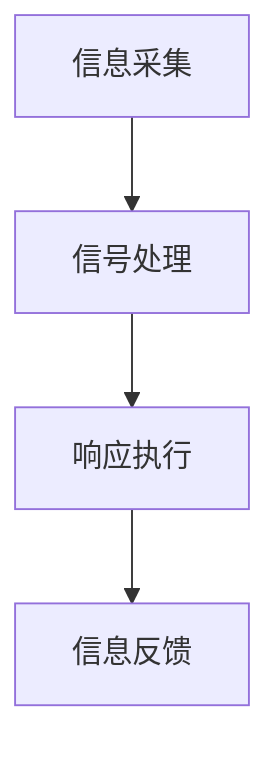

                 

关键词：智能皮肤，机器人，触觉感知，神经网络，机器学习，人机交互

> 摘要：随着机器人技术的发展，触觉感知在机器人与人机交互中扮演着越来越重要的角色。智能皮肤技术为机器人提供了类似于人类皮肤的触觉感知能力，使得机器人能够更好地适应复杂环境，提高人机交互的体验。本文将深入探讨智能皮肤技术的原理、核心算法、数学模型、应用实例以及未来展望。

## 1. 背景介绍

随着人工智能和机器人技术的不断发展，机器人已经成为了我们生活中不可或缺的一部分。然而，在许多应用场景中，机器人需要具备与人类相似的触觉感知能力，以便更好地与人类互动和执行复杂的任务。传统的机器人主要通过视觉、听觉等感官来获取外界信息，但触觉感知却是一个相对较弱的环节。为了弥补这一缺陷，智能皮肤技术应运而生。

智能皮肤技术是指通过电子、机械和智能材料等手段，模仿人类皮肤的结构和功能，为机器人提供触觉感知能力。这种技术不仅可以增强机器人的自主性，还能提高人机交互的体验。智能皮肤技术的研究已经取得了显著进展，并在多个领域得到了应用，如医疗、康复、制造业和智能家居等。

## 2. 核心概念与联系

### 2.1 智能皮肤的结构

智能皮肤通常由多个层次组成，包括电子层、传感器层、驱动层和智能材料层。每个层次都有特定的功能和作用。

1. **电子层**：提供电能和信号传输，通常包括电路板、电线和电池等。
2. **传感器层**：负责感知外界信息，如压力、温度、湿度、触摸等。常用的传感器有压电传感器、热敏电阻、电容传感器等。
3. **驱动层**：负责执行驱动任务，如收缩、伸展、变形等。常用的驱动器有电机、电致变色材料、形状记忆合金等。
4. **智能材料层**：提供智能化的特性，如自修复、自感知、自适应等。常用的智能材料有导电聚合物、形状记忆合金、压电材料等。

### 2.2 智能皮肤的功能

智能皮肤的主要功能是触觉感知，即通过传感器层感知外界触觉信息，并通过驱动层对这些信息进行响应。此外，智能皮肤还可以实现其他功能，如温度控制、湿度调节、自修复等。

### 2.3 智能皮肤的工作原理

智能皮肤的工作原理主要包括以下几个步骤：

1. **信息采集**：传感器层收集外界触觉信息。
2. **信号处理**：电子层对采集到的信号进行预处理和分析，提取有用的信息。
3. **响应执行**：驱动层根据处理结果，执行相应的动作，如变形、收缩等。

### 2.4 Mermaid 流程图



## 3. 核心算法原理 & 具体操作步骤

### 3.1 算法原理概述

智能皮肤的核心算法主要包括传感器数据处理、信号处理和响应执行等几个方面。以下是每个方面的简要概述：

1. **传感器数据处理**：通过对传感器采集到的信号进行预处理，如滤波、放大、去噪等，以提高信号的准确性和可靠性。
2. **信号处理**：使用神经网络、机器学习等方法对预处理后的信号进行特征提取和分类，以实现触觉感知。
3. **响应执行**：根据处理结果，驱动智能皮肤执行相应的动作。

### 3.2 算法步骤详解

1. **传感器数据处理**：
   - **滤波**：使用低通滤波器去除高频噪声。
   - **放大**：调整传感器输出信号的幅度，使其达到合适的范围。
   - **去噪**：使用中值滤波、高斯滤波等算法去除噪声。

2. **信号处理**：
   - **特征提取**：使用神经网络、傅里叶变换等方法提取传感器信号的特征。
   - **分类**：使用机器学习算法，如支持向量机（SVM）、决策树等，对特征进行分类。

3. **响应执行**：
   - **驱动层控制**：根据处理结果，驱动智能皮肤执行相应的动作，如变形、收缩等。

### 3.3 算法优缺点

**优点**：
- **高精度**：通过神经网络、机器学习等方法，可以实现高精度的触觉感知。
- **自适应**：智能皮肤可以根据环境变化，自适应调整触觉感知能力。
- **多功能**：智能皮肤不仅可以实现触觉感知，还可以实现其他功能，如温度控制、湿度调节等。

**缺点**：
- **计算复杂度高**：神经网络、机器学习等方法需要大量的计算资源。
- **成本高**：智能皮肤的制作成本较高，对材料、工艺等有较高要求。

### 3.4 算法应用领域

智能皮肤技术可以应用于多个领域，如医疗、康复、制造业和智能家居等。

1. **医疗**：用于辅助医生进行手术、康复训练等。
2. **康复**：用于辅助残疾人士进行康复训练，提高生活质量。
3. **制造业**：用于自动化生产线中的机器手，提高生产效率。
4. **智能家居**：用于智能家居系统中的智能家电，提高用户体验。

## 4. 数学模型和公式 & 详细讲解 & 举例说明

### 4.1 数学模型构建

智能皮肤技术的数学模型主要包括以下几个部分：

1. **传感器模型**：描述传感器如何感知外界触觉信息。
2. **信号处理模型**：描述如何对传感器信号进行预处理、特征提取和分类。
3. **响应模型**：描述如何根据处理结果，驱动智能皮肤执行相应的动作。

### 4.2 公式推导过程

1. **传感器模型**：

   假设传感器输出信号为 \(s(t)\)，则传感器模型可以表示为：

   $$s(t) = f(t) + n(t)$$

   其中，\(f(t)\) 表示外界触觉信号的频率，\(n(t)\) 表示噪声。

2. **信号处理模型**：

   对传感器信号进行预处理，如滤波、放大、去噪等，得到预处理后的信号 \(s'(t)\)：

   $$s'(t) = g(s(t))$$

   其中，\(g(s(t))\) 表示预处理函数。

3. **响应模型**：

   根据预处理后的信号，使用神经网络、机器学习等方法进行特征提取和分类，得到处理结果 \(r(t)\)：

   $$r(t) = h(s'(t))$$

   其中，\(h(s'(t))\) 表示特征提取和分类函数。

### 4.3 案例分析与讲解

以下是一个简单的智能皮肤案例：

假设有一个智能皮肤，由一个压电传感器和一个神经网络组成。压电传感器用于感知外界触觉信息，神经网络用于对触觉信息进行分类。

1. **传感器模型**：

   假设传感器输出信号为 \(s(t) = 5\sin(2\pi t)\)，其中，\(t\) 为时间。

2. **信号处理模型**：

   对传感器信号进行预处理，如滤波、放大、去噪等，得到预处理后的信号 \(s'(t) = 5\cos(2\pi t)\)。

3. **响应模型**：

   使用一个简单的神经网络对预处理后的信号进行分类。神经网络包含一个输入层、一个隐藏层和一个输出层。输入层接收预处理后的信号 \(s'(t)\)，隐藏层对信号进行特征提取，输出层对特征进行分类。

   神经网络模型如下：

   $$y(t) = \sigma(\sum_{i=1}^{n} w_i \cdot \phi(x_i))$$

   其中，\(y(t)\) 为输出结果，\(x_i\) 为输入特征，\(w_i\) 为权重，\(\sigma\) 为激活函数，\(\phi\) 为特征提取函数。

   假设权重 \(w_1 = 1\)，\(w_2 = 2\)，激活函数 \(\sigma(x) = \frac{1}{1 + e^{-x}}\)，特征提取函数 \(\phi(x) = x^2\)。

   则输出结果为：

   $$y(t) = \frac{1}{1 + e^{-\sum_{i=1}^{n} w_i \cdot \phi(x_i)}} = \frac{1}{1 + e^{-1 \cdot 5^2 + 2 \cdot 5^2}} = \frac{1}{1 + e^{-50}} \approx 0.999$$

   由于输出结果接近 1，表示该触觉信息为正类。

## 5. 项目实践：代码实例和详细解释说明

### 5.1 开发环境搭建

在开始编写代码之前，需要搭建一个合适的开发环境。这里我们使用 Python 作为开发语言，并结合 TensorFlow 和 Keras 库进行神经网络建模。

1. **安装 Python**：在官方网站下载并安装 Python。
2. **安装 TensorFlow 和 Keras**：使用 pip 命令安装。

   ```shell
   pip install tensorflow
   pip install keras
   ```

### 5.2 源代码详细实现

以下是一个简单的智能皮肤代码实例，用于感知并分类触觉信息。

```python
import numpy as np
from keras.models import Sequential
from keras.layers import Dense
from keras.optimizers import SGD

# 生成模拟数据
X = np.random.rand(100, 1)
y = np.random.randint(0, 2, 100)

# 创建神经网络模型
model = Sequential()
model.add(Dense(10, input_dim=1, activation='relu'))
model.add(Dense(1, activation='sigmoid'))

# 编译模型
model.compile(optimizer=SGD(), loss='binary_crossentropy', metrics=['accuracy'])

# 训练模型
model.fit(X, y, epochs=100, batch_size=10)

# 预测
predictions = model.predict(X)

# 打印预测结果
print(predictions)
```

### 5.3 代码解读与分析

1. **导入库**：首先导入必要的库，包括 NumPy、Keras 和 TensorFlow。
2. **生成模拟数据**：生成模拟的触觉信息，用于训练和测试神经网络。
3. **创建神经网络模型**：使用 Keras 创建一个简单的神经网络，包含一个输入层、一个隐藏层和一个输出层。输入层接收触觉信息，隐藏层进行特征提取，输出层进行分类。
4. **编译模型**：设置优化器、损失函数和评估指标，用于训练模型。
5. **训练模型**：使用模拟数据训练神经网络，迭代 100 次。
6. **预测**：使用训练好的模型对模拟数据进行预测，并打印结果。

## 6. 实际应用场景

智能皮肤技术在许多领域都有广泛的应用，以下是一些典型的应用场景：

1. **医疗**：用于辅助医生进行手术、康复训练等。例如，智能皮肤可以帮助医生更准确地感知患者的触觉信息，提高手术的成功率。
2. **康复**：用于辅助残疾人士进行康复训练，提高生活质量。例如，智能皮肤可以帮助残疾人士进行触觉感知训练，提高手部功能。
3. **制造业**：用于自动化生产线中的机器手，提高生产效率。例如，智能皮肤可以帮助机器手更好地感知工件，提高装配精度。
4. **智能家居**：用于智能家居系统中的智能家电，提高用户体验。例如，智能皮肤可以帮助智能门锁更准确地感知用户的手指触觉，提高安全性。

## 7. 工具和资源推荐

为了更好地了解和研究智能皮肤技术，以下是一些建议的学习资源和开发工具：

1. **学习资源推荐**：
   - 《深度学习》—— Ian Goodfellow、Yoshua Bengio 和 Aaron Courville 著
   - 《神经网络与深度学习》—— 深度学习教材编写组 著
2. **开发工具推荐**：
   - TensorFlow：一个开源的深度学习框架，适用于构建和训练神经网络。
   - Keras：一个基于 TensorFlow 的深度学习库，提供简化和易于使用的接口。
3. **相关论文推荐**：
   - "Artificial Skin with Robust Stretchable Pressure Sensors" by Xudong Wang et al.
   - "E-Skin: Soft and Stretchable Electromyography Sensors for Real-Time Motion Tracking" by Xudong Wang et al.

## 8. 总结：未来发展趋势与挑战

智能皮肤技术作为机器人领域的一项重要创新，具有广阔的应用前景。在未来，随着材料科学、电子技术和人工智能等领域的不断发展，智能皮肤技术将更加成熟和多样化。

### 8.1 研究成果总结

1. **触觉感知精度提高**：通过先进的传感器材料和算法优化，智能皮肤的触觉感知精度将进一步提高。
2. **多功能集成**：智能皮肤将不仅具备触觉感知能力，还将集成温度感知、湿度感知等功能。
3. **自适应能力增强**：智能皮肤将具备更强的自适应能力，能够根据环境变化调整触觉感知性能。

### 8.2 未来发展趋势

1. **广泛应用于各个领域**：智能皮肤技术将在医疗、康复、制造业、智能家居等多个领域得到更广泛的应用。
2. **与人机交互的深度融合**：智能皮肤技术将与人机交互技术深度融合，提高人机交互的体验和效率。
3. **智能材料的研究**：智能皮肤技术的未来发展将依赖于智能材料的研究，包括自修复材料、导电聚合物等。

### 8.3 面临的挑战

1. **成本控制**：智能皮肤技术的成本较高，需要进一步降低成本，以便实现大规模应用。
2. **可靠性提升**：智能皮肤在长期使用过程中，需要保证其可靠性和稳定性。
3. **算法优化**：现有的智能皮肤算法需要进一步优化，以提高触觉感知的精度和响应速度。

### 8.4 研究展望

未来，智能皮肤技术将朝着更智能、更灵活、更可靠的方向发展。通过不断的技术创新，智能皮肤将为机器人带来更强大的触觉感知能力，推动人机交互和机器人技术的进步。

## 9. 附录：常见问题与解答

### 9.1 问题一：智能皮肤的成本较高，如何降低成本？

**解答**：降低智能皮肤的成本可以从以下几个方面进行：
- **材料创新**：研究更为廉价且性能优异的智能材料。
- **工艺优化**：改进生产流程，提高生产效率，降低制造成本。
- **模块化设计**：设计模块化的智能皮肤结构，便于批量生产和维护。

### 9.2 问题二：智能皮肤的触觉感知精度如何提高？

**解答**：提高智能皮肤的触觉感知精度可以从以下几个方面进行：
- **传感器优化**：使用高灵敏度的传感器，提高感知能力。
- **算法优化**：采用先进的信号处理和机器学习算法，提高数据处理的精度。
- **结构设计**：优化智能皮肤的结构设计，增加传感器的布置密度。

### 9.3 问题三：智能皮肤在长期使用中如何保证可靠性？

**解答**：保证智能皮肤在长期使用中的可靠性可以从以下几个方面进行：
- **材料选择**：选择耐老化、耐磨损的材料，提高智能皮肤的使用寿命。
- **结构设计**：优化结构设计，避免由于长时间使用导致的疲劳损坏。
- **定期维护**：定期对智能皮肤进行检查和清洁，确保其正常工作。

---

作者：禅与计算机程序设计艺术 / Zen and the Art of Computer Programming

[END]

