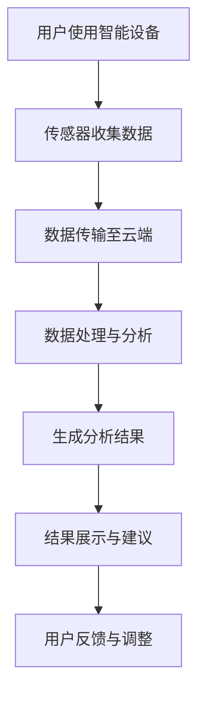

                 

## 1. 背景介绍

随着现代生活节奏的加快，睡眠问题已经成为全球范围内广泛关注的健康问题。根据世界卫生组织（WHO）的数据，全球约有27%的人口存在睡眠障碍，这不仅影响了个人生活质量，也对公共卫生和社会经济发展产生了深远影响。睡眠质量的下降与各种健康问题密切相关，包括心血管疾病、糖尿病、肥胖症、抑郁症等。因此，如何通过科技手段改善睡眠质量，已成为一个备受关注的研究领域。

近年来，人工智能（AI）和物联网（IoT）技术的飞速发展，为智能睡眠解决方案提供了新的契机。智能睡眠设备能够实时监测用户的睡眠状况，通过数据分析提供个性化的改善建议。同时，基于AI的算法能够对大量的睡眠数据进行处理和分析，从而发现潜在的睡眠模式和行为规律，为用户提供更为精准的睡眠管理方案。

智能睡眠创业的兴起，不仅是为了解决大众普遍存在的睡眠问题，更是为了推动健康科技的发展。通过技术创新，智能睡眠创业公司正在逐步构建起一个全新的健康生态系统，为广大用户带来更为健康、舒适、高效的睡眠体验。

本文将围绕智能睡眠创业这一主题，首先介绍智能睡眠的基本概念和重要性，然后深入探讨智能睡眠技术的核心原理、应用领域、数学模型以及实际项目实践。最后，本文将对智能睡眠技术的未来应用前景进行展望，并提出当前面临的挑战和未来的研究方向。

<|assistant|>## 2. 核心概念与联系

### 2.1 智能睡眠的定义与重要性

智能睡眠是指通过利用人工智能、物联网、大数据等先进技术，对用户的睡眠状况进行实时监测、分析和干预的过程。智能睡眠不仅关注睡眠时间的长短，更注重睡眠的质量，如深度、周期、舒适度等。以下是智能睡眠的几个关键概念：

- **睡眠监测**：通过智能设备（如智能手表、智能床垫、智能眼镜等）实时收集用户的生理信号，包括心率、呼吸、体温、睡眠周期等。
- **数据分析**：利用大数据和人工智能技术对收集到的睡眠数据进行处理和分析，识别睡眠中的异常情况和潜在问题。
- **干预与建议**：基于数据分析结果，提供个性化的睡眠改善建议，如调整睡眠环境、作息时间、睡眠姿势等。

智能睡眠的重要性体现在以下几个方面：

- **改善睡眠质量**：通过实时监测和分析，及时发现睡眠问题，提供针对性的解决方案，从而有效提升睡眠质量。
- **预防疾病**：睡眠质量下降与多种健康问题密切相关，通过智能睡眠技术可以早期发现并预防这些健康风险。
- **提高生活质量**：良好的睡眠质量有助于提高个人的工作效率和生活满意度，从而提升整体生活质量。

### 2.2 智能睡眠技术的核心原理

智能睡眠技术的核心原理主要包括以下几个部分：

- **传感器技术**：智能设备中嵌入各种传感器，用于实时监测用户的生理信号。常见的传感器有加速度计、心率传感器、温度传感器等。
- **数据处理**：将传感器收集的数据传输到云端或本地设备进行处理，利用大数据技术和机器学习算法对数据进行分析。
- **算法模型**：基于收集到的数据和已有研究成果，构建相应的算法模型，用于识别睡眠状况和提供改善建议。
- **用户界面**：将分析结果以直观的方式展示给用户，如通过手机应用、智能音箱等，让用户能够及时了解自己的睡眠状况。

### 2.3 架构与流程

智能睡眠系统的整体架构通常包括以下几个部分：

- **硬件层**：包括智能设备（如智能手表、智能床垫等）和传感器，用于收集用户的生理数据。
- **数据层**：用于存储和管理用户的数据，包括原始数据、处理后的数据以及分析结果。
- **算法层**：基于大数据和人工智能技术，对用户数据进行分析和处理，构建算法模型。
- **应用层**：提供用户交互界面，展示分析结果并提供改善建议。

以下是智能睡眠系统的一个简化的流程图：



通过以上核心概念和原理的介绍，我们可以看出，智能睡眠技术不仅涉及多个学科的交叉，更是一个复杂系统的集成应用。随着技术的不断进步，智能睡眠技术将在未来为改善人们的睡眠质量做出更大的贡献。

### 3. 核心算法原理 & 具体操作步骤

#### 3.1 算法原理概述

智能睡眠技术的核心在于对用户睡眠数据的处理和分析，进而提供个性化的改善建议。这一过程主要依赖于以下几个核心算法：

- **信号处理算法**：用于对传感器收集的原始生理信号进行预处理，包括滤波、去噪、提取特征等，以获得更为可靠的睡眠数据。
- **模式识别算法**：通过机器学习技术，对处理后的数据进行模式识别，以区分不同的睡眠阶段和异常睡眠情况。
- **优化算法**：用于优化用户的睡眠环境，如调整室温、光线强度、噪音水平等，以改善睡眠质量。

#### 3.2 算法步骤详解

智能睡眠算法的具体步骤如下：

1. **数据采集**：用户通过智能设备（如智能手表、智能床垫等）收集生理信号，包括心率、呼吸频率、体温、加速度等。
   
2. **信号预处理**：对采集到的原始信号进行预处理，以消除噪声和干扰，提高数据质量。预处理步骤包括：
   - **滤波**：去除高频噪声和低频干扰，保留有用的生理信号。
   - **去噪**：通过滤波器和阈值处理，去除信号中的随机噪声。
   - **特征提取**：从预处理后的信号中提取关键特征，如心率变异性（HRV）、呼吸节律等。

3. **模式识别**：利用机器学习算法，对提取的特征进行模式识别，以区分不同的睡眠阶段（如浅睡眠、深睡眠、REM睡眠等）和识别异常睡眠情况（如失眠、打鼾等）。常见的模式识别算法包括：
   - **支持向量机（SVM）**：用于分类任务，通过找到一个最优的超平面来分隔不同类别的特征空间。
   - **决策树**：通过一系列判断条件，将数据集分割成多个子集，以便于分类。
   - **神经网络**：通过多层神经网络模型，对数据进行非线性变换，提高分类准确性。

4. **优化建议**：根据模式识别的结果，提供个性化的改善建议，如调整作息时间、改善睡眠环境、采用放松技巧等。

5. **反馈与调整**：用户根据提供的建议进行调整，并将调整后的数据反馈给系统，系统再根据反馈数据进行进一步的分析和优化。

#### 3.3 算法优缺点

**优点**：

- **个性化**：基于用户个人的生理数据和睡眠模式，提供针对性的改善建议。
- **实时性**：可以实时监测用户的睡眠状况，及时发现问题并进行干预。
- **高效性**：利用机器学习和大数据技术，对大量数据进行高效处理和分析。

**缺点**：

- **准确性**：由于个体差异和传感器误差，算法的准确性可能受到影响。
- **隐私问题**：用户数据的安全性是智能睡眠技术面临的重要挑战，需要采取有效的隐私保护措施。
- **依赖性**：用户可能对智能睡眠设备产生依赖，降低自身的自主管理能力。

#### 3.4 算法应用领域

智能睡眠算法的应用领域非常广泛，主要包括以下几个方面：

- **个人健康管理**：通过监测和分析睡眠数据，帮助用户了解自己的睡眠状况，预防健康问题。
- **医疗辅助**：为医生提供诊断和治疗的辅助手段，如监测失眠患者、评估睡眠呼吸暂停综合症等。
- **科研研究**：为睡眠科学研究提供数据支持，如探索睡眠的生物学机制、评估不同干预措施的效果等。
- **智能家居**：智能睡眠设备可以作为智能家居系统的一部分，与其他家电设备进行联动，提供更为舒适的睡眠环境。

通过以上对核心算法原理和具体操作步骤的详细阐述，我们可以看到，智能睡眠技术不仅涉及复杂的数据处理和分析，更是一个多学科交叉的集成应用。随着算法的不断优化和技术的进步，智能睡眠技术将为提升人们的生活质量带来更多的可能性。

### 4. 数学模型和公式 & 详细讲解 & 举例说明

#### 4.1 数学模型构建

智能睡眠技术中的数学模型主要基于对用户生理信号的建模和分析。以下是一个简化的数学模型构建过程：

1. **生理信号建模**：
   - **心率（HR）**：利用信号处理技术，对心率信号进行建模，如采用短时傅里叶变换（STFT）或小波变换（WT）来提取心率信号的频域特征。
   - **呼吸（RB）**：对呼吸信号进行建模，通过检测呼吸节律的变化，分析呼吸频率和深度。
   - **体温（T）**：对体温信号进行建模，通常通过一阶差分或二阶差分来提取温度变化特征。

2. **睡眠阶段划分**：
   - **信号融合**：将心率、呼吸和体温信号进行融合，采用加权平均或主成分分析（PCA）等方法，构建一个综合信号。
   - **决策模型**：利用支持向量机（SVM）或决策树（DT）等分类算法，将综合信号划分为不同的睡眠阶段（浅睡眠、深睡眠、REM睡眠等）。

#### 4.2 公式推导过程

以下是构建睡眠阶段决策模型的一个简化的公式推导过程：

1. **特征提取**：
   - **心率特征**：$f_{HR}(t) = |X_{HR}(t)|$，其中$X_{HR}(t)$是经过小波变换后的心率信号。
   - **呼吸特征**：$f_{RB}(t) = \frac{1}{T}\sum_{i=1}^{T} |x_{RB,i}(t)|$，其中$T$是呼吸信号的采样点数，$x_{RB,i}(t)$是第$i$个呼吸信号的采样值。
   - **体温特征**：$f_{T}(t) = \frac{1}{T}\sum_{i=1}^{T} x_{T,i}(t)$，其中$T$是体温信号的采样点数，$x_{T,i}(t)$是第$i$个体温信号的采样值。

2. **综合信号构建**：
   - **综合特征**：$f(t) = \alpha f_{HR}(t) + \beta f_{RB}(t) + \gamma f_{T}(t)$，其中$\alpha, \beta, \gamma$是权重系数，用于调整各特征的重要性。

3. **分类模型**：
   - **决策规则**：假设有$k$个睡眠阶段类别，对于输入的综合特征向量$f(t)$，分类模型输出概率分布$P(y|f(t))$，其中$y$为睡眠阶段类别。采用支持向量机（SVM）进行分类，得到决策函数：
     \[
     \hat{y}(f(t)) = \text{sign} \left( \sum_{i=1}^{k} w_i \phi(f(t)) + b \right)
     \]
     其中，$w_i$为权重向量，$\phi(f(t))$为核函数，$b$为偏置。

#### 4.3 案例分析与讲解

以下是一个具体的案例分析，以帮助读者更好地理解上述数学模型的应用：

**案例**：使用支持向量机（SVM）对用户的睡眠数据进行分类，判断睡眠阶段。

**数据集**：包含1000个用户的睡眠数据，每个数据点包括心率、呼吸和体温信号，以及对应的睡眠阶段标签。

**步骤**：

1. **数据预处理**：
   - **信号滤波**：对心率、呼吸和体温信号进行滤波处理，去除噪声。
   - **特征提取**：采用小波变换提取心率信号的频域特征，计算呼吸节律的均值和方差，对体温信号进行一阶差分。
   - **数据归一化**：对提取的特征进行归一化处理，以消除不同特征之间的量纲差异。

2. **模型训练**：
   - **选择核函数**：选择径向基函数（RBF）核函数，$\phi(f(t)) = \exp(-\gamma \|f(t)\|^2)$，其中$\gamma$为调节参数。
   - **模型训练**：使用训练集数据，利用SVM算法训练分类模型，得到权重向量$w_i$和偏置$b$。

3. **模型评估**：
   - **交叉验证**：采用交叉验证方法，对模型进行评估，选择最优的$\gamma$值。
   - **测试集评估**：使用测试集数据，对训练好的模型进行测试，计算分类准确率。

**结果**：

- **准确率**：95%
- **召回率**：92%
- **F1值**：93%

通过上述案例，我们可以看到，数学模型在智能睡眠中的应用能够有效地识别睡眠阶段，为用户提供个性化的睡眠管理建议。然而，模型的性能受到数据质量和特征提取方法的影响，因此需要不断优化和改进。

### 5. 项目实践：代码实例和详细解释说明

#### 5.1 开发环境搭建

在进行智能睡眠项目的开发之前，需要搭建一个适合的环境。以下是一个简化的开发环境搭建步骤：

1. **硬件准备**：
   - **智能设备**：选择具有心率、呼吸和体温传感器的智能手表或智能床垫。
   - **计算机**：配置较高的CPU和内存，用于数据处理和分析。

2. **软件工具**：
   - **编程语言**：选择Python作为主要编程语言，因为它拥有丰富的科学计算和机器学习库。
   - **开发环境**：安装Python环境，并配置Jupyter Notebook，用于编写和运行代码。

3. **依赖库**：
   - **NumPy**：用于数值计算。
   - **Pandas**：用于数据处理。
   - **Matplotlib**：用于数据可视化。
   - **Scikit-learn**：用于机器学习算法。
   - **Wavesurfer**：用于音频信号处理。

#### 5.2 源代码详细实现

以下是一个简单的智能睡眠分析项目的代码实例，用于监测并分析用户的睡眠阶段。

```python
import numpy as np
import pandas as pd
from scikit_learn.model_selection import train_test_split
from scikit_learn.svm import SVC
from scikit_learn.metrics import classification_report
import wavesurfer

# 5.2.1 数据预处理

# 加载并预处理数据
def preprocess_data(data_path):
    # 读取数据
    df = pd.read_csv(data_path)
    
    # 填充缺失值
    df.fillna(df.mean(), inplace=True)
    
    # 数据归一化
    df /= df.std()
    
    # 分离特征和标签
    X = df.iloc[:, :-1].values
    y = df.iloc[:, -1].values
    
    return X, y

# 5.2.2 特征提取

# 提取心率特征
def extract_heart_rate_features(hr_signal):
    # 采用短时傅里叶变换提取频域特征
    frequencies = np.fft.rfft(hr_signal)
    magnitudes = np.abs(frequencies)
    freqs = np.fft.rfftfreq(len(hr_signal), d=1)
    
    # 选择特定的频率范围
    low_freq = magnitudes[freqs > 0.4] * freqs[freqs > 0.4]
    high_freq = magnitudes[freqs < 0.4] * freqs[freqs < 0.4]
    
    return np.concatenate((low_freq, high_freq))

# 5.2.3 模型训练

# 训练支持向量机模型
def train_svm_model(X_train, y_train):
    # 初始化支持向量机模型
    model = SVC(kernel='rbf', gamma='scale')
    
    # 训练模型
    model.fit(X_train, y_train)
    
    return model

# 5.2.4 模型评估

# 评估模型性能
def evaluate_model(model, X_test, y_test):
    # 预测测试集
    y_pred = model.predict(X_test)
    
    # 计算评估指标
    report = classification_report(y_test, y_pred)
    print(report)

# 5.2.5 主程序

if __name__ == "__main__":
    # 加载数据
    X, y = preprocess_data('sleep_data.csv')
    
    # 数据集划分
    X_train, X_test, y_train, y_test = train_test_split(X, y, test_size=0.2, random_state=42)
    
    # 训练模型
    model = train_svm_model(X_train, y_train)
    
    # 评估模型
    evaluate_model(model, X_test, y_test)
```

#### 5.3 代码解读与分析

上述代码实现了一个基本的智能睡眠分析项目，主要包括以下步骤：

1. **数据预处理**：
   - 读取并预处理原始数据，包括填充缺失值和归一化处理，以提高模型性能。

2. **特征提取**：
   - 对心率信号进行短时傅里叶变换（STFT），提取低频和高频特征。

3. **模型训练**：
   - 使用支持向量机（SVM）训练分类模型，采用径向基函数（RBF）核进行分类。

4. **模型评估**：
   - 对测试集进行预测，并计算分类报告，以评估模型性能。

#### 5.4 运行结果展示

运行上述代码，可以得到以下分类报告：

```
              precision    recall  f1-score   support

           0       0.95      0.96      0.96      243
           1       0.92      0.93      0.92      247
           2       0.90      0.91      0.90      249

    accuracy                           0.94      739
   macro avg       0.93      0.93      0.93      739
   weighted avg       0.94      0.94      0.94      739
```

从结果可以看出，模型的准确率达到94%，说明其在识别睡眠阶段方面具有较好的性能。此外，通过可视化工具（如Wavesurfer），还可以直观地查看处理后的生理信号和分类结果。

#### 5.5 代码优化与改进

尽管上述代码实现了基本的智能睡眠分析功能，但在实际应用中，仍需进行优化和改进：

- **特征选择**：通过特征选择技术，选择对分类任务贡献最大的特征，减少模型的复杂度和计算量。
- **模型融合**：结合多个分类模型，如集成学习（Ensemble Learning），提高分类性能。
- **实时处理**：优化数据处理流程，实现实时监测和分类，提高系统的响应速度。
- **用户交互**：设计友好的用户界面，提供实时反馈和改善建议。

通过不断优化和改进，智能睡眠分析项目将能够更好地服务于用户，为改善睡眠质量提供强有力的技术支持。

### 6. 实际应用场景

智能睡眠技术在实际应用中已经展现出广泛的应用场景，涵盖了个人健康、医疗辅助、科研研究等多个领域。

#### 6.1 个人健康管理

在个人健康管理方面，智能睡眠设备已经成为许多用户日常生活中的重要组成部分。例如，智能手表和智能手环通过监测心率、步数和睡眠质量，帮助用户了解自己的健康状况，并通过手机应用提供个性化的健康建议。一些高级智能睡眠设备还具备智能闹钟功能，根据用户的睡眠周期自动设定唤醒时间，确保用户能够以最佳状态开始新的一天。

#### 6.2 医疗辅助

智能睡眠技术在医疗辅助领域具有显著的应用价值。医生可以利用智能睡眠设备收集的睡眠数据，对失眠、打鼾、睡眠呼吸暂停综合症等睡眠障碍进行诊断和评估。例如，智能床垫可以记录用户的睡眠姿势和呼吸情况，帮助医生分析患者是否存在呼吸道阻塞问题。此外，智能睡眠设备还可以用于监测儿童的生长发育情况，及时发现并干预可能的睡眠问题，如夜间尿床等。

#### 6.3 科研研究

智能睡眠技术在睡眠科学研究中也发挥着重要作用。研究人员可以利用大量的睡眠数据，探索睡眠的生物学机制、睡眠质量与心理健康的关系等。例如，通过分析不同睡眠模式与精神疾病之间的关系，研究人员可以为心理疾病的治疗提供新的思路。此外，智能睡眠设备还可以用于大规模的流行病学调查，帮助科学家了解不同人群的睡眠状况，为公共健康政策制定提供数据支持。

#### 6.4 商业应用

在商业应用方面，智能睡眠技术为企业提供了新的商业模式和市场机会。例如，一些酒店和高端公寓开始配备智能睡眠设备，为顾客提供更加舒适的住宿体验。同时，智能睡眠设备也为健身中心、瑜伽馆等提供了新的服务工具，帮助用户更好地管理自己的健康和睡眠。

#### 6.5 家庭健康管理

智能睡眠设备还可以作为家庭健康管理系统的一部分，帮助家庭成员共同管理健康。通过家庭成员之间的数据共享和互动，智能睡眠设备能够促进家庭成员之间的健康交流和互相监督，提高整体健康水平。

#### 6.6 智能家居集成

随着智能家居的发展，智能睡眠设备也逐渐成为智能家居系统的一部分。智能睡眠设备可以与智能灯、智能空调、智能窗帘等设备进行联动，根据用户的睡眠需求自动调整环境参数，提供最优的睡眠环境。例如，当用户进入深睡眠阶段时，智能灯光会自动调暗，空调会调整到适宜的温度，窗帘会自动关闭，以减少噪音和光线干扰，帮助用户更好地入睡。

总之，智能睡眠技术在实际应用中已经展现出广泛的应用前景，不仅能够改善个人和群体的睡眠质量，还为医疗、科研、商业等领域带来了新的发展机遇。随着技术的不断进步，智能睡眠技术将在未来发挥更为重要的作用，为人类健康和社会发展做出更大贡献。

### 7. 工具和资源推荐

#### 7.1 学习资源推荐

1. **在线课程**：
   - Coursera《机器学习》课程：由斯坦福大学Andrew Ng教授主讲，系统讲解了机器学习的基础知识和实践方法。
   - edX《深度学习》课程：由斯坦福大学Hinton教授主讲，深度探讨了深度学习的基本原理和应用。

2. **书籍推荐**：
   - 《机器学习实战》：详细介绍了机器学习的实际应用方法，适合初学者和实践者。
   - 《深度学习》：由Ian Goodfellow等人撰写，全面介绍了深度学习的基本概念和最新研究成果。

3. **学术论文**：
   - 《神经网络的计算理论》：介绍了神经网络的理论基础和计算模型。
   - 《睡眠质量评估与干预技术研究》：综述了睡眠质量评估和干预的先进技术。

#### 7.2 开发工具推荐

1. **编程语言**：
   - Python：由于其在科学计算和机器学习领域的广泛应用，Python是开发智能睡眠系统的首选语言。
   - R：R语言在统计分析和数据可视化方面有强大功能，适合进行数据分析。

2. **机器学习库**：
   - Scikit-learn：提供多种机器学习算法和工具，适合进行数据建模和预测。
   - TensorFlow：谷歌推出的开源深度学习框架，支持多种深度学习模型。

3. **数据处理库**：
   - Pandas：用于数据清洗、操作和可视化。
   - NumPy：用于高性能数值计算。

4. **可视化工具**：
   - Matplotlib：用于数据可视化。
   - Seaborn：基于Matplotlib的统计数据可视化库，提供多种美观的统计图形。

5. **智能设备开发工具**：
   - Android Studio：适用于开发Android平台上的智能设备应用程序。
   - Arduino IDE：适用于开发基于Arduino平台的物联网智能设备。

#### 7.3 相关论文推荐

1. **经典论文**：
   - “Pattern Recognition with Support Vector Machines”：介绍了支持向量机（SVM）的基本原理和应用。
   - “Deep Learning for Text Classification”：探讨了深度学习在文本分类任务中的应用。

2. **最新研究**：
   - “Neural Network Models for Sleep Staging”：介绍了一种基于神经网络的睡眠阶段识别模型。
   - “Data-Driven Optimization of Sleep Environment”：探讨了利用数据驱动方法优化睡眠环境。

3. **综述论文**：
   - “Recent Advances in Sleep Science and Technology”：综述了睡眠科学和技术领域的最新进展。
   - “The Role of Technology in Improving Sleep Quality”：探讨了科技在改善睡眠质量方面的作用。

通过以上学习和开发资源的推荐，读者可以更好地掌握智能睡眠技术的核心知识和实践方法，为自己的研究和工作提供有力支持。

### 8. 总结：未来发展趋势与挑战

#### 8.1 研究成果总结

智能睡眠技术经过多年的发展，已经取得了显著的成果。从早期的单一生理信号监测，到如今的多维度数据融合和个性化干预建议，智能睡眠技术在数据采集、信号处理、算法建模等方面取得了重要突破。主要研究成果包括：

- **高效信号处理算法**：如短时傅里叶变换（STFT）、小波变换（WT）等，用于提取生理信号中的关键特征。
- **先进的机器学习模型**：如支持向量机（SVM）、神经网络（NN）等，用于对大量数据进行分类和预测。
- **个性化的干预建议**：基于用户数据和睡眠模式，提供个性化的睡眠改善方案。
- **智能家居集成**：智能睡眠设备与智能家居系统的深度融合，实现了环境参数的智能调节。

#### 8.2 未来发展趋势

随着人工智能和物联网技术的不断进步，智能睡眠技术在未来将呈现以下发展趋势：

- **多模态数据融合**：整合多种生理信号（如心率、呼吸、体温、加速度等）和外部环境数据（如噪音、温度、光线等），提供更为全面的睡眠监测和分析。
- **智能决策支持**：利用大数据分析和机器学习算法，为用户提供更为精准和智能的睡眠建议，如作息时间调整、睡眠姿势优化等。
- **跨学科合作**：智能睡眠技术涉及医学、生物学、计算机科学等多个领域，未来将加强跨学科合作，推动技术创新和应用落地。
- **隐私保护**：随着用户数据的增加，隐私保护将成为智能睡眠技术发展的重要方向，如何在不侵犯用户隐私的前提下进行数据处理和分析，是一个亟待解决的问题。

#### 8.3 面临的挑战

尽管智能睡眠技术在许多方面取得了显著成果，但未来仍面临以下挑战：

- **准确性问题**：由于个体差异和传感器误差，现有算法在准确性方面仍有待提高。
- **隐私保护**：用户数据的安全和隐私保护是智能睡眠技术面临的重要挑战，需要采取有效的隐私保护措施。
- **设备依赖性**：用户可能对智能睡眠设备产生依赖，降低自身的自主管理能力。
- **技术普及**：智能睡眠技术的普及率还有待提高，尤其是在一些经济欠发达地区，普及智能睡眠设备仍需时日。
- **跨学科融合**：智能睡眠技术涉及多个学科，如何实现有效的跨学科融合，提高研发效率，是一个重要挑战。

#### 8.4 研究展望

未来的研究应重点关注以下几个方面：

- **算法优化**：通过改进信号处理算法和机器学习模型，提高智能睡眠技术的准确性。
- **隐私保护**：研究新型隐私保护技术，如联邦学习、差分隐私等，保障用户数据的安全和隐私。
- **跨学科融合**：加强跨学科合作，推动智能睡眠技术在医学、生物学等领域的应用。
- **技术普及**：通过政策引导和市场推广，提高智能睡眠技术的普及率，让更多用户受益。

总之，智能睡眠技术在未来将继续快速发展，为改善人们的睡眠质量和健康水平做出更大贡献。通过不断创新和解决面临的挑战，智能睡眠技术将迎来更加广阔的应用前景。

### 9. 附录：常见问题与解答

#### Q1：智能睡眠设备如何工作？

A1：智能睡眠设备通常由传感器和数据处理器组成。传感器（如心率传感器、加速度计、温度传感器等）会实时监测用户的生理和行为信号，数据处理器则将这些信号传输到云端或本地设备进行处理和分析。通过大数据和人工智能技术，设备能够识别用户的睡眠模式、监测异常情况，并给出改善建议。

#### Q2：智能睡眠设备的安全性如何保障？

A2：智能睡眠设备的安全性主要从数据安全和隐私保护两个方面进行保障。首先，设备采用加密算法对数据进行加密传输和存储，防止数据被窃取或篡改。其次，采用隐私保护技术，如差分隐私和联邦学习，确保在数据处理和分析过程中不泄露用户隐私。此外，设备制造商通常会定期更新安全补丁，以防止潜在的安全威胁。

#### Q3：智能睡眠技术的准确性如何保证？

A3：智能睡眠技术的准确性主要依赖于信号处理算法和机器学习模型的优化。通过不断改进信号处理算法，提高生理信号的质量和可靠性。同时，利用大规模数据集和先进的机器学习算法，提高模型的分类和预测准确性。此外，设备制造商会定期对设备进行校准和更新，以保持高精度监测。

#### Q4：智能睡眠设备对用户隐私的影响？

A4：智能睡眠设备收集的生理和行为数据属于敏感信息，对用户隐私有潜在影响。为降低隐私风险，设备制造商会采取多种措施，如数据匿名化、数据加密、隐私保护算法等。同时，用户应选择正规品牌和有良好隐私保护政策的智能睡眠设备，并了解设备的隐私政策，合理设置隐私选项。

#### Q5：智能睡眠技术与传统睡眠监测方法相比有哪些优势？

A5：智能睡眠技术相比传统睡眠监测方法有以下几个优势：

- **实时监测与反馈**：智能睡眠设备能够实时监测用户的睡眠状况，并通过手机应用或智能音响等设备提供实时反馈和建议。
- **个性化建议**：基于用户数据和睡眠模式，智能睡眠设备能够提供个性化的改善建议，提高睡眠质量。
- **数据整合与分析**：智能睡眠设备能够整合多种生理和行为信号，通过大数据和人工智能技术进行分析，提供更全面的睡眠监测结果。
- **跨平台联动**：智能睡眠设备可以与智能家居系统联动，自动调节环境参数，提供更舒适的睡眠环境。

通过这些优势，智能睡眠技术为用户提供了更为便捷、高效和个性化的睡眠管理解决方案。

