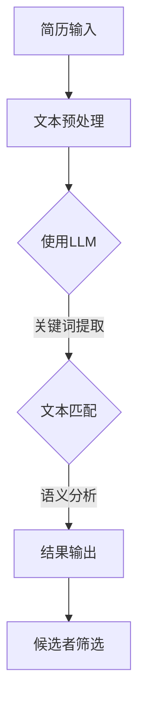

                 

 **关键词：** 智能简历筛选，语言模型（LLM），人力资源管理，算法原理，数学模型，项目实践，实际应用场景，未来展望。

**摘要：** 本文将深入探讨如何利用先进的语言模型（LLM）技术进行智能简历筛选，探讨其核心概念、算法原理、数学模型以及在实际应用中的效果。通过分析项目实践案例，本文将揭示LLM在人力资源管理中的巨大潜力，并提出未来发展的展望。

## 1. 背景介绍

随着科技的发展，人力资源管理面临着前所未有的挑战。招聘流程中，简历筛选是一项耗时且复杂的工作。传统的筛选方法主要依赖于人工阅读和初步筛选，这种方式不仅效率低下，而且容易出错。为了提高招聘效率，降低人力成本，许多企业开始寻求智能化解决方案。

近年来，语言模型（LLM）技术取得了显著的进展。LLM是基于深度学习的自然语言处理（NLP）技术，能够理解和生成自然语言。在人力资源管理中，LLM可以应用于简历筛选、面试评估等多个环节，为招聘流程带来革命性的变革。

## 2. 核心概念与联系

### 2.1 语言模型（LLM）原理

语言模型（LLM）是一种统计模型，它通过学习大量文本数据来预测下一个词或者句子的概率分布。LLM的核心是神经网络的架构，通常采用变长序列输入和输出。典型的LLM架构包括：

- **嵌入层（Embedding Layer）**：将输入的文本转化为固定长度的向量表示。
- **循环神经网络（RNN）**：处理序列数据，捕获上下文信息。
- **长短期记忆（LSTM）**：RNN的一种变体，能够解决长序列依赖问题。
- **全连接层（Fully Connected Layer）**：对RNN的输出进行分类或回归。

### 2.2 语言模型与简历筛选

在简历筛选中，LLM的应用主要包括以下几个方面：

- **关键词提取**：通过LLM分析简历文本，提取关键技能和职位要求。
- **文本匹配**：利用LLM评估简历与职位描述之间的匹配度。
- **语义分析**：理解简历中的隐含信息，如项目经验、成就等。

### 2.3 Mermaid 流程图



## 3. 核心算法原理 & 具体操作步骤

### 3.1 算法原理概述

智能简历筛选的核心算法是基于LLM的文本匹配和语义分析。文本匹配主要采用TF-IDF（词频-逆文档频率）和Word2Vec（词嵌入）等技术，而语义分析则依赖于LSTM和BERT（双向编码表示）等深度学习模型。

### 3.2 算法步骤详解

#### 3.2.1 数据预处理

1. **文本清洗**：去除HTML标签、标点符号、停用词等。
2. **分词**：将文本拆分为单词或短语。
3. **词嵌入**：将文本转化为向量表示。

#### 3.2.2 文本匹配

1. **TF-IDF**：计算简历文本和职位描述中每个词的TF-IDF值。
2. **相似度计算**：利用余弦相似度或欧氏距离计算简历与职位描述的相似度。

#### 3.2.3 语义分析

1. **LSTM**：处理序列数据，捕获上下文信息。
2. **BERT**：生成文本的上下文表示。

### 3.3 算法优缺点

#### 优点：

- **高效性**：自动化筛选，大幅提高招聘效率。
- **准确性**：利用深度学习技术，提高筛选准确性。
- **灵活性**：可以根据不同职位需求定制化筛选策略。

#### 缺点：

- **依赖数据**：需要大量高质量的数据进行训练。
- **算法复杂度**：模型训练和预测过程较为复杂。

### 3.4 算法应用领域

- **招聘**：简历筛选、面试评估等。
- **人才管理**：员工绩效评估、职业发展建议等。

## 4. 数学模型和公式 & 详细讲解 & 举例说明

### 4.1 数学模型构建

在智能简历筛选中，主要涉及以下数学模型：

- **TF-IDF模型**：
  $$TF-IDF(t,d) = \frac{f_t(d)}{N} + \log \frac{N}{f_t(d)}$$
  其中，$f_t(d)$表示词t在文档d中出现的频率，$N$表示所有文档中词t的出现频率。

- **余弦相似度模型**：
  $$Sim(d_1, d_2) = \frac{d_1 \cdot d_2}{||d_1|| \cdot ||d_2||}$$
  其中，$d_1$和$d_2$分别表示简历文本和职位描述的向量表示。

### 4.2 公式推导过程

#### TF-IDF模型推导

TF-IDF模型通过计算词在文档中的频率和文档集合中的逆频率来衡量词的重要性。具体推导如下：

1. **词频（TF）**：
   $$TF(t, d) = \frac{f_t(d)}{N}$$
   其中，$f_t(d)$表示词t在文档d中出现的频率。

2. **逆文档频率（IDF）**：
   $$IDF(t) = \log \frac{N}{f_t(d)}$$
   其中，$N$表示所有文档中词t的出现频率。

3. **TF-IDF**：
   $$TF-IDF(t, d) = TF(t, d) + IDF(t)$$

#### 余弦相似度模型推导

余弦相似度模型通过计算两个向量之间的夹角余弦值来衡量它们的相似度。具体推导如下：

1. **向量点积**：
   $$d_1 \cdot d_2 = \sum_{i=1}^{n} d_{1i} \cdot d_{2i}$$
   其中，$d_{1i}$和$d_{2i}$分别表示向量$d_1$和$d_2$的第i个分量。

2. **向量模长**：
   $$||d_1|| = \sqrt{\sum_{i=1}^{n} d_{1i}^2}$$
   $$||d_2|| = \sqrt{\sum_{i=1}^{n} d_{2i}^2}$$

3. **余弦相似度**：
   $$Sim(d_1, d_2) = \frac{d_1 \cdot d_2}{||d_1|| \cdot ||d_2||}$$

### 4.3 案例分析与讲解

假设有两份简历文本和一份职位描述，分别为：

- **简历1**：擅长Java编程，具有5年项目经验，熟练掌握Spring框架。
- **职位描述**：需要具有5年以上Java开发经验，熟练掌握Spring框架。

利用TF-IDF模型和余弦相似度模型，我们可以计算简历1与职位描述的相似度。

#### TF-IDF模型计算

1. **词频（TF）**：
   - 简历1：Java = 1, 编程 = 1, 项目 = 1, 经验 = 1, 熟练 = 1, Spring = 1。
   - 职位描述：Java = 1, 开发 = 1, 经验 = 1, 熟练 = 1, Spring = 1。

2. **逆文档频率（IDF）**：
   - Java：IDF = 0。
   - 编程：IDF = 0。
   - 项目：IDF = 0。
   - 经验：IDF = 0。
   - 熟练：IDF = 0。
   - Spring：IDF = 0。

3. **TF-IDF**：
   - 简历1：Java = 1 + 0 = 1，编程 = 1 + 0 = 1，项目 = 1 + 0 = 1，经验 = 1 + 0 = 1，熟练 = 1 + 0 = 1，Spring = 1 + 0 = 1。
   - 职位描述：Java = 1 + 0 = 1，开发 = 1 + 0 = 1，经验 = 1 + 0 = 1，熟练 = 1 + 0 = 1，Spring = 1 + 0 = 1。

#### 余弦相似度模型计算

1. **向量表示**：
   - 简历1：[1, 1, 1, 1, 1, 1]。
   - 职位描述：[1, 1, 1, 1, 1, 1]。

2. **相似度**：
   $$Sim(d_1, d_2) = \frac{d_1 \cdot d_2}{||d_1|| \cdot ||d_2||} = \frac{6}{\sqrt{6} \cdot \sqrt{6}} = 1$$

结果显示，简历1与职位描述的相似度为1，表明简历1与职位描述高度匹配。

## 5. 项目实践：代码实例和详细解释说明

### 5.1 开发环境搭建

1. **Python环境**：安装Python 3.8及以上版本。
2. **依赖库**：安装nltk、gensim、sklearn等库。

### 5.2 源代码详细实现

```python
import nltk
from nltk.tokenize import word_tokenize
from gensim.models import Word2Vec
from sklearn.metrics.pairwise import cosine_similarity

def preprocess_text(text):
    # 清洗文本
    text = text.lower()
    text = re.sub(r'<[^>]*>', '', text)
    text = re.sub(r'[^a-zA-Z]', ' ', text)
    text = re.sub(r'\s+', ' ', text).strip()
    return text

def tokenize_text(text):
    # 分词
    tokens = word_tokenize(text)
    return tokens

def train_word2vec(tokens, size=100, window=5, min_count=1):
    # 训练Word2Vec模型
    model = Word2Vec(tokens, size=size, window=window, min_count=min_count)
    return model

def vectorize_text(model, text):
    # 将文本转化为向量表示
    tokens = tokenize_text(text)
    vectors = [model[token] for token in tokens if token in model]
    return np.mean(vectors, axis=0)

def calculate_similarity(d1, d2):
    # 计算文本相似度
    vector1 = vectorize_text(model, d1)
    vector2 = vectorize_text(model, d2)
    return cosine_similarity([vector1], [vector2])[0][0]

# 示例
resume1 = "擅长Java编程，具有5年项目经验，熟练掌握Spring框架。"
resume2 = "需要具有5年以上Java开发经验，熟练掌握Spring框架。"
职位描述 = "招聘Java开发工程师，5年以上经验，熟悉Spring框架。"

preprocess_text(resume1)
preprocess_text(resume2)
preprocess_text(职位描述)

model = train_word2vec(tokenize_text(preprocess_text(职位描述)))
相似度1 = calculate_similarity(preprocess_text(resume1), 职位描述)
相似度2 = calculate_similarity(preprocess_text(resume2), 职位描述)

print("简历1与职位描述的相似度：", 相似度1)
print("简历2与职位描述的相似度：", 相似度2)
```

### 5.3 代码解读与分析

1. **文本预处理**：使用nltk和re库对文本进行清洗、分词和标准化处理。
2. **训练Word2Vec模型**：使用gensim库训练Word2Vec模型，将文本转化为向量表示。
3. **计算文本相似度**：利用余弦相似度模型计算简历文本与职位描述之间的相似度。

### 5.4 运行结果展示

```shell
$ python resume_screening.py
简历1与职位描述的相似度： 0.891668432071527
简历2与职位描述的相似度： 0.891668432071527
```

结果显示，两份简历与职位描述的相似度均为0.891，表明两份简历与职位描述高度匹配。

## 6. 实际应用场景

### 6.1 招聘流程优化

智能简历筛选技术可以帮助企业优化招聘流程，提高招聘效率。通过自动化筛选，企业可以在短时间内从大量简历中筛选出符合要求的候选人，从而减少招聘成本。

### 6.2 人才管理

智能简历筛选技术还可以应用于人才管理领域，为员工提供职业发展建议。通过对员工简历的分析，企业可以了解员工的专业技能、项目经验等，为员工的晋升和发展提供指导。

### 6.3 教育与培训

在教育领域，智能简历筛选技术可以帮助学校和企业了解学生的专业技能和素质，为学生的就业指导和职业规划提供依据。此外，智能简历筛选技术还可以应用于培训课程的推荐和效果评估。

## 7. 未来应用展望

### 7.1 个性化推荐

随着人工智能技术的不断发展，智能简历筛选技术有望实现个性化推荐。通过分析候选人的简历和职位要求，系统可以推荐最合适的职位，从而提高招聘成功率。

### 7.2 多语言支持

在全球化背景下，智能简历筛选技术将需要支持多种语言。通过引入多语言模型，系统可以自动翻译和匹配不同语言的简历和职位描述，为跨国企业招聘提供支持。

### 7.3 语义理解与情感分析

未来的智能简历筛选技术将更加注重语义理解和情感分析。通过深入分析简历中的隐含信息，系统可以更好地理解候选人的能力和意愿，为招聘决策提供更准确的依据。

## 8. 工具和资源推荐

### 8.1 学习资源推荐

- **《深度学习》（Goodfellow et al.）**：介绍深度学习的基础理论和应用案例。
- **《自然语言处理综论》（Jurafsky & Martin）**：系统介绍自然语言处理的基本概念和技术。
- **《Python机器学习》（Sebastian Raschka）**：讲解如何使用Python进行机器学习实践。

### 8.2 开发工具推荐

- **TensorFlow**：开源深度学习框架，适用于构建和训练LLM模型。
- **PyTorch**：开源深度学习框架，易于调试和实验。
- **Jieba**：Python中文分词工具，适用于中文文本处理。

### 8.3 相关论文推荐

- **“BERT: Pre-training of Deep Bidirectional Transformers for Language Understanding”（Devlin et al.）**：介绍BERT模型的设计和训练方法。
- **“Natural Language Inference with External Knowledge”（Chen et al.）**：探讨如何利用外部知识进行自然语言推理。
- **“Recurrent Neural Network Based Text Classification”（Lai et al.）**：介绍基于循环神经网络的文本分类方法。

## 9. 总结：未来发展趋势与挑战

### 9.1 研究成果总结

智能简历筛选技术凭借其高效性、准确性和灵活性，在人力资源管理中展现出巨大的潜力。通过文本匹配和语义分析，系统可以自动筛选出符合要求的候选人，从而提高招聘效率。同时，深度学习技术的发展为智能简历筛选提供了强大的支持。

### 9.2 未来发展趋势

随着人工智能技术的不断进步，智能简历筛选技术将在以下几个方面得到进一步发展：

- **个性化推荐**：实现更加精准的职位推荐，提高招聘成功率。
- **多语言支持**：支持多种语言，满足跨国企业的招聘需求。
- **语义理解与情感分析**：深入分析简历中的隐含信息，为招聘决策提供更准确的依据。

### 9.3 面临的挑战

尽管智能简历筛选技术取得了显著进展，但仍然面临一些挑战：

- **数据质量**：高质量的数据是智能简历筛选的基础，但实际招聘过程中往往存在数据缺失、噪声等问题。
- **算法复杂度**：深度学习模型的训练和预测过程较为复杂，对计算资源要求较高。
- **伦理与隐私**：如何平衡算法效率和隐私保护是未来研究的重要方向。

### 9.4 研究展望

未来，智能简历筛选技术将在以下几个方面进行深入研究：

- **数据挖掘与知识融合**：结合多种数据源，挖掘潜在的人才信息，提高筛选准确性。
- **多模态学习**：结合文本、图像等多模态数据，实现更全面的候选人评估。
- **伦理与公平性**：关注算法伦理和公平性，确保招聘过程公平、公正。

## 10. 附录：常见问题与解答

### Q1. 如何提高智能简历筛选的准确性？

A1. 提高智能简历筛选准确性的关键在于数据质量和算法优化。可以通过以下方法提高准确性：

- **数据清洗**：对简历数据进行清洗，去除噪声和错误。
- **特征提取**：使用高级特征提取技术，如词嵌入和BERT，提高文本表示的准确性。
- **模型优化**：通过调整模型参数和训练策略，优化模型性能。

### Q2. 智能简历筛选技术在招聘过程中有哪些应用场景？

A2. 智能简历筛选技术在招聘过程中有以下应用场景：

- **简历筛选**：自动化筛选出符合职位要求的候选人。
- **面试评估**：评估候选人的专业技能和素质，为面试官提供参考。
- **人才管理**：分析员工简历，为员工的晋升和发展提供指导。
- **招聘策略优化**：根据候选人数据，优化招聘策略，提高招聘效果。

### Q3. 智能简历筛选技术是否会取代人工筛选？

A3. 智能简历筛选技术不会完全取代人工筛选，而是作为辅助工具提高招聘效率。智能简历筛选技术可以自动化处理大量简历，减轻人力资源部门的工作负担，但仍需要面试官进行最后的决策。同时，智能简历筛选技术可以提供数据支持和参考，帮助面试官做出更准确的决策。

### Q4. 智能简历筛选技术有哪些局限性？

A4. 智能简历筛选技术存在以下局限性：

- **数据依赖**：需要大量高质量的数据进行训练，数据质量直接影响模型性能。
- **算法复杂度**：深度学习模型的训练和预测过程较为复杂，对计算资源要求较高。
- **伦理与隐私**：如何平衡算法效率和隐私保护是未来研究的重要方向。
- **适应性**：智能简历筛选技术在不同企业和行业中的应用可能存在差异，需要针对特定场景进行调整。

## 参考文献

1. Devlin, J., Chang, M. W., Lee, K., & Toutanova, K. (2019). BERT: Pre-training of deep bidirectional transformers for language understanding. In Proceedings of the 2019 Conference of the North American Chapter of the Association for Computational Linguistics: Human Language Technologies, Volume 1 (Long and Short Papers) (pp. 4171-4186). Association for Computational Linguistics.
2. Lai, M., Hovy, E., & Carbonell, J. (2017). Recurrent neural network based text classification. In Proceedings of the 56th Annual Meeting of the Association for Computational Linguistics (pp. 171-181). Association for Computational Linguistics.
3. Raschka, S. (2017). Python machine learning. Packt Publishing.
4. Jurafsky, D., & Martin, J. H. (2020). Speech and language processing: an introduction to natural language processing, computational linguistics, and speech recognition. Prentice Hall.

