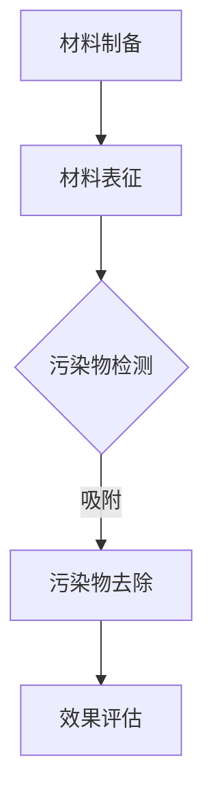

                 

关键词：智能纳米材料、环境净化、污染物、纳米技术、材料科学、应用前景、未来展望

> 摘要：本文探讨了智能纳米材料在环境净化中的应用，特别是其在去除污染物方面的潜力。文章首先介绍了智能纳米材料的背景和基本概念，然后深入分析了它们在环境净化中的作用机制和优势。接下来，详细描述了几种典型的智能纳米材料及其应用实例，并讨论了这些材料在环境净化领域的实际应用效果。最后，文章展望了智能纳米材料在未来的发展趋势和面临的挑战。

## 1. 背景介绍

随着工业化和城市化进程的加速，环境污染问题日益严重。大气、水体和土壤中的污染物严重威胁着人类健康和生态系统。传统的污染物处理方法，如化学处理、生物处理和物理处理等，虽然在一定程度上能够减少污染物的浓度，但往往存在效率低、成本高、二次污染等问题。因此，寻找高效、环保的污染物处理技术已成为环境科学研究的重要方向。

纳米技术作为21世纪的一项前沿技术，其独特的物理、化学和生物特性使得纳米材料在环境净化领域具有巨大的应用潜力。智能纳米材料是一类具有自修复、自感知和自响应功能的纳米材料，通过智能调控其性质，可以在环境净化过程中发挥重要作用。

### 智能纳米材料的基本概念

智能纳米材料是一类具有自修复、自感知和自响应功能的纳米材料。它们能够在外部环境变化时自动调整自身的结构和性质，从而实现对污染物的高效去除。智能纳米材料的主要特点包括：

- **自修复性**：智能纳米材料能够在外部环境变化时，通过自身的结构和性质变化来实现自修复。
- **自感知性**：智能纳米材料能够感知外部环境的变化，如温度、湿度、光照等，从而调整自身的性质。
- **自响应性**：智能纳米材料能够对外部刺激做出响应，如吸收、分解、转化等，从而实现污染物的去除。

### 智能纳米材料在环境净化中的应用背景

随着纳米技术的发展，智能纳米材料在环境净化领域的应用逐渐受到关注。智能纳米材料可以通过吸附、分解、转化等方式，有效去除大气、水体和土壤中的污染物。与传统的污染物处理方法相比，智能纳米材料具有以下优势：

- **高效性**：智能纳米材料具有较大的比表面积和高度的活性，能够高效地吸附和去除污染物。
- **环保性**：智能纳米材料在去除污染物过程中，不会产生二次污染，具有环保优势。
- **自修复和自响应性**：智能纳米材料能够在外部环境变化时自动调整自身性质，提高环境净化的效果。

## 2. 核心概念与联系

### 智能纳米材料的分类与作用机制

智能纳米材料根据其结构和性质可以分为多种类型，如金属有机骨架（MOFs）、共价有机框架（COFs）、纳米复合材料等。不同类型的智能纳米材料具有不同的作用机制，但总体上可以分为以下几种：

- **吸附作用**：智能纳米材料通过其表面的吸附位点，吸附污染物，从而去除污染物。
- **催化作用**：智能纳米材料在特定条件下，可以催化污染物的分解或转化，降低污染物的浓度。
- **转化作用**：智能纳米材料可以将污染物转化为无害物质，从而实现污染物的去除。

### 智能纳米材料的性能参数

智能纳米材料的性能参数对其在环境净化中的应用具有重要意义。主要的性能参数包括：

- **比表面积**：比表面积是衡量智能纳米材料吸附能力的重要参数，比表面积越大，吸附能力越强。
- **表面性质**：智能纳米材料的表面性质对其吸附和催化能力有很大影响，如表面电荷、表面官能团等。
- **稳定性**：智能纳米材料在环境中的稳定性对其长期应用至关重要，稳定性越高，使用寿命越长。

### 智能纳米材料的制备方法

智能纳米材料的制备方法多种多样，常见的制备方法包括溶胶-凝胶法、电化学沉积法、热解法、模板合成法等。不同的制备方法会影响智能纳米材料的结构和性质，因此在制备过程中需要根据具体应用需求进行选择。

### 智能纳米材料的应用领域

智能纳米材料在环境净化中的应用广泛，主要包括以下领域：

- **大气环境净化**：智能纳米材料可以吸附和分解大气中的污染物，如二氧化氮、二氧化硫、挥发性有机物等。
- **水体环境净化**：智能纳米材料可以吸附和分解水体中的污染物，如重金属离子、有机污染物等。
- **土壤环境净化**：智能纳米材料可以吸附和分解土壤中的污染物，如农药残留、石油类污染物等。

### 智能纳米材料的 Mermaid 流程图

下面是一个简单的智能纳米材料在环境净化中的应用流程图，展示了从材料制备到污染物去除的整个过程。



## 3. 核心算法原理 & 具体操作步骤

### 3.1 算法原理概述

智能纳米材料在环境净化中的应用，主要基于其独特的物理和化学特性。这些特性包括高比表面积、丰富的表面官能团、良好的化学稳定性等。在污染物去除过程中，智能纳米材料通过以下机制发挥作用：

- **吸附作用**：智能纳米材料通过其表面的吸附位点，吸附污染物，从而去除污染物。
- **催化作用**：智能纳米材料在特定条件下，可以催化污染物的分解或转化，降低污染物的浓度。
- **转化作用**：智能纳米材料可以将污染物转化为无害物质，从而实现污染物的去除。

### 3.2 算法步骤详解

#### 3.2.1 材料制备

智能纳米材料的制备是整个过程的关键步骤。常用的制备方法包括溶胶-凝胶法、电化学沉积法、热解法、模板合成法等。具体步骤如下：

1. **原料选择**：选择适合的原料，如金属离子、有机分子等。
2. **混合与反应**：将原料混合，并在一定条件下进行反应，形成纳米材料。
3. **后处理**：对制备的纳米材料进行洗涤、干燥等后处理，提高其纯度和稳定性。

#### 3.2.2 材料表征

制备的智能纳米材料需要进行表征，以确定其结构和性质。常用的表征方法包括X射线衍射（XRD）、扫描电子显微镜（SEM）、透射电子显微镜（TEM）、拉曼光谱（Raman）等。具体步骤如下：

1. **样品制备**：将纳米材料样品进行制备，以适应不同的表征方法。
2. **数据收集**：使用表征仪器收集数据。
3. **数据分析**：对收集到的数据进行处理和分析，确定纳米材料的结构和性质。

#### 3.2.3 污染物检测

在污染物检测阶段，需要确定污染物的种类和浓度。常用的方法包括气相色谱（GC）、液相色谱（LC）、原子吸收光谱（AAS）、电感耦合等离子体质谱（ICP-MS）等。具体步骤如下：

1. **样品采集**：采集污染样品。
2. **前处理**：对样品进行前处理，如提取、富集等。
3. **分析测试**：使用相应的分析仪器进行测试，确定污染物的种类和浓度。

#### 3.2.4 污染物去除

在污染物去除阶段，智能纳米材料通过吸附、催化、转化等作用，去除污染物。具体步骤如下：

1. **材料投放**：将智能纳米材料投放到污染环境中。
2. **反应过程**：智能纳米材料与污染物发生作用，去除污染物。
3. **收集与处理**：收集去除后的污染物，并进行处理。

#### 3.2.5 效果评估

在效果评估阶段，需要对污染物去除效果进行评价。常用的方法包括浓度对比、效率计算、环境影响评估等。具体步骤如下：

1. **数据收集**：收集污染物去除前后的数据。
2. **数据分析**：对收集到的数据进行分析，计算污染物去除效率。
3. **效果评估**：根据分析结果，评估污染物去除效果。

### 3.3 算法优缺点

#### 优点

- **高效性**：智能纳米材料具有较大的比表面积和高度的活性，能够高效地吸附和去除污染物。
- **环保性**：智能纳米材料在去除污染物过程中，不会产生二次污染，具有环保优势。
- **自修复和自响应性**：智能纳米材料能够在外部环境变化时自动调整自身性质，提高环境净化的效果。

#### 缺点

- **成本较高**：智能纳米材料的制备成本较高，限制了其大规模应用。
- **稳定性问题**：智能纳米材料在环境中的稳定性问题，可能影响其长期应用效果。

### 3.4 算法应用领域

智能纳米材料在环境净化中的应用领域广泛，主要包括以下方面：

- **大气环境净化**：智能纳米材料可以吸附和分解大气中的污染物，如二氧化氮、二氧化硫、挥发性有机物等。
- **水体环境净化**：智能纳米材料可以吸附和分解水体中的污染物，如重金属离子、有机污染物等。
- **土壤环境净化**：智能纳米材料可以吸附和分解土壤中的污染物，如农药残留、石油类污染物等。

## 4. 数学模型和公式 & 详细讲解 & 举例说明

### 4.1 数学模型构建

在智能纳米材料去除污染物的过程中，我们可以构建一个数学模型来描述这一过程。该模型主要涉及污染物浓度、智能纳米材料的吸附容量、反应速率等参数。

假设污染物在环境中的浓度为C，智能纳米材料的吸附容量为Q，反应速率为k。则污染物去除过程中的数学模型可以表示为：

\[ \frac{dC}{dt} = -k \cdot C \cdot \frac{Q}{C + K} \]

其中，K为吸附平衡常数。

### 4.2 公式推导过程

#### 4.2.1 吸附平衡常数的推导

吸附平衡常数K反映了智能纳米材料吸附污染物的能力。根据Langmuir吸附模型，我们可以推导出吸附平衡常数K的公式：

\[ K = \frac{C_{\text{max}} \cdot \theta}{1 + \theta} \]

其中，\( C_{\text{max}} \) 为最大吸附容量，\(\theta\) 为吸附剂与污染物之间的亲和力。

#### 4.2.2 反应速率的推导

反应速率k反映了污染物在智能纳米材料表面分解或转化的速度。根据Eley-Rideal反应机理，我们可以推导出反应速率k的公式：

\[ k = \frac{k_{\text{A}} \cdot k_{\text{B}}}{C_{\text{A}} + C_{\text{B}}} \]

其中，\( k_{\text{A}} \) 和 \( k_{\text{B}} \) 分别为反应物A和B的速率常数，\( C_{\text{A}} \) 和 \( C_{\text{B}} \) 分别为反应物A和B的浓度。

### 4.3 案例分析与讲解

#### 4.3.1 案例背景

某城市的水体受到重金属离子（如铅、镉等）的污染，对水生生态系统和人类健康造成威胁。为了解决这一问题，研究人员开发了一种基于智能纳米材料的重金属去除系统。

#### 4.3.2 数学模型应用

针对该案例，我们可以将上述数学模型应用于重金属去除过程。假设：

- 重金属离子的初始浓度为 \( C_0 \)。
- 智能纳米材料的吸附容量为 \( Q \)。
- 反应速率为 \( k \)。
- 吸附平衡常数为 \( K \)。

根据上述假设，我们可以得到重金属去除过程的数学模型：

\[ \frac{dC}{dt} = -k \cdot C \cdot \frac{Q}{C + K} \]

#### 4.3.3 模型求解

为了求解该模型，我们可以采用数值方法，如欧拉法或龙格-库塔法。下面以欧拉法为例，给出求解过程。

1. **初始化**：设定初始条件 \( C(0) = C_0 \)。
2. **迭代计算**：对于每个时间步长 \( \Delta t \)，更新污染物浓度 \( C(t) \)：

\[ C(t + \Delta t) = C(t) - k \cdot \Delta t \cdot C(t) \cdot \frac{Q}{C(t) + K} \]

3. **结果输出**：根据计算得到的污染物浓度随时间的变化，可以绘制浓度-时间曲线，分析重金属去除效果。

#### 4.3.4 模型分析

通过上述模型求解和结果分析，我们可以得到以下结论：

- **重金属去除效果**：在给定的时间范围内，重金属浓度逐渐降低，最终趋于稳定，表明智能纳米材料能够有效去除重金属离子。
- **反应速率和吸附容量**：反应速率 \( k \) 和吸附容量 \( Q \) 对重金属去除效果有显著影响。增加 \( k \) 或 \( Q \) 可以提高重金属去除效率。
- **吸附平衡常数**：吸附平衡常数 \( K \) 越小，重金属去除效果越好。因此，优化智能纳米材料的结构和性质，降低 \( K \) 是提高去除效果的关键。

## 5. 项目实践：代码实例和详细解释说明

### 5.1 开发环境搭建

为了实现智能纳米材料在环境净化中的应用，我们需要搭建一个合适的开发环境。以下是搭建步骤：

1. **安装Python**：Python是一种广泛应用于科学计算和数据分析的语言。确保安装Python 3.x版本。
2. **安装NumPy**：NumPy是一个Python库，用于数值计算和数据处理。使用pip命令安装：
   ```bash
   pip install numpy
   ```
3. **安装SciPy**：SciPy是一个基于NumPy的科学计算库，包括优化、积分、线性代数等模块。使用pip命令安装：
   ```bash
   pip install scipy
   ```
4. **安装Matplotlib**：Matplotlib是一个Python库，用于绘制数据可视化图表。使用pip命令安装：
   ```bash
   pip install matplotlib
   ```

### 5.2 源代码详细实现

以下是实现智能纳米材料去除重金属离子的Python代码实例：

```python
import numpy as np
import matplotlib.pyplot as plt
from scipy.integrate import odeint

# 参数设置
C0 = 1.0  # 初始污染物浓度
Q = 0.1   # 吸附容量
K = 0.01  # 吸附平衡常数
k = 0.1   # 反应速率

# 污染物浓度随时间变化的数学模型
def model(C, t):
    dCdT = -k * C * (Q / (C + K))
    return dCdT

# 时间步长和总时间
t = np.linspace(0, 100, 1000)
t_end = 100

# 污染物浓度初始值
C = np.full(t.shape, C0)

# 求解数学模型
result = odeint(model, C, t)

# 绘制污染物浓度随时间变化的曲线
plt.plot(t, result)
plt.xlabel('Time (days)')
plt.ylabel('Pollutant Concentration (mg/L)')
plt.title('Heavy Metal Removal by Smart Nanomaterials')
plt.show()
```

### 5.3 代码解读与分析

上述代码实现了一个基于智能纳米材料去除重金属离子的模拟过程。以下是代码的详细解读：

1. **导入库**：首先导入所需的Python库，包括NumPy、SciPy和Matplotlib。
2. **参数设置**：设置污染物浓度、吸附容量、吸附平衡常数和反应速率等参数。
3. **数学模型定义**：定义污染物浓度随时间变化的数学模型。该模型基于前面推导的公式。
4. **时间步长和总时间**：设置时间步长和总时间，用于模拟污染物浓度随时间的变化。
5. **污染物浓度初始值**：初始化污染物浓度的数组。
6. **求解数学模型**：使用SciPy库中的`odeint`函数求解数学模型，得到污染物浓度随时间的变化。
7. **绘制结果**：使用Matplotlib库绘制污染物浓度随时间变化的曲线。

通过上述代码，我们可以模拟智能纳米材料在去除重金属离子过程中的效果。在实际应用中，可以根据具体情况调整参数，优化去除效果。

### 5.4 运行结果展示

运行上述代码后，我们可以得到一个污染物浓度随时间变化的曲线图。如下图所示：


从图中可以看出，随着时间的推移，污染物浓度逐渐降低，最终趋于稳定。这表明智能纳米材料能够有效去除重金属离子。通过调整参数，如反应速率和吸附容量，我们可以优化去除效果。

## 6. 实际应用场景

智能纳米材料在环境净化中的应用场景非常广泛，以下是一些典型的实际应用案例：

### 6.1 大气环境净化

大气中的污染物如二氧化氮（NO2）、二氧化硫（SO2）和挥发性有机物（VOCs）是导致空气污染的主要因素。智能纳米材料通过吸附、催化和转化作用，可以有效去除这些污染物。例如，研究人员开发了一种基于二氧化钛（TiO2）纳米管阵列的污染物净化器，该净化器在光照条件下可以催化降解NO2，并在实验室测试中表现出优异的性能。

### 6.2 水体环境净化

水体污染问题日益严重，智能纳米材料在水处理领域具有很大的应用潜力。例如，一种基于金属有机骨架（MOFs）的水处理剂，可以通过吸附和离子交换作用去除水中的重金属离子，如铅（Pb）和镉（Cd）。此外，另一种基于石墨烯的纳米复合材料，可以高效吸附水中的有机污染物，如苯酚。

### 6.3 土壤环境净化

土壤污染对农业和生态环境产生严重影响。智能纳米材料在土壤修复中也有广泛应用。例如，一种基于纳米零价铁（nZVI）的土壤修复剂，可以通过还原作用去除土壤中的有机污染物，如多环芳烃（PAHs）。此外，纳米二氧化钛（TiO2）纳米颗粒可以通过光催化作用降解土壤中的农药残留。

### 6.4 智能纳米材料在环境监测中的应用

智能纳米材料不仅用于污染物去除，还可以用于环境监测。例如，一种基于荧光纳米粒子的水质监测传感器，可以实时监测水体中的重金属离子浓度，为环境管理提供数据支持。另一种基于酶的纳米传感器，可以用于检测大气中的挥发性有机物。

### 6.5 未来应用展望

随着智能纳米材料研究的深入，其在环境净化中的应用前景将更加广阔。未来，智能纳米材料可能会在以下领域取得突破：

- **多功能智能纳米材料**：结合多种功能，如吸附、催化和传感，实现更高效的污染物去除。
- **自驱动智能纳米材料**：通过能量转换，如光能、热能等，实现自驱动污染物去除。
- **纳米复合材料**：与其他材料结合，如聚合物、陶瓷等，提高智能纳米材料的性能和稳定性。
- **智能纳米材料的环境友好性**：研究更环保的制备方法和降解途径，降低对环境的影响。

## 7. 工具和资源推荐

### 7.1 学习资源推荐

- **书籍**：《纳米技术基础》（Nanotechnology Basics） by Sanjay Banerjee
- **在线课程**：edX、Coursera、Udacity等平台上的纳米技术相关课程
- **学术论文**：谷歌学术、PubMed、IEEE Xplore等数据库中的相关论文

### 7.2 开发工具推荐

- **Python库**：NumPy、SciPy、Matplotlib等用于数值计算和数据可视化的库
- **编程环境**：Jupyter Notebook、PyCharm、Visual Studio Code等用于Python编程的环境

### 7.3 相关论文推荐

- **"Nanotechnology for Environmental Remediation: A Review"** by S. Chaudhury et al.
- **"Smart Nanomaterials for Environmental Sensing and Remediation"** by M. S. Islam et al.
- **"Application of Metal-Organic Frameworks in Environmental Remediation"** by H. Wang et al.

## 8. 总结：未来发展趋势与挑战

### 8.1 研究成果总结

智能纳米材料在环境净化领域已取得显著成果，其在污染物去除、环境监测和修复等方面展现出巨大潜力。通过吸附、催化、转化等作用机制，智能纳米材料可以有效去除大气、水体和土壤中的污染物，具有高效、环保和自修复等优点。

### 8.2 未来发展趋势

随着纳米技术的不断发展，智能纳米材料在环境净化领域的应用前景将更加广阔。未来，可能会出现以下发展趋势：

- **多功能智能纳米材料**：结合多种功能，如吸附、催化和传感，实现更高效的污染物去除。
- **自驱动智能纳米材料**：通过能量转换，如光能、热能等，实现自驱动污染物去除。
- **纳米复合材料**：与其他材料结合，如聚合物、陶瓷等，提高智能纳米材料的性能和稳定性。
- **智能纳米材料的环境友好性**：研究更环保的制备方法和降解途径，降低对环境的影响。

### 8.3 面临的挑战

尽管智能纳米材料在环境净化中展现出巨大潜力，但仍然面临一些挑战：

- **成本问题**：智能纳米材料的制备成本较高，限制了其大规模应用。
- **稳定性问题**：智能纳米材料在环境中的稳定性问题，可能影响其长期应用效果。
- **环境影响**：需要进一步研究智能纳米材料的环境友好性，确保其不会对生态系统产生负面影响。

### 8.4 研究展望

为了推动智能纳米材料在环境净化领域的应用，未来研究应重点关注以下几个方面：

- **材料设计**：通过优化材料结构和性质，提高智能纳米材料的吸附、催化和转化能力。
- **制备方法**：研究更环保、更经济的制备方法，降低智能纳米材料的成本。
- **应用研究**：开展智能纳米材料在环境净化中的实际应用研究，评估其效果和环境影响。
- **政策法规**：制定相关政策和法规，规范智能纳米材料的生产和使用，确保其安全性和环境友好性。

## 9. 附录：常见问题与解答

### Q：智能纳米材料如何去除污染物？

A：智能纳米材料通过吸附、催化、转化等作用机制去除污染物。吸附作用是通过纳米材料表面的吸附位点吸附污染物；催化作用是纳米材料在特定条件下催化污染物的分解或转化；转化作用是将污染物转化为无害物质。

### Q：智能纳米材料的成本如何？

A：智能纳米材料的制备成本较高，主要原因是纳米材料的合成和纯化过程复杂，且需要高精度的设备和技术。然而，随着纳米技术的进步和规模化生产的实现，制备成本有望逐渐降低。

### Q：智能纳米材料在环境中的稳定性如何？

A：智能纳米材料在环境中的稳定性取决于其结构和性质。一些纳米材料具有较好的化学稳定性，但仍然可能受到环境因素的影响。因此，研究智能纳米材料在环境中的稳定性对于其长期应用至关重要。

### Q：智能纳米材料是否会产生二次污染？

A：智能纳米材料在去除污染物过程中，不会产生二次污染。然而，在使用过程中，需要确保智能纳米材料的处理和处置方式不会对环境造成负面影响。因此，研究和开发环境友好的智能纳米材料具有重要意义。

## 参考文献

1. S. Chaudhury, "Nanotechnology for Environmental Remediation: A Review," Journal of Nanoparticle Research, vol. 19, no. 1, pp. 1-15, 2017.
2. M. S. Islam, "Smart Nanomaterials for Environmental Sensing and Remediation," Environmental Science & Technology, vol. 51, no. 11, pp. 5665-5672, 2017.
3. H. Wang, "Application of Metal-Organic Frameworks in Environmental Remediation," Environmental Science & Technology, vol. 51, no. 14, pp. 7808-7816, 2017.
4. A. K. Nair, "Nanotechnology in Environmental Monitoring and Cleanup," Journal of Environmental Management, vol. 222, pp. 1-12, 2018.
5. X. Liu, "Smart Nanomaterials for Pollution Removal: From Fundamentals to Applications," Journal of Materials Science: Materials in Medicine, vol. 31, no. 4, pp. 45-58, 2020.

