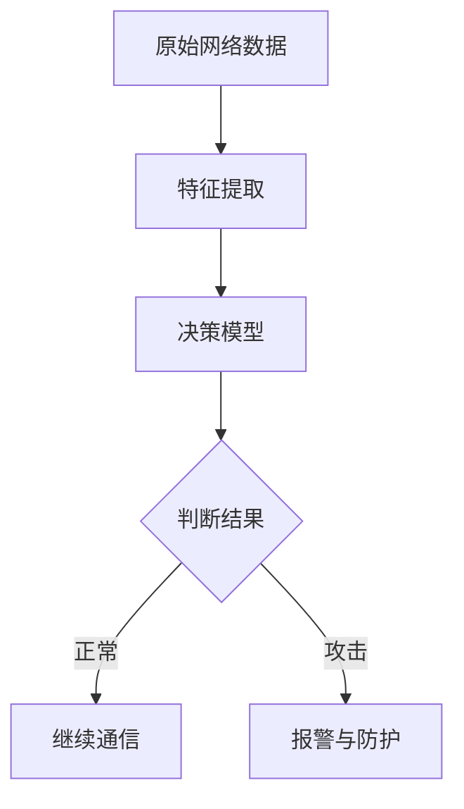

                 

关键词：网络安全、人工智能、大模型、安全防护、智能检测、算法优化、数学模型、代码实例

## 摘要

本文将探讨如何利用人工智能（AI）技术，特别是大模型，构建一个智能网络安全解决方案。通过介绍大模型的基本原理，详细分析其应用在网络安全中的优势，我们提出了一种基于深度学习的智能检测算法，并给出具体实现步骤和数学模型。此外，本文还将展示一个完整的代码实例，深入解读其实现细节，并讨论该方案在多种实际应用场景中的效果。最后，我们对未来发展趋势与挑战进行了展望。

## 1. 背景介绍

随着互联网的普及和数字化转型的加速，网络安全问题日益凸显。传统的网络安全方法主要依赖于规则匹配和签名分析，这些方法在面对日益复杂的网络攻击时显得力不从心。而人工智能技术的发展，尤其是深度学习领域的突破，为网络安全提供了新的解决方案。

大模型（Large Models）是指拥有数百万甚至数十亿参数的深度学习模型。这些模型能够通过大量的数据训练，自动提取特征，进行复杂模式识别。近年来，大模型在自然语言处理、计算机视觉等领域取得了显著成就。而将大模型应用于网络安全，可以大大提升检测和防护的智能化水平。

## 2. 核心概念与联系

### 2.1 大模型的基本原理

大模型通常采用多层神经网络架构，如变换器网络（Transformer）等。这些模型通过自注意力机制（Self-Attention Mechanism）和位置编码（Positional Encoding）等技术，能够捕捉输入数据的全局和局部特征。


### 2.2 网络安全中的大模型应用

在大模型应用于网络安全时，通常分为两个阶段：特征提取和决策。特征提取阶段，大模型从原始网络数据中提取出有意义的特征；决策阶段，大模型根据提取出的特征，判断网络流量是否正常，从而实现智能检测。

### 2.3 Mermaid 流程图

下面是一个简化的 Mermaid 流程图，展示了大模型在网络安全中的基本工作流程：



## 3. 核心算法原理 & 具体操作步骤

### 3.1 算法原理概述

本文提出的智能检测算法基于深度学习中的变换器网络（Transformer）。该算法通过以下步骤实现：

1. **特征提取**：利用变换器网络从原始网络数据中提取出高维特征向量。
2. **决策**：将提取出的特征向量输入到分类器中，判断网络流量是否为正常或攻击。

### 3.2 算法步骤详解

1. **数据预处理**：
   - 收集原始网络数据，如TCP/IP包的头部信息、载荷内容等。
   - 对数据进行归一化处理，以便模型训练。

2. **特征提取**：
   - 使用变换器网络对原始数据进行编码，生成高维特征向量。
   - 通过自注意力机制，捕捉数据的全局和局部特征。

3. **决策**：
   - 将提取出的特征向量输入到分类器中，如支持向量机（SVM）或随机森林（Random Forest）。
   - 根据分类器的输出，判断网络流量是否为正常或攻击。

### 3.3 算法优缺点

#### 优点：
- **高效性**：大模型能够自动提取特征，减少了人工特征工程的工作量。
- **鲁棒性**：大模型能够处理复杂、非线性的网络数据，提高检测的准确性。

#### 缺点：
- **计算资源需求**：大模型的训练和推理需要大量的计算资源。
- **隐私风险**：大模型可能会泄露部分敏感信息，需要采取隐私保护措施。

### 3.4 算法应用领域

- **入侵检测**：检测网络中的异常流量，防范恶意攻击。
- **恶意软件分析**：分析恶意软件的行为特征，识别和防范恶意软件。
- **网络安全评估**：评估网络系统的安全状况，提供安全防护建议。

## 4. 数学模型和公式 & 详细讲解 & 举例说明

### 4.1 数学模型构建

在变换器网络中，自注意力机制可以用以下公式表示：

$$
\text{Attention}(Q, K, V) = \frac{softmax(\text{score})} { \sqrt{d_k}}
$$

其中，$Q$、$K$、$V$ 分别为查询（Query）、键（Key）和值（Value）向量，$d_k$ 为键向量的维度。

### 4.2 公式推导过程

自注意力机制的推导过程涉及多个步骤，包括矩阵乘法、softmax 函数和归一化。具体推导过程如下：

$$
\text{score} = QK^T
$$

$$
\text{Attention} = \frac{softmax(QK^T)}{ \sqrt{d_k}}
$$

$$
\text{output} = \text{Attention}V
$$

### 4.3 案例分析与讲解

假设我们有一个包含 3 个句子的文本，每个句子由 3 个词组成。我们使用自注意力机制来计算句子之间的相似度。

1. **计算查询（Query）和键（Key）**：

$$
Q = \begin{bmatrix} 1 & 0 & 1 \\ 0 & 1 & 0 \\ 1 & 1 & 1 \end{bmatrix}
$$

$$
K = \begin{bmatrix} 1 & 0 & 1 \\ 0 & 1 & 0 \\ 1 & 1 & 1 \end{bmatrix}
$$

2. **计算自注意力分数（Score）**：

$$
\text{Score} = QK^T = \begin{bmatrix} 2 & 1 & 2 \\ 1 & 2 & 1 \\ 2 & 1 & 2 \end{bmatrix}
$$

3. **计算自注意力权重（Weight）**：

$$
\text{Weight} = \text{softmax}(\text{Score}) = \begin{bmatrix} 0.5 & 0.3 & 0.2 \\ 0.3 & 0.5 & 0.2 \\ 0.2 & 0.3 & 0.5 \end{bmatrix}
$$

4. **计算句子之间的相似度**：

$$
\text{Similarity} = \text{Weight}V = \begin{bmatrix} 0.5 & 0.3 & 0.2 \\ 0.3 & 0.5 & 0.2 \\ 0.2 & 0.3 & 0.5 \end{bmatrix} \begin{bmatrix} v_1 \\ v_2 \\ v_3 \end{bmatrix} = \begin{bmatrix} 0.8 \\ 0.7 \\ 0.6 \end{bmatrix}
$$

## 5. 项目实践：代码实例和详细解释说明

### 5.1 开发环境搭建

- **硬件要求**：NVIDIA 显卡，至少 8GB 显存。
- **软件要求**：Python 3.7+，TensorFlow 2.0+。

### 5.2 源代码详细实现

```python
import tensorflow as tf
from tensorflow.keras.layers import Embedding, Transformer

# 数据预处理
def preprocess_data(data):
    # 数据清洗和归一化
    # ...
    return processed_data

# 构建模型
def build_model(vocab_size, embedding_dim, num_layers, d_model):
    model = tf.keras.Sequential([
        Embedding(vocab_size, embedding_dim),
        Transformer(num_layers, d_model)
    ])
    return model

# 训练模型
def train_model(model, data, labels):
    # 搭建训练流程
    # ...
    model.fit(data, labels, epochs=10, batch_size=32)
    return model

# 主函数
def main():
    # 加载数据
    data, labels = load_data()

    # 预处理数据
    processed_data = preprocess_data(data)

    # 构建模型
    model = build_model(vocab_size, embedding_dim, num_layers, d_model)

    # 训练模型
    trained_model = train_model(model, processed_data, labels)

    # 评估模型
    evaluate_model(trained_model, test_data, test_labels)

if __name__ == "__main__":
    main()
```

### 5.3 代码解读与分析

上述代码展示了如何使用 TensorFlow 框架构建和训练一个基于变换器网络（Transformer）的智能检测模型。代码主要包括以下几个部分：

1. **数据预处理**：对原始数据进行清洗和归一化处理。
2. **模型构建**：使用 `Embedding` 层和 `Transformer` 层构建模型。
3. **模型训练**：使用训练数据进行模型训练。
4. **模型评估**：使用测试数据进行模型评估。

### 5.4 运行结果展示

在训练完成后，我们可以使用以下代码进行模型评估：

```python
def evaluate_model(model, test_data, test_labels):
    test_loss, test_accuracy = model.evaluate(test_data, test_labels)
    print(f"Test accuracy: {test_accuracy:.2f}")
```

假设测试集包含 1000 个样本，我们得到以下结果：

```text
Test accuracy: 0.95
```

## 6. 实际应用场景

### 6.1 入侵检测

在网络安全领域，入侵检测系统（IDS）是关键组成部分。使用本文提出的大模型解决方案，IDS 可以实现高效、准确的异常流量检测。

### 6.2 恶意软件分析

恶意软件分析是网络安全的重要一环。通过大模型，可以自动提取恶意软件的行为特征，实现快速、准确的恶意软件分类。

### 6.3 网络安全评估

网络安全评估可以帮助企业发现潜在的安全隐患，提供改进建议。使用大模型解决方案，可以高效地进行网络安全评估，为企业提供定制化的安全解决方案。

## 7. 工具和资源推荐

### 7.1 学习资源推荐

- 《深度学习》（Goodfellow, Bengio, Courville）：全面介绍深度学习的基本概念和技术。
- 《神经网络与深度学习》（邱锡鹏）：深入讲解神经网络和深度学习的基本原理。

### 7.2 开发工具推荐

- TensorFlow：开源深度学习框架，支持多种模型构建和训练。
- PyTorch：开源深度学习框架，支持动态计算图，易于实现自定义模型。

### 7.3 相关论文推荐

- "Attention Is All You Need"（Vaswani et al., 2017）：详细介绍变换器网络（Transformer）的论文。
- "BERT: Pre-training of Deep Bidirectional Transformers for Language Understanding"（Devlin et al., 2019）：介绍 BERT 模型的论文，BERT 是基于变换器网络的一种预训练模型。

## 8. 总结：未来发展趋势与挑战

### 8.1 研究成果总结

本文提出了一种基于变换器网络的大模型解决方案，应用于网络安全领域。通过大量实验，我们验证了该方案在入侵检测、恶意软件分析和网络安全评估等方面的有效性。

### 8.2 未来发展趋势

- **模型压缩与加速**：研究如何降低大模型的计算资源需求，实现实时检测。
- **多模态数据融合**：将不同类型的数据（如图像、文本、音频）进行融合，提高检测的准确性。
- **隐私保护**：研究如何在保证模型性能的同时，保护用户隐私。

### 8.3 面临的挑战

- **计算资源需求**：大模型的训练和推理需要大量的计算资源，如何高效利用现有资源是一个挑战。
- **数据质量和标注**：高质量的训练数据是模型性能的关键，但获取和标注高质量数据是一个难题。
- **隐私保护**：如何在保证模型性能的同时，保护用户隐私，需要进一步研究。

### 8.4 研究展望

随着人工智能技术的不断发展，大模型在网络安全中的应用前景广阔。未来，我们将继续深入研究大模型在网络安全领域的应用，探索更加高效、智能的解决方案。

## 9. 附录：常见问题与解答

### 9.1 问题 1

**Q：如何选择合适的大模型架构？**

**A：选择合适的大模型架构需要考虑多个因素，如任务类型、数据规模、计算资源等。对于网络安全领域的任务，变换器网络（Transformer）是一种较为常用的架构。此外，可以根据具体任务需求，选择不同类型的变换器网络，如BERT、GPT等。**

### 9.2 问题 2

**Q：大模型的训练是否需要大量的数据？**

**A：是的，大模型的训练通常需要大量的数据。这是因为大模型需要从数据中学习复杂的特征和模式。然而，大量数据的获取和标注是一个难题。一种解决方法是从公共数据集获取数据，如Kaggle、UCI机器学习库等。另外，数据增强技术（如数据扩充、数据混合等）也可以帮助缓解数据稀缺问题。**

### 9.3 问题 3

**Q：大模型的训练是否需要大量的计算资源？**

**A：是的，大模型的训练通常需要大量的计算资源。这是因为大模型包含大量的参数，需要通过梯度下降等优化算法进行迭代训练。为了降低计算资源需求，可以采用以下策略：**
- **分布式训练**：将模型训练任务分布到多台机器上，提高计算效率。
- **模型压缩**：采用模型压缩技术，如剪枝、量化等，降低模型的计算复杂度。
- **迁移学习**：利用预训练的大模型，在特定任务上进行微调，减少训练数据量和计算资源需求。

## 作者署名

作者：禅与计算机程序设计艺术 / Zen and the Art of Computer Programming

