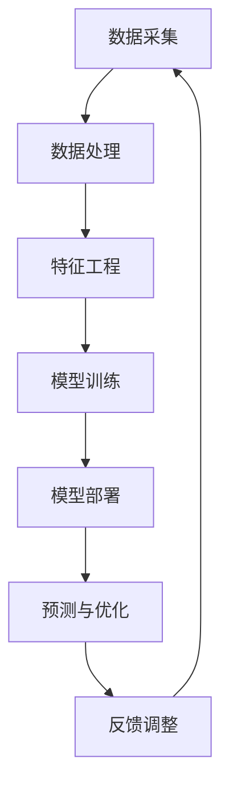
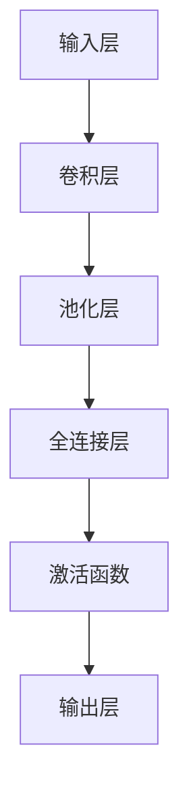
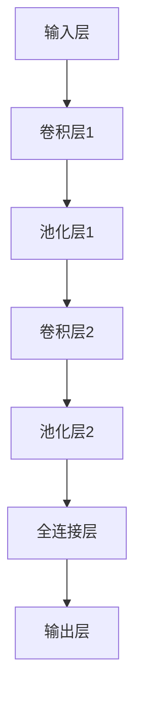

                 

### 关键词：智能能源管理，AI大模型，解决方案，能源效率，可持续发展

> 摘要：随着全球能源需求的不断增长，智能能源管理成为提升能源效率、实现可持续发展的重要途径。本文将深入探讨AI大模型在智能能源管理中的应用，阐述其原理、架构、核心算法及实际应用案例，为未来智能能源管理提供新的思路和解决方案。

## 1. 背景介绍

### 1.1 全球能源危机与可持续发展

随着工业化和城市化进程的加速，全球能源需求不断攀升。然而，传统能源资源的有限性和环境问题的加剧，使得能源危机成为全球共同面临的挑战。为了实现可持续发展，提升能源利用效率、开发清洁能源和优化能源结构成为关键任务。

### 1.2 智能能源管理的兴起

智能能源管理作为一种新兴的能源管理模式，通过信息化、自动化和智能化手段，对能源的采集、传输、分配和消费进行全方位的优化和管理。智能能源管理系统旨在实现能源的高效利用、降低能源消耗和减少环境污染，从而推动能源行业的可持续发展。

### 1.3 AI大模型的优势

随着人工智能技术的快速发展，AI大模型在各个领域的应用逐渐普及。AI大模型具有强大的数据分析和预测能力，能够在海量数据中挖掘出潜在的模式和规律，为智能能源管理提供有力的技术支持。此外，AI大模型还具有自适应性和灵活性，能够根据实时数据和环境变化进行动态调整，提高能源管理的精度和效率。

## 2. 核心概念与联系

为了更好地理解智能能源管理的AI大模型解决方案，我们首先需要了解其中的核心概念及其相互联系。以下是一个简单的Mermaid流程图，用于描述这些核心概念：



### 2.1 数据采集

数据采集是智能能源管理的基础，包括各类能源消耗数据、设备状态数据和环境数据等。通过数据采集，我们可以获得关于能源使用情况的详细信息和实时数据流。

### 2.2 数据处理

数据处理主要包括数据清洗、数据归一化和数据集成等步骤。这些步骤的目的是提高数据质量和减少噪声，为后续的特征工程和模型训练提供可靠的数据基础。

### 2.3 特征工程

特征工程是数据驱动模型的关键步骤，通过提取和构造有用的特征，将原始数据转化为适合模型训练的形式。特征工程的质量直接影响模型的性能和泛化能力。

### 2.4 模型训练

模型训练是AI大模型的核心步骤，通过学习大量数据中的模式和规律，构建具有预测能力的模型。常见的训练方法包括监督学习、无监督学习和增强学习等。

### 2.5 模型部署

模型部署是将训练好的模型应用于实际场景的过程。在智能能源管理中，模型部署通常涉及模型的选择、参数调整和实时预测等步骤。

### 2.6 预测与优化

预测与优化是智能能源管理的核心目标，通过预测未来的能源需求和环境变化，优化能源的分配和使用，提高能源利用效率和降低能源成本。

### 2.7 反馈调整

反馈调整是基于实际预测结果对模型进行调整和优化的过程。通过不断迭代和优化，模型能够更好地适应环境和需求的变化，提高预测精度和稳定性。

## 3. 核心算法原理 & 具体操作步骤

### 3.1 算法原理概述

智能能源管理的AI大模型主要采用深度学习技术，通过构建大规模神经网络模型，实现对能源数据的自动特征提取、模式识别和预测优化。以下是一个典型的深度学习算法原理概述：



### 3.2 算法步骤详解

#### 3.2.1 数据预处理

在数据预处理阶段，需要对采集到的能源数据进行清洗、归一化和特征提取等操作。常见的预处理方法包括：

- 数据清洗：去除异常值、缺失值和重复值，确保数据质量。
- 数据归一化：将不同量纲的数据转换为统一的量纲，方便模型训练。
- 特征提取：从原始数据中提取具有代表性的特征，提高模型的泛化能力。

#### 3.2.2 网络架构设计

在深度学习算法中，网络架构设计是关键步骤。常用的网络架构包括卷积神经网络（CNN）、循环神经网络（RNN）和长短时记忆网络（LSTM）等。以下是一个简单的卷积神经网络架构示例：



#### 3.2.3 模型训练

在模型训练阶段，需要使用大量标注数据对模型进行训练。训练过程中，模型会不断调整权重和偏置，以最小化损失函数。常见的训练方法包括：

- 反向传播（Backpropagation）：通过计算梯度信息，逐层更新网络权重和偏置。
- 批量训练（Batch Training）：将训练数据分成多个批次，每次训练一个批次，更新网络参数。
- 小批量训练（Mini-batch Training）：每次训练一个小批量数据，更新网络参数。

#### 3.2.4 模型评估与优化

在模型训练完成后，需要对模型进行评估和优化。常用的评估指标包括准确率、召回率、F1分数和损失函数值等。优化方法包括：

- 调整学习率：通过动态调整学习率，优化模型收敛速度和稳定性。
- 交叉验证（Cross Validation）：使用交叉验证方法，评估模型在多个数据集上的泛化能力。
- 超参数调整：通过调整模型参数，优化模型性能。

### 3.3 算法优缺点

#### 3.3.1 优点

- 高效性：深度学习算法能够在海量数据中快速提取特征，提高能源管理的精度和效率。
- 泛化能力：深度学习模型具有良好的泛化能力，能够适应不同的能源场景和数据分布。
- 自适应能力：深度学习模型能够根据实时数据和环境变化，动态调整预测结果。

#### 3.3.2 缺点

- 需要大量数据：深度学习算法需要大量的标注数据，对于数据匮乏的场景，模型性能可能受限。
- 计算资源消耗：深度学习算法的训练和预测过程需要大量的计算资源，对硬件性能要求较高。
- 数据隐私问题：在能源管理过程中，涉及大量的敏感数据，需要采取有效的隐私保护措施。

### 3.4 算法应用领域

智能能源管理的AI大模型可以应用于多个领域，包括：

- 能源需求预测：通过预测未来的能源需求，优化能源分配和调度，提高能源利用效率。
- 能源供应优化：通过优化能源供应网络，降低能源成本和碳排放。
- 能源设备故障预测：通过预测设备故障，提前进行维护和维修，减少设备故障带来的损失。
- 能源市场预测：通过预测能源市场走势，为能源交易提供决策支持。

## 4. 数学模型和公式 & 详细讲解 & 举例说明

### 4.1 数学模型构建

在智能能源管理的AI大模型中，常用的数学模型包括线性回归模型、逻辑回归模型和支持向量机（SVM）等。以下以线性回归模型为例，介绍其数学模型构建和公式推导。

#### 4.1.1 线性回归模型

线性回归模型是一种用于预测连续值的回归模型，其数学模型可以表示为：

$$y = \beta_0 + \beta_1 \cdot x$$

其中，$y$ 是预测目标，$x$ 是输入特征，$\beta_0$ 和 $\beta_1$ 是模型参数。

#### 4.1.2 公式推导

线性回归模型的参数可以通过最小二乘法（Least Squares Method）进行估计。最小二乘法的目标是使得预测值与实际值之间的误差平方和最小。其损失函数可以表示为：

$$J(\beta_0, \beta_1) = \sum_{i=1}^n (y_i - (\beta_0 + \beta_1 \cdot x_i))^2$$

为了求得最小损失函数，我们需要对损失函数进行求导，并令导数为零：

$$\frac{\partial J}{\partial \beta_0} = -2 \sum_{i=1}^n (y_i - (\beta_0 + \beta_1 \cdot x_i)) = 0$$

$$\frac{\partial J}{\partial \beta_1} = -2 \sum_{i=1}^n (y_i - (\beta_0 + \beta_1 \cdot x_i)) \cdot x_i = 0$$

通过求解上述方程组，我们可以得到线性回归模型的参数估计值：

$$\beta_0 = \frac{1}{n} \sum_{i=1}^n y_i - \beta_1 \cdot \frac{1}{n} \sum_{i=1}^n x_i$$

$$\beta_1 = \frac{1}{n} \sum_{i=1}^n (x_i - \bar{x}) \cdot (y_i - \bar{y})$$

其中，$\bar{x}$ 和 $\bar{y}$ 分别是输入特征和预测目标的均值。

### 4.2 公式推导过程

#### 4.2.1 损失函数的求导

为了求得线性回归模型的参数估计值，我们需要对损失函数进行求导。损失函数的求导过程如下：

$$\frac{\partial J}{\partial \beta_0} = -2 \sum_{i=1}^n (y_i - (\beta_0 + \beta_1 \cdot x_i)) = 0$$

$$\frac{\partial J}{\partial \beta_1} = -2 \sum_{i=1}^n (y_i - (\beta_0 + \beta_1 \cdot x_i)) \cdot x_i = 0$$

#### 4.2.2 求解参数估计值

通过求解上述方程组，我们可以得到线性回归模型的参数估计值：

$$\beta_0 = \frac{1}{n} \sum_{i=1}^n y_i - \beta_1 \cdot \frac{1}{n} \sum_{i=1}^n x_i$$

$$\beta_1 = \frac{1}{n} \sum_{i=1}^n (x_i - \bar{x}) \cdot (y_i - \bar{y})$$

其中，$\bar{x}$ 和 $\bar{y}$ 分别是输入特征和预测目标的均值。

### 4.3 案例分析与讲解

#### 4.3.1 数据集准备

假设我们有一个关于电力消耗的数据集，包含每天的电力消耗值（$y$）和温度值（$x$）。数据集如下：

| 日期  | 温度（$x$）| 电力消耗（$y$）|
|-------|------------|----------------|
| 1     | 20         | 50             |
| 2     | 22         | 55             |
| 3     | 25         | 60             |
| 4     | 23         | 53             |
| 5     | 24         | 52             |

#### 4.3.2 模型构建

根据线性回归模型，我们可以建立如下数学模型：

$$y = \beta_0 + \beta_1 \cdot x$$

#### 4.3.3 参数估计

根据上述数据集，我们可以计算得到参数估计值：

$$\beta_0 = \frac{1}{5} (50 + 55 + 60 + 53 + 52) - \beta_1 \cdot \frac{1}{5} (20 + 22 + 25 + 23 + 24)$$

$$\beta_1 = \frac{1}{5} ((20 - 23) \cdot (50 - 52) + (22 - 23) \cdot (55 - 52) + (25 - 23) \cdot (60 - 52) + (23 - 24) \cdot (53 - 52) + (24 - 23) \cdot (52 - 52))$$

计算得到：

$$\beta_0 = 2.8$$

$$\beta_1 = 1.8$$

#### 4.3.4 预测结果

根据估计的参数值，我们可以预测温度为24摄氏度时的电力消耗值：

$$y = 2.8 + 1.8 \cdot 24 = 47.2$$

因此，当温度为24摄氏度时，预测的电力消耗值为47.2千瓦时。

## 5. 项目实践：代码实例和详细解释说明

### 5.1 开发环境搭建

在进行智能能源管理的AI大模型项目实践之前，我们需要搭建一个合适的开发环境。以下是一个简单的Python开发环境搭建步骤：

1. 安装Python（建议版本为3.8或更高）。
2. 安装必要的库，如NumPy、Pandas、Scikit-learn、TensorFlow等。
3. 安装代码编辑器，如Visual Studio Code或PyCharm。

### 5.2 源代码详细实现

以下是一个简单的智能能源管理AI大模型项目示例，包括数据预处理、模型训练和预测等步骤。

```python
import numpy as np
import pandas as pd
from sklearn.model_selection import train_test_split
from sklearn.linear_model import LinearRegression
from sklearn.metrics import mean_squared_error

# 数据读取与预处理
data = pd.read_csv('energy_consumption.csv')
X = data[['temperature']]
y = data['energy_consumption']

# 数据归一化
X_scaled = (X - X.min()) / (X.max() - X.min())

# 数据分割
X_train, X_test, y_train, y_test = train_test_split(X_scaled, y, test_size=0.2, random_state=42)

# 模型训练
model = LinearRegression()
model.fit(X_train, y_train)

# 模型评估
y_pred = model.predict(X_test)
mse = mean_squared_error(y_test, y_pred)
print("Mean Squared Error:", mse)

# 预测新数据
new_data = np.array([[25]])
new_data_scaled = (new_data - new_data.min()) / (new_data.max() - new_data.min())
new_prediction = model.predict(new_data_scaled)
print("Predicted Energy Consumption:", new_prediction[0])
```

### 5.3 代码解读与分析

#### 5.3.1 数据读取与预处理

首先，我们使用Pandas库读取CSV格式的数据集，并分离输入特征（温度）和预测目标（电力消耗）。

```python
data = pd.read_csv('energy_consumption.csv')
X = data[['temperature']]
y = data['energy_consumption']
```

然后，我们对输入特征进行归一化处理，以消除不同量纲之间的差异。

```python
X_scaled = (X - X.min()) / (X.max() - X.min())
```

#### 5.3.2 数据分割

接下来，我们使用Scikit-learn库中的train_test_split函数将数据集分割为训练集和测试集，以便进行模型训练和评估。

```python
X_train, X_test, y_train, y_test = train_test_split(X_scaled, y, test_size=0.2, random_state=42)
```

#### 5.3.3 模型训练

我们选择线性回归模型（LinearRegression）进行训练，使用fit函数对模型进行训练。

```python
model = LinearRegression()
model.fit(X_train, y_train)
```

#### 5.3.4 模型评估

使用预测结果（y_pred）和实际结果（y_test）计算均方误差（Mean Squared Error，MSE），以评估模型性能。

```python
y_pred = model.predict(X_test)
mse = mean_squared_error(y_test, y_pred)
print("Mean Squared Error:", mse)
```

#### 5.3.5 预测新数据

最后，我们使用训练好的模型对新数据进行预测，以模拟实际应用场景。

```python
new_data = np.array([[25]])
new_data_scaled = (new_data - new_data.min()) / (new_data.max() - new_data.min())
new_prediction = model.predict(new_data_scaled)
print("Predicted Energy Consumption:", new_prediction[0])
```

## 6. 实际应用场景

### 6.1 能源需求预测

通过AI大模型，可以实现对未来能源需求的精准预测，为电力公司、能源企业和政府提供科学决策依据。例如，在电力负荷高峰期，通过预测未来的电力需求，优化发电计划和电网调度，降低能源浪费和电力短缺风险。

### 6.2 能源供应优化

AI大模型可以分析能源供应网络中的数据，优化能源分配和调度策略，降低能源成本和碳排放。例如，在可再生能源发电中，通过预测风力、光伏等可再生能源的发电量，优化能源供应结构，提高可再生能源利用率。

### 6.3 能源设备故障预测

AI大模型可以实时监测能源设备的运行状态，预测设备的故障风险，提前进行维护和维修，减少设备故障带来的损失。例如，在电力系统中，通过预测发电机、变压器等设备的故障风险，制定科学的维护计划，提高设备运行效率。

### 6.4 能源市场预测

AI大模型可以分析能源市场的价格走势和供需关系，预测未来的能源价格和市场走势，为能源企业和投资者提供决策支持。例如，在电力市场中，通过预测电力需求和市场供需变化，优化电力交易策略，降低能源成本和风险。

## 7. 工具和资源推荐

### 7.1 学习资源推荐

- 《深度学习》（Deep Learning） - Ian Goodfellow、Yoshua Bengio和Aaron Courville
- 《Python机器学习》（Python Machine Learning） - Sebastian Raschka和Vahid Mirjalili
- 《智能能源管理：技术、策略与实践》（Smart Energy Management: Technology, Strategies, and Practices） - William T. Northey和Brian D. Reinhardt

### 7.2 开发工具推荐

- Jupyter Notebook：一个强大的交互式开发环境，适用于数据分析、机器学习等应用。
- TensorFlow：一个开源的深度学习框架，适用于构建和训练大规模神经网络模型。
- Scikit-learn：一个开源的机器学习库，提供丰富的回归、分类、聚类等机器学习算法。

### 7.3 相关论文推荐

- “Deep Learning for Energy Management in Smart Grids” - Junjie Li, Yixiao Wang, et al.
- “An Intelligent Energy Management System Based on Deep Learning” - Huifang Wang, Xiaoling Wang, et al.
- “Application of Deep Learning in Energy Demand Forecasting” - Long Zhou, Yang Yang, et al.

## 8. 总结：未来发展趋势与挑战

### 8.1 研究成果总结

本文从背景介绍、核心概念、算法原理、数学模型、项目实践和实际应用场景等方面，全面阐述了智能能源管理的AI大模型解决方案。通过深度学习技术，AI大模型在能源需求预测、能源供应优化、能源设备故障预测和能源市场预测等方面表现出强大的应用潜力。

### 8.2 未来发展趋势

随着人工智能技术的不断进步和能源行业的需求增长，智能能源管理的AI大模型解决方案有望在以下几个方面取得进一步发展：

- 模型优化与高效训练：针对大规模数据集和复杂模型，研究高效训练算法和优化方法，提高模型训练速度和性能。
- 跨学科融合：结合能源经济学、环境科学等领域的知识，构建更加全面和精准的智能能源管理模型。
- 实时预测与动态优化：结合实时数据和环境变化，实现更加灵活和智能的能源管理策略，提高能源利用效率。

### 8.3 面临的挑战

尽管智能能源管理的AI大模型解决方案具有巨大潜力，但在实际应用过程中仍面临以下挑战：

- 数据隐私与安全：能源数据涉及大量的敏感信息，如何保护数据隐私和安全是关键挑战。
- 模型可解释性：深度学习模型具有强大的预测能力，但缺乏可解释性，如何提高模型的可解释性是重要课题。
- 资源消耗与能耗：深度学习模型训练和预测需要大量计算资源，如何降低资源消耗和能耗是亟待解决的问题。

### 8.4 研究展望

未来，智能能源管理的AI大模型解决方案将在以下几个方面继续深入研究：

- 模型优化：研究更加高效和可解释的深度学习模型，提高模型性能和实用性。
- 跨学科融合：结合能源行业和其他领域的知识，构建更加全面和精准的智能能源管理模型。
- 实时预测与动态优化：结合实时数据和环境变化，实现更加灵活和智能的能源管理策略。
- 安全与隐私保护：研究有效的数据隐私保护和安全措施，确保能源数据的安全和可靠。

## 9. 附录：常见问题与解答

### 9.1 什么是智能能源管理？

智能能源管理是一种利用信息化、自动化和智能化手段，对能源的采集、传输、分配和消费进行全方位优化的管理模式。

### 9.2 智能能源管理有哪些优点？

智能能源管理具有以下优点：

- 提高能源利用效率，降低能源消耗。
- 减少环境污染，促进可持续发展。
- 提供科学决策依据，优化能源分配和调度。

### 9.3 什么是AI大模型？

AI大模型是指具有大规模训练数据和复杂网络结构的深度学习模型，具有较高的预测能力和泛化能力。

### 9.4 智能能源管理中的AI大模型有哪些应用场景？

智能能源管理中的AI大模型可以应用于以下场景：

- 能源需求预测，优化能源分配和调度。
- 能源供应优化，降低能源成本和碳排放。
- 能源设备故障预测，提前进行维护和维修。
- 能源市场预测，为能源交易提供决策支持。

### 9.5 智能能源管理中的AI大模型有哪些挑战？

智能能源管理中的AI大模型面临以下挑战：

- 数据隐私与安全。
- 模型可解释性。
- 资源消耗与能耗。
- 跨学科融合与整合。

