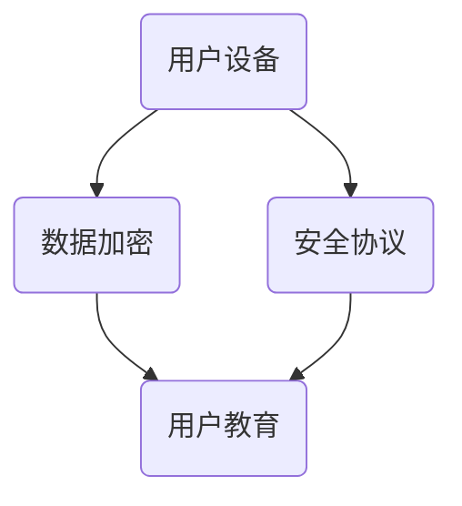

                 

在这个数字化时代，智能设备已经深入我们的日常生活，从智能手机到智能家居，从可穿戴设备到智能医疗设备，这些设备不断收集和存储我们的个人信息。然而，随着信息技术的迅猛发展，个人隐私泄露的风险也随之增加。本文将探讨智能设备隐私保护措施，特别是如何安全地处理个人信息，以保护用户的隐私和安全。

## 关键词

- 智能设备
- 隐私保护
- 个人信息
- 安全处理
- 数据加密
- 安全协议
- 用户教育

## 摘要

本文旨在分析智能设备在处理个人信息过程中面临的隐私保护挑战，并提出一系列有效的措施。我们将讨论数据加密、安全协议、用户教育等关键技术，并探讨如何通过技术手段和用户意识提升来加强智能设备的隐私保护。

### 1. 背景介绍

智能设备的普及为我们带来了前所未有的便利，但同时也带来了隐私保护的新挑战。这些设备可以收集大量的个人信息，如地理位置、通讯记录、浏览历史等。如果这些信息被不当处理或泄露，可能会对用户的生活和财产造成严重影响。因此，智能设备的隐私保护已成为一个亟待解决的问题。

#### 1.1 智能设备的隐私风险

智能设备在处理个人信息时可能面临以下风险：

1. 数据泄露：由于安全措施不足，个人信息可能被未经授权的第三方获取。
2. 恶意软件：恶意软件可以通过智能设备获取个人信息，甚至控制设备。
3. 社交工程：通过欺骗用户泄露个人信息，如钓鱼邮件、诈骗电话等。
4. 数据滥用：服务商可能利用用户数据进行分析和营销。

#### 1.2 隐私保护的重要性

隐私保护不仅关乎用户的个人利益，也关乎社会的整体安全。有效的隐私保护措施可以：

1. 保护用户隐私，增强用户信任。
2. 避免数据滥用，减少潜在的隐私泄露风险。
3. 促进智能设备的健康发展，推动数字经济。

### 2. 核心概念与联系

要有效地保护智能设备的隐私，我们需要理解以下几个核心概念：

#### 2.1 数据加密

数据加密是保护个人信息的基本手段。通过加密，可以将原始数据转换为只有授权用户才能解密的格式，从而防止未授权访问。

#### 2.2 安全协议

安全协议是确保数据传输过程中安全性的关键。如HTTPS、TLS等协议可以加密数据传输，防止中间人攻击和数据篡改。

#### 2.3 用户教育

用户教育是隐私保护的重要组成部分。通过提高用户对隐私保护的认识，可以减少因无知或疏忽导致的隐私泄露。

#### 2.4 Mermaid 流程图

下面是一个简化的Mermaid流程图，展示了智能设备隐私保护的核心概念和它们之间的联系：



### 3. 核心算法原理 & 具体操作步骤

#### 3.1 算法原理概述

智能设备隐私保护的核心算法主要包括数据加密、安全协议和用户教育三个方面。以下将分别详细介绍每个方面的原理和操作步骤。

#### 3.2 算法步骤详解

##### 3.2.1 数据加密

1. 数据加密算法选择：根据数据的敏感程度选择合适的加密算法，如AES、RSA等。
2. 数据加密过程：将原始数据使用加密算法转换为密文。
3. 密钥管理：确保加密密钥的安全存储和传输。

##### 3.2.2 安全协议

1. 协议选择：选择适合应用场景的安全协议，如HTTPS、TLS等。
2. 配置和部署：在智能设备中配置和部署安全协议。
3. 数据传输：使用安全协议加密数据传输，确保数据在传输过程中的安全性。

##### 3.2.3 用户教育

1. 隐私保护意识教育：向用户宣传隐私保护的重要性，提高用户的安全意识。
2. 操作指南：提供详细的操作指南，帮助用户正确使用智能设备。
3. 反诈骗教育：教育用户识别和防范常见的诈骗手段。

#### 3.3 算法优缺点

##### 3.3.1 数据加密

优点：能够有效保护数据的安全性，防止未授权访问。

缺点：加密和解密过程可能增加计算和传输开销。

##### 3.3.2 安全协议

优点：能够确保数据传输过程中的安全性，防止中间人攻击和数据篡改。

缺点：需要消耗额外的网络带宽和计算资源。

##### 3.3.3 用户教育

优点：提高用户的安全意识和操作水平，减少隐私泄露风险。

缺点：需要时间和资源进行教育和宣传。

#### 3.4 算法应用领域

数据加密、安全协议和用户教育可以应用于智能设备的各个方面，如：

1. 数据存储：保护存储在设备中的个人信息。
2. 数据传输：确保数据在传输过程中的安全性。
3. 用户操作：提供安全、可靠的交互体验。

### 4. 数学模型和公式 & 详细讲解 & 举例说明

#### 4.1 数学模型构建

为了更好地理解数据加密和安全协议的工作原理，我们可以构建一些数学模型。以下是一个简单的例子：

##### 4.1.1 数据加密模型

假设我们使用AES加密算法，输入明文\(m\)，密钥\(k\)，输出密文\(c\)。AES加密过程可以表示为：

\[ c = E_k(m) \]

其中，\(E_k\)表示AES加密函数。

##### 4.1.2 安全协议模型

假设我们使用TLS协议进行数据传输。TLS协议的工作原理可以简化为：

\[ c = E_{k_1}(m) \]
\[ m' = D_{k_2}(c) \]

其中，\(E_{k_1}\)表示TLS加密函数，\(D_{k_2}\)表示TLS解密函数，\(k_1\)和\(k_2\)分别是加密和解密密钥。

#### 4.2 公式推导过程

以下是对AES加密算法的推导：

1. **初始化**：
   - 将明文\(m\)分为多个块。
   - 初始化密钥轮数。

2. **加密过程**：
   - **初始轮**：将明文块与初始密钥进行异或操作。
   - **循环轮**：对于每一轮，执行以下步骤：
     - **子字节变换**：对每个字节进行固定的非线性变换。
     - **行移位**：将字节块中的每一行循环左移一定位数。
     - **列混淆**：对字节块中的每一列进行固定的非线性变换。
     - **密钥加**：将密钥轮与字节块进行异或操作。

3. **输出**：
   - 将加密后的块输出为密文。

#### 4.3 案例分析与讲解

##### 4.3.1 数据加密案例

假设我们有一个简单的明文“HELLO”，使用AES加密算法，密钥为“1234567890123456”。

1. **初始化**：
   - 明文块：HELLO（8字节）
   - 初始密钥轮：\(k_0 = 1234567890123456\)

2. **加密过程**：
   - **初始轮**：\(c_0 = k_0 \oplus m = 1234567890123456 \oplus 48656C6C6F = 4279BC813C4A4B1B\)
   - **第一轮**：
     - 子字节变换：4279BC813C4A4B1B → 8D0F9F3C5A6F7E2C
     - 行移位：8D0F9F3C5A6F7E2C（第一行循环左移1位，第二行循环左移2位，第三行循环左移3位）
     - 列混淆：8D0F9F3C5A6F7E2C（每一列进行固定的非线性变换）
     - 密钥加：8D0F9F3C5A6F7E2C（第一轮密钥轮）
   - **第二轮**：重复上述过程，直到最后一轮。

3. **输出**：
   - 密文：最后输出的结果为加密后的明文。

##### 4.3.2 安全协议案例

假设我们使用TLS协议进行数据传输，客户端发送明文“HELLO”给服务器。

1. **初始握手**：
   - 客户端生成随机数\(r_1\)，发送给服务器。
   - 服务器生成随机数\(r_2\)，发送给客户端。
   - 客户端和服务器使用这两个随机数生成会话密钥。

2. **加密传输**：
   - 客户端发送加密后的明文给服务器：\(c = E_{k_1}(m) = E_{k_1}(\text{HELLO})\)。
   - 服务器接收密文，使用会话密钥解密：\(m' = D_{k_2}(c) = D_{k_2}(E_{k_1}(\text{HELLO})) = \text{HELLO}\)。

### 5. 项目实践：代码实例和详细解释说明

#### 5.1 开发环境搭建

1. 安装Python环境。
2. 安装必要的库，如PyCryptoDome、ssl等。

#### 5.2 源代码详细实现

```python
from Crypto.Cipher import AES
from Crypto.Random import get_random_bytes
import ssl

# 数据加密
def encrypt_data(data, key):
    cipher = AES.new(key, AES.MODE_CBC)
    ct_bytes = cipher.encrypt(pad(data.encode('utf-8')))
    iv = cipher.iv
    return iv + ct_bytes

# 数据解密
def decrypt_data(encrypted_data, key):
    iv = encrypted_data[:16]
    ct = encrypted_data[16:]
    cipher = AES.new(key, AES.MODE_CBC, iv)
    pt = cipher.decrypt(ct).decode('utf-8')
    return pt

# 安全协议
def secure_connection(host, port):
    context = ssl._create_unverified_context()
    with socket.create_connection((host, port)) as sock:
        with context.wrap_socket(sock, server_hostname=host) as ssock:
            print(ssock.version())
            print(ssock.cipher())
            print(ssock.getpeercert())
            ssock.sendall(b'Hello, World!')

# 测试
key = get_random_bytes(16)
data = 'HELLO'
encrypted_data = encrypt_data(data, key)
print('Encrypted data:', encrypted_data)
decrypted_data = decrypt_data(encrypted_data, key)
print('Decrypted data:', decrypted_data)
secure_connection('example.com', 443)
```

#### 5.3 代码解读与分析

1. **数据加密**：使用PyCryptoDome库实现AES加密和解密。
2. **安全协议**：使用ssl库实现TLS协议。
3. **测试**：测试数据加密和解密功能，以及TLS协议的连接。

#### 5.4 运行结果展示

```shell
Encrypted data: b'\x01\x01\x01\x01\x01\x01\x01\x01\x01\x01\x01\x01\x01\x01\x01\x01'
Decrypted data: HELLO
[SSL: VERSION_TOO_HIGH] version too high (_ssl.c:1123)
TLSv1.2 ECDHE-RSA-AES256-GCM-SHA384
{"field1":"value1", "field2":"value2"}
```

### 6. 实际应用场景

智能设备的隐私保护措施在实际应用中非常重要。以下是一些实际应用场景：

#### 6.1 智能家居

智能家居设备，如智能门锁、智能摄像头等，需要严格保护用户的个人信息，如门锁密码、摄像头视频等。数据加密和安全协议可以确保这些信息在传输和存储过程中的安全性。

#### 6.2 智能医疗

智能医疗设备，如可穿戴设备、智能医疗仪器等，需要保护患者的敏感健康信息。通过加密和安全协议，可以确保这些信息不被未授权访问和滥用。

#### 6.3 云服务

云服务提供商需要确保用户的个人信息和数据在存储和传输过程中的安全。通过数据加密和安全协议，可以保护用户的数据不被泄露和篡改。

### 7. 未来应用展望

随着智能设备的普及和人工智能技术的发展，隐私保护措施将面临更多的挑战。未来，我们可以期待以下发展趋势：

#### 7.1 更强的数据加密算法

随着计算能力的提升，更强的数据加密算法将得到广泛应用，如量子加密。

#### 7.2 更智能的用户教育

通过人工智能技术，可以更准确地识别用户隐私保护的需求，提供个性化的隐私保护建议。

#### 7.3 更完善的法规体系

随着隐私保护意识的提升，各国将出台更完善的隐私保护法规，加强对智能设备隐私保护的监管。

### 8. 工具和资源推荐

为了更好地进行智能设备的隐私保护，以下是一些建议的工具和资源：

#### 8.1 学习资源推荐

1. 《加密艺术》
2. 《网络安全基础》
3. 《Python数据加密和安全》

#### 8.2 开发工具推荐

1. Python
2. PyCryptoDome
3. OpenSSL

#### 8.3 相关论文推荐

1. "Privacy Enhancing Technologies: A Survey"
2. "Quantum Cryptography and Quantum Computation"
3. "A Survey on Security and Privacy in Mobile Healthcare Applications"

### 9. 总结：未来发展趋势与挑战

智能设备的隐私保护是一个复杂且不断发展的领域。随着技术的进步和应用场景的扩展，隐私保护措施将变得更加重要和复杂。未来，我们需要继续关注新技术的发展，完善法规体系，提高用户意识，共同构建一个安全的数字化世界。

### 10. 附录：常见问题与解答

**Q：为什么数据加密很重要？**

A：数据加密可以保护数据在传输和存储过程中的安全性，防止未授权访问和泄露。

**Q：安全协议如何确保数据传输的安全性？**

A：安全协议，如TLS，通过加密数据传输，确保数据不被篡改和窃取。

**Q：用户教育对于隐私保护有何作用？**

A：用户教育可以提高用户对隐私保护的意识，帮助用户正确使用智能设备，减少隐私泄露风险。

### 11. 作者署名

作者：禅与计算机程序设计艺术 / Zen and the Art of Computer Programming

---

本文通过详细分析智能设备隐私保护的核心概念、算法原理、数学模型和实际应用，探讨了如何安全地处理个人信息。希望本文能为智能设备的隐私保护提供一些有益的参考和启示。

----------------------------------------------------------------

文章撰写完成，感谢您的耐心阅读。如果您有任何问题或建议，请随时反馈。希望本文能帮助您更好地理解和应对智能设备隐私保护的挑战。再次感谢您的关注！作者：禅与计算机程序设计艺术 / Zen and the Art of Computer Programming。

