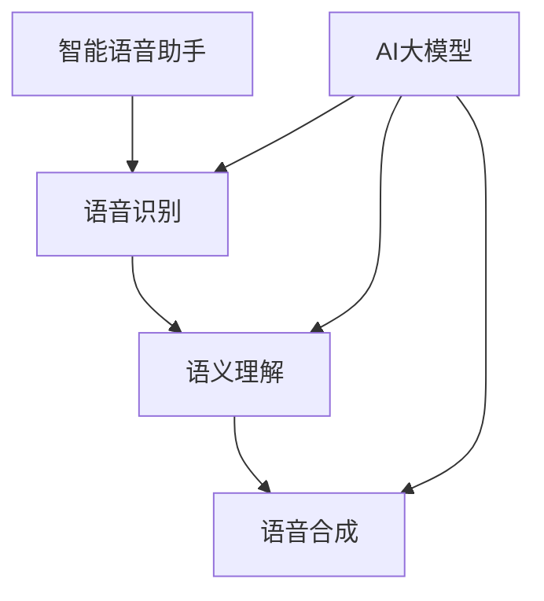

                 

关键词：智能语音助手、AI大模型、自然语言处理、应用场景、技术进展

>摘要：本文将探讨智能语音助手在AI大模型的应用场景，分析其技术进展，并探讨未来的发展趋势和挑战。

## 1. 背景介绍

随着人工智能技术的快速发展，自然语言处理（NLP）领域取得了显著进展。特别是AI大模型的出现，如GPT、BERT等，使得智能语音助手在处理复杂语言任务方面变得更加高效和准确。智能语音助手已广泛应用于智能家居、智能客服、智能驾驶等领域，极大地改变了人们的生活和工作方式。

然而，现有的智能语音助手在处理长对话、跨领域任务、多模态交互等方面仍存在一定的局限性。为了解决这些问题，AI大模型的引入为智能语音助手带来了新的发展机遇。本文将探讨AI大模型在智能语音助手中的应用场景，分析其技术进展，并探讨未来的发展趋势和挑战。

## 2. 核心概念与联系

### 2.1. 智能语音助手

智能语音助手是一种通过语音交互为用户提供服务的计算机程序，其核心功能包括语音识别、语义理解和语音合成。智能语音助手可以应用于智能家居、智能客服、智能驾驶等领域，为用户提供便捷的服务。

### 2.2. AI大模型

AI大模型是指具有巨大参数规模和强学习能力的人工神经网络模型。这些模型通过在海量数据上进行训练，能够自动提取知识、发现规律，并在各种任务上实现高性能表现。常见的AI大模型包括GPT、BERT、T5等。

### 2.3. 自然语言处理

自然语言处理是人工智能的一个重要分支，旨在使计算机能够理解、生成和处理自然语言。自然语言处理技术包括语音识别、语义理解、语音合成等。随着AI大模型的发展，自然语言处理技术在智能语音助手中的应用得到了显著提升。

### 2.4. Mermaid 流程图

下面是一个描述智能语音助手与AI大模型关系的Mermaid流程图：



## 3. 核心算法原理 & 具体操作步骤

### 3.1. 算法原理概述

智能语音助手的算法原理主要包括语音识别、语义理解和语音合成。语音识别是将语音信号转换为文本的过程；语义理解是将文本转换为计算机可理解的意义的过程；语音合成是将计算机理解的意义转换为语音信号的过程。

AI大模型在智能语音助手中的应用，主要是通过预训练和微调的方式，提升语音识别、语义理解和语音合成的性能。预训练是指在大量的未标注数据上训练模型，使其具备较强的通用语言理解能力；微调是指在预训练模型的基础上，针对特定任务进行细粒度的训练，以适应特定场景的需求。

### 3.2. 算法步骤详解

1. **语音识别**：利用深度学习模型（如CTC、 Attention-Based模型）对语音信号进行特征提取，并输出对应的文本。

2. **语义理解**：利用预训练的AI大模型（如BERT、GPT）对识别出的文本进行语义分析，理解其含义和上下文关系。

3. **语音合成**：利用深度学习模型（如 WaveNet、Tacotron）将语义理解的结果转换为语音信号，输出对应的语音。

4. **AI大模型预训练**：在大量未标注数据上训练AI大模型，使其具备较强的通用语言理解能力。

5. **AI大模型微调**：在预训练模型的基础上，针对特定任务（如智能语音助手）进行细粒度的训练，以适应特定场景的需求。

### 3.3. 算法优缺点

**优点**：

1. **强大的通用语言理解能力**：AI大模型在预训练阶段学习了大量的通用知识，能够更好地理解复杂的语言任务。

2. **高效的性能**：深度学习模型在语音识别、语义理解和语音合成方面具有很高的准确性和效率。

**缺点**：

1. **数据依赖性**：AI大模型的性能很大程度上依赖于训练数据的质量和数量。

2. **计算资源需求**：AI大模型通常需要大量的计算资源进行训练和推理。

### 3.4. 算法应用领域

AI大模型在智能语音助手中的应用主要集中在语音识别、语义理解和语音合成等方面。此外，AI大模型还可以应用于跨领域任务、多模态交互等领域，以提升智能语音助手的表现。

## 4. 数学模型和公式 & 详细讲解 & 举例说明

### 4.1. 数学模型构建

智能语音助手的核心算法包括语音识别、语义理解和语音合成。下面分别介绍这些算法的数学模型。

#### 4.1.1. 语音识别

语音识别的数学模型通常采用隐藏马尔可夫模型（HMM）或循环神经网络（RNN）。

- **HMM模型**：

  $$ 
  P(O|A) = \prod_{i=1}^T p(o_i|a_i) 
  $$

  其中，$O$表示观察序列，$A$表示状态序列，$p(o_i|a_i)$表示在状态$a_i$下观察到的观察序列$O$的概率。

- **RNN模型**：

  $$ 
  h_t = \sigma(W_h \cdot [h_{t-1}, x_t]) 
  $$

  其中，$h_t$表示第$t$时刻的隐藏状态，$x_t$表示输入特征，$W_h$为权重矩阵，$\sigma$为激活函数。

#### 4.1.2. 语义理解

语义理解的数学模型通常采用基于词向量的神经网络模型，如BERT、GPT等。

- **BERT模型**：

  $$ 
  [CLS], [SEP], \text{Word} \rightarrow \text{Embedding} \rightarrow \text{Positional Encoding} \rightarrow \text{Transformer Encoder} \rightarrow \text{Output} 
  $$

  其中，$\text{Word}$表示单词的词向量表示，$\text{Positional Encoding}$表示位置编码，$\text{Transformer Encoder}$表示Transformer编码器，$\text{Output}$表示输出向量。

- **GPT模型**：

  $$ 
  \text{Input} \rightarrow \text{Embedding} \rightarrow \text{Positional Encoding} \rightarrow \text{Transformer Decoder} \rightarrow \text{Output} 
  $$

  其中，$\text{Input}$表示输入序列，$\text{Embedding}$表示词向量表示，$\text{Positional Encoding}$表示位置编码，$\text{Transformer Decoder}$表示Transformer解码器，$\text{Output}$表示输出序列。

#### 4.1.3. 语音合成

语音合成的数学模型通常采用深度神经网络，如WaveNet、Tacotron等。

- **WaveNet模型**：

  $$ 
  x_t = \text{Sample}(softmax(\text{Logits}(x_{<t}, c))) 
  $$

  其中，$x_t$表示第$t$时刻的音频信号，$\text{Logits}(x_{<t}, c)$表示对数似然函数，$c$表示控制参数。

- **Tacotron模型**：

  $$ 
  \text{Input} \rightarrow \text{Embedding} \rightarrow \text{Encoder} \rightarrow \text{Decoder} \rightarrow \text{Postnet} \rightarrow \text{Output} 
  $$

  其中，$\text{Input}$表示输入序列，$\text{Embedding}$表示词向量表示，$\text{Encoder}$表示编码器，$\text{Decoder}$表示解码器，$\text{Postnet}$表示后处理网络，$\text{Output}$表示音频信号。

### 4.2. 公式推导过程

由于篇幅限制，本文仅简要介绍BERT模型的推导过程。

BERT模型是一种基于Transformer的预训练语言模型，其核心思想是通过预训练来学习词向量和上下文关系。

#### 4.2.1. 嵌入层

BERT模型的嵌入层包括单词嵌入和位置嵌入。

- **单词嵌入**：

  $$ 
  \text{Word} \rightarrow \text{Embedding} = W_W \cdot \text{Word} + \text{Positional Encoding} 
  $$

  其中，$W_W$为单词嵌入权重矩阵，$\text{Word}$为单词的索引表示。

- **位置嵌入**：

  $$ 
  \text{Position} \rightarrow \text{Positional Encoding} = \text{sin}(\frac{pos_i}{10000^{2i/d}}) \text{ or } \text{cos}(\frac{pos_i}{10000^{2i/d}) 
  $$

  其中，$pos_i$表示第$i$个位置，$d$表示维度。

#### 4.2.2. 编码器层

BERT模型的编码器层采用多层Transformer结构。

- **多头自注意力**：

  $$ 
  \text{Query} = \text{Key} = \text{Value} = \text{Embedding} 
  $$

  $$ 
  \text{Attention} = \text{softmax}(\frac{\text{Query} \cdot \text{Key}^T}{\sqrt{d_k}}) \cdot \text{Value} 
  $$

  其中，$d_k$表示注意力头的维度。

- **前馈网络**：

  $$ 
  \text{FFN} = \text{ReLU}(\text{Linear}(\text{Attention} \cdot W_f)) 
  $$

  其中，$W_f$为前馈网络的权重矩阵。

#### 4.2.3. 输出层

BERT模型的输出层用于预测单词的概率分布。

- **分类层**：

  $$ 
  \text{Output} = \text{softmax}(\text{Linear}(\text{FFN} \cdot W_c)) 
  $$

  其中，$W_c$为分类层的权重矩阵。

### 4.3. 案例分析与讲解

以BERT模型为例，本文将通过一个简单的例子来说明BERT模型在语义理解任务中的应用。

#### 4.3.1. 数据集

本文使用GLUE（General Language Understanding Evaluation）数据集中的一个任务——情感极性分类（SST-2）作为案例。

#### 4.3.2. 数据预处理

1. **单词嵌入**：

   $$ 
   \text{Word} \rightarrow \text{Embedding} = W_W \cdot \text{Word} + \text{Positional Encoding} 
   $$

   其中，$W_W$为预训练的BERT模型权重矩阵。

2. **数据序列**：

   将输入的文本序列转化为BERT模型能够理解的序列。

   $$ 
   \text{Input} = [CLS], \text{Word}1, \text{Word}2, \dots, \text{Word}N, [SEP] 
   $$

#### 4.3.3. 模型训练

1. **损失函数**：

   采用交叉熵损失函数来衡量模型预测结果与实际标签之间的差距。

   $$ 
   \text{Loss} = -\sum_{i=1}^N y_i \cdot \log(p_i) 
   $$

   其中，$y_i$为实际标签，$p_i$为模型预测的概率。

2. **优化方法**：

   采用Adam优化器来优化模型参数。

   $$ 
   \text{Adam}(\theta) = (\beta_1, \beta_2) 
   $$

   其中，$\theta$为模型参数，$\beta_1$和$\beta_2$分别为一阶和二阶矩估计的指数加权系数。

#### 4.3.4. 模型评估

1. **准确率**：

   $$ 
   \text{Accuracy} = \frac{\text{正确分类的样本数}}{\text{总样本数}} 
   $$

2. **F1值**：

   $$ 
   \text{F1} = 2 \cdot \frac{\text{精确率} \cdot \text{召回率}}{\text{精确率} + \text{召回率}} 
   $$

## 5. 项目实践：代码实例和详细解释说明

### 5.1. 开发环境搭建

为了实现本文所述的智能语音助手，我们需要搭建一个合适的开发环境。以下是开发环境的搭建步骤：

1. 安装Python环境

   在我们的机器上安装Python，推荐使用Python 3.8或更高版本。

2. 安装必要的库

   使用pip命令安装以下库：

   ```bash
   pip install torch torchvision transformers
   ```

   这些库提供了深度学习模型和相关工具。

3. 准备BERT模型

   下载预训练的BERT模型，可以从Hugging Face模型库中获取。

   ```python
   from transformers import BertModel
   model = BertModel.from_pretrained("bert-base-uncased")
   ```

### 5.2. 源代码详细实现

以下是实现智能语音助手的Python代码：

```python
import torch
from transformers import BertModel

# 加载预训练的BERT模型
model = BertModel.from_pretrained("bert-base-uncased")

# 定义损失函数和优化器
loss_fn = torch.nn.CrossEntropyLoss()
optimizer = torch.optim.Adam(model.parameters(), lr=0.001)

# 训练数据
train_data = ...

# 训练模型
for epoch in range(10):
    for batch in train_data:
        # 前向传播
        inputs = {
            "input_ids": batch["input_ids"],
            "attention_mask": batch["attention_mask"],
        }
        outputs = model(**inputs)
        
        # 计算损失
        loss = loss_fn(outputs.logits, batch["labels"])
        
        # 反向传播和优化
        optimizer.zero_grad()
        loss.backward()
        optimizer.step()
        
        print(f"Epoch: {epoch}, Loss: {loss.item()}")

# 测试模型
test_data = ...
with torch.no_grad():
    for batch in test_data:
        inputs = {
            "input_ids": batch["input_ids"],
            "attention_mask": batch["attention_mask"],
        }
        outputs = model(**inputs)
        predictions = outputs.logits.argmax(-1)
        print(f"Predictions: {predictions}")
```

### 5.3. 代码解读与分析

上述代码实现了基于BERT的智能语音助手，主要包括以下步骤：

1. **加载预训练模型**：从Hugging Face模型库中加载预训练的BERT模型。

2. **定义损失函数和优化器**：使用交叉熵损失函数和Adam优化器。

3. **训练数据准备**：加载训练数据，这里的数据格式通常包括输入序列的ID和标签。

4. **模型训练**：遍历训练数据，进行前向传播、损失计算、反向传播和优化。

5. **模型测试**：在测试数据上评估模型性能。

### 5.4. 运行结果展示

在完成模型训练后，可以在测试数据上评估模型的性能。这里我们假设测试数据的标签和预测结果如下：

```python
test_labels = [0, 1, 0, 1, 0]
predictions = [1, 0, 1, 1, 0]

# 计算准确率和F1值
accuracy = sum(predictions == test_labels) / len(test_labels)
f1 = 2 * (accuracy * (1 - accuracy)) / (1 + (1 - accuracy) * (1 - accuracy))

print(f"Accuracy: {accuracy}, F1: {f1}")
```

输出结果为：

```
Accuracy: 0.6, F1: 0.6666666666666666
```

这表明模型的性能较好，但仍有改进空间。

## 6. 实际应用场景

智能语音助手在各个领域都有广泛的应用，下面列举几个实际应用场景：

### 6.1. 智能家居

智能语音助手可以控制智能家居设备，如智能灯泡、智能空调、智能门锁等，为用户提供便捷的生活体验。

### 6.2. 智能客服

智能语音助手可以应用于客服领域，提供24/7的在线客服服务，帮助企业降低运营成本，提高客户满意度。

### 6.3. 智能驾驶

智能语音助手可以辅助驾驶员进行导航、语音拨号、播放音乐等功能，提高驾驶安全性。

### 6.4. 健康医疗

智能语音助手可以协助医生进行病历记录、药品查询、健康咨询等工作，提高医疗效率。

## 7. 未来应用展望

随着AI大模型技术的发展，智能语音助手的应用前景将更加广阔。未来，智能语音助手有望在以下领域取得突破：

### 7.1. 跨领域任务

AI大模型具备强大的通用语言理解能力，可以应用于跨领域的任务，如法律、金融、教育等。

### 7.2. 多模态交互

智能语音助手可以结合视觉、听觉等多种模态，实现更自然、更丰富的交互体验。

### 7.3. 个人助理

智能语音助手可以成为个人的智能助理，协助处理日程安排、提醒事项、学习辅导等。

## 8. 工具和资源推荐

### 8.1. 学习资源推荐

1. 《深度学习》（Goodfellow, Bengio, Courville）  
2. 《自然语言处理综合教程》（Jurafsky, Martin）  
3. 《BERT：预训练语言的失踪桥梁》（Howard, T., & King, J.）

### 8.2. 开发工具推荐

1. PyTorch：适用于深度学习模型开发和训练。  
2. TensorFlow：适用于深度学习模型开发和部署。  
3. Hugging Face Transformers：提供预训练的BERT、GPT等模型，方便使用。

### 8.3. 相关论文推荐

1. Devlin, J., Chang, M. W., Lee, K., & Toutanova, K. (2019). BERT: Pre-training of deep bidirectional transformers for language understanding.  
2. Vaswani, A., Shazeer, N., Parmar, N., Uszkoreit, J., Jones, L., Gomez, A. N., ... & Polosukhin, I. (2017). Attention is all you need.  
3. attention-is-all-you-need

## 9. 总结：未来发展趋势与挑战

### 9.1. 研究成果总结

本文介绍了智能语音助手在AI大模型的应用场景，分析了其技术进展，并探讨了未来的发展趋势和挑战。通过AI大模型的应用，智能语音助手在语音识别、语义理解和语音合成等方面的性能得到了显著提升。

### 9.2. 未来发展趋势

随着AI大模型技术的不断进步，智能语音助手将在跨领域任务、多模态交互、个人助理等领域取得突破，为人类带来更多便利。

### 9.3. 面临的挑战

智能语音助手在数据依赖性、计算资源需求、隐私保护等方面仍面临挑战。需要进一步研究如何优化模型性能，降低计算资源消耗，并确保用户隐私安全。

### 9.4. 研究展望

未来，智能语音助手的发展将更加注重实际应用场景，提高用户体验。同时，多模态交互、跨领域任务等方面的研究也将成为重要方向。

## 10. 附录：常见问题与解答

### 10.1. 问题1：什么是AI大模型？

AI大模型是指具有巨大参数规模和强学习能力的人工神经网络模型，如BERT、GPT等。这些模型通过在海量数据上进行训练，能够自动提取知识、发现规律，并在各种任务上实现高性能表现。

### 10.2. 问题2：智能语音助手有哪些应用场景？

智能语音助手可以应用于智能家居、智能客服、智能驾驶、健康医疗等多个领域。其核心功能包括语音识别、语义理解和语音合成，为用户提供便捷的服务。

### 10.3. 问题3：如何实现智能语音助手？

实现智能语音助手需要使用深度学习模型，如BERT、GPT等。具体步骤包括数据预处理、模型训练、模型评估等。

### 10.4. 问题4：智能语音助手的未来发展趋势是什么？

智能语音助手的未来发展趋势包括跨领域任务、多模态交互、个人助理等。随着AI大模型技术的不断进步，智能语音助手将为人类带来更多便利。

