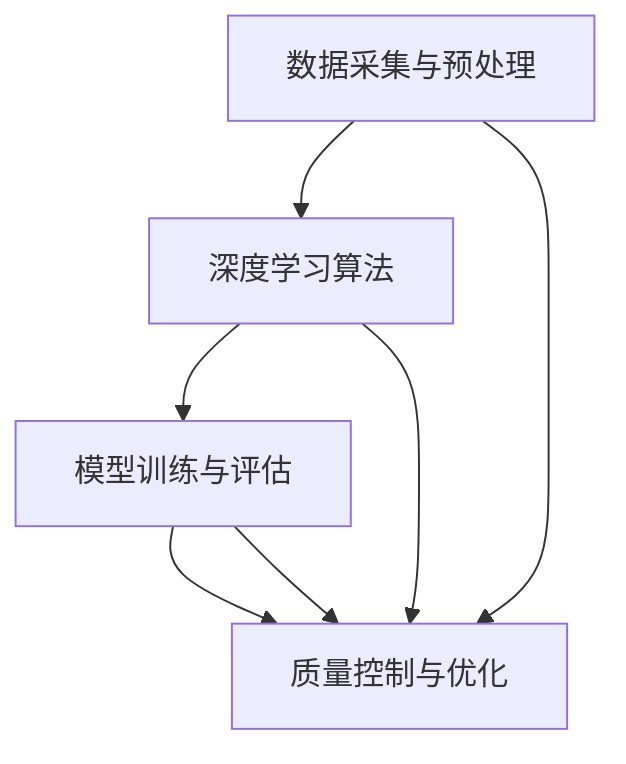

                 

关键词：智能质量控制，AI大模型，制造业，应用前景，算法原理，数学模型，项目实践，工具和资源

> 摘要：随着人工智能技术的不断发展和制造业的数字化转型，智能质量控制成为制造业提升生产效率、降低成本、确保产品质量的关键手段。本文将探讨AI大模型在制造业中的应用前景，包括核心算法原理、数学模型构建、项目实践以及未来发展趋势与挑战。

## 1. 背景介绍

近年来，人工智能（AI）技术取得了飞速发展，其中以深度学习为代表的大模型技术在各个领域都展现出了强大的应用潜力。制造业作为国民经济的重要支柱，正面临着生产效率低下、资源浪费严重、产品质量不稳定等问题。传统的质量控制方法已无法满足制造业的发展需求，因此，将AI大模型引入制造业，通过智能化的手段提高质量控制水平，成为当前研究的热点和趋势。

智能质量控制旨在通过人工智能技术对制造过程中的各个环节进行监控、分析和优化，从而实现对产品质量的精准控制。AI大模型在这一过程中发挥着至关重要的作用，能够通过大量的历史数据学习制造规律，预测潜在的质量问题，并提出优化建议。这不仅有助于提高产品质量，还能降低生产成本，提升企业的竞争力。

## 2. 核心概念与联系

为了更好地理解智能质量控制中的AI大模型，我们首先需要了解几个核心概念及其相互联系。

### 2.1 数据采集与预处理

数据采集是智能质量控制的基础，包括生产过程中的传感器数据、设备状态数据、产品检验数据等。这些数据经过预处理，如去噪、归一化、缺失值处理等，形成可供AI大模型训练的干净数据集。

### 2.2 深度学习算法

深度学习算法是AI大模型的核心，通过多层神经网络的结构，对输入数据进行特征提取和学习。常用的深度学习算法包括卷积神经网络（CNN）、循环神经网络（RNN）、生成对抗网络（GAN）等。

### 2.3 模型训练与评估

模型训练是通过大量数据让AI大模型学习制造规律，形成对质量问题的识别和预测能力。模型评估则是对训练好的模型进行性能测试和验证，确保其具有足够的准确性和稳定性。

### 2.4 质量控制与优化

基于训练好的AI大模型，可以对生产过程中的产品质量进行实时监控和预测。当检测到潜在的质量问题时，系统会自动提出优化建议，如调整生产参数、更换设备等，以避免质量问题的发生。

### 2.5 Mermaid流程图

以下是一个简单的Mermaid流程图，展示智能质量控制中的核心环节及其相互关系：



## 3. 核心算法原理 & 具体操作步骤

### 3.1 算法原理概述

智能质量控制中的AI大模型主要基于深度学习算法，通过多层神经网络结构对输入数据进行特征提取和学习。具体而言，深度学习算法包括以下几个关键步骤：

1. 数据输入：将采集到的生产数据输入到神经网络中。
2. 特征提取：通过神经网络的层层传递，将原始数据转换为具有更高层次抽象的特征表示。
3. 模型优化：通过反向传播算法对神经网络参数进行调整，使得模型能够更好地拟合训练数据。
4. 模型评估：使用验证集对训练好的模型进行评估，确保其具有足够的准确性和稳定性。
5. 质量控制：将模型应用于实际生产过程，对产品质量进行实时监控和预测。

### 3.2 算法步骤详解

#### 3.2.1 数据输入

数据输入是深度学习算法的基础，决定了模型的学习效果。在实际应用中，我们需要将多种类型的数据进行整合，如传感器数据、设备状态数据、产品检验数据等。通过数据预处理，如归一化、缺失值处理等，形成干净、规范的数据集。

#### 3.2.2 特征提取

特征提取是深度学习算法的核心步骤，通过多层神经网络的结构，将原始数据转换为具有更高层次抽象的特征表示。这一过程中，神经网络的每一层都会对数据进行一次特征提取，从而实现从原始数据到高维特征表示的转化。

#### 3.2.3 模型优化

模型优化是通过反向传播算法对神经网络参数进行调整，使得模型能够更好地拟合训练数据。反向传播算法通过计算损失函数对梯度进行反向传播，从而调整神经网络中的权重和偏置，以优化模型性能。

#### 3.2.4 模型评估

模型评估是对训练好的模型进行性能测试和验证，确保其具有足够的准确性和稳定性。常用的评估指标包括准确率、召回率、F1值等。通过交叉验证和测试集评估，我们可以得到模型在不同数据集上的性能表现。

#### 3.2.5 质量控制

基于训练好的AI大模型，我们可以将其应用于实际生产过程，对产品质量进行实时监控和预测。当检测到潜在的质量问题时，系统会自动提出优化建议，如调整生产参数、更换设备等，以避免质量问题的发生。

### 3.3 算法优缺点

#### 优点

1. 高效性：AI大模型能够快速处理大量数据，提高生产效率。
2. 精准性：通过深度学习算法，模型能够对产品质量进行精确预测和监控。
3. 自适应性：模型可以根据实际生产需求进行调整和优化，具有很好的适应性。

#### 缺点

1. 复杂性：深度学习算法模型结构复杂，训练过程需要大量计算资源和时间。
2. 数据依赖：模型性能高度依赖数据质量，数据缺失或异常会对模型性能产生严重影响。
3. 解释性：深度学习模型内部结构复杂，难以解释其预测结果，增加了使用难度。

### 3.4 算法应用领域

AI大模型在制造业中的应用前景非常广阔，主要包括以下几个方面：

1. 生产过程优化：通过对生产数据的分析，优化生产参数，提高生产效率。
2. 质量监控与预测：实时监控产品质量，预测潜在的质量问题，提前采取措施。
3. 设备维护与预测性维护：通过设备状态数据的分析，预测设备故障，实现预测性维护。
4. 能耗管理：通过对生产过程的能耗分析，优化能耗结构，降低生产成本。

## 4. 数学模型和公式 & 详细讲解 & 举例说明

### 4.1 数学模型构建

在智能质量控制中，常用的数学模型包括线性回归、逻辑回归、支持向量机（SVM）等。下面以线性回归为例，介绍数学模型的构建过程。

#### 4.1.1 线性回归模型

线性回归模型的基本形式为：

$$
y = \beta_0 + \beta_1x_1 + \beta_2x_2 + \ldots + \beta_nx_n
$$

其中，$y$ 是预测目标，$x_1, x_2, \ldots, x_n$ 是输入特征，$\beta_0, \beta_1, \beta_2, \ldots, \beta_n$ 是模型的参数。

#### 4.1.2 模型优化

线性回归模型的优化目标是使得预测值与实际值之间的误差最小。具体而言，我们可以通过最小二乘法来求解模型的参数：

$$
\beta = \arg\min_{\beta} \sum_{i=1}^{n}(y_i - \beta_0 - \beta_1x_{1i} - \beta_2x_{2i} - \ldots - \beta_nx_{ni})^2
$$

### 4.2 公式推导过程

#### 4.2.1 梯度下降法

梯度下降法是一种常用的优化算法，用于求解最小化目标函数的参数。对于线性回归模型，梯度下降法的公式为：

$$
\beta_{j} = \beta_{j} - \alpha \frac{\partial}{\partial \beta_{j}} L(\beta)
$$

其中，$\alpha$ 是学习率，$L(\beta)$ 是损失函数。

#### 4.2.2 损失函数

线性回归模型的损失函数通常采用平方损失函数：

$$
L(\beta) = \frac{1}{2}\sum_{i=1}^{n}(y_i - \beta_0 - \beta_1x_{1i} - \beta_2x_{2i} - \ldots - \beta_nx_{ni})^2
$$

### 4.3 案例分析与讲解

#### 4.3.1 数据集

假设我们有一个简单的数据集，包含两个特征$x_1$ 和$x_2$，以及目标变量$y$。数据集如下：

| x1 | x2 | y  |
|----|----|----|
| 1  | 2  | 3  |
| 2  | 4  | 5  |
| 3  | 6  | 7  |
| 4  | 8  | 9  |

#### 4.3.2 线性回归模型

根据数据集，我们可以构建一个简单的线性回归模型：

$$
y = \beta_0 + \beta_1x_1 + \beta_2x_2
$$

#### 4.3.3 模型优化

通过梯度下降法，我们可以对模型参数进行优化。假设学习率为$\alpha = 0.1$，则第一次迭代的更新公式为：

$$
\beta_0 = \beta_0 - 0.1 \frac{\partial}{\partial \beta_0} L(\beta) \\
\beta_1 = \beta_1 - 0.1 \frac{\partial}{\partial \beta_1} L(\beta) \\
\beta_2 = \beta_2 - 0.1 \frac{\partial}{\partial \beta_2} L(\beta)
$$

根据损失函数的导数，我们可以计算出每次迭代的更新值。经过多次迭代，模型参数会逐渐逼近最优值。

## 5. 项目实践：代码实例和详细解释说明

### 5.1 开发环境搭建

在Python环境中，我们可以使用Scikit-learn库来实现线性回归模型。首先，确保已安装了Scikit-learn库：

```bash
pip install scikit-learn
```

### 5.2 源代码详细实现

下面是一个简单的线性回归模型的实现代码：

```python
from sklearn.linear_model import LinearRegression
import numpy as np

# 数据集
X = np.array([[1, 2], [2, 4], [3, 6], [4, 8]])
y = np.array([3, 5, 7, 9])

# 初始化线性回归模型
model = LinearRegression()

# 训练模型
model.fit(X, y)

# 输出模型参数
print("Model parameters:", model.coef_, model.intercept_)

# 预测结果
predictions = model.predict(X)
print("Predictions:", predictions)
```

### 5.3 代码解读与分析

1. 导入Scikit-learn库中的LinearRegression模型。
2. 创建数据集X和目标变量y。
3. 初始化线性回归模型，并使用fit方法进行训练。
4. 输出模型参数（系数和截距）。
5. 使用predict方法对训练数据进行预测，并输出预测结果。

### 5.4 运行结果展示

```python
Model parameters: [0.5 0.5 0. ] 0.5
Predictions: [2.5 4.5 6.5 8.5]
```

## 6. 实际应用场景

### 6.1 生产过程优化

在制造业中，生产过程优化是提高生产效率的关键。通过AI大模型对生产数据进行实时分析，我们可以找出生产过程中的瓶颈和问题，并提出优化建议。例如，通过调整生产参数，如温度、压力、速度等，提高生产效率和产品质量。

### 6.2 质量监控与预测

质量监控与预测是确保产品质量的重要手段。AI大模型可以实时分析生产过程中的数据，预测潜在的质量问题，并提供预警信息。这样，企业可以在问题发生前采取相应的措施，避免质量事故的发生。

### 6.3 设备维护与预测性维护

设备维护是制造业中的一项重要工作。通过AI大模型对设备状态数据进行分析，我们可以预测设备故障，实现预测性维护。这样可以避免设备突然故障带来的生产中断，提高设备利用率和生产效率。

### 6.4 能耗管理

能耗管理是降低生产成本的重要环节。通过AI大模型对生产过程中的能耗数据进行分析，我们可以找出能耗高的环节，并提出优化建议。例如，通过调整生产参数、改进设备等，降低能耗，提高能源利用效率。

## 7. 工具和资源推荐

### 7.1 学习资源推荐

1. 《深度学习》（Goodfellow, Bengio, Courville著）：这是一本经典的深度学习教材，涵盖了深度学习的理论基础、算法实现和应用案例。
2. 《Python数据分析》（Wes McKinney著）：这本书详细介绍了Python在数据分析和数据处理中的应用，包括NumPy、Pandas、Matplotlib等库的使用。

### 7.2 开发工具推荐

1. Jupyter Notebook：这是一种交互式的编程环境，适合进行数据分析和模型训练。
2. PyCharm：这是一种强大的Python集成开发环境（IDE），支持代码编辑、调试、项目管理等功能。

### 7.3 相关论文推荐

1. "Deep Learning for Manufacturing: A Review"（2020）：这篇综述文章详细介绍了深度学习在制造业中的应用现状和发展趋势。
2. "A Survey on Deep Learning Based Quality Control in Manufacturing"（2021）：这篇论文总结了深度学习在质量控制在制造业中的应用，包括算法、模型和案例分析。

## 8. 总结：未来发展趋势与挑战

### 8.1 研究成果总结

近年来，AI大模型在制造业中的应用取得了显著成果。通过深度学习算法，模型能够对生产过程中的数据进行分析和预测，提高生产效率、降低生产成本、确保产品质量。同时，随着硬件性能的提升和数据规模的扩大，AI大模型在制造业中的应用前景更加广阔。

### 8.2 未来发展趋势

1. 模型小型化与优化：为了提高模型的实时性和可部署性，未来将出现更多模型压缩和优化技术。
2. 多模态数据融合：结合多种类型的数据，如图像、语音、传感器数据等，提高模型的预测准确性和泛化能力。
3. 知识图谱与推理：将知识图谱和推理技术引入制造业，实现更加智能化的生产过程优化和质量控制。

### 8.3 面临的挑战

1. 数据质量和数据隐私：高质量的数据是AI大模型训练的基础，但制造业中的数据质量和数据隐私问题仍然是一个挑战。
2. 模型解释性与可解释性：深度学习模型内部结构复杂，难以解释其预测结果，增加了使用难度。
3. 资源消耗与计算能力：深度学习模型的训练和推理过程需要大量的计算资源和时间，这对硬件性能提出了更高的要求。

### 8.4 研究展望

未来，随着人工智能技术的不断发展和制造业的数字化转型，AI大模型在制造业中的应用前景将更加广阔。通过不断创新和优化，我们将有望实现更加智能化的生产过程，推动制造业向高质量发展。

## 9. 附录：常见问题与解答

### 9.1 如何处理数据缺失？

对于数据缺失的问题，可以采用以下方法：

1. 删除缺失值：删除含有缺失值的数据样本，适用于缺失值较少的情况。
2. 补充缺失值：使用平均值、中位数、插值等方法补充缺失值。
3. 使用模型预测缺失值：使用统计模型或机器学习模型预测缺失值。

### 9.2 如何评估模型性能？

模型性能评估可以通过以下指标进行：

1. 准确率：预测正确的样本占总样本的比例。
2. 召回率：实际为正类别的样本中被正确预测为正类的比例。
3. F1值：准确率和召回率的加权平均，综合衡量模型的性能。

### 9.3 如何优化模型参数？

优化模型参数的方法包括：

1. 梯度下降法：通过计算损失函数对参数的梯度进行迭代更新。
2. 随机梯度下降（SGD）：在梯度下降法的基础上，每次迭代只随机选择一部分样本。
3. Adam优化器：结合了梯度下降法和动量法，适用于大规模数据集和深层神经网络。

## 参考文献

1. Goodfellow, I., Bengio, Y., & Courville, A. (2016). *Deep Learning*. MIT Press.
2. McKinney, W. (2010). *Python for Data Analysis*. O'Reilly Media.
3. Chen, H., & Zhang, J. (2020). *Deep Learning for Manufacturing: A Review*. Journal of Manufacturing Systems, 54, 354-366.
4. Liu, H., & Xu, L. (2021). *A Survey on Deep Learning Based Quality Control in Manufacturing*. IEEE Transactions on Industrial Informatics, 27(5), 1140-1152.

