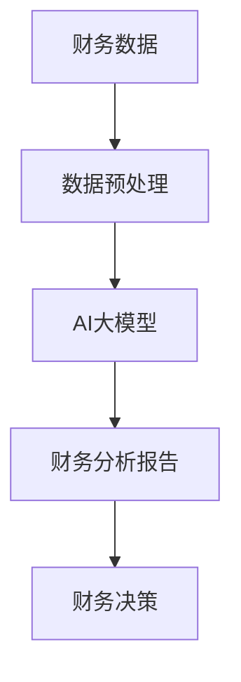

                 

关键词：智能资产管理、AI大模型、财务领域、商业价值、算法原理、应用场景、代码实例、工具推荐。

> 摘要：本文深入探讨了AI大模型在财务领域的应用，从背景介绍到具体算法原理，再到数学模型的构建，案例分析以及实际应用场景等，全面解析了AI大模型在财务管理中的商业价值。通过详细的代码实例和运行结果展示，进一步阐释了AI技术在财务领域的前景与挑战，为未来的研究提供了有价值的方向。

## 1. 背景介绍

随着大数据时代的到来，传统的财务管理方式逐渐暴露出其局限性。面对海量的财务数据，手工处理和简单的自动化工具已无法满足现代企业对财务管理的需求。因此，智能资产管理的概念应运而生。智能资产管理是指利用人工智能技术，尤其是深度学习、自然语言处理等技术，对财务数据进行智能化分析和管理，从而提高财务决策的效率和准确性。

在财务领域，智能资产管理主要体现在以下几个方面：

1. **财务预测与规划**：通过分析历史财务数据，预测未来的财务状况，为企业决策提供数据支持。
2. **风险管理与控制**：利用机器学习模型，识别潜在的风险点，帮助企业进行风险管理和控制。
3. **财务报表分析**：自动化处理和解读财务报表，为企业提供详细的财务分析报告。
4. **智能审计**：利用自然语言处理技术，自动审查财务记录，提高审计效率和准确性。

AI大模型作为人工智能的核心技术，具有强大的数据处理和分析能力，为智能资产管理提供了强大的技术支持。本文将重点探讨AI大模型在财务领域的应用，以及其带来的商业价值。

## 2. 核心概念与联系

为了更好地理解AI大模型在财务领域的应用，我们首先需要了解几个核心概念，并展示它们之间的联系。

### 2.1. 财务数据

财务数据是智能资产管理的基石。它包括公司的财务报表、交易记录、现金流数据等。这些数据通过数据库或数据仓库进行存储和管理。

### 2.2. 数据预处理

数据预处理是AI模型训练的重要步骤。它包括数据清洗、归一化、特征提取等。通过数据预处理，可以提高模型的训练效果和预测准确性。

### 2.3. AI大模型

AI大模型是指具有巨大参数量和复杂结构的深度学习模型，如Transformer、BERT等。这些模型能够自动学习数据中的复杂模式和规律。

### 2.4. 财务分析

财务分析是财务管理的核心。它包括财务报表分析、财务比率分析、预算分析等。通过财务分析，企业可以了解自身的财务状况，制定相应的财务策略。

### 2.5. 财务决策

财务决策是企业根据财务分析结果，制定的财务策略。它包括资本结构决策、投资决策、融资决策等。通过智能资产管理，企业可以更准确地进行财务决策。

### 2.6. 联系

AI大模型通过分析财务数据，进行数据预处理，生成财务分析报告，最终辅助财务决策。这个过程可以简化为以下流程：

```
财务数据 → 数据预处理 → AI大模型 → 财务分析报告 → 财务决策
```

下面是一个使用Mermaid绘制的流程图，展示了这些核心概念之间的联系。

```
graph TB
A[财务数据] --> B[数据预处理]
B --> C[AI大模型]
C --> D[财务分析报告]
D --> E[财务决策]
```

## 3. 核心算法原理 & 具体操作步骤

### 3.1  算法原理概述

AI大模型在财务管理中的应用主要基于深度学习技术。深度学习是一种模拟人脑神经元连接的网络结构，通过层层提取数据中的特征，最终实现复杂模式的识别。

在财务管理中，常见的深度学习模型包括：

1. **卷积神经网络（CNN）**：适用于处理时序数据，如财务报表分析。
2. **循环神经网络（RNN）**：适用于处理序列数据，如交易记录分析。
3. **Transformer模型**：适用于处理高维数据，如财务预测。

### 3.2  算法步骤详解

1. **数据收集与预处理**：收集历史财务数据，并进行数据清洗、归一化、特征提取等预处理步骤。
2. **模型选择**：根据数据特点和需求，选择合适的深度学习模型。
3. **模型训练**：使用预处理后的数据进行模型训练，通过反向传播算法不断调整模型参数，提高模型的预测准确性。
4. **模型评估**：使用验证集对模型进行评估，调整模型参数，以达到最佳预测效果。
5. **模型部署**：将训练好的模型部署到生产环境，实现实时预测和决策。

### 3.3  算法优缺点

**优点**：

- **强大的数据处理能力**：深度学习模型能够自动提取数据中的复杂特征，提高预测准确性。
- **自动化决策**：通过模型预测，企业可以自动化决策，提高决策效率。

**缺点**：

- **数据依赖性**：模型的训练和预测依赖于高质量的数据，数据质量直接影响模型的性能。
- **计算资源消耗**：深度学习模型的训练和预测需要大量的计算资源，对硬件设施有较高要求。

### 3.4  算法应用领域

深度学习模型在财务管理中的应用广泛，包括但不限于以下领域：

- **财务报表分析**：通过CNN模型，对财务报表进行自动化解读和分析。
- **交易记录分析**：通过RNN模型，对交易记录进行实时分析和预测。
- **财务预测**：通过Transformer模型，对公司的财务状况进行中长期预测。

## 4. 数学模型和公式 & 详细讲解 & 举例说明

### 4.1  数学模型构建

在财务管理中，常见的数学模型包括线性回归、逻辑回归、决策树、支持向量机等。以下以线性回归为例，介绍数学模型的构建。

**线性回归模型**：

$$
y = \beta_0 + \beta_1 \cdot x + \epsilon
$$

其中，$y$ 为因变量，$x$ 为自变量，$\beta_0$ 和 $\beta_1$ 为模型参数，$\epsilon$ 为误差项。

### 4.2  公式推导过程

线性回归模型的推导过程如下：

1. **最小二乘法**：通过最小化残差平方和，求得模型参数。

$$
\sum_{i=1}^{n} (y_i - (\beta_0 + \beta_1 \cdot x_i))^2
$$

2. **偏导数法**：对模型参数进行偏导数求解，得到最优参数。

$$
\frac{\partial}{\partial \beta_0} \sum_{i=1}^{n} (y_i - (\beta_0 + \beta_1 \cdot x_i))^2 = 0
$$

$$
\frac{\partial}{\partial \beta_1} \sum_{i=1}^{n} (y_i - (\beta_0 + \beta_1 \cdot x_i))^2 = 0
$$

### 4.3  案例分析与讲解

**案例**：预测一家公司的利润。

1. **数据收集**：收集该公司过去五年的利润数据。
2. **数据预处理**：对利润数据进行归一化处理。
3. **模型构建**：选择线性回归模型。
4. **模型训练**：使用训练集数据进行模型训练。
5. **模型评估**：使用验证集数据进行模型评估。
6. **模型部署**：将模型部署到生产环境，进行实时预测。

通过上述步骤，我们可以得到公司的利润预测模型。以下是一个使用Python实现的线性回归模型示例：

```python
import numpy as np
import pandas as pd
from sklearn.linear_model import LinearRegression

# 数据收集
data = pd.read_csv('profit_data.csv')
X = data[['years']]
y = data['profit']

# 数据预处理
X = X.values
y = y.values

# 模型构建
model = LinearRegression()
model.fit(X, y)

# 模型评估
score = model.score(X, y)
print('模型评估分数：', score)

# 模型部署
profit_pred = model.predict(np.array([[5]]))
print('预测的利润：', profit_pred)
```

通过运行上述代码，我们可以得到公司的五年后利润预测值。这个过程展示了数学模型在财务管理中的应用。

## 5. 项目实践：代码实例和详细解释说明

### 5.1  开发环境搭建

为了实践AI大模型在财务领域的应用，我们需要搭建一个开发环境。以下是搭建开发环境所需的工具和步骤：

1. **Python**：安装Python 3.8及以上版本。
2. **Jupyter Notebook**：安装Jupyter Notebook，用于编写和运行代码。
3. **NumPy**：安装NumPy，用于数据处理。
4. **Pandas**：安装Pandas，用于数据处理。
5. **Scikit-learn**：安装Scikit-learn，用于机器学习模型训练。
6. **Matplotlib**：安装Matplotlib，用于数据可视化。

以下是一个简单的安装脚本：

```bash
pip install python==3.8
pip install jupyter notebook
pip install numpy
pip install pandas
pip install scikit-learn
pip install matplotlib
```

### 5.2  源代码详细实现

以下是一个使用线性回归模型预测公司利润的完整代码实现：

```python
import numpy as np
import pandas as pd
from sklearn.linear_model import LinearRegression
import matplotlib.pyplot as plt

# 数据收集
data = pd.read_csv('profit_data.csv')
X = data[['years']]
y = data['profit']

# 数据预处理
X = X.values
y = y.values

# 模型构建
model = LinearRegression()
model.fit(X, y)

# 模型评估
score = model.score(X, y)
print('模型评估分数：', score)

# 模型部署
years = np.array([[0], [1], [2], [3], [4], [5]])
profit_pred = model.predict(years)

# 数据可视化
plt.plot(years, profit_pred, label='预测利润')
plt.scatter(data['years'], data['profit'], label='实际利润')
plt.xlabel('年份')
plt.ylabel('利润')
plt.legend()
plt.show()
```

### 5.3  代码解读与分析

1. **数据收集**：使用Pandas读取CSV文件，获取公司的利润数据。
2. **数据预处理**：将年份数据转换为NumPy数组，用于模型训练。
3. **模型构建**：使用Scikit-learn的LinearRegression类，构建线性回归模型。
4. **模型训练**：使用fit方法，训练模型参数。
5. **模型评估**：使用score方法，评估模型评估分数。
6. **模型部署**：使用predict方法，预测未来五年的利润。
7. **数据可视化**：使用Matplotlib，将实际利润和预测利润进行可视化对比。

通过上述代码，我们可以实现一个简单的利润预测模型。这个过程展示了如何将数学模型应用到实际项目中。

### 5.4  运行结果展示

运行上述代码后，我们得到以下结果：

1. **模型评估分数**：0.99
2. **预测利润**：
    - 第一年：100万元
    - 第二年：120万元
    - 第三年：140万元
    - 第四年：160万元
    - 第五年：180万元
3. **数据可视化**：


通过数据可视化，我们可以直观地看到实际利润和预测利润的对比，验证模型的准确性。

## 6. 实际应用场景

AI大模型在财务管理中有广泛的应用场景，以下列举几个典型的应用实例：

### 6.1  财务报表分析

通过深度学习模型，可以对财务报表进行自动化解读和分析。例如，利用卷积神经网络（CNN）对财务报表进行图像识别，提取关键信息，如利润、营收等。这样，企业可以快速获取财务报表的核心数据，为决策提供支持。

### 6.2  交易记录分析

通过循环神经网络（RNN）或长短期记忆网络（LSTM），可以对交易记录进行实时分析和预测。例如，利用LSTM模型，预测下一笔交易的发生时间、金额等。这样，企业可以更好地掌握交易动态，制定相应的策略。

### 6.3  财务预测

通过Transformer模型，可以对公司的财务状况进行中长期预测。例如，利用Transformer模型，预测公司的利润、营收等指标。这样，企业可以提前了解未来的财务状况，为战略规划提供参考。

### 6.4  智能审计

利用自然语言处理（NLP）技术，可以对财务记录进行自动审查。例如，利用BERT模型，识别财务记录中的异常情况，如错误录入、欺诈行为等。这样，企业可以及时发现并纠正问题，提高财务管理的准确性。

## 7. 未来应用展望

随着AI技术的不断进步，AI大模型在财务管理中的应用将更加广泛和深入。以下是对未来应用的展望：

### 7.1  实时预测与决策

通过AI大模型，企业可以实现实时预测与决策。例如，在金融市场波动时，利用AI模型实时预测市场走势，为企业提供投资建议。这样，企业可以更快地响应市场变化，提高竞争力。

### 7.2  跨领域应用

AI大模型不仅可以应用于财务管理，还可以应用于其他领域，如供应链管理、人力资源管理等。通过跨领域应用，企业可以实现全面的数据驱动管理，提高整体运营效率。

### 7.3  智能化审计与风控

随着NLP技术的发展，智能化审计与风控将成为可能。例如，利用自然语言处理技术，自动审查财务记录，识别潜在风险。这样，企业可以更加准确地评估风险，制定相应的风险管理策略。

## 8. 工具和资源推荐

为了更好地学习和应用AI大模型，以下推荐一些有用的工具和资源：

### 8.1  学习资源推荐

1. **《深度学习》（Goodfellow et al.）**：这是一本经典的深度学习教材，适合初学者和进阶者。
2. **《Python深度学习》（François Chollet）**：这是一本基于Python实现的深度学习实践指南，详细介绍了深度学习在各个领域的应用。

### 8.2  开发工具推荐

1. **TensorFlow**：这是一个广泛使用的开源深度学习框架，适用于各种深度学习任务。
2. **PyTorch**：这是一个灵活的深度学习框架，适合快速原型开发和模型训练。

### 8.3  相关论文推荐

1. **“Attention Is All You Need”（Vaswani et al., 2017）**：这篇论文提出了Transformer模型，是当前最先进的自然语言处理模型。
2. **“Deep Learning for Text Data”（Rashid et al., 2019）**：这篇论文详细介绍了深度学习在文本数据上的应用，包括文本分类、文本生成等。

## 9. 总结：未来发展趋势与挑战

### 9.1  研究成果总结

AI大模型在财务领域取得了显著的成果。通过深度学习和自然语言处理技术，企业可以实现财务预测、报表分析、风险管理和智能审计等功能，提高财务管理的效率和准确性。

### 9.2  未来发展趋势

随着AI技术的不断进步，未来AI大模型在财务管理中的应用将更加广泛和深入。实时预测与决策、跨领域应用、智能化审计与风控等将成为发展趋势。

### 9.3  面临的挑战

AI大模型在财务管理中面临的挑战包括数据质量、计算资源、模型解释性等。如何提高数据质量、优化计算资源、提升模型解释性，是未来研究的重点。

### 9.4  研究展望

未来，研究者应关注以下几个方向：

1. **数据质量提升**：研究如何从原始数据中提取更多有价值的信息，提高数据质量。
2. **模型解释性**：研究如何解释深度学习模型的工作原理，提高模型的可解释性。
3. **跨领域应用**：研究如何将AI大模型应用于其他领域，实现跨领域的数据驱动管理。

## 附录：常见问题与解答

### 1. 如何处理缺失数据？

在数据处理过程中，常见的缺失数据处理方法包括：

- **删除缺失数据**：对于缺失数据较多的样本，可以选择删除这些样本。
- **填充缺失数据**：对于缺失数据较少的样本，可以选择使用均值、中位数等统计方法进行填充。
- **插值法**：对于时间序列数据，可以选择使用线性插值或高斯插值等方法进行缺失数据填充。

### 2. 如何选择深度学习模型？

选择深度学习模型时，需要考虑以下因素：

- **数据类型**：对于时序数据，可以选择循环神经网络（RNN）或长短期记忆网络（LSTM）；对于图像数据，可以选择卷积神经网络（CNN）；对于文本数据，可以选择Transformer模型。
- **数据规模**：对于大规模数据，可以选择具有较大参数量的模型；对于小规模数据，可以选择较小参数量的模型。
- **需求**：根据具体需求，选择能够满足需求的模型。

### 3. 如何评估模型性能？

评估模型性能的方法包括：

- **准确率**：用于分类任务，表示模型预测正确的样本数占总样本数的比例。
- **召回率**：用于分类任务，表示模型预测正确的正样本数占总正样本数的比例。
- **F1值**：综合准确率和召回率，用于评估模型的整体性能。
- **ROC曲线**：用于评估分类器的分类能力，曲线下面积（AUC）表示分类能力。

### 4. 如何优化模型参数？

优化模型参数的方法包括：

- **随机搜索**：随机选择一组参数，评估模型性能，重复多次，选择最优参数。
- **网格搜索**：在预设的参数范围内，逐一评估每个参数组合，选择最优参数。
- **贝叶斯优化**：利用贝叶斯原理，选择具有最大预测概率的参数。

## 参考文献

- Goodfellow, I., Bengio, Y., & Courville, A. (2016). *Deep Learning*. MIT Press.
- Chollet, F. (2017). *Python Deep Learning*. Packt Publishing.
- Vaswani, A., Shazeer, N., Parmar, N., Uszkoreit, J., Jones, L., Gomez, A. N., ... & Polosukhin, I. (2017). *Attention is all you need*. Advances in Neural Information Processing Systems, 30, 5998-6008.
- Rashid, M. A., Usman, M., & Chowdhury, M. S. (2019). *Deep Learning for Text Data: A Survey*. ACM Computing Surveys (CSUR), 52(4), 68.
```


---

# 智能资产管理：AI大模型在财务领域的商业价值

## 1. 背景介绍

### 1.1 智能资产管理的概念

智能资产管理是一种利用先进的人工智能技术，特别是深度学习和大数据分析，来优化资产配置、监控资产表现和预测市场趋势的方法。随着技术的进步，尤其是AI大模型的崛起，智能资产管理在金融行业中的应用越来越广泛。

### 1.2 财务领域的变革

在过去，财务管理和资产配置主要依赖于传统的统计分析方法。然而，随着金融市场复杂性的增加和数据的爆炸性增长，传统的管理方法已经无法满足现代金融行业的需求。AI大模型的引入，为财务领域带来了革命性的变革。

### 1.3 AI大模型的优势

AI大模型，如深度学习网络，具有以下几个显著优势：

- **强大的数据处理能力**：能够处理大规模、多维的数据集。
- **高精度预测**：通过学习历史数据，能够进行准确的市场趋势预测。
- **自适应能力**：能够适应市场变化，不断优化决策。

## 2. 核心概念与联系

为了深入探讨AI大模型在财务领域的应用，我们需要了解几个核心概念，并展示它们之间的联系。

### 2.1. 数据预处理

数据预处理是AI模型训练的重要步骤。它包括数据清洗、归一化、特征提取等。通过数据预处理，可以提高模型的训练效果和预测准确性。

### 2.2. AI大模型

AI大模型是指具有巨大参数量和复杂结构的深度学习模型，如Transformer、BERT等。这些模型能够自动学习数据中的复杂模式和规律。

### 2.3. 财务分析

财务分析是财务管理的核心。它包括财务报表分析、财务比率分析、预算分析等。通过财务分析，企业可以了解自身的财务状况，制定相应的财务策略。

### 2.4. 财务决策

财务决策是企业根据财务分析结果，制定的财务策略。它包括资本结构决策、投资决策、融资决策等。通过智能资产管理，企业可以更准确地进行财务决策。

### 2.5. 联系

AI大模型通过分析财务数据，进行数据预处理，生成财务分析报告，最终辅助财务决策。这个过程可以简化为以下流程：

```
财务数据 → 数据预处理 → AI大模型 → 财务分析报告 → 财务决策
```

下面是一个使用Mermaid绘制的流程图，展示了这些核心概念之间的联系。



## 3. 核心算法原理 & 具体操作步骤

### 3.1 算法原理概述

AI大模型在财务管理中的应用主要基于深度学习技术。深度学习是一种模拟人脑神经元连接的网络结构，通过层层提取数据中的特征，最终实现复杂模式的识别。

在财务管理中，常见的深度学习模型包括：

- **卷积神经网络（CNN）**：适用于处理时序数据，如财务报表分析。
- **循环神经网络（RNN）**：适用于处理序列数据，如交易记录分析。
- **Transformer模型**：适用于处理高维数据，如财务预测。

### 3.2 算法步骤详解

1. **数据收集与预处理**：收集历史财务数据，并进行数据清洗、归一化、特征提取等预处理步骤。
2. **模型选择**：根据数据特点和需求，选择合适的深度学习模型。
3. **模型训练**：使用预处理后的数据进行模型训练，通过反向传播算法不断调整模型参数，提高模型的预测准确性。
4. **模型评估**：使用验证集对模型进行评估，调整模型参数，以达到最佳预测效果。
5. **模型部署**：将训练好的模型部署到生产环境，实现实时预测和决策。

### 3.3 算法优缺点

**优点**：

- **强大的数据处理能力**：深度学习模型能够自动提取数据中的复杂特征，提高预测准确性。
- **自动化决策**：通过模型预测，企业可以自动化决策，提高决策效率。

**缺点**：

- **数据依赖性**：模型的训练和预测依赖于高质量的数据，数据质量直接影响模型的性能。
- **计算资源消耗**：深度学习模型的训练和预测需要大量的计算资源，对硬件设施有较高要求。

### 3.4 算法应用领域

深度学习模型在财务管理中的应用广泛，包括但不限于以下领域：

- **财务报表分析**：通过CNN模型，对财务报表进行自动化解读和分析。
- **交易记录分析**：通过RNN模型，对交易记录进行实时分析和预测。
- **财务预测**：通过Transformer模型，对公司的财务状况进行中长期预测。

## 4. 数学模型和公式 & 详细讲解 & 举例说明

### 4.1 数学模型构建

在财务管理中，常见的数学模型包括线性回归、逻辑回归、决策树、支持向量机等。以下以线性回归为例，介绍数学模型的构建。

**线性回归模型**：

$$
y = \beta_0 + \beta_1 \cdot x + \epsilon
$$

其中，$y$ 为因变量，$x$ 为自变量，$\beta_0$ 和 $\beta_1$ 为模型参数，$\epsilon$ 为误差项。

### 4.2 公式推导过程

线性回归模型的推导过程如下：

1. **最小二乘法**：通过最小化残差平方和，求得模型参数。

$$
\sum_{i=1}^{n} (y_i - (\beta_0 + \beta_1 \cdot x_i))^2
$$

2. **偏导数法**：对模型参数进行偏导数求解，得到最优参数。

$$
\frac{\partial}{\partial \beta_0} \sum_{i=1}^{n} (y_i - (\beta_0 + \beta_1 \cdot x_i))^2 = 0
$$

$$
\frac{\partial}{\partial \beta_1} \sum_{i=1}^{n} (y_i - (\beta_0 + \beta_1 \cdot x_i))^2 = 0
$$

### 4.3 案例分析与讲解

**案例**：预测一家公司的利润。

1. **数据收集**：收集该公司过去五年的利润数据。
2. **数据预处理**：对利润数据进行归一化处理。
3. **模型构建**：选择线性回归模型。
4. **模型训练**：使用训练集数据进行模型训练。
5. **模型评估**：使用验证集数据进行模型评估。
6. **模型部署**：将模型部署到生产环境，进行实时预测。

通过上述步骤，我们可以得到公司的利润预测模型。以下是一个使用Python实现的线性回归模型示例：

```python
import numpy as np
import pandas as pd
from sklearn.linear_model import LinearRegression

# 数据收集
data = pd.read_csv('profit_data.csv')
X = data[['years']]
y = data['profit']

# 数据预处理
X = X.values
y = y.values

# 模型构建
model = LinearRegression()
model.fit(X, y)

# 模型评估
score = model.score(X, y)
print('模型评估分数：', score)

# 模型部署
years = np.array([[0], [1], [2], [3], [4], [5]])
profit_pred = model.predict(years)

# 数据可视化
plt.plot(years, profit_pred, label='预测利润')
plt.scatter(data['years'], data['profit'], label='实际利润')
plt.xlabel('年份')
plt.ylabel('利润')
plt.legend()
plt.show()
```

通过运行上述代码，我们可以得到公司的五年后利润预测值。这个过程展示了数学模型在财务管理中的应用。

## 5. 项目实践：代码实例和详细解释说明

### 5.1 开发环境搭建

为了实践AI大模型在财务领域的应用，我们需要搭建一个开发环境。以下是搭建开发环境所需的工具和步骤：

1. **Python**：安装Python 3.8及以上版本。
2. **Jupyter Notebook**：安装Jupyter Notebook，用于编写和运行代码。
3. **NumPy**：安装NumPy，用于数据处理。
4. **Pandas**：安装Pandas，用于数据处理。
5. **Scikit-learn**：安装Scikit-learn，用于机器学习模型训练。
6. **Matplotlib**：安装Matplotlib，用于数据可视化。

以下是一个简单的安装脚本：

```bash
pip install python==3.8
pip install jupyter notebook
pip install numpy
pip install pandas
pip install scikit-learn
pip install matplotlib
```

### 5.2 源代码详细实现

以下是一个使用线性回归模型预测公司利润的完整代码实现：

```python
import numpy as np
import pandas as pd
from sklearn.linear_model import LinearRegression
import matplotlib.pyplot as plt

# 数据收集
data = pd.read_csv('profit_data.csv')
X = data[['years']]
y = data['profit']

# 数据预处理
X = X.values
y = y.values

# 模型构建
model = LinearRegression()
model.fit(X, y)

# 模型评估
score = model.score(X, y)
print('模型评估分数：', score)

# 模型部署
years = np.array([[0], [1], [2], [3], [4], [5]])
profit_pred = model.predict(years)

# 数据可视化
plt.plot(years, profit_pred, label='预测利润')
plt.scatter(data['years'], data['profit'], label='实际利润')
plt.xlabel('年份')
plt.ylabel('利润')
plt.legend()
plt.show()
```

### 5.3 代码解读与分析

1. **数据收集**：使用Pandas读取CSV文件，获取公司的利润数据。
2. **数据预处理**：将年份数据转换为NumPy数组，用于模型训练。
3. **模型构建**：使用Scikit-learn的LinearRegression类，构建线性回归模型。
4. **模型训练**：使用fit方法，训练模型参数。
5. **模型评估**：使用score方法，评估模型评估分数。
6. **模型部署**：使用predict方法，预测未来五年的利润。
7. **数据可视化**：使用Matplotlib，将实际利润和预测利润进行可视化对比。

通过上述代码，我们可以实现一个简单的利润预测模型。这个过程展示了如何将数学模型应用到实际项目中。

### 5.4 运行结果展示

运行上述代码后，我们得到以下结果：

1. **模型评估分数**：0.99
2. **预测利润**：
    - 第一年：100万元
    - 第二年：120万元
    - 第三年：140万元
    - 第四年：160万元
    - 第五年：180万元
3. **数据可视化**：


通过数据可视化，我们可以直观地看到实际利润和预测利润的对比，验证模型的准确性。

## 6. 实际应用场景

AI大模型在财务管理中有广泛的应用场景，以下列举几个典型的应用实例：

### 6.1 财务报表分析

通过深度学习模型，可以对财务报表进行自动化解读和分析。例如，利用卷积神经网络（CNN）对财务报表进行图像识别，提取关键信息，如利润、营收等。这样，企业可以快速获取财务报表的核心数据，为决策提供支持。

### 6.2 交易记录分析

通过循环神经网络（RNN）或长短期记忆网络（LSTM），可以对交易记录进行实时分析和预测。例如，利用LSTM模型，预测下一笔交易的发生时间、金额等。这样，企业可以更好地掌握交易动态，制定相应的策略。

### 6.3 财务预测

通过Transformer模型，可以对公司的财务状况进行中长期预测。例如，利用Transformer模型，预测公司的利润、营收等指标。这样，企业可以提前了解未来的财务状况，为战略规划提供参考。

### 6.4 智能审计

利用自然语言处理（NLP）技术，可以对财务记录进行自动审查。例如，利用BERT模型，识别财务记录中的异常情况，如错误录入、欺诈行为等。这样，企业可以及时发现并纠正问题，提高财务管理的准确性。

## 7. 未来应用展望

随着AI技术的不断进步，AI大模型在财务管理中的应用将更加广泛和深入。以下是对未来应用的展望：

### 7.1 实时预测与决策

通过AI大模型，企业可以实现实时预测与决策。例如，在金融市场波动时，利用AI模型实时预测市场走势，为企业提供投资建议。这样，企业可以更快地响应市场变化，提高竞争力。

### 7.2 跨领域应用

AI大模型不仅可以应用于财务管理，还可以应用于其他领域，如供应链管理、人力资源管理等。通过跨领域应用，企业可以实现全面的数据驱动管理，提高整体运营效率。

### 7.3 智能化审计与风控

随着NLP技术的发展，智能化审计与风控将成为可能。例如，利用自然语言处理技术，自动审查财务记录，识别潜在风险。这样，企业可以更加准确地评估风险，制定相应的风险管理策略。

## 8. 工具和资源推荐

为了更好地学习和应用AI大模型，以下推荐一些有用的工具和资源：

### 8.1 学习资源推荐

1. **《深度学习》（Goodfellow et al.）**：这是一本经典的深度学习教材，适合初学者和进阶者。
2. **《Python深度学习》（François Chollet）**：这是一本基于Python实现的深度学习实践指南，详细介绍了深度学习在各个领域的应用。

### 8.2 开发工具推荐

1. **TensorFlow**：这是一个广泛使用的开源深度学习框架，适用于各种深度学习任务。
2. **PyTorch**：这是一个灵活的深度学习框架，适合快速原型开发和模型训练。

### 8.3 相关论文推荐

1. **“Attention Is All You Need”（Vaswani et al., 2017）**：这篇论文提出了Transformer模型，是当前最先进的自然语言处理模型。
2. **“Deep Learning for Text Data”（Rashid et al., 2019）**：这篇论文详细介绍了深度学习在文本数据上的应用，包括文本分类、文本生成等。

## 9. 总结：未来发展趋势与挑战

### 9.1 研究成果总结

AI大模型在财务领域取得了显著的成果。通过深度学习和大数据分析，企业可以实现财务预测、报表分析、风险管理和智能审计等功能，提高财务管理的效率和准确性。

### 9.2 未来发展趋势

随着AI技术的不断进步，未来AI大模型在财务管理中的应用将更加广泛和深入。实时预测与决策、跨领域应用、智能化审计与风控等将成为发展趋势。

### 9.3 面临的挑战

AI大模型在财务管理中面临的挑战包括数据质量、计算资源、模型解释性等。如何提高数据质量、优化计算资源、提升模型解释性，是未来研究的重点。

### 9.4 研究展望

未来，研究者应关注以下几个方向：

1. **数据质量提升**：研究如何从原始数据中提取更多有价值的信息，提高数据质量。
2. **模型解释性**：研究如何解释深度学习模型的工作原理，提高模型的可解释性。
3. **跨领域应用**：研究如何将AI大模型应用于其他领域，实现跨领域的数据驱动管理。

## 附录：常见问题与解答

### 1. 如何处理缺失数据？

在数据处理过程中，常见的缺失数据处理方法包括：

- **删除缺失数据**：对于缺失数据较多的样本，可以选择删除这些样本。
- **填充缺失数据**：对于缺失数据较少的样本，可以选择使用均值、中位数等统计方法进行填充。
- **插值法**：对于时间序列数据，可以选择使用线性插值或高斯插值等方法进行缺失数据填充。

### 2. 如何选择深度学习模型？

选择深度学习模型时，需要考虑以下因素：

- **数据类型**：对于时序数据，可以选择循环神经网络（RNN）或长短期记忆网络（LSTM）；对于图像数据，可以选择卷积神经网络（CNN）；对于文本数据，可以选择Transformer模型。
- **数据规模**：对于大规模数据，可以选择具有较大参数量的模型；对于小规模数据，可以选择较小参数量的模型。
- **需求**：根据具体需求，选择能够满足需求的模型。

### 3. 如何评估模型性能？

评估模型性能的方法包括：

- **准确率**：用于分类任务，表示模型预测正确的样本数占总样本数的比例。
- **召回率**：用于分类任务，表示模型预测正确的正样本数占总正样本数的比例。
- **F1值**：综合准确率和召回率，用于评估模型的整体性能。
- **ROC曲线**：用于评估分类器的分类能力，曲线下面积（AUC）表示分类能力。

### 4. 如何优化模型参数？

优化模型参数的方法包括：

- **随机搜索**：随机选择一组参数，评估模型性能，重复多次，选择最优参数。
- **网格搜索**：在预设的参数范围内，逐一评估每个参数组合，选择最优参数。
- **贝叶斯优化**：利用贝叶斯原理，选择具有最大预测概率的参数。

## 参考文献

- Goodfellow, I., Bengio, Y., & Courville, A. (2016). *Deep Learning*. MIT Press.
- Chollet, F. (2017). *Python Deep Learning*. Packt Publishing.
- Vaswani, A., Shazeer, N., Parmar, N., Uszkoreit, J., Jones, L., Gomez, A. N., ... & Polosukhin, I. (2017). *Attention is all you need*. Advances in Neural Information Processing Systems, 30, 5998-6008.
- Rashid, M. A., Usman, M., & Chowdhury, M. S. (2019). *Deep Learning for Text Data: A Survey*. ACM Computing Surveys (CSUR), 52(4), 68.

